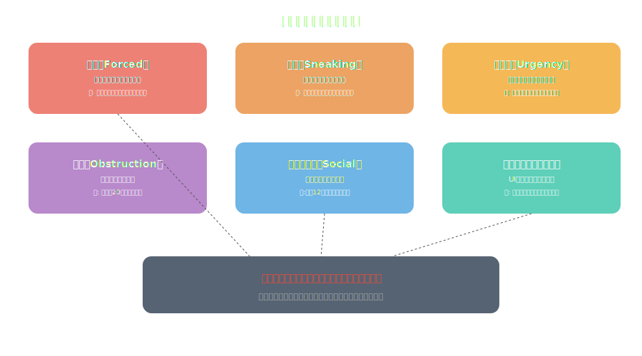

<!-- _class: lead -->
# ダークパターンの解剖学
ユーザーを欺くUIの仕組み

- 毎日あなたが操られている11のUIテクニック
- 認知バイアスの悪用からEU規制まで
- エシカルデザインの実践

---

# アジェンダ

- 1. ダークパターンとは何か
- 2. 6つの分類と具体例
- 3. なぜ効くのか：認知科学の視点
- 4. 企業にとってのリスク
- 5. 規制の動向（EU・FTC）
- 6. エシカルデザインの実践

---

<!-- _class: lead -->
# ダークパターンとは何か

---

# ハリー・ブリグヌルの定義（2010年）

- **「ユーザーが意図しない行動を取るよう誘導するUI設計」**
- 2010年にUXデザイナーのハリー・ブリグヌルが命名
- darkpatterns.org（現deceptive.design）で事例を収集
- ---
- ダークパターンは**バグではなく意図的な設計**
- A/Bテストで「効果がある」と検証された上で実装されている
- → **UXデザインの知識が悪用されている**

---

<!-- _class: lead -->
# 6つの分類と具体例

---

# ダークパターン分類マップ

---

# 1. 強制（Forced Action）

- **望まない選択をしないとサービスを使えなくする**
- 例：アカウント作成しないとゲスト購入できない
- 例：メール通知をONにしないと次に進めない
- 例：Facebook「友達を探す」で連絡先アクセスを強制
- **最も悪質な例：** アカウント削除に電話が必要（Amazonプライム旧仕様）
- → 「嫌なら使うな」という論理で正当化される

---

# 2. 欺瞞（Sneaking）

- **ユーザーが気づかないうちに操作する**
- 例：カートに「保証」が自動追加されている
- 例：無料トライアル終了後、通知なしで課金開始
- 例：利用規約変更のメールを「お知らせ」に紛れ込ませる
- 例：チェックボックスがデフォルトON（オプトアウト方式）
- → **「同意した」ことにされる**

---

# 3. 緊急性・希少性（Urgency / Scarcity）

- **急がせて冷静な判断を妨げる**
- 例：「残り2部屋！」（実際には十分ある）Booking.com
- 例：「このセールは24時間限定」（毎週やっている）
- 例：「今3人がこの商品を見ています」（数字は架空）
- 例：カウントダウンタイマー（期限後もリセットされる）
- → **FOMO（Fear of Missing Out）の悪用**

---

# 4. 妨害（Obstruction）

- **ユーザーが望む行動を意図的に困難にする**
- **登録は1クリック、解約は20ステップ** ← 典型例
- 例：Amazon プライム解約フロー（2022年訴訟で改善）
- 例：解約ページのリンクを意図的にわかりにくい場所に配置
- 例：「本当に退会しますか？」確認を3回要求
- → **「面倒だからやめよう」と思わせるのが目的**

---

<!-- _class: lead -->
# なぜ効くのか：認知科学の視点

---

# 悪用される4つの認知バイアス

- **1. 現状維持バイアス** ― デフォルト設定を変えない傾向
- チェックボックスのデフォルトON → 90%以上がそのまま
- **2. 損失回避** ― 得るより失う方が2倍痛い
- 「解約すると○○ポイントが消えます」→ 解約率が半減
- **3. 選択過負荷** ― 選択肢が多すぎると判断を放棄する
- Cookie同意画面を複雑にする → 「全て同意」を選ぶ
- **4. 社会的証明** ― 他人の行動に従う傾向
- 「98%のユーザーがプレミアムを選択」→ 同調圧力

---

<!-- _class: lead -->
# 企業にとってのリスク

---

# 短期利益、長期損失

- **短期：** コンバージョン率は確かに上がる
- **長期：** ブランド信頼の毀損、NPS低下、離脱率増加
- **法的リスク：** EU・FTCの規制強化（後述）
- **事例：** Epic Games、FTCに5.2億ドルの和解金（2022年）
- **事例：** Amazon、EU当局によるプライム解約フロー是正命令
- → **ダークパターンは「技術的負債」の一種**

---

<!-- _class: lead -->
# 規制の動向

---

# EU・FTCの対応

- **EU DSA（デジタルサービス法、2024年施行）**
- ダークパターンを明示的に禁止（初の包括的規制）
- 違反時：全世界売上の6%の制裁金
- **FTC（米国連邦取引委員会）**
- 2022年以降、ダークパターン訴訟を積極化
- Fortnite（Epic）、Amazon Prime が主要な判例に
- → **「デザインの自由」は「欺瞞の自由」ではない**

---

<!-- _class: lead -->
# エシカルデザインの実践

---

# エシカルデザイン5原則

- **1. 対称性** ― 登録と同じ簡単さで解約できるようにする
- **2. 透明性** ― 隠しコストなし、デフォルトは最小限に
- **3. 選択の自由** ― 全ての選択肢を同等に提示する
- **4. 正直さ** ― 偽の緊急性・希少性を使わない
- **5. 尊重** ― ユーザーの時間と注意を尊重する
- → **良いUXとエシカルなUXは矛盾しない**

---

<!-- _class: lead -->
# まとめ

- ダークパターンは**意図的に設計されたユーザー搾取のUI**
- 認知バイアスの悪用 → 短期的には「効く」が長期的にはブランドを壊す
- EU DSA・FTCの規制強化で法的リスクが急増中
- エシカルデザインは制約ではなく、持続可能なビジネスの基盤
- **問い：** あなたのプロダクトにダークパターンは潜んでいないか？

---

# 参考文献

- - **書籍・サイト:**
- - [Deceptive Patterns (旧 darkpatterns.org)](https://www.deceptive.design/)
- - [Evil by Design - Chris Nodder](https://www.amazon.com/dp/1118422147)
- - **規制:**
- - [EU Digital Services Act](https://digital-strategy.ec.europa.eu/)
- - [FTC Dark Patterns Report](https://www.ftc.gov/)

