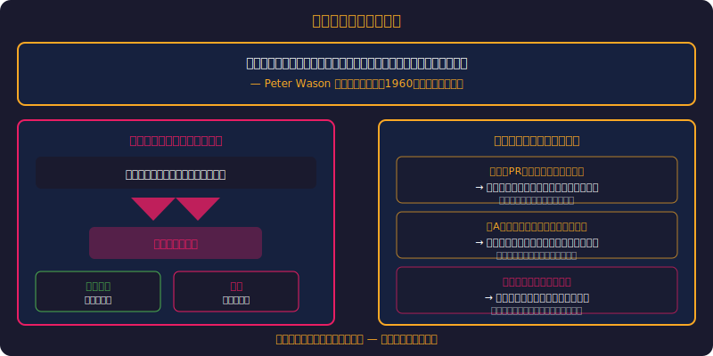
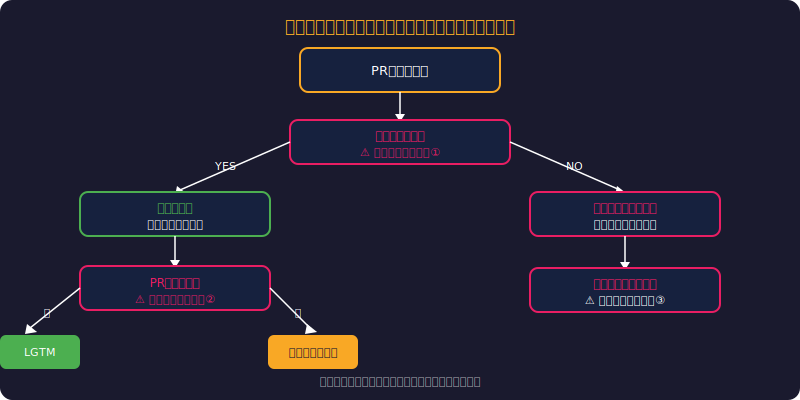
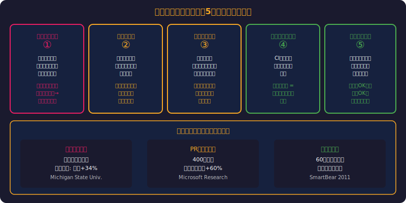
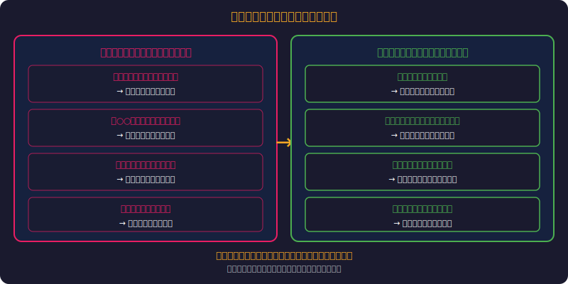
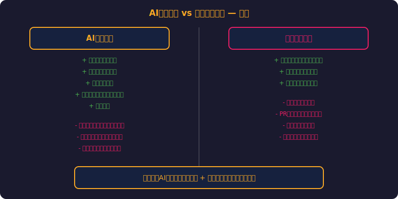
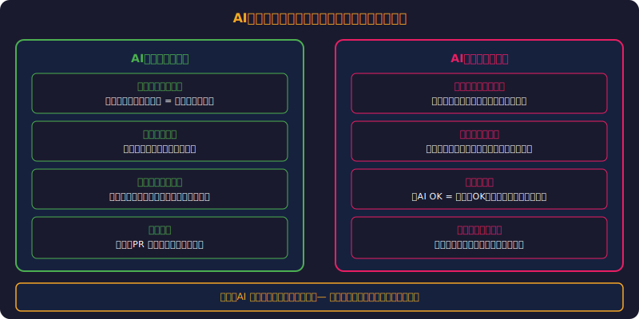

<!-- _class: invert lead -->
# 確証バイアスとコードレビュー
見たいものしか見えない問題

- コードレビューで「バグを見つけたい人」はバグを見つける
- 「承認したい人」は問題を見逃す
- 心理学が教えるレビュー品質の改善法

---

<!-- _class: invert fit-88 -->
# アジェンダ

> *確証バイアスの定義から実験・チーム力学・AI活用まで6章で解説*

1. 確証バイアスとは何か
2. コードレビューでの確証バイアス
3. 実験で証明された影響
4. チーム力学との相互作用
5. バイアスを軽減するプラクティス
6. AI レビューの可能性と限界

---

<!-- _class: invert lead -->
# 確証バイアスとは何か

---

<!-- _class: invert fit-58 -->
# 確証バイアスの定義

> *「知っている」と思った瞬間に客観性を失う認知の罠*

- **自分の既存の信念を支持する情報ばかり探し、矛盾する情報を無視する傾向**
- 1960年代にピーター・ウェイソンが実験で実証
- 人間の認知の最も根深いバイアスの一つ
- ---
- 例：「この薬は効く」と思っている医師 → 効いた患者ばかり記憶する
- 例：「このフレームワークは優秀」と思っているエンジニア → 問題を過小評価
- → **「知っている」と思った瞬間、客観性を失う**

---

<!-- _class: invert lead -->
# コードレビューでの確証バイアス

---

<!-- _class: invert fit-64 -->
# レビュアーの心理状態がレビューを決める

> *同じコードでも著者への先入観で結果が変わる構造的問題*

- **「この開発者は優秀だ」と思っている場合：**
- コードをざっと読む → 問題点を見逃す → LGTM
- 「きっと理由があるのだろう」と解釈してしまう
- ---
- **「このジュニアはミスが多い」と思っている場合：**
- 細かい点まで厳しくチェック → 些末な問題を大量に指摘
- **同じコードでもレビュアーの先入観で結果が変わる**

---

<!-- _class: invert fit-82 -->
# コードレビューに潜む5つのバイアス

> *著者・技術・規模・初頭効果・アンカリングが品質を歪める*

- **1. 著者バイアス** ― 知っている人のコードは甘く見る
- **2. 技術バイアス** ― 自分が推す技術の問題を見逃す
- **3. 規模バイアス** ― 小さなPRは「問題ないだろう」と油断
- **4. 初頭効果** ― 最初の数行で印象が決まり、以降はそれを確認
- **5. アンカリング** ― PR説明文の「軽微な修正」に引きずられる

---

<!-- _class: invert lead -->
# 実験で証明された影響

---

<!-- _class: invert fit-70 -->
# Microsoft Research の研究結果

> *200行以下のPRが最高バグ検出率、10分以内LGTMが最多*

- **数千件のコードレビューを分析した結果：**
- レビュアーが検出するバグの数は**プルリクエストのサイズに反比例**
- 200行以下のPR → バグ検出率が最も高い
- 400行を超えると → レビュアーの注意力が急激に低下
- 「LGTM（Looks Good To Me）」の出現率は**PR送信後10分以内が最多**
- → **小さなPRを短時間でレビューするのが最も効果的**

---

<!-- _class: invert fit-76 -->
# 「書いた人の名前」だけでレビューが変わる

> *シニア名で承認率35%増、匿名化がバイアス排除の切り札*

- **二重盲検的実験：** 同じコードを異なる著者名で提出
- 「シニアエンジニア」の名前 → 承認率が**35%高い**
- 「新人」の名前 → 指摘事項が**2.5倍**多い
- ---
- レビューの品質は**コードの質**ではなく**著者への期待**に左右される
- → 匿名レビュー（Author-blind review）の有効性を示唆

---

<!-- _class: invert lead -->
# チーム力学との相互作用

---

<!-- _class: invert fit-70 -->
# 権威バイアスとチーム内力学

> *心理的安全性が高いチームは指摘40%増・受け入れ60%増*

- **テックリードのコード** → 誰も反対意見を言いにくい
- 「この人が書いたなら正しいだろう」→ レビューが形骸化
- 逆にジュニアのコード → 過度に厳しいレビュー → 萎縮
- ---
- **Googleの研究：** 心理的安全性が高いチームは
- レビューでの指摘が**40%多い**が、修正の受け入れも**60%高い**
- → **フラットな関係性がレビュー品質を上げる**

---

<!-- _class: invert lead -->
# バイアスを軽減するプラクティス

---

<!-- _class: invert fit-76 -->
# レビュープロセスの改善

> *200行・チェックリスト・60分・ローテーションの4原則*

- **1. 小さなPR** ― 200行以下を推奨（注意力の限界を考慮）
- **2. チェックリスト** ― 見るべき観点を構造化する
- **3. 時間制限** ― 60分以上のレビューは効果が低下する
- **4. ローテーション** ― 同じ人が同じコードを毎回レビューしない
- **5. 著者情報の最小化** ― 可能なら匿名レビューを導入
- **6. 「悪魔の代弁者」役** ― 意図的に批判する役割を持ち回りで

---

<!-- _class: invert fit-94 -->
# レビュアーのマインドセット（1/2）

> *「バグを見つける」より「理解する」姿勢がバイアスを減らす*

- **「バグを見つける」のではなく「理解する」姿勢**
- 「このコードの意図は何か」を最初に問う
- 自分の好みと客観的品質を区別する
- 「なぜこう書いたのか」を著者に聞く習慣

---

<!-- _class: invert fit-94 -->
# レビュアーのマインドセット（2/2）

> *著者名を知らなければ同じレビューができるか自問することがバイアスの特効薬*

- ---
- **確認すべき質問：**
- 「もしこのコードの著者名を知らなかったら、同じレビューをするか？」
- → **自分のバイアスに気づく最も簡単な方法**

---

<!-- _class: invert lead -->
# AI レビューの可能性と限界

---

<!-- _class: invert fit-76 -->
# AIコードレビューは確証バイアスを解決するか（1/2）

> *著者バイアスゼロのAIと人間の組み合わせがベスト解*

- **AIの利点：** 著者バイアス・権威バイアスがない
- 全てのコードを同じ基準で一貫してチェック
- 人間が見逃しやすいパターン（セキュリティ脆弱性等）を検出
- ---

---

<!-- _class: invert fit-76 -->
# AIコードレビューは確証バイアスを解決するか（2/2）

> *学習データのバイアスを引き継ぐためAI単独では不十分*

- **AIの限界：** 学習データのバイアスを引き継ぐ
- 「よくあるパターン」=「良いパターン」と判断する傾向
- ビジネスロジックの妥当性は判断できない
- → **AI + 人間の組み合わせがベスト**

---

<!-- _class: invert lead -->
# まとめ

- 確証バイアスは**コードレビューの品質を構造的に歪める**
- 著者の評判・PRサイズ・技術的先入観が判断に影響する
- 小さなPR・チェックリスト・ローテーションで軽減可能
- 心理的安全性がレビュー品質の基盤
- **問い：** あなたの最後のLGTMは本当に「Good」だったか？

---

<!-- _class: invert fit-82 -->
# 参考文献

> *MSリサーチとGoogleのベストプラクティスに基づく厳選参考文献*

- **学術研究:**
- [Modern Code Review (ACM Computing Surveys)](https://dl.acm.org/)
- [Expectations, Outcomes, and Challenges of Modern Code Review (ICSE)](https://www.microsoft.com/en-us/research/)
- **実践ガイド:**
- [Google Engineering Practices: Code Review](https://google.github.io/eng-practices/)
- [SmartBear: Best Practices for Code Review](https://smartbear.com/)

