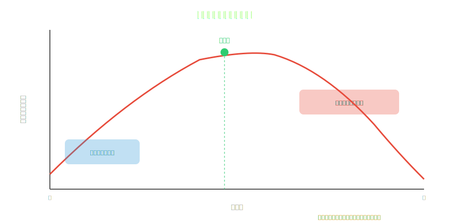

<!-- _class: lead -->
# 選択のパラドックス × SaaS
なぜ多機能ツールは使われないのか

- 機能が増えるほどユーザー満足度が下がる逆説
- バリー・シュワルツの心理学理論をプロダクト設計に応用
- 「Less is More」の科学的根拠

---

# アジェンダ

- 1. 選択のパラドックスとは
- 2. SaaSにおける選択過負荷
- 3. 機能数と満足度の非線形関係
- 4. 成功事例：引き算のデザイン
- 5. 料金プランの選択設計
- 6. プロダクト設計への実践的示唆

---

<!-- _class: lead -->
# 選択のパラドックスとは

---

# ジャムの実験（2000年）

- **コロンビア大学 シーナ・アイエンガーの有名な実験：**
- スーパーで6種類のジャムを陳列 → 購入率**30%**
- スーパーで24種類のジャムを陳列 → 購入率**3%**
- 選択肢が多いと人は「選べなくなる」
- ---
- **バリー・シュワルツ（2004年）が体系化：**
- 選択肢の増加 → 決定の困難 → 後悔の増加 → 満足度の低下

---

# なぜ選択肢が多いと不幸になるのか

- **1. 決定疲れ** ― 選択のたびに認知リソースを消費する
- **2. 機会費用の増大** ― 「選ばなかった方が良かったかも」
- **3. 期待値の上昇** ― 多い選択肢 = 完璧な選択ができるはず
- **4. 自己責任の増加** ― 選択肢が少なければ「仕方ない」と思える
- **5. 比較の泥沼** ― 選択肢同士の比較が指数関数的に増加

---

<!-- _class: lead -->
# SaaSにおける選択過負荷

---

# 機能の爆発がユーザーを殺す

- **Salesforce：** 3,000以上の設定項目 → 導入コンサルが必須
- **Jira：** カスタムフィールド無限 → チームが混乱
- **Notion：** 「何でもできる」→ 「何をすればいいかわからない」
- **Slack：** 通知設定だけで12ページのドキュメント
- ---
- **Pendo調査（2019）：** SaaSの機能の**80%は「ほとんど使われない」**
- → 作った機能の大半は無駄。それどころか害になっている

---

# 機能数と満足度の関係

---

<!-- _class: lead -->
# 成功事例：引き算のデザイン

---

# Basecampの哲学

- **「機能を追加しない」ことを戦略にしたSaaS**
- ガントチャートなし、タイムライン表示なし、カスタムフィールドなし
- 競合（Asana、Monday.com）の1/10の機能数
- しかし顧客満足度は最高クラス
- ---
- Jason Fried：「機能は負債。メンテ・サポート・UIの複雑さが増す」
- → **「何を作らないか」がプロダクト戦略**

---

# Linearの設計原則

- **「Issues, not features」** ― 機能ではなく課題に集中
- 設定項目を意図的に最小化
- 「カスタマイズ性」より「意見のあるデフォルト」を優先
- コマンドパレットで操作 → メニューの視覚的ノイズを排除
- Jiraの代替として急成長 → **制限が「売り」になる**
- → 「選べない」ことがユーザーを救う逆説

---

<!-- _class: lead -->
# 料金プランの選択設計

---

# 3択の法則

- **プランは3つが最適** ― 人間は3択を最も快適に処理できる
- Free / Pro / Enterprise が黄金パターン
- 中央の選択肢にハイライト ← **おとり効果（Decoy Effect）**
- 4つ以上のプラン → 決定疲れ → 無料プランのまま → 収益化失敗
- ---
- **Dropbox の失敗事例：** 5つのプランを並べて比較表を見せた結果
- コンバージョン率が**20%低下**（後にシンプル化で回復）

---

<!-- _class: lead -->
# プロダクト設計への実践的示唆

---

# 選択のパラドックスに対抗する5原則

- **1. デフォルトに意見を持つ** ― 「最も良い選択肢」を先に決める
- **2. 段階的開示** ― 初心者には基本機能のみ表示（Progressive Disclosure）
- **3. 3択ルール** ― 同時に提示する選択肢は最大3つ
- **4. 定期的な機能棚卸し** ― 使われていない機能は削除する勇気
- **5. 「何を作らないか」リスト** ― PRDに「Not Doing」セクションを入れる

---

<!-- _class: lead -->
# まとめ

- 選択のパラドックスは**SaaS製品設計の最大の落とし穴**の一つ
- 機能を増やすほど満足度が下がる ― 直感に反するが実証済み
- Basecamp、Linearのように「制限」を価値にする設計が勝つ時代
- プランは3択、機能は段階的開示、デフォルトには意見を持つ
- **「全てを提供する」より「最善を提供する」方が難しく、価値がある**

---

# 参考文献

- - **書籍:**
- - [The Paradox of Choice - Barry Schwartz](https://www.amazon.com/dp/0062449923)
- - [The Art of Choosing - Sheena Iyengar](https://www.amazon.com/dp/0446504114)
- - **データ:**
- - [Pendo: State of Product Leadership](https://www.pendo.io/)
- - [Product-Led Growth (Wes Bush)](https://www.amazon.com/dp/1777119316)

