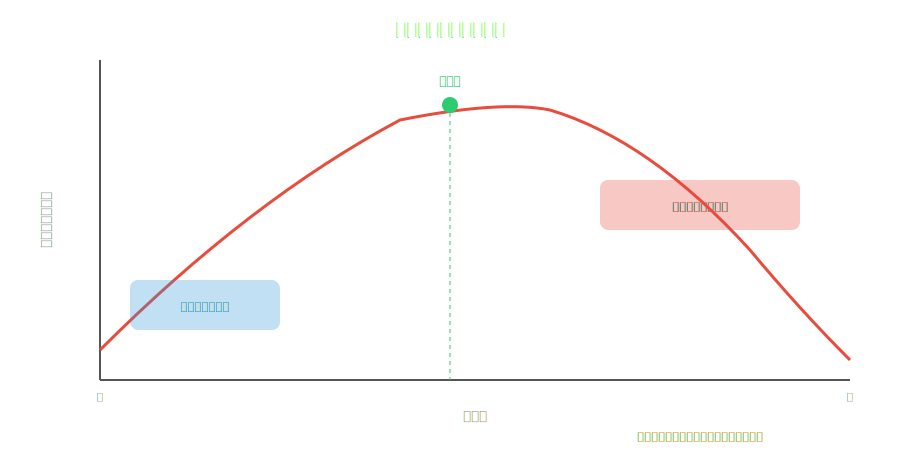

<!-- _class: lead -->
# 選択のパラドックス × SaaS
なぜ多機能ツールは使われないのか

- 機能が増えるほどユーザー満足度が下がる逆説
- バリー・シュワルツの心理学理論をプロダクト設計に応用
- 「Less is More」の科学的根拠

---

# アジェンダ

> *6つの視点で選択過負荷がSaaS設計に与える影響を明らかにする*

- 1. 選択のパラドックスとは
- 2. SaaSにおける選択過負荷
- 3. 機能数と満足度の非線形関係
- 4. 成功事例：引き算のデザイン
- 5. 料金プランの選択設計
- 6. プロダクト設計への実践的示唆

---

<!-- _class: lead -->
# 選択のパラドックスとは

---

# ジャムの実験（2000年）

> *選択肢を4倍にすると購入率が1/10に激減する実証*

- <svg viewBox="0 0 800 280" style="max-height:70vh;max-width:100%;display:block;margin:0 auto;"><rect width="800" height="280" fill="#1a1a2e"/><text x="400" y="32" text-anchor="middle" fill="#f9a825" font-size="14" font-weight="bold">選択肢の数と購入率（コロンビア大学実験 2000年）</text><rect x="80" y="55" width="240" height="180" rx="8" fill="#16213e" stroke="#4caf50" stroke-width="2"/><text x="200" y="82" text-anchor="middle" fill="#4caf50" font-size="13" font-weight="bold">6種類のジャム</text><rect x="100" y="95" width="200" height="110" rx="4" fill="#0d3b1f"/><rect x="100" y="148" width="200" height="57" rx="0" fill="#4caf50" opacity="0.7"/><text x="200" y="218" text-anchor="middle" fill="#ffffff" font-size="24" font-weight="bold">30%</text><text x="200" y="245" text-anchor="middle" fill="#4caf50" font-size="12">購入率</text><rect x="480" y="55" width="240" height="180" rx="8" fill="#16213e" stroke="#e91e63" stroke-width="2"/><text x="600" y="82" text-anchor="middle" fill="#e91e63" font-size="13" font-weight="bold">24種類のジャム</text><rect x="500" y="95" width="200" height="110" rx="4" fill="#3b0d0d"/><rect x="500" y="195" width="200" height="10" rx="0" fill="#e91e63" opacity="0.7"/><text x="600" y="218" text-anchor="middle" fill="#ffffff" font-size="24" font-weight="bold">3%</text><text x="600" y="245" text-anchor="middle" fill="#e91e63" font-size="12">購入率</text><polygon points="352,145 400,130 400,160" fill="#888"/><polygon points="448,145 400,130 400,160" fill="#888"/><text x="400" y="155" text-anchor="middle" fill="#f9a825" font-size="12" font-weight="bold">10×</text><text x="400" y="172" text-anchor="middle" fill="#aaaaaa" font-size="10">選択肢増加</text><text x="400" y="195" text-anchor="middle" fill="#e91e63" font-size="10">購入率 1/10</text></svg>
- **コロンビア大学 シーナ・アイエンガーの有名な実験：**
- スーパーで6種類のジャムを陳列 → 購入率**30%**
- スーパーで24種類のジャムを陳列 → 購入率**3%**
- 選択肢が多いと人は「選べなくなる」

---

# なぜ選択肢が多いと不幸になるのか

> *決定疲れ・機会費用・自己責任の4連鎖が満足度を破壊する*

- <svg viewBox="0 0 800 260" style="max-height:70vh;max-width:100%;display:block;margin:0 auto;"><rect width="800" height="260" fill="#1a1a2e"/><text x="400" y="30" text-anchor="middle" fill="#f9a825" font-size="14" font-weight="bold">選択肢増加 → 不幸のメカニズム</text><rect x="30" y="50" width="140" height="70" rx="6" fill="#16213e" stroke="#e91e63" stroke-width="2"/><text x="100" y="78" text-anchor="middle" fill="#e91e63" font-size="11" font-weight="bold">決定疲れ</text><text x="100" y="96" text-anchor="middle" fill="#aaaaaa" font-size="9">認知リソース消費</text><rect x="190" y="50" width="140" height="70" rx="6" fill="#16213e" stroke="#e91e63" stroke-width="2"/><text x="260" y="78" text-anchor="middle" fill="#e91e63" font-size="11" font-weight="bold">機会費用増大</text><text x="260" y="96" text-anchor="middle" fill="#aaaaaa" font-size="9">「他の方が良かった」</text><rect x="350" y="50" width="140" height="70" rx="6" fill="#16213e" stroke="#e91e63" stroke-width="2"/><text x="420" y="78" text-anchor="middle" fill="#e91e63" font-size="11" font-weight="bold">期待値上昇</text><text x="420" y="96" text-anchor="middle" fill="#aaaaaa" font-size="9">完璧選択できるはず</text><rect x="510" y="50" width="140" height="70" rx="6" fill="#16213e" stroke="#e91e63" stroke-width="2"/><text x="580" y="78" text-anchor="middle" fill="#e91e63" font-size="11" font-weight="bold">自己責任増大</text><text x="580" y="96" text-anchor="middle" fill="#aaaaaa" font-size="9">「自分が悪い」感覚</text><rect x="30" y="155" width="740" height="60" rx="8" fill="#16213e" stroke="#f9a825" stroke-width="2"/><text x="400" y="182" text-anchor="middle" fill="#f9a825" font-size="13" font-weight="bold">結果: 満足度の低下 → 後悔の増加</text><text x="400" y="202" text-anchor="middle" fill="#cccccc" font-size="11">バリー・シュワルツ「The Paradox of Choice」(2004年) による体系化</text><line x1="100" y1="120" x2="100" y2="155" stroke="#e91e63" stroke-width="1" stroke-dasharray="3,2"/><line x1="260" y1="120" x2="260" y2="155" stroke="#e91e63" stroke-width="1" stroke-dasharray="3,2"/><line x1="420" y1="120" x2="420" y2="155" stroke="#e91e63" stroke-width="1" stroke-dasharray="3,2"/><line x1="580" y1="120" x2="580" y2="155" stroke="#e91e63" stroke-width="1" stroke-dasharray="3,2"/></svg>
- **1. 決定疲れ** ― 選択のたびに認知リソースを消費する
- **2. 機会費用の増大** ― 「選ばなかった方が良かったかも」
- **3. 期待値の上昇** ― 多い選択肢 = 完璧な選択ができるはず
- **4. 自己責任の増加** ― 選択肢が少なければ「仕方ない」と思える

---

<!-- _class: lead -->
# SaaSにおける選択過負荷

---

# 機能の爆発がユーザーを殺す

> *Pendo調査：SaaS機能の80%はほぼ使われず害になっている*

- <svg viewBox="0 0 800 270" style="max-height:70vh;max-width:100%;display:block;margin:0 auto;"><rect width="800" height="270" fill="#1a1a2e"/><text x="400" y="30" text-anchor="middle" fill="#e91e63" font-size="14" font-weight="bold">SaaS機能爆発の実態</text><rect x="30" y="50" width="175" height="80" rx="6" fill="#16213e" stroke="#e91e63" stroke-width="2"/><text x="117" y="76" text-anchor="middle" fill="#e91e63" font-size="12" font-weight="bold">Salesforce</text><text x="117" y="96" text-anchor="middle" fill="#cccccc" font-size="10">3,000以上の設定項目</text><text x="117" y="114" text-anchor="middle" fill="#aaaaaa" font-size="9">導入コンサルが必須</text><rect x="220" y="50" width="175" height="80" rx="6" fill="#16213e" stroke="#e91e63" stroke-width="2"/><text x="307" y="76" text-anchor="middle" fill="#e91e63" font-size="12" font-weight="bold">Jira</text><text x="307" y="96" text-anchor="middle" fill="#cccccc" font-size="10">カスタムフィールド無限</text><text x="307" y="114" text-anchor="middle" fill="#aaaaaa" font-size="9">チームが混乱</text><rect x="410" y="50" width="175" height="80" rx="6" fill="#16213e" stroke="#f9a825" stroke-width="2"/><text x="497" y="76" text-anchor="middle" fill="#f9a825" font-size="12" font-weight="bold">Notion</text><text x="497" y="96" text-anchor="middle" fill="#cccccc" font-size="10">「何でもできる」</text><text x="497" y="114" text-anchor="middle" fill="#aaaaaa" font-size="9">→「何すればいい？」</text><rect x="600" y="50" width="170" height="80" rx="6" fill="#16213e" stroke="#f9a825" stroke-width="2"/><text x="685" y="76" text-anchor="middle" fill="#f9a825" font-size="12" font-weight="bold">Slack</text><text x="685" y="96" text-anchor="middle" fill="#cccccc" font-size="10">通知設定12ページ</text><text x="685" y="114" text-anchor="middle" fill="#aaaaaa" font-size="9">ドキュメント必須</text><rect x="60" y="165" width="680" height="70" rx="8" fill="#16213e" stroke="#4caf50" stroke-width="2"/><text x="400" y="192" text-anchor="middle" fill="#4caf50" font-size="13" font-weight="bold">Pendo調査（2019）：SaaSの機能の80%は「ほとんど使われない」</text><text x="400" y="214" text-anchor="middle" fill="#cccccc" font-size="11">作った機能の大半は無駄。それどころか「選択過負荷」により害になっている</text><text x="400" y="228" text-anchor="middle" fill="#aaaaaa" font-size="10">機能追加のたびに認知負荷が増加し、コアユースケースが埋もれる</text></svg>
- **Salesforce：** 3,000以上の設定項目 → 導入コンサルが必須
- **Jira：** カスタムフィールド無限 → チームが混乱
- **Pendo調査（2019）：** SaaSの機能の**80%は「ほとんど使われない」**
- → 作った機能の大半は無駄。それどころか害になっている

---

# 機能数と満足度の関係

---

<!-- _class: lead -->
# 成功事例：引き算のデザイン

---

# Basecampの哲学

> *競合の1/10機能で顧客満足度最高クラス、制限が「売り」になる*

- <svg viewBox="0 0 800 260" style="max-height:70vh;max-width:100%;display:block;margin:0 auto;"><rect width="800" height="260" fill="#1a1a2e"/><text x="400" y="30" text-anchor="middle" fill="#4caf50" font-size="14" font-weight="bold">Basecamp vs 競合：機能数の比較</text><rect x="30" y="50" width="220" height="170" rx="8" fill="#16213e" stroke="#4caf50" stroke-width="2"/><text x="140" y="76" text-anchor="middle" fill="#4caf50" font-size="13" font-weight="bold">Basecamp</text><rect x="50" y="90" width="180" height="30" rx="4" fill="#4caf50" opacity="0.3"/><text x="140" y="110" text-anchor="middle" fill="#4caf50" font-size="11">機能数: 少</text><text x="140" y="140" text-anchor="middle" fill="#cccccc" font-size="10">ガントチャート: なし</text><text x="140" y="158" text-anchor="middle" fill="#cccccc" font-size="10">カスタムフィールド: なし</text><text x="140" y="176" text-anchor="middle" fill="#cccccc" font-size="10">タイムライン: なし</text><text x="140" y="205" text-anchor="middle" fill="#4caf50" font-size="12" font-weight="bold">顧客満足度: 最高クラス</text><rect x="280" y="50" width="220" height="170" rx="8" fill="#16213e" stroke="#e91e63" stroke-width="2"/><text x="390" y="76" text-anchor="middle" fill="#e91e63" font-size="13" font-weight="bold">Asana</text><rect x="300" y="90" width="180" height="90" rx="4" fill="#e91e63" opacity="0.3"/><text x="390" y="110" text-anchor="middle" fill="#e91e63" font-size="11">機能数: 多</text><text x="390" y="145" text-anchor="middle" fill="#cccccc" font-size="10">ガントチャート: あり</text><text x="390" y="163" text-anchor="middle" fill="#cccccc" font-size="10">カスタムフィールド: あり</text><text x="390" y="181" text-anchor="middle" fill="#cccccc" font-size="10">タイムライン: あり</text><text x="390" y="205" text-anchor="middle" fill="#aaaaaa" font-size="11">学習コスト高</text><rect x="530" y="50" width="240" height="170" rx="8" fill="#16213e" stroke="#f9a825" stroke-width="2"/><text x="650" y="76" text-anchor="middle" fill="#f9a825" font-size="13" font-weight="bold">Jason Fried の言葉</text><text x="650" y="105" text-anchor="middle" fill="#cccccc" font-size="11">「機能は負債」</text><text x="650" y="125" text-anchor="middle" fill="#cccccc" font-size="11">メンテ・サポート・UI</text><text x="650" y="143" text-anchor="middle" fill="#cccccc" font-size="11">の複雑さが増す</text><text x="650" y="175" text-anchor="middle" fill="#f9a825" font-size="12" font-weight="bold">「何を作らないか」</text><text x="650" y="195" text-anchor="middle" fill="#f9a825" font-size="12" font-weight="bold">がプロダクト戦略</text></svg>
- **「機能を追加しない」ことを戦略にしたSaaS**
- ガントチャートなし、タイムライン表示なし、カスタムフィールドなし
- 競合（Asana、Monday.com）の1/10の機能数
- しかし顧客満足度は最高クラス
- Jason Fried：「機能は負債。メンテ・サポート・UIの複雑さが増す」

---

# Linearの設計原則

> *Jira代替として急成長、「意見のあるデフォルト」が競争優位*

- <svg viewBox="0 0 800 260" style="max-height:70vh;max-width:100%;display:block;margin:0 auto;"><rect width="800" height="260" fill="#1a1a2e"/><text x="400" y="28" text-anchor="middle" fill="#f9a825" font-size="14" font-weight="bold">Linear vs Jira：設計哲学の比較</text><rect x="30" y="50" width="340" height="180" rx="8" fill="#16213e" stroke="#e91e63" stroke-width="2"/><text x="200" y="78" text-anchor="middle" fill="#e91e63" font-size="13" font-weight="bold">Jira（フル機能）</text><text x="200" y="105" text-anchor="middle" fill="#cccccc" font-size="11">カスタムフィールド: 無制限</text><text x="200" y="125" text-anchor="middle" fill="#cccccc" font-size="11">ワークフロー: 完全カスタム</text><text x="200" y="145" text-anchor="middle" fill="#cccccc" font-size="11">UI: 設定が深すぎる</text><text x="200" y="175" text-anchor="middle" fill="#e91e63" font-size="11">導入コンサル必須</text><text x="200" y="195" text-anchor="middle" fill="#e91e63" font-size="11">認知負荷: 高</text><rect x="430" y="50" width="340" height="180" rx="8" fill="#16213e" stroke="#4caf50" stroke-width="2"/><text x="600" y="78" text-anchor="middle" fill="#4caf50" font-size="13" font-weight="bold">Linear（意見のある設計）</text><text x="600" y="105" text-anchor="middle" fill="#cccccc" font-size="11">「Issues, not features」</text><text x="600" y="125" text-anchor="middle" fill="#cccccc" font-size="11">設定: 意図的に最小化</text><text x="600" y="145" text-anchor="middle" fill="#cccccc" font-size="11">コマンドパレット操作</text><text x="600" y="175" text-anchor="middle" fill="#4caf50" font-size="11">即戦力で使える</text><text x="600" y="195" text-anchor="middle" fill="#4caf50" font-size="11">認知負荷: 低</text><rect x="200" y="245" width="400" height="10" rx="3" fill="#16213e"/></svg>
- **「Issues, not features」** ― 機能ではなく課題に集中
- 設定項目を意図的に最小化
- 「カスタマイズ性」より「意見のあるデフォルト」を優先
- コマンドパレットで操作 → メニューの視覚的ノイズを排除
- Jiraの代替として急成長 → **制限が「売り」になる**

---

<!-- _class: lead -->
# 料金プランの選択設計

---

# 3択の法則

> *Free/Pro/Enterpriseの3択とおとり効果で収益化失敗を防ぐ*

- <svg viewBox="0 0 800 270" style="max-height:70vh;max-width:100%;display:block;margin:0 auto;"><rect width="800" height="270" fill="#1a1a2e"/><text x="400" y="30" text-anchor="middle" fill="#f9a825" font-size="14" font-weight="bold">最適な料金プラン設計：3択の法則</text><rect x="40" y="55" width="200" height="180" rx="8" fill="#16213e" stroke="#4caf50" stroke-width="1"/><text x="140" y="82" text-anchor="middle" fill="#4caf50" font-size="14" font-weight="bold">Free</text><text x="140" y="105" text-anchor="middle" fill="#cccccc" font-size="11">基本機能</text><text x="140" y="125" text-anchor="middle" fill="#aaaaaa" font-size="10">制限あり</text><text x="140" y="200" text-anchor="middle" fill="#4caf50" font-size="18" font-weight="bold">$0</text><text x="140" y="222" text-anchor="middle" fill="#aaaaaa" font-size="10">/月</text><rect x="300" y="45" width="200" height="200" rx="8" fill="#16213e" stroke="#f9a825" stroke-width="3"/><text x="400" y="72" text-anchor="middle" fill="#f9a825" font-size="14" font-weight="bold">Pro</text><rect x="315" y="80" width="170" height="20" rx="3" fill="#f9a825" opacity="0.3"/><text x="400" y="95" text-anchor="middle" fill="#f9a825" font-size="10">おすすめ ← おとり効果</text><text x="400" y="118" text-anchor="middle" fill="#cccccc" font-size="11">全機能利用可能</text><text x="400" y="138" text-anchor="middle" fill="#cccccc" font-size="10">優先サポート</text><text x="400" y="195" text-anchor="middle" fill="#f9a825" font-size="22" font-weight="bold">$29</text><text x="400" y="220" text-anchor="middle" fill="#aaaaaa" font-size="10">/月</text><rect x="560" y="55" width="200" height="180" rx="8" fill="#16213e" stroke="#888" stroke-width="1"/><text x="660" y="82" text-anchor="middle" fill="#888" font-size="14" font-weight="bold">Enterprise</text><text x="660" y="105" text-anchor="middle" fill="#cccccc" font-size="11">カスタム機能</text><text x="660" y="125" text-anchor="middle" fill="#aaaaaa" font-size="10">専任サポート</text><text x="660" y="200" text-anchor="middle" fill="#888" font-size="18" font-weight="bold">要相談</text><rect x="80" y="255" width="640" height="12" rx="3" fill="#16213e"/><text x="400" y="264" text-anchor="middle" fill="#aaaaaa" font-size="9">4つ以上のプラン → 決定疲れ → 無料のまま → 収益化失敗</text></svg>
- **プランは3つが最適** ― 人間は3択を最も快適に処理できる
- Free / Pro / Enterprise が黄金パターン
- 中央の選択肢にハイライト ← **おとり効果（Decoy Effect）**
- 4つ以上のプラン → 決定疲れ → 無料プランのまま → 収益化失敗

---

<!-- _class: lead -->
# プロダクト設計への実践的示唆

---

# 選択のパラドックスに対抗する5原則

> *意見あるデフォルト・段階的開示・3択・棚卸し・Not Doingリスト*

- <svg viewBox="0 0 800 260" style="max-height:70vh;max-width:100%;display:block;margin:0 auto;"><rect width="800" height="260" fill="#1a1a2e"/><text x="400" y="28" text-anchor="middle" fill="#4caf50" font-size="14" font-weight="bold">選択過負荷に対抗する5原則</text><rect x="30" y="50" width="220" height="65" rx="6" fill="#16213e" stroke="#4caf50" stroke-width="2"/><text x="140" y="76" text-anchor="middle" fill="#4caf50" font-size="11" font-weight="bold">1. 意見のあるデフォルト</text><text x="140" y="96" text-anchor="middle" fill="#cccccc" font-size="10">最善選択肢を先に決める</text><rect x="290" y="50" width="220" height="65" rx="6" fill="#16213e" stroke="#f9a825" stroke-width="2"/><text x="400" y="76" text-anchor="middle" fill="#f9a825" font-size="11" font-weight="bold">2. 段階的開示</text><text x="400" y="96" text-anchor="middle" fill="#cccccc" font-size="10">初心者には基本機能のみ</text><rect x="550" y="50" width="220" height="65" rx="6" fill="#16213e" stroke="#2196f3" stroke-width="2"/><text x="660" y="76" text-anchor="middle" fill="#2196f3" font-size="11" font-weight="bold">3. 3択ルール</text><text x="660" y="96" text-anchor="middle" fill="#cccccc" font-size="10">同時提示は最大3つ</text><rect x="160" y="140" width="220" height="65" rx="6" fill="#16213e" stroke="#e91e63" stroke-width="2"/><text x="270" y="166" text-anchor="middle" fill="#e91e63" font-size="11" font-weight="bold">4. 定期的棚卸し</text><text x="270" y="186" text-anchor="middle" fill="#cccccc" font-size="10">未使用機能を削除する勇気</text><rect x="420" y="140" width="220" height="65" rx="6" fill="#16213e" stroke="#ff9800" stroke-width="2"/><text x="530" y="166" text-anchor="middle" fill="#ff9800" font-size="11" font-weight="bold">5. Not Doing リスト</text><text x="530" y="186" text-anchor="middle" fill="#cccccc" font-size="10">PRDに「作らない」を明記</text><rect x="200" y="225" width="400" height="25" rx="4" fill="#16213e" stroke="#888" stroke-width="1"/><text x="400" y="242" text-anchor="middle" fill="#aaaaaa" font-size="10">「全てを提供する」より「最善を提供する」方が難しく価値がある</text></svg>
- **1. デフォルトに意見を持つ** ― 「最も良い選択肢」を先に決める
- **2. 段階的開示** ― 初心者には基本機能のみ表示（Progressive Disclosure）
- **3. 3択ルール** ― 同時に提示する選択肢は最大3つ
- **4. 定期的な機能棚卸し** ― 使われていない機能は削除する勇気
- **5. 「何を作らないか」リスト** ― PRDに「Not Doing」セクションを入れる

---

<!-- _class: lead -->
# まとめ

- <svg viewBox="0 0 800 240" style="max-height:70vh;max-width:100%;display:block;margin:0 auto;"><rect width="800" height="240" fill="#1a1a2e"/><text x="400" y="28" text-anchor="middle" fill="#f9a825" font-size="14" font-weight="bold">選択のパラドックス × SaaS まとめ</text><rect x="30" y="50" width="340" height="70" rx="6" fill="#16213e" stroke="#e91e63" stroke-width="2"/><text x="200" y="76" text-anchor="middle" fill="#e91e63" font-size="12" font-weight="bold">逆説: 機能追加 → 満足度低下</text><text x="200" y="96" text-anchor="middle" fill="#cccccc" font-size="10">ジャム実験・Pendo調査で実証済み</text><rect x="430" y="50" width="340" height="70" rx="6" fill="#16213e" stroke="#4caf50" stroke-width="2"/><text x="600" y="76" text-anchor="middle" fill="#4caf50" font-size="12" font-weight="bold">勝ちパターン: 引き算設計</text><text x="600" y="96" text-anchor="middle" fill="#cccccc" font-size="10">Basecamp・Linear: 制限が「売り」</text><rect x="30" y="145" width="340" height="70" rx="6" fill="#16213e" stroke="#f9a825" stroke-width="2"/><text x="200" y="171" text-anchor="middle" fill="#f9a825" font-size="12" font-weight="bold">プランは3択が最適</text><text x="200" y="191" text-anchor="middle" fill="#cccccc" font-size="10">おとり効果 + 決定疲れ防止</text><rect x="430" y="145" width="340" height="70" rx="6" fill="#16213e" stroke="#2196f3" stroke-width="2"/><text x="600" y="171" text-anchor="middle" fill="#2196f3" font-size="12" font-weight="bold">段階的開示が鍵</text><text x="600" y="191" text-anchor="middle" fill="#cccccc" font-size="10">初心者→上級者で機能を開放</text></svg>
- 選択のパラドックスは**SaaS製品設計の最大の落とし穴**の一つ
- 機能を増やすほど満足度が下がる ― 直感に反するが実証済み
- Basecamp、Linearのように「制限」を価値にする設計が勝つ時代
- **「全てを提供する」より「最善を提供する」方が難しく、価値がある**

---

# 参考文献

> *選択のパラドックス理論とSaaSプロダクト設計の学術的基盤を提示する*

- - **書籍:**
- - [The Paradox of Choice - Barry Schwartz](https://www.amazon.com/dp/0062449923)
- - [The Art of Choosing - Sheena Iyengar](https://www.amazon.com/dp/0446504114)
- - **データ:**
- - [Pendo: State of Product Leadership](https://www.pendo.io/)
- - [Product-Led Growth (Wes Bush)](https://www.amazon.com/dp/1777119316)

