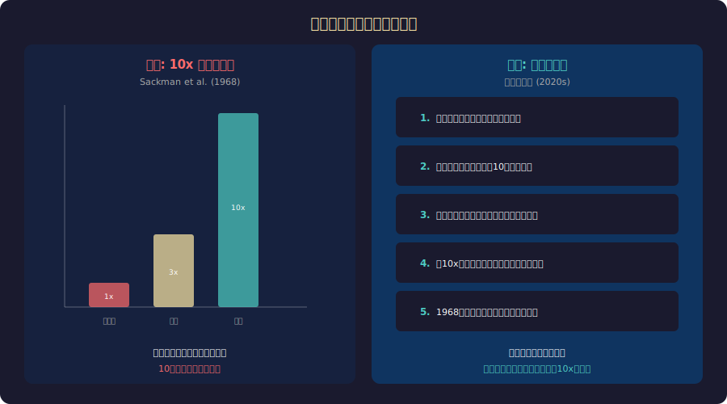

<!-- _class: lead -->
# 10xエンジニア神話

- 天才プログラマーは存在するか？
- 2026-02-20

---

# 目次

- - 1. 10xエンジニアの起源
- - 2. 元の研究の問題点
- - 3. 生産性は何で測るか
- - 4. 個人 vs チームの生産性
- - 5. 「天才」の害
- - 6. 本当に生産性を上げるもの

---

<!-- _class: lead -->
# 1. 10xエンジニアの起源

---

# 1968年の伝説的研究

- - **Sackman, Erikson & Grant (1968)**: プログラマー間の生産性差を測定
- - 結果: 最も速い人と遅い人で **28倍** の差を報告
- - この結果が「10xエンジニア」の概念の起源
- - Brooks "The Mythical Man-Month" (1975) で広く引用される
- - Steve McConnell "Code Complete" でも「10倍の差がある」と言及
- - 以後50年以上、業界で当然視されてきた「常識」

---

# 神話 vs 現実

---

<!-- _class: lead -->
# 2. 元の研究の問題点

---

# なぜ28倍は信頼できないか

- - **サンプルサイズ**: たった12人のプログラマー
- - **測定方法**: デバッグ時間とコーディング時間を別々に測定
- - **タスクの違い**: 経験のあるタスクと初めてのタスクを混在
- - **外れ値の扱い**: 1人の極端に遅い人が倍率を跳ね上げた
- - **再現性**: 同じ条件での追試がほとんど行われていない
- - 最大値/最小値の比較 = 統計的に無意味

---

<!-- _class: lead -->
# 3. 生産性は何で測るか

---

# コード行数の罠

- - **LOC (Lines of Code)** で測定 → コード量 = 生産性？
- - 「最良のコードは書かれなかったコードである」
- - 10行で解決する天才と100行で解決する凡人: どちらが生産的？
- - バグを生み出すコード量が多い人は「非生産的」
- - **DORA指標** (Google): デプロイ頻度、リードタイム、MTTR、変更失敗率
- - 個人ではなくチームの「フロー」を測る方向に

---

# 見えない生産性

- - **コードレビュー**: 他人のコード品質を向上させる
- - **メンタリング**: チーム全体の能力を底上げする
- - **設計判断**: 良いアーキテクチャで将来の問題を防ぐ
- - **ドキュメント**: オンボーディング時間を短縮する
- - **コミュニケーション**: 要件の齟齬を早期発見する
- - 「10xエンジニア」が測らない価値がチームを支える

---

<!-- _class: lead -->
# 4. 個人 vs チーム

---

# 「天才個人」モデルの限界

- - Linuxカーネル: Linus Torvaldsだけでなく数千人の貢献者
- - Wikipedia: 個人の天才ではなく集合知
- - **Google "Project Aristotle"**: 最強チームの条件は「心理的安全性」
- - 個人の能力 < チームのダイナミクス
- - 10x個人よりも「1.5xを6人揃えたチーム」の方が強い
- - コンテキストスイッチ、バス係数、知識共有の問題

---

# 環境が生産性を決める

- - **SPACE framework** (GitHub/MS/University of Victoria):
- - Satisfaction, Performance, Activity, Communication, Efficiency
- - 同じエンジニアでも環境で生産性が3-5倍変わる
- - **阻害要因**: 会議過多、コンテキストスイッチ、承認待ち、技術的負債
- - **促進要因**: 集中時間、良いツール、明確な要件、自律性
- - 「10xエンジニア」の多くは「10x環境」にいるだけ

---

<!-- _class: lead -->
# 5. 「天才」の害

---

# 10x神話がもたらす弊害

- - **ロックスターカルチャー**: 一部の「天才」に過度に依存する組織
- - **バス係数1**: その人が辞めたらプロジェクトが止まる
- - **有害な行動の容認**: 生産性が高ければ態度が悪くても許される
- - **多様性の阻害**: 「天才像」= 若い白人男性のステレオタイプ
- - **燃え尽き症候群**: 「10x」を期待されるプレッシャー
- - **チーム文化の破壊**: 個人の英雄が協調を妨げる

---

# Googleの「No Brilliant Jerks」方針

- - Netflix, Google等: 「優秀だが有害な人を雇わない」方針
- - 研究: チームの**最も弱い** メンバーではなく**最も有害な**メンバーがパフォーマンスを決める
- - 1人の「ブリリアント・ジャーク」の悪影響 > 1人の10xの貢献
- - 周囲のモチベーション低下、離職率増加、心理的安全性の喪失
- - **採用の教訓**: 技術力だけでなく協調性を評価する

---

<!-- _class: lead -->
# 6. 本当に生産性を上げるもの

---

# エビデンスに基づく生産性向上

- - **Developer Experience (DX)**: 開発者の日常体験を改善する
- - **CI/CD**: 自動化でフィードバックループを短縮する
- - **テスト文化**: 恐怖なくコードを変更できる環境
- - **ペアプログラミング**: 知識共有 + リアルタイムレビュー
- - **技術的負債の返済**: 定期的にメンテナンス時間を確保
- - **認知負荷の削減**: シンプルなアーキテクチャ、良いドキュメント

---

# まとめ

- - 「10xエンジニア」の元の研究は方法論に重大な問題がある
- - 生産性はコード行数では測れない — 見えない価値を見る
- - 個人の天才よりチームのダイナミクスが重要
- - 10x神話はロックスターカルチャーと有害行動の温床
- - 環境・ツール・文化が生産性の最大の決定因子
- - **10xエンジニアを探すより、10xチームを作る方が現実的**

---

# 参考文献

- - **研究:**
- - Sackman, H. et al. (1968) "Exploratory experimental studies"
- - Forsgren, N. et al. "Accelerate" (2018) - DORA指標
- - **書籍:**
- - McConnell, S. "Code Complete" (2004)
- - Edmondson, A. "The Fearless Organization" (2018)

