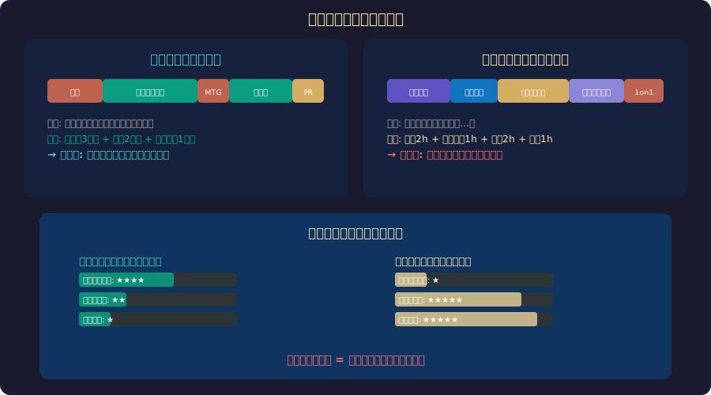

<!-- _class: lead -->
# ノーコードデーは本当に生産的か？

- コードを書かない日の価値を再評価する
- 2026-02-20

---

# 目次

- - 1. 「生産的な一日」の定義
- - 2. コード行数バイアス
- - 3. 見えない仕事の価値
- - 4. シニアエンジニアのパラドックス
- - 5. 組織としての生産性
- - 6. まとめ

---

<!-- _class: lead -->
# 1. 「生産的な一日」の定義

---

# あなたは今日、生産的でしたか？

- - 多くの開発者の回答: 「たくさんコードを書いた日 = 良い日」
- - **GitHub Contributions** のグラフが緑色 = 充実感
- - コミット数、PR数、マージ数で「成果」を測る文化
- - 会議だけの日 → 「何もしなかった」という罪悪感
- - ドキュメントを書いた日 → 「本当の仕事をしていない」
- - この感覚は正しいのか？

---

# 「生産的な一日」の解剖

---

<!-- _class: lead -->
# 2. コード行数バイアス

---

# コード = 生産性という幻想

- - **Bill Gates**: 「コード行数で進捗を測るのは重量で飛行機の進捗を測るようなもの」
- - LOC (Lines of Code) は1960年代からの計測手法
- - 10行で解決する人と100行で解決する人、どちらが優秀？
- - **最良のコードは書かれなかったコード**
- - 削除したコード行数こそが真の貢献の場合もある
- - コード量 ≠ 価値量

---

# Activity ≠ Progress

- - **GitHub調査 (2024)**: 開発者の自己評価「生産的な日」の特徴
- - 1位: 集中してコードを書けた日 (72%)
- - 2位: 難しいバグを解決した日 (68%)
- - 3位: 設計の重要な判断をした日 (31%)
- - 4位: チームメンバーを助けた日 (24%)
- - → コードを書く行為そのものに「生産性」の幻想が張り付いている

---

<!-- _class: lead -->
# 3. 見えない仕事の価値

---

# Glue Work — チームを支える接着剤

- - **Tanya Reilly (2019)**: "Being Glue" — 組織を機能させる見えない仕事
- - コードレビュー: バグを未然に防ぎ、知識を共有する
- - オンボーディング: 新メンバーの立ち上がりを3ヶ月→1ヶ月に短縮
- - ドキュメント: 同じ質問に何度も答える時間を削減
- - 技術選定: 間違った技術選択の回避 = 数ヶ月の節約
- - これらは **コミットログに残らない**

---

# 乗数効果 (Multiplier Effect)

- - **自分で100行のコードを書く** → 100行分の価値
- - **5人のコードレビューで各20行の改善** → 100行分 + バグ防止
- - **良い設計ドキュメントを書く** → チーム全員の開発速度向上
- - **CI/CDパイプラインを改善** → 全員のデプロイ時間短縮
- - **メンタリング** → ジュニアの成長 = 将来の生産性
- - 自分の手を動かすより、チーム全体を速くする方が影響大

---

<!-- _class: lead -->
# 4. シニアエンジニアのパラドックス

---

# コードを書かなくなる問題

- - シニアになるほどコードを書く時間が減る
- - 会議、レビュー、設計、メンタリングに時間を使う
- - **「最近コード書いてないな…」** という不安
- - しかし: シニアの価値は **判断力** にある
- - 「この設計はスケールしない」→ 一言で3ヶ月の手戻り防止
- - 「そのライブラリは使うな」→ セキュリティリスク回避

---

# Staff+ エンジニアの一日

- - **Gergely Orosz (2023)**: Staff Engineerの典型的な時間配分
- - コーディング: 20-30%
- - 設計・アーキテクチャ議論: 25-35%
- - コードレビュー・メンタリング: 20-25%
- - ドキュメント・RFC: 10-15%
- - 組織横断コミュニケーション: 10-15%
- - → コードを書く時間は全体の1/4未満

---

<!-- _class: lead -->
# 5. 組織としての生産性

---

# DORA指標が教えること

- - **DORA (DevOps Research and Assessment)**: チーム生産性の4指標
- - デプロイ頻度: どれだけ頻繁にリリースできるか
- - リードタイム: コミットからデプロイまでの時間
- - MTTR: 障害からの復旧時間
- - 変更失敗率: デプロイが障害を起こす割合
- - → すべて **チーム** の指標であり、個人のコード量は無関係

---

# SPACE Framework

- - **GitHub/MS/University of Victoria (2021)**: 開発者生産性の5次元
- - **S**atisfaction: 仕事への満足度
- - **P**erformance: 成果の質と影響
- - **A**ctivity: 測定可能な活動量（コミット数など）
- - **C**ommunication: チーム内の情報フロー
- - **E**fficiency: フロー状態の維持、中断の少なさ
- - Activity は5つのうちの **1つ** に過ぎない

---

# まとめ

- - 「コードを書いた = 生産的」は危険なバイアス
- - 見えない仕事 (Glue Work) がチームを支えている
- - 乗数効果: 自分のコードより、チーム全体を速くする方が価値が大きい
- - シニアエンジニアの価値は判断力にある
- - DORA/SPACEはチームの生産性を多次元で測る
- - **ノーコードデーを罪悪感なく過ごせるチームが最強**

---

# 参考文献

- - **研究:**
- - Forsgren, N. et al. "Accelerate" (2018) - DORA指標
- - Forsgren, N. et al. "The SPACE of Developer Productivity" (2021)
- - **記事:**
- - Reilly, T. "Being Glue" (2019)
- - Orosz, G. "The Software Engineer's Guidebook" (2023)

