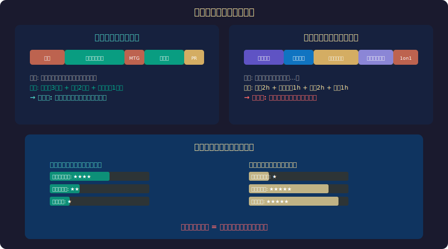
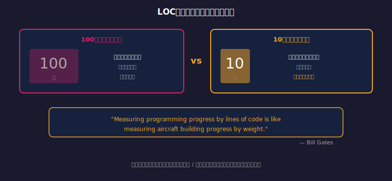
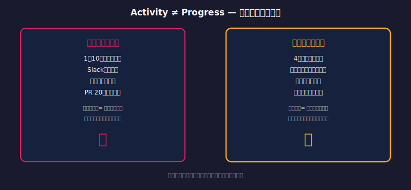
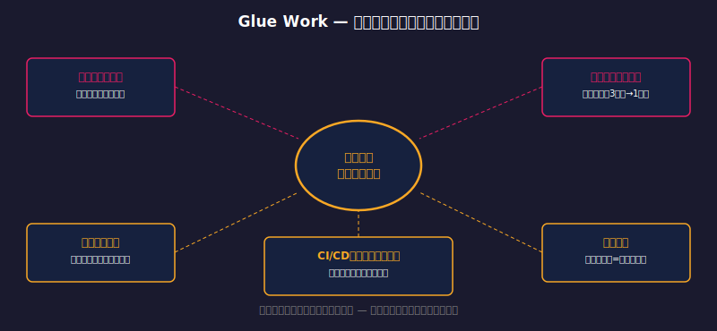
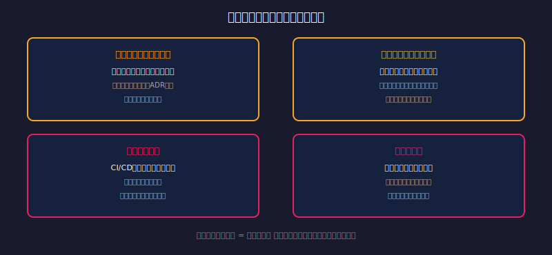
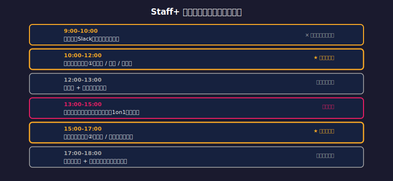
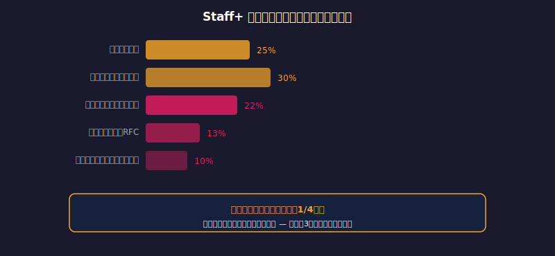
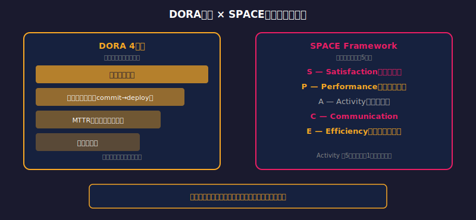

<!-- _class: invert lead -->
# ノーコードデーは本当に生産的か？

- コードを書かない日の価値を再評価する
- 2026-02-20

---

<!-- _class: invert fit-88 -->
# 目次

> *コード行数バイアスから乗数効果・DORA指標まで6章で検証*

- 1. 「生産的な一日」の定義
- 2. コード行数バイアス
- 3. 見えない仕事の価値
- 4. シニアエンジニアのパラドックス
- 5. 組織としての生産性
- 6. まとめ

---

<!-- _class: invert lead -->
# 1. 「生産的な一日」の定義

---

<!-- _class: invert fit-76 -->
# あなたは今日、生産的でしたか？

> *コミット数バイアスが見えない価値を消している*

- 多くの開発者の回答: 「たくさんコードを書いた日 = 良い日」
- **GitHub Contributions** のグラフが緑色 = 充実感
- コミット数、PR数、マージ数で「成果」を測る文化
- 会議だけの日 → 「何もしなかった」という罪悪感
- ドキュメントを書いた日 → 「本当の仕事をしていない」
- この感覚は正しいのか？

---

# 「生産的な一日」の解剖

---

<!-- _class: invert lead -->
# 2. コード行数バイアス

---

<!-- _class: invert fit-70 -->
# コード = 生産性という幻想

> *最良のコードは書かれなかったコードである*

- **Bill Gates**: 「コード行数で進捗を測るのは重量で飛行機の進捗を測るようなもの」
- LOC (Lines of Code) は1960年代からの計測手法
- 10行で解決する人と100行で解決する人、どちらが優秀？
- **最良のコードは書かれなかったコード**
- 削除したコード行数こそが真の貢献の場合もある
- コード量 ≠ 価値量

---

<!-- _class: invert fit-70 -->
# Activity ≠ Progress

> *自己評価「生産的」の72%は集中コーディング日*

- **GitHub調査 (2024)**: 開発者の自己評価「生産的な日」の特徴
- 1位: 集中してコードを書けた日 (72%)
- 2位: 難しいバグを解決した日 (68%)
- 3位: 設計の重要な判断をした日 (31%)
- 4位: チームメンバーを助けた日 (24%)
- → コードを書く行為そのものに「生産性」の幻想が張り付いている

---

<!-- _class: invert lead -->
# 3. 見えない仕事の価値

---

<!-- _class: invert fit-64 -->
# Glue Work — チームを支える接着剤

> *コミットログに残らない仕事がチームを支える*

- **Tanya Reilly (2019)**: "Being Glue" — 組織を機能させる見えない仕事
- コードレビュー: バグを未然に防ぎ、知識を共有する
- オンボーディング: 新メンバーの立ち上がりを3ヶ月→1ヶ月に短縮
- ドキュメント: 同じ質問に何度も答える時間を削減
- 技術選定: 間違った技術選択の回避 = 数ヶ月の節約
- これらは **コミットログに残らない**

---

<!-- _class: invert fit-76 -->
# 乗数効果 (Multiplier Effect)

> *チーム全体を速くする方が自分を速くするより大*

- **自分で100行のコードを書く** → 100行分の価値
- **5人のコードレビューで各20行の改善** → 100行分 + バグ防止
- **良い設計ドキュメントを書く** → チーム全員の開発速度向上
- **CI/CDパイプラインを改善** → 全員のデプロイ時間短縮
- **メンタリング** → ジュニアの成長 = 将来の生産性
- 自分の手を動かすより、チーム全体を速くする方が影響大

---

<!-- _class: invert lead -->
# 4. シニアエンジニアのパラドックス

---

<!-- _class: invert fit-76 -->
# コードを書かなくなる問題

> *シニアの一言が3ヶ月の手戻りを防ぐ*

- シニアになるほどコードを書く時間が減る
- 会議、レビュー、設計、メンタリングに時間を使う
- **「最近コード書いてないな…」** という不安
- しかし: シニアの価値は **判断力** にある
- 「この設計はスケールしない」→ 一言で3ヶ月の手戻り防止
- 「そのライブラリは使うな」→ セキュリティリスク回避

---

<!-- _class: invert fit-64 -->
# Staff+ エンジニアの一日

> *コーディング20%—残り80%が組織の乗数効果*

- **Gergely Orosz (2023)**: Staff Engineerの典型的な時間配分
- コーディング: 20-30%
- 設計・アーキテクチャ議論: 25-35%
- コードレビュー・メンタリング: 20-25%
- ドキュメント・RFC: 10-15%
- 組織横断コミュニケーション: 10-15%
- → コードを書く時間は全体の1/4未満

---

<!-- _class: invert lead -->
# 5. 組織としての生産性

---

<!-- _class: invert fit-82 -->
# DORA指標が教えること

> *4指標はすべてチーム単位—個人行数は無関係*

- **DORA (DevOps Research and Assessment)**: チーム生産性の4指標
- デプロイ頻度: どれだけ頻繁にリリースできるか
- リードタイム: コミットからデプロイまでの時間
- MTTR: 障害からの復旧時間
- 変更失敗率: デプロイが障害を起こす割合
- → すべて **チーム** の指標であり、個人のコード量は無関係

---

<!-- _class: invert fit-64 -->
# SPACE Framework

> *Activityは5次元中の1つに過ぎない*

- **GitHub/MS/University of Victoria (2021)**: 開発者生産性の5次元
- **S**atisfaction: 仕事への満足度
- **P**erformance: 成果の質と影響
- **A**ctivity: 測定可能な活動量（コミット数など）
- **C**ommunication: チーム内の情報フロー
- **E**fficiency: フロー状態の維持、中断の少なさ
- Activity は5つのうちの **1つ** に過ぎない

---

<!-- _class: invert fit-82 -->
# まとめ

> *ノーコードデーを罪悪感なく過ごせるチームが最強*

- 「コードを書いた = 生産的」は危険なバイアス
- 見えない仕事 (Glue Work) がチームを支えている
- 乗数効果: 自分のコードより、チーム全体を速くする方が価値が大きい
- シニアエンジニアの価値は判断力にある
- DORA/SPACEはチームの生産性を多次元で測る
- **ノーコードデーを罪悪感なく過ごせるチームが最強**

---

<!-- _class: invert fit-76 -->
# 参考文献

> *DORA/SPACE/Being Glue—ノーコード価値を裏付ける4文献*

- **研究:**
- Forsgren, N. et al. "Accelerate" (2018) - DORA指標
- Forsgren, N. et al. "The SPACE of Developer Productivity" (2021)
- **記事:**
- Reilly, T. "Being Glue" (2019)
- Orosz, G. "The Software Engineer's Guidebook" (2023)

