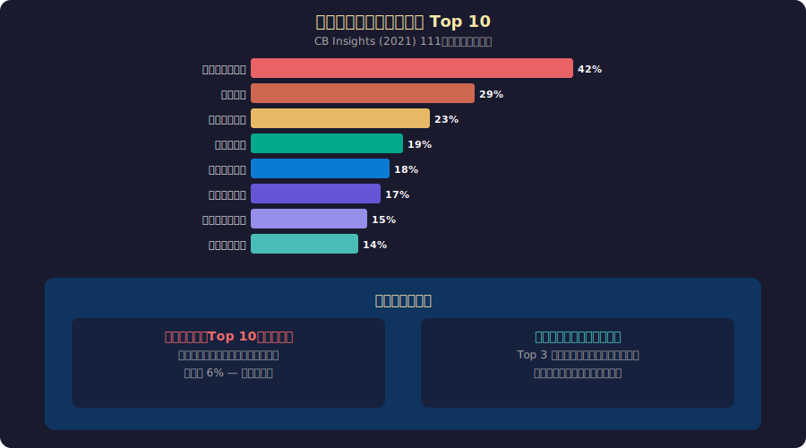

<!-- _class: lead -->
# スタートアップが失敗する本当の理由

- 技術ではなく、人と市場の問題
- 2026-02-20

---

# 目次

- - 1. 失敗率の現実
- - 2. 失敗理由のデータ
- - 3. 「市場ニーズなし」の深層
- - 4. チームの問題
- - 5. タイミングの科学
- - 6. まとめ

---

<!-- _class: lead -->
# 1. 失敗率の現実

---

# スタートアップの生存率

- - **90%** のスタートアップが失敗する（Startup Genome Report）
- - 1年目生存率: 約80%
- - 3年目生存率: 約50%
- - 5年目生存率: 約30%
- - 10年目生存率: 約10%
- - 成功は例外であり、失敗が常態

---

# 生存者バイアスに注意

- - メディアが報じるのは **成功した** スタートアップだけ
- - Apple、Google、Amazonの「ガレージ起業」神話
- - 実際には同時期に何千もの会社が同じことを試みて消えた
- - 「成功要因」の研究は生存者のみを分析している
- - 本当に学ぶべきは **なぜ失敗するか**
- - 失敗のパターンは成功のパターンより再現性が高い

---

<!-- _class: lead -->
# 2. 失敗理由のデータ

---

# 失敗理由 Top 10

---

# 技術は失敗原因ではない

- - CB Insights調査: **技術的失敗** はわずか6%
- - 「もっと良い技術があれば成功した」はほぼ幻想
- - Facebook: PHPで世界最大のSNSに
- - Twitter: Ruby on Railsで急成長（後にScalaに移行）
- - 初期段階では **「何を作るか」>「どう作るか」**
- - 完璧な技術スタック × 間違った市場 = 確実な失敗

---

<!-- _class: lead -->
# 3. 「市場ニーズなし」の深層

---

# なぜ市場ニーズを読み違えるか

- - **確証バイアス**: 自分のアイデアを肯定する情報だけ集める
- - **プロダクトアウト思考**: 「作りたいもの」から始める
- - **友人の意見**: 「いいね！」は社交辞令かもしれない
- - **Mom Test**: 「お母さんでも嘘をつけない質問」をしているか？
- - **Vanity Metrics**: ユーザー数は増えても誰も課金しない
- - 「素晴らしい解決策」を持つ前に「切実な問題」を見つけよ

---

# Product-Market Fit の重要性

- - **Marc Andreessen**: 「PMFがあれば他のすべての問題は解決可能」
- - PMFの兆候: 顧客が営業なしで集まる、解約率が低い
- - PMFがない兆候: 機能追加しても成長しない、CAC > LTV
- - **Sean Ellis テスト**: 「このプロダクトが使えなくなったら？」
- - 「非常に残念」が40%以上 → PMFあり
- - ほとんどのスタートアップはPMF前に資金が尽きる

---

<!-- _class: lead -->
# 4. チームの問題

---

# 共同創業者の不和

- - **Noam Wasserman (2012)**: "The Founder's Dilemmas"
- - 共同創業者間の対立がスタートアップ失敗の **23%** を占める
- - 典型パターン: ビジョンの不一致、役割の曖昧さ、株式配分の不満
- - 友人同士の起業 → 難しい会話を避ける傾向
- - 「創業者プリナップ」: 権限・株式・退出条件を事前合意
- - チームの相性 > 個人の優秀さ

---

# 早すぎるスケーリング

- - **Startup Genome Report**: 失敗の #1 原因は「早すぎるスケーリング」
- - PMFを見つける前に採用を増やす → burn rate上昇
- - 技術スタックを先に完璧にする → 市場が変わる
- - 営業チームを拡大する → 売るべき製品がまだない
- - **Do Things That Don't Scale** (Paul Graham)
- - 最初の100人は手動で獲得する覚悟が必要

---

<!-- _class: lead -->
# 5. タイミングの科学

---

# タイミングが最大の成功要因

- - **Bill Gross (2015)**: 200社の成功/失敗を分析
- - 成功要因の重要度: タイミング (42%) > チーム (32%) > アイデア (28%)
- - YouTube: ブロードバンド普及のタイミングが完璧だった
- - Airbnb: リーマンショック後の「余剰資産の活用」ニーズ
- - Webvan (2001): 食品宅配のアイデアは正しかったがインフラが未整備
- - 「正しいアイデア × 間違ったタイミング = 失敗」

---

# まとめ

- - スタートアップの90%は失敗する — これが現実
- - 失敗理由Top 3: 市場ニーズなし (42%)、資金切れ (29%)、チーム (23%)
- - 技術的失敗はわずか6% — 技術より市場と人が重要
- - PMFを見つける前にスケールするな
- - タイミングが最大の成功要因 (42%)
- - **失敗のパターンを学ぶことが最良のリスク管理**

---

# 参考文献

- - **研究:**
- - CB Insights "Top Reasons Startups Fail" (2021)
- - Startup Genome Report (2012)
- - **書籍:**
- - Wasserman, N. "The Founder's Dilemmas" (2012)
- - Fitzpatrick, R. "The Mom Test" (2013)

