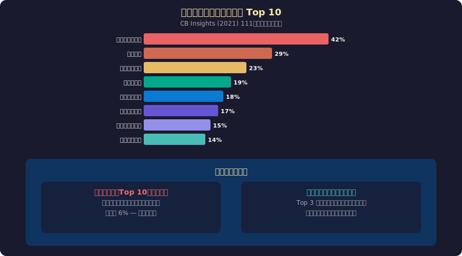

<!-- _class: lead -->
# スタートアップが失敗する本当の理由

- 技術ではなく、人と市場の問題
- 2026-02-20

---

# 目次

- <svg xmlns="http://www.w3.org/2000/svg" viewBox="0 0 800 400" style="max-height:70vh;max-width:100%;display:block;margin:0 auto;"><rect width="800" height="400" fill="#1a1a2e"/><text x="400" y="32" text-anchor="middle" fill="#f9a825" font-size="17" font-weight="bold" font-family="sans-serif">スタートアップ失敗の構造</text><rect x="30" y="55" width="220" height="72" rx="10" fill="#16213e" stroke="#e91e63" stroke-width="2"/><text x="140" y="82" text-anchor="middle" fill="#e91e63" font-size="13" font-weight="bold" font-family="sans-serif">1. 失敗率の現実</text><text x="140" y="102" text-anchor="middle" fill="#ccc" font-size="11" font-family="sans-serif">90%が10年以内に失敗</text><text x="140" y="118" text-anchor="middle" fill="#ccc" font-size="11" font-family="sans-serif">生存者バイアスの罠</text><rect x="290" y="55" width="220" height="72" rx="10" fill="#16213e" stroke="#f9a825" stroke-width="2"/><text x="400" y="82" text-anchor="middle" fill="#f9a825" font-size="13" font-weight="bold" font-family="sans-serif">2. 失敗理由のデータ</text><text x="400" y="102" text-anchor="middle" fill="#ccc" font-size="11" font-family="sans-serif">Top 10 失敗原因</text><text x="400" y="118" text-anchor="middle" fill="#ccc" font-size="11" font-family="sans-serif">技術は6%のみ</text><rect x="550" y="55" width="220" height="72" rx="10" fill="#16213e" stroke="#9c27b0" stroke-width="2"/><text x="660" y="82" text-anchor="middle" fill="#9c27b0" font-size="13" font-weight="bold" font-family="sans-serif">3. 市場ニーズなし</text><text x="660" y="102" text-anchor="middle" fill="#ccc" font-size="11" font-family="sans-serif">認知バイアスの構造</text><text x="660" y="118" text-anchor="middle" fill="#ccc" font-size="11" font-family="sans-serif">Mom Test・PMF</text><rect x="30" y="175" width="220" height="72" rx="10" fill="#16213e" stroke="#2196f3" stroke-width="2"/><text x="140" y="202" text-anchor="middle" fill="#2196f3" font-size="13" font-weight="bold" font-family="sans-serif">4. チームの問題</text><text x="140" y="222" text-anchor="middle" fill="#ccc" font-size="11" font-family="sans-serif">共同創業者の不和</text><text x="140" y="238" text-anchor="middle" fill="#ccc" font-size="11" font-family="sans-serif">早すぎるスケール</text><rect x="290" y="175" width="220" height="72" rx="10" fill="#16213e" stroke="#4caf50" stroke-width="2"/><text x="400" y="202" text-anchor="middle" fill="#4caf50" font-size="13" font-weight="bold" font-family="sans-serif">5. タイミングの科学</text><text x="400" y="222" text-anchor="middle" fill="#ccc" font-size="11" font-family="sans-serif">成功要因42%</text><text x="400" y="238" text-anchor="middle" fill="#ccc" font-size="11" font-family="sans-serif">YouTube vs Webvan</text><rect x="550" y="175" width="220" height="72" rx="10" fill="#16213e" stroke="#ff8a65" stroke-width="2"/><text x="660" y="202" text-anchor="middle" fill="#ff8a65" font-size="13" font-weight="bold" font-family="sans-serif">6. まとめ</text><text x="660" y="222" text-anchor="middle" fill="#ccc" font-size="11" font-family="sans-serif">成功の三角形</text><text x="660" y="238" text-anchor="middle" fill="#ccc" font-size="11" font-family="sans-serif">失敗から学ぶ</text><rect x="160" y="295" width="480" height="60" rx="10" fill="#0f3460" stroke="#f9a825" stroke-width="1.5"/><text x="400" y="322" text-anchor="middle" fill="#f9a825" font-size="14" font-weight="bold" font-family="sans-serif">核心メッセージ</text><text x="400" y="344" text-anchor="middle" fill="#fff" font-size="12" font-family="sans-serif">技術的失敗はわずか6% — 失敗の本質は「人」と「市場」にある</text></svg>

---

<!-- _class: lead -->
# 1. 失敗率の現実

---

# スタートアップの生存率

![w:860 center](data:image/svg+xml;charset=utf-8,<svg xmlns="http://www.w3.org/2000/svg" viewBox="0 0 860 360" style="max-height:70vh;max-width:100%;display:block;margin:0 auto;"><rect width="860" height="360" fill="#1a1a2e"/><text x="430" y="34" text-anchor="middle" fill="#f9a825" font-size="18" font-family="sans-serif" font-weight="bold">スタートアップ生存率の推移</text><line x1="70" y1="290" x2="790" y2="290" stroke="#555" stroke-width="1"/><line x1="70" y1="290" x2="70" y2="60" stroke="#555" stroke-width="1"/><text x="60" y="294" text-anchor="end" fill="#aaa" font-size="12" font-family="sans-serif">0%</text><text x="60" y="234" text-anchor="end" fill="#aaa" font-size="12" font-family="sans-serif">20%</text><text x="60" y="174" text-anchor="end" fill="#aaa" font-size="12" font-family="sans-serif">40%</text><text x="60" y="114" text-anchor="end" fill="#aaa" font-size="12" font-family="sans-serif">60%</text><text x="60" y="74" text-anchor="end" fill="#aaa" font-size="12" font-family="sans-serif">80%</text><rect x="100" y="98" width="80" height="192" fill="#4caf50" rx="4"/><text x="140" y="92" text-anchor="middle" fill="#4caf50" font-size="14" font-family="sans-serif" font-weight="bold">80%</text><text x="140" y="308" text-anchor="middle" fill="#ccc" font-size="13" font-family="sans-serif">1年目</text><rect x="230" y="158" width="80" height="132" fill="#8bc34a" rx="4"/><text x="270" y="152" text-anchor="middle" fill="#8bc34a" font-size="14" font-family="sans-serif" font-weight="bold">50%</text><text x="270" y="308" text-anchor="middle" fill="#ccc" font-size="13" font-family="sans-serif">3年目</text><rect x="360" y="218" width="80" height="72" fill="#f9a825" rx="4"/><text x="400" y="212" text-anchor="middle" fill="#f9a825" font-size="14" font-family="sans-serif" font-weight="bold">30%</text><text x="400" y="308" text-anchor="middle" fill="#ccc" font-size="13" font-family="sans-serif">5年目</text><rect x="490" y="254" width="80" height="36" fill="#e91e63" rx="4"/><text x="530" y="248" text-anchor="middle" fill="#e91e63" font-size="14" font-family="sans-serif" font-weight="bold">10%</text><text x="530" y="308" text-anchor="middle" fill="#ccc" font-size="13" font-family="sans-serif">10年目</text><text x="640" y="200" text-anchor="middle" fill="#e91e63" font-size="15" font-family="sans-serif" font-weight="bold">90%が</text><text x="640" y="222" text-anchor="middle" fill="#e91e63" font-size="15" font-family="sans-serif" font-weight="bold">失敗する</text><text x="760" y="200" fill="#888" font-size="11" font-family="sans-serif" text-anchor="middle">Source:</text><text x="760" y="216" fill="#888" font-size="11" font-family="sans-serif" text-anchor="middle">Startup</text><text x="760" y="232" fill="#888" font-size="11" font-family="sans-serif" text-anchor="middle">Genome</text></svg>)

---

# 生存者バイアスに注意

![w:860 center](data:image/svg+xml;charset=utf-8,<svg xmlns="http://www.w3.org/2000/svg" viewBox="0 0 860 340" style="max-height:70vh;max-width:100%;display:block;margin:0 auto;"><rect width="860" height="340" fill="#1a1a2e"/><text x="430" y="32" text-anchor="middle" fill="#f9a825" font-size="17" font-family="sans-serif" font-weight="bold">生存者バイアス — 私たちが見ているもの vs 現実</text><rect x="30" y="55" width="370" height="260" fill="#16213e" rx="8" stroke="#e91e63" stroke-width="2"/><text x="215" y="82" text-anchor="middle" fill="#e91e63" font-size="14" font-family="sans-serif" font-weight="bold">メディアが報じる世界</text><circle cx="215" cy="160" r="50" fill="#f9a825" opacity="0.9"/><text x="215" y="155" text-anchor="middle" fill="#1a1a2e" font-size="13" font-family="sans-serif" font-weight="bold">Apple</text><text x="215" y="172" text-anchor="middle" fill="#1a1a2e" font-size="11" font-family="sans-serif">Google</text><text x="215" y="245" text-anchor="middle" fill="#aaa" font-size="12" font-family="sans-serif">成功企業だけが注目される</text><text x="215" y="265" text-anchor="middle" fill="#aaa" font-size="12" font-family="sans-serif">「ガレージ起業」神話</text><text x="215" y="285" text-anchor="middle" fill="#aaa" font-size="12" font-family="sans-serif">成功要因を分析して真似する</text><rect x="460" y="55" width="370" height="260" fill="#16213e" rx="8" stroke="#4caf50" stroke-width="2"/><text x="645" y="82" text-anchor="middle" fill="#4caf50" font-size="14" font-family="sans-serif" font-weight="bold">現実の世界</text><circle cx="560" cy="140" r="18" fill="#888" opacity="0.5"/><circle cx="600" cy="120" r="12" fill="#888" opacity="0.4"/><circle cx="640" cy="150" r="20" fill="#888" opacity="0.5"/><circle cx="590" cy="180" r="14" fill="#888" opacity="0.4"/><circle cx="690" cy="130" r="15" fill="#888" opacity="0.5"/><circle cx="720" cy="170" r="18" fill="#888" opacity="0.4"/><circle cx="650" cy="200" r="10" fill="#888" opacity="0.3"/><circle cx="520" cy="175" r="16" fill="#888" opacity="0.4"/><circle cx="730" cy="100" r="12" fill="#888" opacity="0.3"/><circle cx="645" cy="130" r="40" fill="#f9a825" opacity="0.9"/><text x="645" y="126" text-anchor="middle" fill="#1a1a2e" font-size="12" font-family="sans-serif" font-weight="bold">Apple</text><text x="645" y="142" text-anchor="middle" fill="#1a1a2e" font-size="10" font-family="sans-serif">Google</text><text x="645" y="245" text-anchor="middle" fill="#4caf50" font-size="12" font-family="sans-serif">同期に何千もの企業が</text><text x="645" y="263" text-anchor="middle" fill="#4caf50" font-size="12" font-family="sans-serif">同じことを試みて消えた</text><text x="645" y="283" text-anchor="middle" fill="#aaa" font-size="11" font-family="sans-serif">失敗こそが常態</text></svg>)

---

<!-- _class: lead -->
# 2. 失敗理由のデータ

---

# 失敗理由 Top 10

---

# 技術は失敗原因ではない

"><path d="M0,-120 A120,120 0 0,1 113.9,35.4 L0,0 Z" fill="#e91e63"/><text x="55" y="-55" fill="white" font-size="12" font-family="sans-serif" font-weight="bold" text-anchor="middle">市場ニーズなし</text><text x="55" y="-38" fill="white" font-size="14" font-family="sans-serif" font-weight="bold" text-anchor="middle">42%</text><path d="M113.9,35.4 A120,120 0 0,1 20.8,118.2 L0,0 Z" fill="#f9a825"/><text x="85" y="105" fill="#1a1a2e" font-size="11" font-family="sans-serif" font-weight="bold" text-anchor="middle">資金切れ</text><text x="85" y="120" fill="#1a1a2e" font-size="13" font-family="sans-serif" font-weight="bold" text-anchor="middle">29%</text><path d="M20.8,118.2 A120,120 0 0,1 -108.0,52.4 L0,0 Z" fill="#9c27b0"/><text x="-65" y="115" fill="white" font-size="11" font-family="sans-serif" font-weight="bold" text-anchor="middle">チーム</text><text x="-65" y="130" fill="white" font-size="13" font-family="sans-serif" font-weight="bold" text-anchor="middle">23%</text><path d="M-108.0,52.4 A120,120 0 0,1 -108.0,-52.4 L0,0 Z" fill="#2196f3"/><text x="-130" y="-4" fill="white" font-size="11" font-family="sans-serif" font-weight="bold" text-anchor="end">競合</text><text x="-130" y="12" fill="white" font-size="11" font-family="sans-serif" font-weight="bold" text-anchor="end">19%</text><path d="M-108.0,-52.4 A120,120 0 0,1 0,-120 L0,0 Z" fill="#4caf50"/><text x="-38" y="-88" fill="white" font-size="11" font-family="sans-serif" font-weight="bold" text-anchor="middle">技術的失敗</text><text x="-38" y="-72" fill="white" font-size="13" font-family="sans-serif" font-weight="bold" text-anchor="middle">6%</text></g><rect x="460" y="60" width="360" height="230" fill="#16213e" rx="8"/><text x="640" y="90" text-anchor="middle" fill="#f9a825" font-size="14" font-family="sans-serif" font-weight="bold">重要な示唆</text><rect x="480" y="108" width="12" height="12" fill="#e91e63" rx="2"/><text x="502" y="120" fill="#eee" font-size="13" font-family="sans-serif">市場ニーズなし: 42%</text><rect x="480" y="132" width="12" height="12" fill="#f9a825" rx="2"/><text x="502" y="144" fill="#eee" font-size="13" font-family="sans-serif">資金切れ: 29%</text><rect x="480" y="156" width="12" height="12" fill="#9c27b0" rx="2"/><text x="502" y="168" fill="#eee" font-size="13" font-family="sans-serif">チームの問題: 23%</text><rect x="480" y="180" width="12" height="12" fill="#2196f3" rx="2"/><text x="502" y="192" fill="#eee" font-size="13" font-family="sans-serif">競合負け: 19%</text><rect x="480" y="204" width="12" height="12" fill="#4caf50" rx="2"/><text x="502" y="216" fill="#eee" font-size="13" font-family="sans-serif">技術的失敗: 6%</text><text x="640" y="255" text-anchor="middle" fill="#e91e63" font-size="13" font-family="sans-serif" font-weight="bold">「何を作るか」が最重要</text><text x="640" y="275" text-anchor="middle" fill="#aaa" font-size="12" font-family="sans-serif">「どう作るか」ではない</text></svg>)

---

<!-- _class: lead -->
# 3. 「市場ニーズなし」の深層

---

# なぜ市場ニーズを読み違えるか

![w:860 center](data:image/svg+xml;charset=utf-8,<svg xmlns="http://www.w3.org/2000/svg" viewBox="0 0 860 340" style="max-height:70vh;max-width:100%;display:block;margin:0 auto;"><rect width="860" height="340" fill="#1a1a2e"/><text x="430" y="32" text-anchor="middle" fill="#f9a825" font-size="17" font-family="sans-serif" font-weight="bold">市場ニーズ読み違えの認知バイアス構造</text><rect x="30" y="55" width="185" height="110" fill="#e91e63" rx="10" opacity="0.85"/><text x="122" y="82" text-anchor="middle" fill="white" font-size="13" font-family="sans-serif" font-weight="bold">確証バイアス</text><text x="122" y="102" text-anchor="middle" fill="#fff" font-size="11" font-family="sans-serif">肯定する情報だけ</text><text x="122" y="118" text-anchor="middle" fill="#fff" font-size="11" font-family="sans-serif">収集してしまう</text><text x="122" y="140" text-anchor="middle" fill="#ffe082" font-size="12" font-family="sans-serif" font-weight="bold">→ 需要過大評価</text><rect x="240" y="55" width="185" height="110" fill="#9c27b0" rx="10" opacity="0.85"/><text x="332" y="82" text-anchor="middle" fill="white" font-size="13" font-family="sans-serif" font-weight="bold">プロダクトアウト</text><text x="332" y="102" text-anchor="middle" fill="#fff" font-size="11" font-family="sans-serif">「作りたいもの」から</text><text x="332" y="118" text-anchor="middle" fill="#fff" font-size="11" font-family="sans-serif">思考が始まる</text><text x="332" y="140" text-anchor="middle" fill="#ffe082" font-size="12" font-family="sans-serif" font-weight="bold">→ 顧客不在設計</text><rect x="450" y="55" width="185" height="110" fill="#2196f3" rx="10" opacity="0.85"/><text x="542" y="82" text-anchor="middle" fill="white" font-size="13" font-family="sans-serif" font-weight="bold">社交辞令バイアス</text><text x="542" y="102" text-anchor="middle" fill="#fff" font-size="11" font-family="sans-serif">友人の「いいね！」を</text><text x="542" y="118" text-anchor="middle" fill="#fff" font-size="11" font-family="sans-serif">真に受けてしまう</text><text x="542" y="140" text-anchor="middle" fill="#ffe082" font-size="12" font-family="sans-serif" font-weight="bold">→ フィードバック汚染</text><rect x="660" y="55" width="185" height="110" fill="#4caf50" rx="10" opacity="0.85"/><text x="752" y="82" text-anchor="middle" fill="white" font-size="13" font-family="sans-serif" font-weight="bold">Vanity Metrics</text><text x="752" y="102" text-anchor="middle" fill="#fff" font-size="11" font-family="sans-serif">ユーザー数は増えても</text><text x="752" y="118" text-anchor="middle" fill="#fff" font-size="11" font-family="sans-serif">誰も課金しない</text><text x="752" y="140" text-anchor="middle" fill="#ffe082" font-size="12" font-family="sans-serif" font-weight="bold">→ 偽の成功感</text><rect x="200" y="200" width="460" height="115" fill="#16213e" rx="10" stroke="#f9a825" stroke-width="2"/><text x="430" y="227" text-anchor="middle" fill="#f9a825" font-size="14" font-family="sans-serif" font-weight="bold">Mom Test — 正しい顧客検証の原則</text><text x="430" y="252" text-anchor="middle" fill="#eee" font-size="13" font-family="sans-serif">「あなたのアイデアはいいと思う？」← 悪い質問</text><text x="430" y="274" text-anchor="middle" fill="#eee" font-size="13" font-family="sans-serif">「最後にこの問題に悩んだのはいつ？」← 良い質問</text><text x="430" y="298" text-anchor="middle" fill="#4caf50" font-size="12" font-family="sans-serif">切実な問題を見つけてから解決策を探す</text></svg>)

---

# Product-Market Fit の重要性

![w:860 center](data:image/svg+xml;charset=utf-8,<svg xmlns="http://www.w3.org/2000/svg" viewBox="0 0 860 340" style="max-height:70vh;max-width:100%;display:block;margin:0 auto;"><rect width="860" height="340" fill="#1a1a2e"/><text x="430" y="32" text-anchor="middle" fill="#f9a825" font-size="17" font-family="sans-serif" font-weight="bold">PMF確認プロセス — Sean Ellis テスト</text><rect x="30" y="60" width="130" height="64" fill="#16213e" rx="8" stroke="#2196f3" stroke-width="2"/><text x="95" y="86" text-anchor="middle" fill="#2196f3" font-size="12" font-family="sans-serif" font-weight="bold">ユーザーに質問</text><text x="95" y="104" text-anchor="middle" fill="#aaa" font-size="11" font-family="sans-serif">使えなくなったら?</text><polygon points="168,92 180,86 180,98" fill="#555"/><rect x="188" y="60" width="130" height="64" fill="#16213e" rx="8" stroke="#9c27b0" stroke-width="2"/><text x="253" y="86" text-anchor="middle" fill="#9c27b0" font-size="12" font-family="sans-serif" font-weight="bold">回答を集計</text><text x="253" y="104" text-anchor="middle" fill="#aaa" font-size="11" font-family="sans-serif">最低100件</text><polygon points="326,92 338,86 338,98" fill="#555"/><rect x="346" y="60" width="130" height="64" fill="#16213e" rx="8" stroke="#f9a825" stroke-width="2"/><text x="411" y="86" text-anchor="middle" fill="#f9a825" font-size="12" font-family="sans-serif" font-weight="bold">「非常に残念」</text><text x="411" y="104" text-anchor="middle" fill="#aaa" font-size="11" font-family="sans-serif">の割合を確認</text><polygon points="484,92 496,86 496,98" fill="#555"/><rect x="504" y="50" width="130" height="42" fill="#e91e63" rx="8"/><text x="569" y="67" text-anchor="middle" fill="white" font-size="12" font-family="sans-serif" font-weight="bold">40%未満</text><text x="569" y="83" text-anchor="middle" fill="white" font-size="11" font-family="sans-serif">PMFなし → ピボット</text><rect x="504" y="100" width="130" height="42" fill="#4caf50" rx="8"/><text x="569" y="117" text-anchor="middle" fill="white" font-size="12" font-family="sans-serif" font-weight="bold">40%以上</text><text x="569" y="133" text-anchor="middle" fill="white" font-size="11" font-family="sans-serif">PMFあり → スケール</text><line x1="634" y1="71" x2="660" y2="71" stroke="#e91e63" stroke-width="2"/><polygon points="660,67 672,71 660,75" fill="#e91e63"/><rect x="672" y="50" width="155" height="42" fill="#16213e" rx="8" stroke="#e91e63" stroke-width="2"/><text x="749" y="67" text-anchor="middle" fill="#e91e63" font-size="12" font-family="sans-serif" font-weight="bold">仮説を修正して</text><text x="749" y="83" text-anchor="middle" fill="#e91e63" font-size="11" font-family="sans-serif">再テストへ</text><line x1="634" y1="121" x2="660" y2="121" stroke="#4caf50" stroke-width="2"/><polygon points="660,117 672,121 660,125" fill="#4caf50"/><rect x="672" y="100" width="155" height="42" fill="#16213e" rx="8" stroke="#4caf50" stroke-width="2"/><text x="749" y="117" text-anchor="middle" fill="#4caf50" font-size="12" font-family="sans-serif" font-weight="bold">採用・マーケ</text><text x="749" y="133" text-anchor="middle" fill="#4caf50" font-size="11" font-family="sans-serif">投資を加速</text><rect x="30" y="170" width="800" height="145" fill="#16213e" rx="8"/><text x="430" y="196" text-anchor="middle" fill="#f9a825" font-size="14" font-family="sans-serif" font-weight="bold">PMFの兆候チェックリスト</text><rect x="55" y="212" width="14" height="14" fill="#4caf50" rx="3"/><text x="80" y="224" fill="#eee" font-size="13" font-family="sans-serif">顧客が営業なしで集まってくる</text><rect x="55" y="234" width="14" height="14" fill="#4caf50" rx="3"/><text x="80" y="246" fill="#eee" font-size="13" font-family="sans-serif">解約率が低い（月次5%以下）</text><rect x="55" y="256" width="14" height="14" fill="#4caf50" rx="3"/><text x="80" y="268" fill="#eee" font-size="13" font-family="sans-serif">LTV &gt; CAC × 3倍</text><rect x="445" y="212" width="14" height="14" fill="#e91e63" rx="3"/><text x="470" y="224" fill="#eee" font-size="13" font-family="sans-serif">機能追加しても成長しない</text><rect x="445" y="234" width="14" height="14" fill="#e91e63" rx="3"/><text x="470" y="246" fill="#eee" font-size="13" font-family="sans-serif">CAC &gt; LTV（収益化できない）</text><rect x="445" y="256" width="14" height="14" fill="#e91e63" rx="3"/><text x="470" y="268" fill="#eee" font-size="13" font-family="sans-serif">ユーザーが定着しない（高チャーン）</text><text x="430" y="300" text-anchor="middle" fill="#f9a825" font-size="13" font-family="sans-serif" font-weight="bold">ほとんどのスタートアップはPMF前に資金が尽きる</text></svg>)

---

<!-- _class: lead -->
# 4. チームの問題

---

# 共同創業者の不和

![w:860 center](data:image/svg+xml;charset=utf-8,<svg xmlns="http://www.w3.org/2000/svg" viewBox="0 0 860 340" style="max-height:70vh;max-width:100%;display:block;margin:0 auto;"><rect width="860" height="340" fill="#1a1a2e"/><text x="430" y="32" text-anchor="middle" fill="#f9a825" font-size="17" font-family="sans-serif" font-weight="bold">共同創業者の不和 — 失敗原因の23%</text><polygon points="300,75 520,75 660,270 160,270" fill="none" stroke="#f9a825" stroke-width="2" stroke-dasharray="6,3"/><text x="170" y="295" text-anchor="middle" fill="#e91e63" font-size="12" font-family="sans-serif" font-weight="bold">ビジョン不一致</text><text x="650" y="295" text-anchor="middle" fill="#e91e63" font-size="12" font-family="sans-serif" font-weight="bold">役割の曖昧さ</text><text x="410" y="65" text-anchor="middle" fill="#e91e63" font-size="12" font-family="sans-serif" font-weight="bold">株式配分の不満</text><circle cx="410" cy="170" r="52" fill="#e91e63" opacity="0.15" stroke="#e91e63" stroke-width="2"/><text x="410" y="163" text-anchor="middle" fill="#e91e63" font-size="14" font-family="sans-serif" font-weight="bold">不和</text><text x="410" y="182" text-anchor="middle" fill="#e91e63" font-size="12" font-family="sans-serif">の核心</text><rect x="510" y="90" width="320" height="200" fill="#16213e" rx="8" stroke="#4caf50" stroke-width="1"/><text x="670" y="114" text-anchor="middle" fill="#4caf50" font-size="13" font-family="sans-serif" font-weight="bold">予防策 — 創業者プリナップ</text><text x="524" y="138" fill="#eee" font-size="12" font-family="sans-serif">権限: 誰が最終決定権を持つか</text><text x="524" y="160" fill="#eee" font-size="12" font-family="sans-serif">株式: ベスティングスケジュール設定</text><text x="524" y="182" fill="#eee" font-size="12" font-family="sans-serif">退出: 離脱時の株式返還条件</text><text x="524" y="204" fill="#eee" font-size="12" font-family="sans-serif">給与: 初期報酬の合意</text><text x="524" y="226" fill="#eee" font-size="12" font-family="sans-serif">紛争: 意見衝突時の解決手順</text><text x="670" y="270" text-anchor="middle" fill="#f9a825" font-size="12" font-family="sans-serif" font-weight="bold">チームの相性 &gt; 個人の優秀さ</text><rect x="30" y="90" width="460" height="56" fill="#16213e" rx="8" stroke="#9c27b0" stroke-width="1"/><text x="260" y="112" text-anchor="middle" fill="#9c27b0" font-size="13" font-family="sans-serif" font-weight="bold">友人同士の起業が危険な理由</text><text x="260" y="134" text-anchor="middle" fill="#aaa" font-size="12" font-family="sans-serif">関係維持のために難しい会話を避ける → 問題が蓄積</text></svg>)

---

# 早すぎるスケーリング

">成長</text><text x="200" y="310" text-anchor="middle" fill="#aaa" font-size="11" font-family="sans-serif">PMF前</text><text x="500" y="310" text-anchor="middle" fill="#aaa" font-size="11" font-family="sans-serif">PMF確認</text><text x="700" y="310" text-anchor="middle" fill="#aaa" font-size="11" font-family="sans-serif">スケール期</text><line x1="350" y1="55" x2="350" y2="290" stroke="#f9a825" stroke-width="1" stroke-dasharray="6,3"/><text x="354" y="70" fill="#f9a825" font-size="11" font-family="sans-serif">PMF確認点</text><polyline points="60,270 120,260 200,230 280,210 350,180 420,100 520,70 650,55 780,48" fill="none" stroke="#4caf50" stroke-width="3"/><text x="680" y="45" fill="#4caf50" font-size="12" font-family="sans-serif" font-weight="bold">理想的な成長</text><polyline points="60,270 120,240 200,190 280,185 350,190 380,210 420,240 480,275 530,288" fill="none" stroke="#e91e63" stroke-width="3" stroke-dasharray="8,4"/><text x="480" y="275" fill="#e91e63" font-size="12" font-family="sans-serif" font-weight="bold">早すぎるスケール→失敗</text><rect x="100" y="155" width="200" height="80" fill="#16213e" rx="6" stroke="#e91e63" stroke-width="1"/><text x="200" y="175" text-anchor="middle" fill="#e91e63" font-size="12" font-family="sans-serif" font-weight="bold">PMF前スケールの罠</text><text x="110" y="195" fill="#aaa" font-size="11" font-family="sans-serif">採用増 → burn rate上昇</text><text x="110" y="212" fill="#aaa" font-size="11" font-family="sans-serif">技術先行 → 市場が変わる</text><text x="110" y="229" fill="#aaa" font-size="11" font-family="sans-serif">営業拡大 → 製品が未完成</text><rect x="540" y="90" width="255" height="80" fill="#16213e" rx="6" stroke="#4caf50" stroke-width="1"/><text x="667" y="110" text-anchor="middle" fill="#4caf50" font-size="12" font-family="sans-serif" font-weight="bold">Paul Graham の教え</text><text x="550" y="130" fill="#aaa" font-size="11" font-family="sans-serif">Do Things That</text><text x="550" y="148" fill="#aaa" font-size="11" font-family="sans-serif">Don't Scale</text><text x="550" y="164" fill="#f9a825" font-size="11" font-family="sans-serif" font-weight="bold">最初の100人は手動で獲得</text></svg>)

---

<!-- _class: lead -->
# 5. タイミングの科学

---

# タイミングが最大の成功要因

</text><g transform="translate(220,185)"><path d="M0,-120 A120,120 0 0,1 113.9,35.4 L0,0 Z" fill="#e91e63"/><text x="45" y="-65" fill="white" font-size="14" font-family="sans-serif" font-weight="bold" text-anchor="middle">タイミング</text><text x="45" y="-44" fill="white" font-size="18" font-family="sans-serif" font-weight="bold" text-anchor="middle">42%</text><path d="M113.9,35.4 A120,120 0 0,1 -20.8,118.2 L0,0 Z" fill="#f9a825"/><text x="65" y="108" fill="#1a1a2e" font-size="13" font-family="sans-serif" font-weight="bold" text-anchor="middle">チーム</text><text x="65" y="125" fill="#1a1a2e" font-size="16" font-family="sans-serif" font-weight="bold" text-anchor="middle">32%</text><path d="M-20.8,118.2 A120,120 0 0,1 -120,0 L0,0 Z" fill="#9c27b0"/><text x="-80" y="90" fill="white" font-size="13" font-family="sans-serif" font-weight="bold" text-anchor="middle">アイデア</text><text x="-80" y="108" fill="white" font-size="16" font-family="sans-serif" font-weight="bold" text-anchor="middle">28%</text></g><rect x="430" y="55" width="400" height="255" fill="#16213e" rx="8"/><text x="630" y="82" text-anchor="middle" fill="#f9a825" font-size="14" font-family="sans-serif" font-weight="bold">タイミング × 結果の実例</text><rect x="450" y="96" width="360" height="50" fill="#1a3a1a" rx="6"/><text x="460" y="116" fill="#4caf50" font-size="12" font-family="sans-serif" font-weight="bold">YouTube (2005)</text><text x="460" y="134" fill="#aaa" font-size="11" font-family="sans-serif">ブロードバンド普及タイミングが完璧 → 成功</text><rect x="450" y="152" width="360" height="50" fill="#1a3a1a" rx="6"/><text x="460" y="172" fill="#4caf50" font-size="12" font-family="sans-serif" font-weight="bold">Airbnb (2008)</text><text x="460" y="190" fill="#aaa" font-size="11" font-family="sans-serif">リーマンショック後の余剰資産活用ニーズ → 成功</text><rect x="450" y="208" width="360" height="50" fill="#3a1a1a" rx="6"/><text x="460" y="228" fill="#e91e63" font-size="12" font-family="sans-serif" font-weight="bold">Webvan (2001)</text><text x="460" y="246" fill="#aaa" font-size="11" font-family="sans-serif">食品宅配: アイデア正しいがインフラ未整備 → 失敗</text><text x="630" y="296" text-anchor="middle" fill="#f9a825" font-size="13" font-family="sans-serif" font-weight="bold">正しいアイデア × 間違ったタイミング = 失敗</text></svg>)

---

# まとめ

![w:860 center](data:image/svg+xml;charset=utf-8,<svg xmlns="http://www.w3.org/2000/svg" viewBox="0 0 860 340" style="max-height:70vh;max-width:100%;display:block;margin:0 auto;"><rect width="860" height="340" fill="#1a1a2e"/><text x="430" y="32" text-anchor="middle" fill="#f9a825" font-size="17" font-family="sans-serif" font-weight="bold">スタートアップ成功の三角形</text><polygon points="430,55 640,280 220,280" fill="none" stroke="#f9a825" stroke-width="3"/><circle cx="430" cy="55" r="52" fill="#e91e63" opacity="0.9"/><text x="430" y="50" text-anchor="middle" fill="white" font-size="13" font-family="sans-serif" font-weight="bold">タイミング</text><text x="430" y="68" text-anchor="middle" fill="white" font-size="16" font-family="sans-serif" font-weight="bold">42%</text><circle cx="220" cy="280" r="52" fill="#9c27b0" opacity="0.9"/><text x="220" y="275" text-anchor="middle" fill="white" font-size="13" font-family="sans-serif" font-weight="bold">アイデア</text><text x="220" y="293" text-anchor="middle" fill="white" font-size="16" font-family="sans-serif" font-weight="bold">28%</text><circle cx="640" cy="280" r="52" fill="#f9a825" opacity="0.9"/><text x="640" y="275" text-anchor="middle" fill="#1a1a2e" font-size="13" font-family="sans-serif" font-weight="bold">チーム</text><text x="640" y="293" text-anchor="middle" fill="#1a1a2e" font-size="16" font-family="sans-serif" font-weight="bold">32%</text><text x="430" y="178" text-anchor="middle" fill="#fff" font-size="13" font-family="sans-serif">PMF</text><rect x="680" y="60" width="170" height="200" fill="#16213e" rx="8"/><text x="765" y="85" text-anchor="middle" fill="#f9a825" font-size="13" font-family="sans-serif" font-weight="bold">失敗原因Top3</text><rect x="695" y="98" width="12" height="12" fill="#e91e63" rx="2"/><text x="715" y="110" fill="#eee" font-size="12" font-family="sans-serif">市場ニーズなし 42%</text><rect x="695" y="120" width="12" height="12" fill="#f9a825" rx="2"/><text x="715" y="132" fill="#eee" font-size="12" font-family="sans-serif">資金切れ 29%</text><rect x="695" y="142" width="12" height="12" fill="#9c27b0" rx="2"/><text x="715" y="154" fill="#eee" font-size="12" font-family="sans-serif">チーム不和 23%</text><text x="765" y="185" text-anchor="middle" fill="#4caf50" font-size="11" font-family="sans-serif" font-weight="bold">技術的失敗</text><text x="765" y="200" text-anchor="middle" fill="#4caf50" font-size="11" font-family="sans-serif">わずか6%</text><text x="765" y="230" text-anchor="middle" fill="#aaa" font-size="10" font-family="sans-serif">90%が失敗する</text><text x="765" y="246" text-anchor="middle" fill="#aaa" font-size="10" font-family="sans-serif">が現実</text></svg>)

---

# 参考文献

- - **研究:**
- - CB Insights "Top Reasons Startups Fail" (2021)
- - Startup Genome Report (2012)
- - **書籍:**
- - Wasserman, N. "The Founder's Dilemmas" (2012)
- - Fitzpatrick, R. "The Mom Test" (2013)

