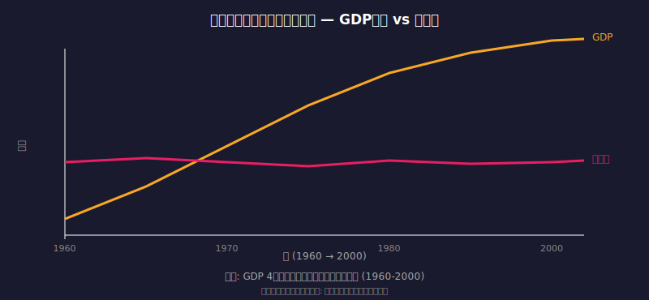
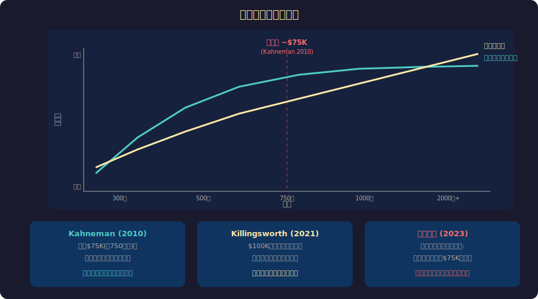
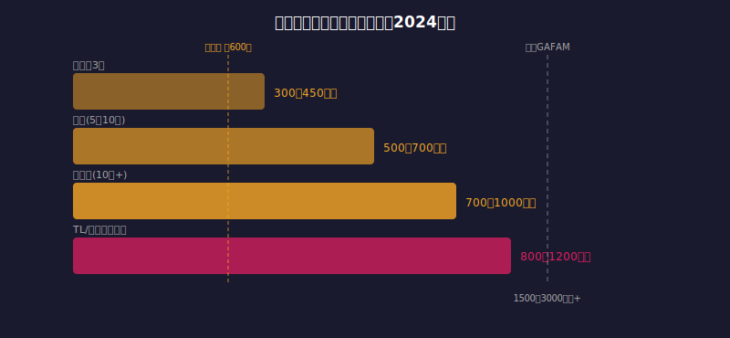
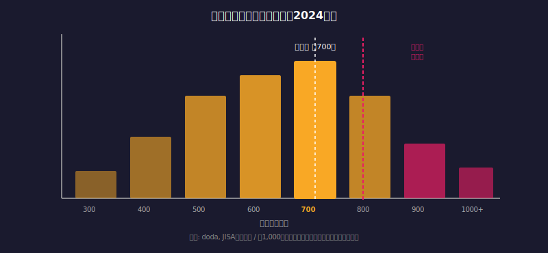
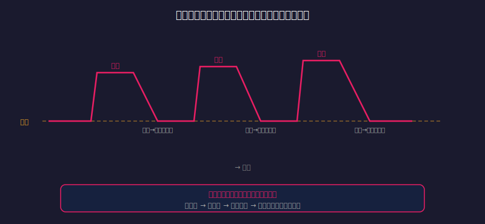
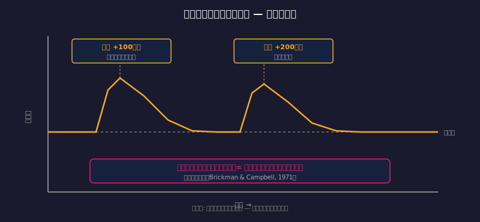
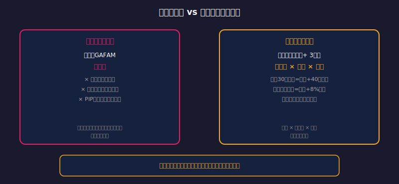

<!-- _class: lead -->
# エンジニアの年収と幸福度の関係

- お金で幸せは買えるのか？
- 2026-02-20

---

# 目次

> *飽和点750万円の研究から自律性・有能感まで6章で解説*

- - 1. 年収と幸福の研究史
- - 2. エンジニア年収の現実
- - 3. 幸福度の飽和点
- - 4. お金以外の要因
- - 5. 最適な選択とは
- - 6. まとめ

---

<!-- _class: lead -->
# 1. 年収と幸福の研究史

---

# イースタリンのパラドックス

> *GDP4倍でも生活満足度横ばい—相対比較が幸福を決める*

- - **Richard Easterlin (1974)**: 国が豊かになっても国民の幸福度は上がらない
- - 絶対的な所得より **相対的な所得** が幸福感を決める
- - 「隣の芝生は青い」= 社会的比較の罠
- - 日本: GDP 4倍になっても生活満足度は横ばい (1960-2000)
- - **ヘドニック・トレッドミル**: 年収が上がっても「慣れ」て幸福感がリセット
- - では、個人レベルではどうなのか？

---

# 年収と幸福度の関係

---

<!-- _class: lead -->
# 2. エンジニア年収の現実

---

# 日本のエンジニア年収分布

> *中央値600万—全産業443万を上回るが格差大*

- - **経済産業省 IT人材白書 (2024)** より
- - 新卒〜3年目: 300-450万円
- - 中堅 (5-10年): 500-700万円
- - シニア (10年+): 700-1000万円
- - テックリード/マネージャー: 800-1200万円
- - 外資系GAFAM: 1500-3000万円+
- - 中央値は約600万円 — 全産業平均(443万)を上回る

---

# 年収を上げる3つのルート

> *技術・管理・転職—各ルートにトレードオフあり*

- - **ルート1: 技術スペシャリスト** → Staff/Principal Engineer
- - **ルート2: マネジメント** → EM → VPoE → CTO
- - **ルート3: 転職・フリーランス** → 市場価値で交渉
- - 各ルートのトレードオフ:
- - 技術: 深い専門性 × キャリアパスが限られる
- - マネジメント: 年収上限高い × コードを書かなくなる

---

<!-- _class: lead -->
# 3. 幸福度の飽和点

---

# お金で買える幸せの限界

> *750万円超で日常幸福感は飽和し始める*

- - **Kahneman & Deaton (2010)**: 年収$75K(約750万円)で日常の幸福感は飽和
- - **Killingsworth (2021)**: $100K以上でも幸福度は上がり続ける（反論）
- - **Kahneman & Killingsworth (2023)**: 共同論文で和解
- - 結論: 「もともと不幸な人」は$75Kで飽和、「幸福な人」は上がり続ける
- - お金が解決するのは **経済的ストレスの除去** まで
- - それ以上は「何にお金を使うか」が幸福を決める

---

# ヘドニック・アダプテーション

> *年収増は3ヶ月で慣れてリセットされる*

- - **年収が上がると、基準も上がる** (快楽の踏み車)
- - 年収500万→700万: 最初は嬉しいが3ヶ月で「普通」に
- - ライフスタイル・インフレーション: 収入増 → 支出増 → 余裕なし
- - **比較対象が変わる**: 年収700万になると1000万の人と比べ始める
- - 宝くじ当選者の研究: 1年後の幸福度は当選前とほぼ同じ
- - 「いくらあれば足りるか？」→ 常に「あと少し」

---

<!-- _class: lead -->
# 4. お金以外の要因

---

# エンジニアの幸福度を決めるもの

> *年収は5位—技術的興味とWLBが上位*

- - **Stack Overflow Developer Survey (2024)** より
- - 1位: 技術的に面白い仕事 (72%)
- - 2位: ワークライフバランス (68%)
- - 3位: リモートワークの柔軟性 (61%)
- - 4位: チームの良さ (58%)
- - 5位: 年収 (54%)
- - → 年収は5位。技術的興味と自由度がより重要

---

# 自己決定理論 (SDT)

> *自律性・有能感・関係性が年収より幸福を決める*

- - **Deci & Ryan (1985)**: 人間の内発的動機は3つの欲求で決まる
- - **自律性 (Autonomy)**: 自分で意思決定できる
- - **有能感 (Competence)**: スキルが成長している実感
- - **関係性 (Relatedness)**: 良い人間関係、帰属意識
- - 年収1000万でも3つが満たされなければ不幸
- - 年収600万でも3つが満たされていれば幸福

---

<!-- _class: lead -->
# 5. 最適な選択とは

---

# 年収最大化 vs 幸福最大化

> *通勤30分短縮=年収40万増と同等の幸福効果*

- - **年収最大化戦略**: 外資系 → 高負荷 × 高報酬 × 不安定
- - **幸福最大化戦略**: 「十分な年収」+ 自律性 + 成長 + 良い仲間
- - 「十分」の目安: 経済的ストレスがないレベル（個人差大）
- - 通勤時間を30分短縮 = 年収40万円増と同等の幸福度向上
- - 完全リモート = 年収8%増と同等の価値 (NBER 2023)
- - **時間 × 自由度 × 成長 の最適化が鍵**

---

# まとめ

> *年収は「十分」で止め、その先は自律性と成長に投資する*

- - 年収と幸福度は対数的関係 — 上がるほど効果は鈍化
- - 飽和点は約750万円（日常の幸福感）だが個人差あり
- - ヘドニック・アダプテーション: 慣れが幸福感をリセットする
- - エンジニアの幸福: 技術的興味 > WLB > リモート > チーム > 年収
- - 自律性・有能感・関係性 (SDT) が内発的幸福の鍵
- - **年収は「十分」であればよい。その先は別の投資を**

---

# 参考文献

- - **研究:**
- - Kahneman, D. & Deaton, A. (2010) "High income improves evaluation"
- - Killingsworth, M. (2021) "Experienced well-being rises with income"
- - **書籍:**
- - Deci, E. & Ryan, R. "Self-Determination Theory" (1985/2017)
- - Easterlin, R. "Does Economic Growth Improve the Human Lot?" (1974)

