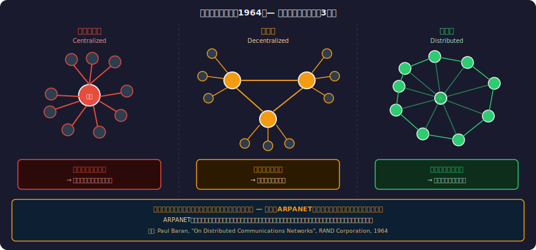
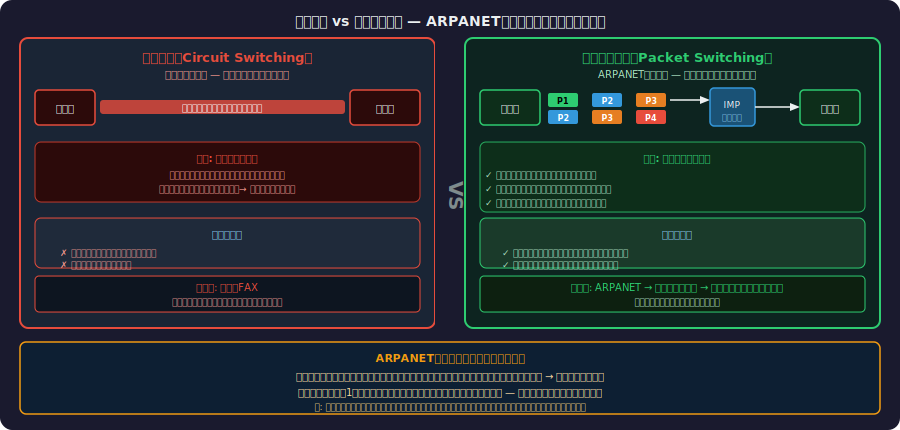
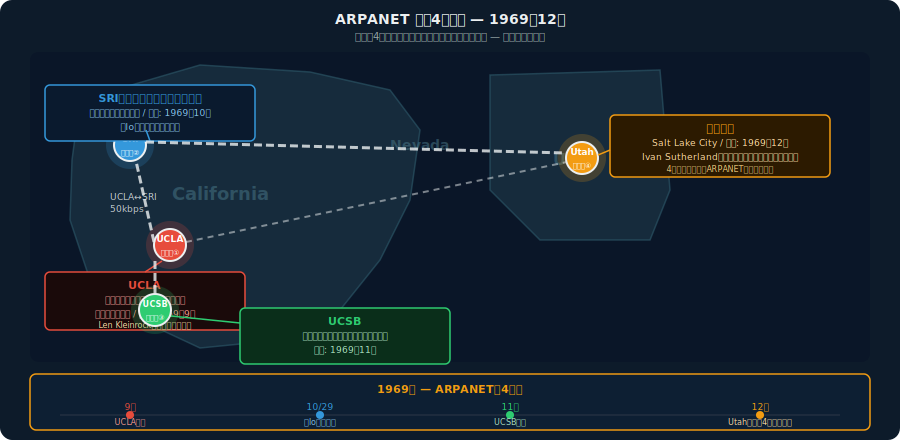
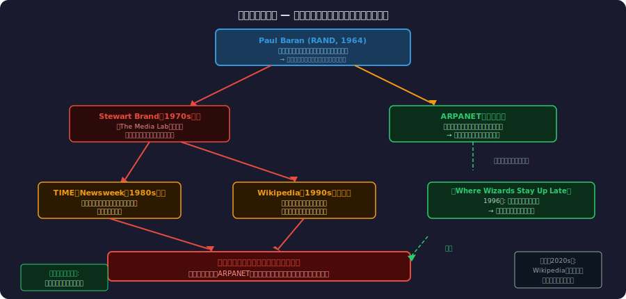
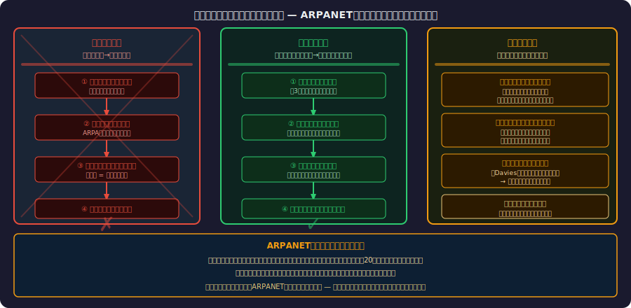

<!-- _class: lead -->
# 核戦争が生んだインターネット説は嘘だった

- ARPANETの本当の動機
- 
- 通説を疑い、一次資料に当たる

<!--
有名な「ARPANETは核戦争に耐えるために設計された」という話。実はこれは大きな誤解・神話です。今日はその神話がどこから来たのか、そして本当の動機は何だったのかを一次資料と証言を元に解説します。
-->

---

# アジェンダ

- **Part 1:** 「核戦争に耐えるため」という通説
- **Part 2:** 本当の文脈 — 冷戦・ARPA・コンピュータ科学
- **Part 3:** ポール・バランと混同の源泉
- **Part 4:** ARPANETの実際の設計と構築
- **Part 5:** 一次資料が語る真実
- **Part 6:** ARPANETが実際に生んだもの
- **Part 7:** 歴史の正確さがなぜ重要か

<!--
7つのパートで構成。前半で神話の解体、後半でARPANETの真実と遺産を扱います。
-->

---

<!-- _class: lead -->
# Part 1: 「核戦争に耐えるため」という通説

- 誰もが一度は聞いたことがある「あの話」

---

# あなたもこの話を聞いたことがあるはず

- **よく語られる説:**
- 「ARPANETは核攻撃で一部が破壊されても通信を維持できるよう設計された」
- 「分散型ネットワークは核戦争サバイバルのための発明だ」
- 
- **どこで聞いた？**
- 教科書・IT入門書・Wikipedia・ドキュメンタリー番組
- 技術系ブログ・SNS・講演でのアイスブレーク
- 
- → これは **半分正しくて、半分大きく誤解されている**

<!--
多くのエンジニアがこの話を「常識」として知っています。しかし「誰が」「なぜ」設計したかを具体的に聞かれると、多くの場合は曖昧な答えしか返ってきません。
-->

---

# 通説の広まり方 — 誰が、いつ、どう伝えたか

- **1970年代: Stewart Brandの語り**
- 『The Media Lab』などでARPANETを「核戦争サバイバル技術」として紹介
- 
- **1980〜90年代: メディアの増幅**
- TIME誌・Newsweekがインターネット特集でこの説を繰り返し引用
- 
- **1990年代後半: Web普及で固定化**
- Wikipedia草創期にこの説が「事実」として記述され、世界中に拡散
- 
- **2000年代以降: 教科書への採用**
- 情報リテラシー教材・大学IT入門授業の定番説明文になる

<!--
誤情報の伝播メカニズムの典型例。権威ある媒体が繰り返すことで「常識」になっていきます。
-->

---

# 神話の「証拠」として引用されるもの

- **よく引用されるポール・バランの1964年RAND論文**
- 「On Distributed Communications Networks」
- → 確かに核攻撃耐性の通信網を論じている
- → しかし **ARPANETとは別の研究** で、軍に採用されなかった
- 
- **ARPAの1969年の予算申請書**
- → リソース共有・研究促進が主目的
- → 「核攻撃耐性」という文字はほとんど登場しない
- 
- **問題の本質:**
- バランの研究（核耐性）とARPANET（リソース共有）を**同一視**している

<!--
Paul Baranの研究は本当に存在します。ただしそれはARPANETの設計書ではない。この2つを混同したことが神話の根本原因です。
-->

---

<!-- _class: lead -->
# Part 2: 本当の文脈 — 冷戦・ARPA・コンピュータ科学

- スプートニクから始まる、研究者たちの問題意識

---

# スプートニクショックとARPAの設立（1957〜1958年）

- **1957年10月4日: スプートニク1号打ち上げ成功**
- ソ連が世界初の人工衛星を軌道に乗せる
- アメリカ全土に衝撃 — 「技術で後れを取った」
- 
- **1958年2月: ARPA設立（Advanced Research Projects Agency）**
- アイゼンハワー大統領が署名
- 目的: 「技術的奇襲を防ぐ」先進研究機関
- 
- **重要な点:**
- ARPAは軍直属だが、基礎研究を大学・民間に委託する機関
- 「核戦争に勝つ」ではなく **「技術で追い越される前に研究せよ」** が使命

<!--
ARPAは確かに軍の機関です。ただし実施機関ではなく、研究委託機関。プログラムマネージャーが大学や研究所に予算を配分する仕組みでした。
-->

---

# J.C.R. Licklider — "Man-Computer Symbiosis"の夢

- **J.C.R. Licklider（1915〜1990）**
- 心理学者・コンピュータ科学者、MIT→BBN→ARPA
- 
- **1960年論文: "Man-Computer Symbiosis"**
- 「人間とコンピュータが共生し、知的作業を共同で行う未来」
- 「コンピュータは計算機ではなく、思考のパートナー」
- 
- **1962年: IPTO初代所長に就任**
- Information Processing Techniques Office（情報処理技術局）
- 
- **1963年4月: 「銀河間コンピュータネットワーク」メモ**
- 全米の研究者がネットワーク経由でコンピュータを共有する構想
- → ARPANETの**思想的起源**

<!--
Lickliderは後に「コンピュータの父」の一人と呼ばれます。彼のビジョンは明確にリソース共有と人間の知的活動の拡張でした。核戦争の「か」の字もありません。
-->

---

# IPTO設立と「銀河間コンピュータネットワーク」構想

- **Lickliderが1963年のメモで書いたこと:**
- 「各地の研究者が同じコンピュータリソースを使える環境を作りたい」
- 「高価なコンピュータを複数の拠点で共有することで研究を加速する」
- 
- **当時のコンピュータの現実:**
- IBM 7094: 年間リース料 約$1,000,000（1962年）
- 各大学が同じ機種を個別購入するのは非効率
- 
- **タイムシェアリングの発想:**
- 1台のコンピュータを複数ユーザーが時分割で共有
- → ネットワーク経由にすれば **地理的距離も超えられる**
- 
- これが ARPANET の根本的動機

<!--
コンピュータは当時極めて高価でした。現代で言えば「AIスパコンを各大学が個別に持つのは無駄だからネットワークで共有しよう」に近い発想です。
-->

---

# 1966年のBob Taylor — 3台の端末問題

- **Bob Taylor（IPTO 3代目所長）が直面した問題:**
- 
- オフィスの中に3台の端末がある
- - **TX-2**（MIT） — 接続するための端末①
- - **AN/FSQ-32**（SDC、カリフォルニア） — 端末②
- - **IBM 360**（大学施設） — 端末③
- 
- 「3台にアクセスするために3回ログインし直す必要がある」
- 「端末のコマンド体系もバラバラで非効率極まりない」
- 
- **→ 「1台の端末からすべての研究用コンピュータにアクセスしたい」**
- これがARPANET立案の **直接の動機** （Taylor本人の証言）

<!--
これはTaylor自身が後年のインタビューで語っています。核戦争の話は一切出てきません。純粋に「不便だから」という、エンジニアリング的動機です。
-->

---

# 本当の動機: リソース共有とコスト削減

- **ARPANETの設計目標（1966年提案書より）:**
- ① 高価なコンピュータリソースを複数拠点で共有する
- ② ARPA資金提供を受けた研究者間の連携を強化する
- ③ 異種コンピュータ間の相互運用性を実現する
- 
- **公式記録に「核攻撃耐性」は:**
- ARPANET計画書（1966）— 言及なし
- BBNへのRFP（1968）— 言及なし
- 最初の技術仕様書 — 言及なし
- 
- **結論:**
- ARPANETは **「研究者の不便を解消するため」** に作られた
- 核戦争は設計の主目的ではなかった

<!--
Katie Hafner and Matthew Lyonの著書「Where Wizards Stay Up Late」(1996)がこれらの文書を詳細に調査し、核攻撃耐性が主目的でないことを示しました。
-->

---

<!-- _class: lead -->
# Part 3: ポール・バランと混同の源泉

- 核耐性ネットワークを本当に研究した人物

---

# ポール・バランが本当に研究したもの（RAND、1960〜64年）

- **Paul Baran（1926〜2011）**
- RAND Corporationの研究員、ポーランド系アメリカ人
- 
- **研究の動機（本物の核戦争対策）:**
- 「核攻撃後に軍の指揮命令系統が生き残るには？」
- 「中央集権型通信網が破壊されたら、反撃命令が出せない」
- 
- **1964年報告書シリーズ: 11巻**
- 「On Distributed Communications Networks」
- 分散型通信網の理論的設計 — **軍の音声電話網**のため
- 
- **RANDと軍の反応:**
- AT&Tなどの電話会社が実現可能性を疑い、採用されず
- バランの研究は **紙の上の提案で終わった**

<!--
バランの研究は確かに存在し、重要でした。しかし彼が設計したのはARPANETではありません。彼の研究はパケット交換の理論的基礎の一つになりましたが、ARPANETの直接の設計書ではありません。
-->

---

# 分散型ネットワークの3分類（バランの図）

<!--
バランは1964年の報告書にこの3分類を示しました。中央集権型は一点破壊で全滅。分散型は一部が破壊されても他のルートで通信が維持できる。この図がARPANETの設計思想の「証拠」として誤用されてきました。
-->

---

# バランの研究と軍 — ARPANETとは別物

- **バランの研究が採用されなかった理由:**
- AT&T: 「既存電話網を分散型に替える必要はない」
- 空軍: 「技術的に実現困難」と判断
- → バランの提案は **1964年に棚上げ**
- 
- **ARPANETとの関係:**
- Larry Roberts（ARPANET技術責任者）はバランの論文を読んでいた
- パケット交換の**アイデアは参照**したが、設計は独立
- 
- **バラン自身の発言:**
- 「ARPANETを設計したのは私ではない」
- 「私の研究が影響を与えたとは思うが、別物だ」
- 
- → 「バランがARPANETを核耐性のため設計した」は **二重の誤り**

<!--
バランは自分の研究がARPANETの設計書として使われたという誤解を生涯訂正し続けました。
-->

---

# ドナルド・デービス — パケット交換の独立発明（英国NPL）

- **Donald Davies（1924〜2000）**
- 英国国立物理学研究所（NPL）の研究員
- 
- **1965〜66年: パケット交換の独立発明**
- バランとは独立に、全く同じ概念に到達
- 「packet（パケット）」という用語を命名したのはDavies
- 
- **Daviesの動機:**
- 公衆データ通信網の効率化
- 核戦争との関係は **皆無**
- 
- **重要な示唆:**
- 同じ時期に英米で独立に発明された
- → パケット交換は **「時代の必然」** だった
- → 核戦争対策は必須の動機ではなかった

<!--
Daviesのケースは非常に重要です。核戦争とは全く無関係の動機から、同じ技術が生まれました。これはパケット交換が核戦争対策のために生まれたわけではないことを示す独立した証拠です。
-->

---

<!-- _class: lead -->
# Part 4: ARPANETの実際の設計と構築

- 技術者たちが本当に解こうとした問題

---

# 技術的課題 — 異種コンピュータをどう繋ぐか

- **1960年代のコンピュータの現実:**
- IBM 7094、DEC PDP-10、SDS Sigma 7…
- メーカー・機種ごとに命令セット・OS・通信方式が全く異なる
- 
- **誰も解けていなかった問題:**
- 「MITのIBMマシンとUCLAのSDS機が通信できるか？」
- → 当時は不可能だった
- 
- **ARPANETが解くべき技術課題:**
- ① 異種コンピュータ間の共通インターフェース設計
- ② 長距離通信の信頼性確保
- ③ 複数ユーザーが同時に使える帯域の確保
- 
- → これらはすべて **リソース共有のための工学的課題**

<!--
現代のクラウドAPIの設計に近い問題意識です。「異なる環境のコンピュータをどう繋ぐか」はエンジニアリングの核心的な課題でした。
-->

---

# パケット交換 vs 回線交換

<!--
回線交換は電話の仕組みです。通話中は専用回線を占有するため、コンピュータ通信のような「バースト型」トラフィックには非効率でした。パケット交換は回線を多くのユーザーで共有できるため、コンピュータ通信に適していました。
-->

---

# IMP（Interface Message Processor）

- **BBN Technologies（ボルト・ベラネク・アンド・ニューマン）**
- 1968年のRFP（提案依頼書）でARPAが設計を委託
- 
- **IMPの役割:**
- 各ホストコンピュータの「前に置く」専用ルーター
- ホスト側はIMPのプロトコルに従うだけでよい
- → 異種コンピュータ間の **「翻訳機」**
- 
- **IMPの実態:**
- ハードウェア: Honeywell DEC 316（改造版）
- 重量: 400kg超、消費電力: 2kW
- 1台のコスト: 約 $65,000（1969年）
- 
- → 核攻撃対策ではなく **相互運用性のための装置**

<!--
IMPはルーターの祖先です。ホストコンピュータは複雑なネットワーク処理を知らなくてよく、IMPに任せるという設計は現代のネットワーク設計の基本原則を先取りしていました。
-->

---

# 1969年10月29日 — 「lo」: 最初の送信と最初のクラッシュ

- **最初の接続: UCLA → SRI（スタンフォード研究所）**
- 
- UCLA（Charles Kline）がSRIへ送信しようとしたコマンド:
- "login"
- 
- SRIで受信されたのは:
- "lo"
- 
- **何が起きたか:**
- "l"、"o" を受信した直後、SRIのシステムがクラッシュ
- → 世界初のインターネット送信は **"lo"** で終了
- 
- **歴史的皮肉:**
- 意図せず「Hello」に似た最初のメッセージになった
- クラッシュは数時間後に復旧、完全な「login」に成功

<!--
このエピソードは技術史の中でも特に有名で愛されています。壮大な実験の最初がシステムクラッシュというのは、ある意味で最も「エンジニアリングらしい」スタートでした。
-->

---

# 初期ARPANETの4ノード（1969年）

<!--
最初の4ノードはすべて西海岸の大学・研究機関でした。軍事施設は一つもありません。これも「軍の核戦争対策のため」という説に疑問を投げかける事実です。
-->

---

# 核攻撃耐性は「副産物」だったか — 証拠を読む

- **分散型ネットワークには確かに耐障害性がある:**
- 一つのノードが落ちても別ルートで通信できる
- → これはパケット交換の **副作用として存在する**
- 
- **しかし意図的な設計目標ではなかった:**
- 設計文書に核攻撃耐性の要件なし
- 最初の4ノードに軍事施設なし
- 1969年〜1972年の設計会議の議事録に記述なし
- 
- **Vint Cerf（TCP/IP共同発明者）の証言:**
- 「核耐性はARPANETの設計目標ではなかった」
- 「この神話は後から貼り付けられたラベルだ」
- 
- → 副産物を **「主目的」にすり替えた** のが神話の正体

<!--
Vint CerfはTCP/IPの共同発明者として最も権威ある証人の一人です。彼が明確に否定しているにもかかわらず、神話は生き続けています。
-->

---

<!-- _class: lead -->
# Part 5: 一次資料が語る真実

- 文書・証言・研究書が示す事実

---

# 当時のARPA内部文書が示す優先事項

- **1966年 Bob Taylor & Larry Roberts 提案書:**
- 「ARPA資金提供を受けた研究者間でコンピュータリソースを共有する」
- 「別々のコンピュータ施設への重複投資を削減する」
- 
- **1968年 ARPANET RFP（提案依頼書）:**
- 要件の大部分: 異種コンピュータの相互接続、信頼性、拡張性
- 核攻撃への言及: **ゼロ**
- 
- **1969年 BBN技術報告書 №1822:**
- IMPの詳細仕様書
- 軍事要件の記述: **ゼロ**
- 
- → 一次資料を読めば、核戦争が主目的でないことは明らか

<!--
これらの文書はオンラインで公開されています。実際に読んでみると「核攻撃」という言葉を見つけることはほぼできません。
-->

---

# Bob Taylor、Larry Robertsの証言

- **Bob Taylor（ARPANETの発案者）:**
- 「私がARPANETを提案した理由は、3台の端末への接続を1台にまとめたかったから」
- 「核戦争の話は私の頭の中には全くなかった」
- — 2004年インタビュー（Computer History Museum）
- 
- **Larry Roberts（ARPANETの技術責任者）:**
- 「ARPANETの設計目的は研究コミュニティのリソース共有だった」
- 「分散型設計の利点に耐障害性があるのは事実だが、それが目的ではなかった」
- — IEEE Annals of the History of Computing (1988)
- 
- **設計者たちの一致した証言:**
- 「核戦争対策」を主目的に挙げた設計者は **一人もいない**

<!--
Computer History Museaumsのオーラル・ヒストリー・プログラムには、これらの証言の動画が残っています。一次情報として非常に価値があります。
-->

---

# 「Where Wizards Stay Up Late」(1996)が明かした事実

- **著者: Katie Hafner & Matthew Lyon**
- ARPANETの歴史を徹底的に取材した最初の本格的ドキュメント
- 
- **調査方法:**
- ARPANETに関わった数十人への直接インタビュー
- ARPA内部文書・BBN報告書・技術仕様書の精査
- 
- **明かされた事実:**
- 「核攻撃耐性」が設計の主目的だったという証拠は存在しない
- 設計者全員が「リソース共有が目的だった」と証言
- バランの研究とARPANETは別物だと明示
- 
- **この本が果たした役割:**
- 1996年以降、この神話への疑義が学術的に認知される
- しかしポップカルチャーでの神話は生き続けた

<!--
この本は今でもARPANET史の最重要文献の一つです。エンジニアにも読みやすい内容なので、ぜひ読んでみてください。
-->

---

# 神話の伝播経路 — ブランドからWikipediaまで

<!--
誤情報の拡散パスを追うと、少数の権威ある情報源からの引用が連鎖していることがわかります。Wikpediaは特に影響力が大きく、現在は修正されていますが、コピーされたコンテンツが世界中に残っています。
-->

---

<!-- _class: lead -->
# Part 6: ARPANETが実際に生んだもの

- 計画されていたもの、計画外のもの

---

# メール — 誰も計画していなかったキラーアプリ（1971年）

- **Ray Tomlinson（BBN研究員）:**
- 1971年、ARPANETの隙間時間に個人プロジェクトとして実装
- 「別のコンピュータにいるユーザーにメッセージを送れたら面白い」
- 
- **@マークの発明:**
- ユーザー名とホスト名を区切る文字として @を選択
- 「他の使われ方をほぼしない文字だったから」
- 
- **ARPAの反応:**
- 当初は公式サポートしていなかった
- ユーザーが自然と使い始め、1972年には最大のトラフィックに成長
- 
- **教訓:**
- 最も重要なユースケースは **設計者が計画していなかった**
- → オープンなインフラが持つ予測不可能な可能性

<!--
Tomlinsonはよく「メールを発明した」と紹介されますが、彼自身は「最初のメールプログラムを書いただけ」と言っています。重要なのは、それがいかに急速に普及したかです。
-->

---

# RFC文化 — 「お願い」から始まる標準化

- **RFC（Request for Comments）= コメントのお願い**
- 1969年4月、Steve Crockerが RFC 1 を発行
- 
- **RFC 1の精神:**
- 「私たちの考えを共有します。批判・改善案をください」
- 権威による押し付けではなく、**コミュニティによる協調設計**
- 
- **RFC文化の特徴:**
- 誰でも提案できる（学生も研究者も）
- 採用されるかは実装と合意によって決まる
- 失敗したRFCも記録として残る（透明性）
- 
- **現代への影響:**
- W3C・IETF・ISOなど標準化団体の基本哲学に継承
- オープンソース文化の「プルリクエスト」に精神が受け継がれている

<!--
RFC文化は技術的な標準化の方法論として革命的でした。上から下への命令ではなく、フラットなコミュニティによる合意形成。GitHubのPRはこの精神の現代的継承です。
-->

---

# TCP/IP — サーフとカーンの革命（1974年）

- **ARPANETの最初のプロトコル: NCP（Network Control Program）**
- 1970年設計、ARPANETの内部のみで機能
- 異なるネットワーク間の通信（インターネット）には対応できない
- 
- **1974年: Vint Cerf & Bob Kahn**
- 論文: "A Protocol for Packet Network Intercommunication"
- TCP（後にTCPとIPに分割）の設計原則を発表
- 
- **設計思想:**
- 「どんなネットワークもつなげられる」 — エンドツーエンド原則
- 「ネットワーク自体はシンプルに、複雑さは端点へ」
- 
- **1983年1月1日: ARPANETがNCP→TCP/IPに切り替え**
- 「インターネット」の誕生日として認識される

<!--
Cerf and Kahnの設計は「ネットワークのネットワーク」を可能にしました。この「どんなネットワークも接続できる」という普遍性が、現代インターネットの爆発的拡大を可能にしました。
-->

---

# NSFNETへの移行 — 軍用から学術・商業へ

- **1983年: ARPANETが二分割**
- MILNET（軍専用）と ARPANET（研究用）に分離
- → 「軍のネットワーク」から「研究者のネットワーク」へ
- 
- **1986年: NSFNETの構築**
- 全米科学財団（NSF）が高速バックボーンネットワーク構築
- 大学・研究機関の接続が急拡大
- 
- **1990年: ARPANETの正式廃止**
- NSFNETが実質的な後継として機能
- 
- **1991〜1995年: 商業化・民営化**
- NSFが商業利用禁止ポリシーを撤廃
- AOL・CompuServeなどが一般向けインターネット接続を提供開始
- → 「軍事技術」から **「世界共有の公共インフラ」** へ

<!--
面白いのは、ARPANETが廃止されたのに誰も気づかなかったことです。それだけNSFNETへの移行がシームレスでした。インターネットはゆっくりと軍から離れていきました。
-->

---

<!-- _class: lead -->
# Part 7: 歴史の正確さがなぜ重要か

- 神話が持つ力と、それが引き起こす誤解

---

# イノベーションの実際のドライバー

<!--
ARPANETの例は「軍事技術の民間転用」という単純なモデルを覆します。実際の動機は研究者の実用的な問題解決でした。この区別は重要です。
-->

---

# 「神話化」が予算・政策に与える影響

- **「核戦争対策のための研究費」という正当化:**
- 冷戦期、ARPA予算の議会承認に「安保への貢献」は重要だった
- 一部の関係者は意図的にこの narrative を使った可能性
- 
- **現代への影響:**
- 「インターネットは軍事技術の副産物」という誤解
- → 基礎研究の価値が「軍事応用」に矮小化される
- 
- **本当の教訓（正確な歴史から）:**
- 「研究者の不便を解消するための純粋な工学的動機が、
- 50年後の世界を変えたインフラを生んだ」
- 
- → **基礎研究・実用研究への投資の重要性** はこちらの方が強い主張

<!--
「インターネットは軍事技術の副産物だから、軍事研究に投資すべき」という論法は、正確な歴史を知ると成立しません。「研究者が自分の問題を解くために作ったものが世界を変えた」の方が、基礎研究投資の正当化として説得力があります。
-->

---

<!-- _class: lead -->
# まとめ — 通説を疑い、一次資料に当たる

- **今日の5つのKey Takeaway:**
- 
- ① ARPANETは「核戦争対策」ではなく **「研究者のリソース共有」** のために作られた
- ② ポール・バランの核耐性研究は本物だが、ARPANETとは **別物**
- ③ 設計者全員が「核戦争は設計目的でなかった」と **証言している**
- ④ 神話は少数の権威ある情報源から伝言ゲームで広がった
- ⑤ 「不便を解消するための工学」が世界を変えた — 基礎研究の真の価値

<!--
この話のポイントは「ARPANETを貶める」ことではありません。本当の動機の方がむしろ感動的です。研究者たちが自分たちの問題を解こうとした純粋な工学的努力が、半世紀後の世界インフラになったという話です。
-->

---

# 参考文献・一次資料

- **書籍・論文:**
- [Where Wizards Stay Up Late (Hafner & Lyon, 1996)](https://www.simonandschuster.com/books/Where-Wizards-Stay-Up-Late/Katie-Hafner/9780684832678)
- [On Distributed Communications Networks (Paul Baran, RAND 1964)](https://www.rand.org/pubs/research_memoranda/RM3420.html)
- [A Protocol for Packet Network Intercommunication (Cerf & Kahn, 1974)](https://ieeexplore.ieee.org/document/1092259)
- 
- **一次資料・証言:**
- [Bob Taylor Oral History (Computer History Museum, 2008)](https://www.computerhistory.org/collections/catalog/102702015)
- [RFC 1 — Host Software (Steve Crocker, 1969)](https://www.rfc-editor.org/rfc/rfc1)
- [ARPANET Technical Completion Report (1978)](https://www.darpa.mil/attachments/ARPANET_Technical_Completion_Report.pdf)
- 
- **解説記事:**
- [The Internet's Origins: Myths and Facts (IEEE)](https://spectrum.ieee.org/the-real-story-of-the-internet)
- [ARPANET and the Origins of the Internet (DARPA公式)](https://www.darpa.mil/about-us/timeline/arpanet)

<!--
特にHafner & Lyonの本とBob TaylorのComputer History Museumのインタビューは必読です。
-->
