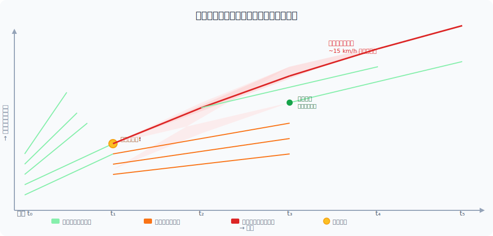
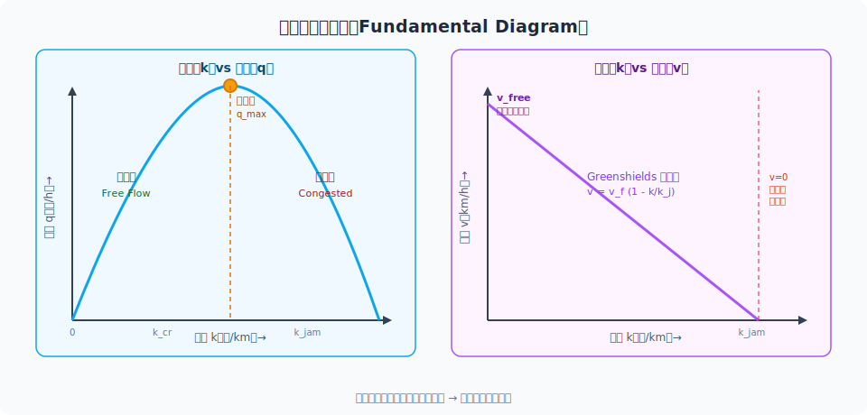
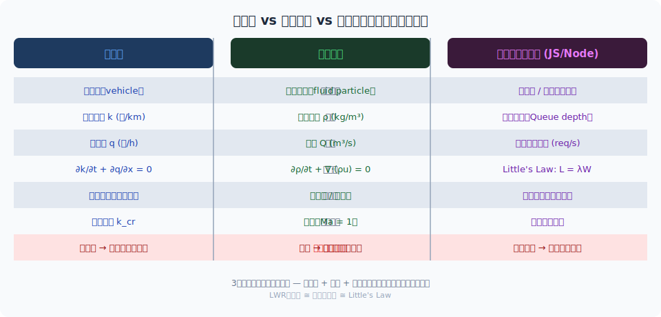
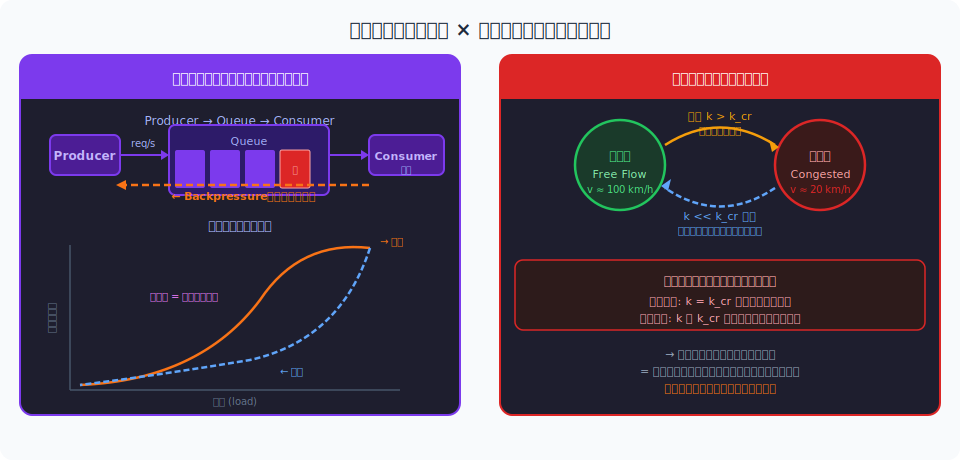
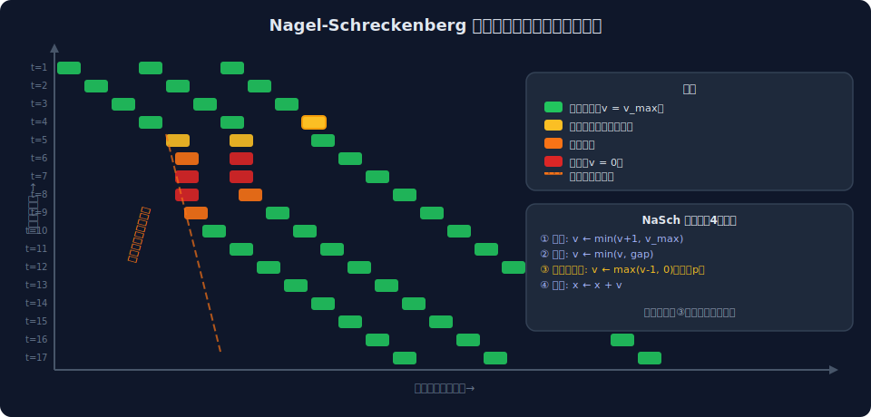
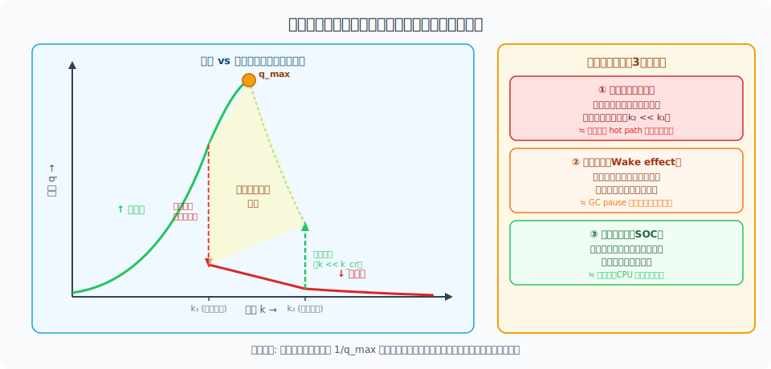

<!-- _class: lead -->
# 渋滞はなぜ消えないか

- 流体力学 × イベントループの類似性
- ワークショップ 2026-02-20


---

# アジェンダ

- **1.** 渋滞の基本現象と「幽霊渋滞」
- **2.** 交通流の数学的基礎
- **3.** 流体力学との類似性
- **4.** イベントループとの類似性
- **5.** 自己組織化と複雑系
- **6.** なぜ渋滞は消えないのか
- **7.** インタラクティブワーク・まとめ


---

<!-- _class: lead -->
# 今日の中心的な問い

- 渋滞の **原因が取り除かれた後も**、
- なぜ渋滞は **その場に留まり続ける** のか？
- 
- → 交通流・流体力学・イベントループを貫く **共通構造** を探る


---

# 渋滞の基本現象

- **交通流の3変数:**
- - **密度** k（台/km）— 道路上の車両数
- - **速度** v（km/h）— 平均走行速度
- - **流量** q（台/h）— 単位時間あたり通過台数（q = k × v）
- **基本方程式（連続方程式）:** ∂k/∂t + ∂q/∂x = 0
- **問題**: 密度が臨界値を超えると流量が急減 → 渋滞フェーズへの相転移


---

# 「幽霊渋滞」の実験証明

- **名古屋大学の実験（2008年）**
- - 22台の車を円形コース（230m）で均等間隔走行させる
- - 指示: 一定速度（30 km/h）を維持
- - **結果**: 数分で自発的に渋滞波が形成・循環
- - 原因: わずかな速度揺らぎが後続車に増幅されて伝播
- → **原因がなくても渋滞は自発的に生まれる**（Sugiyama et al. 2008）


---

<!-- _class: lead -->
# 幽霊渋滞の発生メカニズム




---

# 交通流の数学的基礎：LWR理論

- **Lighthill-Whitham-Richards モデル（1955-56年）**
- - 連続方程式: ∂k/∂t + ∂q/∂x = 0
- - 流量-密度関係: q = Q(k)（基本図）
- - 組み合わせ: ∂k/∂t + Q'(k) ∂k/∂x = 0
- **衝撃波速度（Rankine-Hugoniot 条件）:**
- w = (q₂ − q₁) / (k₂ − k₁)
- → 渋滞波が後方（上流）に伝播する速さを決定する


---

<!-- _class: lead -->
# 交通流の基本図（Fundamental Diagram）




---

<!-- _class: lead -->
# 流体力学との類似性


---

# 流体力学の基本概念

- **連続方程式（質量保存）:** ∂ρ/∂t + ∇·(ρu) = 0
- - ρ: 流体密度 ↔ 交通密度 k
- - u: 流速ベクトル ↔ 車速 v
- **衝撃波（Shock Wave）:**
- - 密度の不連続面が音速で伝播
- - 交通渋滞波 ≅ 音響衝撃波（後方伝播）
- **超音速 vs 亜音速:** Ma > 1 では情報が上流に伝わらない
- → 高速道路でも同様: 密度が臨界値を超えると下流情報が上流に届かない


---

# 密度波・衝撃波とは

- **密度波（Density Wave）:**
- - 粒子の集団運動ではなく「状態の変化」が伝播する現象
- - 交通: 各車は前進するが「渋滞」というパターンが後方へ動く
- - 流体: 音波も空気分子が前後に微振動するだけで波が伝播
- **衝撃波（Shock Wave）:**
- - 密度不連続面 — 渋滞の「最後尾」がまさにこれ
- - Rankine-Hugoniot 条件が波速を決定
- → **車は前に進み、渋滞は後ろに進む** — これが逆走の正体


---

<!-- _class: lead -->
# 交通流 vs 流体 vs イベントループ：類似構造




---

<!-- _class: lead -->
# イベントループとの類似性


---

# イベントループとは何か

- **Node.js / ブラウザの非同期処理モデル:**
- - Single-threaded だが I/O を非ブロッキングで捌く
- - コールバックキュー → Event Loop → コールスタック の循環
- **パイプライン構造:**
- - Producer（リクエスト発生） → Queue → Consumer（処理）
- - Queue が詰まる = **渋滞の発生**
- - 処理速度 < 到着速度 → **キュー爆発**（≒ 臨界密度超過）
- → Little's Law: L = λW（L: キュー長, λ: 到着率, W: 滞留時間）


---

# キューの詰まりと渋滞の共通構造

- **交通渋滞とキュー理論の対応:**
- - 到着率 λ > サービス率 μ → キュー無限成長（M/M/1 モデル）
- - 交通: 流入量 > 容量（capacity）→ 渋滞成長
- **「詰まり」の共通メカニズム:**
- - ① 一時的な流入過多が蓄積を引き起こす
- - ② 蓄積がさらに遅延を生み（ヘッドウェイ短縮/レイテンシ増加）
- - ③ 自己強化ループが安定した「詰まり状態」を形成する
- → 安定した詰まり = **アトラクター**（引力圏）として機能する


---

<!-- _class: lead -->
# バックプレッシャー × ヒステリシス




---

<!-- _class: lead -->
# 自己組織化と複雑系


---

# 自己組織化臨界現象（SOC）

- **Per Bak の砂山モデル（1987年）:**
- - 砂を一粒ずつ積む → あるとき「雪崩」が起きる
- - 雪崩の大きさはべき乗則に従う（スケールフリー）
- **SOC の特徴:**
- - 外部パラメータなしに系が自発的に臨界状態へ収束
- - 小さな擾乱でも大崩壊が起きる（予測不能）
- **交通との対応:**
- - ドライバーの小さなブレーキ → 大渋滞のトリガー
- - べき乗則: 渋滞長さの分布がスケールフリー


---

# セルオートマトンモデル

- **Nagel-Schreckenberg (NaSch) モデル（1992年）:**
- - 道路をセル列に離散化、車はセル上を移動
- **4つの更新ルール（各ステップで並列実行）:**
- - ① 加速: v ← min(v+1, v_max)
- - ② 前車との距離で減速: v ← min(v, gap)
- - ③ ランダム化（確率 p）: v ← max(v-1, 0)  ← **渋滞の種**
- - ④ 移動: x ← x + v
- → ③ の確率的ランダム化だけで **自発的渋滞波が再現される**


---

<!-- _class: lead -->
# NaSch モデル：時空間ダイアグラム




---

<!-- _class: lead -->
# なぜ渋滞は消えないのか


---

# ヒステリシス効果の詳細

- **ヒステリシス（hysteresis）とは:**
- - 系の状態が「過去の履歴」に依存する性質
- - 往路と復路で異なる経路をたどる（ループを描く）
- **交通流のヒステリシス:**
- - 渋滞発生: 密度 k > k_cr で流量が急落下（急速な相転移）
- - 渋滞解消: k が k_cr を大幅に下回るまで渋滞継続（回復が遅い）
- **数値例:** k_cr = 40台/km（発生）→ k = 15台/km 以下で解消
- → 原因（過密）が解消されても **「渋滞」という状態が維持される**


---

# 復元力の非対称性

- **なぜ復元が遅いのか — 3つの非対称性:**
- - **① 加速の物理的限界**: 車は 0→100 km/h に時間がかかる（制動より遅い）
- - **② 情報伝達の方向性**: 前方情報は後続に届くが後方情報は届かない
- - **③ 心理的ブレーキ**: 渋滞末尾への追突恐怖が過剰な制動を誘発
- **イベントループの対応:**
- - GC pause が発生すると完了まで処理が止まる
- - キューに溜まったタスクを順次処理するには時間がかかる
- - タイムアウト・リトライがさらにキューを増大させる
- → **「詰まり」は解消より発生の方が圧倒的に速い**


---

<!-- _class: lead -->
# 渋滞消滅の条件：臨界密度と脱出




---

<!-- _class: lead -->
# インタラクティブワーク


---

# ワーク①：渋滞シミュレーション体験

- **グループワーク（15分）:**
- - **Step 1**: 20人が円形に並び「前の人と一定距離を保って歩く」
- - **Step 2**: 1人が少し立ち止まる（2秒）
- - **Step 3**: 渋滞波がどこへ向かうか観察・記録する
- - **Step 4**: 「先頭が動いてから最後尾が動くまで」の遅延を測る
- **議論ポイント:**
- - 渋滞波は人の流れと逆向きに進んだか？
- - 最後尾に近いほど停止時間が長かったか？


---

# ワーク②：コードで考えるバックプレッシャー

- Node.js でキュー詰まりを再現するコード例:

```javascript
// Producer が Consumer より速い → キュー爆発
const queue = [];
let processing = false;

async function producer() {
  while (true) {
    queue.push(Date.now()); // 高頻度で投入
    await sleep(10);        // 10ms ごと
  }
}

async function consumer() {
  while (true) {
    if (queue.length > 0) {
      const task = queue.shift();
      await heavyWork(task);  // 50ms かかる処理
    }
    // 議論: queue.length が増え続けるのはなぜ?
    // → 到着率 (100 req/s) > 処理率 (20 req/s)
    // → Little's Law: L = λW → L → ∞
  }
}
```


---

# 工学的示唆と対策

- **交通工学の解決策:**
- - **オンランプ制御（Ramp Metering）**: 流入量を上限以下に制限
- - **可変速度規制**: 上流の速度を下げて密度波を分散
- - **Connected Vehicles**: 隊列走行でヘッドウェイ短縮・揺らぎ低減
- **ソフトウェアエンジニアリングへの応用:**
- - **バックプレッシャー設計**: Producer に流量制限をかける（rate limiting）
- - **キュー長の監視**: Little's Law でボトルネックを事前検知
- - **サーキットブレーカー**: 臨界状態でリクエストを遮断（ramp metering ≅ circuit breaker）


---

# まとめ

- **3つの主要メッセージ:**
- **① 渋滞は創発現象** — 原因なしに自発的に生まれ、SOC的に臨界状態を維持する
- **② 流体力学・キュー理論と同じ数学構造** — 連続方程式・衝撃波・ヒステリシスが共通
- **③ 消えない理由はヒステリシス** — 発生と解消は非対称で、復元には過剰なコストがかかる
- **エンジニアへの問い直し:**
- 「あなたのシステムの渋滞はどこで、いつ始まったか？」
- → バックプレッシャー設計 = **渋滞が生まれる前に流量を制御する**


---

# 参考文献

- **研究論文・書籍:**
- [Sugiyama et al. (2008)](https://iopscience.iop.org/article/10.1088/1367-2630/10/3/033001) — 幽霊渋滞の実験的実証
- [Lighthill & Whitham (1955)](https://royalsocietypublishing.org/doi/10.1098/rspa.1955.0089) — LWR 交通流理論
- [Nagel & Schreckenberg (1992)](https://link.springer.com/article/10.1051/jp1:1992277) — セルオートマトンモデル
- [Bak, Tang & Wiesenfeld (1987)](https://journals.aps.org/prl/abstract/10.1103/PhysRevLett.59.381) — 自己組織化臨界現象
- [Helbing (2001)](https://journals.aps.org/rmp/abstract/10.1103/RevModPhys.73.1067) — Traffic and related self-driven many-particle systems
- **ツール・シミュレーター:** [SUMO](https://sumo.dlr.de/), [MATSim](https://matsim.org/), [traffic-simulation.de](https://traffic-simulation.de/)

