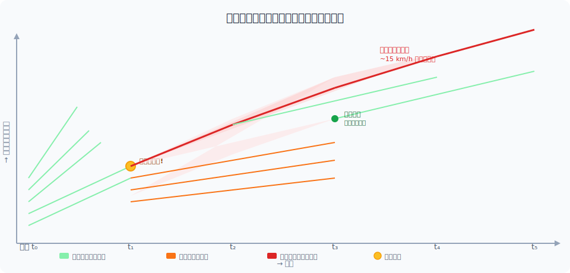
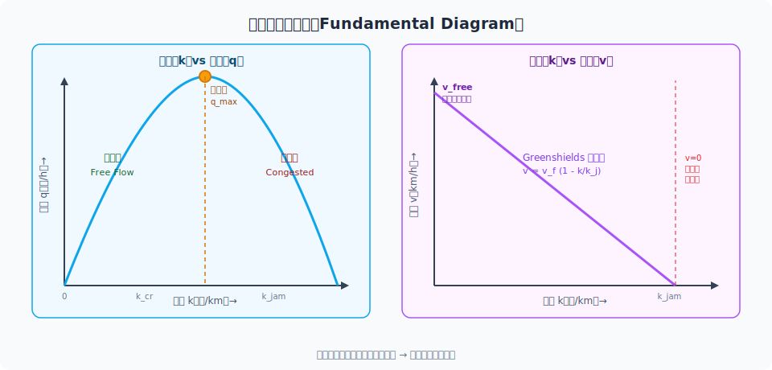
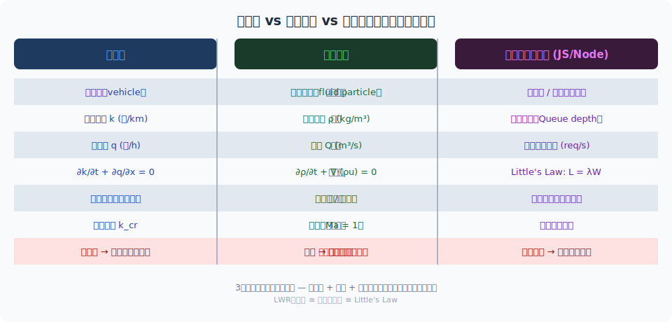
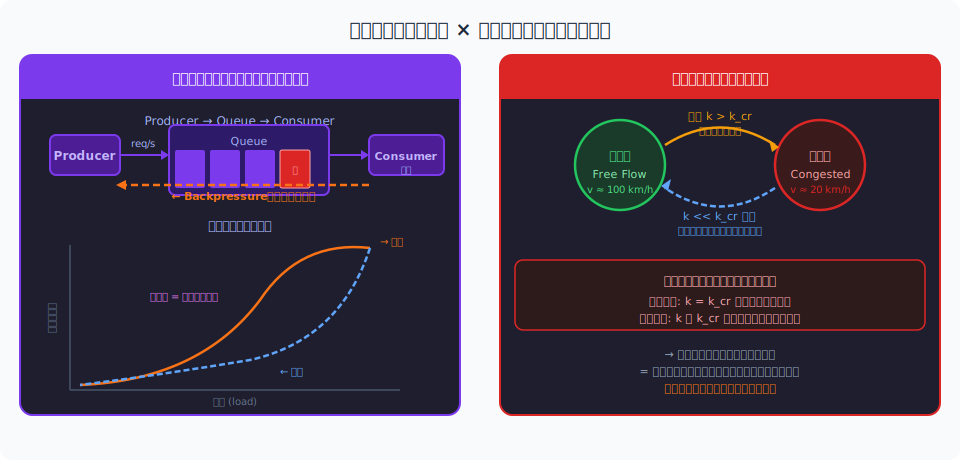
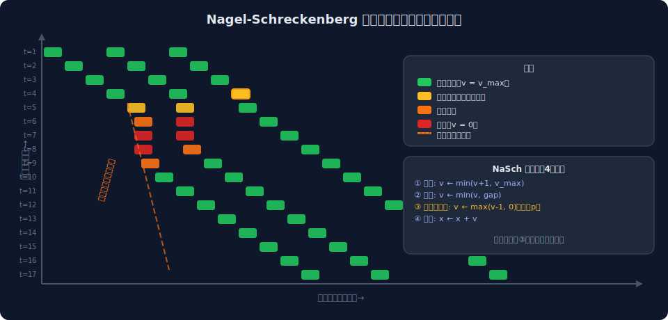
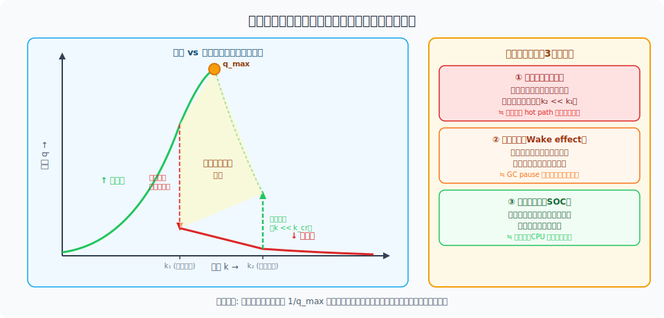

<!-- _class: lead -->
# 渋滞はなぜ消えないか

- 流体力学 × イベントループの類似性
- ワークショップ 2026-02-20


---

# アジェンダ

- **1.** 渋滞の基本現象と「幽霊渋滞」
- **2.** 交通流の数学的基礎
- **3.** 流体力学との類似性
- **4.** イベントループとの類似性
- **5.** 自己組織化と複雑系
- **6.** なぜ渋滞は消えないのか
- **7.** インタラクティブワーク・まとめ


---

<!-- _class: lead -->
# 今日の中心的な問い

- 渋滞の **原因が取り除かれた後も**、
- なぜ渋滞は **その場に留まり続ける** のか？
- 
- → 交通流・流体力学・イベントループを貫く **共通構造** を探る


---

# 渋滞の基本現象

- <svg viewBox="0 0 800 400" xmlns="http://www.w3.org/2000/svg" style="max-height:70vh;max-width:100%;display:block;margin:0 auto;">
<rect width="800" height="400" fill="#1a1a2e"/>
<text x="400" y="35" fill="#ffffff" font-size="15" text-anchor="middle" font-family="sans-serif">交通流の3変数と相転移</text>
<rect x="40" y="55" width="200" height="120" rx="10" fill="#16213e" stroke="#f9a825" stroke-width="2"/>
<text x="140" y="82" fill="#f9a825" font-size="14" text-anchor="middle" font-family="sans-serif">密度 k</text>
<text x="140" y="108" fill="#ffffff" font-size="12" text-anchor="middle" font-family="sans-serif">台/km</text>
<text x="140" y="133" fill="#aaaaaa" font-size="11" text-anchor="middle" font-family="sans-serif">道路上の車両数</text>
<text x="140" y="158" fill="#aaaaaa" font-size="10" text-anchor="middle" font-family="sans-serif">臨界値を超えると崩壊</text>
<rect x="300" y="55" width="200" height="120" rx="10" fill="#16213e" stroke="#f9a825" stroke-width="2"/>
<text x="400" y="82" fill="#f9a825" font-size="14" text-anchor="middle" font-family="sans-serif">速度 v</text>
<text x="400" y="108" fill="#ffffff" font-size="12" text-anchor="middle" font-family="sans-serif">km/h</text>
<text x="400" y="133" fill="#aaaaaa" font-size="11" text-anchor="middle" font-family="sans-serif">平均走行速度</text>
<text x="400" y="158" fill="#aaaaaa" font-size="10" text-anchor="middle" font-family="sans-serif">密度増加で急減</text>
<rect x="560" y="55" width="200" height="120" rx="10" fill="#16213e" stroke="#e91e63" stroke-width="2"/>
<text x="660" y="82" fill="#e91e63" font-size="14" text-anchor="middle" font-family="sans-serif">流量 q</text>
<text x="660" y="108" fill="#ffffff" font-size="12" text-anchor="middle" font-family="sans-serif">台/h = k × v</text>
<text x="660" y="133" fill="#aaaaaa" font-size="11" text-anchor="middle" font-family="sans-serif">通過台数</text>
<text x="660" y="158" fill="#aaaaaa" font-size="10" text-anchor="middle" font-family="sans-serif">臨界密度で最大化</text>
<polyline points="50,260 200,240 300,220 380,200 420,195 450,200 500,230 600,290 750,330" stroke="#f9a825" stroke-width="2.5" fill="none"/>
<text x="420" y="182" fill="#f9a825" font-size="11" font-family="sans-serif">q_max</text>
<line x1="420" y1="195" x2="420" y2="340" stroke="#aaaaaa" stroke-width="0.8" stroke-dasharray="4,3"/>
<text x="420" y="355" fill="#aaaaaa" font-size="10" text-anchor="middle" font-family="sans-serif">k_cr (臨界密度)</text>
<line x1="40" y1="340" x2="760" y2="340" stroke="#aaaaaa" stroke-width="1"/>
<line x1="40" y1="340" x2="40" y2="200" stroke="#aaaaaa" stroke-width="1"/>
<text x="400" y="385" fill="#aaaaaa" font-size="12" text-anchor="middle" font-family="sans-serif">∂k/∂t + ∂q/∂x = 0  (連続方程式)</text>
</svg>
- **交通流の3変数:**
- - **密度** k（台/km）— 道路上の車両数
- - **速度** v（km/h）— 平均走行速度
- - **流量** q（台/h）— 単位時間あたり通過台数（q = k × v）
- **基本方程式（連続方程式）:** ∂k/∂t + ∂q/∂x = 0
- **問題**: 密度が臨界値を超えると流量が急減 → 渋滞フェーズへの相転移


---

# 「幽霊渋滞」の実験証明

- <svg viewBox="0 0 800 400" xmlns="http://www.w3.org/2000/svg" style="max-height:70vh;max-width:100%;display:block;margin:0 auto;">
<rect width="800" height="400" fill="#1a1a2e"/>
<text x="400" y="35" fill="#ffffff" font-size="15" text-anchor="middle" font-family="sans-serif">名古屋大学実験 (2008) — 幽霊渋滞の自発的発生</text>
<circle cx="400" cy="220" r="140" fill="none" stroke="#16213e" stroke-width="40"/>
<circle cx="400" cy="220" r="140" fill="none" stroke="#aaaaaa" stroke-width="0.8" stroke-dasharray="8,4"/>
<text x="400" y="228" fill="#ffffff" font-size="13" text-anchor="middle" font-family="sans-serif">円形コース 230m</text>
<circle cx="400" cy="80" r="8" fill="#f9a825"/>
<circle cx="480" cy="95" r="8" fill="#f9a825"/>
<circle cx="543" cy="140" r="8" fill="#f9a825"/>
<circle cx="560" cy="220" r="8" fill="#f9a825"/>
<circle cx="543" cy="300" r="8" fill="#f9a825"/>
<circle cx="480" cy="345" r="8" fill="#f9a825"/>
<circle cx="400" cy="360" r="8" fill="#f9a825"/>
<circle cx="320" cy="345" r="8" fill="#f9a825"/>
<circle cx="257" cy="300" r="8" fill="#f9a825"/>
<circle cx="240" cy="220" r="8" fill="#f9a825"/>
<circle cx="257" cy="140" r="8" fill="#f9a825"/>
<circle cx="320" cy="95" r="8" fill="#f9a825"/>
<text x="610" y="85" fill="#aaaaaa" font-size="11" font-family="sans-serif">22台の車</text>
<text x="610" y="105" fill="#aaaaaa" font-size="11" font-family="sans-serif">均等間隔配置</text>
<text x="610" y="130" fill="#aaaaaa" font-size="11" font-family="sans-serif">指示: 30km/h維持</text>
<rect x="60" y="320" width="300" height="60" rx="8" fill="#16213e" stroke="#e91e63" stroke-width="1.5"/>
<text x="210" y="345" fill="#e91e63" font-size="12" text-anchor="middle" font-family="sans-serif">数分後: 自発的に</text>
<text x="210" y="368" fill="#e91e63" font-size="12" text-anchor="middle" font-family="sans-serif">渋滞波が循環発生</text>
<rect x="430" y="320" width="310" height="60" rx="8" fill="#16213e" stroke="#f9a825" stroke-width="1.5"/>
<text x="585" y="345" fill="#f9a825" font-size="12" text-anchor="middle" font-family="sans-serif">原因なしに</text>
<text x="585" y="368" fill="#f9a825" font-size="12" text-anchor="middle" font-family="sans-serif">渋滞は自発的に生まれる</text>
</svg>
- **名古屋大学の実験（2008年）**
- - 22台の車を円形コース（230m）で均等間隔走行させる
- - 指示: 一定速度（30 km/h）を維持
- - **結果**: 数分で自発的に渋滞波が形成・循環
- - 原因: わずかな速度揺らぎが後続車に増幅されて伝播
- → **原因がなくても渋滞は自発的に生まれる**（Sugiyama et al. 2008）


---

<!-- _class: lead -->
# 幽霊渋滞の発生メカニズム




---

# 交通流の数学的基礎：LWR理論

- **Lighthill-Whitham-Richards モデル（1955-56年）**
- - 連続方程式: ∂k/∂t + ∂q/∂x = 0
- - 流量-密度関係: q = Q(k)（基本図）
- - 組み合わせ: ∂k/∂t + Q'(k) ∂k/∂x = 0
- **衝撃波速度（Rankine-Hugoniot 条件）:**
- w = (q₂ − q₁) / (k₂ − k₁)
- → 渋滞波が後方（上流）に伝播する速さを決定する


---

<!-- _class: lead -->
# 交通流の基本図（Fundamental Diagram）




---

<!-- _class: lead -->
# 流体力学との類似性


---

# 流体力学の基本概念（1/2）

- <svg viewBox="0 0 800 400" xmlns="http://www.w3.org/2000/svg" style="max-height:70vh;max-width:100%;display:block;margin:0 auto;">
<rect width="800" height="400" fill="#1a1a2e"/>
<text x="400" y="35" fill="#ffffff" font-size="15" text-anchor="middle" font-family="sans-serif">流体力学 ↔ 交通流 の対応</text>
<rect x="30" y="55" width="350" height="35" rx="6" fill="#16213e" stroke="#f9a825" stroke-width="1.5"/>
<text x="205" y="78" fill="#f9a825" font-size="13" text-anchor="middle" font-family="sans-serif">流体力学</text>
<rect x="420" y="55" width="350" height="35" rx="6" fill="#16213e" stroke="#e91e63" stroke-width="1.5"/>
<text x="595" y="78" fill="#e91e63" font-size="13" text-anchor="middle" font-family="sans-serif">交通流</text>
<text x="205" y="120" fill="#ffffff" font-size="12" text-anchor="middle" font-family="sans-serif">流体密度 ρ (kg/m³)</text>
<text x="595" y="120" fill="#ffffff" font-size="12" text-anchor="middle" font-family="sans-serif">交通密度 k (台/km)</text>
<line x1="30" y1="132" x2="770" y2="132" stroke="#aaaaaa" stroke-width="0.5" stroke-dasharray="4,3"/>
<text x="205" y="162" fill="#ffffff" font-size="12" text-anchor="middle" font-family="sans-serif">流速ベクトル u (m/s)</text>
<text x="595" y="162" fill="#ffffff" font-size="12" text-anchor="middle" font-family="sans-serif">車速 v (km/h)</text>
<line x1="30" y1="174" x2="770" y2="174" stroke="#aaaaaa" stroke-width="0.5" stroke-dasharray="4,3"/>
<text x="205" y="204" fill="#ffffff" font-size="12" text-anchor="middle" font-family="sans-serif">質量流束 ρu</text>
<text x="595" y="204" fill="#ffffff" font-size="12" text-anchor="middle" font-family="sans-serif">交通流量 q = k × v</text>
<line x1="30" y1="216" x2="770" y2="216" stroke="#aaaaaa" stroke-width="0.5" stroke-dasharray="4,3"/>
<text x="205" y="246" fill="#ffffff" font-size="12" text-anchor="middle" font-family="sans-serif">音速 c (衝撃波伝播)</text>
<text x="595" y="246" fill="#ffffff" font-size="12" text-anchor="middle" font-family="sans-serif">渋滞波速 w ≈ -15km/h</text>
<line x1="30" y1="258" x2="770" y2="258" stroke="#aaaaaa" stroke-width="0.5" stroke-dasharray="4,3"/>
<text x="205" y="288" fill="#ffffff" font-size="12" text-anchor="middle" font-family="sans-serif">超音速 (Ma &gt; 1)</text>
<text x="595" y="288" fill="#ffffff" font-size="12" text-anchor="middle" font-family="sans-serif">高密度 (k &gt; k_cr)</text>
<rect x="100" y="320" width="600" height="55" rx="8" fill="#16213e" stroke="#f9a825" stroke-width="1"/>
<text x="400" y="345" fill="#f9a825" font-size="12" text-anchor="middle" font-family="sans-serif">連続方程式: ∂ρ/∂t + ∇·(ρu) = 0</text>
<text x="400" y="368" fill="#ffffff" font-size="11" text-anchor="middle" font-family="sans-serif">↕  交通連続方程式: ∂k/∂t + ∂q/∂x = 0</text>
</svg>
- **連続方程式（質量保存）:** ∂ρ/∂t + ∇·(ρu) = 0
- - ρ: 流体密度 ↔ 交通密度 k
- - u: 流速ベクトル ↔ 車速 v
- **衝撃波（Shock Wave）:**


---

# 流体力学の基本概念（2/2）

- <svg viewBox="0 0 800 400" xmlns="http://www.w3.org/2000/svg" style="max-height:70vh;max-width:100%;display:block;margin:0 auto;">
<rect width="800" height="400" fill="#1a1a2e"/>
<text x="400" y="35" fill="#ffffff" font-size="15" text-anchor="middle" font-family="sans-serif">衝撃波: 車は前進、渋滞は後退</text>
<line x1="50" y1="200" x2="750" y2="200" stroke="#aaaaaa" stroke-width="1.5"/>
<text x="400" y="380" fill="#aaaaaa" font-size="12" text-anchor="middle" font-family="sans-serif">道路（x軸）</text>
<rect x="60" y="165" width="40" height="25" rx="4" fill="#f9a825"/>
<rect x="120" y="165" width="40" height="25" rx="4" fill="#f9a825"/>
<rect x="180" y="165" width="40" height="25" rx="4" fill="#f9a825"/>
<polygon points="260,177 295,177 295,165 325,182 295,200 295,188 260,188" fill="#f9a825"/>
<rect x="340" y="161" width="32" height="25" rx="4" fill="#e91e63"/>
<rect x="380" y="161" width="32" height="25" rx="4" fill="#e91e63"/>
<rect x="420" y="161" width="32" height="25" rx="4" fill="#e91e63"/>
<rect x="460" y="161" width="32" height="25" rx="4" fill="#e91e63"/>
<rect x="500" y="161" width="32" height="25" rx="4" fill="#e91e63"/>
<rect x="540" y="161" width="32" height="25" rx="4" fill="#e91e63"/>
<rect x="580" y="161" width="32" height="25" rx="4" fill="#e91e63"/>
<rect x="620" y="161" width="32" height="25" rx="4" fill="#e91e63"/>
<rect x="660" y="161" width="32" height="25" rx="4" fill="#e91e63"/>
<line x1="340" y1="140" x2="340" y2="210" stroke="#e91e63" stroke-width="2" stroke-dasharray="6,3"/>
<text x="340" y="130" fill="#e91e63" font-size="11" text-anchor="middle" font-family="sans-serif">渋滞最後尾</text>
<polygon points="310,225 280,225 280,215 250,230 280,245 280,235 310,235" fill="#e91e63"/>
<text x="235" y="260" fill="#e91e63" font-size="11" text-anchor="middle" font-family="sans-serif">渋滞波 ←後方へ伝播</text>
<text x="110" y="135" fill="#f9a825" font-size="11" text-anchor="middle" font-family="sans-serif">自由流 v=100km/h</text>
<text x="600" y="135" fill="#e91e63" font-size="11" text-anchor="middle" font-family="sans-serif">渋滞 v≈0km/h</text>
<rect x="100" y="290" width="600" height="70" rx="8" fill="#16213e" stroke="#f9a825" stroke-width="1"/>
<text x="400" y="315" fill="#f9a825" font-size="12" text-anchor="middle" font-family="sans-serif">Rankine-Hugoniot 条件: w = (q₂ − q₁) / (k₂ − k₁)</text>
<text x="400" y="340" fill="#ffffff" font-size="11" text-anchor="middle" font-family="sans-serif">渋滞波は後方へ約 −15km/h で伝播する</text>
<text x="400" y="360" fill="#aaaaaa" font-size="10" text-anchor="middle" font-family="sans-serif">車は前進しながら渋滞という「状態のパターン」は後退する</text>
</svg>
- - 密度の不連続面が音速で伝播
- - 交通渋滞波 ≅ 音響衝撃波（後方伝播）
- **超音速 vs 亜音速:** Ma > 1 では情報が上流に伝わらない
- → 高速道路でも同様: 密度が臨界値を超えると下流情報が上流に届かない


---

# 密度波・衝撃波とは（1/2）

- <svg viewBox="0 0 800 400" xmlns="http://www.w3.org/2000/svg" style="max-height:70vh;max-width:100%;display:block;margin:0 auto;">
<rect width="800" height="400" fill="#1a1a2e"/>
<text x="400" y="35" fill="#ffffff" font-size="15" text-anchor="middle" font-family="sans-serif">密度波: 粒子ではなく「状態」が伝播する</text>
<rect x="40" y="60" width="330" height="150" rx="10" fill="#16213e" stroke="#f9a825" stroke-width="1.5"/>
<text x="205" y="88" fill="#f9a825" font-size="13" text-anchor="middle" font-family="sans-serif">音波 (空気)</text>
<text x="205" y="118" fill="#ffffff" font-size="12" text-anchor="middle" font-family="sans-serif">空気分子: 前後に振動するだけ</text>
<text x="205" y="143" fill="#ffffff" font-size="12" text-anchor="middle" font-family="sans-serif">音の波: 前方へ伝播</text>
<text x="205" y="193" fill="#aaaaaa" font-size="11" text-anchor="middle" font-family="sans-serif">粒子 ≠ 波の向き</text>
<rect x="430" y="60" width="330" height="150" rx="10" fill="#16213e" stroke="#e91e63" stroke-width="1.5"/>
<text x="595" y="88" fill="#e91e63" font-size="13" text-anchor="middle" font-family="sans-serif">交通流</text>
<text x="595" y="118" fill="#ffffff" font-size="12" text-anchor="middle" font-family="sans-serif">各車: 前方へ進む</text>
<text x="595" y="143" fill="#ffffff" font-size="12" text-anchor="middle" font-family="sans-serif">渋滞パターン: 後方へ移動</text>
<text x="595" y="193" fill="#aaaaaa" font-size="11" text-anchor="middle" font-family="sans-serif">車の向き ≠ 渋滞の向き</text>
<rect x="150" y="240" width="500" height="120" rx="10" fill="#16213e" stroke="#aaaaaa" stroke-width="1"/>
<text x="400" y="268" fill="#ffffff" font-size="13" text-anchor="middle" font-family="sans-serif">なぜ渋滞は後方に移動するのか？</text>
<text x="400" y="300" fill="#aaaaaa" font-size="12" text-anchor="middle" font-family="sans-serif">前の車が詰まる → 後ろの車も詰まる</text>
<text x="400" y="325" fill="#aaaaaa" font-size="12" text-anchor="middle" font-family="sans-serif">「詰まり」の情報が後方へ伝わる速さ &gt; 車の前進速度</text>
<text x="400" y="350" fill="#f9a825" font-size="11" text-anchor="middle" font-family="sans-serif">→ 渋滞最後尾が上流へ移動する</text>
</svg>
- **密度波（Density Wave）:**
- - 粒子の集団運動ではなく「状態の変化」が伝播する現象
- - 交通: 各車は前進するが「渋滞」というパターンが後方へ動く
- - 流体: 音波も空気分子が前後に微振動するだけで波が伝播


---

# 密度波・衝撃波とは（2/2）

- <svg viewBox="0 0 800 400" xmlns="http://www.w3.org/2000/svg" style="max-height:70vh;max-width:100%;display:block;margin:0 auto;">
<rect width="800" height="400" fill="#1a1a2e"/>
<text x="400" y="35" fill="#ffffff" font-size="15" text-anchor="middle" font-family="sans-serif">情報伝達の方向性 — 下流情報が上流に届かない</text>
<text x="400" y="80" fill="#aaaaaa" font-size="12" text-anchor="middle" font-family="sans-serif">低密度（自由流）: 情報は上流にも届く</text>
<polyline points="50,120 200,115 350,110 500,115 650,120 750,125" stroke="#4caf50" stroke-width="2.5" fill="none"/>
<polygon points="350,105 390,110 350,115" fill="#4caf50"/>
<polygon points="350,115 310,110 350,105" fill="#4caf50" opacity="0.4"/>
<text x="400" y="148" fill="#4caf50" font-size="11" text-anchor="middle" font-family="sans-serif">双方向: 前後の情報が伝わる (Ma &lt; 1 相当)</text>
<line x1="40" y1="170" x2="760" y2="170" stroke="#aaaaaa" stroke-width="0.5" stroke-dasharray="8,4"/>
<text x="400" y="200" fill="#aaaaaa" font-size="12" text-anchor="middle" font-family="sans-serif">高密度（渋滞）: 上流情報は届かない</text>
<polyline points="50,240 200,235 350,230 500,235 650,240 750,245" stroke="#e91e63" stroke-width="2.5" fill="none"/>
<polygon points="350,225 390,230 350,235" fill="#e91e63"/>
<text x="280" y="270" fill="#e91e63" font-size="11" text-anchor="middle" font-family="sans-serif">一方向のみ</text>
<text x="400" y="295" fill="#e91e63" font-size="11" text-anchor="middle" font-family="sans-serif">下流からの「前が空いた」情報が上流に届かない</text>
<text x="400" y="315" fill="#e91e63" font-size="11" text-anchor="middle" font-family="sans-serif">(Ma &gt; 1 相当 — 超音速では情報が上流に届かない)</text>
<rect x="100" y="340" width="600" height="45" rx="8" fill="#16213e" stroke="#f9a825" stroke-width="1"/>
<text x="400" y="367" fill="#f9a825" font-size="12" text-anchor="middle" font-family="sans-serif">これが「渋滞は消えにくい」物理的理由の一つ</text>
</svg>
- **衝撃波（Shock Wave）:**
- - 密度不連続面 — 渋滞の「最後尾」がまさにこれ
- - Rankine-Hugoniot 条件が波速を決定
- → **車は前に進み、渋滞は後ろに進む** — これが逆走の正体


---

<!-- _class: lead -->
# 交通流 vs 流体 vs イベントループ：類似構造




---

<!-- _class: lead -->
# イベントループとの類似性


---

# イベントループとは何か（1/2）

- <svg viewBox="0 0 800 400" xmlns="http://www.w3.org/2000/svg" style="max-height:70vh;max-width:100%;display:block;margin:0 auto;">
<rect width="800" height="400" fill="#1a1a2e"/>
<text x="400" y="35" fill="#ffffff" font-size="15" text-anchor="middle" font-family="sans-serif">イベントループ = 交通流のデジタル版</text>
<rect x="40" y="60" width="180" height="60" rx="8" fill="#16213e" stroke="#f9a825" stroke-width="1.5"/>
<text x="130" y="90" fill="#f9a825" font-size="12" text-anchor="middle" font-family="sans-serif">Producer</text>
<text x="130" y="110" fill="#aaaaaa" font-size="10" text-anchor="middle" font-family="sans-serif">リクエスト発生</text>
<polygon points="225,85 255,85 255,75 285,90 255,105 255,95 225,95" fill="#f9a825" opacity="0.7"/>
<rect x="290" y="60" width="220" height="60" rx="8" fill="#16213e" stroke="#4fc3f7" stroke-width="2"/>
<text x="400" y="90" fill="#4fc3f7" font-size="12" text-anchor="middle" font-family="sans-serif">Queue (キュー)</text>
<text x="400" y="110" fill="#aaaaaa" font-size="10" text-anchor="middle" font-family="sans-serif">k 台/km ≡ キュー長</text>
<polygon points="515,85 545,85 545,75 575,90 545,105 545,95 515,95" fill="#f9a825" opacity="0.7"/>
<rect x="580" y="60" width="180" height="60" rx="8" fill="#16213e" stroke="#e91e63" stroke-width="1.5"/>
<text x="670" y="90" fill="#e91e63" font-size="12" text-anchor="middle" font-family="sans-serif">Consumer</text>
<text x="670" y="110" fill="#aaaaaa" font-size="10" text-anchor="middle" font-family="sans-serif">処理実行</text>
<rect x="80" y="170" width="640" height="180" rx="10" fill="#16213e" stroke="#aaaaaa" stroke-width="1"/>
<text x="400" y="200" fill="#ffffff" font-size="13" text-anchor="middle" font-family="sans-serif">交通流との対応</text>
<text x="200" y="240" fill="#f9a825" font-size="12" text-anchor="middle" font-family="sans-serif">交通</text>
<text x="600" y="240" fill="#4fc3f7" font-size="12" text-anchor="middle" font-family="sans-serif">イベントループ</text>
<text x="200" y="268" fill="#ffffff" font-size="11" text-anchor="middle" font-family="sans-serif">密度 k (台/km)</text>
<text x="600" y="268" fill="#ffffff" font-size="11" text-anchor="middle" font-family="sans-serif">キュー長 L</text>
<text x="200" y="293" fill="#ffffff" font-size="11" text-anchor="middle" font-family="sans-serif">到着率 λ (台/h)</text>
<text x="600" y="293" fill="#ffffff" font-size="11" text-anchor="middle" font-family="sans-serif">リクエスト到着率 λ</text>
<text x="200" y="318" fill="#ffffff" font-size="11" text-anchor="middle" font-family="sans-serif">道路容量 (台/h)</text>
<text x="600" y="318" fill="#ffffff" font-size="11" text-anchor="middle" font-family="sans-serif">処理スループット μ</text>
<text x="400" y="348" fill="#e91e63" font-size="11" text-anchor="middle" font-family="sans-serif">λ &gt; μ → キュー爆発 ≡ 渋滞 (Little's Law: L = λW)</text>
</svg>
- **Node.js / ブラウザの非同期処理モデル:**
- - Single-threaded だが I/O を非ブロッキングで捌く
- - コールバックキュー → Event Loop → コールスタック の循環
- **パイプライン構造:**


---

# イベントループとは何か（2/2）

- <svg viewBox="0 0 800 400" xmlns="http://www.w3.org/2000/svg" style="max-height:70vh;max-width:100%;display:block;margin:0 auto;">
<rect width="800" height="400" fill="#1a1a2e"/>
<text x="400" y="35" fill="#ffffff" font-size="15" text-anchor="middle" font-family="sans-serif">キュー爆発のメカニズム (M/M/1 モデル)</text>
<text x="80" y="75" fill="#aaaaaa" font-size="12" font-family="sans-serif">キュー長 L</text>
<line x1="60" y1="340" x2="760" y2="340" stroke="#aaaaaa" stroke-width="1.5"/>
<line x1="60" y1="340" x2="60" y2="60" stroke="#aaaaaa" stroke-width="1.5"/>
<text x="400" y="375" fill="#aaaaaa" font-size="12" text-anchor="middle" font-family="sans-serif">利用率 ρ = λ/μ</text>
<text x="110" y="358" fill="#aaaaaa" font-size="10" text-anchor="middle" font-family="sans-serif">0.2</text>
<text x="215" y="358" fill="#aaaaaa" font-size="10" text-anchor="middle" font-family="sans-serif">0.4</text>
<text x="320" y="358" fill="#aaaaaa" font-size="10" text-anchor="middle" font-family="sans-serif">0.6</text>
<text x="425" y="358" fill="#aaaaaa" font-size="10" text-anchor="middle" font-family="sans-serif">0.8</text>
<text x="530" y="358" fill="#aaaaaa" font-size="10" text-anchor="middle" font-family="sans-serif">0.9</text>
<text x="630" y="358" fill="#aaaaaa" font-size="10" text-anchor="middle" font-family="sans-serif">0.95</text>
<text x="720" y="358" fill="#aaaaaa" font-size="10" text-anchor="middle" font-family="sans-serif">→1.0</text>
<polyline points="60,330 110,325 215,315 320,295 425,255 530,195 630,135 680,90 720,70" stroke="#f9a825" stroke-width="2.5" fill="none"/>
<text x="700" y="65" fill="#f9a825" font-size="11" font-family="sans-serif">L→∞</text>
<line x1="530" y1="60" x2="530" y2="340" stroke="#e91e63" stroke-width="1.5" stroke-dasharray="6,3"/>
<text x="530" y="55" fill="#e91e63" font-size="11" text-anchor="middle" font-family="sans-serif">臨界点</text>
<rect x="400" y="155" width="260" height="55" rx="6" fill="#16213e" stroke="#e91e63" stroke-width="1.5"/>
<text x="530" y="178" fill="#e91e63" font-size="11" text-anchor="middle" font-family="sans-serif">ρ = 0.9 → L = 9</text>
<text x="530" y="200" fill="#aaaaaa" font-size="10" text-anchor="middle" font-family="sans-serif">10%の余裕でもキューに9件溜まる</text>
<text x="400" y="290" fill="#f9a825" font-size="11" text-anchor="middle" font-family="sans-serif">L = ρ / (1-ρ) (M/M/1 公式)</text>
</svg>
- - Producer（リクエスト発生） → Queue → Consumer（処理）
- - Queue が詰まる = **渋滞の発生**
- - 処理速度 < 到着速度 → **キュー爆発**（≒ 臨界密度超過）
- → Little's Law: L = λW（L: キュー長, λ: 到着率, W: 滞留時間）


---

# キューの詰まりと渋滞の共通構造（1/2）

- <svg viewBox="0 0 800 400" xmlns="http://www.w3.org/2000/svg" style="max-height:70vh;max-width:100%;display:block;margin:0 auto;">
<rect width="800" height="400" fill="#1a1a2e"/>
<text x="400" y="35" fill="#ffffff" font-size="15" text-anchor="middle" font-family="sans-serif">渋滞とキュー: 同じ数学構造</text>
<rect x="40" y="60" width="330" height="290" rx="10" fill="#16213e" stroke="#f9a825" stroke-width="2"/>
<text x="205" y="88" fill="#f9a825" font-size="13" text-anchor="middle" font-family="sans-serif">交通渋滞 (LWR理論)</text>
<text x="205" y="125" fill="#ffffff" font-size="12" text-anchor="middle" font-family="sans-serif">到着率 λ = 流入量</text>
<text x="205" y="150" fill="#ffffff" font-size="12" text-anchor="middle" font-family="sans-serif">処理率 μ = 道路容量</text>
<text x="205" y="175" fill="#ffffff" font-size="12" text-anchor="middle" font-family="sans-serif">λ &gt; μ → 渋滞成長</text>
<text x="205" y="215" fill="#aaaaaa" font-size="11" text-anchor="middle" font-family="sans-serif">ヘッドウェイ短縮が遅延を増幅</text>
<text x="205" y="240" fill="#aaaaaa" font-size="11" text-anchor="middle" font-family="sans-serif">自己強化ループで安定化</text>
<text x="205" y="290" fill="#f9a825" font-size="14" text-anchor="middle" font-family="sans-serif">渋滞アトラクター</text>
<rect x="430" y="60" width="330" height="290" rx="10" fill="#16213e" stroke="#4fc3f7" stroke-width="2"/>
<text x="595" y="88" fill="#4fc3f7" font-size="13" text-anchor="middle" font-family="sans-serif">キュー理論 (M/M/1)</text>
<text x="595" y="125" fill="#ffffff" font-size="12" text-anchor="middle" font-family="sans-serif">到着率 λ</text>
<text x="595" y="150" fill="#ffffff" font-size="12" text-anchor="middle" font-family="sans-serif">処理率 μ</text>
<text x="595" y="175" fill="#ffffff" font-size="12" text-anchor="middle" font-family="sans-serif">λ &gt; μ → キュー無限成長</text>
<text x="595" y="215" fill="#aaaaaa" font-size="11" text-anchor="middle" font-family="sans-serif">レイテンシ増加がリトライを誘発</text>
<text x="595" y="240" fill="#aaaaaa" font-size="11" text-anchor="middle" font-family="sans-serif">タイムアウトがキューをさらに増大</text>
<text x="595" y="290" fill="#4fc3f7" font-size="14" text-anchor="middle" font-family="sans-serif">詰まりアトラクター</text>
</svg>
- **交通渋滞とキュー理論の対応:**
- - 到着率 λ > サービス率 μ → キュー無限成長（M/M/1 モデル）
- - 交通: 流入量 > 容量（capacity）→ 渋滞成長
- **「詰まり」の共通メカニズム:**


---

# キューの詰まりと渋滞の共通構造（2/2）

- - ① 一時的な流入過多が蓄積を引き起こす
- - ② 蓄積がさらに遅延を生み（ヘッドウェイ短縮/レイテンシ増加）
- - ③ 自己強化ループが安定した「詰まり状態」を形成する
- → 安定した詰まり = **アトラクター**（引力圏）として機能する


---

<!-- _class: lead -->
# バックプレッシャー × ヒステリシス




---

<!-- _class: lead -->
# 自己組織化と複雑系


---

# 自己組織化臨界現象（SOC）（1/2）

- <svg viewBox="0 0 800 400" xmlns="http://www.w3.org/2000/svg" style="max-height:70vh;max-width:100%;display:block;margin:0 auto;">
<rect width="800" height="400" fill="#1a1a2e"/>
<text x="400" y="35" fill="#ffffff" font-size="15" text-anchor="middle" font-family="sans-serif">自己組織化臨界現象 (SOC) — Per Bak の砂山モデル</text>
<rect x="30" y="60" width="350" height="200" rx="10" fill="#16213e" stroke="#f9a825" stroke-width="1.5"/>
<text x="205" y="88" fill="#f9a825" font-size="13" text-anchor="middle" font-family="sans-serif">砂山モデルの構造</text>
<polygon points="205,170 80,230 330,230" fill="#3a2a0a" stroke="#f9a825" stroke-width="1"/>
<polygon points="205,150 110,230 300,230" fill="#4a3a1a" stroke="#f9a825" stroke-width="0.5"/>
<circle cx="205" cy="148" r="5" fill="#f9a825"/>
<text x="205" y="136" fill="#f9a825" font-size="10" text-anchor="middle" font-family="sans-serif">新しい砂粒</text>
<polygon points="160,245 145,245 145,235 125,250 145,265 145,255 160,255" fill="#e91e63"/>
<text x="115" y="280" fill="#e91e63" font-size="10" text-anchor="middle" font-family="sans-serif">雪崩発生</text>
<text x="205" y="230" fill="#aaaaaa" font-size="10" text-anchor="middle" font-family="sans-serif">臨界角度を超えると崩壊</text>
<rect x="420" y="60" width="350" height="200" rx="10" fill="#16213e" stroke="#e91e63" stroke-width="1.5"/>
<text x="595" y="88" fill="#e91e63" font-size="13" text-anchor="middle" font-family="sans-serif">べき乗則 (スケールフリー)</text>
<text x="595" y="125" fill="#ffffff" font-size="12" text-anchor="middle" font-family="sans-serif">P(雪崩サイズ = s) ∝ s^(-α)</text>
<text x="595" y="158" fill="#ffffff" font-size="12" text-anchor="middle" font-family="sans-serif">小さな擾乱でも</text>
<text x="595" y="178" fill="#ffffff" font-size="12" text-anchor="middle" font-family="sans-serif">大崩壊を引き起こす</text>
<text x="595" y="210" fill="#aaaaaa" font-size="11" text-anchor="middle" font-family="sans-serif">事前に大きさは予測不能</text>
<text x="595" y="230" fill="#aaaaaa" font-size="11" text-anchor="middle" font-family="sans-serif">「臨界」が安定状態</text>
<rect x="80" y="285" width="640" height="90" rx="8" fill="#16213e" stroke="#aaaaaa" stroke-width="1"/>
<text x="400" y="310" fill="#ffffff" font-size="13" text-anchor="middle" font-family="sans-serif">交通との対応</text>
<text x="400" y="340" fill="#aaaaaa" font-size="12" text-anchor="middle" font-family="sans-serif">1台のブレーキ ↔ 砂粒1個 → 大渋滞を引き起こす可能性</text>
<text x="400" y="365" fill="#aaaaaa" font-size="11" text-anchor="middle" font-family="sans-serif">渋滞の長さ分布 ∝ べき乗則 (スケールフリー)</text>
</svg>
- **Per Bak の砂山モデル（1987年）:**
- - 砂を一粒ずつ積む → あるとき「雪崩」が起きる
- - 雪崩の大きさはべき乗則に従う（スケールフリー）
- **SOC の特徴:**


---

# 自己組織化臨界現象（SOC）（2/2）

- <svg viewBox="0 0 800 400" xmlns="http://www.w3.org/2000/svg" style="max-height:70vh;max-width:100%;display:block;margin:0 auto;">
<rect width="800" height="400" fill="#1a1a2e"/>
<text x="400" y="35" fill="#ffffff" font-size="15" text-anchor="middle" font-family="sans-serif">小さなブレーキ → 大渋滞へのカスケード</text>
<rect x="50" y="65" width="100" height="40" rx="6" fill="#f9a825" opacity="0.9"/>
<text x="100" y="90" fill="#1a1a2e" font-size="11" text-anchor="middle" font-family="sans-serif">車A ブレーキ</text>
<polygon points="155,82 185,82 185,72 215,85 185,98 185,88 155,98" fill="#f9a825" opacity="0.6"/>
<rect x="220" y="65" width="100" height="40" rx="6" fill="#f9a825" opacity="0.8"/>
<text x="270" y="90" fill="#1a1a2e" font-size="10" text-anchor="middle" font-family="sans-serif">車B 追従ブレーキ</text>
<polygon points="325,82 355,82 355,72 385,85 355,98 355,88 325,98" fill="#f9a825" opacity="0.5"/>
<rect x="390" y="65" width="100" height="40" rx="6" fill="#e91e63" opacity="0.8"/>
<text x="440" y="90" fill="#ffffff" font-size="10" text-anchor="middle" font-family="sans-serif">車C 急ブレーキ</text>
<polygon points="495,82 525,82 525,72 555,85 525,98 525,88 495,98" fill="#e91e63" opacity="0.5"/>
<rect x="560" y="65" width="120" height="40" rx="6" fill="#e91e63"/>
<text x="620" y="90" fill="#ffffff" font-size="11" text-anchor="middle" font-family="sans-serif">渋滞波 形成</text>
<text x="100" y="140" fill="#f9a825" font-size="10" text-anchor="middle" font-family="sans-serif">速度低下 -5%</text>
<text x="270" y="140" fill="#f9a825" font-size="10" text-anchor="middle" font-family="sans-serif">速度低下 -15%</text>
<text x="440" y="140" fill="#e91e63" font-size="10" text-anchor="middle" font-family="sans-serif">速度低下 -40%</text>
<text x="620" y="140" fill="#e91e63" font-size="10" text-anchor="middle" font-family="sans-serif">停止</text>
<rect x="60" y="170" width="680" height="80" rx="8" fill="#16213e" stroke="#f9a825" stroke-width="1"/>
<text x="400" y="198" fill="#f9a825" font-size="13" text-anchor="middle" font-family="sans-serif">増幅メカニズム</text>
<text x="400" y="225" fill="#ffffff" font-size="12" text-anchor="middle" font-family="sans-serif">後続車は前車より「大きく」反応する — 安全マージン確保のため</text>
<text x="400" y="245" fill="#aaaaaa" font-size="11" text-anchor="middle" font-family="sans-serif">この非対称な反応がSOC的な雪崩増幅を引き起こす</text>
<rect x="60" y="275" width="680" height="95" rx="8" fill="#16213e" stroke="#e91e63" stroke-width="1.5"/>
<text x="400" y="300" fill="#e91e63" font-size="13" text-anchor="middle" font-family="sans-serif">ソフトウェアシステムでの対応</text>
<text x="400" y="328" fill="#ffffff" font-size="12" text-anchor="middle" font-family="sans-serif">1台のサービス高負荷 → タイムアウト → リトライ増加 → 全体崩壊</text>
<text x="400" y="353" fill="#aaaaaa" font-size="11" text-anchor="middle" font-family="sans-serif">サーキットブレーカー = 渋滞の「オンランプ制御」</text>
</svg>
- - 外部パラメータなしに系が自発的に臨界状態へ収束
- - 小さな擾乱でも大崩壊が起きる（予測不能）
- **交通との対応:**
- - ドライバーの小さなブレーキ → 大渋滞のトリガー
- - べき乗則: 渋滞長さの分布がスケールフリー


---

# セルオートマトンモデル（1/2）

- **Nagel-Schreckenberg (NaSch) モデル（1992年）:**
- - 道路をセル列に離散化、車はセル上を移動
- **4つの更新ルール（各ステップで並列実行）:**
- - ① 加速: v ← min(v+1, v_max)


---

# セルオートマトンモデル（2/2）

- - ② 前車との距離で減速: v ← min(v, gap)
- - ③ ランダム化（確率 p）: v ← max(v-1, 0)  ← **渋滞の種**
- - ④ 移動: x ← x + v
- → ③ の確率的ランダム化だけで **自発的渋滞波が再現される**


---

<!-- _class: lead -->
# NaSch モデル：時空間ダイアグラム




---

<!-- _class: lead -->
# なぜ渋滞は消えないのか


---

# ヒステリシス効果の詳細（1/2）

- <svg viewBox="0 0 800 400" xmlns="http://www.w3.org/2000/svg" style="max-height:70vh;max-width:100%;display:block;margin:0 auto;">
<rect width="800" height="400" fill="#1a1a2e"/>
<text x="400" y="35" fill="#ffffff" font-size="15" text-anchor="middle" font-family="sans-serif">ヒステリシス: 往路と復路で経路が違う</text>
<line x1="60" y1="340" x2="740" y2="340" stroke="#aaaaaa" stroke-width="1.5"/>
<line x1="60" y1="340" x2="60" y2="60" stroke="#aaaaaa" stroke-width="1.5"/>
<text x="400" y="375" fill="#aaaaaa" font-size="12" text-anchor="middle" font-family="sans-serif">密度 k (台/km)</text>
<text x="30" y="200" fill="#aaaaaa" font-size="11" text-anchor="middle" font-family="sans-serif" transform="rotate(-90,30,200)">流量 q</text>
<text x="240" y="358" fill="#aaaaaa" font-size="10" text-anchor="middle" font-family="sans-serif">k_free</text>
<text x="400" y="358" fill="#e91e63" font-size="10" text-anchor="middle" font-family="sans-serif">k_cr (発生)</text>
<text x="530" y="358" fill="#4caf50" font-size="10" text-anchor="middle" font-family="sans-serif">k_dissolve</text>
<polyline points="60,310 150,280 240,240 330,190 400,155 450,170 520,230 600,285 680,320" stroke="#f9a825" stroke-width="2.5" fill="none" stroke-dasharray="8,4"/>
<text x="500" y="150" fill="#f9a825" font-size="11" font-family="sans-serif">密度増加方向 (渋滞発生)</text>
<polyline points="530,310 480,270 440,250 400,240 320,230 240,240 150,280 60,310" stroke="#4caf50" stroke-width="2.5" fill="none"/>
<text x="200" y="255" fill="#4caf50" font-size="11" font-family="sans-serif">密度減少方向 (渋滞解消)</text>
<line x1="400" y1="60" x2="400" y2="340" stroke="#e91e63" stroke-width="1.2" stroke-dasharray="6,3"/>
<line x1="530" y1="60" x2="530" y2="340" stroke="#4caf50" stroke-width="1.2" stroke-dasharray="6,3"/>
<rect x="500" y="70" width="200" height="55" rx="6" fill="#16213e" stroke="#e91e63" stroke-width="1"/>
<text x="600" y="92" fill="#e91e63" font-size="11" text-anchor="middle" font-family="sans-serif">発生より解消に</text>
<text x="600" y="112" fill="#e91e63" font-size="11" text-anchor="middle" font-family="sans-serif">低い密度が必要</text>
</svg>
- **ヒステリシス（hysteresis）とは:**
- - 系の状態が「過去の履歴」に依存する性質
- - 往路と復路で異なる経路をたどる（ループを描く）
- **交通流のヒステリシス:**


---

# ヒステリシス効果の詳細（2/2）

- - 渋滞発生: 密度 k > k_cr で流量が急落下（急速な相転移）
- - 渋滞解消: k が k_cr を大幅に下回るまで渋滞継続（回復が遅い）
- **数値例:** k_cr = 40台/km（発生）→ k = 15台/km 以下で解消
- → 原因（過密）が解消されても **「渋滞」という状態が維持される**


---

# 復元力の非対称性（1/2）

- **なぜ復元が遅いのか — 3つの非対称性:**
- - **① 加速の物理的限界**: 車は 0→100 km/h に時間がかかる（制動より遅い）
- - **② 情報伝達の方向性**: 前方情報は後続に届くが後方情報は届かない
- - **③ 心理的ブレーキ**: 渋滞末尾への追突恐怖が過剰な制動を誘発


---

# 復元力の非対称性（2/2）

- **イベントループの対応:**
- - GC pause が発生すると完了まで処理が止まる
- - キューに溜まったタスクを順次処理するには時間がかかる
- - タイムアウト・リトライがさらにキューを増大させる
- → **「詰まり」は解消より発生の方が圧倒的に速い**


---

<!-- _class: lead -->
# 渋滞消滅の条件：臨界密度と脱出




---

<!-- _class: lead -->
# インタラクティブワーク


---

# ワーク①：渋滞シミュレーション体験（1/2）

- <svg viewBox="0 0 800 400" xmlns="http://www.w3.org/2000/svg" style="max-height:70vh;max-width:100%;display:block;margin:0 auto;">
<rect width="800" height="400" fill="#1a1a2e"/>
<text x="400" y="35" fill="#ffffff" font-size="15" text-anchor="middle" font-family="sans-serif">ワーク①: 渋滞シミュレーション 実施要領</text>
<circle cx="300" cy="220" r="130" fill="none" stroke="#16213e" stroke-width="35"/>
<circle cx="300" cy="220" r="130" fill="none" stroke="#aaaaaa" stroke-width="0.8" stroke-dasharray="8,4"/>
<text x="300" y="228" fill="#ffffff" font-size="12" text-anchor="middle" font-family="sans-serif">20人が円形に</text>
<text x="300" y="248" fill="#aaaaaa" font-size="10" text-anchor="middle" font-family="sans-serif">一定間隔で歩く</text>
<circle cx="300" cy="90" r="10" fill="#e91e63"/>
<text x="300" y="75" fill="#e91e63" font-size="10" text-anchor="middle" font-family="sans-serif">1人だけ立ち止まる</text>
<rect x="490" y="60" width="280" height="310" rx="10" fill="#16213e" stroke="#f9a825" stroke-width="1.5"/>
<text x="630" y="90" fill="#f9a825" font-size="13" text-anchor="middle" font-family="sans-serif">観察ポイント</text>
<text x="630" y="125" fill="#ffffff" font-size="12" text-anchor="middle" font-family="sans-serif">渋滞波の方向</text>
<text x="630" y="148" fill="#aaaaaa" font-size="10" text-anchor="middle" font-family="sans-serif">人の流れと同じ？逆？</text>
<line x1="510" y1="160" x2="750" y2="160" stroke="#aaaaaa" stroke-width="0.5" stroke-dasharray="4,3"/>
<text x="630" y="185" fill="#ffffff" font-size="12" text-anchor="middle" font-family="sans-serif">停止時間の分布</text>
<text x="630" y="208" fill="#aaaaaa" font-size="10" text-anchor="middle" font-family="sans-serif">最後尾ほど長い？</text>
<line x1="510" y1="220" x2="750" y2="220" stroke="#aaaaaa" stroke-width="0.5" stroke-dasharray="4,3"/>
<text x="630" y="245" fill="#ffffff" font-size="12" text-anchor="middle" font-family="sans-serif">先頭→最後尾の遅延</text>
<text x="630" y="268" fill="#aaaaaa" font-size="10" text-anchor="middle" font-family="sans-serif">何秒のラグがある？</text>
<line x1="510" y1="280" x2="750" y2="280" stroke="#aaaaaa" stroke-width="0.5" stroke-dasharray="4,3"/>
<text x="630" y="305" fill="#f9a825" font-size="12" text-anchor="middle" font-family="sans-serif">時間: 15分</text>
<text x="630" y="330" fill="#aaaaaa" font-size="10" text-anchor="middle" font-family="sans-serif">結果を全体共有</text>
</svg>
- **グループワーク（15分）:**
- - **Step 1**: 20人が円形に並び「前の人と一定距離を保って歩く」
- - **Step 2**: 1人が少し立ち止まる（2秒）
- - **Step 3**: 渋滞波がどこへ向かうか観察・記録する


---

# ワーク①：渋滞シミュレーション体験（2/2）

- - **Step 4**: 「先頭が動いてから最後尾が動くまで」の遅延を測る
- **議論ポイント:**
- - 渋滞波は人の流れと逆向きに進んだか？
- - 最後尾に近いほど停止時間が長かったか？


---

# ワーク②：コードで考えるバックプレッシャー

- Node.js でキュー詰まりを再現するコード例:


---

# ワーク②：コードで考えるバックプレッシャー（コード例）

```javascript
// Producer が Consumer より速い → キュー爆発
const queue = [];
let processing = false;

async function producer() {
  while (true) {
    queue.push(Date.now()); // 高頻度で投入
    await sleep(10);        // 10ms ごと
  }
}

async function consumer() {
  while (true) {
    if (queue.length > 0) {
      const task = queue.shift();
      await heavyWork(task);  // 50ms かかる処理
    }
    // 議論: queue.length が増え続けるのはなぜ?
    // → 到着率 (100 req/s) > 処理率 (20 req/s)
    // → Little's Law: L = λW → L → ∞
  }
}
```


---

# 工学的示唆と対策（1/2）

- <svg viewBox="0 0 800 400" xmlns="http://www.w3.org/2000/svg" style="max-height:70vh;max-width:100%;display:block;margin:0 auto;">
<rect width="800" height="400" fill="#1a1a2e"/>
<text x="400" y="35" fill="#ffffff" font-size="15" text-anchor="middle" font-family="sans-serif">工学的解決策: 交通 ↔ ソフトウェア</text>
<rect x="30" y="55" width="350" height="300" rx="10" fill="#16213e" stroke="#f9a825" stroke-width="2"/>
<text x="205" y="83" fill="#f9a825" font-size="13" text-anchor="middle" font-family="sans-serif">交通工学の解決策</text>
<rect x="50" y="100" width="310" height="55" rx="6" fill="#1a2a1a"/>
<text x="205" y="122" fill="#4caf50" font-size="12" text-anchor="middle" font-family="sans-serif">オンランプ制御</text>
<text x="205" y="142" fill="#ffffff" font-size="11" text-anchor="middle" font-family="sans-serif">流入量を容量以下に制限</text>
<rect x="50" y="165" width="310" height="55" rx="6" fill="#1a2a1a"/>
<text x="205" y="187" fill="#4caf50" font-size="12" text-anchor="middle" font-family="sans-serif">可変速度規制</text>
<text x="205" y="207" fill="#ffffff" font-size="11" text-anchor="middle" font-family="sans-serif">上流の速度を下げて密度波を分散</text>
<rect x="50" y="230" width="310" height="55" rx="6" fill="#1a2a1a"/>
<text x="205" y="252" fill="#4caf50" font-size="12" text-anchor="middle" font-family="sans-serif">隊列走行 (Platooning)</text>
<text x="205" y="272" fill="#ffffff" font-size="11" text-anchor="middle" font-family="sans-serif">ヘッドウェイ短縮・揺らぎ低減</text>
<rect x="420" y="55" width="350" height="300" rx="10" fill="#16213e" stroke="#4fc3f7" stroke-width="2"/>
<text x="595" y="83" fill="#4fc3f7" font-size="13" text-anchor="middle" font-family="sans-serif">ソフトウェアの対応策</text>
<rect x="440" y="100" width="310" height="55" rx="6" fill="#0a1a2a"/>
<text x="595" y="122" fill="#4fc3f7" font-size="12" text-anchor="middle" font-family="sans-serif">Rate Limiting</text>
<text x="595" y="142" fill="#ffffff" font-size="11" text-anchor="middle" font-family="sans-serif">Producerに流量制限をかける</text>
<rect x="440" y="165" width="310" height="55" rx="6" fill="#0a1a2a"/>
<text x="595" y="187" fill="#4fc3f7" font-size="12" text-anchor="middle" font-family="sans-serif">Backpressure 設計</text>
<text x="595" y="207" fill="#ffffff" font-size="11" text-anchor="middle" font-family="sans-serif">キュー長監視・Little's Law活用</text>
<rect x="440" y="230" width="310" height="55" rx="6" fill="#0a1a2a"/>
<text x="595" y="252" fill="#4fc3f7" font-size="12" text-anchor="middle" font-family="sans-serif">Circuit Breaker</text>
<text x="595" y="272" fill="#ffffff" font-size="11" text-anchor="middle" font-family="sans-serif">臨界状態でリクエストを遮断</text>
<rect x="100" y="355" width="600" height="30" rx="6" fill="#16213e" stroke="#aaaaaa" stroke-width="0.8"/>
<text x="400" y="374" fill="#aaaaaa" font-size="11" text-anchor="middle" font-family="sans-serif">オンランプ制御 ≅ サーキットブレーカー の類似性</text>
</svg>
- **交通工学の解決策:**
- - **オンランプ制御（Ramp Metering）**: 流入量を上限以下に制限
- - **可変速度規制**: 上流の速度を下げて密度波を分散
- - **Connected Vehicles**: 隊列走行でヘッドウェイ短縮・揺らぎ低減


---

# 工学的示唆と対策（2/2）

- <svg viewBox="0 0 800 400" xmlns="http://www.w3.org/2000/svg" style="max-height:70vh;max-width:100%;display:block;margin:0 auto;">
<rect width="800" height="400" fill="#1a1a2e"/>
<text x="400" y="35" fill="#ffffff" font-size="15" text-anchor="middle" font-family="sans-serif">バックプレッシャー設計の原則</text>
<rect x="40" y="60" width="720" height="80" rx="10" fill="#16213e" stroke="#f9a825" stroke-width="2"/>
<text x="400" y="90" fill="#f9a825" font-size="14" text-anchor="middle" font-family="sans-serif">原則: 渋滞が生まれる前に流量を制御する</text>
<text x="400" y="118" fill="#ffffff" font-size="12" text-anchor="middle" font-family="sans-serif">臨界密度に達してからでは遅い — ヒステリシスにより解消コストが高い</text>
<rect x="40" y="165" width="220" height="190" rx="10" fill="#16213e" stroke="#aaaaaa" stroke-width="1"/>
<text x="150" y="193" fill="#aaaaaa" font-size="12" text-anchor="middle" font-family="sans-serif">監視指標</text>
<text x="150" y="228" fill="#ffffff" font-size="11" text-anchor="middle" font-family="sans-serif">キュー長 L</text>
<text x="150" y="253" fill="#ffffff" font-size="11" text-anchor="middle" font-family="sans-serif">処理レイテンシ p95</text>
<text x="150" y="278" fill="#ffffff" font-size="11" text-anchor="middle" font-family="sans-serif">エラー率</text>
<text x="150" y="303" fill="#ffffff" font-size="11" text-anchor="middle" font-family="sans-serif">利用率 ρ = λ/μ</text>
<text x="150" y="340" fill="#f9a825" font-size="10" text-anchor="middle" font-family="sans-serif">ρ &gt; 0.8 で警告</text>
<rect x="290" y="165" width="220" height="190" rx="10" fill="#16213e" stroke="#aaaaaa" stroke-width="1"/>
<text x="400" y="193" fill="#aaaaaa" font-size="12" text-anchor="middle" font-family="sans-serif">介入戦略</text>
<text x="400" y="228" fill="#ffffff" font-size="11" text-anchor="middle" font-family="sans-serif">Rate Limiting 発動</text>
<text x="400" y="253" fill="#ffffff" font-size="11" text-anchor="middle" font-family="sans-serif">Circuit Breaker OPEN</text>
<text x="400" y="278" fill="#ffffff" font-size="11" text-anchor="middle" font-family="sans-serif">キャッシュ活用</text>
<text x="400" y="303" fill="#ffffff" font-size="11" text-anchor="middle" font-family="sans-serif">非同期処理への切替</text>
<text x="400" y="340" fill="#f9a825" font-size="10" text-anchor="middle" font-family="sans-serif">早期介入が鍵</text>
<rect x="540" y="165" width="220" height="190" rx="10" fill="#16213e" stroke="#e91e63" stroke-width="1.5"/>
<text x="650" y="193" fill="#e91e63" font-size="12" text-anchor="middle" font-family="sans-serif">陥りやすい失敗</text>
<text x="650" y="228" fill="#ffffff" font-size="11" text-anchor="middle" font-family="sans-serif">崩壊後のスケールアウト</text>
<text x="650" y="253" fill="#ffffff" font-size="11" text-anchor="middle" font-family="sans-serif">リトライ無制限</text>
<text x="650" y="278" fill="#ffffff" font-size="11" text-anchor="middle" font-family="sans-serif">タイムアウト未設定</text>
<text x="650" y="303" fill="#ffffff" font-size="11" text-anchor="middle" font-family="sans-serif">监视なしで運用</text>
<text x="650" y="340" fill="#e91e63" font-size="10" text-anchor="middle" font-family="sans-serif">ヒステリシスの罠</text>
</svg>
- **ソフトウェアエンジニアリングへの応用:**
- - **バックプレッシャー設計**: Producer に流量制限をかける（rate limiting）
- - **キュー長の監視**: Little's Law でボトルネックを事前検知
- - **サーキットブレーカー**: 臨界状態でリクエストを遮断（ramp metering ≅ circuit breaker）


---

# まとめ

- **3つの主要メッセージ:**
- **① 渋滞は創発現象** — 原因なしに自発的に生まれ、SOC的に臨界状態を維持する
- **② 流体力学・キュー理論と同じ数学構造** — 連続方程式・衝撃波・ヒステリシスが共通
- **③ 消えない理由はヒステリシス** — 発生と解消は非対称で、復元には過剰なコストがかかる
- **エンジニアへの問い直し:**
- 「あなたのシステムの渋滞はどこで、いつ始まったか？」
- → バックプレッシャー設計 = **渋滞が生まれる前に流量を制御する**


---

# 参考文献

- **研究論文・書籍:**
- [Sugiyama et al. (2008)](https://iopscience.iop.org/article/10.1088/1367-2630/10/3/033001) — 幽霊渋滞の実験的実証
- [Lighthill & Whitham (1955)](https://royalsocietypublishing.org/doi/10.1098/rspa.1955.0089) — LWR 交通流理論
- [Nagel & Schreckenberg (1992)](https://link.springer.com/article/10.1051/jp1:1992277) — セルオートマトンモデル
- [Bak, Tang & Wiesenfeld (1987)](https://journals.aps.org/prl/abstract/10.1103/PhysRevLett.59.381) — 自己組織化臨界現象
- [Helbing (2001)](https://journals.aps.org/rmp/abstract/10.1103/RevModPhys.73.1067) — Traffic and related self-driven many-particle systems
- **ツール・シミュレーター:** [SUMO](https://sumo.dlr.de/), [MATSim](https://matsim.org/), [traffic-simulation.de](https://traffic-simulation.de/)

