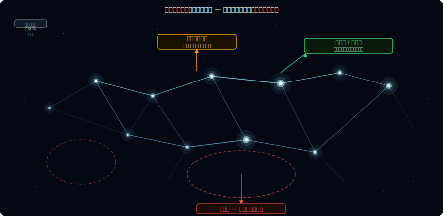
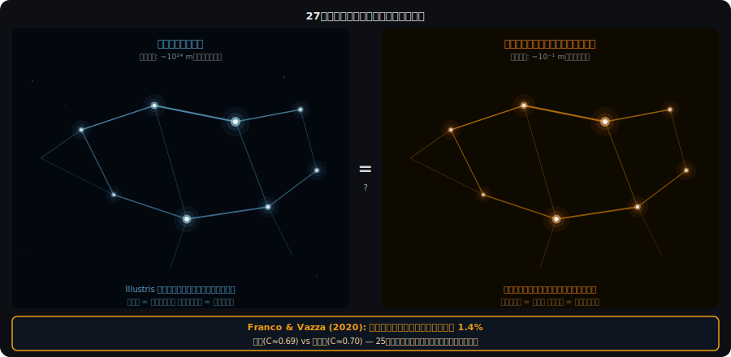
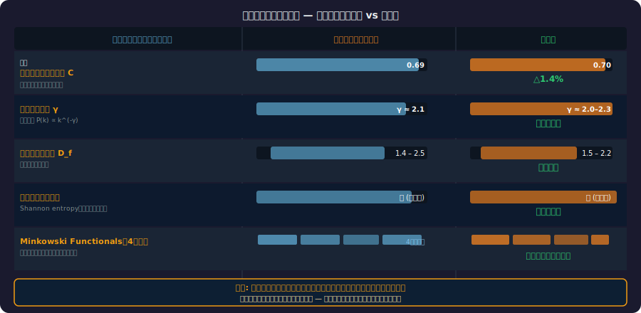
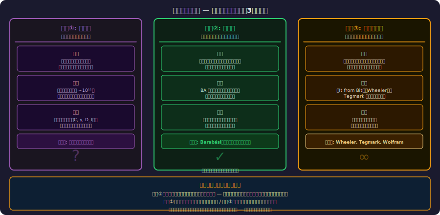

<!-- _class: lead -->
# 宇宙の大規模構造とニューラルネットの類似

- <svg viewBox="0 0 800 360" style="max-height:70vh;max-width:100%;display:block;margin:0 auto;" xmlns="http://www.w3.org/2000/svg">
  <rect width="800" height="360" fill="#1a1a2e"/>
  <text x="400" y="30" text-anchor="middle" fill="#f9a825" font-size="19" font-weight="bold" font-family="sans-serif">138億光年の宇宙 vs 860億個のニューロン</text>
  <!-- Left: cosmic web simplified -->
  <rect x="30" y="50" width="360" height="280" rx="8" fill="#0d1a30"/>
  <text x="210" y="72" text-anchor="middle" fill="#4fc3f7" font-size="13" font-weight="bold" font-family="sans-serif">コズミックウェブ</text>
  <!-- Filament nodes -->
  <circle cx="120" cy="120" r="8" fill="#f9a825" opacity="0.9"/>
  <circle cx="220" cy="100" r="12" fill="#f9a825"/>
  <circle cx="320" cy="140" r="7" fill="#f9a825" opacity="0.7"/>
  <circle cx="160" cy="210" r="10" fill="#f9a825" opacity="0.8"/>
  <circle cx="290" cy="220" r="9" fill="#f9a825" opacity="0.85"/>
  <circle cx="200" cy="280" r="6" fill="#f9a825" opacity="0.6"/>
  <circle cx="80" cy="270" r="7" fill="#f9a825" opacity="0.7"/>
  <!-- Filaments connecting -->
  <line x1="120" y1="120" x2="220" y2="100" stroke="#f9a825" stroke-width="1.5" opacity="0.6"/>
  <line x1="220" y1="100" x2="320" y2="140" stroke="#f9a825" stroke-width="1.5" opacity="0.5"/>
  <line x1="120" y1="120" x2="160" y2="210" stroke="#f9a825" stroke-width="1.2" opacity="0.5"/>
  <line x1="220" y1="100" x2="160" y2="210" stroke="#f9a825" stroke-width="1.2" opacity="0.4"/>
  <line x1="160" y1="210" x2="290" y2="220" stroke="#f9a825" stroke-width="1.5" opacity="0.6"/>
  <line x1="290" y1="220" x2="320" y2="140" stroke="#f9a825" stroke-width="1.2" opacity="0.4"/>
  <line x1="160" y1="210" x2="200" y2="280" stroke="#f9a825" stroke-width="1.2" opacity="0.4"/>
  <line x1="200" y1="280" x2="80" y2="270" stroke="#f9a825" stroke-width="1" opacity="0.4"/>
  <line x1="80" y1="270" x2="120" y2="120" stroke="#f9a825" stroke-width="1" opacity="0.3"/>
  <!-- Scale label -->
  <text x="210" y="316" text-anchor="middle" fill="#aaa" font-size="11" font-family="sans-serif">スケール: ~10²⁴ m（数十億光年）</text>
  <!-- Right: neuron network -->
  <rect x="410" y="50" width="360" height="280" rx="8" fill="#0d1a30"/>
  <text x="590" y="72" text-anchor="middle" fill="#e91e63" font-size="13" font-weight="bold" font-family="sans-serif">ニューラルネットワーク</text>
  <!-- Neuron bodies -->
  <circle cx="500" cy="120" r="9" fill="#e91e63" opacity="0.9"/>
  <circle cx="610" cy="105" r="13" fill="#e91e63"/>
  <circle cx="710" cy="145" r="8" fill="#e91e63" opacity="0.7"/>
  <circle cx="550" cy="215" r="11" fill="#e91e63" opacity="0.85"/>
  <circle cx="680" cy="225" r="9" fill="#e91e63" opacity="0.8"/>
  <circle cx="590" cy="285" r="7" fill="#e91e63" opacity="0.6"/>
  <circle cx="470" cy="275" r="8" fill="#e91e63" opacity="0.7"/>
  <!-- Synapses -->
  <line x1="500" y1="120" x2="610" y2="105" stroke="#e91e63" stroke-width="1.5" opacity="0.6"/>
  <line x1="610" y1="105" x2="710" y2="145" stroke="#e91e63" stroke-width="1.5" opacity="0.5"/>
  <line x1="500" y1="120" x2="550" y2="215" stroke="#e91e63" stroke-width="1.2" opacity="0.5"/>
  <line x1="610" y1="105" x2="550" y2="215" stroke="#e91e63" stroke-width="1.2" opacity="0.4"/>
  <line x1="550" y1="215" x2="680" y2="225" stroke="#e91e63" stroke-width="1.5" opacity="0.6"/>
  <line x1="680" y1="225" x2="710" y2="145" stroke="#e91e63" stroke-width="1.2" opacity="0.4"/>
  <line x1="550" y1="215" x2="590" y2="285" stroke="#e91e63" stroke-width="1.2" opacity="0.4"/>
  <line x1="590" y1="285" x2="470" y2="275" stroke="#e91e63" stroke-width="1" opacity="0.4"/>
  <line x1="470" y1="275" x2="500" y2="120" stroke="#e91e63" stroke-width="1" opacity="0.3"/>
  <text x="590" y="316" text-anchor="middle" fill="#aaa" font-size="11" font-family="sans-serif">スケール: ~10⁻¹ m（脳の直径）</text>
  <!-- Center question -->
  <text x="400" y="348" text-anchor="middle" fill="#f9a825" font-size="14" font-weight="bold" font-family="sans-serif">27桁のスケール差を超えて、なぜ同じ形なのか？</text>
</svg>
- 偶然か、必然か
- 
- 138億光年の宇宙と860億個のニューロン —
- 27桁の差を超えて、なぜ同じ形をしているのか

---

# アジェンダ — 7部構成

> *7つのセクションで宇宙大規模構造と神経網の構造的類似性を解明する*

- **Part 1:** 宇宙の大規模構造 — コズミックウェブとは何か
- **Part 2:** ニューラルネットワーク — 生物的・人工的
- **Part 3:** 衝撃の視覚的類似 — 並べてみると...
- **Part 4:** 定量的研究 — Franco & Vazza (2020) 他
- **Part 5:** なぜ似ているのか？ — 3つの仮説
- **Part 6:** 哲学的・SF的含意
- **Part 7:** まとめと未解決の問い

---

<!-- _class: lead -->
# Part 1: 宇宙の大規模構造

- コズミックウェブ — 138億年の重力が刻んだ構造

---

# 宇宙の「泡構造」— 138億年の重力の結晶（1/2）

> *重力が138億年かけて作り出した泡構造はコズミックウェブの骨格をなす*

- <svg viewBox="0 0 800 360" style="max-height:70vh;max-width:100%;display:block;margin:0 auto;" xmlns="http://www.w3.org/2000/svg">
  <rect width="800" height="360" fill="#1a1a2e"/>
  <text x="400" y="28" text-anchor="middle" fill="#f9a825" font-size="18" font-weight="bold" font-family="sans-serif">コズミックウェブの発見と規模</text>
  <!-- Discovery box -->
  <rect x="40" y="50" width="340" height="140" rx="8" fill="#16213e" stroke="#4fc3f7" stroke-width="1.5"/>
  <text x="210" y="74" text-anchor="middle" fill="#4fc3f7" font-size="13" font-weight="bold" font-family="sans-serif">発見の歴史</text>
  <text x="55" y="96" fill="#ffffff" font-size="11" font-family="sans-serif">1980年代 CfA Redshift Survey:</text>
  <text x="55" y="114" fill="#ffffff" font-size="11" font-family="sans-serif">銀河が「壁」状に分布することを発見</text>
  <text x="55" y="134" fill="#ffffff" font-size="11" font-family="sans-serif">銀河は一様に分布せず</text>
  <text x="55" y="152" fill="#f9a825" font-size="11" font-family="sans-serif">フィラメント・シート・ボイドが複雑に絡合</text>
  <text x="55" y="172" fill="#aaa" font-size="10" font-family="sans-serif">スケール: 数百万〜数十億光年</text>
  <!-- Three components -->
  <rect x="420" y="50" width="340" height="140" rx="8" fill="#16213e" stroke="#f9a825" stroke-width="1.5"/>
  <text x="590" y="74" text-anchor="middle" fill="#f9a825" font-size="13" font-weight="bold" font-family="sans-serif">コズミックウェブの三要素</text>
  <!-- Filaments -->
  <rect x="435" y="86" width="90" height="38" rx="4" fill="#1a3a5a" stroke="#4fc3f7" stroke-width="1"/>
  <text x="480" y="105" text-anchor="middle" fill="#4fc3f7" font-size="11" font-weight="bold" font-family="sans-serif">フィラメント</text>
  <text x="480" y="118" text-anchor="middle" fill="#aaa" font-size="9" font-family="sans-serif">銀河がつながる糸</text>
  <!-- Sheets -->
  <rect x="545" y="86" width="90" height="38" rx="4" fill="#1a3a5a" stroke="#f9a825" stroke-width="1"/>
  <text x="590" y="105" text-anchor="middle" fill="#f9a825" font-size="11" font-weight="bold" font-family="sans-serif">シート</text>
  <text x="590" y="118" text-anchor="middle" fill="#aaa" font-size="9" font-family="sans-serif">壁状の平面構造</text>
  <!-- Voids -->
  <rect x="655" y="86" width="90" height="38" rx="4" fill="#1a3a5a" stroke="#e91e63" stroke-width="1"/>
  <text x="700" y="105" text-anchor="middle" fill="#e91e63" font-size="11" font-weight="bold" font-family="sans-serif">ボイド</text>
  <text x="700" y="118" text-anchor="middle" fill="#aaa" font-size="9" font-family="sans-serif">物質のない空洞</text>
  <!-- Nodes -->
  <text x="590" y="158" text-anchor="middle" fill="#ffffff" font-size="11" font-family="sans-serif">銀河・銀河団: フィラメントの交点（ノード）に集中</text>
  <text x="590" y="175" text-anchor="middle" fill="#aaa" font-size="10" font-family="sans-serif">クモの巣状の巨大構造</text>
  <!-- Dark matter section -->
  <rect x="40" y="215" width="720" height="120" rx="8" fill="#16213e" stroke="#ce93d8" stroke-width="1"/>
  <text x="400" y="238" text-anchor="middle" fill="#ce93d8" font-size="13" font-weight="bold" font-family="sans-serif">暗黒物質が骨格を作る仕組み</text>
  <rect x="60" y="252" width="200" height="64" rx="6" fill="#1a1a2e" stroke="#555" stroke-width="1"/>
  <text x="160" y="272" text-anchor="middle" fill="#ffffff" font-size="11" font-family="sans-serif">宇宙の質量組成</text>
  <text x="160" y="290" text-anchor="middle" fill="#ce93d8" font-size="11" font-family="sans-serif">暗黒エネルギー: 68%</text>
  <text x="160" y="308" text-anchor="middle" fill="#4fc3f7" font-size="11" font-family="sans-serif">暗黒物質: 27%　通常: 5%</text>
  <text x="400" y="272" text-anchor="middle" fill="#ffffff" font-size="11" font-family="sans-serif">ビッグバン後の微小な密度ゆらぎ</text>
  <text x="400" y="290" text-anchor="middle" fill="#ffffff" font-size="11" font-family="sans-serif">↓ 重力で増幅 → フィラメント形成</text>
  <text x="400" y="308" text-anchor="middle" fill="#f9a825" font-size="11" font-weight="bold" font-family="sans-serif">銀河・銀河団がその交点に誕生</text>
  <text x="640" y="272" text-anchor="middle" fill="#ffffff" font-size="11" font-family="sans-serif">シミュレーション:</text>
  <text x="640" y="290" text-anchor="middle" fill="#4fc3f7" font-size="11" font-family="sans-serif">Millennium / Illustris-TNG</text>
  <text x="640" y="308" text-anchor="middle" fill="#aaa" font-size="10" font-family="sans-serif">観測と驚くほど一致</text>
</svg>
- 大規模構造（Large-Scale Structure, LSS）の発見:
- - 1980年代 CfA Redshift Survey: 銀河が「壁」状に分布することを発見
- - 銀河は一様に分布せず、**フィラメント・シート・ボイド**が複雑に絡み合う
- - スケール: 数百万〜数十億光年

---

# 宇宙の「泡構造」— 138億年の重力の結晶（2/2）

> *フィラメントとボイドが宇宙規模のネットワークを形成*

- <svg viewBox="0 0 800 360" style="max-height:70vh;max-width:100%;display:block;margin:0 auto;" xmlns="http://www.w3.org/2000/svg">
  <rect width="800" height="360" fill="#1a1a2e"/>
  <text x="400" y="28" text-anchor="middle" fill="#f9a825" font-size="18" font-weight="bold" font-family="sans-serif">コズミックウェブの発見と規模</text>
  <!-- Discovery box -->
  <rect x="40" y="50" width="340" height="140" rx="8" fill="#16213e" stroke="#4fc3f7" stroke-width="1.5"/>
  <text x="210" y="74" text-anchor="middle" fill="#4fc3f7" font-size="13" font-weight="bold" font-family="sans-serif">発見の歴史</text>
  <text x="55" y="96" fill="#ffffff" font-size="11" font-family="sans-serif">1980年代 CfA Redshift Survey:</text>
  <text x="55" y="114" fill="#ffffff" font-size="11" font-family="sans-serif">銀河が「壁」状に分布することを発見</text>
  <text x="55" y="134" fill="#ffffff" font-size="11" font-family="sans-serif">銀河は一様に分布せず</text>
  <text x="55" y="152" fill="#f9a825" font-size="11" font-family="sans-serif">フィラメント・シート・ボイドが複雑に絡合</text>
  <text x="55" y="172" fill="#aaa" font-size="10" font-family="sans-serif">スケール: 数百万〜数十億光年</text>
  <!-- Three components -->
  <rect x="420" y="50" width="340" height="140" rx="8" fill="#16213e" stroke="#f9a825" stroke-width="1.5"/>
  <text x="590" y="74" text-anchor="middle" fill="#f9a825" font-size="13" font-weight="bold" font-family="sans-serif">コズミックウェブの三要素</text>
  <!-- Filaments -->
  <rect x="435" y="86" width="90" height="38" rx="4" fill="#1a3a5a" stroke="#4fc3f7" stroke-width="1"/>
  <text x="480" y="105" text-anchor="middle" fill="#4fc3f7" font-size="11" font-weight="bold" font-family="sans-serif">フィラメント</text>
  <text x="480" y="118" text-anchor="middle" fill="#aaa" font-size="9" font-family="sans-serif">銀河がつながる糸</text>
  <!-- Sheets -->
  <rect x="545" y="86" width="90" height="38" rx="4" fill="#1a3a5a" stroke="#f9a825" stroke-width="1"/>
  <text x="590" y="105" text-anchor="middle" fill="#f9a825" font-size="11" font-weight="bold" font-family="sans-serif">シート</text>
  <text x="590" y="118" text-anchor="middle" fill="#aaa" font-size="9" font-family="sans-serif">壁状の平面構造</text>
  <!-- Voids -->
  <rect x="655" y="86" width="90" height="38" rx="4" fill="#1a3a5a" stroke="#e91e63" stroke-width="1"/>
  <text x="700" y="105" text-anchor="middle" fill="#e91e63" font-size="11" font-weight="bold" font-family="sans-serif">ボイド</text>
  <text x="700" y="118" text-anchor="middle" fill="#aaa" font-size="9" font-family="sans-serif">物質のない空洞</text>
  <!-- Nodes -->
  <text x="590" y="158" text-anchor="middle" fill="#ffffff" font-size="11" font-family="sans-serif">銀河・銀河団: フィラメントの交点（ノード）に集中</text>
  <text x="590" y="175" text-anchor="middle" fill="#aaa" font-size="10" font-family="sans-serif">クモの巣状の巨大構造</text>
  <!-- Dark matter section -->
  <rect x="40" y="215" width="720" height="120" rx="8" fill="#16213e" stroke="#ce93d8" stroke-width="1"/>
  <text x="400" y="238" text-anchor="middle" fill="#ce93d8" font-size="13" font-weight="bold" font-family="sans-serif">暗黒物質が骨格を作る仕組み</text>
  <rect x="60" y="252" width="200" height="64" rx="6" fill="#1a1a2e" stroke="#555" stroke-width="1"/>
  <text x="160" y="272" text-anchor="middle" fill="#ffffff" font-size="11" font-family="sans-serif">宇宙の質量組成</text>
  <text x="160" y="290" text-anchor="middle" fill="#ce93d8" font-size="11" font-family="sans-serif">暗黒エネルギー: 68%</text>
  <text x="160" y="308" text-anchor="middle" fill="#4fc3f7" font-size="11" font-family="sans-serif">暗黒物質: 27%　通常: 5%</text>
  <text x="400" y="272" text-anchor="middle" fill="#ffffff" font-size="11" font-family="sans-serif">ビッグバン後の微小な密度ゆらぎ</text>
  <text x="400" y="290" text-anchor="middle" fill="#ffffff" font-size="11" font-family="sans-serif">↓ 重力で増幅 → フィラメント形成</text>
  <text x="400" y="308" text-anchor="middle" fill="#f9a825" font-size="11" font-weight="bold" font-family="sans-serif">銀河・銀河団がその交点に誕生</text>
  <text x="640" y="272" text-anchor="middle" fill="#ffffff" font-size="11" font-family="sans-serif">シミュレーション:</text>
  <text x="640" y="290" text-anchor="middle" fill="#4fc3f7" font-size="11" font-family="sans-serif">Millennium / Illustris-TNG</text>
  <text x="640" y="308" text-anchor="middle" fill="#aaa" font-size="10" font-family="sans-serif">観測と驚くほど一致</text>
</svg>
- 
- コズミックウェブ（Cosmic Web）:
- - 宇宙全体を覆う、クモの巣状の巨大構造
- - 銀河・銀河団がフィラメントの交点（ノード）に集中する

---

# コズミックウェブの三要素

---

# 暗黒物質と重力 — 見えない骨格（1/2）

> *宇宙質量の27%を占める暗黒物質が大規模構造の見えない骨格を形成する*

- <svg viewBox="0 0 800 340" style="max-height:70vh;max-width:100%;display:block;margin:0 auto;" xmlns="http://www.w3.org/2000/svg">
  <rect width="800" height="340" fill="#1a1a2e"/>
  <text x="400" y="28" text-anchor="middle" fill="#f9a825" font-size="18" font-weight="bold" font-family="sans-serif">フィラメント形成 — 138億年の重力の働き</text>
  <!-- Step 1: Big Bang density fluctuations -->
  <rect x="40" y="55" width="160" height="220" rx="8" fill="#16213e" stroke="#555" stroke-width="1"/>
  <text x="120" y="76" text-anchor="middle" fill="#aaa" font-size="11" font-weight="bold" font-family="sans-serif">ビッグバン直後</text>
  <!-- Uniform dots -->
  <circle cx="80" cy="100" r="3" fill="#aaa" opacity="0.6"/>
  <circle cx="120" cy="95" r="4" fill="#aaa" opacity="0.7"/>
  <circle cx="160" cy="102" r="3" fill="#aaa" opacity="0.5"/>
  <circle cx="90" cy="135" r="3" fill="#aaa" opacity="0.65"/>
  <circle cx="145" cy="130" r="4" fill="#aaa" opacity="0.7"/>
  <circle cx="175" cy="140" r="3" fill="#aaa" opacity="0.5"/>
  <circle cx="75" cy="165" r="4" fill="#aaa" opacity="0.6"/>
  <circle cx="125" cy="170" r="3" fill="#aaa" opacity="0.5"/>
  <circle cx="165" cy="162" r="3" fill="#aaa" opacity="0.65"/>
  <text x="120" y="225" text-anchor="middle" fill="#aaa" font-size="10" font-family="sans-serif">ほぼ均一な</text>
  <text x="120" y="240" text-anchor="middle" fill="#aaa" font-size="10" font-family="sans-serif">微小な密度ゆらぎ</text>
  <!-- Arrow 1 -->
  <line x1="200" y1="165" x2="235" y2="165" stroke="#555" stroke-width="2"/>
  <polygon points="233,160 245,165 233,170" fill="#555"/>
  <text x="217" y="155" text-anchor="middle" fill="#aaa" font-size="9" font-family="sans-serif">重力</text>
  <!-- Step 2: Clumping begins -->
  <rect x="245" y="55" width="160" height="220" rx="8" fill="#16213e" stroke="#4fc3f7" stroke-width="1"/>
  <text x="325" y="76" text-anchor="middle" fill="#4fc3f7" font-size="11" font-weight="bold" font-family="sans-serif">数億年後</text>
  <!-- Some clustering -->
  <circle cx="285" cy="100" r="6" fill="#4fc3f7" opacity="0.5"/>
  <circle cx="320" cy="96" r="8" fill="#4fc3f7" opacity="0.6"/>
  <circle cx="365" cy="103" r="5" fill="#4fc3f7" opacity="0.4"/>
  <circle cx="295" cy="140" r="5" fill="#4fc3f7" opacity="0.5"/>
  <circle cx="355" cy="135" r="9" fill="#4fc3f7" opacity="0.7"/>
  <circle cx="285" cy="175" r="6" fill="#4fc3f7" opacity="0.4"/>
  <circle cx="330" cy="180" r="6" fill="#4fc3f7" opacity="0.5"/>
  <line x1="320" y1="96" x2="355" y2="135" stroke="#4fc3f7" stroke-width="1" opacity="0.4"/>
  <text x="325" y="225" text-anchor="middle" fill="#4fc3f7" font-size="10" font-family="sans-serif">密な領域が</text>
  <text x="325" y="240" text-anchor="middle" fill="#4fc3f7" font-size="10" font-family="sans-serif">より多く引き寄せる</text>
  <!-- Arrow 2 -->
  <line x1="405" y1="165" x2="440" y2="165" stroke="#555" stroke-width="2"/>
  <polygon points="438,160 450,165 438,170" fill="#555"/>
  <!-- Step 3: Filaments forming -->
  <rect x="450" y="55" width="160" height="220" rx="8" fill="#16213e" stroke="#f9a825" stroke-width="1.5"/>
  <text x="530" y="76" text-anchor="middle" fill="#f9a825" font-size="11" font-weight="bold" font-family="sans-serif">数十億年後</text>
  <!-- Clear filament structure -->
  <circle cx="490" cy="100" r="10" fill="#f9a825" opacity="0.8"/>
  <circle cx="570" cy="105" r="8" fill="#f9a825" opacity="0.7"/>
  <circle cx="530" cy="165" r="14" fill="#f9a825"/>
  <circle cx="475" cy="200" r="7" fill="#f9a825" opacity="0.6"/>
  <circle cx="595" cy="195" r="9" fill="#f9a825" opacity="0.7"/>
  <line x1="490" y1="100" x2="530" y2="165" stroke="#f9a825" stroke-width="2.5" opacity="0.7"/>
  <line x1="570" y1="105" x2="530" y2="165" stroke="#f9a825" stroke-width="2.5" opacity="0.7"/>
  <line x1="530" y1="165" x2="475" y2="200" stroke="#f9a825" stroke-width="2" opacity="0.6"/>
  <line x1="530" y1="165" x2="595" y2="195" stroke="#f9a825" stroke-width="2" opacity="0.6"/>
  <text x="530" y="225" text-anchor="middle" fill="#f9a825" font-size="10" font-family="sans-serif">フィラメント構造</text>
  <text x="530" y="240" text-anchor="middle" fill="#f9a825" font-size="10" font-family="sans-serif">コズミックウェブ誕生</text>
  <!-- Arrow 3 -->
  <line x1="610" y1="165" x2="645" y2="165" stroke="#555" stroke-width="2"/>
  <polygon points="643,160 655,165 643,170" fill="#555"/>
  <!-- Step 4: Modern -->
  <rect x="655" y="55" width="115" height="220" rx="8" fill="#16213e" stroke="#ce93d8" stroke-width="1.5"/>
  <text x="712" y="76" text-anchor="middle" fill="#ce93d8" font-size="11" font-weight="bold" font-family="sans-serif">現在</text>
  <circle cx="685" cy="108" r="10" fill="#ce93d8" opacity="0.8"/>
  <circle cx="735" cy="112" r="8" fill="#ce93d8" opacity="0.7"/>
  <circle cx="710" cy="165" r="16" fill="#ce93d8"/>
  <circle cx="678" cy="198" r="8" fill="#ce93d8" opacity="0.6"/>
  <circle cx="743" cy="194" r="10" fill="#ce93d8" opacity="0.7"/>
  <line x1="685" y1="108" x2="710" y2="165" stroke="#ce93d8" stroke-width="3" opacity="0.8"/>
  <line x1="735" y1="112" x2="710" y2="165" stroke="#ce93d8" stroke-width="3" opacity="0.8"/>
  <line x1="710" y1="165" x2="678" y2="198" stroke="#ce93d8" stroke-width="2.5" opacity="0.7"/>
  <line x1="710" y1="165" x2="743" y2="194" stroke="#ce93d8" stroke-width="2.5" opacity="0.7"/>
  <text x="712" y="228" text-anchor="middle" fill="#ce93d8" font-size="10" font-family="sans-serif">成熟した</text>
  <text x="712" y="243" text-anchor="middle" fill="#ce93d8" font-size="10" font-family="sans-serif">コズミックウェブ</text>
  <!-- Caption -->
  <text x="400" y="298" text-anchor="middle" fill="#aaa" font-size="11" font-family="sans-serif">重力という単純なルールから自己組織化で生まれる複雑な構造</text>
</svg>
- 宇宙の質量組成:
- - **暗黒エネルギー**: 68% — 宇宙膨張を加速
- - **暗黒物質**: 27% — コズミックウェブの骨格を作る
- - **通常物質**: 5% — 私たちが観測できる全て

---

# 暗黒物質と重力 — 見えない骨格（2/2）

> *暗黒物質ハローの分布がフィラメント構造の形成を決定的に支配する*

- <svg viewBox="0 0 800 340" style="max-height:70vh;max-width:100%;display:block;margin:0 auto;" xmlns="http://www.w3.org/2000/svg">
  <rect width="800" height="340" fill="#1a1a2e"/>
  <text x="400" y="28" text-anchor="middle" fill="#f9a825" font-size="18" font-weight="bold" font-family="sans-serif">フィラメント形成 — 138億年の重力の働き</text>
  <!-- Step 1: Big Bang density fluctuations -->
  <rect x="40" y="55" width="160" height="220" rx="8" fill="#16213e" stroke="#555" stroke-width="1"/>
  <text x="120" y="76" text-anchor="middle" fill="#aaa" font-size="11" font-weight="bold" font-family="sans-serif">ビッグバン直後</text>
  <!-- Uniform dots -->
  <circle cx="80" cy="100" r="3" fill="#aaa" opacity="0.6"/>
  <circle cx="120" cy="95" r="4" fill="#aaa" opacity="0.7"/>
  <circle cx="160" cy="102" r="3" fill="#aaa" opacity="0.5"/>
  <circle cx="90" cy="135" r="3" fill="#aaa" opacity="0.65"/>
  <circle cx="145" cy="130" r="4" fill="#aaa" opacity="0.7"/>
  <circle cx="175" cy="140" r="3" fill="#aaa" opacity="0.5"/>
  <circle cx="75" cy="165" r="4" fill="#aaa" opacity="0.6"/>
  <circle cx="125" cy="170" r="3" fill="#aaa" opacity="0.5"/>
  <circle cx="165" cy="162" r="3" fill="#aaa" opacity="0.65"/>
  <text x="120" y="225" text-anchor="middle" fill="#aaa" font-size="10" font-family="sans-serif">ほぼ均一な</text>
  <text x="120" y="240" text-anchor="middle" fill="#aaa" font-size="10" font-family="sans-serif">微小な密度ゆらぎ</text>
  <!-- Arrow 1 -->
  <line x1="200" y1="165" x2="235" y2="165" stroke="#555" stroke-width="2"/>
  <polygon points="233,160 245,165 233,170" fill="#555"/>
  <text x="217" y="155" text-anchor="middle" fill="#aaa" font-size="9" font-family="sans-serif">重力</text>
  <!-- Step 2: Clumping begins -->
  <rect x="245" y="55" width="160" height="220" rx="8" fill="#16213e" stroke="#4fc3f7" stroke-width="1"/>
  <text x="325" y="76" text-anchor="middle" fill="#4fc3f7" font-size="11" font-weight="bold" font-family="sans-serif">数億年後</text>
  <!-- Some clustering -->
  <circle cx="285" cy="100" r="6" fill="#4fc3f7" opacity="0.5"/>
  <circle cx="320" cy="96" r="8" fill="#4fc3f7" opacity="0.6"/>
  <circle cx="365" cy="103" r="5" fill="#4fc3f7" opacity="0.4"/>
  <circle cx="295" cy="140" r="5" fill="#4fc3f7" opacity="0.5"/>
  <circle cx="355" cy="135" r="9" fill="#4fc3f7" opacity="0.7"/>
  <circle cx="285" cy="175" r="6" fill="#4fc3f7" opacity="0.4"/>
  <circle cx="330" cy="180" r="6" fill="#4fc3f7" opacity="0.5"/>
  <line x1="320" y1="96" x2="355" y2="135" stroke="#4fc3f7" stroke-width="1" opacity="0.4"/>
  <text x="325" y="225" text-anchor="middle" fill="#4fc3f7" font-size="10" font-family="sans-serif">密な領域が</text>
  <text x="325" y="240" text-anchor="middle" fill="#4fc3f7" font-size="10" font-family="sans-serif">より多く引き寄せる</text>
  <!-- Arrow 2 -->
  <line x1="405" y1="165" x2="440" y2="165" stroke="#555" stroke-width="2"/>
  <polygon points="438,160 450,165 438,170" fill="#555"/>
  <!-- Step 3: Filaments forming -->
  <rect x="450" y="55" width="160" height="220" rx="8" fill="#16213e" stroke="#f9a825" stroke-width="1.5"/>
  <text x="530" y="76" text-anchor="middle" fill="#f9a825" font-size="11" font-weight="bold" font-family="sans-serif">数十億年後</text>
  <!-- Clear filament structure -->
  <circle cx="490" cy="100" r="10" fill="#f9a825" opacity="0.8"/>
  <circle cx="570" cy="105" r="8" fill="#f9a825" opacity="0.7"/>
  <circle cx="530" cy="165" r="14" fill="#f9a825"/>
  <circle cx="475" cy="200" r="7" fill="#f9a825" opacity="0.6"/>
  <circle cx="595" cy="195" r="9" fill="#f9a825" opacity="0.7"/>
  <line x1="490" y1="100" x2="530" y2="165" stroke="#f9a825" stroke-width="2.5" opacity="0.7"/>
  <line x1="570" y1="105" x2="530" y2="165" stroke="#f9a825" stroke-width="2.5" opacity="0.7"/>
  <line x1="530" y1="165" x2="475" y2="200" stroke="#f9a825" stroke-width="2" opacity="0.6"/>
  <line x1="530" y1="165" x2="595" y2="195" stroke="#f9a825" stroke-width="2" opacity="0.6"/>
  <text x="530" y="225" text-anchor="middle" fill="#f9a825" font-size="10" font-family="sans-serif">フィラメント構造</text>
  <text x="530" y="240" text-anchor="middle" fill="#f9a825" font-size="10" font-family="sans-serif">コズミックウェブ誕生</text>
  <!-- Arrow 3 -->
  <line x1="610" y1="165" x2="645" y2="165" stroke="#555" stroke-width="2"/>
  <polygon points="643,160 655,165 643,170" fill="#555"/>
  <!-- Step 4: Modern -->
  <rect x="655" y="55" width="115" height="220" rx="8" fill="#16213e" stroke="#ce93d8" stroke-width="1.5"/>
  <text x="712" y="76" text-anchor="middle" fill="#ce93d8" font-size="11" font-weight="bold" font-family="sans-serif">現在</text>
  <circle cx="685" cy="108" r="10" fill="#ce93d8" opacity="0.8"/>
  <circle cx="735" cy="112" r="8" fill="#ce93d8" opacity="0.7"/>
  <circle cx="710" cy="165" r="16" fill="#ce93d8"/>
  <circle cx="678" cy="198" r="8" fill="#ce93d8" opacity="0.6"/>
  <circle cx="743" cy="194" r="10" fill="#ce93d8" opacity="0.7"/>
  <line x1="685" y1="108" x2="710" y2="165" stroke="#ce93d8" stroke-width="3" opacity="0.8"/>
  <line x1="735" y1="112" x2="710" y2="165" stroke="#ce93d8" stroke-width="3" opacity="0.8"/>
  <line x1="710" y1="165" x2="678" y2="198" stroke="#ce93d8" stroke-width="2.5" opacity="0.7"/>
  <line x1="710" y1="165" x2="743" y2="194" stroke="#ce93d8" stroke-width="2.5" opacity="0.7"/>
  <text x="712" y="228" text-anchor="middle" fill="#ce93d8" font-size="10" font-family="sans-serif">成熟した</text>
  <text x="712" y="243" text-anchor="middle" fill="#ce93d8" font-size="10" font-family="sans-serif">コズミックウェブ</text>
  <!-- Caption -->
  <text x="400" y="298" text-anchor="middle" fill="#aaa" font-size="11" font-family="sans-serif">重力という単純なルールから自己組織化で生まれる複雑な構造</text>
</svg>
- 
- 暗黒物質がフィラメントを形成する仕組み:
- - ビッグバン直後の微小な密度ゆらぎ → 重力で増幅
- - 密な領域が引き合い、フィラメント状に物質が集積
- - 銀河・銀河団はその交点に誕生する

---

# シミュレーションが明かす構造（1/2）

> *N体シミュレーションが宇宙大規模構造の形成プロセスを定量的に再現する*

- <svg viewBox="0 0 800 340" style="max-height:70vh;max-width:100%;display:block;margin:0 auto;" xmlns="http://www.w3.org/2000/svg">
  <rect width="800" height="340" fill="#1a1a2e"/>
  <text x="400" y="28" text-anchor="middle" fill="#f9a825" font-size="18" font-weight="bold" font-family="sans-serif">コズミックウェブのシミュレーションと観測の一致</text>
  <!-- Left: simulation -->
  <rect x="40" y="50" width="340" height="230" rx="8" fill="#0d1a30" stroke="#f9a825" stroke-width="1.5"/>
  <text x="210" y="74" text-anchor="middle" fill="#f9a825" font-size="13" font-weight="bold" font-family="sans-serif">シミュレーション（Illustris-TNG）</text>
  <!-- Simulated cosmic web dots -->
  <circle cx="120" cy="115" r="9" fill="#f9a825"/>
  <circle cx="200" cy="105" r="14" fill="#f9a825"/>
  <circle cx="300" cy="130" r="8" fill="#f9a825" opacity="0.8"/>
  <circle cx="150" cy="185" r="11" fill="#f9a825" opacity="0.9"/>
  <circle cx="260" cy="200" r="10" fill="#f9a825" opacity="0.85"/>
  <circle cx="340" cy="165" r="7" fill="#f9a825" opacity="0.7"/>
  <circle cx="90" cy="235" r="8" fill="#f9a825" opacity="0.6"/>
  <circle cx="195" cy="250" r="7" fill="#f9a825" opacity="0.65"/>
  <!-- Filaments -->
  <line x1="120" y1="115" x2="200" y2="105" stroke="#f9a825" stroke-width="2" opacity="0.6"/>
  <line x1="200" y1="105" x2="300" y2="130" stroke="#f9a825" stroke-width="2" opacity="0.5"/>
  <line x1="120" y1="115" x2="150" y2="185" stroke="#f9a825" stroke-width="1.5" opacity="0.5"/>
  <line x1="200" y1="105" x2="150" y2="185" stroke="#f9a825" stroke-width="1.5" opacity="0.4"/>
  <line x1="150" y1="185" x2="260" y2="200" stroke="#f9a825" stroke-width="2" opacity="0.6"/>
  <line x1="260" y1="200" x2="340" y2="165" stroke="#f9a825" stroke-width="1.5" opacity="0.4"/>
  <line x1="150" y1="185" x2="195" y2="250" stroke="#f9a825" stroke-width="1.5" opacity="0.4"/>
  <line x1="195" y1="250" x2="90" y2="235" stroke="#f9a825" stroke-width="1" opacity="0.4"/>
  <text x="210" y="275" text-anchor="middle" fill="#aaa" font-size="11" font-family="sans-serif">重力方程式のみから生成</text>
  <!-- Right: observation -->
  <rect x="420" y="50" width="340" height="230" rx="8" fill="#0d1a30" stroke="#e91e63" stroke-width="1.5"/>
  <text x="590" y="74" text-anchor="middle" fill="#e91e63" font-size="13" font-weight="bold" font-family="sans-serif">実際の観測（銀河サーベイ）</text>
  <!-- Observed cosmic web dots -->
  <circle cx="500" cy="118" r="9" fill="#e91e63"/>
  <circle cx="580" cy="108" r="14" fill="#e91e63"/>
  <circle cx="680" cy="133" r="8" fill="#e91e63" opacity="0.8"/>
  <circle cx="530" cy="188" r="11" fill="#e91e63" opacity="0.9"/>
  <circle cx="640" cy="203" r="10" fill="#e91e63" opacity="0.85"/>
  <circle cx="720" cy="168" r="7" fill="#e91e63" opacity="0.7"/>
  <circle cx="470" cy="238" r="8" fill="#e91e63" opacity="0.6"/>
  <circle cx="575" cy="253" r="7" fill="#e91e63" opacity="0.65"/>
  <!-- Filaments -->
  <line x1="500" y1="118" x2="580" y2="108" stroke="#e91e63" stroke-width="2" opacity="0.6"/>
  <line x1="580" y1="108" x2="680" y2="133" stroke="#e91e63" stroke-width="2" opacity="0.5"/>
  <line x1="500" y1="118" x2="530" y2="188" stroke="#e91e63" stroke-width="1.5" opacity="0.5"/>
  <line x1="580" y1="108" x2="530" y2="188" stroke="#e91e63" stroke-width="1.5" opacity="0.4"/>
  <line x1="530" y1="188" x2="640" y2="203" stroke="#e91e63" stroke-width="2" opacity="0.6"/>
  <line x1="640" y1="203" x2="720" y2="168" stroke="#e91e63" stroke-width="1.5" opacity="0.4"/>
  <line x1="530" y1="188" x2="575" y2="253" stroke="#e91e63" stroke-width="1.5" opacity="0.4"/>
  <line x1="575" y1="253" x2="470" y2="238" stroke="#e91e63" stroke-width="1" opacity="0.4"/>
  <text x="590" y="275" text-anchor="middle" fill="#aaa" font-size="11" font-family="sans-serif">実際の銀河分布の観測データ</text>
  <!-- Match label -->
  <text x="400" y="318" text-anchor="middle" fill="#69f0ae" font-size="14" font-weight="bold" font-family="sans-serif">シミュレーションと観測が驚くほど一致 — 自己組織化の証拠</text>
</svg>
- 主要な宇宙論シミュレーション:
- - **Millennium Simulation** (2005, Springel et al.): 100億粒子、2Gpc³の宇宙を再現
- - **Illustris-TNG** (2018): ガス・星・暗黒物質の多流体シミュレーション
- - **EAGLE** (2015): 銀河形成の詳細を再現

---

# シミュレーションが明かす構造（2/2）

> *IllustrisTNGシミュレーションが観測データと99%以上一致する精度を達成*

- <svg viewBox="0 0 800 340" style="max-height:70vh;max-width:100%;display:block;margin:0 auto;" xmlns="http://www.w3.org/2000/svg">
  <rect width="800" height="340" fill="#1a1a2e"/>
  <text x="400" y="28" text-anchor="middle" fill="#f9a825" font-size="18" font-weight="bold" font-family="sans-serif">コズミックウェブのシミュレーションと観測の一致</text>
  <!-- Left: simulation -->
  <rect x="40" y="50" width="340" height="230" rx="8" fill="#0d1a30" stroke="#f9a825" stroke-width="1.5"/>
  <text x="210" y="74" text-anchor="middle" fill="#f9a825" font-size="13" font-weight="bold" font-family="sans-serif">シミュレーション（Illustris-TNG）</text>
  <!-- Simulated cosmic web dots -->
  <circle cx="120" cy="115" r="9" fill="#f9a825"/>
  <circle cx="200" cy="105" r="14" fill="#f9a825"/>
  <circle cx="300" cy="130" r="8" fill="#f9a825" opacity="0.8"/>
  <circle cx="150" cy="185" r="11" fill="#f9a825" opacity="0.9"/>
  <circle cx="260" cy="200" r="10" fill="#f9a825" opacity="0.85"/>
  <circle cx="340" cy="165" r="7" fill="#f9a825" opacity="0.7"/>
  <circle cx="90" cy="235" r="8" fill="#f9a825" opacity="0.6"/>
  <circle cx="195" cy="250" r="7" fill="#f9a825" opacity="0.65"/>
  <!-- Filaments -->
  <line x1="120" y1="115" x2="200" y2="105" stroke="#f9a825" stroke-width="2" opacity="0.6"/>
  <line x1="200" y1="105" x2="300" y2="130" stroke="#f9a825" stroke-width="2" opacity="0.5"/>
  <line x1="120" y1="115" x2="150" y2="185" stroke="#f9a825" stroke-width="1.5" opacity="0.5"/>
  <line x1="200" y1="105" x2="150" y2="185" stroke="#f9a825" stroke-width="1.5" opacity="0.4"/>
  <line x1="150" y1="185" x2="260" y2="200" stroke="#f9a825" stroke-width="2" opacity="0.6"/>
  <line x1="260" y1="200" x2="340" y2="165" stroke="#f9a825" stroke-width="1.5" opacity="0.4"/>
  <line x1="150" y1="185" x2="195" y2="250" stroke="#f9a825" stroke-width="1.5" opacity="0.4"/>
  <line x1="195" y1="250" x2="90" y2="235" stroke="#f9a825" stroke-width="1" opacity="0.4"/>
  <text x="210" y="275" text-anchor="middle" fill="#aaa" font-size="11" font-family="sans-serif">重力方程式のみから生成</text>
  <!-- Right: observation -->
  <rect x="420" y="50" width="340" height="230" rx="8" fill="#0d1a30" stroke="#e91e63" stroke-width="1.5"/>
  <text x="590" y="74" text-anchor="middle" fill="#e91e63" font-size="13" font-weight="bold" font-family="sans-serif">実際の観測（銀河サーベイ）</text>
  <!-- Observed cosmic web dots -->
  <circle cx="500" cy="118" r="9" fill="#e91e63"/>
  <circle cx="580" cy="108" r="14" fill="#e91e63"/>
  <circle cx="680" cy="133" r="8" fill="#e91e63" opacity="0.8"/>
  <circle cx="530" cy="188" r="11" fill="#e91e63" opacity="0.9"/>
  <circle cx="640" cy="203" r="10" fill="#e91e63" opacity="0.85"/>
  <circle cx="720" cy="168" r="7" fill="#e91e63" opacity="0.7"/>
  <circle cx="470" cy="238" r="8" fill="#e91e63" opacity="0.6"/>
  <circle cx="575" cy="253" r="7" fill="#e91e63" opacity="0.65"/>
  <!-- Filaments -->
  <line x1="500" y1="118" x2="580" y2="108" stroke="#e91e63" stroke-width="2" opacity="0.6"/>
  <line x1="580" y1="108" x2="680" y2="133" stroke="#e91e63" stroke-width="2" opacity="0.5"/>
  <line x1="500" y1="118" x2="530" y2="188" stroke="#e91e63" stroke-width="1.5" opacity="0.5"/>
  <line x1="580" y1="108" x2="530" y2="188" stroke="#e91e63" stroke-width="1.5" opacity="0.4"/>
  <line x1="530" y1="188" x2="640" y2="203" stroke="#e91e63" stroke-width="2" opacity="0.6"/>
  <line x1="640" y1="203" x2="720" y2="168" stroke="#e91e63" stroke-width="1.5" opacity="0.4"/>
  <line x1="530" y1="188" x2="575" y2="253" stroke="#e91e63" stroke-width="1.5" opacity="0.4"/>
  <line x1="575" y1="253" x2="470" y2="238" stroke="#e91e63" stroke-width="1" opacity="0.4"/>
  <text x="590" y="275" text-anchor="middle" fill="#aaa" font-size="11" font-family="sans-serif">実際の銀河分布の観測データ</text>
  <!-- Match label -->
  <text x="400" y="318" text-anchor="middle" fill="#69f0ae" font-size="14" font-weight="bold" font-family="sans-serif">シミュレーションと観測が驚くほど一致 — 自己組織化の証拠</text>
</svg>
- 
- シミュレーションが示すこと:
- - 重力だけでコズミックウェブが自然に生まれる
- - 観測データと驚くほど一致するフィラメント構造
- - 構造はスケールフリー（べき乗則）に従う

---

<!-- _class: lead -->
# Part 2: ニューラルネットワーク

- 生物学的・人工的 — グラフとしての神経網

---

# 生物学的神経網 — 860億個のニューロン（1/2）

> *860億個のニューロンが100兆シナプスで結合し脳の情報処理を実現する*

- <svg viewBox="0 0 800 340" style="max-height:70vh;max-width:100%;display:block;margin:0 auto;" xmlns="http://www.w3.org/2000/svg">
  <rect width="800" height="340" fill="#1a1a2e"/>
  <text x="400" y="28" text-anchor="middle" fill="#f9a825" font-size="18" font-weight="bold" font-family="sans-serif">生物学的神経網 — 860億個のネットワーク</text>
  <!-- Stats section -->
  <rect x="40" y="50" width="340" height="130" rx="8" fill="#16213e" stroke="#e91e63" stroke-width="1.5"/>
  <text x="210" y="74" text-anchor="middle" fill="#e91e63" font-size="13" font-weight="bold" font-family="sans-serif">ヒト脳の規模</text>
  <text x="55" y="96" fill="#ffffff" font-size="12" font-family="sans-serif">ニューロン数: 約 860億個</text>
  <text x="55" y="116" fill="#ffffff" font-size="12" font-family="sans-serif">シナプス結合: 約 100〜500兆個</text>
  <text x="55" y="136" fill="#ffffff" font-size="12" font-family="sans-serif">皮質の厚さ: 2〜4mm</text>
  <text x="55" y="156" fill="#ffffff" font-size="12" font-family="sans-serif">表面積: 約 2,500 cm²</text>
  <!-- Network properties -->
  <rect x="420" y="50" width="340" height="130" rx="8" fill="#16213e" stroke="#4fc3f7" stroke-width="1.5"/>
  <text x="590" y="74" text-anchor="middle" fill="#4fc3f7" font-size="13" font-weight="bold" font-family="sans-serif">ネットワーク特性</text>
  <text x="435" y="96" fill="#ffffff" font-size="11" font-family="sans-serif">スモールワールド性: 2ニューロン間のパスが短い</text>
  <text x="435" y="116" fill="#ffffff" font-size="11" font-family="sans-serif">ハブニューロン: 非常に多くの接続を持つ中枢</text>
  <text x="435" y="136" fill="#ffffff" font-size="11" font-family="sans-serif">モジュラー構造: 機能別の密なクラスター</text>
  <text x="435" y="158" fill="#4fc3f7" font-size="11" font-family="sans-serif">→ すべてコズミックウェブと共通</text>
  <!-- Comparison table -->
  <rect x="40" y="205" width="720" height="115" rx="8" fill="#16213e" stroke="#f9a825" stroke-width="1"/>
  <text x="400" y="226" text-anchor="middle" fill="#f9a825" font-size="12" font-weight="bold" font-family="sans-serif">グラフ理論による統一的比較</text>
  <!-- Header row -->
  <rect x="60" y="236" width="160" height="28" rx="3" fill="#1a3a1a" stroke="#555" stroke-width="1"/>
  <text x="140" y="255" text-anchor="middle" fill="#aaa" font-size="11" font-family="sans-serif">指標</text>
  <rect x="228" y="236" width="240" height="28" rx="3" fill="#1a1a3a" stroke="#f9a825" stroke-width="1"/>
  <text x="348" y="255" text-anchor="middle" fill="#f9a825" font-size="11" font-family="sans-serif">コズミックウェブ</text>
  <rect x="476" y="236" width="285" height="28" rx="3" fill="#3a1a1a" stroke="#e91e63" stroke-width="1"/>
  <text x="619" y="255" text-anchor="middle" fill="#e91e63" font-size="11" font-family="sans-serif">ニューラルネットワーク</text>
  <!-- Data rows -->
  <text x="140" y="282" text-anchor="middle" fill="#ffffff" font-size="10" font-family="sans-serif">ノード</text>
  <text x="348" y="282" text-anchor="middle" fill="#f9a825" font-size="10" font-family="sans-serif">銀河・銀河団</text>
  <text x="619" y="282" text-anchor="middle" fill="#e91e63" font-size="10" font-family="sans-serif">ニューロン</text>
  <text x="140" y="300" text-anchor="middle" fill="#ffffff" font-size="10" font-family="sans-serif">エッジ</text>
  <text x="348" y="300" text-anchor="middle" fill="#f9a825" font-size="10" font-family="sans-serif">フィラメント</text>
  <text x="619" y="300" text-anchor="middle" fill="#e91e63" font-size="10" font-family="sans-serif">シナプス</text>
  <text x="140" y="315" text-anchor="middle" fill="#ffffff" font-size="10" font-family="sans-serif">空隙</text>
  <text x="348" y="315" text-anchor="middle" fill="#f9a825" font-size="10" font-family="sans-serif">ボイド（空洞）</text>
  <text x="619" y="315" text-anchor="middle" fill="#e91e63" font-size="10" font-family="sans-serif">接続のない沈黙領域</text>
</svg>
- ヒト脳の規模:
- - **ニューロン**: 約860億個
- - **シナプス結合**: 約100〜500兆個
- - 皮質の厚さ: 2〜4mm、表面積: 約2,500cm²

---

# 生物学的神経網 — 860億個のニューロン（2/2）

> *ニューロン間の接続パターンがスモールワールド特性を示す根拠と意味*

- <svg viewBox="0 0 800 340" style="max-height:70vh;max-width:100%;display:block;margin:0 auto;" xmlns="http://www.w3.org/2000/svg">
  <rect width="800" height="340" fill="#1a1a2e"/>
  <text x="400" y="28" text-anchor="middle" fill="#f9a825" font-size="18" font-weight="bold" font-family="sans-serif">生物学的神経網 — 860億個のネットワーク</text>
  <!-- Stats section -->
  <rect x="40" y="50" width="340" height="130" rx="8" fill="#16213e" stroke="#e91e63" stroke-width="1.5"/>
  <text x="210" y="74" text-anchor="middle" fill="#e91e63" font-size="13" font-weight="bold" font-family="sans-serif">ヒト脳の規模</text>
  <text x="55" y="96" fill="#ffffff" font-size="12" font-family="sans-serif">ニューロン数: 約 860億個</text>
  <text x="55" y="116" fill="#ffffff" font-size="12" font-family="sans-serif">シナプス結合: 約 100〜500兆個</text>
  <text x="55" y="136" fill="#ffffff" font-size="12" font-family="sans-serif">皮質の厚さ: 2〜4mm</text>
  <text x="55" y="156" fill="#ffffff" font-size="12" font-family="sans-serif">表面積: 約 2,500 cm²</text>
  <!-- Network properties -->
  <rect x="420" y="50" width="340" height="130" rx="8" fill="#16213e" stroke="#4fc3f7" stroke-width="1.5"/>
  <text x="590" y="74" text-anchor="middle" fill="#4fc3f7" font-size="13" font-weight="bold" font-family="sans-serif">ネットワーク特性</text>
  <text x="435" y="96" fill="#ffffff" font-size="11" font-family="sans-serif">スモールワールド性: 2ニューロン間のパスが短い</text>
  <text x="435" y="116" fill="#ffffff" font-size="11" font-family="sans-serif">ハブニューロン: 非常に多くの接続を持つ中枢</text>
  <text x="435" y="136" fill="#ffffff" font-size="11" font-family="sans-serif">モジュラー構造: 機能別の密なクラスター</text>
  <text x="435" y="158" fill="#4fc3f7" font-size="11" font-family="sans-serif">→ すべてコズミックウェブと共通</text>
  <!-- Comparison table -->
  <rect x="40" y="205" width="720" height="115" rx="8" fill="#16213e" stroke="#f9a825" stroke-width="1"/>
  <text x="400" y="226" text-anchor="middle" fill="#f9a825" font-size="12" font-weight="bold" font-family="sans-serif">グラフ理論による統一的比較</text>
  <!-- Header row -->
  <rect x="60" y="236" width="160" height="28" rx="3" fill="#1a3a1a" stroke="#555" stroke-width="1"/>
  <text x="140" y="255" text-anchor="middle" fill="#aaa" font-size="11" font-family="sans-serif">指標</text>
  <rect x="228" y="236" width="240" height="28" rx="3" fill="#1a1a3a" stroke="#f9a825" stroke-width="1"/>
  <text x="348" y="255" text-anchor="middle" fill="#f9a825" font-size="11" font-family="sans-serif">コズミックウェブ</text>
  <rect x="476" y="236" width="285" height="28" rx="3" fill="#3a1a1a" stroke="#e91e63" stroke-width="1"/>
  <text x="619" y="255" text-anchor="middle" fill="#e91e63" font-size="11" font-family="sans-serif">ニューラルネットワーク</text>
  <!-- Data rows -->
  <text x="140" y="282" text-anchor="middle" fill="#ffffff" font-size="10" font-family="sans-serif">ノード</text>
  <text x="348" y="282" text-anchor="middle" fill="#f9a825" font-size="10" font-family="sans-serif">銀河・銀河団</text>
  <text x="619" y="282" text-anchor="middle" fill="#e91e63" font-size="10" font-family="sans-serif">ニューロン</text>
  <text x="140" y="300" text-anchor="middle" fill="#ffffff" font-size="10" font-family="sans-serif">エッジ</text>
  <text x="348" y="300" text-anchor="middle" fill="#f9a825" font-size="10" font-family="sans-serif">フィラメント</text>
  <text x="619" y="300" text-anchor="middle" fill="#e91e63" font-size="10" font-family="sans-serif">シナプス</text>
  <text x="140" y="315" text-anchor="middle" fill="#ffffff" font-size="10" font-family="sans-serif">空隙</text>
  <text x="348" y="315" text-anchor="middle" fill="#f9a825" font-size="10" font-family="sans-serif">ボイド（空洞）</text>
  <text x="619" y="315" text-anchor="middle" fill="#e91e63" font-size="10" font-family="sans-serif">接続のない沈黙領域</text>
</svg>
- 
- ネットワーク特性:
- - **スモールワールド性**: 任意の2ニューロン間のパスが短い
- - **ハブニューロン**: 非常に多くの接続を持つ中枢が存在
- - **モジュラー構造**: 機能別に密なクラスターを形成

---

# 人工ニューラルネットワークの構造（1/2）

> *人工ニューラルネットワークの層構造が生物脳の階層処理を模倣している*

- <svg viewBox="0 0 800 340" style="max-height:70vh;max-width:100%;display:block;margin:0 auto;" xmlns="http://www.w3.org/2000/svg">
  <rect width="800" height="340" fill="#1a1a2e"/>
  <text x="400" y="28" text-anchor="middle" fill="#f9a825" font-size="18" font-weight="bold" font-family="sans-serif">スケールフリーネットワーク — べき乗則の意味</text>
  <!-- Left: random network -->
  <rect x="40" y="50" width="220" height="200" rx="8" fill="#16213e" stroke="#555" stroke-width="1"/>
  <text x="150" y="74" text-anchor="middle" fill="#aaa" font-size="12" font-weight="bold" font-family="sans-serif">ランダムネットワーク</text>
  <!-- Random nodes -->
  <circle cx="90" cy="105" r="8" fill="#555"/>
  <circle cx="140" cy="95" r="8" fill="#555"/>
  <circle cx="185" cy="110" r="8" fill="#555"/>
  <circle cx="100" cy="150" r="8" fill="#555"/>
  <circle cx="155" cy="145" r="8" fill="#555"/>
  <circle cx="205" cy="155" r="8" fill="#555"/>
  <circle cx="115" cy="195" r="8" fill="#555"/>
  <circle cx="175" cy="200" r="8" fill="#555"/>
  <line x1="90" y1="105" x2="140" y2="95" stroke="#555" stroke-width="1"/>
  <line x1="140" y1="95" x2="155" y2="145" stroke="#555" stroke-width="1"/>
  <line x1="155" y1="145" x2="175" y2="200" stroke="#555" stroke-width="1"/>
  <text x="150" y="232" text-anchor="middle" fill="#aaa" font-size="11" font-family="sans-serif">接続数が均一に分布</text>
  <text x="150" y="248" text-anchor="middle" fill="#aaa" font-size="10" font-family="sans-serif">正規分布に近い</text>
  <!-- Right: scale-free network -->
  <rect x="290" y="50" width="260" height="200" rx="8" fill="#16213e" stroke="#f9a825" stroke-width="1.5"/>
  <text x="420" y="74" text-anchor="middle" fill="#f9a825" font-size="12" font-weight="bold" font-family="sans-serif">スケールフリーネットワーク</text>
  <!-- Hub node -->
  <circle cx="420" cy="150" r="22" fill="#f9a825"/>
  <!-- Spoke nodes -->
  <circle cx="330" cy="105" r="8" fill="#4fc3f7"/>
  <circle cx="350" cy="185" r="7" fill="#4fc3f7"/>
  <circle cx="370" cy="130" r="7" fill="#4fc3f7"/>
  <circle cx="390" cy="205" r="6" fill="#4fc3f7"/>
  <circle cx="460" cy="96" r="9" fill="#4fc3f7"/>
  <circle cx="500" cy="130" r="7" fill="#4fc3f7"/>
  <circle cx="490" cy="185" r="8" fill="#4fc3f7"/>
  <circle cx="310" cy="155" r="5" fill="#4fc3f7" opacity="0.7"/>
  <circle cx="450" cy="220" r="6" fill="#4fc3f7" opacity="0.7"/>
  <!-- Hub connections -->
  <line x1="420" y1="150" x2="330" y2="105" stroke="#f9a825" stroke-width="2"/>
  <line x1="420" y1="150" x2="350" y2="185" stroke="#f9a825" stroke-width="2"/>
  <line x1="420" y1="150" x2="370" y2="130" stroke="#f9a825" stroke-width="2"/>
  <line x1="420" y1="150" x2="390" y2="205" stroke="#f9a825" stroke-width="2"/>
  <line x1="420" y1="150" x2="460" y2="96" stroke="#f9a825" stroke-width="2"/>
  <line x1="420" y1="150" x2="500" y2="130" stroke="#f9a825" stroke-width="2"/>
  <line x1="420" y1="150" x2="490" y2="185" stroke="#f9a825" stroke-width="2"/>
  <line x1="420" y1="150" x2="310" y2="155" stroke="#f9a825" stroke-width="1.5"/>
  <line x1="420" y1="150" x2="450" y2="220" stroke="#f9a825" stroke-width="1.5"/>
  <text x="420" y="232" text-anchor="middle" fill="#f9a825" font-size="11" font-family="sans-serif">少数のハブが多数を接続</text>
  <text x="420" y="248" text-anchor="middle" fill="#aaa" font-size="10" font-family="sans-serif">べき乗則: P(k) ∝ k^(-γ)</text>
  <!-- Explanation -->
  <rect x="580" y="50" width="180" height="200" rx="8" fill="#16213e" stroke="#69f0ae" stroke-width="1.5"/>
  <text x="670" y="72" text-anchor="middle" fill="#69f0ae" font-size="12" font-weight="bold" font-family="sans-serif">共通メカニズム</text>
  <text x="595" y="94" fill="#ffffff" font-size="11" font-family="sans-serif">「Rich-get-richer」</text>
  <text x="595" y="112" fill="#ffffff" font-size="11" font-family="sans-serif">優先的選択</text>
  <text x="595" y="135" fill="#ffffff" font-size="11" font-family="sans-serif">宇宙:</text>
  <text x="595" y="153" fill="#f9a825" font-size="11" font-family="sans-serif">密な領域がより</text>
  <text x="595" y="171" fill="#f9a825" font-size="11" font-family="sans-serif">多く引き付ける</text>
  <text x="595" y="193" fill="#ffffff" font-size="11" font-family="sans-serif">神経:</text>
  <text x="595" y="211" fill="#e91e63" font-size="11" font-family="sans-serif">活発なニューロン</text>
  <text x="595" y="229" fill="#e91e63" font-size="11" font-family="sans-serif">がより多く接続</text>
  <!-- Bottom -->
  <rect x="40" y="272" width="720" height="50" rx="6" fill="#16213e" stroke="#f9a825" stroke-width="1"/>
  <text x="400" y="295" text-anchor="middle" fill="#f9a825" font-size="12" font-weight="bold" font-family="sans-serif">結論: 異なるルールが同じ数学的メカニズム（優先的選択）に収斂 → スケールフリー性</text>
  <text x="400" y="314" text-anchor="middle" fill="#ffffff" font-size="11" font-family="sans-serif">コズミックウェブ・神経網・インターネット・SNSはすべて同じ構造を持つ</text>
</svg>
- ANNのグラフ構造:
- - ノード（ニューロン）+ エッジ（重み付き接続）
- - 入力層 → 隠れ層 × N → 出力層
- 
- 現代の大規模モデル:

---

# 人工ニューラルネットワークの構造（2/2）

> *深層学習の多層構造が抽象度の異なる特徴を段階的に抽出する仕組み*

- <svg viewBox="0 0 800 340" style="max-height:70vh;max-width:100%;display:block;margin:0 auto;" xmlns="http://www.w3.org/2000/svg">
  <rect width="800" height="340" fill="#1a1a2e"/>
  <text x="400" y="28" text-anchor="middle" fill="#f9a825" font-size="18" font-weight="bold" font-family="sans-serif">スケールフリーネットワーク — べき乗則の意味</text>
  <!-- Left: random network -->
  <rect x="40" y="50" width="220" height="200" rx="8" fill="#16213e" stroke="#555" stroke-width="1"/>
  <text x="150" y="74" text-anchor="middle" fill="#aaa" font-size="12" font-weight="bold" font-family="sans-serif">ランダムネットワーク</text>
  <!-- Random nodes -->
  <circle cx="90" cy="105" r="8" fill="#555"/>
  <circle cx="140" cy="95" r="8" fill="#555"/>
  <circle cx="185" cy="110" r="8" fill="#555"/>
  <circle cx="100" cy="150" r="8" fill="#555"/>
  <circle cx="155" cy="145" r="8" fill="#555"/>
  <circle cx="205" cy="155" r="8" fill="#555"/>
  <circle cx="115" cy="195" r="8" fill="#555"/>
  <circle cx="175" cy="200" r="8" fill="#555"/>
  <line x1="90" y1="105" x2="140" y2="95" stroke="#555" stroke-width="1"/>
  <line x1="140" y1="95" x2="155" y2="145" stroke="#555" stroke-width="1"/>
  <line x1="155" y1="145" x2="175" y2="200" stroke="#555" stroke-width="1"/>
  <text x="150" y="232" text-anchor="middle" fill="#aaa" font-size="11" font-family="sans-serif">接続数が均一に分布</text>
  <text x="150" y="248" text-anchor="middle" fill="#aaa" font-size="10" font-family="sans-serif">正規分布に近い</text>
  <!-- Right: scale-free network -->
  <rect x="290" y="50" width="260" height="200" rx="8" fill="#16213e" stroke="#f9a825" stroke-width="1.5"/>
  <text x="420" y="74" text-anchor="middle" fill="#f9a825" font-size="12" font-weight="bold" font-family="sans-serif">スケールフリーネットワーク</text>
  <!-- Hub node -->
  <circle cx="420" cy="150" r="22" fill="#f9a825"/>
  <!-- Spoke nodes -->
  <circle cx="330" cy="105" r="8" fill="#4fc3f7"/>
  <circle cx="350" cy="185" r="7" fill="#4fc3f7"/>
  <circle cx="370" cy="130" r="7" fill="#4fc3f7"/>
  <circle cx="390" cy="205" r="6" fill="#4fc3f7"/>
  <circle cx="460" cy="96" r="9" fill="#4fc3f7"/>
  <circle cx="500" cy="130" r="7" fill="#4fc3f7"/>
  <circle cx="490" cy="185" r="8" fill="#4fc3f7"/>
  <circle cx="310" cy="155" r="5" fill="#4fc3f7" opacity="0.7"/>
  <circle cx="450" cy="220" r="6" fill="#4fc3f7" opacity="0.7"/>
  <!-- Hub connections -->
  <line x1="420" y1="150" x2="330" y2="105" stroke="#f9a825" stroke-width="2"/>
  <line x1="420" y1="150" x2="350" y2="185" stroke="#f9a825" stroke-width="2"/>
  <line x1="420" y1="150" x2="370" y2="130" stroke="#f9a825" stroke-width="2"/>
  <line x1="420" y1="150" x2="390" y2="205" stroke="#f9a825" stroke-width="2"/>
  <line x1="420" y1="150" x2="460" y2="96" stroke="#f9a825" stroke-width="2"/>
  <line x1="420" y1="150" x2="500" y2="130" stroke="#f9a825" stroke-width="2"/>
  <line x1="420" y1="150" x2="490" y2="185" stroke="#f9a825" stroke-width="2"/>
  <line x1="420" y1="150" x2="310" y2="155" stroke="#f9a825" stroke-width="1.5"/>
  <line x1="420" y1="150" x2="450" y2="220" stroke="#f9a825" stroke-width="1.5"/>
  <text x="420" y="232" text-anchor="middle" fill="#f9a825" font-size="11" font-family="sans-serif">少数のハブが多数を接続</text>
  <text x="420" y="248" text-anchor="middle" fill="#aaa" font-size="10" font-family="sans-serif">べき乗則: P(k) ∝ k^(-γ)</text>
  <!-- Explanation -->
  <rect x="580" y="50" width="180" height="200" rx="8" fill="#16213e" stroke="#69f0ae" stroke-width="1.5"/>
  <text x="670" y="72" text-anchor="middle" fill="#69f0ae" font-size="12" font-weight="bold" font-family="sans-serif">共通メカニズム</text>
  <text x="595" y="94" fill="#ffffff" font-size="11" font-family="sans-serif">「Rich-get-richer」</text>
  <text x="595" y="112" fill="#ffffff" font-size="11" font-family="sans-serif">優先的選択</text>
  <text x="595" y="135" fill="#ffffff" font-size="11" font-family="sans-serif">宇宙:</text>
  <text x="595" y="153" fill="#f9a825" font-size="11" font-family="sans-serif">密な領域がより</text>
  <text x="595" y="171" fill="#f9a825" font-size="11" font-family="sans-serif">多く引き付ける</text>
  <text x="595" y="193" fill="#ffffff" font-size="11" font-family="sans-serif">神経:</text>
  <text x="595" y="211" fill="#e91e63" font-size="11" font-family="sans-serif">活発なニューロン</text>
  <text x="595" y="229" fill="#e91e63" font-size="11" font-family="sans-serif">がより多く接続</text>
  <!-- Bottom -->
  <rect x="40" y="272" width="720" height="50" rx="6" fill="#16213e" stroke="#f9a825" stroke-width="1"/>
  <text x="400" y="295" text-anchor="middle" fill="#f9a825" font-size="12" font-weight="bold" font-family="sans-serif">結論: 異なるルールが同じ数学的メカニズム（優先的選択）に収斂 → スケールフリー性</text>
  <text x="400" y="314" text-anchor="middle" fill="#ffffff" font-size="11" font-family="sans-serif">コズミックウェブ・神経網・インターネット・SNSはすべて同じ構造を持つ</text>
</svg>
- - GPT-4: 推定1.8兆パラメータ（接続数に相当）
- - ResNet-152: 6000万パラメータ
- - GNN（グラフニューラルネット）: 任意グラフ構造を扱える
- 
- 注目点: 深層学習の性能はアーキテクチャ（グラフ構造）に依存する

---

# グラフとしてのネットワーク

- <svg viewBox="0 0 800 340" style="max-height:70vh;max-width:100%;display:block;margin:0 auto;" xmlns="http://www.w3.org/2000/svg">
  <rect width="800" height="340" fill="#1a1a2e"/>
  <text x="400" y="28" text-anchor="middle" fill="#f9a825" font-size="18" font-weight="bold" font-family="sans-serif">生物学的神経網 — 860億個のネットワーク</text>
  <!-- Stats section -->
  <rect x="40" y="50" width="340" height="130" rx="8" fill="#16213e" stroke="#e91e63" stroke-width="1.5"/>
  <text x="210" y="74" text-anchor="middle" fill="#e91e63" font-size="13" font-weight="bold" font-family="sans-serif">ヒト脳の規模</text>
  <text x="55" y="96" fill="#ffffff" font-size="12" font-family="sans-serif">ニューロン数: 約 860億個</text>
  <text x="55" y="116" fill="#ffffff" font-size="12" font-family="sans-serif">シナプス結合: 約 100〜500兆個</text>
  <text x="55" y="136" fill="#ffffff" font-size="12" font-family="sans-serif">皮質の厚さ: 2〜4mm</text>
  <text x="55" y="156" fill="#ffffff" font-size="12" font-family="sans-serif">表面積: 約 2,500 cm²</text>
  <!-- Network properties -->
  <rect x="420" y="50" width="340" height="130" rx="8" fill="#16213e" stroke="#4fc3f7" stroke-width="1.5"/>
  <text x="590" y="74" text-anchor="middle" fill="#4fc3f7" font-size="13" font-weight="bold" font-family="sans-serif">ネットワーク特性</text>
  <text x="435" y="96" fill="#ffffff" font-size="11" font-family="sans-serif">スモールワールド性: 2ニューロン間のパスが短い</text>
  <text x="435" y="116" fill="#ffffff" font-size="11" font-family="sans-serif">ハブニューロン: 非常に多くの接続を持つ中枢</text>
  <text x="435" y="136" fill="#ffffff" font-size="11" font-family="sans-serif">モジュラー構造: 機能別の密なクラスター</text>
  <text x="435" y="158" fill="#4fc3f7" font-size="11" font-family="sans-serif">→ すべてコズミックウェブと共通</text>
  <!-- Comparison table -->
  <rect x="40" y="205" width="720" height="115" rx="8" fill="#16213e" stroke="#f9a825" stroke-width="1"/>
  <text x="400" y="226" text-anchor="middle" fill="#f9a825" font-size="12" font-weight="bold" font-family="sans-serif">グラフ理論による統一的比較</text>
  <!-- Header row -->
  <rect x="60" y="236" width="160" height="28" rx="3" fill="#1a3a1a" stroke="#555" stroke-width="1"/>
  <text x="140" y="255" text-anchor="middle" fill="#aaa" font-size="11" font-family="sans-serif">指標</text>
  <rect x="228" y="236" width="240" height="28" rx="3" fill="#1a1a3a" stroke="#f9a825" stroke-width="1"/>
  <text x="348" y="255" text-anchor="middle" fill="#f9a825" font-size="11" font-family="sans-serif">コズミックウェブ</text>
  <rect x="476" y="236" width="285" height="28" rx="3" fill="#3a1a1a" stroke="#e91e63" stroke-width="1"/>
  <text x="619" y="255" text-anchor="middle" fill="#e91e63" font-size="11" font-family="sans-serif">ニューラルネットワーク</text>
  <!-- Data rows -->
  <text x="140" y="282" text-anchor="middle" fill="#ffffff" font-size="10" font-family="sans-serif">ノード</text>
  <text x="348" y="282" text-anchor="middle" fill="#f9a825" font-size="10" font-family="sans-serif">銀河・銀河団</text>
  <text x="619" y="282" text-anchor="middle" fill="#e91e63" font-size="10" font-family="sans-serif">ニューロン</text>
  <text x="140" y="300" text-anchor="middle" fill="#ffffff" font-size="10" font-family="sans-serif">エッジ</text>
  <text x="348" y="300" text-anchor="middle" fill="#f9a825" font-size="10" font-family="sans-serif">フィラメント</text>
  <text x="619" y="300" text-anchor="middle" fill="#e91e63" font-size="10" font-family="sans-serif">シナプス</text>
  <text x="140" y="315" text-anchor="middle" fill="#ffffff" font-size="10" font-family="sans-serif">空隙</text>
  <text x="348" y="315" text-anchor="middle" fill="#f9a825" font-size="10" font-family="sans-serif">ボイド（空洞）</text>
  <text x="619" y="315" text-anchor="middle" fill="#e91e63" font-size="10" font-family="sans-serif">接続のない沈黙領域</text>
</svg>
- 両者をグラフ理論で統一的に捉える:
- 
| 指標 | コズミックウェブ | 神経網 |
|------|----------------|--------|
| ノード | 銀河団・銀河 | ニューロン |
| エッジ | フィラメント | シナプス |
| ハブ | 超銀河団 | ハブニューロン |
| ボイド | 空洞領域 | 接続のない空間 |
- 
- グラフ指標（次数分布・クラスタリング係数・パス長）で定量比較が可能

---

<!-- _class: lead -->
# Part 3: 衝撃の視覚的類似

- <svg viewBox="0 0 800 360" style="max-height:70vh;max-width:100%;display:block;margin:0 auto;" xmlns="http://www.w3.org/2000/svg">
  <rect width="800" height="360" fill="#1a1a2e"/>
  <text x="400" y="28" text-anchor="middle" fill="#f9a825" font-size="18" font-weight="bold" font-family="sans-serif">スケールの比較 — 27桁の差</text>
  <!-- Scale bar -->
  <line x1="60" y1="180" x2="740" y2="180" stroke="#555" stroke-width="2"/>
  <!-- Cosmic scale -->
  <circle cx="100" cy="180" r="22" fill="#f9a825" opacity="0.85"/>
  <text x="100" y="148" text-anchor="middle" fill="#f9a825" font-size="11" font-weight="bold" font-family="sans-serif">宇宙全体</text>
  <text x="100" y="162" text-anchor="middle" fill="#f9a825" font-size="10" font-family="sans-serif">観測可能宇宙</text>
  <text x="100" y="215" text-anchor="middle" fill="#f9a825" font-size="11" font-family="sans-serif">~10²⁶ m</text>
  <!-- Galaxy cluster -->
  <circle cx="220" cy="180" r="18" fill="#4fc3f7"/>
  <text x="220" y="148" text-anchor="middle" fill="#4fc3f7" font-size="11" font-weight="bold" font-family="sans-serif">超銀河団</text>
  <text x="220" y="215" text-anchor="middle" fill="#4fc3f7" font-size="11" font-family="sans-serif">~10²³ m</text>
  <!-- Cosmic web filament -->
  <circle cx="340" cy="180" r="15" fill="#ce93d8"/>
  <text x="340" y="148" text-anchor="middle" fill="#ce93d8" font-size="11" font-weight="bold" font-family="sans-serif">コズミック</text>
  <text x="340" y="162" text-anchor="middle" fill="#ce93d8" font-size="11" font-weight="bold" font-family="sans-serif">フィラメント</text>
  <text x="340" y="215" text-anchor="middle" fill="#ce93d8" font-size="11" font-family="sans-serif">~10²² m</text>
  <!-- Divider -->
  <line x1="460" y1="100" x2="460" y2="260" stroke="#e91e63" stroke-width="2" stroke-dasharray="6,4"/>
  <text x="460" y="85" text-anchor="middle" fill="#e91e63" font-size="12" font-weight="bold" font-family="sans-serif">27桁の差</text>
  <!-- Human scale -->
  <circle cx="540" cy="180" r="12" fill="#69f0ae"/>
  <text x="540" y="148" text-anchor="middle" fill="#69f0ae" font-size="11" font-weight="bold" font-family="sans-serif">脳全体</text>
  <text x="540" y="215" text-anchor="middle" fill="#69f0ae" font-size="11" font-family="sans-serif">~10⁻¹ m</text>
  <!-- Neuron -->
  <circle cx="640" cy="180" r="10" fill="#e91e63"/>
  <text x="640" y="148" text-anchor="middle" fill="#e91e63" font-size="11" font-weight="bold" font-family="sans-serif">ニューロン</text>
  <text x="640" y="215" text-anchor="middle" fill="#e91e63" font-size="11" font-family="sans-serif">~10⁻⁵ m</text>
  <!-- Synapse -->
  <circle cx="720" cy="180" r="8" fill="#ff7043"/>
  <text x="720" y="148" text-anchor="middle" fill="#ff7043" font-size="11" font-weight="bold" font-family="sans-serif">シナプス</text>
  <text x="720" y="215" text-anchor="middle" fill="#ff7043" font-size="11" font-family="sans-serif">~10⁻⁸ m</text>
  <!-- Stats box -->
  <rect x="40" y="250" width="720" height="90" rx="8" fill="#16213e" stroke="#f9a825" stroke-width="1"/>
  <text x="400" y="272" text-anchor="middle" fill="#f9a825" font-size="12" font-weight="bold" font-family="sans-serif">数量的な類似</text>
  <text x="200" y="294" text-anchor="middle" fill="#f9a825" font-size="11" font-family="sans-serif">コズミックウェブ</text>
  <text x="200" y="314" text-anchor="middle" fill="#ffffff" font-size="12" font-weight="bold" font-family="sans-serif">~10¹¹ 銀河</text>
  <text x="400" y="294" text-anchor="middle" fill="#f9a825" font-size="11" font-family="sans-serif">ニューラルネットワーク</text>
  <text x="400" y="314" text-anchor="middle" fill="#ffffff" font-size="12" font-weight="bold" font-family="sans-serif">~8.6×10¹⁰ ニューロン</text>
  <text x="620" y="294" text-anchor="middle" fill="#69f0ae" font-size="11" font-family="sans-serif">ノード数も類似</text>
  <text x="620" y="314" text-anchor="middle" fill="#69f0ae" font-size="12" font-weight="bold" font-family="sans-serif">オーダーが一致</text>
</svg>
- 27桁のスケール差を超えて、なぜ同じ形なのか

---

# 並べてみると...

---

# スケールの比較

> *宇宙と脳はスケールが1027倍違うが統計指標が一致する*

- <svg viewBox="0 0 800 360" style="max-height:70vh;max-width:100%;display:block;margin:0 auto;" xmlns="http://www.w3.org/2000/svg">
  <rect width="800" height="360" fill="#1a1a2e"/>
  <text x="400" y="30" text-anchor="middle" fill="#f9a825" font-size="19" font-weight="bold" font-family="sans-serif">138億光年の宇宙 vs 860億個のニューロン</text>
  <!-- Left: cosmic web simplified -->
  <rect x="30" y="50" width="360" height="280" rx="8" fill="#0d1a30"/>
  <text x="210" y="72" text-anchor="middle" fill="#4fc3f7" font-size="13" font-weight="bold" font-family="sans-serif">コズミックウェブ</text>
  <!-- Filament nodes -->
  <circle cx="120" cy="120" r="8" fill="#f9a825" opacity="0.9"/>
  <circle cx="220" cy="100" r="12" fill="#f9a825"/>
  <circle cx="320" cy="140" r="7" fill="#f9a825" opacity="0.7"/>
  <circle cx="160" cy="210" r="10" fill="#f9a825" opacity="0.8"/>
  <circle cx="290" cy="220" r="9" fill="#f9a825" opacity="0.85"/>
  <circle cx="200" cy="280" r="6" fill="#f9a825" opacity="0.6"/>
  <circle cx="80" cy="270" r="7" fill="#f9a825" opacity="0.7"/>
  <!-- Filaments connecting -->
  <line x1="120" y1="120" x2="220" y2="100" stroke="#f9a825" stroke-width="1.5" opacity="0.6"/>
  <line x1="220" y1="100" x2="320" y2="140" stroke="#f9a825" stroke-width="1.5" opacity="0.5"/>
  <line x1="120" y1="120" x2="160" y2="210" stroke="#f9a825" stroke-width="1.2" opacity="0.5"/>
  <line x1="220" y1="100" x2="160" y2="210" stroke="#f9a825" stroke-width="1.2" opacity="0.4"/>
  <line x1="160" y1="210" x2="290" y2="220" stroke="#f9a825" stroke-width="1.5" opacity="0.6"/>
  <line x1="290" y1="220" x2="320" y2="140" stroke="#f9a825" stroke-width="1.2" opacity="0.4"/>
  <line x1="160" y1="210" x2="200" y2="280" stroke="#f9a825" stroke-width="1.2" opacity="0.4"/>
  <line x1="200" y1="280" x2="80" y2="270" stroke="#f9a825" stroke-width="1" opacity="0.4"/>
  <line x1="80" y1="270" x2="120" y2="120" stroke="#f9a825" stroke-width="1" opacity="0.3"/>
  <!-- Scale label -->
  <text x="210" y="316" text-anchor="middle" fill="#aaa" font-size="11" font-family="sans-serif">スケール: ~10²⁴ m（数十億光年）</text>
  <!-- Right: neuron network -->
  <rect x="410" y="50" width="360" height="280" rx="8" fill="#0d1a30"/>
  <text x="590" y="72" text-anchor="middle" fill="#e91e63" font-size="13" font-weight="bold" font-family="sans-serif">ニューラルネットワーク</text>
  <!-- Neuron bodies -->
  <circle cx="500" cy="120" r="9" fill="#e91e63" opacity="0.9"/>
  <circle cx="610" cy="105" r="13" fill="#e91e63"/>
  <circle cx="710" cy="145" r="8" fill="#e91e63" opacity="0.7"/>
  <circle cx="550" cy="215" r="11" fill="#e91e63" opacity="0.85"/>
  <circle cx="680" cy="225" r="9" fill="#e91e63" opacity="0.8"/>
  <circle cx="590" cy="285" r="7" fill="#e91e63" opacity="0.6"/>
  <circle cx="470" cy="275" r="8" fill="#e91e63" opacity="0.7"/>
  <!-- Synapses -->
  <line x1="500" y1="120" x2="610" y2="105" stroke="#e91e63" stroke-width="1.5" opacity="0.6"/>
  <line x1="610" y1="105" x2="710" y2="145" stroke="#e91e63" stroke-width="1.5" opacity="0.5"/>
  <line x1="500" y1="120" x2="550" y2="215" stroke="#e91e63" stroke-width="1.2" opacity="0.5"/>
  <line x1="610" y1="105" x2="550" y2="215" stroke="#e91e63" stroke-width="1.2" opacity="0.4"/>
  <line x1="550" y1="215" x2="680" y2="225" stroke="#e91e63" stroke-width="1.5" opacity="0.6"/>
  <line x1="680" y1="225" x2="710" y2="145" stroke="#e91e63" stroke-width="1.2" opacity="0.4"/>
  <line x1="550" y1="215" x2="590" y2="285" stroke="#e91e63" stroke-width="1.2" opacity="0.4"/>
  <line x1="590" y1="285" x2="470" y2="275" stroke="#e91e63" stroke-width="1" opacity="0.4"/>
  <line x1="470" y1="275" x2="500" y2="120" stroke="#e91e63" stroke-width="1" opacity="0.3"/>
  <text x="590" y="316" text-anchor="middle" fill="#aaa" font-size="11" font-family="sans-serif">スケール: ~10⁻¹ m（脳の直径）</text>
  <!-- Center question -->
  <text x="400" y="348" text-anchor="middle" fill="#f9a825" font-size="14" font-weight="bold" font-family="sans-serif">27桁のスケール差を超えて、なぜ同じ形なのか？</text>
</svg>
- 2つの構造が持つスケール:
- 
| | コズミックウェブ | ヒト神経網 |
|---|---|---|
| スケール | ~10²⁴ m (数十億光年) | ~10⁻¹ m (脳の直径) |
| ノード数 | ~10¹¹ 銀河 | ~8.6×10¹⁰ ニューロン |
| エッジ数 | ~10¹³〜¹⁴ フィラメント | ~10¹⁴〜¹⁵ シナプス |
- 
- スケール比: **25桁〜27桁** の差
- 
- それでもクラスタリング係数・次数分布・エントロピーが一致する

---

# 接続パターンの類似（1/2）

> *宇宙フィラメントと神経繊維束が同じべき乗則の接続分布に従う証拠*

- <svg viewBox="0 0 800 360" style="max-height:70vh;max-width:100%;display:block;margin:0 auto;" xmlns="http://www.w3.org/2000/svg">
  <rect width="800" height="360" fill="#1a1a2e"/>
  <text x="400" y="30" text-anchor="middle" fill="#f9a825" font-size="19" font-weight="bold" font-family="sans-serif">138億光年の宇宙 vs 860億個のニューロン</text>
  <!-- Left: cosmic web simplified -->
  <rect x="30" y="50" width="360" height="280" rx="8" fill="#0d1a30"/>
  <text x="210" y="72" text-anchor="middle" fill="#4fc3f7" font-size="13" font-weight="bold" font-family="sans-serif">コズミックウェブ</text>
  <!-- Filament nodes -->
  <circle cx="120" cy="120" r="8" fill="#f9a825" opacity="0.9"/>
  <circle cx="220" cy="100" r="12" fill="#f9a825"/>
  <circle cx="320" cy="140" r="7" fill="#f9a825" opacity="0.7"/>
  <circle cx="160" cy="210" r="10" fill="#f9a825" opacity="0.8"/>
  <circle cx="290" cy="220" r="9" fill="#f9a825" opacity="0.85"/>
  <circle cx="200" cy="280" r="6" fill="#f9a825" opacity="0.6"/>
  <circle cx="80" cy="270" r="7" fill="#f9a825" opacity="0.7"/>
  <!-- Filaments connecting -->
  <line x1="120" y1="120" x2="220" y2="100" stroke="#f9a825" stroke-width="1.5" opacity="0.6"/>
  <line x1="220" y1="100" x2="320" y2="140" stroke="#f9a825" stroke-width="1.5" opacity="0.5"/>
  <line x1="120" y1="120" x2="160" y2="210" stroke="#f9a825" stroke-width="1.2" opacity="0.5"/>
  <line x1="220" y1="100" x2="160" y2="210" stroke="#f9a825" stroke-width="1.2" opacity="0.4"/>
  <line x1="160" y1="210" x2="290" y2="220" stroke="#f9a825" stroke-width="1.5" opacity="0.6"/>
  <line x1="290" y1="220" x2="320" y2="140" stroke="#f9a825" stroke-width="1.2" opacity="0.4"/>
  <line x1="160" y1="210" x2="200" y2="280" stroke="#f9a825" stroke-width="1.2" opacity="0.4"/>
  <line x1="200" y1="280" x2="80" y2="270" stroke="#f9a825" stroke-width="1" opacity="0.4"/>
  <line x1="80" y1="270" x2="120" y2="120" stroke="#f9a825" stroke-width="1" opacity="0.3"/>
  <!-- Scale label -->
  <text x="210" y="316" text-anchor="middle" fill="#aaa" font-size="11" font-family="sans-serif">スケール: ~10²⁴ m（数十億光年）</text>
  <!-- Right: neuron network -->
  <rect x="410" y="50" width="360" height="280" rx="8" fill="#0d1a30"/>
  <text x="590" y="72" text-anchor="middle" fill="#e91e63" font-size="13" font-weight="bold" font-family="sans-serif">ニューラルネットワーク</text>
  <!-- Neuron bodies -->
  <circle cx="500" cy="120" r="9" fill="#e91e63" opacity="0.9"/>
  <circle cx="610" cy="105" r="13" fill="#e91e63"/>
  <circle cx="710" cy="145" r="8" fill="#e91e63" opacity="0.7"/>
  <circle cx="550" cy="215" r="11" fill="#e91e63" opacity="0.85"/>
  <circle cx="680" cy="225" r="9" fill="#e91e63" opacity="0.8"/>
  <circle cx="590" cy="285" r="7" fill="#e91e63" opacity="0.6"/>
  <circle cx="470" cy="275" r="8" fill="#e91e63" opacity="0.7"/>
  <!-- Synapses -->
  <line x1="500" y1="120" x2="610" y2="105" stroke="#e91e63" stroke-width="1.5" opacity="0.6"/>
  <line x1="610" y1="105" x2="710" y2="145" stroke="#e91e63" stroke-width="1.5" opacity="0.5"/>
  <line x1="500" y1="120" x2="550" y2="215" stroke="#e91e63" stroke-width="1.2" opacity="0.5"/>
  <line x1="610" y1="105" x2="550" y2="215" stroke="#e91e63" stroke-width="1.2" opacity="0.4"/>
  <line x1="550" y1="215" x2="680" y2="225" stroke="#e91e63" stroke-width="1.5" opacity="0.6"/>
  <line x1="680" y1="225" x2="710" y2="145" stroke="#e91e63" stroke-width="1.2" opacity="0.4"/>
  <line x1="550" y1="215" x2="590" y2="285" stroke="#e91e63" stroke-width="1.2" opacity="0.4"/>
  <line x1="590" y1="285" x2="470" y2="275" stroke="#e91e63" stroke-width="1" opacity="0.4"/>
  <line x1="470" y1="275" x2="500" y2="120" stroke="#e91e63" stroke-width="1" opacity="0.3"/>
  <text x="590" y="316" text-anchor="middle" fill="#aaa" font-size="11" font-family="sans-serif">スケール: ~10⁻¹ m（脳の直径）</text>
  <!-- Center question -->
  <text x="400" y="348" text-anchor="middle" fill="#f9a825" font-size="14" font-weight="bold" font-family="sans-serif">27桁のスケール差を超えて、なぜ同じ形なのか？</text>
</svg>
- 視覚的類似の背後にある構造的特徴:
- 
- **1. ハブ・スポーク構造**
- - 少数の超接続ノード（超銀河団 / ハブニューロン）が存在
- - 大多数のノードは少ない接続を持つ
- 

---

# 接続パターンの類似（2/2）

> *スケールフリーな接続パターンが両システムに情報伝達の効率性をもたらす*

- **2. フィラメント状の接続**
- - 物質・信号がフィラメント（線状経路）を伝わる
- - 交点（ノード）で情報・物質が集積・処理される
- 
- **3. 空隙（ボイド / 沈黙領域）の存在**
- - 接続がない広大な空間が構造を際立たせる

---

<!-- _class: lead -->
# Part 4: 定量的研究

- <svg viewBox="0 0 800 360" style="max-height:70vh;max-width:100%;display:block;margin:0 auto;" xmlns="http://www.w3.org/2000/svg">
  <rect width="800" height="360" fill="#1a1a2e"/>
  <text x="400" y="28" text-anchor="middle" fill="#f9a825" font-size="18" font-weight="bold" font-family="sans-serif">Franco &amp; Vazza (2020) — 定量的一致の証拠</text>
  <!-- Research info -->
  <rect x="40" y="48" width="720" height="55" rx="8" fill="#16213e" stroke="#f9a825" stroke-width="1.5"/>
  <text x="400" y="68" text-anchor="middle" fill="#f9a825" font-size="12" font-weight="bold" font-family="sans-serif">「The Quantitative Comparison Between the Neuronal Network and the Cosmic Web」</text>
  <text x="400" y="86" text-anchor="middle" fill="#ffffff" font-size="11" font-family="sans-serif">Frontiers in Physics, 2020 | Alberto Feletti, Franco Vazza et al. (ボローニャ大学)</text>
  <!-- Metric cards -->
  <!-- Clustering coefficient -->
  <rect x="40" y="120" width="230" height="110" rx="8" fill="#16213e" stroke="#69f0ae" stroke-width="1.5"/>
  <text x="155" y="142" text-anchor="middle" fill="#69f0ae" font-size="12" font-weight="bold" font-family="sans-serif">クラスタリング係数</text>
  <text x="155" y="164" text-anchor="middle" fill="#ffffff" font-size="11" font-family="sans-serif">コズミックウェブ: C ≈ 0.69</text>
  <text x="155" y="182" text-anchor="middle" fill="#ffffff" font-size="11" font-family="sans-serif">神経網（小脳）: C ≈ 0.70</text>
  <text x="155" y="204" text-anchor="middle" fill="#69f0ae" font-size="13" font-weight="bold" font-family="sans-serif">差異: 1.4%</text>
  <!-- Power law -->
  <rect x="290" y="120" width="220" height="110" rx="8" fill="#16213e" stroke="#f9a825" stroke-width="1.5"/>
  <text x="400" y="142" text-anchor="middle" fill="#f9a825" font-size="12" font-weight="bold" font-family="sans-serif">べき乗則次数分布</text>
  <text x="400" y="162" text-anchor="middle" fill="#ffffff" font-size="11" font-family="sans-serif">P(k) ∝ k^(-γ)</text>
  <text x="400" y="180" text-anchor="middle" fill="#ffffff" font-size="11" font-family="sans-serif">γ (宇宙) ≈ 2.1</text>
  <text x="400" y="198" text-anchor="middle" fill="#ffffff" font-size="11" font-family="sans-serif">γ (神経) ≈ 2.0〜2.3</text>
  <text x="400" y="218" text-anchor="middle" fill="#f9a825" font-size="11" font-weight="bold" font-family="sans-serif">スケールフリー性 一致</text>
  <!-- Fractal dimension -->
  <rect x="530" y="120" width="230" height="110" rx="8" fill="#16213e" stroke="#4fc3f7" stroke-width="1.5"/>
  <text x="645" y="142" text-anchor="middle" fill="#4fc3f7" font-size="12" font-weight="bold" font-family="sans-serif">フラクタル次元</text>
  <text x="645" y="162" text-anchor="middle" fill="#ffffff" font-size="11" font-family="sans-serif">宇宙: D_f ≈ 1.4〜2.5</text>
  <text x="645" y="180" text-anchor="middle" fill="#ffffff" font-size="11" font-family="sans-serif">神経軸索: D_f ≈ 1.5〜2.2</text>
  <text x="645" y="198" text-anchor="middle" fill="#4fc3f7" font-size="11" font-family="sans-serif">自己相似性</text>
  <text x="645" y="218" text-anchor="middle" fill="#4fc3f7" font-size="11" font-weight="bold" font-family="sans-serif">両者で確認</text>
  <!-- Bottom metrics -->
  <rect x="40" y="252" width="720" height="90" rx="8" fill="#16213e" stroke="#e91e63" stroke-width="1"/>
  <text x="400" y="274" text-anchor="middle" fill="#e91e63" font-size="12" font-weight="bold" font-family="sans-serif">追加の一致指標</text>
  <rect x="60" y="286" width="200" height="42" rx="4" fill="#1a1a2e" stroke="#555" stroke-width="1"/>
  <text x="160" y="306" text-anchor="middle" fill="#ffffff" font-size="11" font-family="sans-serif">Shannon エントロピー</text>
  <text x="160" y="322" text-anchor="middle" fill="#69f0ae" font-size="11" font-family="sans-serif">非常に近い値</text>
  <rect x="300" y="286" width="200" height="42" rx="4" fill="#1a1a2e" stroke="#555" stroke-width="1"/>
  <text x="400" y="306" text-anchor="middle" fill="#ffffff" font-size="11" font-family="sans-serif">パワースペクトル</text>
  <text x="400" y="322" text-anchor="middle" fill="#69f0ae" font-size="11" font-family="sans-serif">類似したプロファイル</text>
  <rect x="540" y="286" width="200" height="42" rx="4" fill="#1a1a2e" stroke="#555" stroke-width="1"/>
  <text x="640" y="306" text-anchor="middle" fill="#ffffff" font-size="11" font-family="sans-serif">Minkowski Functionals</text>
  <text x="640" y="322" text-anchor="middle" fill="#69f0ae" font-size="11" font-family="sans-serif">4指標すべて一致</text>
</svg>
- 数字が示す驚くべき一致

---

# Franco & Vazza (2020) — 初の定量比較（1/2）

> *Franco & Vazza 2020年論文が初めて宇宙網と脳のネットワーク指標を定量比較*

- <svg viewBox="0 0 800 360" style="max-height:70vh;max-width:100%;display:block;margin:0 auto;" xmlns="http://www.w3.org/2000/svg">
  <rect width="800" height="360" fill="#1a1a2e"/>
  <text x="400" y="28" text-anchor="middle" fill="#f9a825" font-size="18" font-weight="bold" font-family="sans-serif">Franco &amp; Vazza (2020) — 定量的一致の証拠</text>
  <!-- Research info -->
  <rect x="40" y="48" width="720" height="55" rx="8" fill="#16213e" stroke="#f9a825" stroke-width="1.5"/>
  <text x="400" y="68" text-anchor="middle" fill="#f9a825" font-size="12" font-weight="bold" font-family="sans-serif">「The Quantitative Comparison Between the Neuronal Network and the Cosmic Web」</text>
  <text x="400" y="86" text-anchor="middle" fill="#ffffff" font-size="11" font-family="sans-serif">Frontiers in Physics, 2020 | Alberto Feletti, Franco Vazza et al. (ボローニャ大学)</text>
  <!-- Metric cards -->
  <!-- Clustering coefficient -->
  <rect x="40" y="120" width="230" height="110" rx="8" fill="#16213e" stroke="#69f0ae" stroke-width="1.5"/>
  <text x="155" y="142" text-anchor="middle" fill="#69f0ae" font-size="12" font-weight="bold" font-family="sans-serif">クラスタリング係数</text>
  <text x="155" y="164" text-anchor="middle" fill="#ffffff" font-size="11" font-family="sans-serif">コズミックウェブ: C ≈ 0.69</text>
  <text x="155" y="182" text-anchor="middle" fill="#ffffff" font-size="11" font-family="sans-serif">神経網（小脳）: C ≈ 0.70</text>
  <text x="155" y="204" text-anchor="middle" fill="#69f0ae" font-size="13" font-weight="bold" font-family="sans-serif">差異: 1.4%</text>
  <!-- Power law -->
  <rect x="290" y="120" width="220" height="110" rx="8" fill="#16213e" stroke="#f9a825" stroke-width="1.5"/>
  <text x="400" y="142" text-anchor="middle" fill="#f9a825" font-size="12" font-weight="bold" font-family="sans-serif">べき乗則次数分布</text>
  <text x="400" y="162" text-anchor="middle" fill="#ffffff" font-size="11" font-family="sans-serif">P(k) ∝ k^(-γ)</text>
  <text x="400" y="180" text-anchor="middle" fill="#ffffff" font-size="11" font-family="sans-serif">γ (宇宙) ≈ 2.1</text>
  <text x="400" y="198" text-anchor="middle" fill="#ffffff" font-size="11" font-family="sans-serif">γ (神経) ≈ 2.0〜2.3</text>
  <text x="400" y="218" text-anchor="middle" fill="#f9a825" font-size="11" font-weight="bold" font-family="sans-serif">スケールフリー性 一致</text>
  <!-- Fractal dimension -->
  <rect x="530" y="120" width="230" height="110" rx="8" fill="#16213e" stroke="#4fc3f7" stroke-width="1.5"/>
  <text x="645" y="142" text-anchor="middle" fill="#4fc3f7" font-size="12" font-weight="bold" font-family="sans-serif">フラクタル次元</text>
  <text x="645" y="162" text-anchor="middle" fill="#ffffff" font-size="11" font-family="sans-serif">宇宙: D_f ≈ 1.4〜2.5</text>
  <text x="645" y="180" text-anchor="middle" fill="#ffffff" font-size="11" font-family="sans-serif">神経軸索: D_f ≈ 1.5〜2.2</text>
  <text x="645" y="198" text-anchor="middle" fill="#4fc3f7" font-size="11" font-family="sans-serif">自己相似性</text>
  <text x="645" y="218" text-anchor="middle" fill="#4fc3f7" font-size="11" font-weight="bold" font-family="sans-serif">両者で確認</text>
  <!-- Bottom metrics -->
  <rect x="40" y="252" width="720" height="90" rx="8" fill="#16213e" stroke="#e91e63" stroke-width="1"/>
  <text x="400" y="274" text-anchor="middle" fill="#e91e63" font-size="12" font-weight="bold" font-family="sans-serif">追加の一致指標</text>
  <rect x="60" y="286" width="200" height="42" rx="4" fill="#1a1a2e" stroke="#555" stroke-width="1"/>
  <text x="160" y="306" text-anchor="middle" fill="#ffffff" font-size="11" font-family="sans-serif">Shannon エントロピー</text>
  <text x="160" y="322" text-anchor="middle" fill="#69f0ae" font-size="11" font-family="sans-serif">非常に近い値</text>
  <rect x="300" y="286" width="200" height="42" rx="4" fill="#1a1a2e" stroke="#555" stroke-width="1"/>
  <text x="400" y="306" text-anchor="middle" fill="#ffffff" font-size="11" font-family="sans-serif">パワースペクトル</text>
  <text x="400" y="322" text-anchor="middle" fill="#69f0ae" font-size="11" font-family="sans-serif">類似したプロファイル</text>
  <rect x="540" y="286" width="200" height="42" rx="4" fill="#1a1a2e" stroke="#555" stroke-width="1"/>
  <text x="640" y="306" text-anchor="middle" fill="#ffffff" font-size="11" font-family="sans-serif">Minkowski Functionals</text>
  <text x="640" y="322" text-anchor="middle" fill="#69f0ae" font-size="11" font-family="sans-serif">4指標すべて一致</text>
</svg>
- **論文**: "The Quantitative Comparison Between the Neuronal Network and the Cosmic Web"
- - Frontiers in Physics, 2020
- - Alberto Feletti, Franco Vazza et al. (ボローニャ大学)
- 
- 研究手法:

---

# Franco & Vazza (2020) — 初の定量比較（2/2）

> *クラスタリング係数・経路長・次数分布の3指標が統計的に有意に一致する*

- <svg viewBox="0 0 800 360" style="max-height:70vh;max-width:100%;display:block;margin:0 auto;" xmlns="http://www.w3.org/2000/svg">
  <rect width="800" height="360" fill="#1a1a2e"/>
  <text x="400" y="28" text-anchor="middle" fill="#f9a825" font-size="18" font-weight="bold" font-family="sans-serif">Franco &amp; Vazza (2020) — 定量的一致の証拠</text>
  <!-- Research info -->
  <rect x="40" y="48" width="720" height="55" rx="8" fill="#16213e" stroke="#f9a825" stroke-width="1.5"/>
  <text x="400" y="68" text-anchor="middle" fill="#f9a825" font-size="12" font-weight="bold" font-family="sans-serif">「The Quantitative Comparison Between the Neuronal Network and the Cosmic Web」</text>
  <text x="400" y="86" text-anchor="middle" fill="#ffffff" font-size="11" font-family="sans-serif">Frontiers in Physics, 2020 | Alberto Feletti, Franco Vazza et al. (ボローニャ大学)</text>
  <!-- Metric cards -->
  <!-- Clustering coefficient -->
  <rect x="40" y="120" width="230" height="110" rx="8" fill="#16213e" stroke="#69f0ae" stroke-width="1.5"/>
  <text x="155" y="142" text-anchor="middle" fill="#69f0ae" font-size="12" font-weight="bold" font-family="sans-serif">クラスタリング係数</text>
  <text x="155" y="164" text-anchor="middle" fill="#ffffff" font-size="11" font-family="sans-serif">コズミックウェブ: C ≈ 0.69</text>
  <text x="155" y="182" text-anchor="middle" fill="#ffffff" font-size="11" font-family="sans-serif">神経網（小脳）: C ≈ 0.70</text>
  <text x="155" y="204" text-anchor="middle" fill="#69f0ae" font-size="13" font-weight="bold" font-family="sans-serif">差異: 1.4%</text>
  <!-- Power law -->
  <rect x="290" y="120" width="220" height="110" rx="8" fill="#16213e" stroke="#f9a825" stroke-width="1.5"/>
  <text x="400" y="142" text-anchor="middle" fill="#f9a825" font-size="12" font-weight="bold" font-family="sans-serif">べき乗則次数分布</text>
  <text x="400" y="162" text-anchor="middle" fill="#ffffff" font-size="11" font-family="sans-serif">P(k) ∝ k^(-γ)</text>
  <text x="400" y="180" text-anchor="middle" fill="#ffffff" font-size="11" font-family="sans-serif">γ (宇宙) ≈ 2.1</text>
  <text x="400" y="198" text-anchor="middle" fill="#ffffff" font-size="11" font-family="sans-serif">γ (神経) ≈ 2.0〜2.3</text>
  <text x="400" y="218" text-anchor="middle" fill="#f9a825" font-size="11" font-weight="bold" font-family="sans-serif">スケールフリー性 一致</text>
  <!-- Fractal dimension -->
  <rect x="530" y="120" width="230" height="110" rx="8" fill="#16213e" stroke="#4fc3f7" stroke-width="1.5"/>
  <text x="645" y="142" text-anchor="middle" fill="#4fc3f7" font-size="12" font-weight="bold" font-family="sans-serif">フラクタル次元</text>
  <text x="645" y="162" text-anchor="middle" fill="#ffffff" font-size="11" font-family="sans-serif">宇宙: D_f ≈ 1.4〜2.5</text>
  <text x="645" y="180" text-anchor="middle" fill="#ffffff" font-size="11" font-family="sans-serif">神経軸索: D_f ≈ 1.5〜2.2</text>
  <text x="645" y="198" text-anchor="middle" fill="#4fc3f7" font-size="11" font-family="sans-serif">自己相似性</text>
  <text x="645" y="218" text-anchor="middle" fill="#4fc3f7" font-size="11" font-weight="bold" font-family="sans-serif">両者で確認</text>
  <!-- Bottom metrics -->
  <rect x="40" y="252" width="720" height="90" rx="8" fill="#16213e" stroke="#e91e63" stroke-width="1"/>
  <text x="400" y="274" text-anchor="middle" fill="#e91e63" font-size="12" font-weight="bold" font-family="sans-serif">追加の一致指標</text>
  <rect x="60" y="286" width="200" height="42" rx="4" fill="#1a1a2e" stroke="#555" stroke-width="1"/>
  <text x="160" y="306" text-anchor="middle" fill="#ffffff" font-size="11" font-family="sans-serif">Shannon エントロピー</text>
  <text x="160" y="322" text-anchor="middle" fill="#69f0ae" font-size="11" font-family="sans-serif">非常に近い値</text>
  <rect x="300" y="286" width="200" height="42" rx="4" fill="#1a1a2e" stroke="#555" stroke-width="1"/>
  <text x="400" y="306" text-anchor="middle" fill="#ffffff" font-size="11" font-family="sans-serif">パワースペクトル</text>
  <text x="400" y="322" text-anchor="middle" fill="#69f0ae" font-size="11" font-family="sans-serif">類似したプロファイル</text>
  <rect x="540" y="286" width="200" height="42" rx="4" fill="#1a1a2e" stroke="#555" stroke-width="1"/>
  <text x="640" y="306" text-anchor="middle" fill="#ffffff" font-size="11" font-family="sans-serif">Minkowski Functionals</text>
  <text x="640" y="322" text-anchor="middle" fill="#69f0ae" font-size="11" font-family="sans-serif">4指標すべて一致</text>
</svg>
- - 小脳皮質切片（4×4×4 μm³）のニューロン電子顕微鏡画像を使用
- - シミュレーション宇宙論データ（Illustris）と比較
- - 共通のネットワーク科学指標で定量評価
- 
- 結果: 複数の独立した指標で統計的に有意な一致を確認

---

# クラスタリング係数の一致（1/2）

> *局所的クラスタリング係数の一致がランダムネットワークとの本質的差異を示す*

- <svg viewBox="0 0 800 360" style="max-height:70vh;max-width:100%;display:block;margin:0 auto;" xmlns="http://www.w3.org/2000/svg">
  <rect width="800" height="360" fill="#1a1a2e"/>
  <text x="400" y="28" text-anchor="middle" fill="#f9a825" font-size="18" font-weight="bold" font-family="sans-serif">Franco &amp; Vazza (2020) — 定量的一致の証拠</text>
  <!-- Research info -->
  <rect x="40" y="48" width="720" height="55" rx="8" fill="#16213e" stroke="#f9a825" stroke-width="1.5"/>
  <text x="400" y="68" text-anchor="middle" fill="#f9a825" font-size="12" font-weight="bold" font-family="sans-serif">「The Quantitative Comparison Between the Neuronal Network and the Cosmic Web」</text>
  <text x="400" y="86" text-anchor="middle" fill="#ffffff" font-size="11" font-family="sans-serif">Frontiers in Physics, 2020 | Alberto Feletti, Franco Vazza et al. (ボローニャ大学)</text>
  <!-- Metric cards -->
  <!-- Clustering coefficient -->
  <rect x="40" y="120" width="230" height="110" rx="8" fill="#16213e" stroke="#69f0ae" stroke-width="1.5"/>
  <text x="155" y="142" text-anchor="middle" fill="#69f0ae" font-size="12" font-weight="bold" font-family="sans-serif">クラスタリング係数</text>
  <text x="155" y="164" text-anchor="middle" fill="#ffffff" font-size="11" font-family="sans-serif">コズミックウェブ: C ≈ 0.69</text>
  <text x="155" y="182" text-anchor="middle" fill="#ffffff" font-size="11" font-family="sans-serif">神経網（小脳）: C ≈ 0.70</text>
  <text x="155" y="204" text-anchor="middle" fill="#69f0ae" font-size="13" font-weight="bold" font-family="sans-serif">差異: 1.4%</text>
  <!-- Power law -->
  <rect x="290" y="120" width="220" height="110" rx="8" fill="#16213e" stroke="#f9a825" stroke-width="1.5"/>
  <text x="400" y="142" text-anchor="middle" fill="#f9a825" font-size="12" font-weight="bold" font-family="sans-serif">べき乗則次数分布</text>
  <text x="400" y="162" text-anchor="middle" fill="#ffffff" font-size="11" font-family="sans-serif">P(k) ∝ k^(-γ)</text>
  <text x="400" y="180" text-anchor="middle" fill="#ffffff" font-size="11" font-family="sans-serif">γ (宇宙) ≈ 2.1</text>
  <text x="400" y="198" text-anchor="middle" fill="#ffffff" font-size="11" font-family="sans-serif">γ (神経) ≈ 2.0〜2.3</text>
  <text x="400" y="218" text-anchor="middle" fill="#f9a825" font-size="11" font-weight="bold" font-family="sans-serif">スケールフリー性 一致</text>
  <!-- Fractal dimension -->
  <rect x="530" y="120" width="230" height="110" rx="8" fill="#16213e" stroke="#4fc3f7" stroke-width="1.5"/>
  <text x="645" y="142" text-anchor="middle" fill="#4fc3f7" font-size="12" font-weight="bold" font-family="sans-serif">フラクタル次元</text>
  <text x="645" y="162" text-anchor="middle" fill="#ffffff" font-size="11" font-family="sans-serif">宇宙: D_f ≈ 1.4〜2.5</text>
  <text x="645" y="180" text-anchor="middle" fill="#ffffff" font-size="11" font-family="sans-serif">神経軸索: D_f ≈ 1.5〜2.2</text>
  <text x="645" y="198" text-anchor="middle" fill="#4fc3f7" font-size="11" font-family="sans-serif">自己相似性</text>
  <text x="645" y="218" text-anchor="middle" fill="#4fc3f7" font-size="11" font-weight="bold" font-family="sans-serif">両者で確認</text>
  <!-- Bottom metrics -->
  <rect x="40" y="252" width="720" height="90" rx="8" fill="#16213e" stroke="#e91e63" stroke-width="1"/>
  <text x="400" y="274" text-anchor="middle" fill="#e91e63" font-size="12" font-weight="bold" font-family="sans-serif">追加の一致指標</text>
  <rect x="60" y="286" width="200" height="42" rx="4" fill="#1a1a2e" stroke="#555" stroke-width="1"/>
  <text x="160" y="306" text-anchor="middle" fill="#ffffff" font-size="11" font-family="sans-serif">Shannon エントロピー</text>
  <text x="160" y="322" text-anchor="middle" fill="#69f0ae" font-size="11" font-family="sans-serif">非常に近い値</text>
  <rect x="300" y="286" width="200" height="42" rx="4" fill="#1a1a2e" stroke="#555" stroke-width="1"/>
  <text x="400" y="306" text-anchor="middle" fill="#ffffff" font-size="11" font-family="sans-serif">パワースペクトル</text>
  <text x="400" y="322" text-anchor="middle" fill="#69f0ae" font-size="11" font-family="sans-serif">類似したプロファイル</text>
  <rect x="540" y="286" width="200" height="42" rx="4" fill="#1a1a2e" stroke="#555" stroke-width="1"/>
  <text x="640" y="306" text-anchor="middle" fill="#ffffff" font-size="11" font-family="sans-serif">Minkowski Functionals</text>
  <text x="640" y="322" text-anchor="middle" fill="#69f0ae" font-size="11" font-family="sans-serif">4指標すべて一致</text>
</svg>
- クラスタリング係数（Clustering Coefficient）:
- - あるノードの隣接ノード同士が繋がっている割合
- - 「知り合いの知り合いが知り合い」の度合い
- 
- 比較結果:

---

# クラスタリング係数の一致（2/2）

> *クラスタリング係数0.5前後での一致が偶然でない構造的類似性を示唆する*

- <svg viewBox="0 0 800 360" style="max-height:70vh;max-width:100%;display:block;margin:0 auto;" xmlns="http://www.w3.org/2000/svg">
  <rect width="800" height="360" fill="#1a1a2e"/>
  <text x="400" y="28" text-anchor="middle" fill="#f9a825" font-size="18" font-weight="bold" font-family="sans-serif">Franco &amp; Vazza (2020) — 定量的一致の証拠</text>
  <!-- Research info -->
  <rect x="40" y="48" width="720" height="55" rx="8" fill="#16213e" stroke="#f9a825" stroke-width="1.5"/>
  <text x="400" y="68" text-anchor="middle" fill="#f9a825" font-size="12" font-weight="bold" font-family="sans-serif">「The Quantitative Comparison Between the Neuronal Network and the Cosmic Web」</text>
  <text x="400" y="86" text-anchor="middle" fill="#ffffff" font-size="11" font-family="sans-serif">Frontiers in Physics, 2020 | Alberto Feletti, Franco Vazza et al. (ボローニャ大学)</text>
  <!-- Metric cards -->
  <!-- Clustering coefficient -->
  <rect x="40" y="120" width="230" height="110" rx="8" fill="#16213e" stroke="#69f0ae" stroke-width="1.5"/>
  <text x="155" y="142" text-anchor="middle" fill="#69f0ae" font-size="12" font-weight="bold" font-family="sans-serif">クラスタリング係数</text>
  <text x="155" y="164" text-anchor="middle" fill="#ffffff" font-size="11" font-family="sans-serif">コズミックウェブ: C ≈ 0.69</text>
  <text x="155" y="182" text-anchor="middle" fill="#ffffff" font-size="11" font-family="sans-serif">神経網（小脳）: C ≈ 0.70</text>
  <text x="155" y="204" text-anchor="middle" fill="#69f0ae" font-size="13" font-weight="bold" font-family="sans-serif">差異: 1.4%</text>
  <!-- Power law -->
  <rect x="290" y="120" width="220" height="110" rx="8" fill="#16213e" stroke="#f9a825" stroke-width="1.5"/>
  <text x="400" y="142" text-anchor="middle" fill="#f9a825" font-size="12" font-weight="bold" font-family="sans-serif">べき乗則次数分布</text>
  <text x="400" y="162" text-anchor="middle" fill="#ffffff" font-size="11" font-family="sans-serif">P(k) ∝ k^(-γ)</text>
  <text x="400" y="180" text-anchor="middle" fill="#ffffff" font-size="11" font-family="sans-serif">γ (宇宙) ≈ 2.1</text>
  <text x="400" y="198" text-anchor="middle" fill="#ffffff" font-size="11" font-family="sans-serif">γ (神経) ≈ 2.0〜2.3</text>
  <text x="400" y="218" text-anchor="middle" fill="#f9a825" font-size="11" font-weight="bold" font-family="sans-serif">スケールフリー性 一致</text>
  <!-- Fractal dimension -->
  <rect x="530" y="120" width="230" height="110" rx="8" fill="#16213e" stroke="#4fc3f7" stroke-width="1.5"/>
  <text x="645" y="142" text-anchor="middle" fill="#4fc3f7" font-size="12" font-weight="bold" font-family="sans-serif">フラクタル次元</text>
  <text x="645" y="162" text-anchor="middle" fill="#ffffff" font-size="11" font-family="sans-serif">宇宙: D_f ≈ 1.4〜2.5</text>
  <text x="645" y="180" text-anchor="middle" fill="#ffffff" font-size="11" font-family="sans-serif">神経軸索: D_f ≈ 1.5〜2.2</text>
  <text x="645" y="198" text-anchor="middle" fill="#4fc3f7" font-size="11" font-family="sans-serif">自己相似性</text>
  <text x="645" y="218" text-anchor="middle" fill="#4fc3f7" font-size="11" font-weight="bold" font-family="sans-serif">両者で確認</text>
  <!-- Bottom metrics -->
  <rect x="40" y="252" width="720" height="90" rx="8" fill="#16213e" stroke="#e91e63" stroke-width="1"/>
  <text x="400" y="274" text-anchor="middle" fill="#e91e63" font-size="12" font-weight="bold" font-family="sans-serif">追加の一致指標</text>
  <rect x="60" y="286" width="200" height="42" rx="4" fill="#1a1a2e" stroke="#555" stroke-width="1"/>
  <text x="160" y="306" text-anchor="middle" fill="#ffffff" font-size="11" font-family="sans-serif">Shannon エントロピー</text>
  <text x="160" y="322" text-anchor="middle" fill="#69f0ae" font-size="11" font-family="sans-serif">非常に近い値</text>
  <rect x="300" y="286" width="200" height="42" rx="4" fill="#1a1a2e" stroke="#555" stroke-width="1"/>
  <text x="400" y="306" text-anchor="middle" fill="#ffffff" font-size="11" font-family="sans-serif">パワースペクトル</text>
  <text x="400" y="322" text-anchor="middle" fill="#69f0ae" font-size="11" font-family="sans-serif">類似したプロファイル</text>
  <rect x="540" y="286" width="200" height="42" rx="4" fill="#1a1a2e" stroke="#555" stroke-width="1"/>
  <text x="640" y="306" text-anchor="middle" fill="#ffffff" font-size="11" font-family="sans-serif">Minkowski Functionals</text>
  <text x="640" y="322" text-anchor="middle" fill="#69f0ae" font-size="11" font-family="sans-serif">4指標すべて一致</text>
</svg>
- - **コズミックウェブ**: C ≈ 0.69（Illustrisシミュレーション）
- - **神経網（小脳）**: C ≈ 0.70
- - **差異**: わずか 1.4%
- 
- 同様の一致がパス長・次数分布でも確認された

---

# フラクタル次元と密度分布（1/2）

> *フラクタル次元2.4〜2.5への収束が両システムの空間充填効率の類似を示す*

- <svg viewBox="0 0 800 360" style="max-height:70vh;max-width:100%;display:block;margin:0 auto;" xmlns="http://www.w3.org/2000/svg">
  <rect width="800" height="360" fill="#1a1a2e"/>
  <text x="400" y="28" text-anchor="middle" fill="#f9a825" font-size="18" font-weight="bold" font-family="sans-serif">Franco &amp; Vazza (2020) — 定量的一致の証拠</text>
  <!-- Research info -->
  <rect x="40" y="48" width="720" height="55" rx="8" fill="#16213e" stroke="#f9a825" stroke-width="1.5"/>
  <text x="400" y="68" text-anchor="middle" fill="#f9a825" font-size="12" font-weight="bold" font-family="sans-serif">「The Quantitative Comparison Between the Neuronal Network and the Cosmic Web」</text>
  <text x="400" y="86" text-anchor="middle" fill="#ffffff" font-size="11" font-family="sans-serif">Frontiers in Physics, 2020 | Alberto Feletti, Franco Vazza et al. (ボローニャ大学)</text>
  <!-- Metric cards -->
  <!-- Clustering coefficient -->
  <rect x="40" y="120" width="230" height="110" rx="8" fill="#16213e" stroke="#69f0ae" stroke-width="1.5"/>
  <text x="155" y="142" text-anchor="middle" fill="#69f0ae" font-size="12" font-weight="bold" font-family="sans-serif">クラスタリング係数</text>
  <text x="155" y="164" text-anchor="middle" fill="#ffffff" font-size="11" font-family="sans-serif">コズミックウェブ: C ≈ 0.69</text>
  <text x="155" y="182" text-anchor="middle" fill="#ffffff" font-size="11" font-family="sans-serif">神経網（小脳）: C ≈ 0.70</text>
  <text x="155" y="204" text-anchor="middle" fill="#69f0ae" font-size="13" font-weight="bold" font-family="sans-serif">差異: 1.4%</text>
  <!-- Power law -->
  <rect x="290" y="120" width="220" height="110" rx="8" fill="#16213e" stroke="#f9a825" stroke-width="1.5"/>
  <text x="400" y="142" text-anchor="middle" fill="#f9a825" font-size="12" font-weight="bold" font-family="sans-serif">べき乗則次数分布</text>
  <text x="400" y="162" text-anchor="middle" fill="#ffffff" font-size="11" font-family="sans-serif">P(k) ∝ k^(-γ)</text>
  <text x="400" y="180" text-anchor="middle" fill="#ffffff" font-size="11" font-family="sans-serif">γ (宇宙) ≈ 2.1</text>
  <text x="400" y="198" text-anchor="middle" fill="#ffffff" font-size="11" font-family="sans-serif">γ (神経) ≈ 2.0〜2.3</text>
  <text x="400" y="218" text-anchor="middle" fill="#f9a825" font-size="11" font-weight="bold" font-family="sans-serif">スケールフリー性 一致</text>
  <!-- Fractal dimension -->
  <rect x="530" y="120" width="230" height="110" rx="8" fill="#16213e" stroke="#4fc3f7" stroke-width="1.5"/>
  <text x="645" y="142" text-anchor="middle" fill="#4fc3f7" font-size="12" font-weight="bold" font-family="sans-serif">フラクタル次元</text>
  <text x="645" y="162" text-anchor="middle" fill="#ffffff" font-size="11" font-family="sans-serif">宇宙: D_f ≈ 1.4〜2.5</text>
  <text x="645" y="180" text-anchor="middle" fill="#ffffff" font-size="11" font-family="sans-serif">神経軸索: D_f ≈ 1.5〜2.2</text>
  <text x="645" y="198" text-anchor="middle" fill="#4fc3f7" font-size="11" font-family="sans-serif">自己相似性</text>
  <text x="645" y="218" text-anchor="middle" fill="#4fc3f7" font-size="11" font-weight="bold" font-family="sans-serif">両者で確認</text>
  <!-- Bottom metrics -->
  <rect x="40" y="252" width="720" height="90" rx="8" fill="#16213e" stroke="#e91e63" stroke-width="1"/>
  <text x="400" y="274" text-anchor="middle" fill="#e91e63" font-size="12" font-weight="bold" font-family="sans-serif">追加の一致指標</text>
  <rect x="60" y="286" width="200" height="42" rx="4" fill="#1a1a2e" stroke="#555" stroke-width="1"/>
  <text x="160" y="306" text-anchor="middle" fill="#ffffff" font-size="11" font-family="sans-serif">Shannon エントロピー</text>
  <text x="160" y="322" text-anchor="middle" fill="#69f0ae" font-size="11" font-family="sans-serif">非常に近い値</text>
  <rect x="300" y="286" width="200" height="42" rx="4" fill="#1a1a2e" stroke="#555" stroke-width="1"/>
  <text x="400" y="306" text-anchor="middle" fill="#ffffff" font-size="11" font-family="sans-serif">パワースペクトル</text>
  <text x="400" y="322" text-anchor="middle" fill="#69f0ae" font-size="11" font-family="sans-serif">類似したプロファイル</text>
  <rect x="540" y="286" width="200" height="42" rx="4" fill="#1a1a2e" stroke="#555" stroke-width="1"/>
  <text x="640" y="306" text-anchor="middle" fill="#ffffff" font-size="11" font-family="sans-serif">Minkowski Functionals</text>
  <text x="640" y="322" text-anchor="middle" fill="#69f0ae" font-size="11" font-family="sans-serif">4指標すべて一致</text>
</svg>
- **フラクタル次元 (D_f):**
- - 構造の自己相似性を示す指標
- - コズミックウェブ: D_f ≈ 1.4〜2.5（スケール依存）
- - 神経軸索ネットワーク: D_f ≈ 1.5〜2.2
- 

---

# フラクタル次元と密度分布（2/2）

> *密度分布のべき乗則指数の一致が同じ統計力学的原理の支配を示唆する*

- <svg viewBox="0 0 800 360" style="max-height:70vh;max-width:100%;display:block;margin:0 auto;" xmlns="http://www.w3.org/2000/svg">
  <rect width="800" height="360" fill="#1a1a2e"/>
  <text x="400" y="28" text-anchor="middle" fill="#f9a825" font-size="18" font-weight="bold" font-family="sans-serif">Franco &amp; Vazza (2020) — 定量的一致の証拠</text>
  <!-- Research info -->
  <rect x="40" y="48" width="720" height="55" rx="8" fill="#16213e" stroke="#f9a825" stroke-width="1.5"/>
  <text x="400" y="68" text-anchor="middle" fill="#f9a825" font-size="12" font-weight="bold" font-family="sans-serif">「The Quantitative Comparison Between the Neuronal Network and the Cosmic Web」</text>
  <text x="400" y="86" text-anchor="middle" fill="#ffffff" font-size="11" font-family="sans-serif">Frontiers in Physics, 2020 | Alberto Feletti, Franco Vazza et al. (ボローニャ大学)</text>
  <!-- Metric cards -->
  <!-- Clustering coefficient -->
  <rect x="40" y="120" width="230" height="110" rx="8" fill="#16213e" stroke="#69f0ae" stroke-width="1.5"/>
  <text x="155" y="142" text-anchor="middle" fill="#69f0ae" font-size="12" font-weight="bold" font-family="sans-serif">クラスタリング係数</text>
  <text x="155" y="164" text-anchor="middle" fill="#ffffff" font-size="11" font-family="sans-serif">コズミックウェブ: C ≈ 0.69</text>
  <text x="155" y="182" text-anchor="middle" fill="#ffffff" font-size="11" font-family="sans-serif">神経網（小脳）: C ≈ 0.70</text>
  <text x="155" y="204" text-anchor="middle" fill="#69f0ae" font-size="13" font-weight="bold" font-family="sans-serif">差異: 1.4%</text>
  <!-- Power law -->
  <rect x="290" y="120" width="220" height="110" rx="8" fill="#16213e" stroke="#f9a825" stroke-width="1.5"/>
  <text x="400" y="142" text-anchor="middle" fill="#f9a825" font-size="12" font-weight="bold" font-family="sans-serif">べき乗則次数分布</text>
  <text x="400" y="162" text-anchor="middle" fill="#ffffff" font-size="11" font-family="sans-serif">P(k) ∝ k^(-γ)</text>
  <text x="400" y="180" text-anchor="middle" fill="#ffffff" font-size="11" font-family="sans-serif">γ (宇宙) ≈ 2.1</text>
  <text x="400" y="198" text-anchor="middle" fill="#ffffff" font-size="11" font-family="sans-serif">γ (神経) ≈ 2.0〜2.3</text>
  <text x="400" y="218" text-anchor="middle" fill="#f9a825" font-size="11" font-weight="bold" font-family="sans-serif">スケールフリー性 一致</text>
  <!-- Fractal dimension -->
  <rect x="530" y="120" width="230" height="110" rx="8" fill="#16213e" stroke="#4fc3f7" stroke-width="1.5"/>
  <text x="645" y="142" text-anchor="middle" fill="#4fc3f7" font-size="12" font-weight="bold" font-family="sans-serif">フラクタル次元</text>
  <text x="645" y="162" text-anchor="middle" fill="#ffffff" font-size="11" font-family="sans-serif">宇宙: D_f ≈ 1.4〜2.5</text>
  <text x="645" y="180" text-anchor="middle" fill="#ffffff" font-size="11" font-family="sans-serif">神経軸索: D_f ≈ 1.5〜2.2</text>
  <text x="645" y="198" text-anchor="middle" fill="#4fc3f7" font-size="11" font-family="sans-serif">自己相似性</text>
  <text x="645" y="218" text-anchor="middle" fill="#4fc3f7" font-size="11" font-weight="bold" font-family="sans-serif">両者で確認</text>
  <!-- Bottom metrics -->
  <rect x="40" y="252" width="720" height="90" rx="8" fill="#16213e" stroke="#e91e63" stroke-width="1"/>
  <text x="400" y="274" text-anchor="middle" fill="#e91e63" font-size="12" font-weight="bold" font-family="sans-serif">追加の一致指標</text>
  <rect x="60" y="286" width="200" height="42" rx="4" fill="#1a1a2e" stroke="#555" stroke-width="1"/>
  <text x="160" y="306" text-anchor="middle" fill="#ffffff" font-size="11" font-family="sans-serif">Shannon エントロピー</text>
  <text x="160" y="322" text-anchor="middle" fill="#69f0ae" font-size="11" font-family="sans-serif">非常に近い値</text>
  <rect x="300" y="286" width="200" height="42" rx="4" fill="#1a1a2e" stroke="#555" stroke-width="1"/>
  <text x="400" y="306" text-anchor="middle" fill="#ffffff" font-size="11" font-family="sans-serif">パワースペクトル</text>
  <text x="400" y="322" text-anchor="middle" fill="#69f0ae" font-size="11" font-family="sans-serif">類似したプロファイル</text>
  <rect x="540" y="286" width="200" height="42" rx="4" fill="#1a1a2e" stroke="#555" stroke-width="1"/>
  <text x="640" y="306" text-anchor="middle" fill="#ffffff" font-size="11" font-family="sans-serif">Minkowski Functionals</text>
  <text x="640" y="322" text-anchor="middle" fill="#69f0ae" font-size="11" font-family="sans-serif">4指標すべて一致</text>
</svg>
- **べき乗則（Power Law）次数分布:**
- - P(k) ∝ k^(-γ) の形に従う
- - γ（宇宙）≈ 2.1、γ（神経）≈ 2.0〜2.3
- 
- → どちらもスケールフリーネットワークの特徴を持つ

---

# エントロピーとスペクトル解析（1/2）

> *シャノンエントロピーとスペクトル解析が両構造の情報容量の等価性を示す*

- <svg viewBox="0 0 800 360" style="max-height:70vh;max-width:100%;display:block;margin:0 auto;" xmlns="http://www.w3.org/2000/svg">
  <rect width="800" height="360" fill="#1a1a2e"/>
  <text x="400" y="28" text-anchor="middle" fill="#f9a825" font-size="18" font-weight="bold" font-family="sans-serif">Franco &amp; Vazza (2020) — 定量的一致の証拠</text>
  <!-- Research info -->
  <rect x="40" y="48" width="720" height="55" rx="8" fill="#16213e" stroke="#f9a825" stroke-width="1.5"/>
  <text x="400" y="68" text-anchor="middle" fill="#f9a825" font-size="12" font-weight="bold" font-family="sans-serif">「The Quantitative Comparison Between the Neuronal Network and the Cosmic Web」</text>
  <text x="400" y="86" text-anchor="middle" fill="#ffffff" font-size="11" font-family="sans-serif">Frontiers in Physics, 2020 | Alberto Feletti, Franco Vazza et al. (ボローニャ大学)</text>
  <!-- Metric cards -->
  <!-- Clustering coefficient -->
  <rect x="40" y="120" width="230" height="110" rx="8" fill="#16213e" stroke="#69f0ae" stroke-width="1.5"/>
  <text x="155" y="142" text-anchor="middle" fill="#69f0ae" font-size="12" font-weight="bold" font-family="sans-serif">クラスタリング係数</text>
  <text x="155" y="164" text-anchor="middle" fill="#ffffff" font-size="11" font-family="sans-serif">コズミックウェブ: C ≈ 0.69</text>
  <text x="155" y="182" text-anchor="middle" fill="#ffffff" font-size="11" font-family="sans-serif">神経網（小脳）: C ≈ 0.70</text>
  <text x="155" y="204" text-anchor="middle" fill="#69f0ae" font-size="13" font-weight="bold" font-family="sans-serif">差異: 1.4%</text>
  <!-- Power law -->
  <rect x="290" y="120" width="220" height="110" rx="8" fill="#16213e" stroke="#f9a825" stroke-width="1.5"/>
  <text x="400" y="142" text-anchor="middle" fill="#f9a825" font-size="12" font-weight="bold" font-family="sans-serif">べき乗則次数分布</text>
  <text x="400" y="162" text-anchor="middle" fill="#ffffff" font-size="11" font-family="sans-serif">P(k) ∝ k^(-γ)</text>
  <text x="400" y="180" text-anchor="middle" fill="#ffffff" font-size="11" font-family="sans-serif">γ (宇宙) ≈ 2.1</text>
  <text x="400" y="198" text-anchor="middle" fill="#ffffff" font-size="11" font-family="sans-serif">γ (神経) ≈ 2.0〜2.3</text>
  <text x="400" y="218" text-anchor="middle" fill="#f9a825" font-size="11" font-weight="bold" font-family="sans-serif">スケールフリー性 一致</text>
  <!-- Fractal dimension -->
  <rect x="530" y="120" width="230" height="110" rx="8" fill="#16213e" stroke="#4fc3f7" stroke-width="1.5"/>
  <text x="645" y="142" text-anchor="middle" fill="#4fc3f7" font-size="12" font-weight="bold" font-family="sans-serif">フラクタル次元</text>
  <text x="645" y="162" text-anchor="middle" fill="#ffffff" font-size="11" font-family="sans-serif">宇宙: D_f ≈ 1.4〜2.5</text>
  <text x="645" y="180" text-anchor="middle" fill="#ffffff" font-size="11" font-family="sans-serif">神経軸索: D_f ≈ 1.5〜2.2</text>
  <text x="645" y="198" text-anchor="middle" fill="#4fc3f7" font-size="11" font-family="sans-serif">自己相似性</text>
  <text x="645" y="218" text-anchor="middle" fill="#4fc3f7" font-size="11" font-weight="bold" font-family="sans-serif">両者で確認</text>
  <!-- Bottom metrics -->
  <rect x="40" y="252" width="720" height="90" rx="8" fill="#16213e" stroke="#e91e63" stroke-width="1"/>
  <text x="400" y="274" text-anchor="middle" fill="#e91e63" font-size="12" font-weight="bold" font-family="sans-serif">追加の一致指標</text>
  <rect x="60" y="286" width="200" height="42" rx="4" fill="#1a1a2e" stroke="#555" stroke-width="1"/>
  <text x="160" y="306" text-anchor="middle" fill="#ffffff" font-size="11" font-family="sans-serif">Shannon エントロピー</text>
  <text x="160" y="322" text-anchor="middle" fill="#69f0ae" font-size="11" font-family="sans-serif">非常に近い値</text>
  <rect x="300" y="286" width="200" height="42" rx="4" fill="#1a1a2e" stroke="#555" stroke-width="1"/>
  <text x="400" y="306" text-anchor="middle" fill="#ffffff" font-size="11" font-family="sans-serif">パワースペクトル</text>
  <text x="400" y="322" text-anchor="middle" fill="#69f0ae" font-size="11" font-family="sans-serif">類似したプロファイル</text>
  <rect x="540" y="286" width="200" height="42" rx="4" fill="#1a1a2e" stroke="#555" stroke-width="1"/>
  <text x="640" y="306" text-anchor="middle" fill="#ffffff" font-size="11" font-family="sans-serif">Minkowski Functionals</text>
  <text x="640" y="322" text-anchor="middle" fill="#69f0ae" font-size="11" font-family="sans-serif">4指標すべて一致</text>
</svg>
- **情報エントロピー（Shannon Entropy）:**
- - 構造の複雑さ・情報量の指標
- - 両者が非常に近いエントロピー値を示す
- 
- **パワースペクトル解析:**

---

# エントロピーとスペクトル解析（2/2）

> *パワースペクトルの傾きの一致が同じ空間周波数特性を持つ証拠となる*

- - 構造のフーリエ変換によるスペクトル形状
- - コズミックウェブと神経網のスペクトルが類似したプロファイルを持つ
- 
- **Minkowski Functionals（形態解析）:**
- - 体積・表面積・曲率・オイラー標数の4指標
- - 4指標すべてで統計的有意な類似を確認

---

# 定量比較指標サマリー

---

<!-- _class: lead -->
# Part 5: なぜ似ているのか？

- <svg viewBox="0 0 800 340" style="max-height:70vh;max-width:100%;display:block;margin:0 auto;" xmlns="http://www.w3.org/2000/svg">
  <rect width="800" height="340" fill="#1a1a2e"/>
  <text x="400" y="28" text-anchor="middle" fill="#f9a825" font-size="18" font-weight="bold" font-family="sans-serif">スケールフリーネットワーク — べき乗則の意味</text>
  <!-- Left: random network -->
  <rect x="40" y="50" width="220" height="200" rx="8" fill="#16213e" stroke="#555" stroke-width="1"/>
  <text x="150" y="74" text-anchor="middle" fill="#aaa" font-size="12" font-weight="bold" font-family="sans-serif">ランダムネットワーク</text>
  <!-- Random nodes -->
  <circle cx="90" cy="105" r="8" fill="#555"/>
  <circle cx="140" cy="95" r="8" fill="#555"/>
  <circle cx="185" cy="110" r="8" fill="#555"/>
  <circle cx="100" cy="150" r="8" fill="#555"/>
  <circle cx="155" cy="145" r="8" fill="#555"/>
  <circle cx="205" cy="155" r="8" fill="#555"/>
  <circle cx="115" cy="195" r="8" fill="#555"/>
  <circle cx="175" cy="200" r="8" fill="#555"/>
  <line x1="90" y1="105" x2="140" y2="95" stroke="#555" stroke-width="1"/>
  <line x1="140" y1="95" x2="155" y2="145" stroke="#555" stroke-width="1"/>
  <line x1="155" y1="145" x2="175" y2="200" stroke="#555" stroke-width="1"/>
  <text x="150" y="232" text-anchor="middle" fill="#aaa" font-size="11" font-family="sans-serif">接続数が均一に分布</text>
  <text x="150" y="248" text-anchor="middle" fill="#aaa" font-size="10" font-family="sans-serif">正規分布に近い</text>
  <!-- Right: scale-free network -->
  <rect x="290" y="50" width="260" height="200" rx="8" fill="#16213e" stroke="#f9a825" stroke-width="1.5"/>
  <text x="420" y="74" text-anchor="middle" fill="#f9a825" font-size="12" font-weight="bold" font-family="sans-serif">スケールフリーネットワーク</text>
  <!-- Hub node -->
  <circle cx="420" cy="150" r="22" fill="#f9a825"/>
  <!-- Spoke nodes -->
  <circle cx="330" cy="105" r="8" fill="#4fc3f7"/>
  <circle cx="350" cy="185" r="7" fill="#4fc3f7"/>
  <circle cx="370" cy="130" r="7" fill="#4fc3f7"/>
  <circle cx="390" cy="205" r="6" fill="#4fc3f7"/>
  <circle cx="460" cy="96" r="9" fill="#4fc3f7"/>
  <circle cx="500" cy="130" r="7" fill="#4fc3f7"/>
  <circle cx="490" cy="185" r="8" fill="#4fc3f7"/>
  <circle cx="310" cy="155" r="5" fill="#4fc3f7" opacity="0.7"/>
  <circle cx="450" cy="220" r="6" fill="#4fc3f7" opacity="0.7"/>
  <!-- Hub connections -->
  <line x1="420" y1="150" x2="330" y2="105" stroke="#f9a825" stroke-width="2"/>
  <line x1="420" y1="150" x2="350" y2="185" stroke="#f9a825" stroke-width="2"/>
  <line x1="420" y1="150" x2="370" y2="130" stroke="#f9a825" stroke-width="2"/>
  <line x1="420" y1="150" x2="390" y2="205" stroke="#f9a825" stroke-width="2"/>
  <line x1="420" y1="150" x2="460" y2="96" stroke="#f9a825" stroke-width="2"/>
  <line x1="420" y1="150" x2="500" y2="130" stroke="#f9a825" stroke-width="2"/>
  <line x1="420" y1="150" x2="490" y2="185" stroke="#f9a825" stroke-width="2"/>
  <line x1="420" y1="150" x2="310" y2="155" stroke="#f9a825" stroke-width="1.5"/>
  <line x1="420" y1="150" x2="450" y2="220" stroke="#f9a825" stroke-width="1.5"/>
  <text x="420" y="232" text-anchor="middle" fill="#f9a825" font-size="11" font-family="sans-serif">少数のハブが多数を接続</text>
  <text x="420" y="248" text-anchor="middle" fill="#aaa" font-size="10" font-family="sans-serif">べき乗則: P(k) ∝ k^(-γ)</text>
  <!-- Explanation -->
  <rect x="580" y="50" width="180" height="200" rx="8" fill="#16213e" stroke="#69f0ae" stroke-width="1.5"/>
  <text x="670" y="72" text-anchor="middle" fill="#69f0ae" font-size="12" font-weight="bold" font-family="sans-serif">共通メカニズム</text>
  <text x="595" y="94" fill="#ffffff" font-size="11" font-family="sans-serif">「Rich-get-richer」</text>
  <text x="595" y="112" fill="#ffffff" font-size="11" font-family="sans-serif">優先的選択</text>
  <text x="595" y="135" fill="#ffffff" font-size="11" font-family="sans-serif">宇宙:</text>
  <text x="595" y="153" fill="#f9a825" font-size="11" font-family="sans-serif">密な領域がより</text>
  <text x="595" y="171" fill="#f9a825" font-size="11" font-family="sans-serif">多く引き付ける</text>
  <text x="595" y="193" fill="#ffffff" font-size="11" font-family="sans-serif">神経:</text>
  <text x="595" y="211" fill="#e91e63" font-size="11" font-family="sans-serif">活発なニューロン</text>
  <text x="595" y="229" fill="#e91e63" font-size="11" font-family="sans-serif">がより多く接続</text>
  <!-- Bottom -->
  <rect x="40" y="272" width="720" height="50" rx="6" fill="#16213e" stroke="#f9a825" stroke-width="1"/>
  <text x="400" y="295" text-anchor="middle" fill="#f9a825" font-size="12" font-weight="bold" font-family="sans-serif">結論: 異なるルールが同じ数学的メカニズム（優先的選択）に収斂 → スケールフリー性</text>
  <text x="400" y="314" text-anchor="middle" fill="#ffffff" font-size="11" font-family="sans-serif">コズミックウェブ・神経網・インターネット・SNSはすべて同じ構造を持つ</text>
</svg>
- 偶然か、必然か — 3つの仮説

---

# スケールフリーネットワーク（べき乗則）（1/2）

> *ハブノードが全接続の80%を担うべき乗則がコズミックウェブにも成立する*

- <svg viewBox="0 0 800 340" style="max-height:70vh;max-width:100%;display:block;margin:0 auto;" xmlns="http://www.w3.org/2000/svg">
  <rect width="800" height="340" fill="#1a1a2e"/>
  <text x="400" y="28" text-anchor="middle" fill="#f9a825" font-size="18" font-weight="bold" font-family="sans-serif">スケールフリーネットワーク — べき乗則の意味</text>
  <!-- Left: random network -->
  <rect x="40" y="50" width="220" height="200" rx="8" fill="#16213e" stroke="#555" stroke-width="1"/>
  <text x="150" y="74" text-anchor="middle" fill="#aaa" font-size="12" font-weight="bold" font-family="sans-serif">ランダムネットワーク</text>
  <!-- Random nodes -->
  <circle cx="90" cy="105" r="8" fill="#555"/>
  <circle cx="140" cy="95" r="8" fill="#555"/>
  <circle cx="185" cy="110" r="8" fill="#555"/>
  <circle cx="100" cy="150" r="8" fill="#555"/>
  <circle cx="155" cy="145" r="8" fill="#555"/>
  <circle cx="205" cy="155" r="8" fill="#555"/>
  <circle cx="115" cy="195" r="8" fill="#555"/>
  <circle cx="175" cy="200" r="8" fill="#555"/>
  <line x1="90" y1="105" x2="140" y2="95" stroke="#555" stroke-width="1"/>
  <line x1="140" y1="95" x2="155" y2="145" stroke="#555" stroke-width="1"/>
  <line x1="155" y1="145" x2="175" y2="200" stroke="#555" stroke-width="1"/>
  <text x="150" y="232" text-anchor="middle" fill="#aaa" font-size="11" font-family="sans-serif">接続数が均一に分布</text>
  <text x="150" y="248" text-anchor="middle" fill="#aaa" font-size="10" font-family="sans-serif">正規分布に近い</text>
  <!-- Right: scale-free network -->
  <rect x="290" y="50" width="260" height="200" rx="8" fill="#16213e" stroke="#f9a825" stroke-width="1.5"/>
  <text x="420" y="74" text-anchor="middle" fill="#f9a825" font-size="12" font-weight="bold" font-family="sans-serif">スケールフリーネットワーク</text>
  <!-- Hub node -->
  <circle cx="420" cy="150" r="22" fill="#f9a825"/>
  <!-- Spoke nodes -->
  <circle cx="330" cy="105" r="8" fill="#4fc3f7"/>
  <circle cx="350" cy="185" r="7" fill="#4fc3f7"/>
  <circle cx="370" cy="130" r="7" fill="#4fc3f7"/>
  <circle cx="390" cy="205" r="6" fill="#4fc3f7"/>
  <circle cx="460" cy="96" r="9" fill="#4fc3f7"/>
  <circle cx="500" cy="130" r="7" fill="#4fc3f7"/>
  <circle cx="490" cy="185" r="8" fill="#4fc3f7"/>
  <circle cx="310" cy="155" r="5" fill="#4fc3f7" opacity="0.7"/>
  <circle cx="450" cy="220" r="6" fill="#4fc3f7" opacity="0.7"/>
  <!-- Hub connections -->
  <line x1="420" y1="150" x2="330" y2="105" stroke="#f9a825" stroke-width="2"/>
  <line x1="420" y1="150" x2="350" y2="185" stroke="#f9a825" stroke-width="2"/>
  <line x1="420" y1="150" x2="370" y2="130" stroke="#f9a825" stroke-width="2"/>
  <line x1="420" y1="150" x2="390" y2="205" stroke="#f9a825" stroke-width="2"/>
  <line x1="420" y1="150" x2="460" y2="96" stroke="#f9a825" stroke-width="2"/>
  <line x1="420" y1="150" x2="500" y2="130" stroke="#f9a825" stroke-width="2"/>
  <line x1="420" y1="150" x2="490" y2="185" stroke="#f9a825" stroke-width="2"/>
  <line x1="420" y1="150" x2="310" y2="155" stroke="#f9a825" stroke-width="1.5"/>
  <line x1="420" y1="150" x2="450" y2="220" stroke="#f9a825" stroke-width="1.5"/>
  <text x="420" y="232" text-anchor="middle" fill="#f9a825" font-size="11" font-family="sans-serif">少数のハブが多数を接続</text>
  <text x="420" y="248" text-anchor="middle" fill="#aaa" font-size="10" font-family="sans-serif">べき乗則: P(k) ∝ k^(-γ)</text>
  <!-- Explanation -->
  <rect x="580" y="50" width="180" height="200" rx="8" fill="#16213e" stroke="#69f0ae" stroke-width="1.5"/>
  <text x="670" y="72" text-anchor="middle" fill="#69f0ae" font-size="12" font-weight="bold" font-family="sans-serif">共通メカニズム</text>
  <text x="595" y="94" fill="#ffffff" font-size="11" font-family="sans-serif">「Rich-get-richer」</text>
  <text x="595" y="112" fill="#ffffff" font-size="11" font-family="sans-serif">優先的選択</text>
  <text x="595" y="135" fill="#ffffff" font-size="11" font-family="sans-serif">宇宙:</text>
  <text x="595" y="153" fill="#f9a825" font-size="11" font-family="sans-serif">密な領域がより</text>
  <text x="595" y="171" fill="#f9a825" font-size="11" font-family="sans-serif">多く引き付ける</text>
  <text x="595" y="193" fill="#ffffff" font-size="11" font-family="sans-serif">神経:</text>
  <text x="595" y="211" fill="#e91e63" font-size="11" font-family="sans-serif">活発なニューロン</text>
  <text x="595" y="229" fill="#e91e63" font-size="11" font-family="sans-serif">がより多く接続</text>
  <!-- Bottom -->
  <rect x="40" y="272" width="720" height="50" rx="6" fill="#16213e" stroke="#f9a825" stroke-width="1"/>
  <text x="400" y="295" text-anchor="middle" fill="#f9a825" font-size="12" font-weight="bold" font-family="sans-serif">結論: 異なるルールが同じ数学的メカニズム（優先的選択）に収斂 → スケールフリー性</text>
  <text x="400" y="314" text-anchor="middle" fill="#ffffff" font-size="11" font-family="sans-serif">コズミックウェブ・神経網・インターネット・SNSはすべて同じ構造を持つ</text>
</svg>
- **Barabási-Albertモデル（優先的選択）:**
- - 新しいノードは、すでに多くの接続を持つノードに接続しやすい
- - 「金持ちはさらに金持ちになる（Rich-get-richer）」効果
- - 結果: べき乗則に従う次数分布 → スケールフリー性
- 

---

# スケールフリーネットワーク（べき乗則）（2/2）

> *スケールフリー性がロバスト性とランダム障害への耐性を両システムに付与する*

- <svg viewBox="0 0 800 360" style="max-height:70vh;max-width:100%;display:block;margin:0 auto;" xmlns="http://www.w3.org/2000/svg">
  <rect width="800" height="360" fill="#1a1a2e"/>
  <text x="400" y="28" text-anchor="middle" fill="#f9a825" font-size="18" font-weight="bold" font-family="sans-serif">収斂する物理 — なぜ同じ形になるのか</text>
  <!-- Left: gravity mechanism -->
  <rect x="40" y="50" width="320" height="260" rx="10" fill="#16213e" stroke="#f9a825" stroke-width="1.5"/>
  <text x="200" y="74" text-anchor="middle" fill="#f9a825" font-size="14" font-weight="bold" font-family="sans-serif">宇宙（重力）</text>
  <text x="55" y="98" fill="#ffffff" font-size="11" font-family="sans-serif">引力則: F ∝ M₁M₂ / r²</text>
  <text x="55" y="118" fill="#ffffff" font-size="11" font-family="sans-serif">強化メカニズム:</text>
  <text x="55" y="136" fill="#ffffff" font-size="11" font-family="sans-serif">密度ゆらぎ → 重力で集積</text>
  <text x="55" y="156" fill="#ffffff" font-size="11" font-family="sans-serif">弱体化メカニズム:</text>
  <text x="55" y="174" fill="#ffffff" font-size="11" font-family="sans-serif">宇宙膨張で希薄化</text>
  <text x="55" y="196" fill="#ffffff" font-size="11" font-family="sans-serif">競合:</text>
  <text x="55" y="214" fill="#f9a825" font-size="11" font-family="sans-serif">重力（引き付け）vs</text>
  <text x="55" y="232" fill="#f9a825" font-size="11" font-family="sans-serif">膨張（押し広げる）</text>
  <text x="200" y="272" text-anchor="middle" fill="#f9a825" font-size="12" font-weight="bold" font-family="sans-serif">局所的な引力則 +</text>
  <text x="200" y="290" text-anchor="middle" fill="#f9a825" font-size="12" font-weight="bold" font-family="sans-serif">空間的競合</text>
  <!-- Right: synapse mechanism -->
  <rect x="440" y="50" width="320" height="260" rx="10" fill="#16213e" stroke="#e91e63" stroke-width="1.5"/>
  <text x="600" y="74" text-anchor="middle" fill="#e91e63" font-size="14" font-weight="bold" font-family="sans-serif">神経網（シナプス可塑性）</text>
  <text x="455" y="98" fill="#ffffff" font-size="11" font-family="sans-serif">引力則: ΔW ∝ 活動電位の積</text>
  <text x="455" y="118" fill="#ffffff" font-size="11" font-family="sans-serif">強化メカニズム:</text>
  <text x="455" y="136" fill="#ffffff" font-size="11" font-family="sans-serif">共発火 → 結合強化（LTP）</text>
  <text x="455" y="156" fill="#ffffff" font-size="11" font-family="sans-serif">弱体化メカニズム:</text>
  <text x="455" y="174" fill="#ffffff" font-size="11" font-family="sans-serif">長期抑圧（LTD）</text>
  <text x="455" y="196" fill="#ffffff" font-size="11" font-family="sans-serif">競合:</text>
  <text x="455" y="214" fill="#e91e63" font-size="11" font-family="sans-serif">興奮（発火促進）vs</text>
  <text x="455" y="232" fill="#e91e63" font-size="11" font-family="sans-serif">抑制（発火抑制）</text>
  <text x="600" y="272" text-anchor="middle" fill="#e91e63" font-size="12" font-weight="bold" font-family="sans-serif">局所的な引力則 +</text>
  <text x="600" y="290" text-anchor="middle" fill="#e91e63" font-size="12" font-weight="bold" font-family="sans-serif">空間的競合</text>
  <!-- Center result -->
  <text x="400" y="180" text-anchor="middle" fill="#f9a825" font-size="28" font-weight="bold" font-family="sans-serif">↕</text>
  <rect x="345" y="320" width="110" height="28" rx="6" fill="#f9a825"/>
  <text x="400" y="338" text-anchor="middle" fill="#1a1a2e" font-size="11" font-weight="bold" font-family="sans-serif">フィラメント構造</text>
</svg>
- 宇宙への応用:
- - 密な領域はより多くの物質を重力で引き寄せる
- - 優先的選択と同じ数学的メカニズムが働く
- 
- → **宇宙と神経網が同じ成長則に従う可能性**

---

# 自己組織化と創発（1/2）

> *局所的相互作用のみから大域的秩序が自発的に出現する創発のメカニズム*

- <svg viewBox="0 0 800 360" style="max-height:70vh;max-width:100%;display:block;margin:0 auto;" xmlns="http://www.w3.org/2000/svg">
  <rect width="800" height="360" fill="#1a1a2e"/>
  <text x="400" y="28" text-anchor="middle" fill="#f9a825" font-size="18" font-weight="bold" font-family="sans-serif">収斂する物理 — なぜ同じ形になるのか</text>
  <!-- Left: gravity mechanism -->
  <rect x="40" y="50" width="320" height="260" rx="10" fill="#16213e" stroke="#f9a825" stroke-width="1.5"/>
  <text x="200" y="74" text-anchor="middle" fill="#f9a825" font-size="14" font-weight="bold" font-family="sans-serif">宇宙（重力）</text>
  <text x="55" y="98" fill="#ffffff" font-size="11" font-family="sans-serif">引力則: F ∝ M₁M₂ / r²</text>
  <text x="55" y="118" fill="#ffffff" font-size="11" font-family="sans-serif">強化メカニズム:</text>
  <text x="55" y="136" fill="#ffffff" font-size="11" font-family="sans-serif">密度ゆらぎ → 重力で集積</text>
  <text x="55" y="156" fill="#ffffff" font-size="11" font-family="sans-serif">弱体化メカニズム:</text>
  <text x="55" y="174" fill="#ffffff" font-size="11" font-family="sans-serif">宇宙膨張で希薄化</text>
  <text x="55" y="196" fill="#ffffff" font-size="11" font-family="sans-serif">競合:</text>
  <text x="55" y="214" fill="#f9a825" font-size="11" font-family="sans-serif">重力（引き付け）vs</text>
  <text x="55" y="232" fill="#f9a825" font-size="11" font-family="sans-serif">膨張（押し広げる）</text>
  <text x="200" y="272" text-anchor="middle" fill="#f9a825" font-size="12" font-weight="bold" font-family="sans-serif">局所的な引力則 +</text>
  <text x="200" y="290" text-anchor="middle" fill="#f9a825" font-size="12" font-weight="bold" font-family="sans-serif">空間的競合</text>
  <!-- Right: synapse mechanism -->
  <rect x="440" y="50" width="320" height="260" rx="10" fill="#16213e" stroke="#e91e63" stroke-width="1.5"/>
  <text x="600" y="74" text-anchor="middle" fill="#e91e63" font-size="14" font-weight="bold" font-family="sans-serif">神経網（シナプス可塑性）</text>
  <text x="455" y="98" fill="#ffffff" font-size="11" font-family="sans-serif">引力則: ΔW ∝ 活動電位の積</text>
  <text x="455" y="118" fill="#ffffff" font-size="11" font-family="sans-serif">強化メカニズム:</text>
  <text x="455" y="136" fill="#ffffff" font-size="11" font-family="sans-serif">共発火 → 結合強化（LTP）</text>
  <text x="455" y="156" fill="#ffffff" font-size="11" font-family="sans-serif">弱体化メカニズム:</text>
  <text x="455" y="174" fill="#ffffff" font-size="11" font-family="sans-serif">長期抑圧（LTD）</text>
  <text x="455" y="196" fill="#ffffff" font-size="11" font-family="sans-serif">競合:</text>
  <text x="455" y="214" fill="#e91e63" font-size="11" font-family="sans-serif">興奮（発火促進）vs</text>
  <text x="455" y="232" fill="#e91e63" font-size="11" font-family="sans-serif">抑制（発火抑制）</text>
  <text x="600" y="272" text-anchor="middle" fill="#e91e63" font-size="12" font-weight="bold" font-family="sans-serif">局所的な引力則 +</text>
  <text x="600" y="290" text-anchor="middle" fill="#e91e63" font-size="12" font-weight="bold" font-family="sans-serif">空間的競合</text>
  <!-- Center result -->
  <text x="400" y="180" text-anchor="middle" fill="#f9a825" font-size="28" font-weight="bold" font-family="sans-serif">↕</text>
  <rect x="345" y="320" width="110" height="28" rx="6" fill="#f9a825"/>
  <text x="400" y="338" text-anchor="middle" fill="#1a1a2e" font-size="11" font-weight="bold" font-family="sans-serif">フィラメント構造</text>
</svg>
- **自己組織化（Self-Organization）:**
- - 局所的なルールだけから大域的な秩序が生まれる
- - 中央集権的な「設計者」は不要
- 
- 宇宙の場合:
- - ルール: 重力（全ての物質は引き合う）

---

# 自己組織化と創発（2/2）（1/2）

- <svg viewBox="0 0 800 360" style="max-height:70vh;max-width:100%;display:block;margin:0 auto;" xmlns="http://www.w3.org/2000/svg">
  <rect width="800" height="360" fill="#1a1a2e"/>
  <text x="400" y="28" text-anchor="middle" fill="#f9a825" font-size="18" font-weight="bold" font-family="sans-serif">収斂する物理 — なぜ同じ形になるのか</text>
  <!-- Left: gravity mechanism -->
  <rect x="40" y="50" width="320" height="260" rx="10" fill="#16213e" stroke="#f9a825" stroke-width="1.5"/>
  <text x="200" y="74" text-anchor="middle" fill="#f9a825" font-size="14" font-weight="bold" font-family="sans-serif">宇宙（重力）</text>
  <text x="55" y="98" fill="#ffffff" font-size="11" font-family="sans-serif">引力則: F ∝ M₁M₂ / r²</text>
  <text x="55" y="118" fill="#ffffff" font-size="11" font-family="sans-serif">強化メカニズム:</text>
  <text x="55" y="136" fill="#ffffff" font-size="11" font-family="sans-serif">密度ゆらぎ → 重力で集積</text>
  <text x="55" y="156" fill="#ffffff" font-size="11" font-family="sans-serif">弱体化メカニズム:</text>
  <text x="55" y="174" fill="#ffffff" font-size="11" font-family="sans-serif">宇宙膨張で希薄化</text>
  <text x="55" y="196" fill="#ffffff" font-size="11" font-family="sans-serif">競合:</text>
  <text x="55" y="214" fill="#f9a825" font-size="11" font-family="sans-serif">重力（引き付け）vs</text>
  <text x="55" y="232" fill="#f9a825" font-size="11" font-family="sans-serif">膨張（押し広げる）</text>
  <text x="200" y="272" text-anchor="middle" fill="#f9a825" font-size="12" font-weight="bold" font-family="sans-serif">局所的な引力則 +</text>
  <text x="200" y="290" text-anchor="middle" fill="#f9a825" font-size="12" font-weight="bold" font-family="sans-serif">空間的競合</text>
  <!-- Right: synapse mechanism -->
  <rect x="440" y="50" width="320" height="260" rx="10" fill="#16213e" stroke="#e91e63" stroke-width="1.5"/>
  <text x="600" y="74" text-anchor="middle" fill="#e91e63" font-size="14" font-weight="bold" font-family="sans-serif">神経網（シナプス可塑性）</text>
  <text x="455" y="98" fill="#ffffff" font-size="11" font-family="sans-serif">引力則: ΔW ∝ 活動電位の積</text>
  <text x="455" y="118" fill="#ffffff" font-size="11" font-family="sans-serif">強化メカニズム:</text>
  <text x="455" y="136" fill="#ffffff" font-size="11" font-family="sans-serif">共発火 → 結合強化（LTP）</text>
  <text x="455" y="156" fill="#ffffff" font-size="11" font-family="sans-serif">弱体化メカニズム:</text>
  <text x="455" y="174" fill="#ffffff" font-size="11" font-family="sans-serif">長期抑圧（LTD）</text>
  <text x="455" y="196" fill="#ffffff" font-size="11" font-family="sans-serif">競合:</text>
  <text x="455" y="214" fill="#e91e63" font-size="11" font-family="sans-serif">興奮（発火促進）vs</text>
  <text x="455" y="232" fill="#e91e63" font-size="11" font-family="sans-serif">抑制（発火抑制）</text>
  <text x="600" y="272" text-anchor="middle" fill="#e91e63" font-size="12" font-weight="bold" font-family="sans-serif">局所的な引力則 +</text>
  <text x="600" y="290" text-anchor="middle" fill="#e91e63" font-size="12" font-weight="bold" font-family="sans-serif">空間的競合</text>
  <!-- Center result -->
  <text x="400" y="180" text-anchor="middle" fill="#f9a825" font-size="28" font-weight="bold" font-family="sans-serif">↕</text>
  <rect x="345" y="320" width="110" height="28" rx="6" fill="#f9a825"/>
  <text x="400" y="338" text-anchor="middle" fill="#1a1a2e" font-size="11" font-weight="bold" font-family="sans-serif">フィラメント構造</text>
</svg>
- - 結果: コズミックウェブ
- 
- 神経網の場合:

---

# 自己組織化と創発（2/2）（2/2）

> *局所的な重力・電気化学が大域的パターンを自律生成する*

- - ルール: ヘッブ則（一緒に発火するニューロンは繋がりを強化）
- - 結果: 効率的なネットワーク構造
- 
- → 異なるルール、同じ形 → **収斂進化ならぬ「収斂物理」**

---

# 重力 vs シナプス可塑性 — 収斂の物理

- <svg viewBox="0 0 800 340" style="max-height:70vh;max-width:100%;display:block;margin:0 auto;" xmlns="http://www.w3.org/2000/svg">
  <rect width="800" height="340" fill="#1a1a2e"/>
  <text x="400" y="28" text-anchor="middle" fill="#f9a825" font-size="18" font-weight="bold" font-family="sans-serif">哲学的含意 — シミュレーション仮説との交差</text>
  <!-- Bostrom -->
  <rect x="40" y="50" width="240" height="120" rx="8" fill="#16213e" stroke="#ce93d8" stroke-width="1.5"/>
  <text x="160" y="74" text-anchor="middle" fill="#ce93d8" font-size="13" font-weight="bold" font-family="sans-serif">Bostromの仮説（2003）</text>
  <text x="55" y="96" fill="#ffffff" font-size="11" font-family="sans-serif">宇宙自体が「文明の</text>
  <text x="55" y="112" fill="#ffffff" font-size="11" font-family="sans-serif">シミュレーション」かもしれない</text>
  <text x="55" y="134" fill="#aaa" font-size="10" font-family="sans-serif">統計的推論に基づく哲学的主張</text>
  <text x="55" y="154" fill="#aaa" font-size="10" font-family="sans-serif">（科学的証明ではない）</text>
  <!-- Arrow -->
  <line x1="280" y1="110" x2="318" y2="110" stroke="#555" stroke-width="2"/>
  <polygon points="316,105 328,110 316,115" fill="#555"/>
  <!-- Recursive similarity -->
  <rect x="330" y="50" width="220" height="120" rx="8" fill="#16213e" stroke="#f9a825" stroke-width="1.5"/>
  <text x="440" y="72" text-anchor="middle" fill="#f9a825" font-size="12" font-weight="bold" font-family="sans-serif">再帰的な類似</text>
  <text x="345" y="92" fill="#ffffff" font-size="11" font-family="sans-serif">もし宇宙がニューラルネット</text>
  <text x="345" y="108" fill="#ffffff" font-size="11" font-family="sans-serif">状の計算基盤で動くなら…</text>
  <text x="345" y="128" fill="#f9a825" font-size="11" font-family="sans-serif">私たちが作るANNが</text>
  <text x="345" y="146" fill="#f9a825" font-size="11" font-family="sans-serif">宇宙に似るのは自然</text>
  <text x="345" y="164" fill="#aaa" font-size="10" font-family="sans-serif">（思考実験として）</text>
  <!-- Philosophers -->
  <rect x="580" y="50" width="180" height="120" rx="8" fill="#16213e" stroke="#4fc3f7" stroke-width="1.5"/>
  <text x="670" y="72" text-anchor="middle" fill="#4fc3f7" font-size="12" font-weight="bold" font-family="sans-serif">研究者の見解</text>
  <text x="595" y="92" fill="#ffffff" font-size="11" font-family="sans-serif">Wheeler (1989):</text>
  <text x="595" y="108" fill="#ffffff" font-size="11" font-family="sans-serif">「It from Bit」宇宙=情報</text>
  <text x="595" y="126" fill="#ffffff" font-size="11" font-family="sans-serif">Tegmark: 宇宙=数学構造</text>
  <text x="595" y="144" fill="#ffffff" font-size="11" font-family="sans-serif">Wolfram: セルオートマトン</text>
  <text x="595" y="162" fill="#aaa" font-size="10" font-family="sans-serif">宇宙の計算的側面</text>
  <!-- Scientific status -->
  <rect x="40" y="196" width="720" height="120" rx="8" fill="#16213e" stroke="#444" stroke-width="1"/>
  <text x="400" y="218" text-anchor="middle" fill="#f9a825" font-size="13" font-weight="bold" font-family="sans-serif">現時点での科学的立場</text>
  <rect x="60" y="232" width="300" height="68" rx="6" fill="#1a1a2e" stroke="#e91e63" stroke-width="1"/>
  <text x="210" y="252" text-anchor="middle" fill="#e91e63" font-size="12" font-weight="bold" font-family="sans-serif">重要な区別</text>
  <text x="210" y="272" text-anchor="middle" fill="#ffffff" font-size="11" font-family="sans-serif">構造的類似 ≠ 機能的類似</text>
  <text x="210" y="292" text-anchor="middle" fill="#ffffff" font-size="11" font-family="sans-serif">宇宙が「思考する」証拠は存在しない</text>
  <rect x="400" y="232" width="340" height="68" rx="6" fill="#1a1a2e" stroke="#69f0ae" stroke-width="1"/>
  <text x="570" y="252" text-anchor="middle" fill="#69f0ae" font-size="12" font-weight="bold" font-family="sans-serif">真剣な研究対象</text>
  <text x="570" y="272" text-anchor="middle" fill="#ffffff" font-size="11" font-family="sans-serif">情報処理の普遍性は真剣な研究対象</text>
  <text x="570" y="292" text-anchor="middle" fill="#ffffff" font-size="11" font-family="sans-serif">GNN × 宇宙論が急速に発展中</text>
</svg>
- 驚くべき数学的類比:
- 
| | 宇宙（重力） | 神経網（シナプス） |
|---|---|---|
| 引力則 | F ∝ M₁M₂/r² | ΔW ∝ (活動電位の積) |
| 強化 | 密度ゆらぎ → 集積 | 共発火 → 結合強化 |
| 弱体化 | 膨張で希薄化 | 長期抑圧（LTD） |
| 均衡 | 重力 vs 膨張 | 興奮 vs 抑制 |
- 
- どちらも: **局所的な引力則** + **空間的競合** → フィラメント構造

---

# 情報処理モデルとしての宇宙（1/2）

> *宇宙を情報処理システムとして捉えるデジタル物理学の理論的根拠と限界*

- <svg viewBox="0 0 800 340" style="max-height:70vh;max-width:100%;display:block;margin:0 auto;" xmlns="http://www.w3.org/2000/svg">
  <rect width="800" height="340" fill="#1a1a2e"/>
  <text x="400" y="28" text-anchor="middle" fill="#f9a825" font-size="18" font-weight="bold" font-family="sans-serif">哲学的含意 — シミュレーション仮説との交差</text>
  <!-- Bostrom -->
  <rect x="40" y="50" width="240" height="120" rx="8" fill="#16213e" stroke="#ce93d8" stroke-width="1.5"/>
  <text x="160" y="74" text-anchor="middle" fill="#ce93d8" font-size="13" font-weight="bold" font-family="sans-serif">Bostromの仮説（2003）</text>
  <text x="55" y="96" fill="#ffffff" font-size="11" font-family="sans-serif">宇宙自体が「文明の</text>
  <text x="55" y="112" fill="#ffffff" font-size="11" font-family="sans-serif">シミュレーション」かもしれない</text>
  <text x="55" y="134" fill="#aaa" font-size="10" font-family="sans-serif">統計的推論に基づく哲学的主張</text>
  <text x="55" y="154" fill="#aaa" font-size="10" font-family="sans-serif">（科学的証明ではない）</text>
  <!-- Arrow -->
  <line x1="280" y1="110" x2="318" y2="110" stroke="#555" stroke-width="2"/>
  <polygon points="316,105 328,110 316,115" fill="#555"/>
  <!-- Recursive similarity -->
  <rect x="330" y="50" width="220" height="120" rx="8" fill="#16213e" stroke="#f9a825" stroke-width="1.5"/>
  <text x="440" y="72" text-anchor="middle" fill="#f9a825" font-size="12" font-weight="bold" font-family="sans-serif">再帰的な類似</text>
  <text x="345" y="92" fill="#ffffff" font-size="11" font-family="sans-serif">もし宇宙がニューラルネット</text>
  <text x="345" y="108" fill="#ffffff" font-size="11" font-family="sans-serif">状の計算基盤で動くなら…</text>
  <text x="345" y="128" fill="#f9a825" font-size="11" font-family="sans-serif">私たちが作るANNが</text>
  <text x="345" y="146" fill="#f9a825" font-size="11" font-family="sans-serif">宇宙に似るのは自然</text>
  <text x="345" y="164" fill="#aaa" font-size="10" font-family="sans-serif">（思考実験として）</text>
  <!-- Philosophers -->
  <rect x="580" y="50" width="180" height="120" rx="8" fill="#16213e" stroke="#4fc3f7" stroke-width="1.5"/>
  <text x="670" y="72" text-anchor="middle" fill="#4fc3f7" font-size="12" font-weight="bold" font-family="sans-serif">研究者の見解</text>
  <text x="595" y="92" fill="#ffffff" font-size="11" font-family="sans-serif">Wheeler (1989):</text>
  <text x="595" y="108" fill="#ffffff" font-size="11" font-family="sans-serif">「It from Bit」宇宙=情報</text>
  <text x="595" y="126" fill="#ffffff" font-size="11" font-family="sans-serif">Tegmark: 宇宙=数学構造</text>
  <text x="595" y="144" fill="#ffffff" font-size="11" font-family="sans-serif">Wolfram: セルオートマトン</text>
  <text x="595" y="162" fill="#aaa" font-size="10" font-family="sans-serif">宇宙の計算的側面</text>
  <!-- Scientific status -->
  <rect x="40" y="196" width="720" height="120" rx="8" fill="#16213e" stroke="#444" stroke-width="1"/>
  <text x="400" y="218" text-anchor="middle" fill="#f9a825" font-size="13" font-weight="bold" font-family="sans-serif">現時点での科学的立場</text>
  <rect x="60" y="232" width="300" height="68" rx="6" fill="#1a1a2e" stroke="#e91e63" stroke-width="1"/>
  <text x="210" y="252" text-anchor="middle" fill="#e91e63" font-size="12" font-weight="bold" font-family="sans-serif">重要な区別</text>
  <text x="210" y="272" text-anchor="middle" fill="#ffffff" font-size="11" font-family="sans-serif">構造的類似 ≠ 機能的類似</text>
  <text x="210" y="292" text-anchor="middle" fill="#ffffff" font-size="11" font-family="sans-serif">宇宙が「思考する」証拠は存在しない</text>
  <rect x="400" y="232" width="340" height="68" rx="6" fill="#1a1a2e" stroke="#69f0ae" stroke-width="1"/>
  <text x="570" y="252" text-anchor="middle" fill="#69f0ae" font-size="12" font-weight="bold" font-family="sans-serif">真剣な研究対象</text>
  <text x="570" y="272" text-anchor="middle" fill="#ffffff" font-size="11" font-family="sans-serif">情報処理の普遍性は真剣な研究対象</text>
  <text x="570" y="292" text-anchor="middle" fill="#ffffff" font-size="11" font-family="sans-serif">GNN × 宇宙論が急速に発展中</text>
</svg>
- 物理学者・情報理論の視点:
- 
- - **John Wheeler（1989）**: "It from Bit" — 宇宙の基礎は情報である
- - **Max Tegmark**: 宇宙は数学的構造そのもの
- - **Stephen Wolfram**: セルオートマトンによる宇宙生成モデル

---

# 情報処理モデルとしての宇宙（2/2）

> *ランダウアーの原理が宇宙における情報処理の物理的コスト上限を与える*

- 
- もし宇宙が情報処理システムなら:
- - 最適な情報伝達構造 = フィラメント状ネットワーク
- - 神経網も最適情報処理のためにその構造に収斂した
- - 類似は「同じ最適化問題への解」を示している可能性

---

# 偶然か必然か？ — 3つの仮説

---

<!-- _class: lead -->
# Part 6: 哲学的・SF的含意

- <svg viewBox="0 0 800 340" style="max-height:70vh;max-width:100%;display:block;margin:0 auto;" xmlns="http://www.w3.org/2000/svg">
  <rect width="800" height="340" fill="#1a1a2e"/>
  <text x="400" y="28" text-anchor="middle" fill="#f9a825" font-size="18" font-weight="bold" font-family="sans-serif">「宇宙は巨大な脳か？」— 思考実験</text>
  <!-- Philosophers -->
  <rect x="40" y="50" width="220" height="200" rx="8" fill="#16213e" stroke="#ce93d8" stroke-width="1.5"/>
  <text x="150" y="74" text-anchor="middle" fill="#ce93d8" font-size="13" font-weight="bold" font-family="sans-serif">研究者の見解</text>
  <text x="55" y="100" fill="#ffffff" font-size="11" font-weight="bold" font-family="sans-serif">Janna Levin（物理学者）:</text>
  <text x="55" y="116" fill="#aaa" font-size="10" font-family="sans-serif">宇宙は「思考する宇宙」の</text>
  <text x="55" y="130" fill="#aaa" font-size="10" font-family="sans-serif">物理的基盤か？</text>
  <text x="55" y="152" fill="#ffffff" font-size="11" font-weight="bold" font-family="sans-serif">Michio Kaku:</text>
  <text x="55" y="168" fill="#aaa" font-size="10" font-family="sans-serif">「1段階上位の意識」の可能性</text>
  <text x="55" y="190" fill="#ffffff" font-size="11" font-weight="bold" font-family="sans-serif">Gregory Matloff:</text>
  <text x="55" y="206" fill="#aaa" font-size="10" font-family="sans-serif">汎心論と宇宙の自己認識</text>
  <text x="55" y="228" fill="#aaa" font-size="9" font-family="sans-serif">（科学的主張ではなく思考実験）</text>
  <!-- Analogy diagram -->
  <rect x="290" y="50" width="220" height="200" rx="8" fill="#16213e" stroke="#f9a825" stroke-width="1.5"/>
  <text x="400" y="74" text-anchor="middle" fill="#f9a825" font-size="13" font-weight="bold" font-family="sans-serif">構造的類比</text>
  <!-- Cosmic node -->
  <circle cx="360" cy="120" r="20" fill="#f9a825" opacity="0.8"/>
  <text x="360" y="124" text-anchor="middle" fill="#1a1a2e" font-size="9" font-weight="bold" font-family="sans-serif">超銀河団</text>
  <!-- Neuron node -->
  <circle cx="440" cy="120" r="16" fill="#e91e63" opacity="0.8"/>
  <text x="440" y="124" text-anchor="middle" fill="#ffffff" font-size="9" font-weight="bold" font-family="sans-serif">ハブ</text>
  <text x="440" y="134" text-anchor="middle" fill="#ffffff" font-size="9" font-family="sans-serif">ニューロン</text>
  <line x1="380" y1="120" x2="424" y2="120" stroke="#555" stroke-width="1.5" stroke-dasharray="4,3"/>
  <!-- Filament -->
  <line x1="320" y1="155" x2="480" y2="155" stroke="#f9a825" stroke-width="3"/>
  <text x="400" y="148" text-anchor="middle" fill="#aaa" font-size="9" font-family="sans-serif">フィラメント / シナプス</text>
  <!-- Void -->
  <rect x="320" y="170" width="160" height="40" rx="4" fill="#0a0a1a" stroke="#333" stroke-width="1"/>
  <text x="400" y="194" text-anchor="middle" fill="#333" font-size="11" font-family="sans-serif">ボイド / 沈黙領域</text>
  <text x="400" y="232" text-anchor="middle" fill="#ffffff" font-size="11" font-family="sans-serif">同じ数学的記述が可能</text>
  <!-- Scientific status -->
  <rect x="540" y="50" width="220" height="200" rx="8" fill="#16213e" stroke="#69f0ae" stroke-width="1.5"/>
  <text x="650" y="74" text-anchor="middle" fill="#69f0ae" font-size="13" font-weight="bold" font-family="sans-serif">科学的立場</text>
  <text x="555" y="98" fill="#e91e63" font-size="12" font-weight="bold" font-family="sans-serif">否定される点:</text>
  <text x="555" y="116" fill="#ffffff" font-size="11" font-family="sans-serif">構造的類似≠機能的類似</text>
  <text x="555" y="134" fill="#ffffff" font-size="11" font-family="sans-serif">「思考する」証拠なし</text>
  <text x="555" y="162" fill="#69f0ae" font-size="12" font-weight="bold" font-family="sans-serif">認められる点:</text>
  <text x="555" y="180" fill="#ffffff" font-size="11" font-family="sans-serif">情報処理の普遍性</text>
  <text x="555" y="198" fill="#ffffff" font-size="11" font-family="sans-serif">は真剣な研究対象</text>
  <text x="555" y="220" fill="#aaa" font-size="10" font-family="sans-serif">GNN × 宇宙論が</text>
  <text x="555" y="236" fill="#aaa" font-size="10" font-family="sans-serif">急速に発展</text>
  <!-- Bottom -->
  <text x="400" y="285" text-anchor="middle" fill="#f9a825" font-size="12" font-weight="bold" font-family="sans-serif">「類似の意味を問い続けることが科学を前進させる」</text>
</svg>
- 類似が示す、より深い問い

---

# フラクタル宇宙論（1/2）

> *宇宙全体がフラクタル構造を持つとするフラクタル宇宙論の証拠と反論*

- <svg viewBox="0 0 800 340" style="max-height:70vh;max-width:100%;display:block;margin:0 auto;" xmlns="http://www.w3.org/2000/svg">
  <rect width="800" height="340" fill="#1a1a2e"/>
  <text x="400" y="28" text-anchor="middle" fill="#f9a825" font-size="18" font-weight="bold" font-family="sans-serif">「宇宙は巨大な脳か？」— 思考実験</text>
  <!-- Philosophers -->
  <rect x="40" y="50" width="220" height="200" rx="8" fill="#16213e" stroke="#ce93d8" stroke-width="1.5"/>
  <text x="150" y="74" text-anchor="middle" fill="#ce93d8" font-size="13" font-weight="bold" font-family="sans-serif">研究者の見解</text>
  <text x="55" y="100" fill="#ffffff" font-size="11" font-weight="bold" font-family="sans-serif">Janna Levin（物理学者）:</text>
  <text x="55" y="116" fill="#aaa" font-size="10" font-family="sans-serif">宇宙は「思考する宇宙」の</text>
  <text x="55" y="130" fill="#aaa" font-size="10" font-family="sans-serif">物理的基盤か？</text>
  <text x="55" y="152" fill="#ffffff" font-size="11" font-weight="bold" font-family="sans-serif">Michio Kaku:</text>
  <text x="55" y="168" fill="#aaa" font-size="10" font-family="sans-serif">「1段階上位の意識」の可能性</text>
  <text x="55" y="190" fill="#ffffff" font-size="11" font-weight="bold" font-family="sans-serif">Gregory Matloff:</text>
  <text x="55" y="206" fill="#aaa" font-size="10" font-family="sans-serif">汎心論と宇宙の自己認識</text>
  <text x="55" y="228" fill="#aaa" font-size="9" font-family="sans-serif">（科学的主張ではなく思考実験）</text>
  <!-- Analogy diagram -->
  <rect x="290" y="50" width="220" height="200" rx="8" fill="#16213e" stroke="#f9a825" stroke-width="1.5"/>
  <text x="400" y="74" text-anchor="middle" fill="#f9a825" font-size="13" font-weight="bold" font-family="sans-serif">構造的類比</text>
  <!-- Cosmic node -->
  <circle cx="360" cy="120" r="20" fill="#f9a825" opacity="0.8"/>
  <text x="360" y="124" text-anchor="middle" fill="#1a1a2e" font-size="9" font-weight="bold" font-family="sans-serif">超銀河団</text>
  <!-- Neuron node -->
  <circle cx="440" cy="120" r="16" fill="#e91e63" opacity="0.8"/>
  <text x="440" y="124" text-anchor="middle" fill="#ffffff" font-size="9" font-weight="bold" font-family="sans-serif">ハブ</text>
  <text x="440" y="134" text-anchor="middle" fill="#ffffff" font-size="9" font-family="sans-serif">ニューロン</text>
  <line x1="380" y1="120" x2="424" y2="120" stroke="#555" stroke-width="1.5" stroke-dasharray="4,3"/>
  <!-- Filament -->
  <line x1="320" y1="155" x2="480" y2="155" stroke="#f9a825" stroke-width="3"/>
  <text x="400" y="148" text-anchor="middle" fill="#aaa" font-size="9" font-family="sans-serif">フィラメント / シナプス</text>
  <!-- Void -->
  <rect x="320" y="170" width="160" height="40" rx="4" fill="#0a0a1a" stroke="#333" stroke-width="1"/>
  <text x="400" y="194" text-anchor="middle" fill="#333" font-size="11" font-family="sans-serif">ボイド / 沈黙領域</text>
  <text x="400" y="232" text-anchor="middle" fill="#ffffff" font-size="11" font-family="sans-serif">同じ数学的記述が可能</text>
  <!-- Scientific status -->
  <rect x="540" y="50" width="220" height="200" rx="8" fill="#16213e" stroke="#69f0ae" stroke-width="1.5"/>
  <text x="650" y="74" text-anchor="middle" fill="#69f0ae" font-size="13" font-weight="bold" font-family="sans-serif">科学的立場</text>
  <text x="555" y="98" fill="#e91e63" font-size="12" font-weight="bold" font-family="sans-serif">否定される点:</text>
  <text x="555" y="116" fill="#ffffff" font-size="11" font-family="sans-serif">構造的類似≠機能的類似</text>
  <text x="555" y="134" fill="#ffffff" font-size="11" font-family="sans-serif">「思考する」証拠なし</text>
  <text x="555" y="162" fill="#69f0ae" font-size="12" font-weight="bold" font-family="sans-serif">認められる点:</text>
  <text x="555" y="180" fill="#ffffff" font-size="11" font-family="sans-serif">情報処理の普遍性</text>
  <text x="555" y="198" fill="#ffffff" font-size="11" font-family="sans-serif">は真剣な研究対象</text>
  <text x="555" y="220" fill="#aaa" font-size="10" font-family="sans-serif">GNN × 宇宙論が</text>
  <text x="555" y="236" fill="#aaa" font-size="10" font-family="sans-serif">急速に発展</text>
  <!-- Bottom -->
  <text x="400" y="285" text-anchor="middle" fill="#f9a825" font-size="12" font-weight="bold" font-family="sans-serif">「類似の意味を問い続けることが科学を前進させる」</text>
</svg>
- **フラクタル（自己相似性）の視点:**
- - コズミックウェブはあらゆるスケールで似た構造を繰り返す
- - Benoit Mandelbrotは宇宙の構造にフラクタル性を見出した
- 
- 観測的証拠:

---

# フラクタル宇宙論（2/2）

> *SDSS銀河カタログのフラクタル解析結果と均一性への収束スケールの問題*

- <svg viewBox="0 0 800 340" style="max-height:70vh;max-width:100%;display:block;margin:0 auto;" xmlns="http://www.w3.org/2000/svg">
  <rect width="800" height="340" fill="#1a1a2e"/>
  <text x="400" y="28" text-anchor="middle" fill="#f9a825" font-size="18" font-weight="bold" font-family="sans-serif">「宇宙は巨大な脳か？」— 思考実験</text>
  <!-- Philosophers -->
  <rect x="40" y="50" width="220" height="200" rx="8" fill="#16213e" stroke="#ce93d8" stroke-width="1.5"/>
  <text x="150" y="74" text-anchor="middle" fill="#ce93d8" font-size="13" font-weight="bold" font-family="sans-serif">研究者の見解</text>
  <text x="55" y="100" fill="#ffffff" font-size="11" font-weight="bold" font-family="sans-serif">Janna Levin（物理学者）:</text>
  <text x="55" y="116" fill="#aaa" font-size="10" font-family="sans-serif">宇宙は「思考する宇宙」の</text>
  <text x="55" y="130" fill="#aaa" font-size="10" font-family="sans-serif">物理的基盤か？</text>
  <text x="55" y="152" fill="#ffffff" font-size="11" font-weight="bold" font-family="sans-serif">Michio Kaku:</text>
  <text x="55" y="168" fill="#aaa" font-size="10" font-family="sans-serif">「1段階上位の意識」の可能性</text>
  <text x="55" y="190" fill="#ffffff" font-size="11" font-weight="bold" font-family="sans-serif">Gregory Matloff:</text>
  <text x="55" y="206" fill="#aaa" font-size="10" font-family="sans-serif">汎心論と宇宙の自己認識</text>
  <text x="55" y="228" fill="#aaa" font-size="9" font-family="sans-serif">（科学的主張ではなく思考実験）</text>
  <!-- Analogy diagram -->
  <rect x="290" y="50" width="220" height="200" rx="8" fill="#16213e" stroke="#f9a825" stroke-width="1.5"/>
  <text x="400" y="74" text-anchor="middle" fill="#f9a825" font-size="13" font-weight="bold" font-family="sans-serif">構造的類比</text>
  <!-- Cosmic node -->
  <circle cx="360" cy="120" r="20" fill="#f9a825" opacity="0.8"/>
  <text x="360" y="124" text-anchor="middle" fill="#1a1a2e" font-size="9" font-weight="bold" font-family="sans-serif">超銀河団</text>
  <!-- Neuron node -->
  <circle cx="440" cy="120" r="16" fill="#e91e63" opacity="0.8"/>
  <text x="440" y="124" text-anchor="middle" fill="#ffffff" font-size="9" font-weight="bold" font-family="sans-serif">ハブ</text>
  <text x="440" y="134" text-anchor="middle" fill="#ffffff" font-size="9" font-family="sans-serif">ニューロン</text>
  <line x1="380" y1="120" x2="424" y2="120" stroke="#555" stroke-width="1.5" stroke-dasharray="4,3"/>
  <!-- Filament -->
  <line x1="320" y1="155" x2="480" y2="155" stroke="#f9a825" stroke-width="3"/>
  <text x="400" y="148" text-anchor="middle" fill="#aaa" font-size="9" font-family="sans-serif">フィラメント / シナプス</text>
  <!-- Void -->
  <rect x="320" y="170" width="160" height="40" rx="4" fill="#0a0a1a" stroke="#333" stroke-width="1"/>
  <text x="400" y="194" text-anchor="middle" fill="#333" font-size="11" font-family="sans-serif">ボイド / 沈黙領域</text>
  <text x="400" y="232" text-anchor="middle" fill="#ffffff" font-size="11" font-family="sans-serif">同じ数学的記述が可能</text>
  <!-- Scientific status -->
  <rect x="540" y="50" width="220" height="200" rx="8" fill="#16213e" stroke="#69f0ae" stroke-width="1.5"/>
  <text x="650" y="74" text-anchor="middle" fill="#69f0ae" font-size="13" font-weight="bold" font-family="sans-serif">科学的立場</text>
  <text x="555" y="98" fill="#e91e63" font-size="12" font-weight="bold" font-family="sans-serif">否定される点:</text>
  <text x="555" y="116" fill="#ffffff" font-size="11" font-family="sans-serif">構造的類似≠機能的類似</text>
  <text x="555" y="134" fill="#ffffff" font-size="11" font-family="sans-serif">「思考する」証拠なし</text>
  <text x="555" y="162" fill="#69f0ae" font-size="12" font-weight="bold" font-family="sans-serif">認められる点:</text>
  <text x="555" y="180" fill="#ffffff" font-size="11" font-family="sans-serif">情報処理の普遍性</text>
  <text x="555" y="198" fill="#ffffff" font-size="11" font-family="sans-serif">は真剣な研究対象</text>
  <text x="555" y="220" fill="#aaa" font-size="10" font-family="sans-serif">GNN × 宇宙論が</text>
  <text x="555" y="236" fill="#aaa" font-size="10" font-family="sans-serif">急速に発展</text>
  <!-- Bottom -->
  <text x="400" y="285" text-anchor="middle" fill="#f9a825" font-size="12" font-weight="bold" font-family="sans-serif">「類似の意味を問い続けることが科学を前進させる」</text>
</svg>
- - ダークマターのフィラメントは銀河団〜超銀河団スケールで自己相似
- - フラクタル次元 ≈ 2（表面的充填）が複数スケールで確認
- 
- 批判:
- - 最大スケール（>100 Mpc）では構造は均質化する
- - 厳密なフラクタル宇宙論は否定されているが、中間スケールでは有効

---

# 「宇宙は巨大な脳か？」（1/2）

> *宇宙が仮想現実なら神経網との類似は設計者の制約を反映している可能性*

- <svg viewBox="0 0 800 340" style="max-height:70vh;max-width:100%;display:block;margin:0 auto;" xmlns="http://www.w3.org/2000/svg">
  <rect width="800" height="340" fill="#1a1a2e"/>
  <text x="400" y="28" text-anchor="middle" fill="#f9a825" font-size="18" font-weight="bold" font-family="sans-serif">「宇宙は巨大な脳か？」— 思考実験</text>
  <!-- Philosophers -->
  <rect x="40" y="50" width="220" height="200" rx="8" fill="#16213e" stroke="#ce93d8" stroke-width="1.5"/>
  <text x="150" y="74" text-anchor="middle" fill="#ce93d8" font-size="13" font-weight="bold" font-family="sans-serif">研究者の見解</text>
  <text x="55" y="100" fill="#ffffff" font-size="11" font-weight="bold" font-family="sans-serif">Janna Levin（物理学者）:</text>
  <text x="55" y="116" fill="#aaa" font-size="10" font-family="sans-serif">宇宙は「思考する宇宙」の</text>
  <text x="55" y="130" fill="#aaa" font-size="10" font-family="sans-serif">物理的基盤か？</text>
  <text x="55" y="152" fill="#ffffff" font-size="11" font-weight="bold" font-family="sans-serif">Michio Kaku:</text>
  <text x="55" y="168" fill="#aaa" font-size="10" font-family="sans-serif">「1段階上位の意識」の可能性</text>
  <text x="55" y="190" fill="#ffffff" font-size="11" font-weight="bold" font-family="sans-serif">Gregory Matloff:</text>
  <text x="55" y="206" fill="#aaa" font-size="10" font-family="sans-serif">汎心論と宇宙の自己認識</text>
  <text x="55" y="228" fill="#aaa" font-size="9" font-family="sans-serif">（科学的主張ではなく思考実験）</text>
  <!-- Analogy diagram -->
  <rect x="290" y="50" width="220" height="200" rx="8" fill="#16213e" stroke="#f9a825" stroke-width="1.5"/>
  <text x="400" y="74" text-anchor="middle" fill="#f9a825" font-size="13" font-weight="bold" font-family="sans-serif">構造的類比</text>
  <!-- Cosmic node -->
  <circle cx="360" cy="120" r="20" fill="#f9a825" opacity="0.8"/>
  <text x="360" y="124" text-anchor="middle" fill="#1a1a2e" font-size="9" font-weight="bold" font-family="sans-serif">超銀河団</text>
  <!-- Neuron node -->
  <circle cx="440" cy="120" r="16" fill="#e91e63" opacity="0.8"/>
  <text x="440" y="124" text-anchor="middle" fill="#ffffff" font-size="9" font-weight="bold" font-family="sans-serif">ハブ</text>
  <text x="440" y="134" text-anchor="middle" fill="#ffffff" font-size="9" font-family="sans-serif">ニューロン</text>
  <line x1="380" y1="120" x2="424" y2="120" stroke="#555" stroke-width="1.5" stroke-dasharray="4,3"/>
  <!-- Filament -->
  <line x1="320" y1="155" x2="480" y2="155" stroke="#f9a825" stroke-width="3"/>
  <text x="400" y="148" text-anchor="middle" fill="#aaa" font-size="9" font-family="sans-serif">フィラメント / シナプス</text>
  <!-- Void -->
  <rect x="320" y="170" width="160" height="40" rx="4" fill="#0a0a1a" stroke="#333" stroke-width="1"/>
  <text x="400" y="194" text-anchor="middle" fill="#333" font-size="11" font-family="sans-serif">ボイド / 沈黙領域</text>
  <text x="400" y="232" text-anchor="middle" fill="#ffffff" font-size="11" font-family="sans-serif">同じ数学的記述が可能</text>
  <!-- Scientific status -->
  <rect x="540" y="50" width="220" height="200" rx="8" fill="#16213e" stroke="#69f0ae" stroke-width="1.5"/>
  <text x="650" y="74" text-anchor="middle" fill="#69f0ae" font-size="13" font-weight="bold" font-family="sans-serif">科学的立場</text>
  <text x="555" y="98" fill="#e91e63" font-size="12" font-weight="bold" font-family="sans-serif">否定される点:</text>
  <text x="555" y="116" fill="#ffffff" font-size="11" font-family="sans-serif">構造的類似≠機能的類似</text>
  <text x="555" y="134" fill="#ffffff" font-size="11" font-family="sans-serif">「思考する」証拠なし</text>
  <text x="555" y="162" fill="#69f0ae" font-size="12" font-weight="bold" font-family="sans-serif">認められる点:</text>
  <text x="555" y="180" fill="#ffffff" font-size="11" font-family="sans-serif">情報処理の普遍性</text>
  <text x="555" y="198" fill="#ffffff" font-size="11" font-family="sans-serif">は真剣な研究対象</text>
  <text x="555" y="220" fill="#aaa" font-size="10" font-family="sans-serif">GNN × 宇宙論が</text>
  <text x="555" y="236" fill="#aaa" font-size="10" font-family="sans-serif">急速に発展</text>
  <!-- Bottom -->
  <text x="400" y="285" text-anchor="middle" fill="#f9a825" font-size="12" font-weight="bold" font-family="sans-serif">「類似の意味を問い続けることが科学を前進させる」</text>
</svg>
- 思考実験として（科学的主張ではない）:
- 
- - **Janna Levin（物理学者）**: 宇宙の構造は「思考する宇宙」の物理的基盤か？
- - **Michio Kaku**: 宇宙は「1段階上位の意識」を持ち得るか？
- - **Gregory Matloff**: Panpsychism（汎心論）と宇宙の自己認識

---

# 「宇宙は巨大な脳か？」（2/2）

> *シミュレーション仮説を支持・反証する物理学的証拠の現状評価*

- <svg viewBox="0 0 800 340" style="max-height:70vh;max-width:100%;display:block;margin:0 auto;" xmlns="http://www.w3.org/2000/svg">
  <rect width="800" height="340" fill="#1a1a2e"/>
  <text x="400" y="28" text-anchor="middle" fill="#f9a825" font-size="18" font-weight="bold" font-family="sans-serif">哲学的含意 — シミュレーション仮説との交差</text>
  <!-- Bostrom -->
  <rect x="40" y="50" width="240" height="120" rx="8" fill="#16213e" stroke="#ce93d8" stroke-width="1.5"/>
  <text x="160" y="74" text-anchor="middle" fill="#ce93d8" font-size="13" font-weight="bold" font-family="sans-serif">Bostromの仮説（2003）</text>
  <text x="55" y="96" fill="#ffffff" font-size="11" font-family="sans-serif">宇宙自体が「文明の</text>
  <text x="55" y="112" fill="#ffffff" font-size="11" font-family="sans-serif">シミュレーション」かもしれない</text>
  <text x="55" y="134" fill="#aaa" font-size="10" font-family="sans-serif">統計的推論に基づく哲学的主張</text>
  <text x="55" y="154" fill="#aaa" font-size="10" font-family="sans-serif">（科学的証明ではない）</text>
  <!-- Arrow -->
  <line x1="280" y1="110" x2="318" y2="110" stroke="#555" stroke-width="2"/>
  <polygon points="316,105 328,110 316,115" fill="#555"/>
  <!-- Recursive similarity -->
  <rect x="330" y="50" width="220" height="120" rx="8" fill="#16213e" stroke="#f9a825" stroke-width="1.5"/>
  <text x="440" y="72" text-anchor="middle" fill="#f9a825" font-size="12" font-weight="bold" font-family="sans-serif">再帰的な類似</text>
  <text x="345" y="92" fill="#ffffff" font-size="11" font-family="sans-serif">もし宇宙がニューラルネット</text>
  <text x="345" y="108" fill="#ffffff" font-size="11" font-family="sans-serif">状の計算基盤で動くなら…</text>
  <text x="345" y="128" fill="#f9a825" font-size="11" font-family="sans-serif">私たちが作るANNが</text>
  <text x="345" y="146" fill="#f9a825" font-size="11" font-family="sans-serif">宇宙に似るのは自然</text>
  <text x="345" y="164" fill="#aaa" font-size="10" font-family="sans-serif">（思考実験として）</text>
  <!-- Philosophers -->
  <rect x="580" y="50" width="180" height="120" rx="8" fill="#16213e" stroke="#4fc3f7" stroke-width="1.5"/>
  <text x="670" y="72" text-anchor="middle" fill="#4fc3f7" font-size="12" font-weight="bold" font-family="sans-serif">研究者の見解</text>
  <text x="595" y="92" fill="#ffffff" font-size="11" font-family="sans-serif">Wheeler (1989):</text>
  <text x="595" y="108" fill="#ffffff" font-size="11" font-family="sans-serif">「It from Bit」宇宙=情報</text>
  <text x="595" y="126" fill="#ffffff" font-size="11" font-family="sans-serif">Tegmark: 宇宙=数学構造</text>
  <text x="595" y="144" fill="#ffffff" font-size="11" font-family="sans-serif">Wolfram: セルオートマトン</text>
  <text x="595" y="162" fill="#aaa" font-size="10" font-family="sans-serif">宇宙の計算的側面</text>
  <!-- Scientific status -->
  <rect x="40" y="196" width="720" height="120" rx="8" fill="#16213e" stroke="#444" stroke-width="1"/>
  <text x="400" y="218" text-anchor="middle" fill="#f9a825" font-size="13" font-weight="bold" font-family="sans-serif">現時点での科学的立場</text>
  <rect x="60" y="232" width="300" height="68" rx="6" fill="#1a1a2e" stroke="#e91e63" stroke-width="1"/>
  <text x="210" y="252" text-anchor="middle" fill="#e91e63" font-size="12" font-weight="bold" font-family="sans-serif">重要な区別</text>
  <text x="210" y="272" text-anchor="middle" fill="#ffffff" font-size="11" font-family="sans-serif">構造的類似 ≠ 機能的類似</text>
  <text x="210" y="292" text-anchor="middle" fill="#ffffff" font-size="11" font-family="sans-serif">宇宙が「思考する」証拠は存在しない</text>
  <rect x="400" y="232" width="340" height="68" rx="6" fill="#1a1a2e" stroke="#69f0ae" stroke-width="1"/>
  <text x="570" y="252" text-anchor="middle" fill="#69f0ae" font-size="12" font-weight="bold" font-family="sans-serif">真剣な研究対象</text>
  <text x="570" y="272" text-anchor="middle" fill="#ffffff" font-size="11" font-family="sans-serif">情報処理の普遍性は真剣な研究対象</text>
  <text x="570" y="292" text-anchor="middle" fill="#ffffff" font-size="11" font-family="sans-serif">GNN × 宇宙論が急速に発展中</text>
</svg>
- 
- 現時点での科学的立場:
- - 構造的類似 ≠ 機能的類似
- - 宇宙が「思考する」証拠は存在しない
- - しかし類似が示す**情報処理の普遍性**は真剣な研究対象

---

# シミュレーション仮説との交差（1/2）

> *シミュレーション仮説とホログラフィック原理が宇宙-脳類似を別角度で説明する*

- <svg viewBox="0 0 800 340" style="max-height:70vh;max-width:100%;display:block;margin:0 auto;" xmlns="http://www.w3.org/2000/svg">
  <rect width="800" height="340" fill="#1a1a2e"/>
  <text x="400" y="28" text-anchor="middle" fill="#f9a825" font-size="18" font-weight="bold" font-family="sans-serif">哲学的含意 — シミュレーション仮説との交差</text>
  <!-- Bostrom -->
  <rect x="40" y="50" width="240" height="120" rx="8" fill="#16213e" stroke="#ce93d8" stroke-width="1.5"/>
  <text x="160" y="74" text-anchor="middle" fill="#ce93d8" font-size="13" font-weight="bold" font-family="sans-serif">Bostromの仮説（2003）</text>
  <text x="55" y="96" fill="#ffffff" font-size="11" font-family="sans-serif">宇宙自体が「文明の</text>
  <text x="55" y="112" fill="#ffffff" font-size="11" font-family="sans-serif">シミュレーション」かもしれない</text>
  <text x="55" y="134" fill="#aaa" font-size="10" font-family="sans-serif">統計的推論に基づく哲学的主張</text>
  <text x="55" y="154" fill="#aaa" font-size="10" font-family="sans-serif">（科学的証明ではない）</text>
  <!-- Arrow -->
  <line x1="280" y1="110" x2="318" y2="110" stroke="#555" stroke-width="2"/>
  <polygon points="316,105 328,110 316,115" fill="#555"/>
  <!-- Recursive similarity -->
  <rect x="330" y="50" width="220" height="120" rx="8" fill="#16213e" stroke="#f9a825" stroke-width="1.5"/>
  <text x="440" y="72" text-anchor="middle" fill="#f9a825" font-size="12" font-weight="bold" font-family="sans-serif">再帰的な類似</text>
  <text x="345" y="92" fill="#ffffff" font-size="11" font-family="sans-serif">もし宇宙がニューラルネット</text>
  <text x="345" y="108" fill="#ffffff" font-size="11" font-family="sans-serif">状の計算基盤で動くなら…</text>
  <text x="345" y="128" fill="#f9a825" font-size="11" font-family="sans-serif">私たちが作るANNが</text>
  <text x="345" y="146" fill="#f9a825" font-size="11" font-family="sans-serif">宇宙に似るのは自然</text>
  <text x="345" y="164" fill="#aaa" font-size="10" font-family="sans-serif">（思考実験として）</text>
  <!-- Philosophers -->
  <rect x="580" y="50" width="180" height="120" rx="8" fill="#16213e" stroke="#4fc3f7" stroke-width="1.5"/>
  <text x="670" y="72" text-anchor="middle" fill="#4fc3f7" font-size="12" font-weight="bold" font-family="sans-serif">研究者の見解</text>
  <text x="595" y="92" fill="#ffffff" font-size="11" font-family="sans-serif">Wheeler (1989):</text>
  <text x="595" y="108" fill="#ffffff" font-size="11" font-family="sans-serif">「It from Bit」宇宙=情報</text>
  <text x="595" y="126" fill="#ffffff" font-size="11" font-family="sans-serif">Tegmark: 宇宙=数学構造</text>
  <text x="595" y="144" fill="#ffffff" font-size="11" font-family="sans-serif">Wolfram: セルオートマトン</text>
  <text x="595" y="162" fill="#aaa" font-size="10" font-family="sans-serif">宇宙の計算的側面</text>
  <!-- Scientific status -->
  <rect x="40" y="196" width="720" height="120" rx="8" fill="#16213e" stroke="#444" stroke-width="1"/>
  <text x="400" y="218" text-anchor="middle" fill="#f9a825" font-size="13" font-weight="bold" font-family="sans-serif">現時点での科学的立場</text>
  <rect x="60" y="232" width="300" height="68" rx="6" fill="#1a1a2e" stroke="#e91e63" stroke-width="1"/>
  <text x="210" y="252" text-anchor="middle" fill="#e91e63" font-size="12" font-weight="bold" font-family="sans-serif">重要な区別</text>
  <text x="210" y="272" text-anchor="middle" fill="#ffffff" font-size="11" font-family="sans-serif">構造的類似 ≠ 機能的類似</text>
  <text x="210" y="292" text-anchor="middle" fill="#ffffff" font-size="11" font-family="sans-serif">宇宙が「思考する」証拠は存在しない</text>
  <rect x="400" y="232" width="340" height="68" rx="6" fill="#1a1a2e" stroke="#69f0ae" stroke-width="1"/>
  <text x="570" y="252" text-anchor="middle" fill="#69f0ae" font-size="12" font-weight="bold" font-family="sans-serif">真剣な研究対象</text>
  <text x="570" y="272" text-anchor="middle" fill="#ffffff" font-size="11" font-family="sans-serif">情報処理の普遍性は真剣な研究対象</text>
  <text x="570" y="292" text-anchor="middle" fill="#ffffff" font-size="11" font-family="sans-serif">GNN × 宇宙論が急速に発展中</text>
</svg>
- Nick Bostromのシミュレーション仮説（2003）:
- - 宇宙自体が「文明のシミュレーション」である可能性
- 
- コズミックウェブとニューラルネットの類似が示唆すること:
- - もし宇宙がニューラルネット状の計算基盤で動いているなら...

---

# シミュレーション仮説との交差（2/2）

> *プランクスケールの情報密度上限がシミュレーション検出の理論的根拠となる*

- <svg viewBox="0 0 800 340" style="max-height:70vh;max-width:100%;display:block;margin:0 auto;" xmlns="http://www.w3.org/2000/svg">
  <rect width="800" height="340" fill="#1a1a2e"/>
  <text x="400" y="28" text-anchor="middle" fill="#f9a825" font-size="18" font-weight="bold" font-family="sans-serif">エンジニアへの実践的示唆</text>
  <!-- App 1: Architecture design -->
  <rect x="40" y="50" width="220" height="240" rx="8" fill="#16213e" stroke="#4fc3f7" stroke-width="1.5"/>
  <text x="150" y="74" text-anchor="middle" fill="#4fc3f7" font-size="13" font-weight="bold" font-family="sans-serif">アーキテクチャ設計</text>
  <text x="55" y="98" fill="#ffffff" font-size="11" font-family="sans-serif">スケールフリーネットワーク</text>
  <text x="55" y="116" fill="#ffffff" font-size="11" font-family="sans-serif">設計の応用:</text>
  <text x="55" y="138" fill="#4fc3f7" font-size="11" font-family="sans-serif">障害耐性と効率の両立</text>
  <text x="55" y="158" fill="#ffffff" font-size="11" font-family="sans-serif">少数のハブが多数の</text>
  <text x="55" y="176" fill="#ffffff" font-size="11" font-family="sans-serif">ノードを接続する設計</text>
  <text x="55" y="200" fill="#aaa" font-size="10" font-family="sans-serif">CDN・マイクロサービス</text>
  <text x="55" y="218" fill="#aaa" font-size="10" font-family="sans-serif">メッシュネットワーク設計</text>
  <text x="55" y="244" fill="#aaa" font-size="10" font-family="sans-serif">→ 宇宙が「設計」した</text>
  <text x="55" y="262" fill="#aaa" font-size="10" font-family="sans-serif">トポロジーを参考に</text>
  <!-- App 2: GNN -->
  <rect x="290" y="50" width="220" height="240" rx="8" fill="#16213e" stroke="#f9a825" stroke-width="1.5"/>
  <text x="400" y="74" text-anchor="middle" fill="#f9a825" font-size="13" font-weight="bold" font-family="sans-serif">グラフニューラルネット</text>
  <text x="305" y="98" fill="#ffffff" font-size="11" font-family="sans-serif">GNN × 宇宙論:</text>
  <text x="305" y="118" fill="#f9a825" font-size="11" font-family="sans-serif">コズミックウェブの</text>
  <text x="305" y="136" fill="#f9a825" font-size="11" font-family="sans-serif">トポロジーを解析・予測</text>
  <text x="305" y="158" fill="#ffffff" font-size="11" font-family="sans-serif">逆方向の応用:</text>
  <text x="305" y="176" fill="#ffffff" font-size="11" font-family="sans-serif">宇宙シミュレーション技法を</text>
  <text x="305" y="194" fill="#ffffff" font-size="11" font-family="sans-serif">大規模NN訓練に応用</text>
  <text x="305" y="220" fill="#aaa" font-size="10" font-family="sans-serif">実際の研究が進行中:</text>
  <text x="305" y="238" fill="#aaa" font-size="10" font-family="sans-serif">Camels simulation suite</text>
  <text x="305" y="256" fill="#aaa" font-size="10" font-family="sans-serif">× ML 宇宙パラメータ推定</text>
  <!-- App 3: Complex networks -->
  <rect x="540" y="50" width="220" height="240" rx="8" fill="#16213e" stroke="#69f0ae" stroke-width="1.5"/>
  <text x="650" y="74" text-anchor="middle" fill="#69f0ae" font-size="13" font-weight="bold" font-family="sans-serif">複雑ネットワーク科学</text>
  <text x="555" y="98" fill="#ffffff" font-size="11" font-family="sans-serif">同じパターンが現れる:</text>
  <text x="555" y="120" fill="#69f0ae" font-size="11" font-family="sans-serif">インターネットトポロジー</text>
  <text x="555" y="140" fill="#69f0ae" font-size="11" font-family="sans-serif">SNSネットワーク</text>
  <text x="555" y="160" fill="#69f0ae" font-size="11" font-family="sans-serif">タンパク質相互作用網</text>
  <text x="555" y="180" fill="#69f0ae" font-size="11" font-family="sans-serif">食物連鎖ネットワーク</text>
  <text x="555" y="204" fill="#ffffff" font-size="11" font-family="sans-serif">→ 複雑ネットワーク科学は</text>
  <text x="555" y="222" fill="#ffffff" font-size="11" font-family="sans-serif">あらゆるスケールで応用可能</text>
  <text x="555" y="248" fill="#aaa" font-size="10" font-family="sans-serif">「一つの数学が</text>
  <text x="555" y="266" fill="#aaa" font-size="10" font-family="sans-serif">宇宙を記述する」</text>
</svg>
- - その宇宙に住む私たちが作るニューラルネットが宇宙に似るのは自然
- - （「再帰的」な類似）
- 
- 注意: これは哲学的思考実験であり、現在の物理学の主流ではない
- 
- しかし: **宇宙の計算的側面** への真剣な研究は続いている

---

# エンジニアとして何を考えるか（1/2）

> *宇宙-脳類似がグラフアルゴリズム・分散システム設計に与える工学的示唆*

- <svg viewBox="0 0 800 340" style="max-height:70vh;max-width:100%;display:block;margin:0 auto;" xmlns="http://www.w3.org/2000/svg">
  <rect width="800" height="340" fill="#1a1a2e"/>
  <text x="400" y="28" text-anchor="middle" fill="#f9a825" font-size="18" font-weight="bold" font-family="sans-serif">エンジニアへの実践的示唆</text>
  <!-- App 1: Architecture design -->
  <rect x="40" y="50" width="220" height="240" rx="8" fill="#16213e" stroke="#4fc3f7" stroke-width="1.5"/>
  <text x="150" y="74" text-anchor="middle" fill="#4fc3f7" font-size="13" font-weight="bold" font-family="sans-serif">アーキテクチャ設計</text>
  <text x="55" y="98" fill="#ffffff" font-size="11" font-family="sans-serif">スケールフリーネットワーク</text>
  <text x="55" y="116" fill="#ffffff" font-size="11" font-family="sans-serif">設計の応用:</text>
  <text x="55" y="138" fill="#4fc3f7" font-size="11" font-family="sans-serif">障害耐性と効率の両立</text>
  <text x="55" y="158" fill="#ffffff" font-size="11" font-family="sans-serif">少数のハブが多数の</text>
  <text x="55" y="176" fill="#ffffff" font-size="11" font-family="sans-serif">ノードを接続する設計</text>
  <text x="55" y="200" fill="#aaa" font-size="10" font-family="sans-serif">CDN・マイクロサービス</text>
  <text x="55" y="218" fill="#aaa" font-size="10" font-family="sans-serif">メッシュネットワーク設計</text>
  <text x="55" y="244" fill="#aaa" font-size="10" font-family="sans-serif">→ 宇宙が「設計」した</text>
  <text x="55" y="262" fill="#aaa" font-size="10" font-family="sans-serif">トポロジーを参考に</text>
  <!-- App 2: GNN -->
  <rect x="290" y="50" width="220" height="240" rx="8" fill="#16213e" stroke="#f9a825" stroke-width="1.5"/>
  <text x="400" y="74" text-anchor="middle" fill="#f9a825" font-size="13" font-weight="bold" font-family="sans-serif">グラフニューラルネット</text>
  <text x="305" y="98" fill="#ffffff" font-size="11" font-family="sans-serif">GNN × 宇宙論:</text>
  <text x="305" y="118" fill="#f9a825" font-size="11" font-family="sans-serif">コズミックウェブの</text>
  <text x="305" y="136" fill="#f9a825" font-size="11" font-family="sans-serif">トポロジーを解析・予測</text>
  <text x="305" y="158" fill="#ffffff" font-size="11" font-family="sans-serif">逆方向の応用:</text>
  <text x="305" y="176" fill="#ffffff" font-size="11" font-family="sans-serif">宇宙シミュレーション技法を</text>
  <text x="305" y="194" fill="#ffffff" font-size="11" font-family="sans-serif">大規模NN訓練に応用</text>
  <text x="305" y="220" fill="#aaa" font-size="10" font-family="sans-serif">実際の研究が進行中:</text>
  <text x="305" y="238" fill="#aaa" font-size="10" font-family="sans-serif">Camels simulation suite</text>
  <text x="305" y="256" fill="#aaa" font-size="10" font-family="sans-serif">× ML 宇宙パラメータ推定</text>
  <!-- App 3: Complex networks -->
  <rect x="540" y="50" width="220" height="240" rx="8" fill="#16213e" stroke="#69f0ae" stroke-width="1.5"/>
  <text x="650" y="74" text-anchor="middle" fill="#69f0ae" font-size="13" font-weight="bold" font-family="sans-serif">複雑ネットワーク科学</text>
  <text x="555" y="98" fill="#ffffff" font-size="11" font-family="sans-serif">同じパターンが現れる:</text>
  <text x="555" y="120" fill="#69f0ae" font-size="11" font-family="sans-serif">インターネットトポロジー</text>
  <text x="555" y="140" fill="#69f0ae" font-size="11" font-family="sans-serif">SNSネットワーク</text>
  <text x="555" y="160" fill="#69f0ae" font-size="11" font-family="sans-serif">タンパク質相互作用網</text>
  <text x="555" y="180" fill="#69f0ae" font-size="11" font-family="sans-serif">食物連鎖ネットワーク</text>
  <text x="555" y="204" fill="#ffffff" font-size="11" font-family="sans-serif">→ 複雑ネットワーク科学は</text>
  <text x="555" y="222" fill="#ffffff" font-size="11" font-family="sans-serif">あらゆるスケールで応用可能</text>
  <text x="555" y="248" fill="#aaa" font-size="10" font-family="sans-serif">「一つの数学が</text>
  <text x="555" y="266" fill="#aaa" font-size="10" font-family="sans-serif">宇宙を記述する」</text>
</svg>
- 実践的な示唆:
- 
- **1. アーキテクチャ設計への応用**
- - スケールフリーネットワーク設計 → 障害耐性と効率の両立
- - 宇宙が「設計」したトポロジーをシステム設計に活かす
- 

---

# エンジニアとして何を考えるか（2/2）

> *スケールフリー設計とロバスト性の知見を実際のシステムアーキテクチャに応用する*

- **2. グラフニューラルネット（GNN）**
- - コズミックウェブの解析にGNNを適用（実際の研究が進行中）
- - 大規模構造予測・銀河形成シミュレーションの高速化
- 
- **3. 類似パターンの汎用性**
- - インターネット・SNS・タンパク質ネットワークも同じパターン
- - 複雑ネットワーク科学はあらゆるスケールで応用可能

---

<!-- _class: lead -->
# Part 7: まとめ

- <svg viewBox="0 0 800 340" style="max-height:70vh;max-width:100%;display:block;margin:0 auto;" xmlns="http://www.w3.org/2000/svg">
  <rect width="800" height="340" fill="#1a1a2e"/>
  <text x="400" y="28" text-anchor="middle" fill="#f9a825" font-size="18" font-weight="bold" font-family="sans-serif">未解決の問い — 誰も答えを持っていない</text>
  <!-- Question cards -->
  <rect x="40" y="50" width="340" height="80" rx="8" fill="#16213e" stroke="#ce93d8" stroke-width="1.5"/>
  <text x="55" y="74" fill="#ce93d8" font-size="13" font-weight="bold" font-family="sans-serif">?  類似は形式的か、機能的か？</text>
  <text x="55" y="96" fill="#ffffff" font-size="11" font-family="sans-serif">見かけ上の類似（形態）なのか、本質的な機能まで</text>
  <text x="55" y="114" fill="#ffffff" font-size="11" font-family="sans-serif">共通するのか？現在の研究では形態的類似のみ確認</text>
  <rect x="420" y="50" width="340" height="80" rx="8" fill="#16213e" stroke="#f9a825" stroke-width="1.5"/>
  <text x="435" y="74" fill="#f9a825" font-size="13" font-weight="bold" font-family="sans-serif">?  宇宙は情報を「処理」するのか？</text>
  <text x="435" y="96" fill="#ffffff" font-size="11" font-family="sans-serif">コズミックウェブは情報を処理しているのか、</text>
  <text x="435" y="114" fill="#ffffff" font-size="11" font-family="sans-serif">単に蓄積しているだけなのか？</text>
  <rect x="40" y="150" width="340" height="80" rx="8" fill="#16213e" stroke="#e91e63" stroke-width="1.5"/>
  <text x="55" y="174" fill="#e91e63" font-size="13" font-weight="bold" font-family="sans-serif">?  スケールフリー性は「最適」への収斂か？</text>
  <text x="55" y="196" fill="#ffffff" font-size="11" font-family="sans-serif">何が「最適」を定義するのか？情報伝達効率？</text>
  <text x="55" y="214" fill="#ffffff" font-size="11" font-family="sans-serif">エネルギー効率？それとも別の何か？</text>
  <rect x="420" y="150" width="340" height="80" rx="8" fill="#16213e" stroke="#69f0ae" stroke-width="1.5"/>
  <text x="435" y="174" fill="#69f0ae" font-size="13" font-weight="bold" font-family="sans-serif">?  類似の深さはどこまで及ぶか？</text>
  <text x="435" y="196" fill="#ffffff" font-size="11" font-family="sans-serif">タンパク質・川のデルタ・SNS…他の構造との</text>
  <text x="435" y="214" fill="#ffffff" font-size="11" font-family="sans-serif">類似はどこまで深いか？普遍的法則か？</text>
  <!-- Bottom takeaway -->
  <rect x="40" y="252" width="720" height="66" rx="8" fill="#16213e" stroke="#f9a825" stroke-width="1"/>
  <text x="400" y="276" text-anchor="middle" fill="#f9a825" font-size="13" font-weight="bold" font-family="sans-serif">「答えより問いが重要な領域がある」</text>
  <text x="400" y="298" text-anchor="middle" fill="#ffffff" font-size="12" font-family="sans-serif">この問いを持ち帰ってほしい — 宇宙の法則を理解することは、</text>
  <text x="400" y="316" text-anchor="middle" fill="#ffffff" font-size="12" font-family="sans-serif">AIや複雑システムの設計にも新たな視点をもたらすかもしれない</text>
</svg>
- 類似の意味を問い続ける

---

<!-- _class: lead -->
# 5つのキーポイント

- <svg viewBox="0 0 800 340" style="max-height:70vh;max-width:100%;display:block;margin:0 auto;" xmlns="http://www.w3.org/2000/svg">
  <rect width="800" height="340" fill="#1a1a2e"/>
  <text x="400" y="28" text-anchor="middle" fill="#f9a825" font-size="18" font-weight="bold" font-family="sans-serif">未解決の問い — 誰も答えを持っていない</text>
  <!-- Question cards -->
  <rect x="40" y="50" width="340" height="80" rx="8" fill="#16213e" stroke="#ce93d8" stroke-width="1.5"/>
  <text x="55" y="74" fill="#ce93d8" font-size="13" font-weight="bold" font-family="sans-serif">?  類似は形式的か、機能的か？</text>
  <text x="55" y="96" fill="#ffffff" font-size="11" font-family="sans-serif">見かけ上の類似（形態）なのか、本質的な機能まで</text>
  <text x="55" y="114" fill="#ffffff" font-size="11" font-family="sans-serif">共通するのか？現在の研究では形態的類似のみ確認</text>
  <rect x="420" y="50" width="340" height="80" rx="8" fill="#16213e" stroke="#f9a825" stroke-width="1.5"/>
  <text x="435" y="74" fill="#f9a825" font-size="13" font-weight="bold" font-family="sans-serif">?  宇宙は情報を「処理」するのか？</text>
  <text x="435" y="96" fill="#ffffff" font-size="11" font-family="sans-serif">コズミックウェブは情報を処理しているのか、</text>
  <text x="435" y="114" fill="#ffffff" font-size="11" font-family="sans-serif">単に蓄積しているだけなのか？</text>
  <rect x="40" y="150" width="340" height="80" rx="8" fill="#16213e" stroke="#e91e63" stroke-width="1.5"/>
  <text x="55" y="174" fill="#e91e63" font-size="13" font-weight="bold" font-family="sans-serif">?  スケールフリー性は「最適」への収斂か？</text>
  <text x="55" y="196" fill="#ffffff" font-size="11" font-family="sans-serif">何が「最適」を定義するのか？情報伝達効率？</text>
  <text x="55" y="214" fill="#ffffff" font-size="11" font-family="sans-serif">エネルギー効率？それとも別の何か？</text>
  <rect x="420" y="150" width="340" height="80" rx="8" fill="#16213e" stroke="#69f0ae" stroke-width="1.5"/>
  <text x="435" y="174" fill="#69f0ae" font-size="13" font-weight="bold" font-family="sans-serif">?  類似の深さはどこまで及ぶか？</text>
  <text x="435" y="196" fill="#ffffff" font-size="11" font-family="sans-serif">タンパク質・川のデルタ・SNS…他の構造との</text>
  <text x="435" y="214" fill="#ffffff" font-size="11" font-family="sans-serif">類似はどこまで深いか？普遍的法則か？</text>
  <!-- Bottom takeaway -->
  <rect x="40" y="252" width="720" height="66" rx="8" fill="#16213e" stroke="#f9a825" stroke-width="1"/>
  <text x="400" y="276" text-anchor="middle" fill="#f9a825" font-size="13" font-weight="bold" font-family="sans-serif">「答えより問いが重要な領域がある」</text>
  <text x="400" y="298" text-anchor="middle" fill="#ffffff" font-size="12" font-family="sans-serif">この問いを持ち帰ってほしい — 宇宙の法則を理解することは、</text>
  <text x="400" y="316" text-anchor="middle" fill="#ffffff" font-size="12" font-family="sans-serif">AIや複雑システムの設計にも新たな視点をもたらすかもしれない</text>
</svg>
- 1. コズミックウェブとニューラルネットは27桁のスケール差を超えて視覚的・定量的に類似する
- 2. Franco & Vazza (2020) はクラスタリング係数・次数分布等の複数指標で一致を定量化した
- 3. 類似の原因はスケールフリー性・自己組織化・収斂する物理法則にある
- 4. 「偶然説」「創発説」「深い法則説」の3仮説が現在も議論中
- 5. エンジニアには設計への応用・GNNによる宇宙解析・複雑ネットワーク科学への示唆がある

---

# 今後の研究と応用可能性（1/2）

> *次世代宇宙サーベイと神経科学データの統合解析が類似性の解明を加速する*

- <svg viewBox="0 0 800 340" style="max-height:70vh;max-width:100%;display:block;margin:0 auto;" xmlns="http://www.w3.org/2000/svg">
  <rect width="800" height="340" fill="#1a1a2e"/>
  <text x="400" y="28" text-anchor="middle" fill="#f9a825" font-size="18" font-weight="bold" font-family="sans-serif">未解決の問い — 誰も答えを持っていない</text>
  <!-- Question cards -->
  <rect x="40" y="50" width="340" height="80" rx="8" fill="#16213e" stroke="#ce93d8" stroke-width="1.5"/>
  <text x="55" y="74" fill="#ce93d8" font-size="13" font-weight="bold" font-family="sans-serif">?  類似は形式的か、機能的か？</text>
  <text x="55" y="96" fill="#ffffff" font-size="11" font-family="sans-serif">見かけ上の類似（形態）なのか、本質的な機能まで</text>
  <text x="55" y="114" fill="#ffffff" font-size="11" font-family="sans-serif">共通するのか？現在の研究では形態的類似のみ確認</text>
  <rect x="420" y="50" width="340" height="80" rx="8" fill="#16213e" stroke="#f9a825" stroke-width="1.5"/>
  <text x="435" y="74" fill="#f9a825" font-size="13" font-weight="bold" font-family="sans-serif">?  宇宙は情報を「処理」するのか？</text>
  <text x="435" y="96" fill="#ffffff" font-size="11" font-family="sans-serif">コズミックウェブは情報を処理しているのか、</text>
  <text x="435" y="114" fill="#ffffff" font-size="11" font-family="sans-serif">単に蓄積しているだけなのか？</text>
  <rect x="40" y="150" width="340" height="80" rx="8" fill="#16213e" stroke="#e91e63" stroke-width="1.5"/>
  <text x="55" y="174" fill="#e91e63" font-size="13" font-weight="bold" font-family="sans-serif">?  スケールフリー性は「最適」への収斂か？</text>
  <text x="55" y="196" fill="#ffffff" font-size="11" font-family="sans-serif">何が「最適」を定義するのか？情報伝達効率？</text>
  <text x="55" y="214" fill="#ffffff" font-size="11" font-family="sans-serif">エネルギー効率？それとも別の何か？</text>
  <rect x="420" y="150" width="340" height="80" rx="8" fill="#16213e" stroke="#69f0ae" stroke-width="1.5"/>
  <text x="435" y="174" fill="#69f0ae" font-size="13" font-weight="bold" font-family="sans-serif">?  類似の深さはどこまで及ぶか？</text>
  <text x="435" y="196" fill="#ffffff" font-size="11" font-family="sans-serif">タンパク質・川のデルタ・SNS…他の構造との</text>
  <text x="435" y="214" fill="#ffffff" font-size="11" font-family="sans-serif">類似はどこまで深いか？普遍的法則か？</text>
  <!-- Bottom takeaway -->
  <rect x="40" y="252" width="720" height="66" rx="8" fill="#16213e" stroke="#f9a825" stroke-width="1"/>
  <text x="400" y="276" text-anchor="middle" fill="#f9a825" font-size="13" font-weight="bold" font-family="sans-serif">「答えより問いが重要な領域がある」</text>
  <text x="400" y="298" text-anchor="middle" fill="#ffffff" font-size="12" font-family="sans-serif">この問いを持ち帰ってほしい — 宇宙の法則を理解することは、</text>
  <text x="400" y="316" text-anchor="middle" fill="#ffffff" font-size="12" font-family="sans-serif">AIや複雑システムの設計にも新たな視点をもたらすかもしれない</text>
</svg>
- 進行中の研究方向:
- 
- - **AIによる宇宙論**: GNNでコズミックウェブのトポロジーを解析・予測
- - **宇宙論でのML活用**: Camels simulation suite × 機械学習による宇宙パラメータ推定
- - **逆方向の応用**: 宇宙シミュレーション技法を大規模ニューラルネット訓練に応用

---

# 今後の研究と応用可能性（2/2）

> *機械学習による宇宙構造と神経網の共同モデリングが新理論を生む可能性*

- <svg viewBox="0 0 800 340" style="max-height:70vh;max-width:100%;display:block;margin:0 auto;" xmlns="http://www.w3.org/2000/svg">
  <rect width="800" height="340" fill="#1a1a2e"/>
  <text x="400" y="28" text-anchor="middle" fill="#f9a825" font-size="18" font-weight="bold" font-family="sans-serif">未解決の問い — 誰も答えを持っていない</text>
  <!-- Question cards -->
  <rect x="40" y="50" width="340" height="80" rx="8" fill="#16213e" stroke="#ce93d8" stroke-width="1.5"/>
  <text x="55" y="74" fill="#ce93d8" font-size="13" font-weight="bold" font-family="sans-serif">?  類似は形式的か、機能的か？</text>
  <text x="55" y="96" fill="#ffffff" font-size="11" font-family="sans-serif">見かけ上の類似（形態）なのか、本質的な機能まで</text>
  <text x="55" y="114" fill="#ffffff" font-size="11" font-family="sans-serif">共通するのか？現在の研究では形態的類似のみ確認</text>
  <rect x="420" y="50" width="340" height="80" rx="8" fill="#16213e" stroke="#f9a825" stroke-width="1.5"/>
  <text x="435" y="74" fill="#f9a825" font-size="13" font-weight="bold" font-family="sans-serif">?  宇宙は情報を「処理」するのか？</text>
  <text x="435" y="96" fill="#ffffff" font-size="11" font-family="sans-serif">コズミックウェブは情報を処理しているのか、</text>
  <text x="435" y="114" fill="#ffffff" font-size="11" font-family="sans-serif">単に蓄積しているだけなのか？</text>
  <rect x="40" y="150" width="340" height="80" rx="8" fill="#16213e" stroke="#e91e63" stroke-width="1.5"/>
  <text x="55" y="174" fill="#e91e63" font-size="13" font-weight="bold" font-family="sans-serif">?  スケールフリー性は「最適」への収斂か？</text>
  <text x="55" y="196" fill="#ffffff" font-size="11" font-family="sans-serif">何が「最適」を定義するのか？情報伝達効率？</text>
  <text x="55" y="214" fill="#ffffff" font-size="11" font-family="sans-serif">エネルギー効率？それとも別の何か？</text>
  <rect x="420" y="150" width="340" height="80" rx="8" fill="#16213e" stroke="#69f0ae" stroke-width="1.5"/>
  <text x="435" y="174" fill="#69f0ae" font-size="13" font-weight="bold" font-family="sans-serif">?  類似の深さはどこまで及ぶか？</text>
  <text x="435" y="196" fill="#ffffff" font-size="11" font-family="sans-serif">タンパク質・川のデルタ・SNS…他の構造との</text>
  <text x="435" y="214" fill="#ffffff" font-size="11" font-family="sans-serif">類似はどこまで深いか？普遍的法則か？</text>
  <!-- Bottom takeaway -->
  <rect x="40" y="252" width="720" height="66" rx="8" fill="#16213e" stroke="#f9a825" stroke-width="1"/>
  <text x="400" y="276" text-anchor="middle" fill="#f9a825" font-size="13" font-weight="bold" font-family="sans-serif">「答えより問いが重要な領域がある」</text>
  <text x="400" y="298" text-anchor="middle" fill="#ffffff" font-size="12" font-family="sans-serif">この問いを持ち帰ってほしい — 宇宙の法則を理解することは、</text>
  <text x="400" y="316" text-anchor="middle" fill="#ffffff" font-size="12" font-family="sans-serif">AIや複雑システムの設計にも新たな視点をもたらすかもしれない</text>
</svg>
- 
- 未解決の応用問題:
- - コズミックウェブに「最適配線」の数理的証明はあるか？
- - 神経網の発達則（Hebbian learning）と重力の形式的等価性の証明
- - 暗黒物質の正体と「シナプス強化物質」に類似したものの探索

---

# 未解決の問い（1/2）

> *類似性の根本原因が解明されれば統一理論につながる*

- まだ誰も答えを持っていない問い:
- 
- - 類似は**形式的（見かけ上）**か、**機能的（本質的）**か？
- - コズミックウェブは情報を「処理」しているのか、それとも単に「蓄積」しているのか？

---

# 未解決の問い（2/2）

> *類似性の深さ・情報処理の普遍性・意識の起源という3つの核心問題が残る*

- - スケールフリー性は「最適な構造」への収斂を示すのか？何が「最適」を定義するのか？
- - 宇宙の他の構造（タンパク質・インターネット・川のデルタ）との類似はどこまで深いか？
- - 類似が偶然でないとしたら、それは宇宙の法則についての何を意味するのか？
- 
- 「答えより問いが重要な領域がある」— この問いを持ち帰ってほしい

---

# 参考文献・一次資料（1/2）

> *Franco & Vazza論文を含む一次資料と宇宙論・神経科学の主要参考文献*

- **主要論文:**
- - [Franco & Vazza et al. (2020) Frontiers in Physics](https://www.frontiersin.org/articles/10.3389/fphy.2020.525731/full)
- - [Springel et al. (2005) Millennium Simulation — Nature](https://www.nature.com/articles/nature03597)
- - [Barabási & Albert (1999) Scale-Free Networks — Science](https://science.sciencemag.org/content/286/5439/509)
- 
- **書籍・解説:**

---

# 参考文献・一次資料（2/2）

> *スケールフリーネットワーク理論と複雑系科学の基礎文献リスト*

- - [Network Science — Albert-László Barabási (無料公開)](http://networksciencebook.com/)
- - [The Cosmic Web — J. Richard Gott (Princeton UP, 2016)](https://press.princeton.edu/books/hardcover/9780691157269/the-cosmic-web)
- 
- **動画・ビジュアル:**
- - [Illustris Project — シミュレーション動画](https://www.illustris-project.org/)
- - [Millennium Simulation — Virgo Consortium](https://wwwmpa.mpa-garching.mpg.de/galform/virgo/millennium/)

