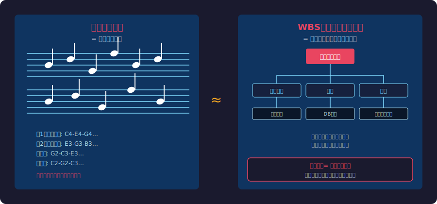
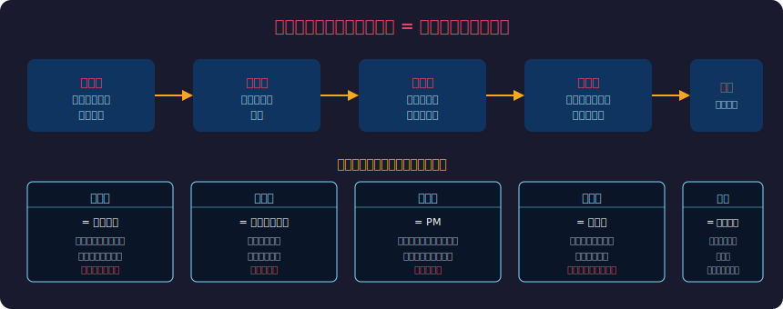
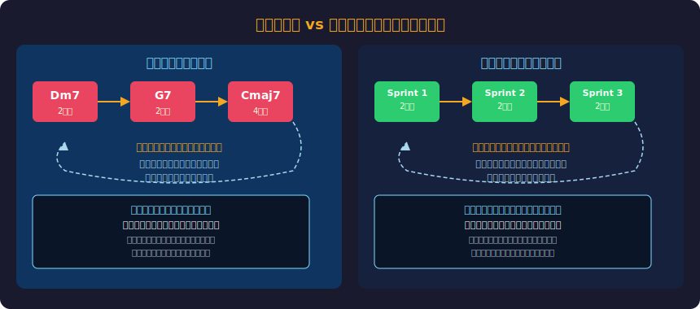
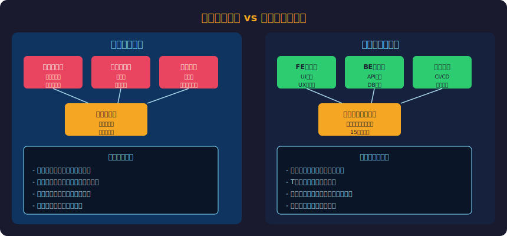
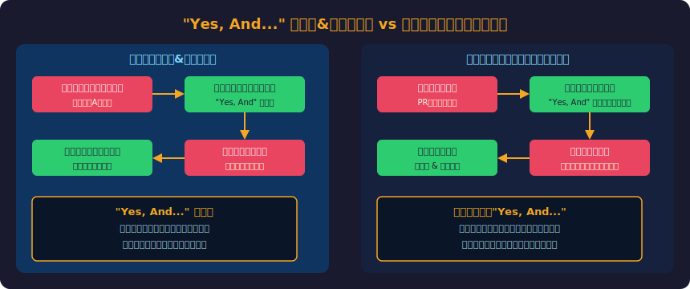
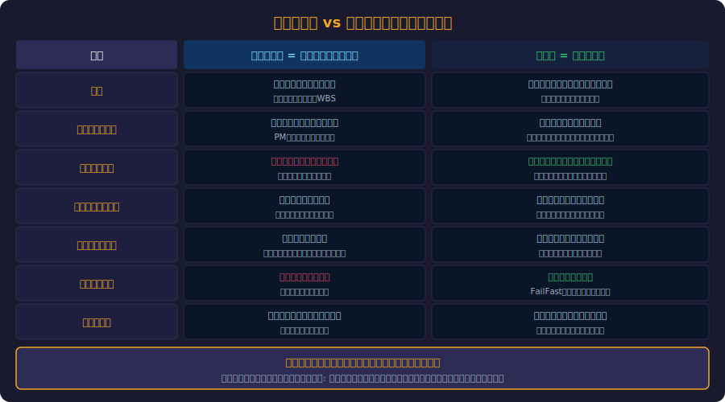
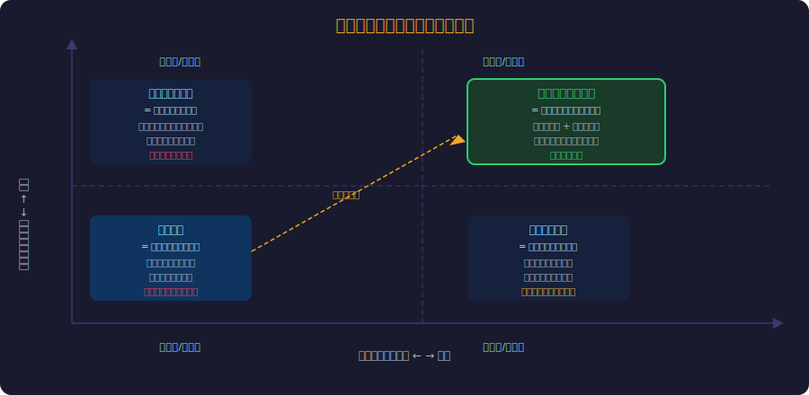

<!-- _class: lead -->
# クラシックはウォーターフォール、ジャズはアジャイルだ

- 音楽とソフトウェア開発には、驚くほど深い共通構造がある
- クラシック音楽：事前に全てを設計し、忠実に再現する
- ジャズ音楽：制約の枠内で、リアルタイムに創造する
- この対比から、チームの在り方を根本から考え直す

<!--
音楽という誰もが親しみやすい題材を通じて、アジャイルの本質を伝えるセッション。「なぜアジャイルが必要なのか」を直感的に理解してもらう。
-->

---

<!-- _class: lead -->
# クラシック音楽 = ウォーターフォール

- 計画と再現性を極限まで追求した開発スタイル

<!--
まずクラシック音楽の世界観から入る。聴衆はクラシックを「芸術の頂点」として捉えているが、開発スタイルとして見ると別の側面が見えてくる。
-->

---

# 総譜という設計書 — 全員が従うべき完全な仕様

> *楽譜=要件定義書、変更は「間違い」とされる事前設計主義の象徴*

- 総譜（スコア）は第1バイオリンから打楽器まで全パートを定義
- 作曲者が「完成形」を先に作り、演奏者はそれを実行する
- 音符一つ変えることは「間違い」として扱われる
- 楽譜 = 要件定義書・WBS・設計書の集合体

<!--
楽譜の完全性がウォーターフォールの完全な要件定義書に対応する。どちらも「変更は失敗」という文化を生む。
-->

---

# 総譜 vs WBS：完全な事前設計の比較

<!--
左が楽譜、右がWBS。どちらも全ての作業・音符が事前に定義されており、実行者は「定義通りに動く」ことを求められる。
-->

---

# 指揮者 = プロジェクトマネージャ：命令の連鎖

> *全表現を統制する指揮者型PMがガントチャートで現場判断を奪う構造*

- 指揮者は楽団員の上に立ち、全ての表現を統制する
- テンポ・強弱・入るタイミング — 全て指揮者が決定
- 楽団員は「優秀な実行者」であることが求められる
- **PM型リーダーシップとの対応：**
- - ガントチャートでタスクを管理
- - 進捗報告は上方向のみ
- - 現場の判断より計画を優先

<!--
指揮者のビジュアルイメージとPMの対比。どちらも「良かれと思って」管理している点を強調する。
-->

---

# クラシックのプロセス全体像

<!--
作曲家→出版社→指揮者→演奏者→観客。この線形プロセスがウォーターフォールの各フェーズに対応している。
-->

---

# 練習は「再現性」のために — 変化は敵

> *計画通りの再現を成功とする価値観が仕様変更を敵扱いにする*

- オーケストラの練習目標：毎回同じ演奏を完璧に再現すること
- 「昨日より良い演奏」より「楽譜に忠実な演奏」が評価される
- 即興は「プロらしくない」とされる
- **ウォーターフォールの同じ価値観：**
- - 「計画通りに進めること」が成功の定義
- - 仕様変更リクエストは敵扱い
- - 創意工夫より手順遵守が優先される

<!--
この価値観は間違いではなく、「要件が固定された大規模インフラ」などでは今でも有効。ただしソフトウェアには合わないことが多い。
-->

---

<!-- _class: lead -->
# ジャズ = アジャイル

- 制約の中で自由を最大化する、即興の芸術

<!--
ジャズのセクションに入る。ジャズはクラシックより「格下」ではなく、全く異なるアプローチで最高の音楽を生み出す方法論。
-->

---

# コード進行という制約の中の自由 — スプリントゴールと同じ

> *コード進行（制約）の中でメロディは自由——制約がアジャイルを可能にする逆説*

- ジャズも「無秩序な即興」ではない — コード進行という制約がある
- Dm7 → G7 → Cmaj7（ツーファイブワン）は全員が守るルール
- その枠の中で、メロディ・リズム・音色は自由に創造
- **アジャイルとの対応：**
- - スプリントゴール = コード進行（変えない）
- - 実装方法 = メロディ（チームが自由に決める）
- - 制約が「自由」を可能にする逆説

<!--
「制約が創造性を生む」という逆説がジャズとアジャイルに共通する核心。完全な自由は創造性を生まない。
-->

---

# コード進行 vs スプリント：制約の中の自由

- <svg viewBox="0 0 800 380" xmlns="http://www.w3.org/2000/svg" style="max-height:70vh;max-width:100%;display:block;margin:0 auto;"><rect width="800" height="380" fill="#1a1a2e"/><text x="400" y="26" text-anchor="middle" fill="#f9a825" font-size="15" font-weight="bold" font-family="sans-serif">ジャズ曲構造 vs アジャイルスプリント</text><rect x="30" y="45" width="360" height="300" fill="#16213e" rx="10" stroke="#f9a825" stroke-width="2"/><text x="210" y="68" text-anchor="middle" fill="#f9a825" font-size="12" font-weight="bold" font-family="sans-serif">ジャズ楽曲の構造</text><rect x="50" y="80" width="320" height="48" fill="#1a237e" rx="6" stroke="#3949ab" stroke-width="1"/><text x="210" y="101" text-anchor="middle" fill="#9fa8da" font-size="11" font-weight="bold" font-family="sans-serif">Head (テーマ提示)</text><text x="210" y="118" text-anchor="middle" fill="#7986cb" font-size="9" font-family="sans-serif">コード進行を提示・全員が共有する基盤</text><rect x="50" y="136" width="155" height="48" fill="#4a148c" rx="6" stroke="#7b1fa2" stroke-width="1"/><text x="127" y="157" text-anchor="middle" fill="#ce93d8" font-size="11" font-weight="bold" font-family="sans-serif">Solo 1</text><text x="127" y="173" text-anchor="middle" fill="#ba68c8" font-size="9" font-family="sans-serif">ピアノが即興演奏</text><rect x="215" y="136" width="155" height="48" fill="#4a148c" rx="6" stroke="#7b1fa2" stroke-width="1"/><text x="292" y="157" text-anchor="middle" fill="#ce93d8" font-size="11" font-weight="bold" font-family="sans-serif">Solo 2</text><text x="292" y="173" text-anchor="middle" fill="#ba68c8" font-size="9" font-family="sans-serif">サックスが即興演奏</text><rect x="50" y="192" width="320" height="48" fill="#006064" rx="6" stroke="#00838f" stroke-width="1"/><text x="210" y="213" text-anchor="middle" fill="#80deea" font-size="11" font-weight="bold" font-family="sans-serif">Trading (4 bars)</text><text x="210" y="229" text-anchor="middle" fill="#4dd0e1" font-size="9" font-family="sans-serif">短いソロを交互に交換 — 対話・応答</text><rect x="50" y="248" width="320" height="48" fill="#1b5e20" rx="6" stroke="#388e3c" stroke-width="1"/><text x="210" y="269" text-anchor="middle" fill="#a5d6a7" font-size="11" font-weight="bold" font-family="sans-serif">Out-Head (テーマ回帰)</text><text x="210" y="285" text-anchor="middle" fill="#81c784" font-size="9" font-family="sans-serif">最初のテーマに戻る — 完結</text><text x="210" y="335" text-anchor="middle" fill="#78909c" font-size="9" font-family="sans-serif">コード進行（制約）の中で最大限の創造性</text><polygon points="396,195 420,185 420,205" fill="#e91e63"/><line x1="390" y1="195" x2="420" y2="195" stroke="#e91e63" stroke-width="3"/><rect x="430" y="45" width="340" height="300" fill="#16213e" rx="10" stroke="#e91e63" stroke-width="2"/><text x="600" y="68" text-anchor="middle" fill="#e91e63" font-size="12" font-weight="bold" font-family="sans-serif">アジャイルスプリント</text><rect x="450" y="80" width="300" height="48" fill="#1a237e" rx="6" stroke="#3949ab" stroke-width="1"/><text x="600" y="101" text-anchor="middle" fill="#9fa8da" font-size="11" font-weight="bold" font-family="sans-serif">Sprint Planning</text><text x="600" y="118" text-anchor="middle" fill="#7986cb" font-size="9" font-family="sans-serif">スプリントゴールを全員で共有</text><rect x="450" y="136" width="145" height="48" fill="#4a148c" rx="6" stroke="#7b1fa2" stroke-width="1"/><text x="522" y="157" text-anchor="middle" fill="#ce93d8" font-size="11" font-weight="bold" font-family="sans-serif">Task A</text><text x="522" y="173" text-anchor="middle" fill="#ba68c8" font-size="9" font-family="sans-serif">開発者が自律実装</text><rect x="605" y="136" width="145" height="48" fill="#4a148c" rx="6" stroke="#7b1fa2" stroke-width="1"/><text x="677" y="157" text-anchor="middle" fill="#ce93d8" font-size="11" font-weight="bold" font-family="sans-serif">Task B</text><text x="677" y="173" text-anchor="middle" fill="#ba68c8" font-size="9" font-family="sans-serif">別開発者が自律実装</text><rect x="450" y="192" width="300" height="48" fill="#006064" rx="6" stroke="#00838f" stroke-width="1"/><text x="600" y="213" text-anchor="middle" fill="#80deea" font-size="11" font-weight="bold" font-family="sans-serif">Daily Scrum</text><text x="600" y="229" text-anchor="middle" fill="#4dd0e1" font-size="9" font-family="sans-serif">短い同期 — 互いの状態を聴く</text><rect x="450" y="248" width="300" height="48" fill="#1b5e20" rx="6" stroke="#388e3c" stroke-width="1"/><text x="600" y="269" text-anchor="middle" fill="#a5d6a7" font-size="11" font-weight="bold" font-family="sans-serif">Sprint Review + Retro</text><text x="600" y="285" text-anchor="middle" fill="#81c784" font-size="9" font-family="sans-serif">成果を確認し次へ学びを活かす</text><text x="600" y="335" text-anchor="middle" fill="#78909c" font-size="9" font-family="sans-serif">スプリントゴール（制約）の中で創造的判断</text></svg>

<!--
左がジャズのコード進行、右がアジャイルのスプリント。どちらも「繰り返すサイクル」と「その中での創造的判断」が構造になっている。
-->

---

# アンサンブルの傾聴 — レトロスペクティブの本質

> *互いを聴く技術がジャズとレトロの本質、傾聴なき即興は存在しない*

- ジャズ演奏者の最重要スキルは「聴くこと」
- 自分の演奏だけでなく、他の全奏者を同時に把握する
- 「ベースが下がった → ここはテンションを高めよう」
- **レトロスペクティブとの対応：**
- - デイリースクラムは互いの「今の状態」を聴く場
- - レトロは「どう聴こえていたか」を振り返る時間
- - 傾聴なくしてチームの即興は成立しない

<!--
「傾聴」はソフトスキルに見えるが、ジャズでは最高度の技術。アジャイルチームも同様に、互いの状態を把握する技術が必要。
-->

---

# バンド構成 × スクラムチーム対応図

<!--
ピアニスト=FEエンジニア、ベーシスト=BEエンジニア、ドラマー=インフラ。ソロイスト（現在のリード役）がドライバー（モブプロ）に対応する。
-->

---

# ソロは順番に — バトン文化とモブプログラミング

> *全員がドライバー経験で属人依存ゼロ、バス因子リスクが自然に解消*

- ジャズでは全員がソロを取る — 「リード」は固定されない
- ピアノがソロ中は、他の奏者がコンピング（支える）
- モブプログラミングとの完全対応：
- - ドライバー（ソロ奏者）が15分ごとにローテーション
- - ナビゲーター（コンピング）が思考を支援
- - 全員がコードを書き、全員が知識を持つ
- 「一人の天才」に依存しない設計の重要性

<!--
バス因子（Bus Factor）の問題。「この人がいないと動かない」は交響楽団型の弊害。ジャズ型チームはリスク分散が自然に起きる。
-->

---

# "Yes, And..." — コール＆レスポンスの原則

> *コードレビューを「否定」から「受け取って発展」に変えると心理的安全性が生まれる*

- ジャズの会話型演奏：あるフレーズへの応答がアンサンブル
- **インプロビゼーションの黄金律：**
- - 「No, But」: 相手のフレーズを否定 → 演奏が止まる
- - "Yes, And": 受け入れて発展させる → 音楽が生まれる
- **アジャイルチームへの応用：**
- - コードレビュー：「この実装はダメ」→「面白い！さらにこうすると良くなる」
- - 心理的安全性の土台がイノベーションを生む

<!--
インプロビゼーション演劇（インプロ）でも同じ原則。「Yes, And」は技術であり、チームカルチャーの核心でもある。
-->

---

# コール＆レスポンス vs チームコミュニケーション

- <svg viewBox="0 0 800 380" xmlns="http://www.w3.org/2000/svg" style="max-height:70vh;max-width:100%;display:block;margin:0 auto;"><rect width="800" height="380" fill="#1a1a2e"/><text x="400" y="26" text-anchor="middle" fill="#f9a825" font-size="15" font-weight="bold" font-family="sans-serif">"Yes, And" vs "No, But" — ジャズとアジャイルの会話原則</text><rect x="30" y="45" width="360" height="310" fill="#16213e" rx="10" stroke="#4caf50" stroke-width="2"/><text x="210" y="68" text-anchor="middle" fill="#4caf50" font-size="13" font-weight="bold" font-family="sans-serif">Yes, And (ジャズ / アジャイル)</text><circle cx="100" cy="110" r="28" fill="#1b5e20" stroke="#388e3c" stroke-width="2"/><text x="100" y="106" text-anchor="middle" fill="#a5d6a7" font-size="9" font-weight="bold" font-family="sans-serif">演奏者A</text><text x="100" y="120" text-anchor="middle" fill="#81c784" font-size="8" font-family="sans-serif">フレーズ提示</text><circle cx="310" cy="110" r="28" fill="#006064" stroke="#00838f" stroke-width="2"/><text x="310" y="106" text-anchor="middle" fill="#80deea" font-size="9" font-weight="bold" font-family="sans-serif">演奏者B</text><text x="310" y="120" text-anchor="middle" fill="#4dd0e1" font-size="8" font-family="sans-serif">応答・発展</text><line x1="128" y1="110" x2="278" y2="110" stroke="#4caf50" stroke-width="2" stroke-dasharray="5 3"/><polygon points="278,104 290,110 278,116" fill="#4caf50"/><text x="205" y="96" text-anchor="middle" fill="#4caf50" font-size="10" font-family="sans-serif">受け入れて発展</text><circle cx="100" cy="195" r="28" fill="#1b5e20" stroke="#388e3c" stroke-width="2"/><text x="100" y="191" text-anchor="middle" fill="#a5d6a7" font-size="9" font-weight="bold" font-family="sans-serif">開発者A</text><text x="100" y="205" text-anchor="middle" fill="#81c784" font-size="8" font-family="sans-serif">PR提出</text><circle cx="310" cy="195" r="28" fill="#006064" stroke="#00838f" stroke-width="2"/><text x="310" y="191" text-anchor="middle" fill="#80deea" font-size="9" font-weight="bold" font-family="sans-serif">レビュアー</text><text x="310" y="205" text-anchor="middle" fill="#4dd0e1" font-size="8" font-family="sans-serif">改善提案</text><line x1="128" y1="195" x2="278" y2="195" stroke="#4caf50" stroke-width="2" stroke-dasharray="5 3"/><polygon points="278,189 290,195 278,201" fill="#4caf50"/><text x="205" y="181" text-anchor="middle" fill="#4caf50" font-size="10" font-family="sans-serif">良い点 + さらに改善</text><rect x="50" y="240" width="320" height="80" fill="#1b5e20" rx="6" opacity="0.4"/><text x="210" y="265" text-anchor="middle" fill="#a5d6a7" font-size="10" font-weight="bold" font-family="sans-serif">結果: 音楽が生まれる / イノベーション</text><text x="210" y="283" text-anchor="middle" fill="#81c784" font-size="9" font-family="sans-serif">心理的安全性が高まる</text><text x="210" y="299" text-anchor="middle" fill="#81c784" font-size="9" font-family="sans-serif">チームが成長する</text><text x="210" y="335" text-anchor="middle" fill="#4caf50" font-size="10" font-weight="bold" font-family="sans-serif">アンサンブルは最高の合奏へ</text><rect x="410" y="45" width="360" height="310" fill="#16213e" rx="10" stroke="#e91e63" stroke-width="2"/><text x="590" y="68" text-anchor="middle" fill="#e91e63" font-size="13" font-weight="bold" font-family="sans-serif">No, But (演奏が止まる)</text><circle cx="480" cy="110" r="28" fill="#3e1010" stroke="#b71c1c" stroke-width="2"/><text x="480" y="106" text-anchor="middle" fill="#ef9a9a" font-size="9" font-weight="bold" font-family="sans-serif">演奏者A</text><text x="480" y="120" text-anchor="middle" fill="#ef9a9a" font-size="8" font-family="sans-serif">フレーズ提示</text><circle cx="720" cy="110" r="28" fill="#3e1010" stroke="#b71c1c" stroke-width="2"/><text x="720" y="106" text-anchor="middle" fill="#ef9a9a" font-size="9" font-weight="bold" font-family="sans-serif">演奏者B</text><text x="720" y="120" text-anchor="middle" fill="#ef9a9a" font-size="8" font-family="sans-serif">否定する</text><line x1="508" y1="110" x2="688" y2="110" stroke="#e91e63" stroke-width="2"/><text x="590" y="96" text-anchor="middle" fill="#e91e63" font-size="10" font-family="sans-serif">「それは違う」</text><text x="620" y="110" fill="#ef5350" font-size="18" font-family="sans-serif" text-anchor="middle">✗</text><circle cx="480" cy="195" r="28" fill="#3e1010" stroke="#b71c1c" stroke-width="2"/><text x="480" y="191" text-anchor="middle" fill="#ef9a9a" font-size="9" font-weight="bold" font-family="sans-serif">開発者A</text><text x="480" y="205" text-anchor="middle" fill="#ef9a9a" font-size="8" font-family="sans-serif">PR提出</text><circle cx="720" cy="195" r="28" fill="#3e1010" stroke="#b71c1c" stroke-width="2"/><text x="720" y="191" text-anchor="middle" fill="#ef9a9a" font-size="9" font-weight="bold" font-family="sans-serif">レビュアー</text><text x="720" y="205" text-anchor="middle" fill="#ef9a9a" font-size="8" font-family="sans-serif">批判のみ</text><line x1="508" y1="195" x2="688" y2="195" stroke="#e91e63" stroke-width="2"/><text x="590" y="181" text-anchor="middle" fill="#e91e63" font-size="10" font-family="sans-serif">「この実装はダメ」</text><text x="620" y="195" fill="#ef5350" font-size="18" font-family="sans-serif" text-anchor="middle">✗</text><rect x="430" y="240" width="320" height="80" fill="#3e1010" rx="6" opacity="0.4"/><text x="590" y="265" text-anchor="middle" fill="#ef9a9a" font-size="10" font-weight="bold" font-family="sans-serif">結果: 演奏が止まる / 萎縮</text><text x="590" y="283" text-anchor="middle" fill="#ff8a65" font-size="9" font-family="sans-serif">心理的安全性が低下</text><text x="590" y="299" text-anchor="middle" fill="#ff8a65" font-size="9" font-family="sans-serif">イノベーションが生まれない</text><text x="590" y="335" text-anchor="middle" fill="#e91e63" font-size="10" font-weight="bold" font-family="sans-serif">不協和音になる</text></svg>

<!--
左がジャズの会話型演奏、右がアジャイルのPR → レビュー → 改善サイクル。どちらも「提案を否定せず積み上げる」構造になっている。
-->

---

<!-- _class: lead -->
# プロセスの比較

- クラシックとジャズ、ウォーターフォールとアジャイルを徹底比較

<!--
ここまでの内容を整理する。比較表で全体像を把握してもらう。
-->

---

# クラシック vs ジャズ：全プロセス対比

<!--
7つの観点で対比する。重要なのは「どちらが正しいか」ではなく「状況に応じた選択」という点。
-->

---

# デューク・エリントンとアジャイルコーチ

> *エリントン型リーダーは個性を制約でなくリソースとして活かす環境を設計*

- エリントンは「コンダクター（指揮者）」ではなく「コンポーザー・イン・レジデンス」
- メンバーの個性を楽曲に書き込み、即興の余地を意図的に残した
- **コティ・ウィリアムズの高音 → 「ハーレム・エア・シャフト」が生まれた**
- アジャイルコーチとの対応：
- - チームの強みを把握し、それを活かす環境を設計
- - 「こう実装しろ」ではなく「この制約で試してみて」
- - 個性を潰さず、チームの音楽を引き出すリーダーシップ

<!--
エリントンは演奏者の個性を「制約」ではなく「リソース」として活用した。アジャイルコーチも同様に、チームの多様性を力に変える。
-->

---

# マイルス・デイヴィスの哲学：「間違いはない、ただ次の音がある」（1/2）

> *Kind of Blue一発録音がMVP思想の原点——完璧でなくていい初回リリース*

- 「Kind of Blue」(1959) — ほぼ一発録音で制作されたモード・ジャズの傑作
- マイルスの方法論：最低限のスケール情報だけ渡し、あとは即興
- **有名な言葉：**「間違った音など存在しない。次の音をどう選ぶかだ」
- **PSPrince2 / PMBOKとの比較：**

<!--
「Kind of Blue」は計画されていなかった。マイルスが当日スタジオでスケールを配り、レコーディングした。これはMVP思想そのもの。
-->

---

# マイルス・デイヴィスの哲学：「間違いはない、ただ次の音がある」（2/2）

> *失敗を恐れるのではなく次の音（イテレーション）を選ぶことが本質*

- - 初回リリース = 一発録音（完璧でなくていい）
- - ユーザーフィードバック = 共演者の反応
- - 次のイテレーション = 次の音の選択
- 失敗を恐れるのではなく、失敗から何を生むかを考える

<!--
「Kind of Blue」は計画されていなかった。マイルスが当日スタジオでスケールを配り、レコーディングした。これはMVP思想そのもの。
-->

---

<!-- _class: lead -->
# 実践への応用

- あなたのチームはどのバンド？今日から何を変えられるか？

<!--
理論から実践へ。参加者が自分のチームに置き換えて考えられるよう、診断的なフレームを提供する。
-->

---

# あなたのチームはどのバンド？

- <svg viewBox="0 0 800 380" xmlns="http://www.w3.org/2000/svg" style="max-height:70vh;max-width:100%;display:block;margin:0 auto;"><rect width="800" height="380" fill="#1a1a2e"/><text x="400" y="26" text-anchor="middle" fill="#f9a825" font-size="15" font-weight="bold" font-family="sans-serif">あなたのチームはどのバンド？</text><line x1="80" y1="50" x2="80" y2="340" stroke="#445" stroke-width="2"/><line x1="80" y1="340" x2="740" y2="340" stroke="#445" stroke-width="2"/><line x1="80" y1="195" x2="740" y2="195" stroke="#334" stroke-width="1" stroke-dasharray="5 3"/><line x1="410" y1="50" x2="410" y2="340" stroke="#334" stroke-width="1" stroke-dasharray="5 3"/><text x="40" y="125" text-anchor="middle" fill="#90a4ae" font-size="10" font-family="sans-serif" transform="rotate(-90,40,125)">高</text><text x="40" y="275" text-anchor="middle" fill="#90a4ae" font-size="10" font-family="sans-serif" transform="rotate(-90,40,275)">低</text><text x="40" y="200" text-anchor="middle" fill="#78909c" font-size="9" font-family="sans-serif" transform="rotate(-90,40,200)">自律性</text><text x="245" y="360" text-anchor="middle" fill="#90a4ae" font-size="10" font-family="sans-serif">低</text><text x="575" y="360" text-anchor="middle" fill="#90a4ae" font-size="10" font-family="sans-serif">高</text><text x="400" y="375" text-anchor="middle" fill="#78909c" font-size="9" font-family="sans-serif">変化への対応力</text><rect x="85" y="55" width="320" height="135" fill="#4a148c" rx="8" opacity="0.4"/><text x="245" y="100" text-anchor="middle" fill="#ce93d8" font-size="13" font-weight="bold" font-family="sans-serif">室内楽アンサンブル</text><text x="245" y="118" text-anchor="middle" fill="#b39ddb" font-size="10" font-family="sans-serif">自律は高いが変化に弱い</text><text x="245" y="135" text-anchor="middle" fill="#9575cd" font-size="9" font-family="sans-serif">個人芸が強く連携が弱い</text><text x="245" y="152" text-anchor="middle" fill="#9575cd" font-size="9" font-family="sans-serif">→ コミュニケーション改善が必要</text><rect x="415" y="55" width="320" height="135" fill="#1b5e20" rx="8" opacity="0.6"/><text x="575" y="100" text-anchor="middle" fill="#a5d6a7" font-size="13" font-weight="bold" font-family="sans-serif">ジャズカルテット</text><text x="575" y="118" text-anchor="middle" fill="#81c784" font-size="10" font-family="sans-serif">自律が高く変化にも強い</text><text x="575" y="135" text-anchor="middle" fill="#66bb6a" font-size="9" font-family="sans-serif">理想のアジャイルチーム</text><text x="575" y="152" text-anchor="middle" fill="#66bb6a" font-size="9" font-family="sans-serif">即興と傾聴が両立</text><text x="545" y="72" fill="#f9a825" font-size="16" font-family="sans-serif">★ 目標</text><rect x="85" y="200" width="320" height="135" fill="#b71c1c" rx="8" opacity="0.4"/><text x="245" y="244" text-anchor="middle" fill="#ef9a9a" font-size="13" font-weight="bold" font-family="sans-serif">交響楽団</text><text x="245" y="262" text-anchor="middle" fill="#ffcdd2" font-size="10" font-family="sans-serif">自律が低く変化にも弱い</text><text x="245" y="279" text-anchor="middle" fill="#ef9a9a" font-size="9" font-family="sans-serif">指揮者依存・仕様変更に脆弱</text><text x="245" y="296" text-anchor="middle" fill="#ef9a9a" font-size="9" font-family="sans-serif">多くのチームはここから始まる</text><rect x="415" y="200" width="320" height="135" fill="#e65100" rx="8" opacity="0.4"/><text x="575" y="244" text-anchor="middle" fill="#ffccbc" font-size="13" font-weight="bold" font-family="sans-serif">フリージャズ</text><text x="575" y="262" text-anchor="middle" fill="#ffab91" font-size="10" font-family="sans-serif">変化には強いが自律が低い</text><text x="575" y="279" text-anchor="middle" fill="#ff8a65" font-size="9" font-family="sans-serif">カオス・方向性がバラバラ</text><text x="575" y="296" text-anchor="middle" fill="#ff8a65" font-size="9" font-family="sans-serif">→ スプリントゴール設定が必要</text></svg>

<!--
4象限マップ。自律性（低→高）×変化への対応（低→高）。理想は右上のジャズカルテット型。多くのチームは左下の交響楽団型から始まる。
-->

---

# ジャズ型チームへの移行：今日から始められること

> *Yes-And・傾聴・モブプロ・明確ゴールの6実践で今日からジャズ型へ転換*

- **傾聴を習慣化する：** デイリースクラムを「報告会」から「アンサンブル」へ
- **Yes, And を実践する：** コードレビューで1つ良い点を先に言う
- **ソロを回す：** モブプログラミングで全員がドライバーを経験
- **コード進行を決める：** スプリントゴールを短く・明確に設定
- **失敗を演奏に含める：** レトロで「面白い失敗」を称える文化
- **エリントン型リーダーに：** 「どう弾くか」より「誰が弾くか」を設計

<!--
すぐに実践できることを6つ提示。全部やろうとしなくていい。1つからでも始めることが大切。
-->

---

<!-- _class: lead -->
# まとめ：「制約の中の即興」が最高の開発

- クラシック（ウォーターフォール）は「再現性の美」を追求する
- ジャズ（アジャイル）は「創造的適応の美」を追求する
- どちらも正しい — 状況に応じて選ぶことが知恵
- ソフトウェア開発の現実はジャズに近い：要件は変わり、チームは学ぶ
- 制約（スプリントゴール・コード進行）を守りながら、その中で最大限の創造性を発揮する
- それが「制約の中の即興」 — アジャイルの本質

<!--
締めくくり。アジャイルは方法論ではなく、マインドセット。ジャズが「音楽の即興」ではなく「音楽そのもの」であるように。
-->

---

# 参考文献（1/2）

- **音楽とアジャイルの関係：**
- - [Jazz and Agile — Michael Sahota (2010)](https://www.methodsandtools.com/archive/jazzagile.php)
- - [Improvisation in Software Development](https://www.infoq.com/articles/improvisation-software/)
- **ジャズ史・音楽理論：**

<!--
参考文献。特にMichael SahottaのJazz and Agile記事は本プレゼンの元ネタの一つ。
-->

---

# 参考文献（2/2）

- - [Kind of Blue - Miles Davis (1959)](https://en.wikipedia.org/wiki/Kind_of_Blue)
- - [Duke Ellington Orchestra Leadership Style](https://www.jazzhistory.net/ellington)
- **アジャイル原典：**
- - [Agile Manifesto (2001)](https://agilemanifesto.org/)
- - [Scrum Guide](https://scrumguides.org/)

<!--
参考文献。特にMichael SahottaのJazz and Agile記事は本プレゼンの元ネタの一つ。
-->
