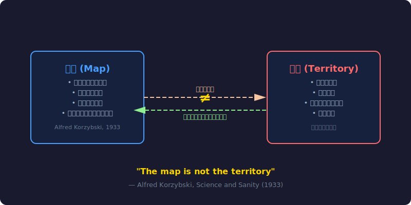
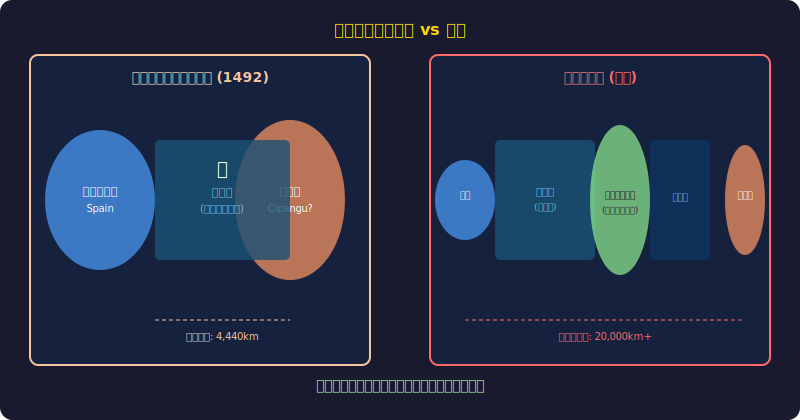
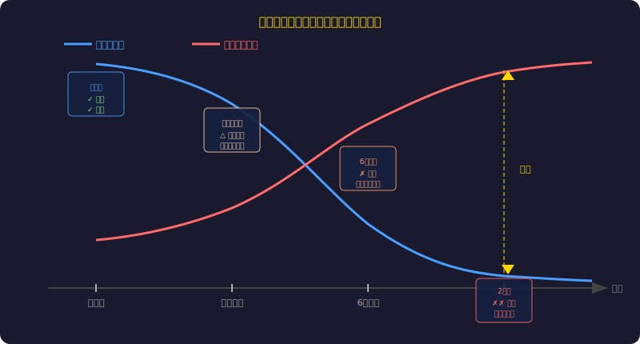
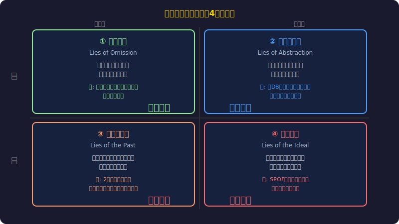
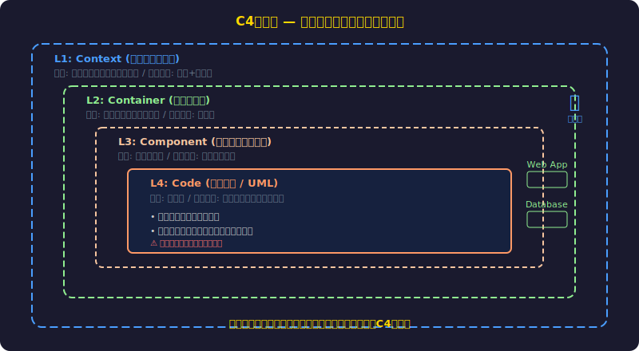
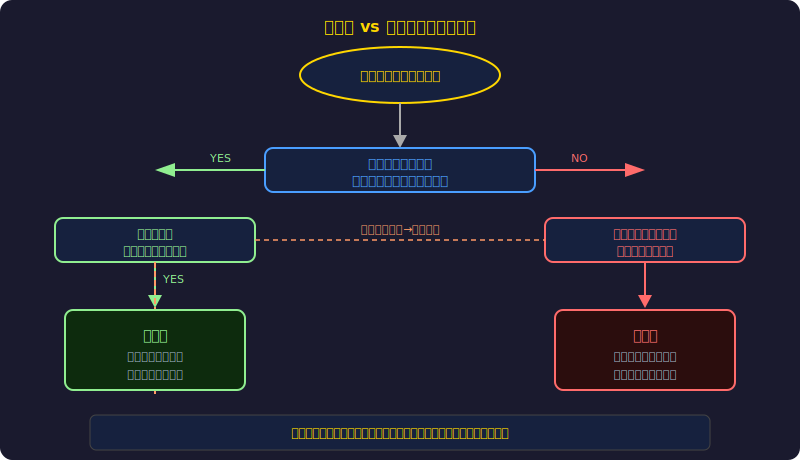
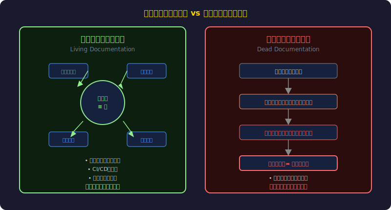

<!-- _class: lead -->
# 地図は現実ではない：アーキテクチャ図という必要な嘘

- 「コロンブスの地図は完全に間違っていた。それでも彼は航海した」
- 
- アーキテクチャ図もまた、現実を正確に写し取ったものではない
- しかし、その「嘘」こそがシステム設計を可能にする
- 
- 嘘の質を管理することがアーキテクトの核心的な仕事である

<!--
オープニング。コロンブスの逸話で掴みをとる。地図が完全に間違っていても航海できた理由を考えさせる。
-->

---

<!-- _class: lead -->
# 地図と現実

- 第1部
- 地図とは何か、現実とは何か
- そして二者の関係を紐解く

<!--
セクション区切り。哲学的な前提から入る。
-->

---

# アルフレッド・コジブスキー「地図は現実ではない」

- 1933年、一般意味論の父が提唱した原理
- 「地図は現実ではない／言葉は物事ではない」
- すべての表現・記号は現実の**縮減されたモデル**に過ぎない
- 
- 地図の3つの性質:
- - **省略性**: 現実のすべてを含まない（含めることは不可能）
- - **目的性**: 特定の用途に最適化されている
- - **自己参照性**: 地図自身も表現の一部である

<!--
コジブスキーの科学的意味論を分かりやすく説明。地図は道具であり、現実そのものではないという基本概念を確立する。
-->

---

# コジブスキーの原理：地図と現実の関係



<!--
SVG図で地図と現実の非対称な関係を可視化。地図は現実を参照するが、現実は地図に制約されない。
-->

---

# コロンブスの地図 — 完全に間違った地図で新大陸を発見

- 1492年、コロンブスの地図は根本的に誤っていた:
- - 地球の直径を**大幅に過小評価**（実際の1/4程度）
- - 大西洋を小さく、アジアを近くに描いた
- - アメリカ大陸の存在を完全に無視
- 
- それでも彼はインドに到達できると**確信して出航**した
- 間違いを間違いと知らないまま、新大陸を「発見」した
- 
- 教訓：地図の「正確さ」と「有用性」は別物

<!--
具体的な歴史的事例。間違った地図でも「目的の達成」に使えることを示す。ただし副作用（偶然の発見）もある。
-->

---

# コロンブスの地図 vs 現実



<!--
左：コロンブスの想像地図（欧州と近くにあるアジア）、右：実際の世界地図（巨大な大西洋とアメリカ大陸）。視覚的な衝撃で地図の誤りを伝える。
-->

---

# 地図の価値は「正確さ」ではなく「航行可能性」

- Harry Beck の地下鉄路線図（1931年）:
- - 実際の地理的距離は完全に無視
- - トポロジカルな接続関係のみを保持
- - **乗客が次の駅に乗り換えられるか** だけに最適化
- 
- 優れた地図の条件 (Navigability Principle):
- - 目的に照らして必要な情報を含む
- - 目的に照らして不要な情報を捨てる
- - 使用者がそれで「航行できる」

<!--
ロンドン地下鉄路線図の例は有名。地理的に不正確でも機能的に完璧な地図の実例。
-->

---

<!-- _class: lead -->
# アーキテクチャ図の嘘

- 第2部
- 設計図はなぜ常に「嘘」をつくのか
- そしてその嘘の種類とは何か

<!--
セクション2。ソフトウェアの世界に話を転換する。
-->

---

# 設計時のアーキテクチャ図 vs 実際のシステムの乖離



<!--
タイムラインで劣化を可視化。設計時は正確でも、時間とともに図と現実の乖離が拡大する。
-->

---

# 4種類のアーキテクチャ図の嘘



<!--
4象限で嘘を分類。意図的/無意識 × 有益/有害の2軸。省略・抽象化は必要な嘘、過去形・理想は有害な嘘。
-->

---

# C4モデル — 抽象化レベルで嘘の質を管理する



<!--
Simon Brown のC4モデル。4層の抽象化レベルそれぞれに適切な「嘘の質」を割り当てる。
-->

---

# C4モデルの実践：各層の嘘の使い分け

- **L1 Context**: ビジネス価値と外部システムの関係
- - 嘘の種類: 大規模な省略（内部構造を完全に隠す）
- - 読者: CTO、経営層、外部ステークホルダー
- 
- **L2 Container**: サービス・データストアの境界
- - 嘘の種類: 実装の抽象化（スケーリング戦略を隠す）
- - 読者: 開発リード、アーキテクト
- 
- **L3 Component**: モジュール・責務の分離
- - 嘘の種類: インターフェースのみ（実装を隠す）
- - 読者: 実装担当エンジニア
- 
- **L4 Code**: クラス・関数の詳細（自動生成推奨）

<!--
C4の各層を実例で説明。読者層と嘘の種類のマッピングが核心。
-->

---

<!-- _class: lead -->
# 必要な嘘と有害な嘘

- 第3部
- どの嘘は許容され、どの嘘は危険か
- 判断基準とリスク管理

<!--
セクション3。嘘の評価基準を確立する。
-->

---

# 良い嘘：航行可能なモデル



<!--
判断フロー図で良い嘘と悪い嘘を区別。「この図で意思決定できるか」が核心的な問い。
-->

---

# 悪い嘘：決断を歪めるモデル — 実例

- **Knight Capital Group (2012)** — システム構成の誤認
- - 古い設計図を信じてデプロイ手順を誤る
- - 45分で4億4000万ドルの損失
- - 原因：「死んだドキュメント」による誤った前提
- 
- **Boeing 737 MAX MCAS** — アーキテクチャの隠蔽
- - パイロット向け訓練資料にMCASの存在を省略
- - 「良い省略」が「悪い省略」に転化した事例
- - 省略の判断は常に目的と読者を考慮すべき

<!--
実際の事故事例。どちらも「死んだドキュメント」か「目的を誤った省略」が原因。嘘の危険性を実感させる。
-->

---

# 生きたドキュメント vs 死んだドキュメント



<!--
生きたドキュメントはコードから自動生成され常に現実を反映。死んだドキュメントは手動管理で陳腐化する。
-->

---

<!-- _class: lead -->
# 実践への応用

- 第4部
- 嘘を管理する実践的アプローチ
- Architecture as Code と ADR

<!--
セクション4。具体的なツールとプラクティスを紹介。
-->

---

# Architecture as Code — diagrams as code

- 図をコードとして管理することで「生きたドキュメント」を実現:

```dsl
# Structurizr DSL (C4モデル対応)
workspace {
  model {
    user = person "ユーザー"
    system = softwareSystem "決済システム" {
      webapp = container "Web App" "React" "HTTPS"
      api = container "API Server" "Node.js" "REST"
      db = container "Database" "PostgreSQL" "SQL"
    }
    user -> webapp "注文する"
    webapp -> api "REST API"
    api -> db "クエリ"
  }
  views {
    container system "ContainerView" {
      include *
      autoLayout lr
    }
  }
}
```

<!--
Structurizr DSLはC4モデルをコードで記述できる。GitでバージョN管理、CIでレンダリング → 常に最新の図が得られる。
-->

---

# ADR — アーキテクチャ決定記録で「なぜ」を保存する

- Architecture Decision Records (ADR) の構造:
- - **Status**: Proposed / Accepted / Deprecated / Superseded
- - **Context**: なぜこの決定が必要だったか（当時の地図）
- - **Decision**: 何を選択したか
- - **Consequences**: トレードオフと予想される影響
- 
- ADRが解決する問題:
- - 「なぜここがこんな構造になっているのか誰も知らない」を防ぐ
- - 地図が変わった理由（改訂履歴）を残す
- - 将来の意思決定者への「嘘の文脈」の引き継ぎ

<!--
ADRは設計の「なぜ」を記録する。図が嘘になった経緯と理由を保存することで、将来の誤判断を防ぐ。
-->

---

<!-- _class: lead -->
# 嘘を管理するのがアーキテクトの仕事

- アーキテクチャ図は「現実」ではなく「道具」である
- 
- 良いアーキテクトの3つの責務:
- **1. 目的に合った嘘を選ぶ** — 読者と文脈に最適な抽象化レベル
- **2. 嘘の鮮度を管理する** — 生きたドキュメントとADRで追跡
- **3. 嘘の限界を明示する** — 「この図はL2まで」「2024年3月時点」
- 
- 「地図は現実ではない。しかし良い地図は航行を可能にする」
- — あなたのアーキテクチャ図は、チームを正しく航行させているか？

<!--
まとめ。アーキテクトの仕事を「嘘の質を管理すること」と再定義する。コジブスキーの言葉で締める。
-->

---

# 参考文献

- **General Semantics / 地図と現実:**
- - [Science and Sanity — Alfred Korzybski (1933)](https://en.wikipedia.org/wiki/Science_and_Sanity)
- - [The Map Is Not The Territory — LessWrong](https://www.lesswrong.com/tag/the-map-is-not-the-territory)
- 
- **C4モデル / Architecture as Code:**
- - [The C4 model for visualising software architecture](https://c4model.com/)
- - [Structurizr DSL Documentation](https://docs.structurizr.com/dsl)
- - [Diagrams as Code 2.0 — Simon Brown](https://www.infoq.com/presentations/diagrams-code-c4/)
- 
- **ADR:**
- - [Architecture Decision Records — Michael Nygard](https://cognitect.com/blog/2011/11/15/documenting-architecture-decisions)

<!--
参考文献。C4モデルのサイトとStructurizrは実践的なツールとして特に推薦。
-->
