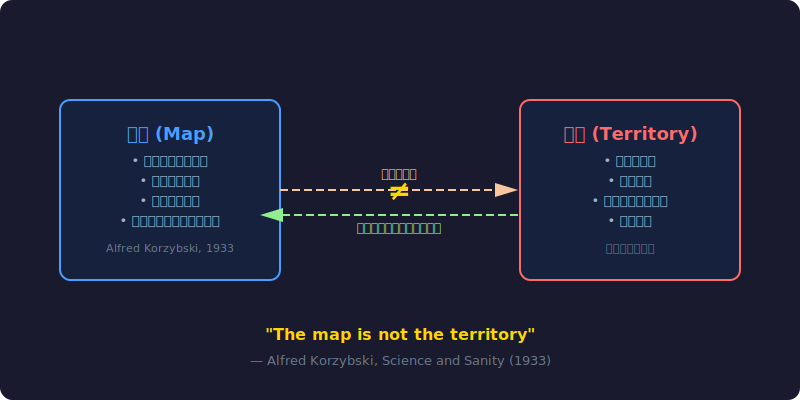
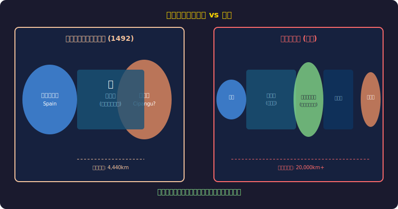
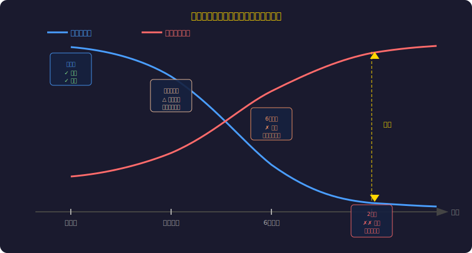
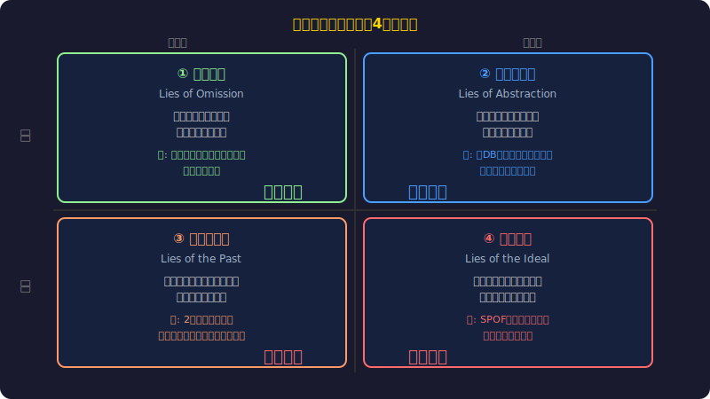
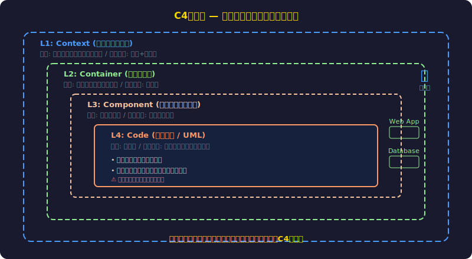
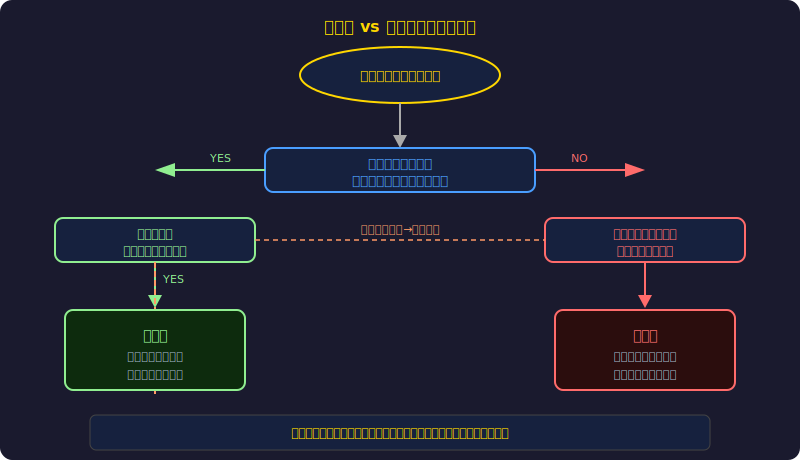
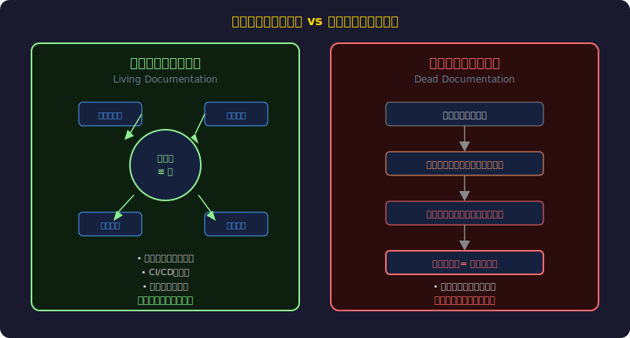

<!-- _class: lead -->
# 地図は現実ではない：アーキテクチャ図という必要な嘘

- 「コロンブスの地図は完全に間違っていた。それでも彼は航海した」
- 
- アーキテクチャ図もまた、現実を正確に写し取ったものではない
- しかし、その「嘘」こそがシステム設計を可能にする
- 
- 嘘の質を管理することがアーキテクトの核心的な仕事である

<!--
オープニング。コロンブスの逸話で掴みをとる。地図が完全に間違っていても航海できた理由を考えさせる。
-->

---

<!-- _class: lead -->
# 地図と現実

- 第1部
- 地図とは何か、現実とは何か
- そして二者の関係を紐解く

<!--
セクション区切り。哲学的な前提から入る。
-->

---

# アルフレッド・コジブスキー「地図は現実ではない」（1/2）

- 1933年、一般意味論の父が提唱した原理
- 「地図は現実ではない／言葉は物事ではない」
- すべての表現・記号は現実の**縮減されたモデル**に過ぎない
- 

<!--
コジブスキーの科学的意味論を分かりやすく説明。地図は道具であり、現実そのものではないという基本概念を確立する。
-->

---

# アルフレッド・コジブスキー「地図は現実ではない」（2/2）

- 地図の3つの性質:
- - **省略性**: 現実のすべてを含まない（含めることは不可能）
- - **目的性**: 特定の用途に最適化されている
- - **自己参照性**: 地図自身も表現の一部である

<!--
コジブスキーの科学的意味論を分かりやすく説明。地図は道具であり、現実そのものではないという基本概念を確立する。
-->

---

# 地図の3性質（図解）

- <svg viewBox="0 0 800 360" style="max-height:70vh;max-width:100%;display:block;margin:0 auto;" xmlns="http://www.w3.org/2000/svg">
<rect width="800" height="360" fill="#1a1a2e"/>
<text x="400" y="36" text-anchor="middle" fill="#ffffff" font-size="15" font-weight="bold">地図の3つの性質 — コジブスキーの原理</text>
<rect x="40" y="70" width="220" height="200" rx="12" fill="#16213e" stroke="#f9a825" stroke-width="2"/>
<rect x="40" y="70" width="220" height="46" rx="12" fill="#f9a825"/>
<text x="150" y="100" text-anchor="middle" fill="#1a1a2e" font-size="13" font-weight="bold">省略性</text>
<text x="150" y="118" text-anchor="middle" fill="#1a1a2e" font-size="10">Incompleteness</text>
<text x="60" y="150" fill="#ffffff" font-size="11">現実の全てを含まない</text>
<text x="60" y="170" fill="#ffffff" font-size="11">（含めることは不可能）</text>
<text x="60" y="200" fill="#aaaaaa" font-size="10">例: 路線図は地形を省く</text>
<text x="60" y="218" fill="#aaaaaa" font-size="10">例: クラス図は実行時状態を省く</text>
<text x="60" y="245" fill="#f9a825" font-size="10" font-weight="bold">→ 必要な嘘</text>
<rect x="290" y="70" width="220" height="200" rx="12" fill="#16213e" stroke="#e91e63" stroke-width="2"/>
<rect x="290" y="70" width="220" height="46" rx="12" fill="#e91e63"/>
<text x="400" y="100" text-anchor="middle" fill="#ffffff" font-size="13" font-weight="bold">目的性</text>
<text x="400" y="118" text-anchor="middle" fill="#ffffff" font-size="10">Purposiveness</text>
<text x="310" y="150" fill="#ffffff" font-size="11">特定の用途に最適化</text>
<text x="310" y="170" fill="#ffffff" font-size="11">されている</text>
<text x="310" y="200" fill="#aaaaaa" font-size="10">例: 観光地図 vs 地質図</text>
<text x="310" y="218" fill="#aaaaaa" font-size="10">例: C4 L1 vs L4</text>
<text x="310" y="245" fill="#e91e63" font-size="10" font-weight="bold">→ 読者・用途で変わる</text>
<rect x="540" y="70" width="220" height="200" rx="12" fill="#16213e" stroke="#4db6ac" stroke-width="2"/>
<rect x="540" y="70" width="220" height="46" rx="12" fill="#4db6ac"/>
<text x="650" y="100" text-anchor="middle" fill="#1a1a2e" font-size="13" font-weight="bold">自己参照性</text>
<text x="650" y="118" text-anchor="middle" fill="#1a1a2e" font-size="10">Self-Reflexivity</text>
<text x="560" y="150" fill="#ffffff" font-size="11">地図自身も表現の一部</text>
<text x="560" y="170" fill="#ffffff" font-size="11">（完全な客観性はない）</text>
<text x="560" y="200" fill="#aaaaaa" font-size="10">例: 地図を作る人の視点</text>
<text x="560" y="218" fill="#aaaaaa" font-size="10">例: アーキテクトの世界観</text>
<text x="560" y="245" fill="#4db6ac" font-size="10" font-weight="bold">→ 嘘の作者を認識せよ</text>
<text x="400" y="315" text-anchor="middle" fill="#ffffff" font-size="12">アーキテクチャ図はこの3性質を持つ「構造化された嘘」</text>
<text x="400" y="340" text-anchor="middle" fill="#aaaaaa" font-size="11">嘘を管理することがアーキテクトの仕事</text>
</svg>


---

# コジブスキーの原理：地図と現実の関係



<!--
SVG図で地図と現実の非対称な関係を可視化。地図は現実を参照するが、現実は地図に制約されない。
-->

---

# コロンブスの地図 — 完全に間違った地図で新大陸を発見（1/2）

- 1492年、コロンブスの地図は根本的に誤っていた:
- - 地球の直径を**大幅に過小評価**（実際の1/4程度）
- - 大西洋を小さく、アジアを近くに描いた
- - アメリカ大陸の存在を完全に無視

<!--
具体的な歴史的事例。間違った地図でも「目的の達成」に使えることを示す。ただし副作用（偶然の発見）もある。
-->

---

# コロンブスの地図 — 完全に間違った地図で新大陸を発見（2/2）

- 
- それでも彼はインドに到達できると**確信して出航**した
- 間違いを間違いと知らないまま、新大陸を「発見」した
- 
- 教訓：地図の「正確さ」と「有用性」は別物

<!--
具体的な歴史的事例。間違った地図でも「目的の達成」に使えることを示す。ただし副作用（偶然の発見）もある。
-->

---

# コロンブスの地図 vs 現実



<!--
左：コロンブスの想像地図（欧州と近くにあるアジア）、右：実際の世界地図（巨大な大西洋とアメリカ大陸）。視覚的な衝撃で地図の誤りを伝える。
-->

---

# 地図の価値は「正確さ」ではなく「航行可能性」（1/2）

- Harry Beck の地下鉄路線図（1931年）:
- - 実際の地理的距離は完全に無視
- - トポロジカルな接続関係のみを保持
- - **乗客が次の駅に乗り換えられるか** だけに最適化

<!--
ロンドン地下鉄路線図の例は有名。地理的に不正確でも機能的に完璧な地図の実例。
-->

---

# 地図の価値は「正確さ」ではなく「航行可能性」（2/2）

- 
- 優れた地図の条件 (Navigability Principle):
- - 目的に照らして必要な情報を含む
- - 目的に照らして不要な情報を捨てる
- - 使用者がそれで「航行できる」

<!--
ロンドン地下鉄路線図の例は有名。地理的に不正確でも機能的に完璧な地図の実例。
-->

---

# 航行可能性の原則（図解）

- <svg viewBox="0 0 800 360" style="max-height:70vh;max-width:100%;display:block;margin:0 auto;" xmlns="http://www.w3.org/2000/svg">
<rect width="800" height="360" fill="#1a1a2e"/>
<text x="400" y="36" text-anchor="middle" fill="#ffffff" font-size="15" font-weight="bold">航行可能性の原則 — 地図の価値基準</text>
<rect x="40" y="62" width="340" height="260" rx="10" fill="#16213e" stroke="#e91e63" stroke-width="2"/>
<text x="210" y="90" text-anchor="middle" fill="#e91e63" font-size="13" font-weight="bold">地理的に正確な地図</text>
<line x1="80" y1="170" x2="340" y2="170" stroke="#e91e63" stroke-width="1.5"/>
<circle cx="100" cy="130" r="6" fill="#e91e63"/>
<text x="115" y="135" fill="#ffffff" font-size="10">King's Cross</text>
<circle cx="220" cy="145" r="6" fill="#e91e63"/>
<text x="235" y="150" fill="#ffffff" font-size="10">Oxford Circus</text>
<circle cx="310" cy="155" r="6" fill="#e91e63"/>
<text x="270" y="165" fill="#ffffff" font-size="10">Victoria</text>
<circle cx="150" cy="210" r="6" fill="#e91e63"/>
<text x="165" y="215" fill="#ffffff" font-size="10">London Bridge</text>
<circle cx="260" cy="230" r="6" fill="#e91e63"/>
<text x="275" y="235" fill="#ffffff" font-size="10">Waterloo</text>
<text x="210" y="285" text-anchor="middle" fill="#e91e63" font-size="11">地理的に正確</text>
<text x="210" y="300" text-anchor="middle" fill="#aaaaaa" font-size="10">→ でも乗り換えルートが分からない</text>
<rect x="420" y="62" width="340" height="260" rx="10" fill="#16213e" stroke="#f9a825" stroke-width="2"/>
<text x="590" y="90" text-anchor="middle" fill="#f9a825" font-size="13" font-weight="bold">Beck の路線図 (1931)</text>
<line x1="460" y1="120" x2="740" y2="120" stroke="#e91e63" stroke-width="3"/>
<line x1="460" y1="170" x2="740" y2="170" stroke="#f9a825" stroke-width="3"/>
<line x1="460" y1="220" x2="740" y2="220" stroke="#4db6ac" stroke-width="3"/>
<line x1="590" y1="100" x2="590" y2="240" stroke="#aaaaaa" stroke-width="2"/>
<circle cx="590" cy="120" r="7" fill="#ffffff" stroke="#e91e63" stroke-width="2"/>
<circle cx="590" cy="170" r="7" fill="#ffffff" stroke="#f9a825" stroke-width="2"/>
<circle cx="590" cy="220" r="7" fill="#ffffff" stroke="#4db6ac" stroke-width="2"/>
<text x="600" y="124" fill="#ffffff" font-size="9">King's Cross</text>
<text x="600" y="174" fill="#ffffff" font-size="9">Oxford Circus</text>
<text x="600" y="224" fill="#ffffff" font-size="9">Waterloo</text>
<text x="590" y="278" text-anchor="middle" fill="#f9a825" font-size="11">地理的に不正確</text>
<text x="590" y="295" text-anchor="middle" fill="#ffffff" font-size="10">→ でも乗り換えが一目瞭然</text>
<text x="400" y="340" text-anchor="middle" fill="#ffffff" font-size="12" font-weight="bold">航行可能性 = 地図の真の価値。正確さではなく「使えるか」</text>
</svg>


---

<!-- _class: lead -->
# アーキテクチャ図の嘘

- 第2部
- 設計図はなぜ常に「嘘」をつくのか
- そしてその嘘の種類とは何か

<!--
セクション2。ソフトウェアの世界に話を転換する。
-->

---

# 設計時のアーキテクチャ図 vs 実際のシステムの乖離



<!--
タイムラインで劣化を可視化。設計時は正確でも、時間とともに図と現実の乖離が拡大する。
-->

---

# 4種類のアーキテクチャ図の嘘



<!--
4象限で嘘を分類。意図的/無意識 × 有益/有害の2軸。省略・抽象化は必要な嘘、過去形・理想は有害な嘘。
-->

---

# C4モデル — 抽象化レベルで嘘の質を管理する



<!--
Simon Brown のC4モデル。4層の抽象化レベルそれぞれに適切な「嘘の質」を割り当てる。
-->

---

# C4モデルの実践：各層の嘘の使い分け（1/2）

- **L1 Context**: ビジネス価値と外部システムの関係
- - 嘘の種類: 大規模な省略（内部構造を完全に隠す）
- - 読者: CTO、経営層、外部ステークホルダー
- 
- **L2 Container**: サービス・データストアの境界
- - 嘘の種類: 実装の抽象化（スケーリング戦略を隠す）

<!--
C4の各層を実例で説明。読者層と嘘の種類のマッピングが核心。
-->

---

# C4モデルの実践：各層の嘘の使い分け（2/2）

- - 読者: 開発リード、アーキテクト
- 
- **L3 Component**: モジュール・責務の分離
- - 嘘の種類: インターフェースのみ（実装を隠す）
- - 読者: 実装担当エンジニア
- 
- **L4 Code**: クラス・関数の詳細（自動生成推奨）

<!--
C4の各層を実例で説明。読者層と嘘の種類のマッピングが核心。
-->

---

<!-- _class: lead -->
# 必要な嘘と有害な嘘

- 第3部
- どの嘘は許容され、どの嘘は危険か
- 判断基準とリスク管理

<!--
セクション3。嘘の評価基準を確立する。
-->

---

# 良い嘘：航行可能なモデル



<!--
判断フロー図で良い嘘と悪い嘘を区別。「この図で意思決定できるか」が核心的な問い。
-->

---

# 悪い嘘：決断を歪めるモデル — 実例（1/2）

- **Knight Capital Group (2012)** — システム構成の誤認
- - 古い設計図を信じてデプロイ手順を誤る
- - 45分で4億4000万ドルの損失
- - 原因：「死んだドキュメント」による誤った前提

<!--
実際の事故事例。どちらも「死んだドキュメント」か「目的を誤った省略」が原因。嘘の危険性を実感させる。
-->

---

# 悪い嘘：決断を歪めるモデル — 実例（2/2）

- 
- **Boeing 737 MAX MCAS** — アーキテクチャの隠蔽
- - パイロット向け訓練資料にMCASの存在を省略
- - 「良い省略」が「悪い省略」に転化した事例
- - 省略の判断は常に目的と読者を考慮すべき

<!--
実際の事故事例。どちらも「死んだドキュメント」か「目的を誤った省略」が原因。嘘の危険性を実感させる。
-->

---

# 生きたドキュメント vs 死んだドキュメント



<!--
生きたドキュメントはコードから自動生成され常に現実を反映。死んだドキュメントは手動管理で陳腐化する。
-->

---

<!-- _class: lead -->
# 実践への応用

- 第4部
- 嘘を管理する実践的アプローチ
- Architecture as Code と ADR

<!--
セクション4。具体的なツールとプラクティスを紹介。
-->

---

# Architecture as Code — diagrams as code

- 図をコードとして管理することで「生きたドキュメント」を実現:


---

# Architecture as Code — diagrams as code（コード例）

```dsl
# Structurizr DSL (C4モデル対応)
workspace {
  model {
    user = person "ユーザー"
    system = softwareSystem "決済システム" {
      webapp = container "Web App" "React" "HTTPS"
      api = container "API Server" "Node.js" "REST"
      db = container "Database" "PostgreSQL" "SQL"
    }
    user -> webapp "注文する"
    webapp -> api "REST API"
    api -> db "クエリ"
  }
  views {
    container system "ContainerView" {
      include *
      autoLayout lr
    }
  }
}
```


---

# ADR — アーキテクチャ決定記録で「なぜ」を保存する（1/2）

- Architecture Decision Records (ADR) の構造:
- - **Status**: Proposed / Accepted / Deprecated / Superseded
- - **Context**: なぜこの決定が必要だったか（当時の地図）
- - **Decision**: 何を選択したか
- - **Consequences**: トレードオフと予想される影響

<!--
ADRは設計の「なぜ」を記録する。図が嘘になった経緯と理由を保存することで、将来の誤判断を防ぐ。
-->

---

# ADR — アーキテクチャ決定記録で「なぜ」を保存する（2/2）

- 
- ADRが解決する問題:
- - 「なぜここがこんな構造になっているのか誰も知らない」を防ぐ
- - 地図が変わった理由（改訂履歴）を残す
- - 将来の意思決定者への「嘘の文脈」の引き継ぎ

<!--
ADRは設計の「なぜ」を記録する。図が嘘になった経緯と理由を保存することで、将来の誤判断を防ぐ。
-->

---

# ADRの構造（図解）

- <svg viewBox="0 0 800 360" style="max-height:70vh;max-width:100%;display:block;margin:0 auto;" xmlns="http://www.w3.org/2000/svg">
<rect width="800" height="360" fill="#1a1a2e"/>
<text x="400" y="34" text-anchor="middle" fill="#ffffff" font-size="15" font-weight="bold">ADR — 嘘の文脈を未来に引き継ぐ</text>
<rect x="40" y="60" width="720" height="50" rx="8" fill="#16213e" stroke="#f9a825" stroke-width="1.5"/>
<text x="80" y="83" fill="#f9a825" font-size="12" font-weight="bold">Status:</text>
<text x="160" y="83" fill="#ffffff" font-size="12">Proposed → Accepted → Deprecated → Superseded</text>
<text x="80" y="99" fill="#aaaaaa" font-size="10">この決定が今どの状態か（生きているか死んでいるか）</text>
<rect x="40" y="125" width="220" height="100" rx="8" fill="#16213e" stroke="#e91e63" stroke-width="1.5"/>
<text x="150" y="148" text-anchor="middle" fill="#e91e63" font-size="12" font-weight="bold">Context（背景）</text>
<text x="55" y="168" fill="#ffffff" font-size="10">なぜこの決定が必要だったか</text>
<text x="55" y="184" fill="#ffffff" font-size="10">当時の技術的・組織的制約</text>
<text x="55" y="204" fill="#aaaaaa" font-size="9">＝ 当時の「地図の前提」</text>
<rect x="290" y="125" width="220" height="100" rx="8" fill="#16213e" stroke="#4db6ac" stroke-width="1.5"/>
<text x="400" y="148" text-anchor="middle" fill="#4db6ac" font-size="12" font-weight="bold">Decision（決定）</text>
<text x="305" y="168" fill="#ffffff" font-size="10">何を選択したか</text>
<text x="305" y="184" fill="#ffffff" font-size="10">なぜそれを選んだか</text>
<text x="305" y="204" fill="#aaaaaa" font-size="9">＝ 地図に描いた「嘘の内容」</text>
<rect x="540" y="125" width="220" height="100" rx="8" fill="#16213e" stroke="#f9a825" stroke-width="1.5"/>
<text x="650" y="148" text-anchor="middle" fill="#f9a825" font-size="12" font-weight="bold">Consequences（結果）</text>
<text x="555" y="168" fill="#ffffff" font-size="10">トレードオフと影響</text>
<text x="555" y="184" fill="#ffffff" font-size="10">予想される問題</text>
<text x="555" y="204" fill="#aaaaaa" font-size="9">＝ 嘘の「副作用と限界」</text>
<rect x="40" y="255" width="720" height="75" rx="8" fill="#e91e63" opacity="0.15" stroke="#e91e63" stroke-width="1"/>
<text x="400" y="278" text-anchor="middle" fill="#e91e63" font-size="12" font-weight="bold">ADRが防ぐ問題</text>
<text x="80" y="298" fill="#ffffff" font-size="10">「なぜこんな設計になっているか誰も知らない」</text>
<text x="80" y="314" fill="#ffffff" font-size="10">→ 地図が変わった理由を記録することで将来の誤判断を防ぐ</text>
</svg>


---

<!-- _class: lead -->
# 嘘を管理するのがアーキテクトの仕事（1/2）

- アーキテクチャ図は「現実」ではなく「道具」である
- 
- 良いアーキテクトの3つの責務:
- **1. 目的に合った嘘を選ぶ** — 読者と文脈に最適な抽象化レベル

<!--
まとめ。アーキテクトの仕事を「嘘の質を管理すること」と再定義する。コジブスキーの言葉で締める。
-->

---

<!-- _class: lead -->
# 嘘を管理するのがアーキテクトの仕事（2/2）

- **2. 嘘の鮮度を管理する** — 生きたドキュメントとADRで追跡
- **3. 嘘の限界を明示する** — 「この図はL2まで」「2024年3月時点」
- 
- 「地図は現実ではない。しかし良い地図は航行を可能にする」
- — あなたのアーキテクチャ図は、チームを正しく航行させているか？

<!--
まとめ。アーキテクトの仕事を「嘘の質を管理すること」と再定義する。コジブスキーの言葉で締める。
-->

---

# 参考文献（1/2）

- **General Semantics / 地図と現実:**
- - [Science and Sanity — Alfred Korzybski (1933)](https://en.wikipedia.org/wiki/Science_and_Sanity)
- - [The Map Is Not The Territory — LessWrong](https://www.lesswrong.com/tag/the-map-is-not-the-territory)
- 
- **C4モデル / Architecture as Code:**

<!--
参考文献。C4モデルのサイトとStructurizrは実践的なツールとして特に推薦。
-->

---

# 参考文献（2/2）

- - [The C4 model for visualising software architecture](https://c4model.com/)
- - [Structurizr DSL Documentation](https://docs.structurizr.com/dsl)
- - [Diagrams as Code 2.0 — Simon Brown](https://www.infoq.com/presentations/diagrams-code-c4/)
- 
- **ADR:**
- - [Architecture Decision Records — Michael Nygard](https://cognitect.com/blog/2011/11/15/documenting-architecture-decisions)

<!--
参考文献。C4モデルのサイトとStructurizrは実践的なツールとして特に推薦。
-->
