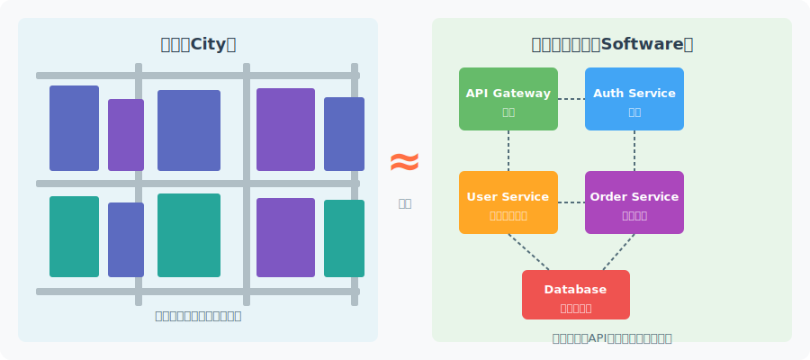
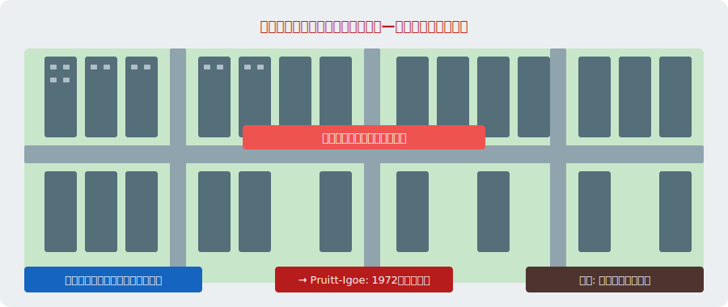
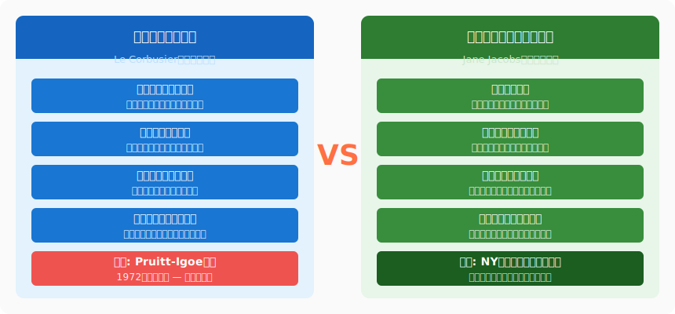
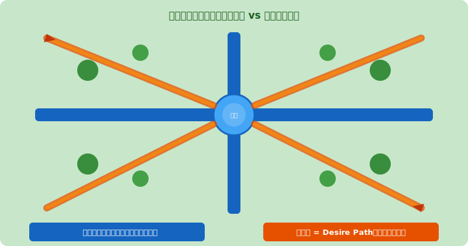
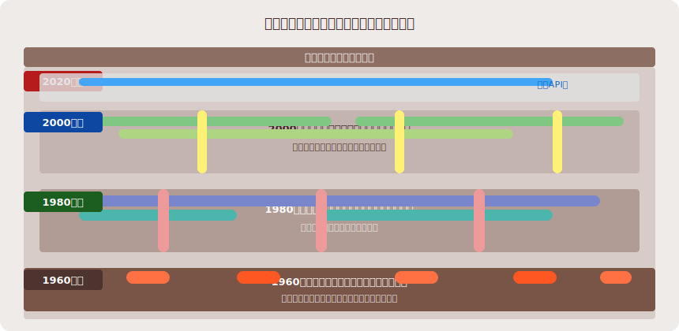
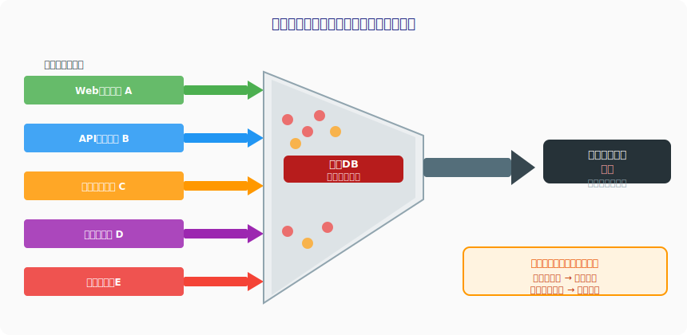

<!-- _class: lead -->
# 都市計画とシステム設計

- 〜ジェイン・ジェイコブスに学ぶソフトウェアアーキテクチャ〜
- 街と同様に、ソフトウェアは「生きている」

---

# 都市とソフトウェアの類比

- **都市** = 建物・道路・人の複雑な相互作用が生む生態系
- **ソフトウェアシステム** = コード・API・データの生態系
- 両者は「設計者の意図」と「使用者の現実」のギャップで苦しむ

---

<!-- _class: lead -->
# 第一章：トップダウン設計の罠

- 完璧な設計図は、なぜ現実に敗北するのか

---

# ル・コルビュジエの「輝く都市」

- 「理想の都市を設計できる」という傲慢な確信
- 高層住宅群・広大な緑地・完璧な区画割り — 機能ごとに分離
- 実際: Pruitt-Igoe（セントルイス）→ 犯罪と荒廃、1972年爆破解体
- ロバート・モーゼス（NY）: 高速道路で歴史的街区を破壊

---

# マイクロサービスの「Pruitt-Igoe」

- 「完璧な設計図に基づいてサービスを分割する」— 同じ罠
- **過剰分割の症状**: 数百のマイクロサービス、複雑な依存関係図
- **Nanoservice反パターン**: 1つのAPIしか持たないサービス群
- **分散モノリス**: 独立していない「マイクロサービスもどき」
- 設計図通りに動かない理由は、都市計画の失敗と同じ

---

<!-- _class: lead -->
# 第二章：ジェイン・ジェイコブスの教え

- 街角の観察者が発見した、都市の真実

---

# ジェイン・ジェイコブス〜街角の観察者

- 「アメリカ大都市の死と生」（1961年）— 都市計画の聖典
- 計画家ではなくジャーナリストとして街を**観察**
- 「良い街は計画されない、育まれる（cultivated）」
- ル・コルビュジエの輝く都市を痛烈に批判

---

# 混合用途開発（Mixed-Use Development）

- 住宅・商業・オフィスが**混在**する街区の活力と安全性
- 「多様性」が経済と安全を同時に生む（目の数の増加）
- **ソフトウェア類比**: マイクロサービスの過度な専門化 vs. 機能的まとまり
- **バウンデッドコンテキスト** = 自然な「街区」— 内部は混在してよい
- 凝集度（Cohesion）を高め、結合度（Coupling）を下げる

---

# Desire Paths〜ユーザーが作る最適経路

- 芝生に自然にできる「踏み跡」= 設計外の最適経路
- 計画者の意図を無視した、ユーザーの合理的な行動の痕跡
- **ソフトウェア**: ユーザーが「想定外の使い方」をする現象と同じ
- **教訓**: Desire Pathsを観察してから最適化し、設計に取り込め

---

<!-- _class: lead -->
# 第三章：都市の諸問題とソフトウェアの類比

- 老朽化・置き換え・渋滞 — 同じ問題が繰り返される

---

# 技術的負債 = インフラの老朽化

- 東京の地下配管: 誰も全体像を知らない複数世代の配管が交錯
- レガシーコード: 誰も理解していないが、止めると全てが崩壊する
- 老朽化インフラの改修 ≈ レガシーシステムの段階的移行
- **共通の真実**: 動いているシステムへの敬意なしに改修は失敗する

---

# ジェントリフィケーション = マイグレーションコスト

- 古い住民を追い出す「再開発」— 価値ある文化と人的ネットワークの喪失
- **データマイグレーション**: 古いユーザーを置き去りにするリスク
- **下位互換性の破壊** = 元の居住者を強制退去させること
- APIの廃止（Deprecation）は必ずユーザーへの移行期間を設ける
- 「開発者体験（DX）の再開発」はユーザーを犠牲にしてはならない

---

# 交通渋滞とボトルネック

- 幹線道路の渋滞 = DBのボトルネック（単一障害点）
- **ブラヒェスのパラドックス**: 道路を増やすと渋滞が増える
- スレッドプールを増やすと競合が増え、逆に遅くなる
- スループットを上げると新たなボトルネックが出現する

---

# 都市の回復力〜レジリエンスの設計

- 「多様性」が災害・経済危機からの回復力を生む
- ジェイコブス: 単一用途の街区は外部ショックに対して脆弱
- **ソフトウェア**: 単一障害点（SPOF）の排除とカオスエンジニアリング
- 地域コミュニティの自律性 = マイクロサービスの独立デプロイ能力
- 冗長性・多様性・自律性が、回復力の三原則

---

# まとめ〜ジェイコブスから学ぶアーキテクチャ原則

- **有機的成長を許容する設計** — 完璧な初期設計より適応可能な構造を
- **ユーザーの行動を観察してから最適化** — Desire Pathsを先に観察せよ
- **多様性と混合用途を恐れない** — バウンデッドコンテキスト内の自由
- **下位互換性への敬意** — 既存のユーザーと文化を大切にする
- 参考文献: [The Death and Life of Great American Cities（Jane Jacobs, 1961）](https://en.wikipedia.org/wiki/The_Death_and_Life_of_Great_American_Cities)

