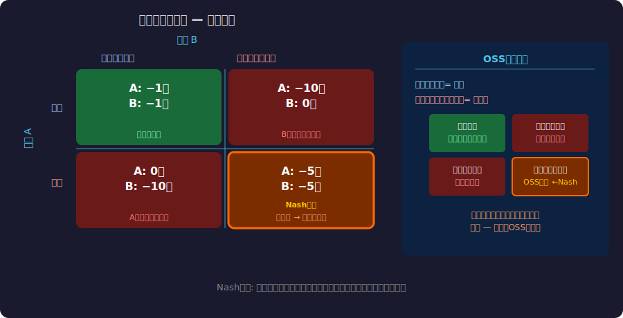
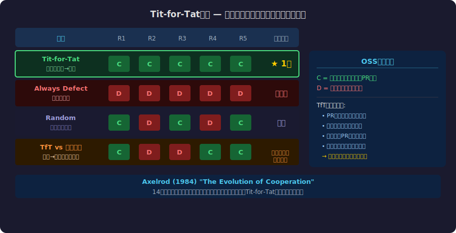
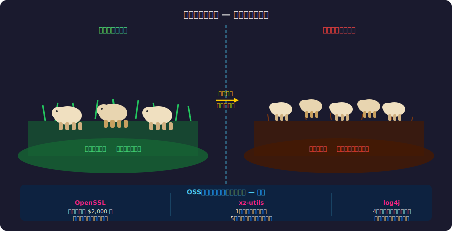
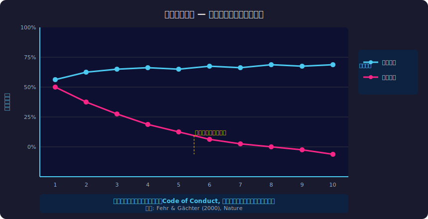
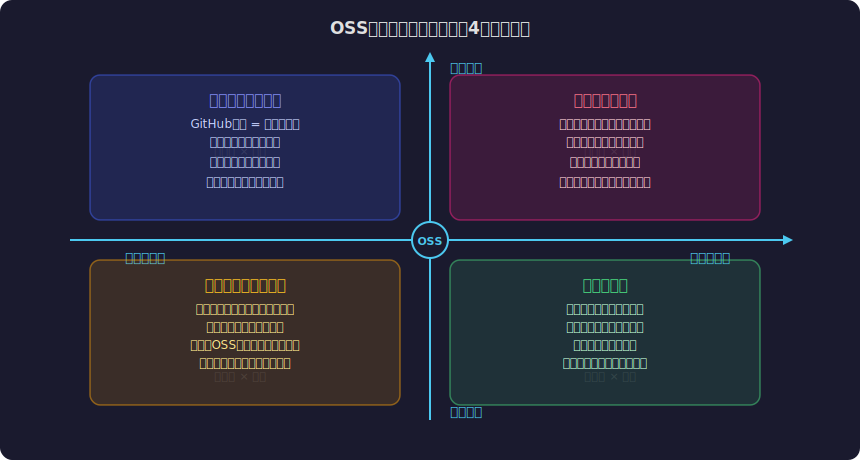

<!-- _class: lead -->
# 囚人のジレンマとオープンソース

- ゲーム理論で読み解くOSSの持続可能性
- 
- なぜ「合理的」な行動がOSSを破壊するのか？

---

# 目次

- - 1. 囚人のジレンマとは何か
- - 2. OSSとの構造的類似性
- - 3. フリーライダー問題
- - 4. 繰り返しゲームとしてのOSS
- - 5. 公共財ゲームとコモンズの悲劇
- - 6. 解決策: インセンティブ設計
- - 7. 持続可能なOSSの未来

---

<!-- _class: lead -->
# 囚人のジレンマとは

---

# 囚人のジレンマ -- 利得行列

---

# ゲーム理論の基本構造

- - **支配戦略**: 相手がどう動こうと「裏切り」が最適
- - **Nash均衡**: 両者が裏切りを選択 → 最悪の結果
- - **パレート最適**: 両者が協力 → 最善の結果
- - 個人の合理性 vs 集団の合理性が衝突する
- 
- > 「合理的に行動する個人が、集団として非合理的な結果を生む」

---

<!-- _class: lead -->
# OSSにおけるジレンマ

---

# OSSの依存関係 -- 見えない危機

---

# フリーライダー問題

- - **企業の合理的選択**: OSSを使うが貢献しない
- - Fortune 500企業の97%がOSSを利用
- - しかしOSSメンテナの46%は無報酬
- - left-pad事件(2016): 11行のコードが数百万プロジェクトに影響
- - Log4Shell(2021): 2人のボランティアが世界のインフラを支えていた
- 
- **Nash均衡 = 誰も貢献しない → OSSエコシステム崩壊**

---

<!-- _class: lead -->
# 繰り返しゲームの解法

---

# しっぺ返し戦略(Tit-for-Tat)

---

# Axelrodの発見

- - **1980年代**: Robert Axelrodが囚人のジレンマのトーナメントを開催
- - 最も成功した戦略 = **しっぺ返し(Tit-for-Tat)**
- - 4つの特徴:
-   - **善良**: 最初は協力する
-   - **報復的**: 裏切りには裏切りで返す
-   - **寛容**: 相手が協力に戻れば許す
-   - **明確**: 行動パターンが予測可能

---

<!-- _class: lead -->
# 公共財としてのOSS

---

# コモンズの悲劇

---

# 公共財ゲームとOSS

---

# OSS特有の構造

- - **非排除性**: 誰でもコードを使える(ライセンス上)
- - **非競合性**: 使っても減らない(デジタル財)
- - **ネットワーク効果**: 利用者が増えるほど価値が上がる
- - **しかし**: メンテナンスコストは増え続ける
- 
- 純粋な公共財よりも「コモンズ」に近い構造

---

<!-- _class: lead -->
# インセンティブ設計による解決

---

# 持続可能性のためのメカニズム

---

# 成功事例と新しいモデル

- - **GitHub Sponsors**: 直接的な金銭的支援
- - **Open Collective**: 透明性のある資金管理
- - **Dual License**: Community版 + Enterprise版
- - **SSPL / BSL**: ソースコード公開 + 利用制限
- - **企業のOSPO**: Open Source Program Office設置
- - **政府の関与**: EU Cyber Resilience Act

---

<!-- _class: lead -->
# 持続可能なOSSの未来

---

# ゲーム理論が示す3つの教訓

- - **1. 繰り返しが協力を生む**
-   - 一回限りのゲームでは裏切りが合理的
-   - 長期的関係では協力が進化的に安定
- - **2. 制度設計が均衡を変える**
-   - フリーライドのコストを上げる仕組み
-   - 貢献のリターンを可視化する仕組み
- - **3. 透明性が信頼を構築する**
-   - 誰が貢献しているかを公開する
-   - 依存関係の可視化(SBOM等)

---

# まとめ

- - 囚人のジレンマはOSSの構造的問題を正確に記述する
- - 「善意に頼る」だけでは持続可能性は担保できない
- - インセンティブ設計と制度設計が鍵
- - 繰り返しゲームとして捉えれば協力は合理的になる
- 
- **「OSSの危機は技術の問題ではない。ゲーム理論の問題だ。」**

---

# 参考文献

- - **Research:**
- - [The Evolution of Cooperation - R.Axelrod (1984)](https://en.wikipedia.org/wiki/The_Evolution_of_Cooperation)
- - [Roads and Bridges: The Unseen Labor Behind Our Digital Infrastructure - Nadia Eghbal (2016)](https://www.fordfoundation.org/work/learning/research-reports/roads-and-bridges-the-unseen-labor-behind-our-digital-infrastructure/)
- - **Tools & Initiatives:**
- - [GitHub Sponsors](https://github.com/sponsors)
- - [Open Source Security Foundation (OpenSSF)](https://openssf.org/)

