<!-- _class: invert lead -->
# 囚人のジレンマとオープンソース

- ゲーム理論で読み解くOSSの持続可能性
- なぜ「合理的」な行動がOSSを破壊するのか？

---

# 目次

> *囚人のジレンマ→フリーライダー→繰り返しゲーム→インセンティブ設計の7章構成*

- 1. 囚人のジレンマとは何か
- 2. OSSとの構造的類似性
- 3. フリーライダー問題
- 4. 繰り返しゲームとしてのOSS
- 5. 公共財ゲームとコモンズの悲劇
- 6. 解決策: インセンティブ設計
- 7. 持続可能なOSSの未来

---

<!-- _class: invert lead -->
# 囚人のジレンマとは

---

# 囚人のジレンマ -- 利得行列

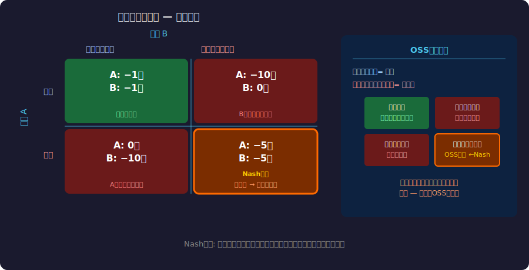

---

# ゲーム理論の基本構造

> *個人の合理性が集団として非合理な結果を生む構造*

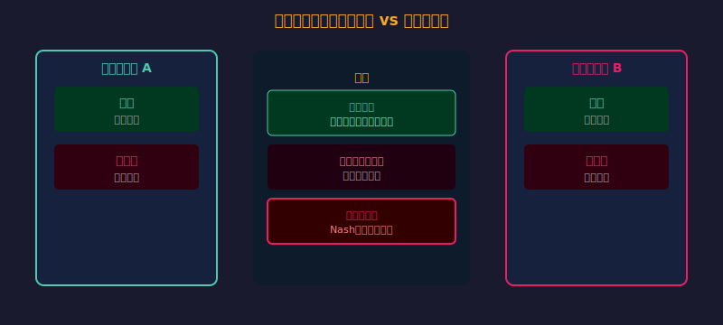

- **支配戦略**: 相手がどう動こうと「裏切り」が最適
- **Nash均衡**: 両者が裏切りを選択 → 最悪の結果
- **パレート最適**: 両者が協力 → 最善の結果
- 個人の合理性 vs 集団の合理性が衝突する
- > 「合理的に行動する個人が、集団として非合理的な結果を生む」

---

<!-- _class: invert lead -->
# OSSにおけるジレンマ

---

# OSSの依存関係 -- 見えない危機

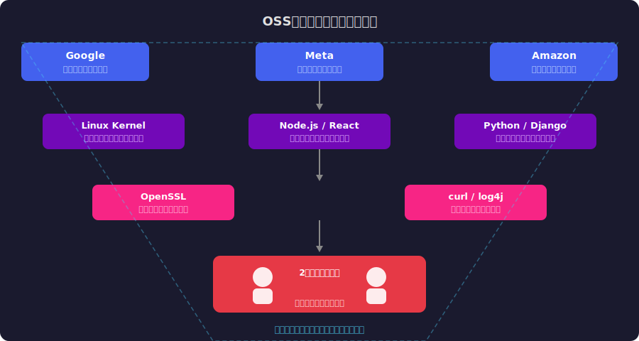

---

# フリーライダー問題

> *OSSメンテナ46%が無報酬という現実がNash均衡の証拠*

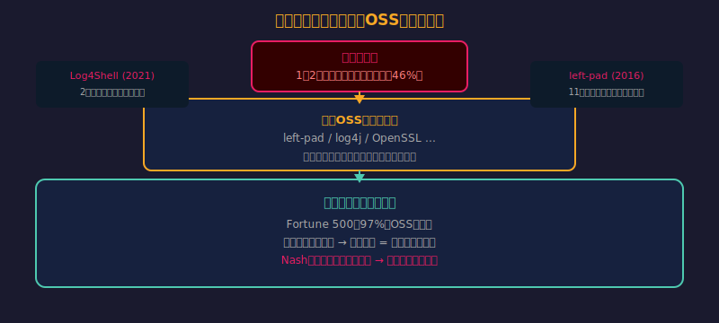

- **企業の合理的選択**: OSSを使うが貢献しない
- Fortune 500企業の97%がOSSを利用
- しかしOSSメンテナの46%は無報酬
- left-pad事件(2016): 11行のコードが数百万プロジェクトに影響
- Log4Shell(2021): 2人のボランティアが世界のインフラを支えていた
- **Nash均衡 = 誰も貢献しない → OSSエコシステム崩壊**

---

<!-- _class: invert lead -->
# 繰り返しゲームの解法

---

# しっぺ返し戦略(Tit-for-Tat)

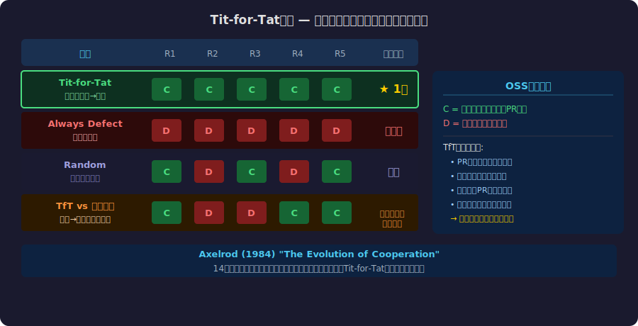

---

# Axelrodの発見

> *しっぺ返し戦略が繰り返しゲームで協力を引き出すと証明した*

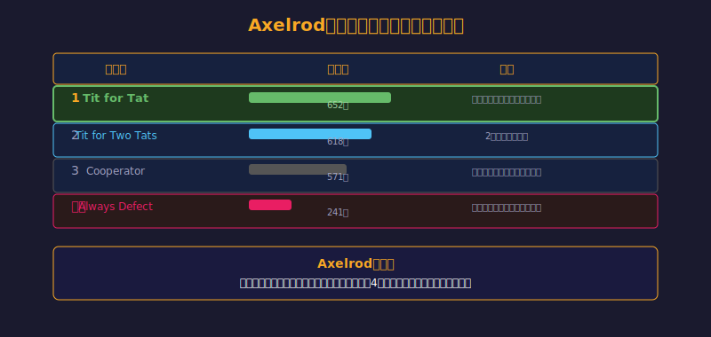

- **1980年代**: Robert Axelrodが囚人のジレンマのトーナメントを開催
- 最も成功した戦略 = **しっぺ返し(Tit-for-Tat)**
- 4つの特徴:
  - **善良**: 最初は協力する
  - **報復的**: 裏切りには裏切りで返す
  - **寛容**: 相手が協力に戻れば許す
  - **明確**: 行動パターンが予測可能

---

<!-- _class: invert lead -->
# 公共財としてのOSS

---

# コモンズの悲劇

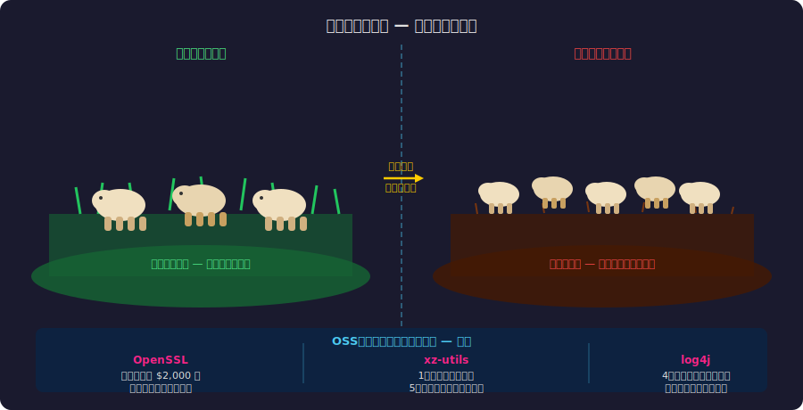

---

# 公共財ゲームとOSS

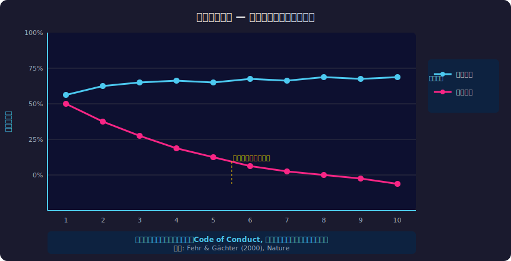

---

# OSS特有の構造

> *デジタル財のコスト構造がOSSをコモンズに近づける*

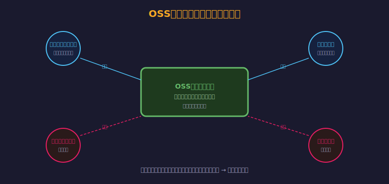

- **非排除性**: 誰でもコードを使える(ライセンス上)
- **非競合性**: 使っても減らない(デジタル財)
- **ネットワーク効果**: 利用者が増えるほど価値が上がる
- **しかし**: メンテナンスコストは増え続ける
- 純粋な公共財よりも「コモンズ」に近い構造

---

<!-- _class: invert lead -->
# インセンティブ設計による解決

---

# 持続可能性のためのメカニズム

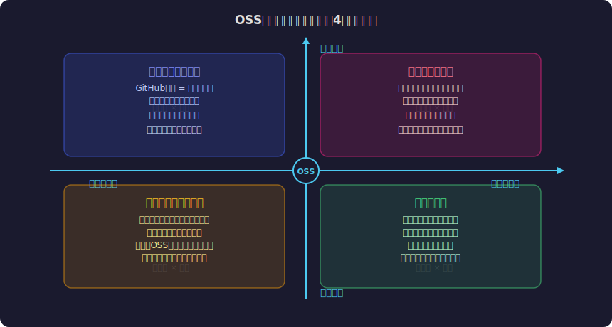

---

# 成功事例と新しいモデル

> *SponsorsやOSPOがフリーライドのコストを上げる仕組みだ*

- **GitHub Sponsors**: 直接的な金銭的支援
- **Open Collective**: 透明性のある資金管理
- **Dual License**: Community版 + Enterprise版
- **SSPL / BSL**: ソースコード公開 + 利用制限
- **企業のOSPO**: Open Source Program Office設置
- **政府の関与**: EU Cyber Resilience Act

---

<!-- _class: invert lead -->
# 持続可能なOSSの未来

---

# ゲーム理論が示す3つの教訓（1/2）

> *繰り返しと制度設計と透明性が3つの教訓を構成する*

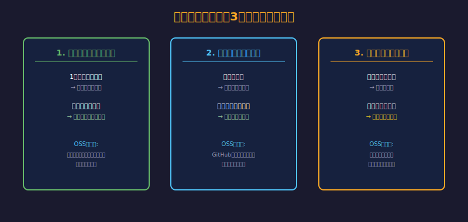

- **1. 繰り返しが協力を生む**
  - 一回限りのゲームでは裏切りが合理的
  - 長期的関係では協力が進化的に安定
- **2. 制度設計が均衡を変える**

---

# ゲーム理論が示す3つの教訓（2/2）

> *制度設計で貢献コスト可視化し透明性がOSSの協力均衡を安定させる*

  - フリーライドのコストを上げる仕組み
  - 貢献のリターンを可視化する仕組み
- **3. 透明性が信頼を構築する**
  - 誰が貢献しているかを公開する
  - 依存関係の可視化(SBOM等)

---

# まとめ

> *善意に頼るだけでは持続可能性を担保できない現実*

- 囚人のジレンマはOSSの構造的問題を正確に記述する
- 「善意に頼る」だけでは持続可能性は担保できない
- インセンティブ設計と制度設計が鍵
- 繰り返しゲームとして捉えれば協力は合理的になる
- **「OSSの危機は技術の問題ではない。ゲーム理論の問題だ。」**

---

# 参考文献

> *ゲーム理論・OSS持続可能性研究の一次資料を網羅*

- **Research:**
- [The Evolution of Cooperation - R.Axelrod (1984)](https://en.wikipedia.org/wiki/The_Evolution_of_Cooperation)
- [Roads and Bridges: The Unseen Labor Behind Our Digital Infrastructure - Nadia Eghbal (2016)](https://www.fordfoundation.org/work/learning/research-reports/roads-and-bridges-the-unseen-labor-behind-our-digital-infrastructure/)
- **Tools & Initiatives:**
- [GitHub Sponsors](https://github.com/sponsors)
- [Open Source Security Foundation (OpenSSF)](https://openssf.org/)

