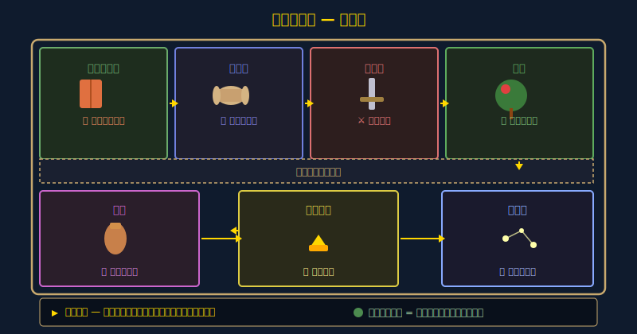
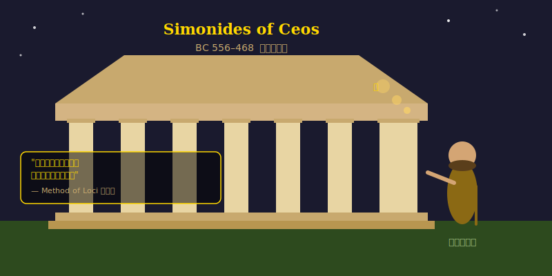
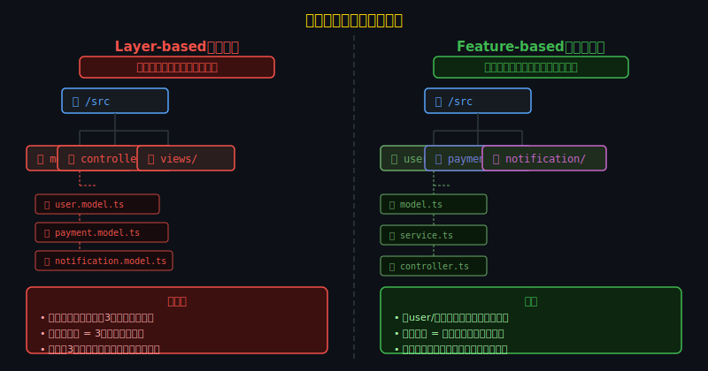
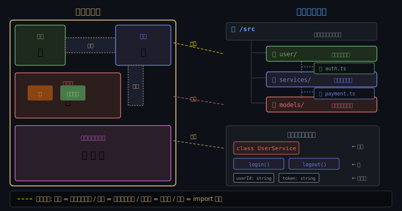
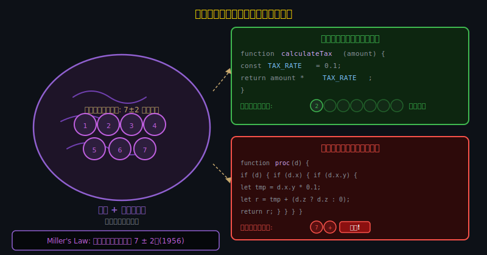

<!-- _class: lead -->
# 記憶の宮殿とコードベース

- 古代ギリシャの記憶術から学ぶコード設計
- 
- なぜ良いコードは「歩ける」のか？

---

# 目次

- - 1. 記憶の宮殿(Method of Loci)とは
- - 2. シモニデスの伝説
- - 3. 空間記憶とコードベース
- - 4. ディレクトリ構造 = 建築設計
- - 5. 認知負荷理論との接点
- - 6. 「歩けるコード」の設計原則

---

<!-- _class: lead -->
# 記憶の宮殿とは

---

# Method of Loci -- 2500年の記憶術

---

# シモニデスの伝説

---

# なぜ空間記憶は強力なのか

- - **海馬(hippocampus)**: 空間認知と記憶の中枢
- - ロンドンタクシー運転手の海馬は平均より大きい
- - 空間情報は**手続き記憶**として長期保存される
- - 記憶チャンピオンの93%が場所法を使用
- - 無関連な単語50個: 場所法で正答率が72% → 95%に向上
- 
- 人間は場所を通じて情報を思い出すように進化した

---

<!-- _class: lead -->
# コードベースと空間認知

---

# 「コードベースを知っている」とは何か

- - 経験豊富な開発者は**コードの場所**を覚えている
- - 「あの機能はsrc/utils/の中にあったはず」
- - 「認証ロジックはmiddleware/auth.tsにある」
- - これは記憶の宮殿と同じメカニズム
- 
- **良いコードベース = 歩き回りやすい建物**
- **悪いコードベース = 迷路のような建物**

---

# ディレクトリ構造は建築設計

---

# コードベース = 宮殿の対応関係

---

<!-- _class: lead -->
# 認知負荷との関係

---

# 認知負荷理論とコード理解

---

# Millerの法則と関数設計

- - **7+-2の法則**: 短期記憶の容量制限
- - 関数の引数は4個以下が理想
- - 1つのモジュールの公開APIは7個以下
- - ネストは3段階以下に抑える
- 
- 記憶の宮殿が「部屋ごとに5-7アイテム」を推奨するのと同じ原理

---

<!-- _class: lead -->
# 「歩けるコード」の設計原則

---

# 原則1: 予測可能な配置

- - **Principle of Least Surprise**: 驚きを最小化する
- - ファイル名から内容が推測できること
- - 同じ種類のものは同じ場所に置く
- - 例: `src/handlers/` にハンドラ、`src/models/` にモデル
- 
- 記憶の宮殿では「玄関には靴、キッチンには食器」という自然な配置が有効

---

# 原則2: 明確な境界線

- - **Bounded Context**: ドメインごとの明確な区分
- - モジュール間の依存関係を最小化
- - 「この部屋の中は安全」という安心感
- - 変更の影響範囲が予測可能になる
- 
- 宮殿の「部屋の壁」= モジュールの境界

---

# 原則3: ランドマークを置く

- - **README.md**: 各ディレクトリの入口に案内板
- - **index.ts**: モジュールの公開APIを集約
- - **命名規則**: 一貫した命名がナビゲーションを助ける
- - **型定義**: TypeScriptの型 = 建物の設計図
- 
- 記憶の宮殿の「目印となるオブジェクト」に相当

---

# まとめ

- - 人間の空間記憶は2500年前から活用されている
- - 良いコードベースは記憶の宮殿と同じ構造を持つ
- - 予測可能な配置 + 明確な境界 + ランドマーク
- - 認知負荷を減らすことが保守性を高める
- 
- **「コードは読み物ではない。歩き回る建物だ。」**

---

# 参考文献

- - **Research:**
- - [Moonwalking with Einstein - Joshua Foer (2011)](https://en.wikipedia.org/wiki/Moonwalking_with_Einstein)
- - [Cognitive Load Theory - John Sweller (1988)](https://en.wikipedia.org/wiki/Cognitive_load)
- - **Software Design:**
- - [A Philosophy of Software Design - John Ousterhout (2018)](https://web.stanford.edu/~ouster/cgi-bin/aposd.php)
- - [The Pragmatic Programmer - Hunt & Thomas (1999)](https://pragprog.com/titles/tpp20/the-pragmatic-programmer-20th-anniversary-edition/)

