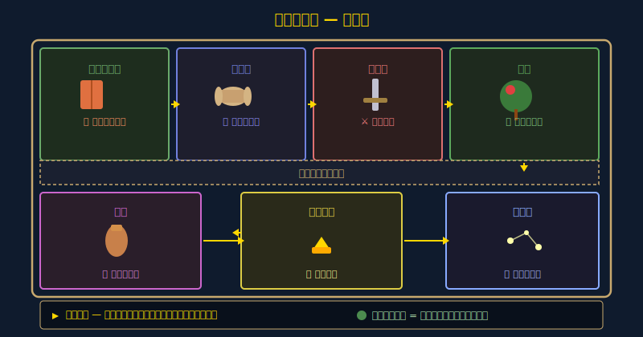
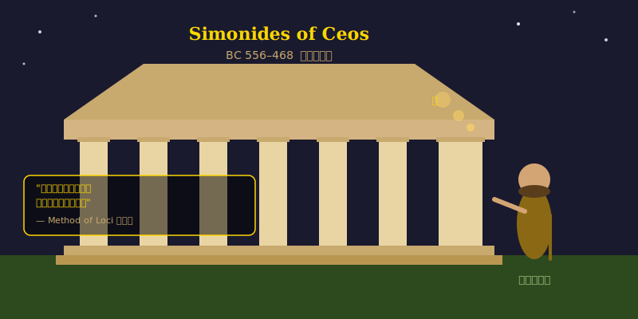
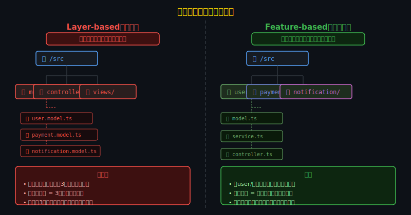
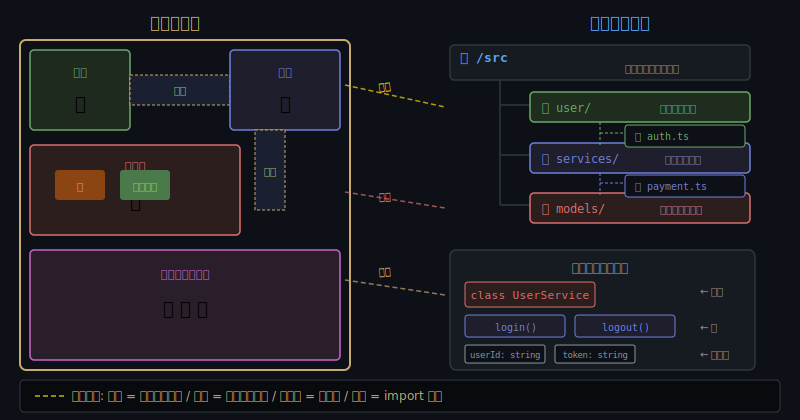
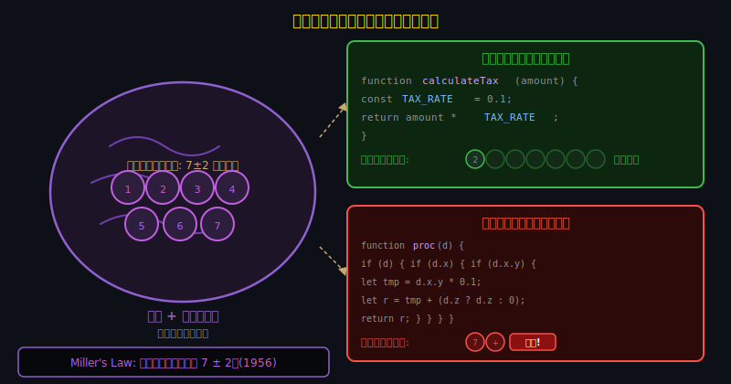

<!-- _class: lead -->
# 記憶の宮殿とコードベース

- 古代ギリシャの記憶術から学ぶコード設計
- 
- なぜ良いコードは「歩ける」のか？

---

# 目次

- - 1. 記憶の宮殿(Method of Loci)とは
- - 2. シモニデスの伝説
- - 3. 空間記憶とコードベース
- - 4. ディレクトリ構造 = 建築設計
- - 5. 認知負荷理論との接点
- - 6. 「歩けるコード」の設計原則

---

<!-- _class: lead -->
# 記憶の宮殿とは

---

# Method of Loci -- 2500年の記憶術

---

# シモニデスの伝説

---

# なぜ空間記憶は強力なのか

- - **海馬(hippocampus)**: 空間認知と記憶の中枢
- - ロンドンタクシー運転手の海馬は平均より大きい
- - 空間情報は**手続き記憶**として長期保存される
- - 記憶チャンピオンの93%が場所法を使用
- - 無関連な単語50個: 場所法で正答率が72% → 95%に向上
- 
- 人間は場所を通じて情報を思い出すように進化した

---

<!-- _class: lead -->
# コードベースと空間認知

---

# 「コードベースを知っている」とは何か

- <svg viewBox="0 0 800 380" xmlns="http://www.w3.org/2000/svg" style="max-height:70vh;max-width:100%;display:block;margin:0 auto;"><rect width="800" height="380" fill="#1a1a2e"/><text x="400" y="26" text-anchor="middle" fill="#f9a825" font-size="15" font-weight="bold" font-family="sans-serif">記憶の宮殿 = コードベースの空間構造</text><rect x="30" y="45" width="360" height="300" fill="#16213e" rx="10" stroke="#f9a825" stroke-width="2"/><text x="210" y="68" text-anchor="middle" fill="#f9a825" font-size="12" font-weight="bold" font-family="sans-serif">記憶の宮殿</text><rect x="50" y="80" width="100" height="70" fill="#1a237e" rx="6" stroke="#3949ab" stroke-width="1"/><text x="100" y="105" text-anchor="middle" fill="#9fa8da" font-size="10" font-weight="bold" font-family="sans-serif">玄関</text><text x="100" y="120" text-anchor="middle" fill="#7986cb" font-size="9" font-family="sans-serif">最初の記憶</text><text x="100" y="135" text-anchor="middle" fill="#7986cb" font-size="9" font-family="sans-serif">エントリポイント</text><rect x="170" y="80" width="100" height="70" fill="#4a148c" rx="6" stroke="#7b1fa2" stroke-width="1"/><text x="220" y="105" text-anchor="middle" fill="#ce93d8" font-size="10" font-weight="bold" font-family="sans-serif">書斎</text><text x="220" y="120" text-anchor="middle" fill="#ba68c8" font-size="9" font-family="sans-serif">重要な知識</text><text x="220" y="135" text-anchor="middle" fill="#ba68c8" font-size="9" font-family="sans-serif">コアロジック</text><rect x="290" y="80" width="80" height="70" fill="#1b5e20" rx="6" stroke="#388e3c" stroke-width="1"/><text x="330" y="105" text-anchor="middle" fill="#a5d6a7" font-size="10" font-weight="bold" font-family="sans-serif">倉庫</text><text x="330" y="120" text-anchor="middle" fill="#81c784" font-size="9" font-family="sans-serif">ツール類</text><text x="330" y="135" text-anchor="middle" fill="#81c784" font-size="9" font-family="sans-serif">utils/</text><rect x="50" y="168" width="100" height="70" fill="#bf360c" rx="6" stroke="#e64a19" stroke-width="1"/><text x="100" y="193" text-anchor="middle" fill="#ffccbc" font-size="10" font-weight="bold" font-family="sans-serif">キッチン</text><text x="100" y="208" text-anchor="middle" fill="#ff8a65" font-size="9" font-family="sans-serif">データ加工</text><text x="100" y="223" text-anchor="middle" fill="#ff8a65" font-size="9" font-family="sans-serif">services/</text><rect x="170" y="168" width="100" height="70" fill="#006064" rx="6" stroke="#00838f" stroke-width="1"/><text x="220" y="193" text-anchor="middle" fill="#80deea" font-size="10" font-weight="bold" font-family="sans-serif">寝室</text><text x="220" y="208" text-anchor="middle" fill="#4dd0e1" font-size="9" font-family="sans-serif">プライベート</text><text x="220" y="223" text-anchor="middle" fill="#4dd0e1" font-size="9" font-family="sans-serif">models/</text><rect x="290" y="168" width="80" height="70" fill="#37474f" rx="6" stroke="#546e7a" stroke-width="1"/><text x="330" y="193" text-anchor="middle" fill="#b0bec5" font-size="10" font-weight="bold" font-family="sans-serif">廊下</text><text x="330" y="208" text-anchor="middle" fill="#90a4ae" font-size="9" font-family="sans-serif">ルーティング</text><text x="330" y="223" text-anchor="middle" fill="#90a4ae" font-size="9" font-family="sans-serif">routes/</text><text x="210" y="270" text-anchor="middle" fill="#78909c" font-size="9" font-family="sans-serif">「部屋ごとに5-7アイテム」= 認知負荷の限界</text><text x="210" y="288" text-anchor="middle" fill="#f9a825" font-size="9" font-family="sans-serif">場所を覚えることで記憶が定着する</text><polygon points="398,195 420,185 420,205" fill="#e91e63"/><line x1="392" y1="195" x2="420" y2="195" stroke="#e91e63" stroke-width="3"/><rect x="430" y="45" width="340" height="300" fill="#16213e" rx="10" stroke="#e91e63" stroke-width="2"/><text x="600" y="68" text-anchor="middle" fill="#e91e63" font-size="12" font-weight="bold" font-family="sans-serif">コードベース</text><rect x="450" y="80" width="100" height="70" fill="#1a237e" rx="6" stroke="#3949ab" stroke-width="1"/><text x="500" y="105" text-anchor="middle" fill="#9fa8da" font-size="10" font-weight="bold" font-family="sans-serif">src/index.ts</text><text x="500" y="120" text-anchor="middle" fill="#7986cb" font-size="9" font-family="sans-serif">エントリポイント</text><text x="500" y="135" text-anchor="middle" fill="#7986cb" font-size="9" font-family="sans-serif">玄関ホール</text><rect x="565" y="80" width="100" height="70" fill="#4a148c" rx="6" stroke="#7b1fa2" stroke-width="1"/><text x="615" y="105" text-anchor="middle" fill="#ce93d8" font-size="10" font-weight="bold" font-family="sans-serif">src/core/</text><text x="615" y="120" text-anchor="middle" fill="#ba68c8" font-size="9" font-family="sans-serif">ビジネスロジック</text><text x="615" y="135" text-anchor="middle" fill="#ba68c8" font-size="9" font-family="sans-serif">書斎</text><rect x="680" y="80" width="70" height="70" fill="#1b5e20" rx="6" stroke="#388e3c" stroke-width="1"/><text x="715" y="105" text-anchor="middle" fill="#a5d6a7" font-size="10" font-weight="bold" font-family="sans-serif">utils/</text><text x="715" y="120" text-anchor="middle" fill="#81c784" font-size="9" font-family="sans-serif">共通ツール</text><text x="715" y="135" text-anchor="middle" fill="#81c784" font-size="9" font-family="sans-serif">倉庫</text><rect x="450" y="168" width="100" height="70" fill="#bf360c" rx="6" stroke="#e64a19" stroke-width="1"/><text x="500" y="193" text-anchor="middle" fill="#ffccbc" font-size="10" font-weight="bold" font-family="sans-serif">services/</text><text x="500" y="208" text-anchor="middle" fill="#ff8a65" font-size="9" font-family="sans-serif">データ処理</text><text x="500" y="223" text-anchor="middle" fill="#ff8a65" font-size="9" font-family="sans-serif">キッチン</text><rect x="565" y="168" width="100" height="70" fill="#006064" rx="6" stroke="#00838f" stroke-width="1"/><text x="615" y="193" text-anchor="middle" fill="#80deea" font-size="10" font-weight="bold" font-family="sans-serif">models/</text><text x="615" y="208" text-anchor="middle" fill="#4dd0e1" font-size="9" font-family="sans-serif">データ構造</text><text x="615" y="223" text-anchor="middle" fill="#4dd0e1" font-size="9" font-family="sans-serif">寝室</text><rect x="680" y="168" width="70" height="70" fill="#37474f" rx="6" stroke="#546e7a" stroke-width="1"/><text x="715" y="193" text-anchor="middle" fill="#b0bec5" font-size="10" font-weight="bold" font-family="sans-serif">routes/</text><text x="715" y="208" text-anchor="middle" fill="#90a4ae" font-size="9" font-family="sans-serif">ルーティング</text><text x="715" y="223" text-anchor="middle" fill="#90a4ae" font-size="9" font-family="sans-serif">廊下</text><text x="600" y="270" text-anchor="middle" fill="#78909c" font-size="9" font-family="sans-serif">場所を知ることがコードベース習熟の本質</text><text x="600" y="288" text-anchor="middle" fill="#f9a825" font-size="9" font-family="sans-serif">「あの機能は src/core/ にある」</text></svg>
- - 経験豊富な開発者は**コードの場所**を覚えている
- - 「あの機能はsrc/utils/の中にあったはず」
- - 「認証ロジックはmiddleware/auth.tsにある」
- - これは記憶の宮殿と同じメカニズム
- 
- **良いコードベース = 歩き回りやすい建物**
- **悪いコードベース = 迷路のような建物**

---

# ディレクトリ構造は建築設計

---

# コードベース = 宮殿の対応関係

---

<!-- _class: lead -->
# 認知負荷との関係

---

# 認知負荷理論とコード理解

- <svg viewBox="0 0 800 380" xmlns="http://www.w3.org/2000/svg" style="max-height:70vh;max-width:100%;display:block;margin:0 auto;"><rect width="800" height="380" fill="#1a1a2e"/><text x="400" y="26" text-anchor="middle" fill="#f9a825" font-size="15" font-weight="bold" font-family="sans-serif">認知負荷理論 × コード設計</text><rect x="30" y="45" width="220" height="290" fill="#16213e" rx="8" stroke="#f9a825" stroke-width="2"/><text x="140" y="66" text-anchor="middle" fill="#f9a825" font-size="12" font-weight="bold" font-family="sans-serif">作業記憶の容量</text><rect x="50" y="80" width="180" height="220" fill="#0d47a1" rx="6" opacity="0.3"/><text x="140" y="108" text-anchor="middle" fill="#90caf9" font-size="11" font-family="sans-serif">7 ± 2 チャンク</text><text x="140" y="126" text-anchor="middle" fill="#64b5f6" font-size="10" font-family="sans-serif">(Miller 1956)</text><circle cx="80" cy="155" r="18" fill="#1565c0" stroke="#42a5f5" stroke-width="1"/><text x="80" y="160" text-anchor="middle" fill="#fff" font-size="10" font-family="sans-serif">1</text><circle cx="120" cy="155" r="18" fill="#1565c0" stroke="#42a5f5" stroke-width="1"/><text x="120" y="160" text-anchor="middle" fill="#fff" font-size="10" font-family="sans-serif">2</text><circle cx="160" cy="155" r="18" fill="#1565c0" stroke="#42a5f5" stroke-width="1"/><text x="160" y="160" text-anchor="middle" fill="#fff" font-size="10" font-family="sans-serif">3</text><circle cx="200" cy="155" r="18" fill="#1565c0" stroke="#42a5f5" stroke-width="1"/><text x="200" y="160" text-anchor="middle" fill="#fff" font-size="10" font-family="sans-serif">4</text><circle cx="80" cy="200" r="18" fill="#1565c0" stroke="#42a5f5" stroke-width="1"/><text x="80" y="205" text-anchor="middle" fill="#fff" font-size="10" font-family="sans-serif">5</text><circle cx="120" cy="200" r="18" fill="#1565c0" stroke="#42a5f5" stroke-width="1"/><text x="120" y="205" text-anchor="middle" fill="#fff" font-size="10" font-family="sans-serif">6</text><circle cx="160" cy="200" r="18" fill="#1565c0" stroke="#42a5f5" stroke-width="1"/><text x="160" y="205" text-anchor="middle" fill="#fff" font-size="10" font-family="sans-serif">7</text><circle cx="200" cy="200" r="18" fill="#c62828" stroke="#ef5350" stroke-width="1"/><text x="200" y="205" text-anchor="middle" fill="#fff" font-size="10" font-family="sans-serif">8!</text><text x="140" y="250" text-anchor="middle" fill="#ef5350" font-size="11" font-family="sans-serif">8個目でオーバーフロー</text><text x="140" y="268" text-anchor="middle" fill="#90a4ae" font-size="9" font-family="sans-serif">バグ・見落としが増加</text><rect x="280" y="45" width="220" height="290" fill="#16213e" rx="8" stroke="#4caf50" stroke-width="2"/><text x="390" y="66" text-anchor="middle" fill="#4caf50" font-size="12" font-weight="bold" font-family="sans-serif">良い設計（低負荷）</text><rect x="295" y="80" width="190" height="50" fill="#1b5e20" rx="5" stroke="#388e3c" stroke-width="1"/><text x="390" y="100" text-anchor="middle" fill="#a5d6a7" font-size="10" font-weight="bold" font-family="sans-serif">関数の引数: 4個以下</text><text x="390" y="116" text-anchor="middle" fill="#81c784" font-size="9" font-family="sans-serif">add(a, b) — 明確</text><rect x="295" y="140" width="190" height="50" fill="#1b5e20" rx="5" stroke="#388e3c" stroke-width="1"/><text x="390" y="160" text-anchor="middle" fill="#a5d6a7" font-size="10" font-weight="bold" font-family="sans-serif">公開API: 7個以下</text><text x="390" y="176" text-anchor="middle" fill="#81c784" font-size="9" font-family="sans-serif">モジュールの境界が明確</text><rect x="295" y="200" width="190" height="50" fill="#1b5e20" rx="5" stroke="#388e3c" stroke-width="1"/><text x="390" y="220" text-anchor="middle" fill="#a5d6a7" font-size="10" font-weight="bold" font-family="sans-serif">ネスト: 3段階以下</text><text x="390" y="236" text-anchor="middle" fill="#81c784" font-size="9" font-family="sans-serif">早期リターンで平坦に</text><text x="390" y="290" text-anchor="middle" fill="#f9a825" font-size="10" font-weight="bold" font-family="sans-serif">宮殿の「部屋」と同じ原理</text><text x="390" y="308" text-anchor="middle" fill="#f9a825" font-size="9" font-family="sans-serif">1部屋 = 1責任 = 低認知負荷</text><rect x="530" y="45" width="240" height="290" fill="#16213e" rx="8" stroke="#e91e63" stroke-width="2"/><text x="650" y="66" text-anchor="middle" fill="#e91e63" font-size="12" font-weight="bold" font-family="sans-serif">悪い設計（高負荷）</text><rect x="545" y="80" width="210" height="50" fill="#3e1010" rx="5" stroke="#b71c1c" stroke-width="1"/><text x="650" y="100" text-anchor="middle" fill="#ef9a9a" font-size="10" font-weight="bold" font-family="sans-serif">引数: 8個以上</text><text x="650" y="116" text-anchor="middle" fill="#ff8a65" font-size="9" font-family="sans-serif">func(a,b,c,d,e,f,g,h) — 混乱</text><rect x="545" y="140" width="210" height="50" fill="#3e1010" rx="5" stroke="#b71c1c" stroke-width="1"/><text x="650" y="160" text-anchor="middle" fill="#ef9a9a" font-size="10" font-weight="bold" font-family="sans-serif">ネスト: 5-6段階</text><text x="650" y="176" text-anchor="middle" fill="#ff8a65" font-size="9" font-family="sans-serif">if(if(if(if(...)))) — 迷路</text><rect x="545" y="200" width="210" height="50" fill="#3e1010" rx="5" stroke="#b71c1c" stroke-width="1"/><text x="650" y="220" text-anchor="middle" fill="#ef9a9a" font-size="10" font-weight="bold" font-family="sans-serif">グローバル変数: 多数</text><text x="650" y="236" text-anchor="middle" fill="#ff8a65" font-size="9" font-family="sans-serif">何でも置く「床置き部屋」</text><text x="650" y="290" text-anchor="middle" fill="#e91e63" font-size="10" font-weight="bold" font-family="sans-serif">迷路のような建物</text><text x="650" y="308" text-anchor="middle" fill="#e91e63" font-size="9" font-family="sans-serif">「どこに何があるかわからない」</text></svg>

---

# Millerの法則と関数設計

- - **7+-2の法則**: 短期記憶の容量制限
- - 関数の引数は4個以下が理想
- - 1つのモジュールの公開APIは7個以下
- - ネストは3段階以下に抑える
- 
- 記憶の宮殿が「部屋ごとに5-7アイテム」を推奨するのと同じ原理

---

<!-- _class: lead -->
# 「歩けるコード」の設計原則

---

# 原則1: 予測可能な配置

- <svg viewBox="0 0 800 380" xmlns="http://www.w3.org/2000/svg" style="max-height:70vh;max-width:100%;display:block;margin:0 auto;"><rect width="800" height="380" fill="#1a1a2e"/><text x="400" y="26" text-anchor="middle" fill="#f9a825" font-size="15" font-weight="bold" font-family="sans-serif">「歩けるコード」3原則 × 記憶の宮殿</text><rect x="30" y="45" width="230" height="300" fill="#16213e" rx="10" stroke="#f9a825" stroke-width="2"/><text x="145" y="68" text-anchor="middle" fill="#f9a825" font-size="12" font-weight="bold" font-family="sans-serif">原則1: 予測可能な配置</text><rect x="50" y="80" width="190" height="40" fill="#1565c0" rx="5"/><text x="145" y="97" text-anchor="middle" fill="#ffffff" font-size="10" font-weight="bold" font-family="sans-serif">src/handlers/</text><text x="145" y="111" text-anchor="middle" fill="#90caf9" font-size="9" font-family="sans-serif">ハンドラーはここ</text><rect x="50" y="128" width="190" height="40" fill="#1976d2" rx="5"/><text x="145" y="145" text-anchor="middle" fill="#ffffff" font-size="10" font-weight="bold" font-family="sans-serif">src/models/</text><text x="145" y="159" text-anchor="middle" fill="#90caf9" font-size="9" font-family="sans-serif">モデルはここ</text><rect x="50" y="176" width="190" height="40" fill="#1b5e20" rx="5"/><text x="145" y="193" text-anchor="middle" fill="#ffffff" font-size="10" font-weight="bold" font-family="sans-serif">src/utils/</text><text x="145" y="207" text-anchor="middle" fill="#a5d6a7" font-size="9" font-family="sans-serif">ツールはここ</text><text x="145" y="248" text-anchor="middle" fill="#90a4ae" font-size="9" font-family="sans-serif">宮殿: 玄関には靴</text><text x="145" y="264" text-anchor="middle" fill="#90a4ae" font-size="9" font-family="sans-serif">キッチンには食器</text><text x="145" y="285" text-anchor="middle" fill="#f9a825" font-size="10" font-weight="bold" font-family="sans-serif">驚きを最小化する</text><text x="145" y="303" text-anchor="middle" fill="#f9a825" font-size="9" font-family="sans-serif">Principle of Least Surprise</text><rect x="285" y="45" width="230" height="300" fill="#16213e" rx="10" stroke="#e91e63" stroke-width="2"/><text x="400" y="68" text-anchor="middle" fill="#e91e63" font-size="12" font-weight="bold" font-family="sans-serif">原則2: 明確な境界線</text><rect x="305" y="80" width="190" height="125" fill="#4a148c" rx="8" stroke="#7b1fa2" stroke-width="1"/><text x="400" y="102" text-anchor="middle" fill="#ce93d8" font-size="10" font-weight="bold" font-family="sans-serif">Domain A</text><text x="400" y="120" text-anchor="middle" fill="#b39ddb" font-size="9" font-family="sans-serif">auth/</text><text x="400" y="135" text-anchor="middle" fill="#b39ddb" font-size="9" font-family="sans-serif">models/user.ts</text><text x="400" y="150" text-anchor="middle" fill="#b39ddb" font-size="9" font-family="sans-serif">services/auth.ts</text><text x="400" y="170" text-anchor="middle" fill="#7e57c2" font-size="9" font-family="sans-serif">「この部屋は安全」</text><rect x="305" y="215" width="190" height="100" fill="#006064" rx="8" stroke="#00838f" stroke-width="1"/><text x="400" y="237" text-anchor="middle" fill="#80deea" font-size="10" font-weight="bold" font-family="sans-serif">Domain B</text><text x="400" y="255" text-anchor="middle" fill="#4dd0e1" font-size="9" font-family="sans-serif">billing/</text><text x="400" y="270" text-anchor="middle" fill="#4dd0e1" font-size="9" font-family="sans-serif">models/invoice.ts</text><text x="400" y="285" text-anchor="middle" fill="#26c6da" font-size="9" font-family="sans-serif">変更の影響が予測可能</text><text x="400" y="318" text-anchor="middle" fill="#e91e63" font-size="10" font-weight="bold" font-family="sans-serif">Bounded Context</text><text x="400" y="335" text-anchor="middle" fill="#e91e63" font-size="9" font-family="sans-serif">宮殿の「部屋の壁」</text><rect x="540" y="45" width="230" height="300" fill="#16213e" rx="10" stroke="#4caf50" stroke-width="2"/><text x="655" y="68" text-anchor="middle" fill="#4caf50" font-size="12" font-weight="bold" font-family="sans-serif">原則3: ランドマーク</text><rect x="558" y="80" width="193" height="45" fill="#bf360c" rx="5" stroke="#e64a19" stroke-width="1"/><text x="654" y="98" text-anchor="middle" fill="#ffccbc" font-size="10" font-weight="bold" font-family="sans-serif">README.md</text><text x="654" y="113" text-anchor="middle" fill="#ff8a65" font-size="9" font-family="sans-serif">各ディレクトリの案内板</text><rect x="558" y="133" width="193" height="45" fill="#37474f" rx="5" stroke="#546e7a" stroke-width="1"/><text x="654" y="151" text-anchor="middle" fill="#b0bec5" font-size="10" font-weight="bold" font-family="sans-serif">index.ts</text><text x="654" y="166" text-anchor="middle" fill="#90a4ae" font-size="9" font-family="sans-serif">公開APIを集約する窓口</text><rect x="558" y="186" width="193" height="45" fill="#1a237e" rx="5" stroke="#3949ab" stroke-width="1"/><text x="654" y="204" text-anchor="middle" fill="#9fa8da" font-size="10" font-weight="bold" font-family="sans-serif">型定義 (.d.ts)</text><text x="654" y="219" text-anchor="middle" fill="#7986cb" font-size="9" font-family="sans-serif">建物の設計図</text><rect x="558" y="239" width="193" height="45" fill="#004d40" rx="5" stroke="#00796b" stroke-width="1"/><text x="654" y="257" text-anchor="middle" fill="#80cbc4" font-size="10" font-weight="bold" font-family="sans-serif">命名規則</text><text x="654" y="272" text-anchor="middle" fill="#4db6ac" font-size="9" font-family="sans-serif">一貫性がナビゲーションを助ける</text><text x="655" y="318" text-anchor="middle" fill="#4caf50" font-size="10" font-weight="bold" font-family="sans-serif">宮殿の「目印オブジェクト」</text><text x="655" y="335" text-anchor="middle" fill="#4caf50" font-size="9" font-family="sans-serif">記憶の宮殿: 象徴的な置き物</text></svg>
- - **Principle of Least Surprise**: 驚きを最小化する
- - ファイル名から内容が推測できること
- - 同じ種類のものは同じ場所に置く
- - 例: `src/handlers/` にハンドラ、`src/models/` にモデル
- 
- 記憶の宮殿では「玄関には靴、キッチンには食器」という自然な配置が有効

---

# 原則2: 明確な境界線

- - **Bounded Context**: ドメインごとの明確な区分
- - モジュール間の依存関係を最小化
- - 「この部屋の中は安全」という安心感
- - 変更の影響範囲が予測可能になる
- 
- 宮殿の「部屋の壁」= モジュールの境界

---

# 原則3: ランドマークを置く

- - **README.md**: 各ディレクトリの入口に案内板
- - **index.ts**: モジュールの公開APIを集約
- - **命名規則**: 一貫した命名がナビゲーションを助ける
- - **型定義**: TypeScriptの型 = 建物の設計図
- 
- 記憶の宮殿の「目印となるオブジェクト」に相当

---

# まとめ

- - 人間の空間記憶は2500年前から活用されている
- - 良いコードベースは記憶の宮殿と同じ構造を持つ
- - 予測可能な配置 + 明確な境界 + ランドマーク
- - 認知負荷を減らすことが保守性を高める
- 
- **「コードは読み物ではない。歩き回る建物だ。」**

---

# 参考文献

- - **Research:**
- - [Moonwalking with Einstein - Joshua Foer (2011)](https://en.wikipedia.org/wiki/Moonwalking_with_Einstein)
- - [Cognitive Load Theory - John Sweller (1988)](https://en.wikipedia.org/wiki/Cognitive_load)
- - **Software Design:**
- - [A Philosophy of Software Design - John Ousterhout (2018)](https://web.stanford.edu/~ouster/cgi-bin/aposd.php)
- - [The Pragmatic Programmer - Hunt & Thomas (1999)](https://pragprog.com/titles/tpp20/the-pragmatic-programmer-20th-anniversary-edition/)

