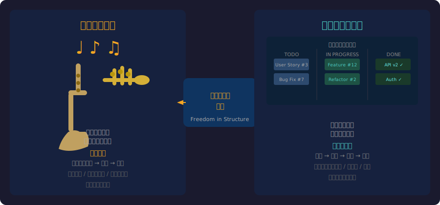
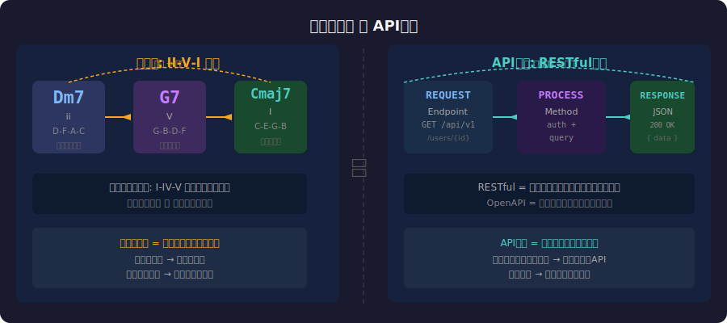
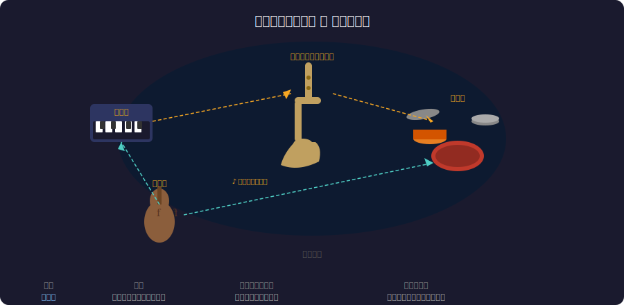
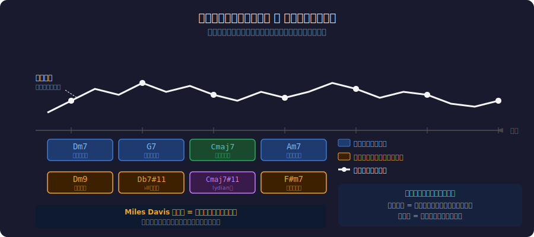

<!-- _class: lead -->
# ジャズと即興的開発

- コード進行から学ぶアジャイル開発の哲学
- 
- 計画と即興のバランスはどこにあるのか？

---

# 目次

- - 1. ジャズの即興演奏とは
- - 2. ジャズとソフトウェア開発の類似構造
- - 3. コード進行 = アーキテクチャ
- - 4. アンサンブルとチーム開発
- - 5. リハーモナイゼーション = リファクタリング
- - 6. 即興的開発の設計原則

---

<!-- _class: lead -->
# ジャズの即興演奏

---

# 即興は「自由」ではない

- - ジャズの即興演奏は**完全な自由**ではない
- - **コード進行**(和声の枠組み)の上で即興する
- - **スケール**(音階)という制約の中で創造する
- - **リズムセクション**が土台を提供する
- - **形式**(AABA, 12小節ブルースなど)が構造を与える
- 
- 制約こそが創造性を引き出す

---

<!-- _class: lead -->
# ジャズとソフトウェアの構造的類似

---

# 驚くほど似ている2つの世界

---

# コード進行 = アーキテクチャ

---

# 「スタンダード」の存在

- - ジャズには**スタンダードナンバー**がある
-   - Autumn Leaves, All The Things You Are, etc.
-   - 同じ曲を異なるミュージシャンが異なる解釈で演奏
- - ソフトウェアにも**デザインパターン**がある
-   - MVC, Observer, Strategy, etc.
-   - 同じパターンを異なるチームが異なる実装で適用
- 
- **共通の語彙**がコミュニケーションを加速する

---

<!-- _class: lead -->
# アンサンブルとチーム開発

---

# ジャズアンサンブルの役割分担

---

# アジャイルチームとの対応

- - **リズムセクション** = インフラ/プラットフォームチーム
-   - 安定した土台を提供し続ける
- - **ソリスト** = フィーチャー開発者
-   - 土台の上で自由に創造する
- - **コンダクター** = テックリード/アーキテクト
-   - 全体の方向性を示すが細部は任せる
- 
- **指示ではなく「聴き合い」でチームが機能する**

---

<!-- _class: lead -->
# リハーモナイゼーション

---

# リハーモナイゼーション = リファクタリング

---

# 変え方の哲学

- - **ジャズ**: メロディを保ちつつコード進行を刷新
-   - 同じ曲が全く新しい響きになる
-   - リスナーには「同じ曲」と認識される
- - **リファクタリング**: 外部振る舞いを保ちつつ内部構造を刷新
-   - 同じ機能がより良い設計になる
-   - ユーザーには「同じ機能」と認識される
- 
- **外側を変えずに中身を変える** -- 両者の本質

---

<!-- _class: lead -->
# 即興的開発の設計原則

---

# ジャズから学ぶ6つの原則

- - **1. 構造の中の自由**: 制約がある方が創造的になれる
- - **2. 聴くことが最優先**: コードレビュー = 他の演奏を聴く
- - **3. 間違いを活かす**: バグを機能に変える柔軟性
- - **4. 繰り返しの中の進化**: イテレーションで洗練される
- - **5. 共通語彙の力**: パターン言語がチームを加速
- - **6. 即興には訓練が必要**: 自由に見える即興は膨大な練習の上にある

---

# まとめ

- - ジャズの即興は完全な自由ではなく「構造化された自由」
- - アジャイル開発も同じ: アーキテクチャという枠の中の即興
- - チーム開発は指示ではなく「聴き合い」で機能する
- - リファクタリングはリハーモナイゼーション
- 
- **「最高のソフトウェアチームはジャズバンドのように演奏する。」**

---

# 参考文献

- - **Books:**
- - [Agile Software Development - Robert C. Martin (2002)](https://en.wikipedia.org/wiki/Agile_software_development)
- - [The Jazz Process - Adrian Cho (2010)](https://www.informit.com/store/jazz-process-collaboration-innovation-and-agility-9780321636461)
- - **Research:**
- - [Group Creativity: Innovation through Collaboration - Sawyer (2003)](https://keithsawyer.com/books/group-creativity/)

