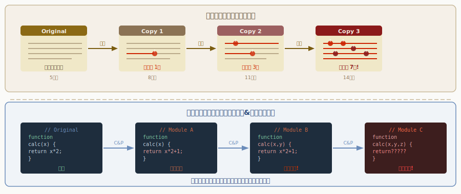

<!-- _class: lead -->
# 写本文化とコードレビュー

- 中世の写字室から学ぶ知識継承の技法
- 
- 1000年前の修道院に、ベストプラクティスがあった

---

# 目次

- - 1. 中世の写字室(Scriptorium)とは
- - 2. 写本制作のワークフロー
- - 3. コードレビューとの構造的類似
- - 4. エラー伝播の問題
- - 5. 品質管理の技法
- - 6. 知識継承のデザインパターン

---

<!-- _class: lead -->
# 中世の写字室

---

# Scriptorium -- 知識のバージョン管理

---

# 写本制作のワークフロー（1/2）

> *写字→校訂→装飾の分業がGitフローの原型*

![w:800 center](data:image/svg+xml;base64,PHN2ZyB2aWV3Qm94PSIwIDAgODAwIDQwMCIgc3R5bGU9Im1heC1oZWlnaHQ6NzB2aDt3aWR0aDphdXRvO2Rpc3BsYXk6YmxvY2s7bWFyZ2luOjAgYXV0bztsZXR0ZXItc3BhY2luZzowIiB4bWxucz0iaHR0cDovL3d3dy53My5vcmcvMjAwMC9zdmciPgogIDxyZWN0IHdpZHRoPSI4MDAiIGhlaWdodD0iNDAwIiBmaWxsPSIjMWExYTJlIi8+CiAgPHRleHQgeD0iNDAwIiB5PSIyOCIgdGV4dC1hbmNob3I9Im1pZGRsZSIgZmlsbD0iI2ZmZmZmZiIgZm9udC1zaXplPSIxNiIgZm9udC13ZWlnaHQ9ImJvbGQiIGZvbnQtZmFtaWx5PSJzYW5zLXNlcmlmIj7lhpnmnKzliLbkvZwgdnMg44K944OV44OI44Km44Kn44Ki6ZaL55m677ya5Lim6KGM44OV44Ot44O8PC90ZXh0PgogIDwhLS0gUGlwZWxpbmUgc3RhZ2VzIC0tPgogIAogICAgPCEtLSBTdGFnZSAxIC0tPgogICAgPHJlY3QgeD0iNTAiIHk9IjYwIiB3aWR0aD0iMTAwIiBoZWlnaHQ9IjU1IiByeD0iOCIgZmlsbD0iIzE2MjEzZSIgc3Ryb2tlPSIjZjlhODI1IiBzdHJva2Utd2lkdGg9IjEuNSIvPgogICAgPHRleHQgeD0iMTAwIiB5PSI4MiIgdGV4dC1hbmNob3I9Im1pZGRsZSIgZmlsbD0iI2Y5YTgyNSIgZm9udC1zaXplPSIxMSIgZm9udC1mYW1pbHk9InNhbnMtc2VyaWYiPuWOn+acrOmBuOWumjwvdGV4dD4KICAgIDx0ZXh0IHg9IjEwMCIgeT0iOTkiIHRleHQtYW5jaG9yPSJtaWRkbGUiIGZpbGw9IiNhYWFhYWEiIGZvbnQtc2l6ZT0iOSIgZm9udC1mYW1pbHk9InNhbnMtc2VyaWYiPuS4reS4ljwvdGV4dD4KICAgIDxyZWN0IHg9IjUwIiB5PSIxNDUiIHdpZHRoPSIxMDAiIGhlaWdodD0iNTUiIHJ4PSI4IiBmaWxsPSIjMTYyMTNlIiBzdHJva2U9IiNmOWE4MjUiIHN0cm9rZS13aWR0aD0iMS41Ii8+CiAgICA8dGV4dCB4PSIxMDAiIHk9IjE2NyIgdGV4dC1hbmNob3I9Im1pZGRsZSIgZmlsbD0iI2Y5YTgyNSIgZm9udC1zaXplPSIxMSIgZm9udC1mYW1pbHk9InNhbnMtc2VyaWYiPuimgeS7tuWumue+qTwvdGV4dD4KICAgIDx0ZXh0IHg9IjEwMCIgeT0iMTg0IiB0ZXh0LWFuY2hvcj0ibWlkZGxlIiBmaWxsPSIjYWFhYWFhIiBmb250LXNpemU9IjkiIGZvbnQtZmFtaWx5PSJzYW5zLXNlcmlmIj7nj77ku6M8L3RleHQ+CiAgICA8cG9seWdvbiBwb2ludHM9IjE2Miw4NyAxNTQsODAgMTU0LDk0IiBmaWxsPSIjZjlhODI1IiBvcGFjaXR5PSIwLjciLz4KICAgIDxwb2x5Z29uIHBvaW50cz0iMTYyLDE3MiAxNTQsMTY1IDE1NCwxNzkiIGZpbGw9IiNmOWE4MjUiIG9wYWNpdHk9IjAuNyIvPgogICAgCiAgICA8IS0tIFN0YWdlIDIgLS0+CiAgICA8cmVjdCB4PSIxNzAiIHk9IjYwIiB3aWR0aD0iMTAwIiBoZWlnaHQ9IjU1IiByeD0iOCIgZmlsbD0iIzE2MjEzZSIgc3Ryb2tlPSIjZjlhODI1IiBzdHJva2Utd2lkdGg9IjEuNSIvPgogICAgPHRleHQgeD0iMjIwIiB5PSI4MiIgdGV4dC1hbmNob3I9Im1pZGRsZSIgZmlsbD0iI2Y5YTgyNSIgZm9udC1zaXplPSIxMSIgZm9udC1mYW1pbHk9InNhbnMtc2VyaWYiPuabuOWGmTwvdGV4dD4KICAgIDx0ZXh0IHg9IjIyMCIgeT0iOTkiIHRleHQtYW5jaG9yPSJtaWRkbGUiIGZpbGw9IiNhYWFhYWEiIGZvbnQtc2l6ZT0iOSIgZm9udC1mYW1pbHk9InNhbnMtc2VyaWYiPuS4reS4ljwvdGV4dD4KICAgIDxyZWN0IHg9IjE3MCIgeT0iMTQ1IiB3aWR0aD0iMTAwIiBoZWlnaHQ9IjU1IiByeD0iOCIgZmlsbD0iIzE2MjEzZSIgc3Ryb2tlPSIjZjlhODI1IiBzdHJva2Utd2lkdGg9IjEuNSIvPgogICAgPHRleHQgeD0iMjIwIiB5PSIxNjciIHRleHQtYW5jaG9yPSJtaWRkbGUiIGZpbGw9IiNmOWE4MjUiIGZvbnQtc2l6ZT0iMTEiIGZvbnQtZmFtaWx5PSJzYW5zLXNlcmlmIj7lrp/oo4U8L3RleHQ+CiAgICA8dGV4dCB4PSIyMjAiIHk9IjE4NCIgdGV4dC1hbmNob3I9Im1pZGRsZSIgZmlsbD0iI2FhYWFhYSIgZm9udC1zaXplPSI5IiBmb250LWZhbWlseT0ic2Fucy1zZXJpZiI+54++5LujPC90ZXh0PgogICAgPHBvbHlnb24gcG9pbnRzPSIyODIsODcgMjc0LDgwIDI3NCw5NCIgZmlsbD0iI2Y5YTgyNSIgb3BhY2l0eT0iMC43Ii8+CiAgICA8cG9seWdvbiBwb2ludHM9IjI4MiwxNzIgMjc0LDE2NSAyNzQsMTc5IiBmaWxsPSIjZjlhODI1IiBvcGFjaXR5PSIwLjciLz4KICAgIAogICAgPCEtLSBTdGFnZSAzIC0tPgogICAgPHJlY3QgeD0iMjkwIiB5PSI2MCIgd2lkdGg9IjEwMCIgaGVpZ2h0PSI1NSIgcng9IjgiIGZpbGw9IiMxNjIxM2UiIHN0cm9rZT0iI2U5MWU2MyIgc3Ryb2tlLXdpZHRoPSIxLjUiLz4KICAgIDx0ZXh0IHg9IjM0MCIgeT0iODIiIHRleHQtYW5jaG9yPSJtaWRkbGUiIGZpbGw9IiNlOTFlNjMiIGZvbnQtc2l6ZT0iMTEiIGZvbnQtZmFtaWx5PSJzYW5zLXNlcmlmIj7moKHlkIg8L3RleHQ+CiAgICA8dGV4dCB4PSIzNDAiIHk9Ijk5IiB0ZXh0LWFuY2hvcj0ibWlkZGxlIiBmaWxsPSIjYWFhYWFhIiBmb250LXNpemU9IjkiIGZvbnQtZmFtaWx5PSJzYW5zLXNlcmlmIj7kuK3kuJY8L3RleHQ+CiAgICA8cmVjdCB4PSIyOTAiIHk9IjE0NSIgd2lkdGg9IjEwMCIgaGVpZ2h0PSI1NSIgcng9IjgiIGZpbGw9IiMxNjIxM2UiIHN0cm9rZT0iI2U5MWU2MyIgc3Ryb2tlLXdpZHRoPSIxLjUiLz4KICAgIDx0ZXh0IHg9IjM0MCIgeT0iMTY3IiB0ZXh0LWFuY2hvcj0ibWlkZGxlIiBmaWxsPSIjZTkxZTYzIiBmb250LXNpemU9IjExIiBmb250LWZhbWlseT0ic2Fucy1zZXJpZiI+44Kz44O844OJ44Os44OT44Ol44O8PC90ZXh0PgogICAgPHRleHQgeD0iMzQwIiB5PSIxODQiIHRleHQtYW5jaG9yPSJtaWRkbGUiIGZpbGw9IiNhYWFhYWEiIGZvbnQtc2l6ZT0iOSIgZm9udC1mYW1pbHk9InNhbnMtc2VyaWYiPuePvuS7ozwvdGV4dD4KICAgIDxwb2x5Z29uIHBvaW50cz0iNDAyLDg3IDM5NCw4MCAzOTQsOTQiIGZpbGw9IiNlOTFlNjMiIG9wYWNpdHk9IjAuNyIvPgogICAgPHBvbHlnb24gcG9pbnRzPSI0MDIsMTcyIDM5NCwxNjUgMzk0LDE3OSIgZmlsbD0iI2U5MWU2MyIgb3BhY2l0eT0iMC43Ii8+CiAgICAKICAgIDwhLS0gU3RhZ2UgNCAtLT4KICAgIDxyZWN0IHg9IjQxMCIgeT0iNjAiIHdpZHRoPSIxMDAiIGhlaWdodD0iNTUiIHJ4PSI4IiBmaWxsPSIjMTYyMTNlIiBzdHJva2U9IiNlOTFlNjMiIHN0cm9rZS13aWR0aD0iMS41Ii8+CiAgICA8dGV4dCB4PSI0NjAiIHk9IjgyIiB0ZXh0LWFuY2hvcj0ibWlkZGxlIiBmaWxsPSIjZTkxZTYzIiBmb250LXNpemU9IjExIiBmb250LWZhbWlseT0ic2Fucy1zZXJpZiI+5L+u5q2jPC90ZXh0PgogICAgPHRleHQgeD0iNDYwIiB5PSI5OSIgdGV4dC1hbmNob3I9Im1pZGRsZSIgZmlsbD0iI2FhYWFhYSIgZm9udC1zaXplPSI5IiBmb250LWZhbWlseT0ic2Fucy1zZXJpZiI+5Lit5LiWPC90ZXh0PgogICAgPHJlY3QgeD0iNDEwIiB5PSIxNDUiIHdpZHRoPSIxMDAiIGhlaWdodD0iNTUiIHJ4PSI4IiBmaWxsPSIjMTYyMTNlIiBzdHJva2U9IiNlOTFlNjMiIHN0cm9rZS13aWR0aD0iMS41Ii8+CiAgICA8dGV4dCB4PSI0NjAiIHk9IjE2NyIgdGV4dC1hbmNob3I9Im1pZGRsZSIgZmlsbD0iI2U5MWU2MyIgZm9udC1zaXplPSIxMSIgZm9udC1mYW1pbHk9InNhbnMtc2VyaWYiPuODkOOCsOS/ruatozwvdGV4dD4KICAgIDx0ZXh0IHg9IjQ2MCIgeT0iMTg0IiB0ZXh0LWFuY2hvcj0ibWlkZGxlIiBmaWxsPSIjYWFhYWFhIiBmb250LXNpemU9IjkiIGZvbnQtZmFtaWx5PSJzYW5zLXNlcmlmIj7nj77ku6M8L3RleHQ+CiAgICA8cG9seWdvbiBwb2ludHM9IjUyMiw4NyA1MTQsODAgNTE0LDk0IiBmaWxsPSIjZTkxZTYzIiBvcGFjaXR5PSIwLjciLz4KICAgIDxwb2x5Z29uIHBvaW50cz0iNTIyLDE3MiA1MTQsMTY1IDUxNCwxNzkiIGZpbGw9IiNlOTFlNjMiIG9wYWNpdHk9IjAuNyIvPgogICAgCiAgICA8IS0tIFN0YWdlIDUgLS0+CiAgICA8cmVjdCB4PSI1MzAiIHk9IjYwIiB3aWR0aD0iMTAwIiBoZWlnaHQ9IjU1IiByeD0iOCIgZmlsbD0iIzE2MjEzZSIgc3Ryb2tlPSIjZjlhODI1IiBzdHJva2Utd2lkdGg9IjEuNSIvPgogICAgPHRleHQgeD0iNTgwIiB5PSI4MiIgdGV4dC1hbmNob3I9Im1pZGRsZSIgZmlsbD0iI2Y5YTgyNSIgZm9udC1zaXplPSIxMSIgZm9udC1mYW1pbHk9InNhbnMtc2VyaWYiPuijhemjvjwvdGV4dD4KICAgIDx0ZXh0IHg9IjU4MCIgeT0iOTkiIHRleHQtYW5jaG9yPSJtaWRkbGUiIGZpbGw9IiNhYWFhYWEiIGZvbnQtc2l6ZT0iOSIgZm9udC1mYW1pbHk9InNhbnMtc2VyaWYiPuS4reS4ljwvdGV4dD4KICAgIDxyZWN0IHg9IjUzMCIgeT0iMTQ1IiB3aWR0aD0iMTAwIiBoZWlnaHQ9IjU1IiByeD0iOCIgZmlsbD0iIzE2MjEzZSIgc3Ryb2tlPSIjZjlhODI1IiBzdHJva2Utd2lkdGg9IjEuNSIvPgogICAgPHRleHQgeD0iNTgwIiB5PSIxNjciIHRleHQtYW5jaG9yPSJtaWRkbGUiIGZpbGw9IiNmOWE4MjUiIGZvbnQtc2l6ZT0iMTEiIGZvbnQtZmFtaWx5PSJzYW5zLXNlcmlmIj7jg4njgq3jg6Xjg6Hjg7Pjg4g8L3RleHQ+CiAgICA8dGV4dCB4PSI1ODAiIHk9IjE4NCIgdGV4dC1hbmNob3I9Im1pZGRsZSIgZmlsbD0iI2FhYWFhYSIgZm9udC1zaXplPSI5IiBmb250LWZhbWlseT0ic2Fucy1zZXJpZiI+54++5LujPC90ZXh0PgogICAgPHBvbHlnb24gcG9pbnRzPSI2NDIsODcgNjM0LDgwIDYzNCw5NCIgZmlsbD0iI2Y5YTgyNSIgb3BhY2l0eT0iMC43Ii8+CiAgICA8cG9seWdvbiBwb2ludHM9IjY0MiwxNzIgNjM0LDE2NSA2MzQsMTc5IiBmaWxsPSIjZjlhODI1IiBvcGFjaXR5PSIwLjciLz4KICAgIAogICAgPCEtLSBTdGFnZSA2IC0tPgogICAgPHJlY3QgeD0iNjUwIiB5PSI2MCIgd2lkdGg9IjEwMCIgaGVpZ2h0PSI1NSIgcng9IjgiIGZpbGw9IiMxNjIxM2UiIHN0cm9rZT0iI2Y5YTgyNSIgc3Ryb2tlLXdpZHRoPSIxLjUiLz4KICAgIDx0ZXh0IHg9IjcwMCIgeT0iODIiIHRleHQtYW5jaG9yPSJtaWRkbGUiIGZpbGw9IiNmOWE4MjUiIGZvbnQtc2l6ZT0iMTEiIGZvbnQtZmFtaWx5PSJzYW5zLXNlcmlmIj7oo73mnKw8L3RleHQ+CiAgICA8dGV4dCB4PSI3MDAiIHk9Ijk5IiB0ZXh0LWFuY2hvcj0ibWlkZGxlIiBmaWxsPSIjYWFhYWFhIiBmb250LXNpemU9IjkiIGZvbnQtZmFtaWx5PSJzYW5zLXNlcmlmIj7kuK3kuJY8L3RleHQ+CiAgICA8cmVjdCB4PSI2NTAiIHk9IjE0NSIgd2lkdGg9IjEwMCIgaGVpZ2h0PSI1NSIgcng9IjgiIGZpbGw9IiMxNjIxM2UiIHN0cm9rZT0iI2Y5YTgyNSIgc3Ryb2tlLXdpZHRoPSIxLjUiLz4KICAgIDx0ZXh0IHg9IjcwMCIgeT0iMTY3IiB0ZXh0LWFuY2hvcj0ibWlkZGxlIiBmaWxsPSIjZjlhODI1IiBmb250LXNpemU9IjExIiBmb250LWZhbWlseT0ic2Fucy1zZXJpZiI+44Oq44Oq44O844K5PC90ZXh0PgogICAgPHRleHQgeD0iNzAwIiB5PSIxODQiIHRleHQtYW5jaG9yPSJtaWRkbGUiIGZpbGw9IiNhYWFhYWEiIGZvbnQtc2l6ZT0iOSIgZm9udC1mYW1pbHk9InNhbnMtc2VyaWYiPuePvuS7ozwvdGV4dD4KICAgIAogICAgCiAgPCEtLSBIb3Jpem9udGFsIHNlcGFyYXRvciAtLT4KICA8bGluZSB4MT0iNDAiIHkxPSIxMzAiIHgyPSI3NjAiIHkyPSIxMzAiIHN0cm9rZT0iIzMzMzM1NSIgc3Ryb2tlLXdpZHRoPSIxIiBzdHJva2UtZGFzaGFycmF5PSI2LDQiLz4KICA8dGV4dCB4PSIyMCIgeT0iOTIiIGZpbGw9IiNhYWFhYWEiIGZvbnQtc2l6ZT0iOSIgZm9udC1mYW1pbHk9InNhbnMtc2VyaWYiIHRyYW5zZm9ybT0icm90YXRlKC05MCwyMCw5MikiPuS4reS4ljwvdGV4dD4KICA8dGV4dCB4PSIyMCIgeT0iMTc4IiBmaWxsPSIjYWFhYWFhIiBmb250LXNpemU9IjkiIGZvbnQtZmFtaWx5PSJzYW5zLXNlcmlmIiB0cmFuc2Zvcm09InJvdGF0ZSgtOTAsMjAsMTc4KSI+54++5LujPC90ZXh0PgogIDwhLS0gSW5zaWdodCBib3ggLS0+CiAgPHJlY3QgeD0iMTAwIiB5PSIyMzUiIHdpZHRoPSI2MDAiIGhlaWdodD0iNjUiIHJ4PSIxMCIgZmlsbD0iIzE2MjEzZSIgc3Ryb2tlPSIjZTkxZTYzIiBzdHJva2Utd2lkdGg9IjIiLz4KICA8dGV4dCB4PSI0MDAiIHk9IjI2MiIgdGV4dC1hbmNob3I9Im1pZGRsZSIgZmlsbD0iI2U5MWU2MyIgZm9udC1zaXplPSIxNCIgZm9udC13ZWlnaHQ9ImJvbGQiIGZvbnQtZmFtaWx5PSJzYW5zLXNlcmlmIj7jgIzplovnmbrihpLjg6zjg5Pjg6Xjg7zihpLkv67mraPihpLjg6rjg6rjg7zjgrnjgI08L3RleHQ+CiAgPHRleHQgeD0iNDAwIiB5PSIyODUiIHRleHQtYW5jaG9yPSJtaWRkbGUiIGZpbGw9IiNmZmZmZmYiIGZvbnQtc2l6ZT0iMTIiIGZvbnQtZmFtaWx5PSJzYW5zLXNlcmlmIj4xMDAw5bm05YmN44GL44KJ5aSJ44KP44KJ44Gq44GE55+l6K2Y55Sf55Sj44K144Kk44Kv44OrPC90ZXh0PgogIDwhLS0gQXJyb3cgZG93biAtLT4KICA8bGluZSB4MT0iNDAwIiB5MT0iMjAwIiB4Mj0iNDAwIiB5Mj0iMjM1IiBzdHJva2U9IiNlOTFlNjMiIHN0cm9rZS13aWR0aD0iMiIvPgogIDxwb2x5Z29uIHBvaW50cz0iNDAwLDIzNSAzOTMsMjIyIDQwNywyMjIiIGZpbGw9IiNlOTFlNjMiLz4KPC9zdmc+)
- - **1. 原本の選定**: どのテキストをコピーするか決定
- - **2. 書写(Copying)**: 修道士が一字一字手書きで複製
- - **3. 校合(Collation)**: 別の修道士が原本と照合
- - **4. 修正(Correction)**: 誤りを発見し修正

---

# 写本制作のワークフロー（2/2）

> *段階的レビューが誤り伝播を防いだ先人の知恵*

![w:800 center](data:image/svg+xml;base64,PHN2ZyB2aWV3Qm94PSIwIDAgODAwIDQwMCIgc3R5bGU9Im1heC1oZWlnaHQ6NzB2aDt3aWR0aDphdXRvO2Rpc3BsYXk6YmxvY2s7bWFyZ2luOjAgYXV0bztsZXR0ZXItc3BhY2luZzowIiB4bWxucz0iaHR0cDovL3d3dy53My5vcmcvMjAwMC9zdmciPgogIDxyZWN0IHdpZHRoPSI4MDAiIGhlaWdodD0iNDAwIiBmaWxsPSIjMWExYTJlIi8+CiAgPHRleHQgeD0iNDAwIiB5PSIyOCIgdGV4dC1hbmNob3I9Im1pZGRsZSIgZmlsbD0iI2ZmZmZmZiIgZm9udC1zaXplPSIxNiIgZm9udC13ZWlnaHQ9ImJvbGQiIGZvbnQtZmFtaWx5PSJzYW5zLXNlcmlmIj7lhpnmnKwg4oaSIOODquODquODvOOCue+8muWujOaIkOOBuOOBruacgOe1guautemajjwvdGV4dD4KICA8IS0tIENvbnRpbnVhdGlvbiBvZiBwaXBlbGluZTogc3RhZ2VzIDUtNiBhbmQga2V5IGluc2lnaHQgLS0+CiAgPCEtLSBTdGFnZSA1OiBJbGx1bWluYXRpb24gLS0+CiAgPHJlY3QgeD0iNjAiIHk9IjYwIiB3aWR0aD0iMjAwIiBoZWlnaHQ9IjEyMCIgcng9IjEwIiBmaWxsPSIjMTYyMTNlIiBzdHJva2U9IiNmOWE4MjUiIHN0cm9rZS13aWR0aD0iMiIvPgogIDx0ZXh0IHg9IjE2MCIgeT0iOTAiIHRleHQtYW5jaG9yPSJtaWRkbGUiIGZpbGw9IiNmOWE4MjUiIGZvbnQtc2l6ZT0iMTMiIGZvbnQtd2VpZ2h0PSJib2xkIiBmb250LWZhbWlseT0ic2Fucy1zZXJpZiI+NS4g6KOF6aO+PC90ZXh0PgogIDx0ZXh0IHg9IjE2MCIgeT0iMTEwIiB0ZXh0LWFuY2hvcj0ibWlkZGxlIiBmaWxsPSIjYWFhYWFhIiBmb250LXNpemU9IjEwIiBmb250LWZhbWlseT0ic2Fucy1zZXJpZiI+5oy/57W144O76KOF6aO+5paH5a2X44KS6L+95YqgPC90ZXh0PgogIDx0ZXh0IHg9IjE2MCIgeT0iMTMwIiB0ZXh0LWFuY2hvcj0ibWlkZGxlIiBmaWxsPSIjZmZmZmZmIiBmb250LXNpemU9IjEwIiBmb250LWZhbWlseT0ic2Fucy1zZXJpZiI+PSDjg4njgq3jg6Xjg6Hjg7Pjg4g8L3RleHQ+CiAgPHRleHQgeD0iMTYwIiB5PSIxNDgiIHRleHQtYW5jaG9yPSJtaWRkbGUiIGZpbGw9IiNhYWFhYWEiIGZvbnQtc2l6ZT0iOSIgZm9udC1mYW1pbHk9InNhbnMtc2VyaWYiPlJFQURNRSwg44OB44Ol44O844OI44Oq44Ki44OrPC90ZXh0PgogIDx0ZXh0IHg9IjE2MCIgeT0iMTY1IiB0ZXh0LWFuY2hvcj0ibWlkZGxlIiBmaWxsPSIjYWFhYWFhIiBmb250LXNpemU9IjkiIGZvbnQtZmFtaWx5PSJzYW5zLXNlcmlmIj5BUEnjg6rjg5XjgqHjg6zjg7Pjgrk8L3RleHQ+CiAgPCEtLSBBcnJvdyAtLT4KICA8cG9seWdvbiBwb2ludHM9IjI4MCwxMjAgMjY1LDExMiAyNjUsMTI4IiBmaWxsPSIjZjlhODI1Ii8+CiAgPGxpbmUgeDE9IjI2MCIgeTE9IjEyMCIgeDI9IjMwMCIgeTI9IjEyMCIgc3Ryb2tlPSIjZjlhODI1IiBzdHJva2Utd2lkdGg9IjIiLz4KICA8IS0tIFN0YWdlIDY6IEJpbmRpbmcgLS0+CiAgPHJlY3QgeD0iMzAwIiB5PSI2MCIgd2lkdGg9IjIwMCIgaGVpZ2h0PSIxMjAiIHJ4PSIxMCIgZmlsbD0iIzE2MjEzZSIgc3Ryb2tlPSIjZjlhODI1IiBzdHJva2Utd2lkdGg9IjIiLz4KICA8dGV4dCB4PSI0MDAiIHk9IjkwIiB0ZXh0LWFuY2hvcj0ibWlkZGxlIiBmaWxsPSIjZjlhODI1IiBmb250LXNpemU9IjEzIiBmb250LXdlaWdodD0iYm9sZCIgZm9udC1mYW1pbHk9InNhbnMtc2VyaWYiPjYuIOijveacrDwvdGV4dD4KICA8dGV4dCB4PSI0MDAiIHk9IjExMCIgdGV4dC1hbmNob3I9Im1pZGRsZSIgZmlsbD0iI2FhYWFhYSIgZm9udC1zaXplPSIxMCIgZm9udC1mYW1pbHk9InNhbnMtc2VyaWYiPuWujOaIkOWTgeOBqOOBl+OBpuS7leS4iuOBkjwvdGV4dD4KICA8dGV4dCB4PSI0MDAiIHk9IjEzMCIgdGV4dC1hbmNob3I9Im1pZGRsZSIgZmlsbD0iI2ZmZmZmZiIgZm9udC1zaXplPSIxMCIgZm9udC1mYW1pbHk9InNhbnMtc2VyaWYiPj0g44Oq44Oq44O844K5PC90ZXh0PgogIDx0ZXh0IHg9IjQwMCIgeT0iMTQ4IiB0ZXh0LWFuY2hvcj0ibWlkZGxlIiBmaWxsPSIjYWFhYWFhIiBmb250LXNpemU9IjkiIGZvbnQtZmFtaWx5PSJzYW5zLXNlcmlmIj5DSS9DROODkeOCpOODl+ODqeOCpOODszwvdGV4dD4KICA8dGV4dCB4PSI0MDAiIHk9IjE2NSIgdGV4dC1hbmNob3I9Im1pZGRsZSIgZmlsbD0iI2FhYWFhYSIgZm9udC1zaXplPSI5IiBmb250LWZhbWlseT0ic2Fucy1zZXJpZiI+44OX44Ot44OA44Kv44K344On44Oz5bGV6ZaLPC90ZXh0PgogIDwhLS0gRnVsbCBjeWNsZSBpbnNpZ2h0IC0tPgogIDxyZWN0IHg9IjYwIiB5PSIyMTUiIHdpZHRoPSI2ODAiIGhlaWdodD0iMTYwIiByeD0iMTIiIGZpbGw9IiMxNjIxM2UiIHN0cm9rZT0iI2U5MWU2MyIgc3Ryb2tlLXdpZHRoPSIyLjUiLz4KICA8dGV4dCB4PSI0MDAiIHk9IjI0NSIgdGV4dC1hbmNob3I9Im1pZGRsZSIgZmlsbD0iI2U5MWU2MyIgZm9udC1zaXplPSIxNCIgZm9udC13ZWlnaHQ9ImJvbGQiIGZvbnQtZmFtaWx5PSJzYW5zLXNlcmlmIj7jgIzplovnmbrihpLjg6zjg5Pjg6Xjg7zihpLkv67mraPihpLjg4njgq3jg6Xjg6Hjg7Pjg4jihpLjg6rjg6rjg7zjgrnjgI08L3RleHQ+CiAgPHRleHQgeD0iNDAwIiB5PSIyNzIiIHRleHQtYW5jaG9yPSJtaWRkbGUiIGZpbGw9IiNmZmZmZmYiIGZvbnQtc2l6ZT0iMTIiIGZvbnQtZmFtaWx5PSJzYW5zLXNlcmlmIj7jgZPjga7jgrXjgqTjgq/jg6vjga8xMDAw5bm05YmN44GL44KJ5aSJ44KP44Gj44Gm44GE44Gq44GEPC90ZXh0PgogIDxsaW5lIHgxPSIxMDAiIHkxPSIyOTAiIHgyPSI3MDAiIHkyPSIyOTAiIHN0cm9rZT0iIzMzMzM1NSIgc3Ryb2tlLXdpZHRoPSIxIi8+CiAgPCEtLSBNb2Rlcm4gZXF1aXZhbGVudCAtLT4KICA8dGV4dCB4PSIyMDAiIHk9IjMyMCIgdGV4dC1hbmNob3I9Im1pZGRsZSIgZmlsbD0iI2Y5YTgyNSIgZm9udC1zaXplPSIxMSIgZm9udC1mYW1pbHk9InNhbnMtc2VyaWYiPuWGmeacrOaWh+WMljwvdGV4dD4KICA8dGV4dCB4PSI0MDAiIHk9IjMyMCIgdGV4dC1hbmNob3I9Im1pZGRsZSIgZmlsbD0iIzU1NTU1NSIgZm9udC1zaXplPSIxOCIgZm9udC1mYW1pbHk9InNhbnMtc2VyaWYiPuKJoTwvdGV4dD4KICA8dGV4dCB4PSI2MDAiIHk9IjMyMCIgdGV4dC1hbmNob3I9Im1pZGRsZSIgZmlsbD0iI2U5MWU2MyIgZm9udC1zaXplPSIxMSIgZm9udC1mYW1pbHk9InNhbnMtc2VyaWYiPuOCveODleODiOOCpuOCp+OCoumWi+eZujwvdGV4dD4KICA8dGV4dCB4PSIyMDAiIHk9IjM0OCIgdGV4dC1hbmNob3I9Im1pZGRsZSIgZmlsbD0iI2FhYWFhYSIgZm9udC1zaXplPSIxMCIgZm9udC1mYW1pbHk9InNhbnMtc2VyaWYiPuabuOWGmeKGkuagoeWQiOKGkuS/ruato+KGkuijhemjvuKGkuijveacrDwvdGV4dD4KICA8dGV4dCB4PSI2MDAiIHk9IjM0OCIgdGV4dC1hbmNob3I9Im1pZGRsZSIgZmlsbD0iI2FhYWFhYSIgZm9udC1zaXplPSIxMCIgZm9udC1mYW1pbHk9InNhbnMtc2VyaWYiPuWun+ijheKGkuODrOODk+ODpeODvOKGkuS/ruato+KGkmRvY3PihpJkZXBsb3k8L3RleHQ+Cjwvc3ZnPg==)
- - **5. 装飾(Illumination)**: 挿絵や装飾文字を追加
- - **6. 製本(Binding)**: 完成品として仕上げ
- 
- これはまさに**開発 → レビュー → 修正 → リリース**のサイクル

---

# 写本 vs ソフトウェア開発

> *写字師の校訂プロセスがコードレビューの原型になっている*

- - **写本家(Scribe)** = 開発者: コードを書く
- - **校合者(Corrector)** = レビュアー: 品質を検証
- - **原本(Exemplar)** = mainブランチ: 正典のソース
- - **写本(Copy)** = featureブランチ: 作業コピー
- - **注釈(Gloss)** = コメント: コードの意図を補足
- - **校合記号(Sigla)** = Lint記号: 問題の分類

---

<!-- _class: lead -->
# エラーの伝播

![w:800 center](data:image/svg+xml;base64,PHN2ZyB2aWV3Qm94PSIwIDAgODAwIDQwMCIgc3R5bGU9Im1heC1oZWlnaHQ6NzB2aDt3aWR0aDphdXRvO2Rpc3BsYXk6YmxvY2s7bWFyZ2luOjAgYXV0bztsZXR0ZXItc3BhY2luZzowIiB4bWxucz0iaHR0cDovL3d3dy53My5vcmcvMjAwMC9zdmciPgogIDxyZWN0IHdpZHRoPSI4MDAiIGhlaWdodD0iNDAwIiBmaWxsPSIjMWExYTJlIi8+CiAgPHRleHQgeD0iNDAwIiB5PSIyOCIgdGV4dC1hbmNob3I9Im1pZGRsZSIgZmlsbD0iI2ZmZmZmZiIgZm9udC1zaXplPSIxNiIgZm9udC13ZWlnaHQ9ImJvbGQiIGZvbnQtZmFtaWx5PSJzYW5zLXNlcmlmIj7lrozlhajlr77lv5zooajvvJrlhpnmnKwg4oaUIOOCveODleODiOOCpuOCp+OCoumWi+eZujwvdGV4dD4KICA8IS0tIEhlYWRlciAtLT4KICA8cmVjdCB4PSI0MCIgeT0iNDUiIHdpZHRoPSIzNDAiIGhlaWdodD0iNDAiIHJ4PSI2IiBmaWxsPSIjMTYyMTNlIiBzdHJva2U9IiNmOWE4MjUiIHN0cm9rZS13aWR0aD0iMiIvPgogIDx0ZXh0IHg9IjIxMCIgeT0iNzAiIHRleHQtYW5jaG9yPSJtaWRkbGUiIGZpbGw9IiNmOWE4MjUiIGZvbnQtc2l6ZT0iMTQiIGZvbnQtd2VpZ2h0PSJib2xkIiBmb250LWZhbWlseT0ic2Fucy1zZXJpZiI+5Lit5LiW44Gu5YaZ5a2X5a6kPC90ZXh0PgogIDxyZWN0IHg9IjQyMCIgeT0iNDUiIHdpZHRoPSIzNDAiIGhlaWdodD0iNDAiIHJ4PSI2IiBmaWxsPSIjMTYyMTNlIiBzdHJva2U9IiNlOTFlNjMiIHN0cm9rZS13aWR0aD0iMiIvPgogIDx0ZXh0IHg9IjU5MCIgeT0iNzAiIHRleHQtYW5jaG9yPSJtaWRkbGUiIGZpbGw9IiNlOTFlNjMiIGZvbnQtc2l6ZT0iMTQiIGZvbnQtd2VpZ2h0PSJib2xkIiBmb250LWZhbWlseT0ic2Fucy1zZXJpZiI+44K944OV44OI44Km44Kn44Ki6ZaL55m6PC90ZXh0PgogIDwhLS0gRXF1YWxzIHNpZ24gLS0+CiAgPHRleHQgeD0iMzk1IiB5PSI3MyIgdGV4dC1hbmNob3I9Im1pZGRsZSIgZmlsbD0iI2ZmZmZmZiIgZm9udC1zaXplPSIxOCIgZm9udC1mYW1pbHk9InNhbnMtc2VyaWYiPj08L3RleHQ+CiAgPCEtLSBSb3dzIC0tPgogIDxyZWN0IHg9IjQwIiB5PSI5NSIgd2lkdGg9IjM0MCIgaGVpZ2h0PSI0MiIgcng9IjQiIGZpbGw9IiMxNjIxM2UiIHN0cm9rZT0iIzMzMzM1NSIgc3Ryb2tlLXdpZHRoPSIxIi8+CiAgICA8dGV4dCB4PSIyMTAiIHk9IjExNSIgdGV4dC1hbmNob3I9Im1pZGRsZSIgZmlsbD0iI2Y5YTgyNSIgZm9udC1zaXplPSIxMiIgZm9udC1mYW1pbHk9InNhbnMtc2VyaWYiPuWGmeacrOWutiAoU2NyaWJlKTwvdGV4dD4KICAgIDx0ZXh0IHg9IjIxMCIgeT0iMTMxIiB0ZXh0LWFuY2hvcj0ibWlkZGxlIiBmaWxsPSIjYWFhYWFhIiBmb250LXNpemU9IjkiIGZvbnQtZmFtaWx5PSJzYW5zLXNlcmlmIj7jgrPjg7zjg4njgpLmm7jjgY88L3RleHQ+CiAgICA8cmVjdCB4PSI0MjAiIHk9Ijk1IiB3aWR0aD0iMzQwIiBoZWlnaHQ9IjQyIiByeD0iNCIgZmlsbD0iIzE2MjEzZSIgc3Ryb2tlPSIjMzMzMzU1IiBzdHJva2Utd2lkdGg9IjEiLz4KICAgIDx0ZXh0IHg9IjU5MCIgeT0iMTIxIiB0ZXh0LWFuY2hvcj0ibWlkZGxlIiBmaWxsPSIjZTkxZTYzIiBmb250LXNpemU9IjEzIiBmb250LWZhbWlseT0ic2Fucy1zZXJpZiI+6ZaL55m66ICFPC90ZXh0PgogICAgPHRleHQgeD0iMzk1IiB5PSIxMjEiIHRleHQtYW5jaG9yPSJtaWRkbGUiIGZpbGw9IiM1NTU1NTUiIGZvbnQtc2l6ZT0iMTQiIGZvbnQtZmFtaWx5PSJzYW5zLXNlcmlmIj7ihpI8L3RleHQ+PHJlY3QgeD0iNDAiIHk9IjE0MyIgd2lkdGg9IjM0MCIgaGVpZ2h0PSI0MiIgcng9IjQiIGZpbGw9IiMxYTFhMmUiIHN0cm9rZT0iIzMzMzM1NSIgc3Ryb2tlLXdpZHRoPSIxIi8+CiAgICA8dGV4dCB4PSIyMTAiIHk9IjE2MyIgdGV4dC1hbmNob3I9Im1pZGRsZSIgZmlsbD0iI2Y5YTgyNSIgZm9udC1zaXplPSIxMiIgZm9udC1mYW1pbHk9InNhbnMtc2VyaWYiPuagoeWQiOiAhSAoQ29ycmVjdG9yKTwvdGV4dD4KICAgIDx0ZXh0IHg9IjIxMCIgeT0iMTc5IiB0ZXh0LWFuY2hvcj0ibWlkZGxlIiBmaWxsPSIjYWFhYWFhIiBmb250LXNpemU9IjkiIGZvbnQtZmFtaWx5PSJzYW5zLXNlcmlmIj7lk4Hos6rjgpLmpJzoqLw8L3RleHQ+CiAgICA8cmVjdCB4PSI0MjAiIHk9IjE0MyIgd2lkdGg9IjM0MCIgaGVpZ2h0PSI0MiIgcng9IjQiIGZpbGw9IiMxYTFhMmUiIHN0cm9rZT0iIzMzMzM1NSIgc3Ryb2tlLXdpZHRoPSIxIi8+CiAgICA8dGV4dCB4PSI1OTAiIHk9IjE2OSIgdGV4dC1hbmNob3I9Im1pZGRsZSIgZmlsbD0iI2U5MWU2MyIgZm9udC1zaXplPSIxMyIgZm9udC1mYW1pbHk9InNhbnMtc2VyaWYiPuODrOODk+ODpeOCouODvDwvdGV4dD4KICAgIDx0ZXh0IHg9IjM5NSIgeT0iMTY5IiB0ZXh0LWFuY2hvcj0ibWlkZGxlIiBmaWxsPSIjNTU1NTU1IiBmb250LXNpemU9IjE0IiBmb250LWZhbWlseT0ic2Fucy1zZXJpZiI+4oaSPC90ZXh0PjxyZWN0IHg9IjQwIiB5PSIxOTEiIHdpZHRoPSIzNDAiIGhlaWdodD0iNDIiIHJ4PSI0IiBmaWxsPSIjMTYyMTNlIiBzdHJva2U9IiMzMzMzNTUiIHN0cm9rZS13aWR0aD0iMSIvPgogICAgPHRleHQgeD0iMjEwIiB5PSIyMTEiIHRleHQtYW5jaG9yPSJtaWRkbGUiIGZpbGw9IiNmOWE4MjUiIGZvbnQtc2l6ZT0iMTIiIGZvbnQtZmFtaWx5PSJzYW5zLXNlcmlmIj7ljp/mnKwgKEV4ZW1wbGFyKTwvdGV4dD4KICAgIDx0ZXh0IHg9IjIxMCIgeT0iMjI3IiB0ZXh0LWFuY2hvcj0ibWlkZGxlIiBmaWxsPSIjYWFhYWFhIiBmb250LXNpemU9IjkiIGZvbnQtZmFtaWx5PSJzYW5zLXNlcmlmIj7mraPlhbjjga7jgr3jg7zjgrk8L3RleHQ+CiAgICA8cmVjdCB4PSI0MjAiIHk9IjE5MSIgd2lkdGg9IjM0MCIgaGVpZ2h0PSI0MiIgcng9IjQiIGZpbGw9IiMxNjIxM2UiIHN0cm9rZT0iIzMzMzM1NSIgc3Ryb2tlLXdpZHRoPSIxIi8+CiAgICA8dGV4dCB4PSI1OTAiIHk9IjIxNyIgdGV4dC1hbmNob3I9Im1pZGRsZSIgZmlsbD0iI2U5MWU2MyIgZm9udC1zaXplPSIxMyIgZm9udC1mYW1pbHk9InNhbnMtc2VyaWYiPm1haW7jg5bjg6njg7Pjg4E8L3RleHQ+CiAgICA8dGV4dCB4PSIzOTUiIHk9IjIxNyIgdGV4dC1hbmNob3I9Im1pZGRsZSIgZmlsbD0iIzU1NTU1NSIgZm9udC1zaXplPSIxNCIgZm9udC1mYW1pbHk9InNhbnMtc2VyaWYiPuKGkjwvdGV4dD48cmVjdCB4PSI0MCIgeT0iMjM5IiB3aWR0aD0iMzQwIiBoZWlnaHQ9IjQyIiByeD0iNCIgZmlsbD0iIzFhMWEyZSIgc3Ryb2tlPSIjMzMzMzU1IiBzdHJva2Utd2lkdGg9IjEiLz4KICAgIDx0ZXh0IHg9IjIxMCIgeT0iMjU5IiB0ZXh0LWFuY2hvcj0ibWlkZGxlIiBmaWxsPSIjZjlhODI1IiBmb250LXNpemU9IjEyIiBmb250LWZhbWlseT0ic2Fucy1zZXJpZiI+5YaZ5pysIChDb3B5KTwvdGV4dD4KICAgIDx0ZXh0IHg9IjIxMCIgeT0iMjc1IiB0ZXh0LWFuY2hvcj0ibWlkZGxlIiBmaWxsPSIjYWFhYWFhIiBmb250LXNpemU9IjkiIGZvbnQtZmFtaWx5PSJzYW5zLXNlcmlmIj7kvZzmpa3jgrPjg5Tjg7w8L3RleHQ+CiAgICA8cmVjdCB4PSI0MjAiIHk9IjIzOSIgd2lkdGg9IjM0MCIgaGVpZ2h0PSI0MiIgcng9IjQiIGZpbGw9IiMxYTFhMmUiIHN0cm9rZT0iIzMzMzM1NSIgc3Ryb2tlLXdpZHRoPSIxIi8+CiAgICA8dGV4dCB4PSI1OTAiIHk9IjI2NSIgdGV4dC1hbmNob3I9Im1pZGRsZSIgZmlsbD0iI2U5MWU2MyIgZm9udC1zaXplPSIxMyIgZm9udC1mYW1pbHk9InNhbnMtc2VyaWYiPmZlYXR1cmXjg5bjg6njg7Pjg4E8L3RleHQ+CiAgICA8dGV4dCB4PSIzOTUiIHk9IjI2NSIgdGV4dC1hbmNob3I9Im1pZGRsZSIgZmlsbD0iIzU1NTU1NSIgZm9udC1zaXplPSIxNCIgZm9udC1mYW1pbHk9InNhbnMtc2VyaWYiPuKGkjwvdGV4dD48cmVjdCB4PSI0MCIgeT0iMjg3IiB3aWR0aD0iMzQwIiBoZWlnaHQ9IjQyIiByeD0iNCIgZmlsbD0iIzE2MjEzZSIgc3Ryb2tlPSIjMzMzMzU1IiBzdHJva2Utd2lkdGg9IjEiLz4KICAgIDx0ZXh0IHg9IjIxMCIgeT0iMzA3IiB0ZXh0LWFuY2hvcj0ibWlkZGxlIiBmaWxsPSIjZjlhODI1IiBmb250LXNpemU9IjEyIiBmb250LWZhbWlseT0ic2Fucy1zZXJpZiI+5rOo6YeIIChHbG9zcyk8L3RleHQ+CiAgICA8dGV4dCB4PSIyMTAiIHk9IjMyMyIgdGV4dC1hbmNob3I9Im1pZGRsZSIgZmlsbD0iI2FhYWFhYSIgZm9udC1zaXplPSI5IiBmb250LWZhbWlseT0ic2Fucy1zZXJpZiI+44Kz44O844OJ44Gu5oSP5Zuz44KS6KOc6LazPC90ZXh0PgogICAgPHJlY3QgeD0iNDIwIiB5PSIyODciIHdpZHRoPSIzNDAiIGhlaWdodD0iNDIiIHJ4PSI0IiBmaWxsPSIjMTYyMTNlIiBzdHJva2U9IiMzMzMzNTUiIHN0cm9rZS13aWR0aD0iMSIvPgogICAgPHRleHQgeD0iNTkwIiB5PSIzMTMiIHRleHQtYW5jaG9yPSJtaWRkbGUiIGZpbGw9IiNlOTFlNjMiIGZvbnQtc2l6ZT0iMTMiIGZvbnQtZmFtaWx5PSJzYW5zLXNlcmlmIj7jgrPjg6Hjg7Pjg4g8L3RleHQ+CiAgICA8dGV4dCB4PSIzOTUiIHk9IjMxMyIgdGV4dC1hbmNob3I9Im1pZGRsZSIgZmlsbD0iIzU1NTU1NSIgZm9udC1zaXplPSIxNCIgZm9udC1mYW1pbHk9InNhbnMtc2VyaWYiPuKGkjwvdGV4dD48cmVjdCB4PSI0MCIgeT0iMzM1IiB3aWR0aD0iMzQwIiBoZWlnaHQ9IjQyIiByeD0iNCIgZmlsbD0iIzFhMWEyZSIgc3Ryb2tlPSIjMzMzMzU1IiBzdHJva2Utd2lkdGg9IjEiLz4KICAgIDx0ZXh0IHg9IjIxMCIgeT0iMzU1IiB0ZXh0LWFuY2hvcj0ibWlkZGxlIiBmaWxsPSIjZjlhODI1IiBmb250LXNpemU9IjEyIiBmb250LWZhbWlseT0ic2Fucy1zZXJpZiI+5qCh5ZCI6KiY5Y+3IChTaWdsYSk8L3RleHQ+CiAgICA8dGV4dCB4PSIyMTAiIHk9IjM3MSIgdGV4dC1hbmNob3I9Im1pZGRsZSIgZmlsbD0iI2FhYWFhYSIgZm9udC1zaXplPSI5IiBmb250LWZhbWlseT0ic2Fucy1zZXJpZiI+5ZWP6aGM44Gu5YiG6aGePC90ZXh0PgogICAgPHJlY3QgeD0iNDIwIiB5PSIzMzUiIHdpZHRoPSIzNDAiIGhlaWdodD0iNDIiIHJ4PSI0IiBmaWxsPSIjMWExYTJlIiBzdHJva2U9IiMzMzMzNTUiIHN0cm9rZS13aWR0aD0iMSIvPgogICAgPHRleHQgeD0iNTkwIiB5PSIzNjEiIHRleHQtYW5jaG9yPSJtaWRkbGUiIGZpbGw9IiNlOTFlNjMiIGZvbnQtc2l6ZT0iMTMiIGZvbnQtZmFtaWx5PSJzYW5zLXNlcmlmIj5MaW506KiY5Y+3PC90ZXh0PgogICAgPHRleHQgeD0iMzk1IiB5PSIzNjEiIHRleHQtYW5jaG9yPSJtaWRkbGUiIGZpbGw9IiM1NTU1NTUiIGZvbnQtc2l6ZT0iMTQiIGZvbnQtZmFtaWx5PSJzYW5zLXNlcmlmIj7ihpI8L3RleHQ+Cjwvc3ZnPg==)

---

# エラーはどう広がるか

---

# 文献学とバグトラッキング（1/2）

> *異本比較で誤りを特定—変更差分がバグの証跡になる*

![w:800 center](data:image/svg+xml;base64,PHN2ZyB2aWV3Qm94PSIwIDAgODAwIDQwMCIgc3R5bGU9Im1heC1oZWlnaHQ6NzB2aDt3aWR0aDphdXRvO2Rpc3BsYXk6YmxvY2s7bWFyZ2luOjAgYXV0bztsZXR0ZXItc3BhY2luZzowIiB4bWxucz0iaHR0cDovL3d3dy53My5vcmcvMjAwMC9zdmciPgogIDxyZWN0IHdpZHRoPSI4MDAiIGhlaWdodD0iNDAwIiBmaWxsPSIjMWExYTJlIi8+CiAgPHRleHQgeD0iNDAwIiB5PSIyOCIgdGV4dC1hbmNob3I9Im1pZGRsZSIgZmlsbD0iI2ZmZmZmZiIgZm9udC1zaXplPSIxNiIgZm9udC13ZWlnaHQ9ImJvbGQiIGZvbnQtZmFtaWx5PSJzYW5zLXNlcmlmIj5TdGVtbWHvvIjns7vntbHmqLnvvIk9IGdpdCBsb2fvvJrjgqjjg6njg7zjga7ns7vorZzjgpLov73ot6E8L3RleHQ+CiAgPCEtLSBNYW51c2NyaXB0IHN0ZW1tYSBsZWZ0IHNpZGUgLS0+CiAgPHRleHQgeD0iMjAwIiB5PSI2MCIgdGV4dC1hbmNob3I9Im1pZGRsZSIgZmlsbD0iI2Y5YTgyNSIgZm9udC1zaXplPSIxMiIgZm9udC13ZWlnaHQ9ImJvbGQiIGZvbnQtZmFtaWx5PSJzYW5zLXNlcmlmIj7lhpnmnKzns7vntbHmqLkgKFN0ZW1tYSk8L3RleHQ+CiAgPCEtLSBBcmNoZXR5cGUgLS0+CiAgPHJlY3QgeD0iMTQwIiB5PSI3NSIgd2lkdGg9IjEyMCIgaGVpZ2h0PSI0MCIgcng9IjYiIGZpbGw9IiMxNjIxM2UiIHN0cm9rZT0iI2Y5YTgyNSIgc3Ryb2tlLXdpZHRoPSIyIi8+CiAgPHRleHQgeD0iMjAwIiB5PSIxMDAiIHRleHQtYW5jaG9yPSJtaWRkbGUiIGZpbGw9IiNmOWE4MjUiIGZvbnQtc2l6ZT0iMTEiIGZvbnQtZmFtaWx5PSJzYW5zLXNlcmlmIj5PcmlnaW5hbDwvdGV4dD4KICA8bGluZSB4MT0iMTcwIiB5MT0iMTE1IiB4Mj0iMTIwIiB5Mj0iMTU1IiBzdHJva2U9IiNmOWE4MjUiIHN0cm9rZS13aWR0aD0iMS41Ii8+CiAgPGxpbmUgeDE9IjIzMCIgeTE9IjExNSIgeDI9IjI4MCIgeTI9IjE1NSIgc3Ryb2tlPSIjZjlhODI1IiBzdHJva2Utd2lkdGg9IjEuNSIvPgogIDxyZWN0IHg9IjYwIiB5PSIxNTUiIHdpZHRoPSIxMjAiIGhlaWdodD0iNDAiIHJ4PSI2IiBmaWxsPSIjMTYyMTNlIiBzdHJva2U9IiNmOWE4MjUiIHN0cm9rZS13aWR0aD0iMS41Ii8+CiAgPHRleHQgeD0iMTIwIiB5PSIxODAiIHRleHQtYW5jaG9yPSJtaWRkbGUiIGZpbGw9IiNmZmZmZmYiIGZvbnQtc2l6ZT0iMTEiIGZvbnQtZmFtaWx5PSJzYW5zLXNlcmlmIj5Db3B5IEEg4pyTPC90ZXh0PgogIDxyZWN0IHg9IjIyMCIgeT0iMTU1IiB3aWR0aD0iMTIwIiBoZWlnaHQ9IjQwIiByeD0iNiIgZmlsbD0iIzE2MjEzZSIgc3Ryb2tlPSIjZTkxZTYzIiBzdHJva2Utd2lkdGg9IjIiLz4KICA8dGV4dCB4PSIyODAiIHk9IjE4MCIgdGV4dC1hbmNob3I9Im1pZGRsZSIgZmlsbD0iI2U5MWU2MyIgZm9udC1zaXplPSIxMSIgZm9udC1mYW1pbHk9InNhbnMtc2VyaWYiPkNvcHkgQiDinJdlcnI8L3RleHQ+CiAgPCEtLSBGdXJ0aGVyIGNvcGllcyBmcm9tIEIgLS0+CiAgPGxpbmUgeDE9IjI1MCIgeTE9IjE5NSIgeDI9IjIwMCIgeTI9IjI0MCIgc3Ryb2tlPSIjZTkxZTYzIiBzdHJva2Utd2lkdGg9IjEuNSIvPgogIDxsaW5lIHgxPSIzMTAiIHkxPSIxOTUiIHgyPSIzMzAiIHkyPSIyNDAiIHN0cm9rZT0iI2U5MWU2MyIgc3Ryb2tlLXdpZHRoPSIxLjUiLz4KICA8cmVjdCB4PSIxNDAiIHk9IjI0MCIgd2lkdGg9IjEyMCIgaGVpZ2h0PSI0MCIgcng9IjYiIGZpbGw9IiMxNjIxM2UiIHN0cm9rZT0iI2U5MWU2MyIgc3Ryb2tlLXdpZHRoPSIxLjUiLz4KICA8dGV4dCB4PSIyMDAiIHk9IjI2NSIgdGV4dC1hbmNob3I9Im1pZGRsZSIgZmlsbD0iI2U5MWU2MyIgZm9udC1zaXplPSIxMSIgZm9udC1mYW1pbHk9InNhbnMtc2VyaWYiPkNvcHkgQjEg4pyXPC90ZXh0PgogIDxyZWN0IHg9IjI3MCIgeT0iMjQwIiB3aWR0aD0iMTIwIiBoZWlnaHQ9IjQwIiByeD0iNiIgZmlsbD0iIzE2MjEzZSIgc3Ryb2tlPSIjZTkxZTYzIiBzdHJva2Utd2lkdGg9IjEuNSIvPgogIDx0ZXh0IHg9IjMzMCIgeT0iMjY1IiB0ZXh0LWFuY2hvcj0ibWlkZGxlIiBmaWxsPSIjZTkxZTYzIiBmb250LXNpemU9IjExIiBmb250LWZhbWlseT0ic2Fucy1zZXJpZiI+Q29weSBCMiDinJc8L3RleHQ+CiAgPHRleHQgeD0iMjAwIiB5PSIzMTAiIHRleHQtYW5jaG9yPSJtaWRkbGUiIGZpbGw9IiNlOTFlNjMiIGZvbnQtc2l6ZT0iMTAiIGZvbnQtZmFtaWx5PSJzYW5zLXNlcmlmIj7jgqjjg6njg7zjgYzlhajlrZDlravjgavkvJ3mkq08L3RleHQ+CiAgPCEtLSBTZXBhcmF0b3IgLS0+CiAgPGxpbmUgeDE9IjQxMCIgeTE9IjYwIiB4Mj0iNDEwIiB5Mj0iMzcwIiBzdHJva2U9IiMzMzMzNTUiIHN0cm9rZS13aWR0aD0iMS41IiBzdHJva2UtZGFzaGFycmF5PSI2LDQiLz4KICA8IS0tIEdpdCBncmFwaCByaWdodCBzaWRlIC0tPgogIDx0ZXh0IHg9IjYxMCIgeT0iNjAiIHRleHQtYW5jaG9yPSJtaWRkbGUiIGZpbGw9IiNlOTFlNjMiIGZvbnQtc2l6ZT0iMTIiIGZvbnQtd2VpZ2h0PSJib2xkIiBmb250LWZhbWlseT0ic2Fucy1zZXJpZiI+Z2l0IGJsYW1lICsgYmlzZWN0PC90ZXh0PgogIDwhLS0gQ29tbWl0cyAtLT4KICA8Y2lyY2xlIGN4PSI2MTAiIGN5PSI5NSIgcj0iMTYiIGZpbGw9IiMxNjIxM2UiIHN0cm9rZT0iI2Y5YTgyNSIgc3Ryb2tlLXdpZHRoPSIyIi8+CiAgPHRleHQgeD0iNjEwIiB5PSI5OSIgdGV4dC1hbmNob3I9Im1pZGRsZSIgZmlsbD0iI2Y5YTgyNSIgZm9udC1zaXplPSI5IiBmb250LWZhbWlseT0ic2Fucy1zZXJpZiI+aW5pdDwvdGV4dD4KICA8bGluZSB4MT0iNTk4IiB5MT0iMTExIiB4Mj0iNTU1IiB5Mj0iMTUwIiBzdHJva2U9IiNmOWE4MjUiIHN0cm9rZS13aWR0aD0iMS41Ii8+CiAgPGxpbmUgeDE9IjYyMiIgeTE9IjExMSIgeDI9IjY1NSIgeTI9IjE1MCIgc3Ryb2tlPSIjZjlhODI1IiBzdHJva2Utd2lkdGg9IjEuNSIvPgogIDxjaXJjbGUgY3g9IjU1NSIgY3k9IjE2NSIgcj0iMTYiIGZpbGw9IiMxNjIxM2UiIHN0cm9rZT0iI2Y5YTgyNSIgc3Ryb2tlLXdpZHRoPSIxLjUiLz4KICA8dGV4dCB4PSI1NTUiIHk9IjE2OSIgdGV4dC1hbmNob3I9Im1pZGRsZSIgZmlsbD0iI2ZmZmZmZiIgZm9udC1zaXplPSI5IiBmb250LWZhbWlseT0ic2Fucy1zZXJpZiI+ZmVhdC1BPC90ZXh0PgogIDxjaXJjbGUgY3g9IjY1NSIgY3k9IjE2NSIgcj0iMTYiIGZpbGw9IiMxNjIxM2UiIHN0cm9rZT0iI2U5MWU2MyIgc3Ryb2tlLXdpZHRoPSIyIi8+CiAgPHRleHQgeD0iNjU1IiB5PSIxNjkiIHRleHQtYW5jaG9yPSJtaWRkbGUiIGZpbGw9IiNlOTFlNjMiIGZvbnQtc2l6ZT0iOSIgZm9udC1mYW1pbHk9InNhbnMtc2VyaWYiPmJ1Z/CfkJs8L3RleHQ+CiAgPGxpbmUgeDE9IjY0MCIgeTE9IjE4MSIgeDI9IjYyMCIgeTI9IjIyNSIgc3Ryb2tlPSIjZTkxZTYzIiBzdHJva2Utd2lkdGg9IjEuNSIvPgogIDxsaW5lIHgxPSI2NzAiIHkxPSIxODEiIHgyPSI2OTAiIHkyPSIyMjUiIHN0cm9rZT0iI2U5MWU2MyIgc3Ryb2tlLXdpZHRoPSIxLjUiLz4KICA8Y2lyY2xlIGN4PSI2MjAiIGN5PSIyNDAiIHI9IjE2IiBmaWxsPSIjMTYyMTNlIiBzdHJva2U9IiNlOTFlNjMiIHN0cm9rZS13aWR0aD0iMS41Ii8+CiAgPHRleHQgeD0iNjIwIiB5PSIyNDQiIHRleHQtYW5jaG9yPSJtaWRkbGUiIGZpbGw9IiNlOTFlNjMiIGZvbnQtc2l6ZT0iOSIgZm9udC1mYW1pbHk9InNhbnMtc2VyaWYiPmNoaWxkMTwvdGV4dD4KICA8Y2lyY2xlIGN4PSI2OTAiIGN5PSIyNDAiIHI9IjE2IiBmaWxsPSIjMTYyMTNlIiBzdHJva2U9IiNlOTFlNjMiIHN0cm9rZS13aWR0aD0iMS41Ii8+CiAgPHRleHQgeD0iNjkwIiB5PSIyNDQiIHRleHQtYW5jaG9yPSJtaWRkbGUiIGZpbGw9IiNlOTFlNjMiIGZvbnQtc2l6ZT0iOSIgZm9udC1mYW1pbHk9InNhbnMtc2VyaWYiPmNoaWxkMjwvdGV4dD4KICA8IS0tIGdpdCBiaXNlY3QgYW5ub3RhdGlvbiAtLT4KICA8cmVjdCB4PSI0NDAiIHk9IjMwMCIgd2lkdGg9IjMyMCIgaGVpZ2h0PSI2MCIgcng9IjgiIGZpbGw9IiMxNjIxM2UiIHN0cm9rZT0iI2Y5YTgyNSIgc3Ryb2tlLXdpZHRoPSIxLjUiLz4KICA8dGV4dCB4PSI2MDAiIHk9IjMyMyIgdGV4dC1hbmNob3I9Im1pZGRsZSIgZmlsbD0iI2Y5YTgyNSIgZm9udC1zaXplPSIxMSIgZm9udC13ZWlnaHQ9ImJvbGQiIGZvbnQtZmFtaWx5PSJzYW5zLXNlcmlmIj5naXQgYmlzZWN0PC90ZXh0PgogIDx0ZXh0IHg9IjYwMCIgeT0iMzQyIiB0ZXh0LWFuY2hvcj0ibWlkZGxlIiBmaWxsPSIjZmZmZmZmIiBmb250LXNpemU9IjEwIiBmb250LWZhbWlseT0ic2Fucy1zZXJpZiI+44OQ44Kw5bCO5YWl44Kz44Of44OD44OI44KS5LqM5YiG5o6i57Si44Gn54m55a6aPC90ZXh0PgogIDx0ZXh0IHg9IjYwMCIgeT0iMzU2IiB0ZXh0LWFuY2hvcj0ibWlkZGxlIiBmaWxsPSIjYWFhYWFhIiBmb250LXNpemU9IjkiIGZvbnQtZmFtaWx5PSJzYW5zLXNlcmlmIj49IOaWh+eMruWtpuiAheOBriBzdGVtbWEg5YiG5p6Q44Go5ZCM44GYPC90ZXh0PgogIDx0ZXh0IHg9IjQwMCIgeT0iMzgyIiB0ZXh0LWFuY2hvcj0ibWlkZGxlIiBmaWxsPSIjZjlhODI1IiBmb250LXNpemU9IjExIiBmb250LWZhbWlseT0ic2Fucy1zZXJpZiI+MTAwMOW5tOWJjeOBruaWh+eMruWtpuiAheOBr+acgOWIneOBrmdpdCBiaXNlY3TjgpLooYzjgaPjgabjgYTjgZ88L3RleHQ+Cjwvc3ZnPg==)
- - **系統樹(Stemma)**: 写本間の派生関係を図示
-   - どの写本がどの写本からコピーされたか
-   - エラーの起源(archetype)を特定可能
- - **git log**: コミット間の派生関係を図示

---

# 文献学とバグトラッキング（2/2）

> *校訂の体系化がデバッグトレースの先祖*

-   - どのコミットがどのコミットから派生したか
-   - バグの導入コミット(bisect)を特定可能
- 
- **1000年前の文献学者は、最初のgit bisectを行っていた**

---

<!-- _class: lead -->
# 品質管理の技法

---

# 写字室の品質管理

> *多段階レビューと承認フローが品質を保証した構造*

![w:800 center](data:image/svg+xml;base64,PHN2ZyB2aWV3Qm94PSIwIDAgODAwIDQwMCIgc3R5bGU9Im1heC1oZWlnaHQ6NzB2aDt3aWR0aDphdXRvO2Rpc3BsYXk6YmxvY2s7bWFyZ2luOjAgYXV0bztsZXR0ZXItc3BhY2luZzowIiB4bWxucz0iaHR0cDovL3d3dy53My5vcmcvMjAwMC9zdmciPgogIDxyZWN0IHdpZHRoPSI4MDAiIGhlaWdodD0iNDAwIiBmaWxsPSIjMWExYTJlIi8+CiAgPHRleHQgeD0iNDAwIiB5PSIyOCIgdGV4dC1hbmNob3I9Im1pZGRsZSIgZmlsbD0iI2ZmZmZmZiIgZm9udC1zaXplPSIxNiIgZm9udC13ZWlnaHQ9ImJvbGQiIGZvbnQtZmFtaWx5PSJzYW5zLXNlcmlmIj7lhpnlrZflrqTjga7lk4Hos6rnrqHnkIYg4oaSIOePvuS7o+OCs+ODvOODieODrOODk+ODpeODvOOBuDwvdGV4dD4KICA8IS0tIDMga2V5IHByYWN0aWNlcyAtLT4KICA8IS0tIDEuIExlY3RpbyBkaWZmaWNpbGlvciAtLT4KICA8cmVjdCB4PSIzMCIgeT0iNTUiIHdpZHRoPSIyMjUiIGhlaWdodD0iMzAwIiByeD0iMTAiIGZpbGw9IiMxNjIxM2UiIHN0cm9rZT0iI2Y5YTgyNSIgc3Ryb2tlLXdpZHRoPSIyIi8+CiAgPHRleHQgeD0iMTQyIiB5PSI4MyIgdGV4dC1hbmNob3I9Im1pZGRsZSIgZmlsbD0iI2Y5YTgyNSIgZm9udC1zaXplPSIxMSIgZm9udC13ZWlnaHQ9ImJvbGQiIGZvbnQtZmFtaWx5PSJzYW5zLXNlcmlmIj5MZWN0aW8gZGlmZmljaWxpb3I8L3RleHQ+CiAgPHRleHQgeD0iMTQyIiB5PSIxMDAiIHRleHQtYW5jaG9yPSJtaWRkbGUiIGZpbGw9IiNmOWE4MjUiIGZvbnQtc2l6ZT0iOSIgZm9udC1mYW1pbHk9InNhbnMtc2VyaWYiPumbo+ino+OBquiqreOBv+OCkuWEquWFiDwvdGV4dD4KICA8bGluZSB4MT0iNTAiIHkxPSIxMTUiIHgyPSIyMzUiIHkyPSIxMTUiIHN0cm9rZT0iIzMzMzM1NSIgc3Ryb2tlLXdpZHRoPSIxIi8+CiAgPHRleHQgeD0iMTQyIiB5PSIxNDAiIHRleHQtYW5jaG9yPSJtaWRkbGUiIGZpbGw9IiNhYWFhYWEiIGZvbnQtc2l6ZT0iMTAiIGZvbnQtZmFtaWx5PSJzYW5zLXNlcmlmIj7nsKHljZjjgavjgIzkv67mraPjgI3jgZXjgozjgZ/mlrnjgYw8L3RleHQ+CiAgPHRleHQgeD0iMTQyIiB5PSIxNTgiIHRleHQtYW5jaG9yPSJtaWRkbGUiIGZpbGw9IiNhYWFhYWEiIGZvbnQtc2l6ZT0iMTAiIGZvbnQtZmFtaWx5PSJzYW5zLXNlcmlmIj7oqqTjgorjga7lj6/og73mgKfjgYzpq5jjgYQ8L3RleHQ+CiAgPHJlY3QgeD0iNTAiIHk9IjE3OCIgd2lkdGg9IjE4NSIgaGVpZ2h0PSI1NSIgcng9IjYiIGZpbGw9IiMxYTFhMmUiIHN0cm9rZT0iI2Y5YTgyNSIgc3Ryb2tlLXdpZHRoPSIxIi8+CiAgPHRleHQgeD0iMTQyIiB5PSIyMDIiIHRleHQtYW5jaG9yPSJtaWRkbGUiIGZpbGw9IiNmOWE4MjUiIGZvbnQtc2l6ZT0iMTAiIGZvbnQtZmFtaWx5PSJzYW5zLXNlcmlmIj7ihpLjgIzjgarjgZzjgZPjgYbmm7jjgYTjgZ/jgYvjgI08L3RleHQ+CiAgPHRleHQgeD0iMTQyIiB5PSIyMjAiIHRleHQtYW5jaG9yPSJtaWRkbGUiIGZpbGw9IiNmOWE4MjUiIGZvbnQtc2l6ZT0iMTAiIGZvbnQtZmFtaWx5PSJzYW5zLXNlcmlmIj7jgpLnorroqo3jgZnjgovjg6zjg5Pjg6Xjg7w8L3RleHQ+CiAgPHRleHQgeD0iMTQyIiB5PSIyODAiIHRleHQtYW5jaG9yPSJtaWRkbGUiIGZpbGw9IiM1NTU1NTUiIGZvbnQtc2l6ZT0iOSIgZm9udC1mYW1pbHk9InNhbnMtc2VyaWYiPuWlh+WmmeOBquOCs+ODvOODieOBq+OCgjwvdGV4dD4KICA8dGV4dCB4PSIxNDIiIHk9IjI5NiIgdGV4dC1hbmNob3I9Im1pZGRsZSIgZmlsbD0iIzU1NTU1NSIgZm9udC1zaXplPSI5IiBmb250LWZhbWlseT0ic2Fucy1zZXJpZiI+5oSP5Zuz44GM44GC44KL5Y+v6IO95oCnPC90ZXh0PgogIDwhLS0gMi4gTXVsdGlwbGUgYXR0ZXN0YXRpb24gLS0+CiAgPHJlY3QgeD0iMjg3IiB5PSI1NSIgd2lkdGg9IjIyNiIgaGVpZ2h0PSIzMDAiIHJ4PSIxMCIgZmlsbD0iIzE2MjEzZSIgc3Ryb2tlPSIjZjlhODI1IiBzdHJva2Utd2lkdGg9IjIiLz4KICA8dGV4dCB4PSI0MDAiIHk9IjgzIiB0ZXh0LWFuY2hvcj0ibWlkZGxlIiBmaWxsPSIjZjlhODI1IiBmb250LXNpemU9IjExIiBmb250LXdlaWdodD0iYm9sZCIgZm9udC1mYW1pbHk9InNhbnMtc2VyaWYiPk11bHRpcGxlIEF0dGVzdGF0aW9uPC90ZXh0PgogIDx0ZXh0IHg9IjQwMCIgeT0iMTAwIiB0ZXh0LWFuY2hvcj0ibWlkZGxlIiBmaWxsPSIjZjlhODI1IiBmb250LXNpemU9IjkiIGZvbnQtZmFtaWx5PSJzYW5zLXNlcmlmIj7opIfmlbDjga7ni6znq4vnorroqo08L3RleHQ+CiAgPGxpbmUgeDE9IjMwNyIgeTE9IjExNSIgeDI9IjQ5MyIgeTI9IjExNSIgc3Ryb2tlPSIjMzMzMzU1IiBzdHJva2Utd2lkdGg9IjEiLz4KICA8dGV4dCB4PSI0MDAiIHk9IjE0MCIgdGV4dC1hbmNob3I9Im1pZGRsZSIgZmlsbD0iI2FhYWFhYSIgZm9udC1zaXplPSIxMCIgZm9udC1mYW1pbHk9InNhbnMtc2VyaWYiPuikh+aVsOWGmeacrOOBp+OBrueiuuiqjeOBjDwvdGV4dD4KICA8dGV4dCB4PSI0MDAiIHk9IjE1OCIgdGV4dC1hbmNob3I9Im1pZGRsZSIgZmlsbD0iI2FhYWFhYSIgZm9udC1zaXplPSIxMCIgZm9udC1mYW1pbHk9InNhbnMtc2VyaWYiPuODhuOCreOCueODiOOBruato+eiuuaAp+OCkuS/neiovDwvdGV4dD4KICA8cmVjdCB4PSIzMDciIHk9IjE3OCIgd2lkdGg9IjE4NSIgaGVpZ2h0PSI1NSIgcng9IjYiIGZpbGw9IiMxYTFhMmUiIHN0cm9rZT0iI2Y5YTgyNSIgc3Ryb2tlLXdpZHRoPSIxIi8+CiAgPHRleHQgeD0iNDAwIiB5PSIyMDIiIHRleHQtYW5jaG9yPSJtaWRkbGUiIGZpbGw9IiNmOWE4MjUiIGZvbnQtc2l6ZT0iMTAiIGZvbnQtZmFtaWx5PSJzYW5zLXNlcmlmIj7ihpIg6KSH5pWw44Os44OT44Ol44Ki44O844Gr44KI44KLPC90ZXh0PgogIDx0ZXh0IHg9IjQwMCIgeT0iMjIwIiB0ZXh0LWFuY2hvcj0ibWlkZGxlIiBmaWxsPSIjZjlhODI1IiBmb250LXNpemU9IjEwIiBmb250LWZhbWlseT0ic2Fucy1zZXJpZiI+44Kv44Ot44K544OB44Kn44OD44KvPC90ZXh0PgogIDx0ZXh0IHg9IjQwMCIgeT0iMjgwIiB0ZXh0LWFuY2hvcj0ibWlkZGxlIiBmaWxsPSIjNTU1NTU1IiBmb250LXNpemU9IjkiIGZvbnQtZmFtaWx5PSJzYW5zLXNlcmlmIj4x5Lq644GuTEdUTeOCiOOCijwvdGV4dD4KICA8dGV4dCB4PSI0MDAiIHk9IjI5NiIgdGV4dC1hbmNob3I9Im1pZGRsZSIgZmlsbD0iIzU1NTU1NSIgZm9udC1zaXplPSI5IiBmb250LWZhbWlseT0ic2Fucy1zZXJpZiI+MuS6uuOBruODrOODk+ODpeODvOOBjOS/oemgvOaAp+WQkeS4ijwvdGV4dD4KICA8IS0tIDMuIENvbmplY3R1cmFsIGVtZW5kYXRpb24gLS0+CiAgPHJlY3QgeD0iNTQ1IiB5PSI1NSIgd2lkdGg9IjIyNSIgaGVpZ2h0PSIzMDAiIHJ4PSIxMCIgZmlsbD0iIzE2MjEzZSIgc3Ryb2tlPSIjZTkxZTYzIiBzdHJva2Utd2lkdGg9IjIiLz4KICA8dGV4dCB4PSI2NTciIHk9IjgzIiB0ZXh0LWFuY2hvcj0ibWlkZGxlIiBmaWxsPSIjZTkxZTYzIiBmb250LXNpemU9IjExIiBmb250LXdlaWdodD0iYm9sZCIgZm9udC1mYW1pbHk9InNhbnMtc2VyaWYiPkNvbmplY3R1cmFsIEVtZW5kLjwvdGV4dD4KICA8dGV4dCB4PSI2NTciIHk9IjEwMCIgdGV4dC1hbmNob3I9Im1pZGRsZSIgZmlsbD0iI2U5MWU2MyIgZm9udC1zaXplPSI5IiBmb250LWZhbWlseT0ic2Fucy1zZXJpZiI+5o6o5ris44Gr44KI44KL5L+u5q2jPC90ZXh0PgogIDxsaW5lIHgxPSI1NjUiIHkxPSIxMTUiIHgyPSI3NTAiIHkyPSIxMTUiIHN0cm9rZT0iIzMzMzM1NSIgc3Ryb2tlLXdpZHRoPSIxIi8+CiAgPHRleHQgeD0iNjU3IiB5PSIxNDAiIHRleHQtYW5jaG9yPSJtaWRkbGUiIGZpbGw9IiNhYWFhYWEiIGZvbnQtc2l6ZT0iMTAiIGZvbnQtZmFtaWx5PSJzYW5zLXNlcmlmIj7ljp/mnKzjgarjgZfjgavmhI/lm7PjgpLmjqjmuKzjgZfjgaY8L3RleHQ+CiAgPHRleHQgeD0iNjU3IiB5PSIxNTgiIHRleHQtYW5jaG9yPSJtaWRkbGUiIGZpbGw9IiNhYWFhYWEiIGZvbnQtc2l6ZT0iMTAiIGZvbnQtZmFtaWx5PSJzYW5zLXNlcmlmIj7jg4bjgq3jgrnjg4jjgpLkv67mraPjgZnjgovmiYvms5U8L3RleHQ+CiAgPHJlY3QgeD0iNTY1IiB5PSIxNzgiIHdpZHRoPSIxODUiIGhlaWdodD0iNTUiIHJ4PSI2IiBmaWxsPSIjMWExYTJlIiBzdHJva2U9IiNlOTFlNjMiIHN0cm9rZS13aWR0aD0iMSIvPgogIDx0ZXh0IHg9IjY1NyIgeT0iMjAyIiB0ZXh0LWFuY2hvcj0ibWlkZGxlIiBmaWxsPSIjZTkxZTYzIiBmb250LXNpemU9IjEwIiBmb250LWZhbWlseT0ic2Fucy1zZXJpZiI+4oaSIOODrOOCrOOCt+ODvOOCs+ODvOODieOBrjwvdGV4dD4KICA8dGV4dCB4PSI2NTciIHk9IjIyMCIgdGV4dC1hbmNob3I9Im1pZGRsZSIgZmlsbD0iI2U5MWU2MyIgZm9udC1zaXplPSIxMCIgZm9udC1mYW1pbHk9InNhbnMtc2VyaWYiPuaEj+Wbs+aOqOa4rCvjg6rjg5XjgqHjgq/jgr88L3RleHQ+CiAgPHRleHQgeD0iNjU3IiB5PSIyODAiIHRleHQtYW5jaG9yPSJtaWRkbGUiIGZpbGw9IiM1NTU1NTUiIGZvbnQtc2l6ZT0iOSIgZm9udC1mYW1pbHk9InNhbnMtc2VyaWYiPkFEUuOBp+mYsuatojo8L3RleHQ+CiAgPHRleHQgeD0iNjU3IiB5PSIyOTYiIHRleHQtYW5jaG9yPSJtaWRkbGUiIGZpbGw9IiM1NTU1NTUiIGZvbnQtc2l6ZT0iOSIgZm9udC1mYW1pbHk9InNhbnMtc2VyaWYiPuOAjOOBquOBnOOBneOBhuaxuuOCgeOBn+OBi+OAjeOCkuiomOmMsjwvdGV4dD4KPC9zdmc+)
- - **Lectio difficilior**: 難解な読みを優先する原則
-   - 簡単に「修正」された方が誤りの可能性が高い
-   - → コードレビューで「なぜこう書いたか」を聞く姿勢
- - **Multiple attestation**: 複数の独立した写本で確認
-   - → 複数レビュアーによるクロスチェック
- - **Conjectural emendation**: 原本なしに修正を推測
-   - → レガシーコードの意図推測とリファクタリング

---

# 現代のコードレビューへの教訓（1/2）

> *写本師の原則—レビューは欠陥発見でなく品質向上*

![w:800 center](data:image/svg+xml;base64,PHN2ZyB2aWV3Qm94PSIwIDAgODAwIDQwMCIgc3R5bGU9Im1heC1oZWlnaHQ6NzB2aDt3aWR0aDphdXRvO2Rpc3BsYXk6YmxvY2s7bWFyZ2luOjAgYXV0bztsZXR0ZXItc3BhY2luZzowIiB4bWxucz0iaHR0cDovL3d3dy53My5vcmcvMjAwMC9zdmciPgogIDxyZWN0IHdpZHRoPSI4MDAiIGhlaWdodD0iNDAwIiBmaWxsPSIjMWExYTJlIi8+CiAgPHRleHQgeD0iNDAwIiB5PSIyOCIgdGV4dC1hbmNob3I9Im1pZGRsZSIgZmlsbD0iI2ZmZmZmZiIgZm9udC1zaXplPSIxNiIgZm9udC13ZWlnaHQ9ImJvbGQiIGZvbnQtZmFtaWx5PSJzYW5zLXNlcmlmIj7lhpnlrZflrqTjga7lk4Hos6rnrqHnkIbljp/liYcg4oaSIOePvuS7o+OBruOCs+ODvOODieODrOODk+ODpeODvDwvdGV4dD4KICA8IS0tIDMgcHJpbmNpcGxlcyBhcyBjb2x1bW5zIC0tPgogIDwhLS0gQ29sdW1uIDE6IExlY3RpbyBkaWZmaWNpbGlvciAtLT4KICA8cmVjdCB4PSIzMCIgeT0iNTAiIHdpZHRoPSIyMzAiIGhlaWdodD0iMzAwIiByeD0iMTAiIGZpbGw9IiMxNjIxM2UiIHN0cm9rZT0iI2Y5YTgyNSIgc3Ryb2tlLXdpZHRoPSIyIi8+CiAgPHRleHQgeD0iMTQ1IiB5PSI4MCIgdGV4dC1hbmNob3I9Im1pZGRsZSIgZmlsbD0iI2Y5YTgyNSIgZm9udC1zaXplPSIxMSIgZm9udC13ZWlnaHQ9ImJvbGQiIGZvbnQtZmFtaWx5PSJzYW5zLXNlcmlmIj5MZWN0aW8gZGlmZmljaWxpb3I8L3RleHQ+CiAgPHRleHQgeD0iMTQ1IiB5PSI5OCIgdGV4dC1hbmNob3I9Im1pZGRsZSIgZmlsbD0iI2Y5YTgyNSIgZm9udC1zaXplPSIxMCIgZm9udC1mYW1pbHk9InNhbnMtc2VyaWYiPumbo+ino+OBquiqreOBv+OCkuWEquWFiDwvdGV4dD4KICA8bGluZSB4MT0iNTUiIHkxPSIxMTAiIHgyPSIyMzUiIHkyPSIxMTAiIHN0cm9rZT0iIzMzMzM1NSIgc3Ryb2tlLXdpZHRoPSIxIi8+CiAgPHRleHQgeD0iMTQ1IiB5PSIxMzUiIHRleHQtYW5jaG9yPSJtaWRkbGUiIGZpbGw9IiNhYWFhYWEiIGZvbnQtc2l6ZT0iMTAiIGZvbnQtZmFtaWx5PSJzYW5zLXNlcmlmIj7nsKHljZjjgavjgIzkv67mraPjgI3jgZXjgozjgZ/mlrnjgYw8L3RleHQ+CiAgPHRleHQgeD0iMTQ1IiB5PSIxNTIiIHRleHQtYW5jaG9yPSJtaWRkbGUiIGZpbGw9IiNhYWFhYWEiIGZvbnQtc2l6ZT0iMTAiIGZvbnQtZmFtaWx5PSJzYW5zLXNlcmlmIj7oqqTjgorjga7lj6/og73mgKfjgYzpq5jjgYQ8L3RleHQ+CiAgPHRleHQgeD0iMTQ1IiB5PSIxOTUiIHRleHQtYW5jaG9yPSJtaWRkbGUiIGZpbGw9IiNmZmZmZmYiIGZvbnQtc2l6ZT0iMTAiIGZvbnQtZmFtaWx5PSJzYW5zLXNlcmlmIj7ihpMg54++5Luj44Gn44Gu5oSP5ZGzPC90ZXh0PgogIDxyZWN0IHg9IjUwIiB5PSIyMTAiIHdpZHRoPSIxOTAiIGhlaWdodD0iNTAiIHJ4PSI2IiBmaWxsPSIjMWExYTJlIiBzdHJva2U9IiNmOWE4MjUiIHN0cm9rZS13aWR0aD0iMSIvPgogIDx0ZXh0IHg9IjE0NSIgeT0iMjMyIiB0ZXh0LWFuY2hvcj0ibWlkZGxlIiBmaWxsPSIjZjlhODI1IiBmb250LXNpemU9IjEwIiBmb250LWZhbWlseT0ic2Fucy1zZXJpZiI+44CM44Gq44Gc44GT44GG5pu444GE44Gf44GL44CN44KSPC90ZXh0PgogIDx0ZXh0IHg9IjE0NSIgeT0iMjQ5IiB0ZXh0LWFuY2hvcj0ibWlkZGxlIiBmaWxsPSIjZjlhODI1IiBmb250LXNpemU9IjEwIiBmb250LWZhbWlseT0ic2Fucy1zZXJpZiI+44G+44Ga6IGe44GP44Os44OT44Ol44O85ae/5YuiPC90ZXh0PgogIDx0ZXh0IHg9IjE0NSIgeT0iMzEwIiB0ZXh0LWFuY2hvcj0ibWlkZGxlIiBmaWxsPSIjYWFhYWFhIiBmb250LXNpemU9IjkiIGZvbnQtZmFtaWx5PSJzYW5zLXNlcmlmIj7lpYflppnjgarjgrPjg7zjg4njgYzmraPjgZfjgYTjgZPjgajjgoI8L3RleHQ+CiAgPHRleHQgeD0iMTQ1IiB5PSIzMjciIHRleHQtYW5jaG9yPSJtaWRkbGUiIGZpbGw9IiNhYWFhYWEiIGZvbnQtc2l6ZT0iOSIgZm9udC1mYW1pbHk9InNhbnMtc2VyaWYiPuWItue0hOODu+aEj+Wbs+OCkueiuuiqjeOBmeOCizwvdGV4dD4KCiAgPCEtLSBDb2x1bW4gMjogTXVsdGlwbGUgYXR0ZXN0YXRpb24gLS0+CiAgPHJlY3QgeD0iMjg1IiB5PSI1MCIgd2lkdGg9IjIzMCIgaGVpZ2h0PSIzMDAiIHJ4PSIxMCIgZmlsbD0iIzE2MjEzZSIgc3Ryb2tlPSIjZjlhODI1IiBzdHJva2Utd2lkdGg9IjIiLz4KICA8dGV4dCB4PSI0MDAiIHk9IjgwIiB0ZXh0LWFuY2hvcj0ibWlkZGxlIiBmaWxsPSIjZjlhODI1IiBmb250LXNpemU9IjExIiBmb250LXdlaWdodD0iYm9sZCIgZm9udC1mYW1pbHk9InNhbnMtc2VyaWYiPk11bHRpcGxlIEF0dGVzdGF0aW9uPC90ZXh0PgogIDx0ZXh0IHg9IjQwMCIgeT0iOTgiIHRleHQtYW5jaG9yPSJtaWRkbGUiIGZpbGw9IiNmOWE4MjUiIGZvbnQtc2l6ZT0iMTAiIGZvbnQtZmFtaWx5PSJzYW5zLXNlcmlmIj7opIfmlbDjga7ni6znq4vjgZfjgZ/norroqo08L3RleHQ+CiAgPGxpbmUgeDE9IjMwNSIgeTE9IjExMCIgeDI9IjQ5NSIgeTI9IjExMCIgc3Ryb2tlPSIjMzMzMzU1IiBzdHJva2Utd2lkdGg9IjEiLz4KICA8dGV4dCB4PSI0MDAiIHk9IjEzNSIgdGV4dC1hbmNob3I9Im1pZGRsZSIgZmlsbD0iI2FhYWFhYSIgZm9udC1zaXplPSIxMCIgZm9udC1mYW1pbHk9InNhbnMtc2VyaWYiPuikh+aVsOOBrueLrOeri+OBl+OBn+WGmeacrOOBpzwvdGV4dD4KICA8dGV4dCB4PSI0MDAiIHk9IjE1MiIgdGV4dC1hbmNob3I9Im1pZGRsZSIgZmlsbD0iI2FhYWFhYSIgZm9udC1zaXplPSIxMCIgZm9udC1mYW1pbHk9InNhbnMtc2VyaWYiPuODhuOCreOCueODiOOCkueiuuiqjeOBmeOCizwvdGV4dD4KICA8dGV4dCB4PSI0MDAiIHk9IjE5NSIgdGV4dC1hbmNob3I9Im1pZGRsZSIgZmlsbD0iI2ZmZmZmZiIgZm9udC1zaXplPSIxMCIgZm9udC1mYW1pbHk9InNhbnMtc2VyaWYiPuKGkyDnj77ku6Pjgafjga7mhI/lkbM8L3RleHQ+CiAgPHJlY3QgeD0iMzA1IiB5PSIyMTAiIHdpZHRoPSIxOTAiIGhlaWdodD0iNTAiIHJ4PSI2IiBmaWxsPSIjMWExYTJlIiBzdHJva2U9IiNmOWE4MjUiIHN0cm9rZS13aWR0aD0iMSIvPgogIDx0ZXh0IHg9IjQwMCIgeT0iMjMyIiB0ZXh0LWFuY2hvcj0ibWlkZGxlIiBmaWxsPSIjZjlhODI1IiBmb250LXNpemU9IjEwIiBmb250LWZhbWlseT0ic2Fucy1zZXJpZiI+6KSH5pWw44Os44OT44Ol44Ki44O844Gr44KI44KLPC90ZXh0PgogIDx0ZXh0IHg9IjQwMCIgeT0iMjQ5IiB0ZXh0LWFuY2hvcj0ibWlkZGxlIiBmaWxsPSIjZjlhODI1IiBmb250LXNpemU9IjEwIiBmb250LWZhbWlseT0ic2Fucy1zZXJpZiI+44Kv44Ot44K544OB44Kn44OD44KvPC90ZXh0PgogIDx0ZXh0IHg9IjQwMCIgeT0iMzEwIiB0ZXh0LWFuY2hvcj0ibWlkZGxlIiBmaWxsPSIjYWFhYWFhIiBmb250LXNpemU9IjkiIGZvbnQtZmFtaWx5PSJzYW5zLXNlcmlmIj4x5Lq644GuTEdUTeOCiOOCijwvdGV4dD4KICA8dGV4dCB4PSI0MDAiIHk9IjMyNyIgdGV4dC1hbmNob3I9Im1pZGRsZSIgZmlsbD0iI2FhYWFhYSIgZm9udC1zaXplPSI5IiBmb250LWZhbWlseT0ic2Fucy1zZXJpZiI+MuS6uuOBruODrOODk+ODpeODvOOBjOS/oemgvOaAp+WQkeS4ijwvdGV4dD4KCiAgPCEtLSBDb2x1bW4gMzogQ29uamVjdHVyYWwgZW1lbmRhdGlvbiAtLT4KICA8cmVjdCB4PSI1NDAiIHk9IjUwIiB3aWR0aD0iMjMwIiBoZWlnaHQ9IjMwMCIgcng9IjEwIiBmaWxsPSIjMTYyMTNlIiBzdHJva2U9IiNlOTFlNjMiIHN0cm9rZS13aWR0aD0iMiIvPgogIDx0ZXh0IHg9IjY1NSIgeT0iODAiIHRleHQtYW5jaG9yPSJtaWRkbGUiIGZpbGw9IiNlOTFlNjMiIGZvbnQtc2l6ZT0iMTEiIGZvbnQtd2VpZ2h0PSJib2xkIiBmb250LWZhbWlseT0ic2Fucy1zZXJpZiI+Q29uamVjdHVyYWwgRW1lbmRhdGlvbjwvdGV4dD4KICA8dGV4dCB4PSI2NTUiIHk9Ijk4IiB0ZXh0LWFuY2hvcj0ibWlkZGxlIiBmaWxsPSIjZTkxZTYzIiBmb250LXNpemU9IjEwIiBmb250LWZhbWlseT0ic2Fucy1zZXJpZiI+5o6o5ris44Gr44KI44KL5L+u5q2jPC90ZXh0PgogIDxsaW5lIHgxPSI1NjAiIHkxPSIxMTAiIHgyPSI3NTAiIHkyPSIxMTAiIHN0cm9rZT0iIzMzMzM1NSIgc3Ryb2tlLXdpZHRoPSIxIi8+CiAgPHRleHQgeD0iNjU1IiB5PSIxMzUiIHRleHQtYW5jaG9yPSJtaWRkbGUiIGZpbGw9IiNhYWFhYWEiIGZvbnQtc2l6ZT0iMTAiIGZvbnQtZmFtaWx5PSJzYW5zLXNlcmlmIj7ljp/mnKzjgarjgZfjgavmhI/lm7PjgpLmjqjmuKzjgZfjgaY8L3RleHQ+CiAgPHRleHQgeD0iNjU1IiB5PSIxNTIiIHRleHQtYW5jaG9yPSJtaWRkbGUiIGZpbGw9IiNhYWFhYWEiIGZvbnQtc2l6ZT0iMTAiIGZvbnQtZmFtaWx5PSJzYW5zLXNlcmlmIj7jg4bjgq3jgrnjg4jjgpLkv67mraPjgZnjgos8L3RleHQ+CiAgPHRleHQgeD0iNjU1IiB5PSIxOTUiIHRleHQtYW5jaG9yPSJtaWRkbGUiIGZpbGw9IiNmZmZmZmYiIGZvbnQtc2l6ZT0iMTAiIGZvbnQtZmFtaWx5PSJzYW5zLXNlcmlmIj7ihpMg54++5Luj44Gn44Gu5oSP5ZGzPC90ZXh0PgogIDxyZWN0IHg9IjU2MCIgeT0iMjEwIiB3aWR0aD0iMTkwIiBoZWlnaHQ9IjUwIiByeD0iNiIgZmlsbD0iIzFhMWEyZSIgc3Ryb2tlPSIjZTkxZTYzIiBzdHJva2Utd2lkdGg9IjEiLz4KICA8dGV4dCB4PSI2NTUiIHk9IjIzMiIgdGV4dC1hbmNob3I9Im1pZGRsZSIgZmlsbD0iI2U5MWU2MyIgZm9udC1zaXplPSIxMCIgZm9udC1mYW1pbHk9InNhbnMtc2VyaWYiPuODrOOCrOOCt+ODvOOCs+ODvOODieOBruaEj+Wbs+aOqOa4rDwvdGV4dD4KICA8dGV4dCB4PSI2NTUiIHk9IjI0OSIgdGV4dC1hbmNob3I9Im1pZGRsZSIgZmlsbD0iI2U5MWU2MyIgZm9udC1zaXplPSIxMCIgZm9udC1mYW1pbHk9InNhbnMtc2VyaWYiPisg44Oq44OV44Kh44Kv44K/44Oq44Oz44KwPC90ZXh0PgogIDx0ZXh0IHg9IjY1NSIgeT0iMzEwIiB0ZXh0LWFuY2hvcj0ibWlkZGxlIiBmaWxsPSIjYWFhYWFhIiBmb250LXNpemU9IjkiIGZvbnQtZmFtaWx5PSJzYW5zLXNlcmlmIj5BRFLvvIhBcmNoaXRlY3R1cmU8L3RleHQ+CiAgPHRleHQgeD0iNjU1IiB5PSIzMjciIHRleHQtYW5jaG9yPSJtaWRkbGUiIGZpbGw9IiNhYWFhYWEiIGZvbnQtc2l6ZT0iOSIgZm9udC1mYW1pbHk9InNhbnMtc2VyaWYiPkRlY2lzaW9uIFJlY29yZHPvvInjgafpmLLmraI8L3RleHQ+Cjwvc3ZnPg==)
- - **校合は書写と同じくらい重要だった**
-   - レビューに十分な時間を割く文化
- - **専門的な校合者が存在した**
-   - シニアエンジニアのレビュー役割の正当化

---

# 現代のコードレビューへの教訓（2/2）

> *小さな変更を頻繁にレビューすることで誤り伝播を止める*

![w:800 center](data:image/svg+xml;base64,PHN2ZyB2aWV3Qm94PSIwIDAgODAwIDQwMCIgc3R5bGU9Im1heC1oZWlnaHQ6NzB2aDt3aWR0aDphdXRvO2Rpc3BsYXk6YmxvY2s7bWFyZ2luOjAgYXV0bztsZXR0ZXItc3BhY2luZzowIiB4bWxucz0iaHR0cDovL3d3dy53My5vcmcvMjAwMC9zdmciPgogIDxyZWN0IHdpZHRoPSI4MDAiIGhlaWdodD0iNDAwIiBmaWxsPSIjMWExYTJlIi8+CiAgPHRleHQgeD0iNDAwIiB5PSIyOCIgdGV4dC1hbmNob3I9Im1pZGRsZSIgZmlsbD0iI2ZmZmZmZiIgZm9udC1zaXplPSIxNiIgZm9udC13ZWlnaHQ9ImJvbGQiIGZvbnQtZmFtaWx5PSJzYW5zLXNlcmlmIj7nj77ku6PjgrPjg7zjg4njg6zjg5Pjg6Xjg7zmlofljJbvvJrlhpnmnKzjgYvjgonlrabjgbY044Gk44Gu5a6f6Le1PC90ZXh0PgogIDwhLS0gNCBwcmFjdGljZXMgZ3JpZCAtLT4KICAKICAgIDxyZWN0IHg9IjMwIiB5PSI1NSIgd2lkdGg9IjM2MCIgaGVpZ2h0PSIxNDUiIHJ4PSIxMCIgZmlsbD0iIzE2MjEzZSIgc3Ryb2tlPSIjZjlhODI1IiBzdHJva2Utd2lkdGg9IjIiLz4KICAgIDx0ZXh0IHg9IjIxMCIgeT0iODUiIHRleHQtYW5jaG9yPSJtaWRkbGUiIGZpbGw9IiNmOWE4MjUiIGZvbnQtc2l6ZT0iMTIiIGZvbnQtd2VpZ2h0PSJib2xkIiBmb250LWZhbWlseT0ic2Fucy1zZXJpZiI+5qCh5ZCI44Gv5pu45YaZ44Go5ZCM44GY44GP44KJ44GE6YeN6KaBPC90ZXh0PgogICAgPGxpbmUgeDE9IjUwIiB5MT0iOTciIHgyPSIzNzAiIHkyPSI5NyIgc3Ryb2tlPSIjMzMzMzU1IiBzdHJva2Utd2lkdGg9IjEiLz4KICAgIDx0ZXh0IHg9IjIxMCIgeT0iMTIwIiB0ZXh0LWFuY2hvcj0ibWlkZGxlIiBmaWxsPSIjYWFhYWFhIiBmb250LXNpemU9IjEwIiBmb250LWZhbWlseT0ic2Fucy1zZXJpZiI+5YaZ5pys5paH5YyW44Gu5a6f6Le1PC90ZXh0PgogICAgPHRleHQgeD0iMjEwIiB5PSIxNTAiIHRleHQtYW5jaG9yPSJtaWRkbGUiIGZpbGw9IiNmZmZmZmYiIGZvbnQtc2l6ZT0iMTEiIGZvbnQtZmFtaWx5PSJzYW5zLXNlcmlmIj7ihpIg44Os44OT44Ol44O844Gr5Y2B5YiG44Gq5pmC6ZaT44KS5Ymy44GP5paH5YyWPC90ZXh0PgogICAgPHJlY3QgeD0iNDEwIiB5PSI1NSIgd2lkdGg9IjM2MCIgaGVpZ2h0PSIxNDUiIHJ4PSIxMCIgZmlsbD0iIzE2MjEzZSIgc3Ryb2tlPSIjZjlhODI1IiBzdHJva2Utd2lkdGg9IjIiLz4KICAgIDx0ZXh0IHg9IjU5MCIgeT0iODUiIHRleHQtYW5jaG9yPSJtaWRkbGUiIGZpbGw9IiNmOWE4MjUiIGZvbnQtc2l6ZT0iMTIiIGZvbnQtd2VpZ2h0PSJib2xkIiBmb250LWZhbWlseT0ic2Fucy1zZXJpZiI+5bCC6ZaA55qE44Gq5qCh5ZCI6ICF44GM5a2Y5Zyo44GX44GfPC90ZXh0PgogICAgPGxpbmUgeDE9IjQzMCIgeTE9Ijk3IiB4Mj0iNzUwIiB5Mj0iOTciIHN0cm9rZT0iIzMzMzM1NSIgc3Ryb2tlLXdpZHRoPSIxIi8+CiAgICA8dGV4dCB4PSI1OTAiIHk9IjEyMCIgdGV4dC1hbmNob3I9Im1pZGRsZSIgZmlsbD0iI2FhYWFhYSIgZm9udC1zaXplPSIxMCIgZm9udC1mYW1pbHk9InNhbnMtc2VyaWYiPuWGmeacrOaWh+WMluOBruWun+i3tTwvdGV4dD4KICAgIDx0ZXh0IHg9IjU5MCIgeT0iMTUwIiB0ZXh0LWFuY2hvcj0ibWlkZGxlIiBmaWxsPSIjZmZmZmZmIiBmb250LXNpemU9IjExIiBmb250LWZhbWlseT0ic2Fucy1zZXJpZiI+4oaSIOOCt+ODi+OCouOCqOODs+OCuOODi+OCouOBruODrOODk+ODpeODvOW9ueWJsjwvdGV4dD4KICAgIDxyZWN0IHg9IjMwIiB5PSIyMTUiIHdpZHRoPSIzNjAiIGhlaWdodD0iMTQ1IiByeD0iMTAiIGZpbGw9IiMxNjIxM2UiIHN0cm9rZT0iI2U5MWU2MyIgc3Ryb2tlLXdpZHRoPSIyIi8+CiAgICA8dGV4dCB4PSIyMTAiIHk9IjI0NSIgdGV4dC1hbmNob3I9Im1pZGRsZSIgZmlsbD0iI2U5MWU2MyIgZm9udC1zaXplPSIxMiIgZm9udC13ZWlnaHQ9ImJvbGQiIGZvbnQtZmFtaWx5PSJzYW5zLXNlcmlmIj7moKHlkIjoqJjlj7fjgavjgojjgovmqJnmupbljJY8L3RleHQ+CiAgICA8bGluZSB4MT0iNTAiIHkxPSIyNTciIHgyPSIzNzAiIHkyPSIyNTciIHN0cm9rZT0iIzMzMzM1NSIgc3Ryb2tlLXdpZHRoPSIxIi8+CiAgICA8dGV4dCB4PSIyMTAiIHk9IjI4MCIgdGV4dC1hbmNob3I9Im1pZGRsZSIgZmlsbD0iI2FhYWFhYSIgZm9udC1zaXplPSIxMCIgZm9udC1mYW1pbHk9InNhbnMtc2VyaWYiPuWGmeacrOaWh+WMluOBruWun+i3tTwvdGV4dD4KICAgIDx0ZXh0IHg9IjIxMCIgeT0iMzEwIiB0ZXh0LWFuY2hvcj0ibWlkZGxlIiBmaWxsPSIjZmZmZmZmIiBmb250LXNpemU9IjExIiBmb250LWZhbWlseT0ic2Fucy1zZXJpZiI+4oaSIExpbnTjg7vpnZnnmoTop6PmnpDjg7tDSS9DROOBruiHquWLleWMljwvdGV4dD4KICAgIDxyZWN0IHg9IjQxMCIgeT0iMjE1IiB3aWR0aD0iMzYwIiBoZWlnaHQ9IjE0NSIgcng9IjEwIiBmaWxsPSIjMTYyMTNlIiBzdHJva2U9IiNlOTFlNjMiIHN0cm9rZS13aWR0aD0iMiIvPgogICAgPHRleHQgeD0iNTkwIiB5PSIyNDUiIHRleHQtYW5jaG9yPSJtaWRkbGUiIGZpbGw9IiNlOTFlNjMiIGZvbnQtc2l6ZT0iMTIiIGZvbnQtd2VpZ2h0PSJib2xkIiBmb250LWZhbWlseT0ic2Fucy1zZXJpZiI+5Y6f5pys44Gu5qip5aiB44KS5bCK6YeN44GZ44KLPC90ZXh0PgogICAgPGxpbmUgeDE9IjQzMCIgeTE9IjI1NyIgeDI9Ijc1MCIgeTI9IjI1NyIgc3Ryb2tlPSIjMzMzMzU1IiBzdHJva2Utd2lkdGg9IjEiLz4KICAgIDx0ZXh0IHg9IjU5MCIgeT0iMjgwIiB0ZXh0LWFuY2hvcj0ibWlkZGxlIiBmaWxsPSIjYWFhYWFhIiBmb250LXNpemU9IjEwIiBmb250LWZhbWlseT0ic2Fucy1zZXJpZiI+5YaZ5pys5paH5YyW44Gu5a6f6Le1PC90ZXh0PgogICAgPHRleHQgeD0iNTkwIiB5PSIzMTAiIHRleHQtYW5jaG9yPSJtaWRkbGUiIGZpbGw9IiNmZmZmZmYiIGZvbnQtc2l6ZT0iMTEiIGZvbnQtZmFtaWx5PSJzYW5zLXNlcmlmIj7ihpIgbWFpbuODluODqeODs+ODgeOBruWTgeizquOCkuWuiOOCi+aWh+WMljwvdGV4dD4KICA8dGV4dCB4PSI0MDAiIHk9IjM4MiIgdGV4dC1hbmNob3I9Im1pZGRsZSIgZmlsbD0iI2Y5YTgyNSIgZm9udC1zaXplPSIxMSIgZm9udC1mYW1pbHk9InNhbnMtc2VyaWYiPjEwMDDlubTjga7nn6XmgbXjgYzjgrPjg7zjg4njg6zjg5Pjg6Xjg7zjga7jg5njgrnjg4jjg5fjg6njgq/jg4bjgqPjgrnjgavlh53nuK7jgZXjgozjgabjgYTjgos8L3RleHQ+Cjwvc3ZnPg==)
- - **校合記号による標準化**
-   - Lint、静的解析、CI/CDの自動チェック
- - **原本の権威を尊重する**
-   - mainブランチの品質を守る文化

---

<!-- _class: lead -->
# 知識継承のデザインパターン

---

# なぜ知識は失われるのか

> *属人化・口伝依存・記録不在—3つが知識消滅の原因*

- - **写本の場合**: 火災、戦争、虫害、劣化
-   - ローマ帝国崩壊で古典文献の90%以上が失われた
- - **ソフトウェアの場合**: 退職、ドキュメント不足、技術的負債
-   - 平均的な開発者の在籍期間は2-3年
-   - 暗黙知(oral tradition)が失われる
- 
- **書かれなかった知識は、必ず失われる**

---

# 修道院が守った知識継承の仕組み（1/2）

> *写本・教育・共同体—3要素が1000年の継承を実現した*

![w:800 center](data:image/svg+xml;base64,PHN2ZyB2aWV3Qm94PSIwIDAgODAwIDQwMCIgc3R5bGU9Im1heC1oZWlnaHQ6NzB2aDt3aWR0aDphdXRvO2Rpc3BsYXk6YmxvY2s7bWFyZ2luOjAgYXV0bztsZXR0ZXItc3BhY2luZzowIiB4bWxucz0iaHR0cDovL3d3dy53My5vcmcvMjAwMC9zdmciPgogIDxyZWN0IHdpZHRoPSI4MDAiIGhlaWdodD0iNDAwIiBmaWxsPSIjMWExYTJlIi8+CiAgPHRleHQgeD0iNDAwIiB5PSIyOCIgdGV4dC1hbmNob3I9Im1pZGRsZSIgZmlsbD0iI2ZmZmZmZiIgZm9udC1zaXplPSIxNiIgZm9udC13ZWlnaHQ9ImJvbGQiIGZvbnQtZmFtaWx5PSJzYW5zLXNlcmlmIj7nn6XorZjmtojlpLHjga7jg5Hjgr/jg7zjg7PvvJrlhpnmnKwgdnMg44K944OV44OI44Km44Kn44KiPC90ZXh0PgogIDwhLS0gTGVmdDogbWFudXNjcmlwdCBsb3NzZXMgLS0+CiAgPHJlY3QgeD0iMzAiIHk9IjUwIiB3aWR0aD0iMzQwIiBoZWlnaHQ9IjMwMCIgcng9IjEwIiBmaWxsPSIjMTYyMTNlIiBzdHJva2U9IiNmOWE4MjUiIHN0cm9rZS13aWR0aD0iMS41Ii8+CiAgPHRleHQgeD0iMjAwIiB5PSI4MCIgdGV4dC1hbmNob3I9Im1pZGRsZSIgZmlsbD0iI2Y5YTgyNSIgZm9udC1zaXplPSIxMyIgZm9udC13ZWlnaHQ9ImJvbGQiIGZvbnQtZmFtaWx5PSJzYW5zLXNlcmlmIj7lhpnmnKzjgYzlpLHjgo/jgozjgZ/ljp/lm6A8L3RleHQ+CiAgPHJlY3QgeD0iNTAiIHk9Ijk1IiB3aWR0aD0iMzAwIiBoZWlnaHQ9IjQwIiByeD0iNiIgZmlsbD0iIzFhMWEyZSIgc3Ryb2tlPSIjZTkxZTYzIiBzdHJva2Utd2lkdGg9IjEiLz4KICAgIDx0ZXh0IHg9IjIwMCIgeT0iMTExIiB0ZXh0LWFuY2hvcj0ibWlkZGxlIiBmaWxsPSIjZTkxZTYzIiBmb250LXNpemU9IjExIiBmb250LWZhbWlseT0ic2Fucy1zZXJpZiI+54Gr54G944O75oim5LqJPC90ZXh0PgogICAgPHRleHQgeD0iMjAwIiB5PSIxMjciIHRleHQtYW5jaG9yPSJtaWRkbGUiIGZpbGw9IiNhYWFhYWEiIGZvbnQtc2l6ZT0iOSIgZm9udC1mYW1pbHk9InNhbnMtc2VyaWYiPuOCouODrOOCr+OCteODs+ODieODquOCouWbs+abuOmkqOeEvOWksTwvdGV4dD48cmVjdCB4PSI1MCIgeT0iMTQ1IiB3aWR0aD0iMzAwIiBoZWlnaHQ9IjQwIiByeD0iNiIgZmlsbD0iIzFhMWEyZSIgc3Ryb2tlPSIjZTkxZTYzIiBzdHJva2Utd2lkdGg9IjEiLz4KICAgIDx0ZXh0IHg9IjIwMCIgeT0iMTYxIiB0ZXh0LWFuY2hvcj0ibWlkZGxlIiBmaWxsPSIjZTkxZTYzIiBmb250LXNpemU9IjExIiBmb250LWZhbWlseT0ic2Fucy1zZXJpZiI+6Jmr5a6z44O75rm/5rCXPC90ZXh0PgogICAgPHRleHQgeD0iMjAwIiB5PSIxNzciIHRleHQtYW5jaG9yPSJtaWRkbGUiIGZpbGw9IiNhYWFhYWEiIGZvbnQtc2l6ZT0iOSIgZm9udC1mYW1pbHk9InNhbnMtc2VyaWYiPue+iuearue0meOBrueJqeeQhueahOWKo+WMljwvdGV4dD48cmVjdCB4PSI1MCIgeT0iMTk1IiB3aWR0aD0iMzAwIiBoZWlnaHQ9IjQwIiByeD0iNiIgZmlsbD0iIzFhMWEyZSIgc3Ryb2tlPSIjZTkxZTYzIiBzdHJva2Utd2lkdGg9IjEiLz4KICAgIDx0ZXh0IHg9IjIwMCIgeT0iMjExIiB0ZXh0LWFuY2hvcj0ibWlkZGxlIiBmaWxsPSIjZTkxZTYzIiBmb250LXNpemU9IjExIiBmb250LWZhbWlseT0ic2Fucy1zZXJpZiI+5pWZ5Lya44Gu5qSc6ZayPC90ZXh0PgogICAgPHRleHQgeD0iMjAwIiB5PSIyMjciIHRleHQtYW5jaG9yPSJtaWRkbGUiIGZpbGw9IiNhYWFhYWEiIGZvbnQtc2l6ZT0iOSIgZm9udC1mYW1pbHk9InNhbnMtc2VyaWYiPueVsOerr+OBqOOBv+OBquOBleOCjOOBn+aWh+abuDwvdGV4dD48cmVjdCB4PSI1MCIgeT0iMjQ1IiB3aWR0aD0iMzAwIiBoZWlnaHQ9IjQwIiByeD0iNiIgZmlsbD0iIzFhMWEyZSIgc3Ryb2tlPSIjZTkxZTYzIiBzdHJva2Utd2lkdGg9IjEiLz4KICAgIDx0ZXh0IHg9IjIwMCIgeT0iMjYxIiB0ZXh0LWFuY2hvcj0ibWlkZGxlIiBmaWxsPSIjZTkxZTYzIiBmb250LXNpemU9IjExIiBmb250LWZhbWlseT0ic2Fucy1zZXJpZiI+6KSH5YaZ44Gu6YCU57W2PC90ZXh0PgogICAgPHRleHQgeD0iMjAwIiB5PSIyNzciIHRleHQtYW5jaG9yPSJtaWRkbGUiIGZpbGw9IiNhYWFhYWEiIGZvbnQtc2l6ZT0iOSIgZm9udC1mYW1pbHk9InNhbnMtc2VyaWYiPuOCs+ODlOODvOOBmeOCi+S6uuOBjOOBhOOBquOBj+OBquOCizwvdGV4dD48cmVjdCB4PSI1MCIgeT0iMjk1IiB3aWR0aD0iMzAwIiBoZWlnaHQ9IjQwIiByeD0iNiIgZmlsbD0iIzFhMWEyZSIgc3Ryb2tlPSIjZTkxZTYzIiBzdHJva2Utd2lkdGg9IjEiLz4KICAgIDx0ZXh0IHg9IjIwMCIgeT0iMzExIiB0ZXh0LWFuY2hvcj0ibWlkZGxlIiBmaWxsPSIjZTkxZTYzIiBmb250LXNpemU9IjExIiBmb250LWZhbWlseT0ic2Fucy1zZXJpZiI+6KiA6Kqe44Gu5q275ruFPC90ZXh0PgogICAgPHRleHQgeD0iMjAwIiB5PSIzMjciIHRleHQtYW5jaG9yPSJtaWRkbGUiIGZpbGw9IiNhYWFhYWEiIGZvbnQtc2l6ZT0iOSIgZm9udC1mYW1pbHk9InNhbnMtc2VyaWYiPuiqreOCgeOCi+S6uuOBjOOBhOOBquOBj+OBquOCizwvdGV4dD4KCiAgPCEtLSBSaWdodDogc29mdHdhcmUgbG9zc2VzIC0tPgogIDxyZWN0IHg9IjQzMCIgeT0iNTAiIHdpZHRoPSIzNDAiIGhlaWdodD0iMzAwIiByeD0iMTAiIGZpbGw9IiMxNjIxM2UiIHN0cm9rZT0iI2U5MWU2MyIgc3Ryb2tlLXdpZHRoPSIxLjUiLz4KICA8dGV4dCB4PSI2MDAiIHk9IjgwIiB0ZXh0LWFuY2hvcj0ibWlkZGxlIiBmaWxsPSIjZTkxZTYzIiBmb250LXNpemU9IjEzIiBmb250LXdlaWdodD0iYm9sZCIgZm9udC1mYW1pbHk9InNhbnMtc2VyaWYiPuOCs+ODvOODieOBjOWkseOCj+OCjOOCi+WOn+WboDwvdGV4dD4KICA8cmVjdCB4PSI0NTAiIHk9Ijk1IiB3aWR0aD0iMzAwIiBoZWlnaHQ9IjQwIiByeD0iNiIgZmlsbD0iIzFhMWEyZSIgc3Ryb2tlPSIjZjlhODI1IiBzdHJva2Utd2lkdGg9IjEiLz4KICAgIDx0ZXh0IHg9IjYwMCIgeT0iMTExIiB0ZXh0LWFuY2hvcj0ibWlkZGxlIiBmaWxsPSIjZjlhODI1IiBmb250LXNpemU9IjExIiBmb250LWZhbWlseT0ic2Fucy1zZXJpZiI+6YCA6IG344O76Zui6IG3PC90ZXh0PgogICAgPHRleHQgeD0iNjAwIiB5PSIxMjciIHRleHQtYW5jaG9yPSJtaWRkbGUiIGZpbGw9IiNhYWFhYWEiIGZvbnQtc2l6ZT0iOSIgZm9udC1mYW1pbHk9InNhbnMtc2VyaWYiPuefpeitmOOBjOS6uuOBrumgreOBruS4reOBq+OBguOCizwvdGV4dD48cmVjdCB4PSI0NTAiIHk9IjE0NSIgd2lkdGg9IjMwMCIgaGVpZ2h0PSI0MCIgcng9IjYiIGZpbGw9IiMxYTFhMmUiIHN0cm9rZT0iI2Y5YTgyNSIgc3Ryb2tlLXdpZHRoPSIxIi8+CiAgICA8dGV4dCB4PSI2MDAiIHk9IjE2MSIgdGV4dC1hbmNob3I9Im1pZGRsZSIgZmlsbD0iI2Y5YTgyNSIgZm9udC1zaXplPSIxMSIgZm9udC1mYW1pbHk9InNhbnMtc2VyaWYiPuODieOCreODpeODoeODs+ODiOS4jei2szwvdGV4dD4KICAgIDx0ZXh0IHg9IjYwMCIgeT0iMTc3IiB0ZXh0LWFuY2hvcj0ibWlkZGxlIiBmaWxsPSIjYWFhYWFhIiBmb250LXNpemU9IjkiIGZvbnQtZmFtaWx5PSJzYW5zLXNlcmlmIj7jgarjgZzjgZ3jgYblrp/oo4XjgZfjgZ/jgYvkuI3mmI48L3RleHQ+PHJlY3QgeD0iNDUwIiB5PSIxOTUiIHdpZHRoPSIzMDAiIGhlaWdodD0iNDAiIHJ4PSI2IiBmaWxsPSIjMWExYTJlIiBzdHJva2U9IiNmOWE4MjUiIHN0cm9rZS13aWR0aD0iMSIvPgogICAgPHRleHQgeD0iNjAwIiB5PSIyMTEiIHRleHQtYW5jaG9yPSJtaWRkbGUiIGZpbGw9IiNmOWE4MjUiIGZvbnQtc2l6ZT0iMTEiIGZvbnQtZmFtaWx5PSJzYW5zLXNlcmlmIj7mioDooZPnmoTosqDlgrU8L3RleHQ+CiAgICA8dGV4dCB4PSI2MDAiIHk9IjIyNyIgdGV4dC1hbmNob3I9Im1pZGRsZSIgZmlsbD0iI2FhYWFhYSIgZm9udC1zaXplPSI5IiBmb250LWZhbWlseT0ic2Fucy1zZXJpZiI+6Kem44KM44KL44Go5aOK44KM44KL44CM5ZGq44GE44CN44Gu44Kz44O844OJPC90ZXh0PjxyZWN0IHg9IjQ1MCIgeT0iMjQ1IiB3aWR0aD0iMzAwIiBoZWlnaHQ9IjQwIiByeD0iNiIgZmlsbD0iIzFhMWEyZSIgc3Ryb2tlPSIjZjlhODI1IiBzdHJva2Utd2lkdGg9IjEiLz4KICAgIDx0ZXh0IHg9IjYwMCIgeT0iMjYxIiB0ZXh0LWFuY2hvcj0ibWlkZGxlIiBmaWxsPSIjZjlhODI1IiBmb250LXNpemU9IjExIiBmb250LWZhbWlseT0ic2Fucy1zZXJpZiI+5L6d5a2Y6Zai5L+C44Gu5raI5ruFPC90ZXh0PgogICAgPHRleHQgeD0iNjAwIiB5PSIyNzciIHRleHQtYW5jaG9yPSJtaWRkbGUiIGZpbGw9IiNhYWFhYWEiIGZvbnQtc2l6ZT0iOSIgZm9udC1mYW1pbHk9InNhbnMtc2VyaWYiPm5wbeODkeODg+OCseODvOOCuOOBjOmdnuWFrOmWi+WMljwvdGV4dD48cmVjdCB4PSI0NTAiIHk9IjI5NSIgd2lkdGg9IjMwMCIgaGVpZ2h0PSI0MCIgcng9IjYiIGZpbGw9IiMxYTFhMmUiIHN0cm9rZT0iI2Y5YTgyNSIgc3Ryb2tlLXdpZHRoPSIxIi8+CiAgICA8dGV4dCB4PSI2MDAiIHk9IjMxMSIgdGV4dC1hbmNob3I9Im1pZGRsZSIgZmlsbD0iI2Y5YTgyNSIgZm9udC1zaXplPSIxMSIgZm9udC1mYW1pbHk9InNhbnMtc2VyaWYiPue1hOe5lOOBruino+aVozwvdGV4dD4KICAgIDx0ZXh0IHg9IjYwMCIgeT0iMzI3IiB0ZXh0LWFuY2hvcj0ibWlkZGxlIiBmaWxsPSIjYWFhYWFhIiBmb250LXNpemU9IjkiIGZvbnQtZmFtaWx5PSJzYW5zLXNlcmlmIj7jg5fjg63jgrjjgqfjgq/jg4jjga7jgrPjg7Pjg4bjgq3jgrnjg4jmtojlpLE8L3RleHQ+CiAgPCEtLSBCb3R0b20gaW5zaWdodCAtLT4KICA8dGV4dCB4PSI0MDAiIHk9IjM3OCIgdGV4dC1hbmNob3I9Im1pZGRsZSIgZmlsbD0iI2ZmZmZmZiIgZm9udC1zaXplPSIxMiIgZm9udC1mYW1pbHk9InNhbnMtc2VyaWYiPuOAjOabuOOBi+OCjOOBquOBi+OBo+OBn+efpeitmOOBr+OAgeW/heOBmuWkseOCj+OCjOOCi+OAjTwvdGV4dD4KPC9zdmc+)
- - **冗長性**: 同じテキストを複数箇所でコピー
-   - → GitHubのフォーク、ミラーリング
- - **標準化**: 書体(script)と略語の統一
-   - → コーディング規約、Linter設定

---

# 修道院が守った知識継承の仕組み（2/2）

> *Pairプログラミングの原型は写字室の師弟関係にある*

![w:800 center](data:image/svg+xml;base64,PHN2ZyB2aWV3Qm94PSIwIDAgODAwIDQwMCIgc3R5bGU9Im1heC1oZWlnaHQ6NzB2aDt3aWR0aDphdXRvO2Rpc3BsYXk6YmxvY2s7bWFyZ2luOjAgYXV0bztsZXR0ZXItc3BhY2luZzowIiB4bWxucz0iaHR0cDovL3d3dy53My5vcmcvMjAwMC9zdmciPgogIDxyZWN0IHdpZHRoPSI4MDAiIGhlaWdodD0iNDAwIiBmaWxsPSIjMWExYTJlIi8+CiAgPHRleHQgeD0iNDAwIiB5PSIyOCIgdGV4dC1hbmNob3I9Im1pZGRsZSIgZmlsbD0iI2ZmZmZmZiIgZm9udC1zaXplPSIxNiIgZm9udC13ZWlnaHQ9ImJvbGQiIGZvbnQtZmFtaWx5PSJzYW5zLXNlcmlmIj7nn6XorZjntpnmib/jga4044Gk44Gu44Oh44Kr44OL44K644OgPC90ZXh0PgogIDwhLS0gMngyIGdyaWQgLS0+CiAgPCEtLSBUb3AgbGVmdDogUmVkdW5kYW5jeSAtLT4KICA8cmVjdCB4PSIzMCIgeT0iNTAiIHdpZHRoPSIzNjAiIGhlaWdodD0iMTUwIiByeD0iMTAiIGZpbGw9IiMxNjIxM2UiIHN0cm9rZT0iI2Y5YTgyNSIgc3Ryb2tlLXdpZHRoPSIyIi8+CiAgPHRleHQgeD0iMjEwIiB5PSI4MCIgdGV4dC1hbmNob3I9Im1pZGRsZSIgZmlsbD0iI2Y5YTgyNSIgZm9udC1zaXplPSIxMyIgZm9udC13ZWlnaHQ9ImJvbGQiIGZvbnQtZmFtaWx5PSJzYW5zLXNlcmlmIj7lhpfplbfmgKcgKFJlZHVuZGFuY3kpPC90ZXh0PgogIDx0ZXh0IHg9IjIxMCIgeT0iMTAzIiB0ZXh0LWFuY2hvcj0ibWlkZGxlIiBmaWxsPSIjYWFhYWFhIiBmb250LXNpemU9IjExIiBmb250LWZhbWlseT0ic2Fucy1zZXJpZiI+5ZCM44GY44OG44Kt44K544OI44KS6KSH5pWw566H5omA44Gn44Kz44OU44O8PC90ZXh0PgogIDx0ZXh0IHg9IjIxMCIgeT0iMTMwIiB0ZXh0LWFuY2hvcj0ibWlkZGxlIiBmaWxsPSIjZmZmZmZmIiBmb250LXNpemU9IjExIiBmb250LWZhbWlseT0ic2Fucy1zZXJpZiI+4oaSIEdpdEh1YuODleOCqeODvOOCr+ODu+ODn+ODqeODvOODquODs+OCsDwvdGV4dD4KICA8dGV4dCB4PSIyMTAiIHk9IjE1MCIgdGV4dC1hbmNob3I9Im1pZGRsZSIgZmlsbD0iI2FhYWFhYSIgZm9udC1zaXplPSIxMCIgZm9udC1mYW1pbHk9InNhbnMtc2VyaWYiPuOAjDHnrofmiYDjgYzlpLHjgo/jgozjgabjgoLku5bjgYzmrovjgovjgI08L3RleHQ+CiAgPCEtLSBUb3AgcmlnaHQ6IFN0YW5kYXJkaXphdGlvbiAtLT4KICA8cmVjdCB4PSI0MTAiIHk9IjUwIiB3aWR0aD0iMzYwIiBoZWlnaHQ9IjE1MCIgcng9IjEwIiBmaWxsPSIjMTYyMTNlIiBzdHJva2U9IiNmOWE4MjUiIHN0cm9rZS13aWR0aD0iMiIvPgogIDx0ZXh0IHg9IjU5MCIgeT0iODAiIHRleHQtYW5jaG9yPSJtaWRkbGUiIGZpbGw9IiNmOWE4MjUiIGZvbnQtc2l6ZT0iMTMiIGZvbnQtd2VpZ2h0PSJib2xkIiBmb250LWZhbWlseT0ic2Fucy1zZXJpZiI+5qiZ5rqW5YyWIChTdGFuZGFyZGl6YXRpb24pPC90ZXh0PgogIDx0ZXh0IHg9IjU5MCIgeT0iMTAzIiB0ZXh0LWFuY2hvcj0ibWlkZGxlIiBmaWxsPSIjYWFhYWFhIiBmb250LXNpemU9IjExIiBmb250LWZhbWlseT0ic2Fucy1zZXJpZiI+5pu45L2T44O755Wl6Kqe44Gu57Wx5LiAPC90ZXh0PgogIDx0ZXh0IHg9IjU5MCIgeT0iMTMwIiB0ZXh0LWFuY2hvcj0ibWlkZGxlIiBmaWxsPSIjZmZmZmZmIiBmb250LXNpemU9IjExIiBmb250LWZhbWlseT0ic2Fucy1zZXJpZiI+4oaSIOOCs+ODvOODh+OCo+ODs+OCsOimj+e0hOODu0xpbnRlcjwvdGV4dD4KICA8dGV4dCB4PSI1OTAiIHk9IjE1MCIgdGV4dC1hbmNob3I9Im1pZGRsZSIgZmlsbD0iI2FhYWFhYSIgZm9udC1zaXplPSIxMCIgZm9udC1mYW1pbHk9InNhbnMtc2VyaWYiPuOAjOiqsOOBp+OCguiqreOCgeOCi+W9ouW8j+OCkuS/neOBpOOAjTwvdGV4dD4KICA8IS0tIEJvdHRvbSBsZWZ0OiBBbm5vdGF0aW9uIGN1bHR1cmUgLS0+CiAgPHJlY3QgeD0iMzAiIHk9IjIyMCIgd2lkdGg9IjM2MCIgaGVpZ2h0PSIxNTAiIHJ4PSIxMCIgZmlsbD0iIzE2MjEzZSIgc3Ryb2tlPSIjZTkxZTYzIiBzdHJva2Utd2lkdGg9IjIiLz4KICA8dGV4dCB4PSIyMTAiIHk9IjI1MCIgdGV4dC1hbmNob3I9Im1pZGRsZSIgZmlsbD0iI2U5MWU2MyIgZm9udC1zaXplPSIxMyIgZm9udC13ZWlnaHQ9ImJvbGQiIGZvbnQtZmFtaWx5PSJzYW5zLXNlcmlmIj7ms6jph4jmlofljJYgKEFubm90YXRpb24pPC90ZXh0PgogIDx0ZXh0IHg9IjIxMCIgeT0iMjczIiB0ZXh0LWFuY2hvcj0ibWlkZGxlIiBmaWxsPSIjYWFhYWFhIiBmb250LXNpemU9IjExIiBmb250LWZhbWlseT0ic2Fucy1zZXJpZiI+5L2Z55m944Gr6Kej6Kqs44KS5pu444GN6L6844KAPC90ZXh0PgogIDx0ZXh0IHg9IjIxMCIgeT0iMzAwIiB0ZXh0LWFuY2hvcj0ibWlkZGxlIiBmaWxsPSIjZmZmZmZmIiBmb250LXNpemU9IjExIiBmb250LWZhbWlseT0ic2Fucy1zZXJpZiI+4oaSIOOCs+ODoeODs+ODiOODu0FEUjwvdGV4dD4KICA8dGV4dCB4PSIyMTAiIHk9IjMyMCIgdGV4dC1hbmNob3I9Im1pZGRsZSIgZmlsbD0iI2FhYWFhYSIgZm9udC1zaXplPSIxMCIgZm9udC1mYW1pbHk9InNhbnMtc2VyaWYiPuOAjOOBquOBnOOBneOBrumBuOaKnuOCkuOBl+OBn+OBi+OAjeOCkuaui+OBmTwvdGV4dD4KICA8IS0tIEJvdHRvbSByaWdodDogQXBwcmVudGljZXNoaXAgLS0+CiAgPHJlY3QgeD0iNDEwIiB5PSIyMjAiIHdpZHRoPSIzNjAiIGhlaWdodD0iMTUwIiByeD0iMTAiIGZpbGw9IiMxNjIxM2UiIHN0cm9rZT0iI2U5MWU2MyIgc3Ryb2tlLXdpZHRoPSIyIi8+CiAgPHRleHQgeD0iNTkwIiB5PSIyNTAiIHRleHQtYW5jaG9yPSJtaWRkbGUiIGZpbGw9IiNlOTFlNjMiIGZvbnQtc2l6ZT0iMTMiIGZvbnQtd2VpZ2h0PSJib2xkIiBmb250LWZhbWlseT0ic2Fucy1zZXJpZiI+5bir5byf5Yi25bqmIChNZW50b3JpbmcpPC90ZXh0PgogIDx0ZXh0IHg9IjU5MCIgeT0iMjczIiB0ZXh0LWFuY2hvcj0ibWlkZGxlIiBmaWxsPSIjYWFhYWFhIiBmb250LXNpemU9IjExIiBmb250LWZhbWlseT0ic2Fucy1zZXJpZiI+44OZ44OG44Op44Oz44GM5paw5Lq644Gr55u05o6l5Lyd5o6IPC90ZXh0PgogIDx0ZXh0IHg9IjU5MCIgeT0iMzAwIiB0ZXh0LWFuY2hvcj0ibWlkZGxlIiBmaWxsPSIjZmZmZmZmIiBmb250LXNpemU9IjExIiBmb250LWZhbWlseT0ic2Fucy1zZXJpZiI+4oaSIOODmuOCouODl+ODreODu+ODoeODs+OCv+ODquODs+OCsDwvdGV4dD4KICA8dGV4dCB4PSI1OTAiIHk9IjMyMCIgdGV4dC1hbmNob3I9Im1pZGRsZSIgZmlsbD0iI2FhYWFhYSIgZm9udC1zaXplPSIxMCIgZm9udC1mYW1pbHk9InNhbnMtc2VyaWYiPuOAjOaal+m7meefpeOCkuW9ouW8j+efpeOBq+i7ouaPm+OBmeOCi+OAjTwvdGV4dD4KPC9zdmc+)
- - **注釈文化**: 余白に解説を書き込む
-   - → コメント、ADR(Architecture Decision Records)
- - **師弟制度**: ベテランが新人に技術を直接伝授
-   - → ペアプログラミング、メンタリング

---

# まとめ

> *写本文化の教訓—レビュー文化が組織の技術を生き残らせる*

![w:800 center](data:image/svg+xml;base64,PHN2ZyB2aWV3Qm94PSIwIDAgODAwIDQwMCIgc3R5bGU9Im1heC1oZWlnaHQ6NzB2aDt3aWR0aDphdXRvO2Rpc3BsYXk6YmxvY2s7bWFyZ2luOjAgYXV0bztsZXR0ZXItc3BhY2luZzowIiB4bWxucz0iaHR0cDovL3d3dy53My5vcmcvMjAwMC9zdmciPgogIDxyZWN0IHdpZHRoPSI4MDAiIGhlaWdodD0iNDAwIiBmaWxsPSIjMWExYTJlIi8+CiAgPHRleHQgeD0iNDAwIiB5PSIyOCIgdGV4dC1hbmNob3I9Im1pZGRsZSIgZmlsbD0iI2ZmZmZmZiIgZm9udC1zaXplPSIxNiIgZm9udC13ZWlnaHQ9ImJvbGQiIGZvbnQtZmFtaWx5PSJzYW5zLXNlcmlmIj7nn6XorZjntpnmib/jga7pjpbvvJrlhpnlrZflrqTjgYvjgolHaXRIdWLjgb7jgac8L3RleHQ+CiAgPCEtLSBDaGFpbiB2aXN1YWxpemF0aW9uIC0tPgogIDwhLS0gTm9kZSAxOiBBbmNpZW50IFJvbWUgLS0+CiAgPGVsbGlwc2UgY3g9IjEwMCIgY3k9IjIwMCIgcng9IjcwIiByeT0iNTAiIGZpbGw9IiMxNjIxM2UiIHN0cm9rZT0iIzU1NTU1NSIgc3Ryb2tlLXdpZHRoPSIyIi8+CiAgPHRleHQgeD0iMTAwIiB5PSIxOTUiIHRleHQtYW5jaG9yPSJtaWRkbGUiIGZpbGw9IiNhYWFhYWEiIGZvbnQtc2l6ZT0iMTEiIGZvbnQtZmFtaWx5PSJzYW5zLXNlcmlmIj7lj6Tku6Pjg63jg7zjg548L3RleHQ+CiAgPHRleHQgeD0iMTAwIiB5PSIyMTIiIHRleHQtYW5jaG9yPSJtaWRkbGUiIGZpbGw9IiNhYWFhYWEiIGZvbnQtc2l6ZT0iOSIgZm9udC1mYW1pbHk9InNhbnMtc2VyaWYiPuWGmeacrOODu+ODkeODlOODq+OCuTwvdGV4dD4KICA8IS0tIENoYWluIGxpbmtzIC0tPgogIDxsaW5lIHgxPSIxNzAiIHkxPSIyMDAiIHgyPSIyMTAiIHkyPSIyMDAiIHN0cm9rZT0iI2Y5YTgyNSIgc3Ryb2tlLXdpZHRoPSIzIi8+CiAgPGNpcmNsZSBjeD0iMTkwIiBjeT0iMjAwIiByPSI1IiBmaWxsPSIjZjlhODI1Ii8+CiAgPCEtLSBOb2RlIDI6IE1lZGlldmFsIG1vbmFzdGVyeSAtLT4KICA8ZWxsaXBzZSBjeD0iMjcwIiBjeT0iMjAwIiByeD0iNzAiIHJ5PSI1MCIgZmlsbD0iIzE2MjEzZSIgc3Ryb2tlPSIjZjlhODI1IiBzdHJva2Utd2lkdGg9IjIiLz4KICA8dGV4dCB4PSIyNzAiIHk9IjE5NSIgdGV4dC1hbmNob3I9Im1pZGRsZSIgZmlsbD0iI2Y5YTgyNSIgZm9udC1zaXplPSIxMSIgZm9udC1mYW1pbHk9InNhbnMtc2VyaWYiPuS4reS4luS/rumBk+mZojwvdGV4dD4KICA8dGV4dCB4PSIyNzAiIHk9IjIxMiIgdGV4dC1hbmNob3I9Im1pZGRsZSIgZmlsbD0iI2Y5YTgyNSIgZm9udC1zaXplPSI5IiBmb250LWZhbWlseT0ic2Fucy1zZXJpZiI+5YaZ5a2X5a6k44O75qCh5ZCIPC90ZXh0PgogIDwhLS0gQ2hhaW4gbGlua3MgLS0+CiAgPGxpbmUgeDE9IjM0MCIgeTE9IjIwMCIgeDI9IjM4MCIgeTI9IjIwMCIgc3Ryb2tlPSIjZjlhODI1IiBzdHJva2Utd2lkdGg9IjMiLz4KICA8Y2lyY2xlIGN4PSIzNjAiIGN5PSIyMDAiIHI9IjUiIGZpbGw9IiNmOWE4MjUiLz4KICA8IS0tIE5vZGUgMzogR3V0ZW5iZXJnIC0tPgogIDxlbGxpcHNlIGN4PSI0NDAiIGN5PSIyMDAiIHJ4PSI3MCIgcnk9IjUwIiBmaWxsPSIjMTYyMTNlIiBzdHJva2U9IiNmOWE4MjUiIHN0cm9rZS13aWR0aD0iMiIvPgogIDx0ZXh0IHg9IjQ0MCIgeT0iMTk1IiB0ZXh0LWFuY2hvcj0ibWlkZGxlIiBmaWxsPSIjZjlhODI1IiBmb250LXNpemU9IjExIiBmb250LWZhbWlseT0ic2Fucy1zZXJpZiI+44Kw44O844OG44Oz44OZ44Or44KvPC90ZXh0PgogIDx0ZXh0IHg9IjQ0MCIgeT0iMjEyIiB0ZXh0LWFuY2hvcj0ibWlkZGxlIiBmaWxsPSIjZjlhODI1IiBmb250LXNpemU9IjkiIGZvbnQtZmFtaWx5PSJzYW5zLXNlcmlmIj7mtLvniYjljbDliLfjg7vopIfoo708L3RleHQ+CiAgPCEtLSBDaGFpbiBsaW5rcyAtLT4KICA8bGluZSB4MT0iNTEwIiB5MT0iMjAwIiB4Mj0iNTUwIiB5Mj0iMjAwIiBzdHJva2U9IiNlOTFlNjMiIHN0cm9rZS13aWR0aD0iMyIvPgogIDxjaXJjbGUgY3g9IjUzMCIgY3k9IjIwMCIgcj0iNSIgZmlsbD0iI2U5MWU2MyIvPgogIDwhLS0gTm9kZSA0OiBHaXRIdWIgLS0+CiAgPGVsbGlwc2UgY3g9IjYyMCIgY3k9IjIwMCIgcng9IjgwIiByeT0iNTUiIGZpbGw9IiMxNjIxM2UiIHN0cm9rZT0iI2U5MWU2MyIgc3Ryb2tlLXdpZHRoPSIzIi8+CiAgPHRleHQgeD0iNjIwIiB5PSIxOTIiIHRleHQtYW5jaG9yPSJtaWRkbGUiIGZpbGw9IiNlOTFlNjMiIGZvbnQtc2l6ZT0iMTIiIGZvbnQtd2VpZ2h0PSJib2xkIiBmb250LWZhbWlseT0ic2Fucy1zZXJpZiI+R2l0SHViL0dpdDwvdGV4dD4KICA8dGV4dCB4PSI2MjAiIHk9IjIxMCIgdGV4dC1hbmNob3I9Im1pZGRsZSIgZmlsbD0iI2ZmZmZmZiIgZm9udC1zaXplPSIxMCIgZm9udC1mYW1pbHk9InNhbnMtc2VyaWYiPuOCs+ODvOODieODrOODk+ODpeODvDwvdGV4dD4KICA8dGV4dCB4PSI2MjAiIHk9IjIyOCIgdGV4dC1hbmNob3I9Im1pZGRsZSIgZmlsbD0iI2ZmZmZmZiIgZm9udC1zaXplPSIxMCIgZm9udC1mYW1pbHk9InNhbnMtc2VyaWYiPuODkOODvOOCuOODp+ODs+euoeeQhjwvdGV4dD4KICA8IS0tIExvc3MgZXZlbnQgLS0+CiAgPHJlY3QgeD0iMTQwIiB5PSIyOTAiIHdpZHRoPSIxMDAiIGhlaWdodD0iNTAiIHJ4PSI2IiBmaWxsPSIjZTkxZTYzIiBvcGFjaXR5PSIwLjMiIHN0cm9rZT0iI2U5MWU2MyIgc3Ryb2tlLXdpZHRoPSIxIi8+CiAgPHRleHQgeD0iMTkwIiB5PSIzMTUiIHRleHQtYW5jaG9yPSJtaWRkbGUiIGZpbGw9IiNlOTFlNjMiIGZvbnQtc2l6ZT0iMTAiIGZvbnQtZmFtaWx5PSJzYW5zLXNlcmlmIj7jg63jg7zjg57ltKnlo4o8L3RleHQ+CiAgPHRleHQgeD0iMTkwIiB5PSIzMzAiIHRleHQtYW5jaG9yPSJtaWRkbGUiIGZpbGw9IiNlOTFlNjMiIGZvbnQtc2l6ZT0iOSIgZm9udC1mYW1pbHk9InNhbnMtc2VyaWYiPjkwJea2iOWksTwvdGV4dD4KICA8bGluZSB4MT0iMTkwIiB5MT0iMjkwIiB4Mj0iMTkwIiB5Mj0iMjUwIiBzdHJva2U9IiNlOTFlNjMiIHN0cm9rZS13aWR0aD0iMSIgc3Ryb2tlLWRhc2hhcnJheT0iNCwzIi8+CiAgPCEtLSBLZXkgaW5zaWdodCAtLT4KICA8cmVjdCB4PSI4MCIgeT0iMzIwIiB3aWR0aD0iNjQwIiBoZWlnaHQ9IjYwIiByeD0iMTAiIGZpbGw9IiMxNjIxM2UiIHN0cm9rZT0iI2Y5YTgyNSIgc3Ryb2tlLXdpZHRoPSIyIi8+CiAgPHRleHQgeD0iNDAwIiB5PSIzNDUiIHRleHQtYW5jaG9yPSJtaWRkbGUiIGZpbGw9IiNmOWE4MjUiIGZvbnQtc2l6ZT0iMTMiIGZvbnQtd2VpZ2h0PSJib2xkIiBmb250LWZhbWlseT0ic2Fucy1zZXJpZiI+44CM5oiR44CF44Gv5beo5Lq644Gu6IKp44Gu5LiK44Gr56uL44Gj44Gm44GE44KL44CNPC90ZXh0PgogIDx0ZXh0IHg9IjQwMCIgeT0iMzY4IiB0ZXh0LWFuY2hvcj0ibWlkZGxlIiBmaWxsPSIjYWFhYWFhIiBmb250LXNpemU9IjEwIiBmb250LWZhbWlseT0ic2Fucy1zZXJpZiI+5L+u6YGT5aOr44Gf44Gh44GM5a6I44Gj44Gf55+l6K2Y44Gu5LiK44Gr44CB56eB44Gf44Gh44Gu44Kz44O844OJ44Gv5oiQ44KK56uL44Gj44Gm44GE44KLPC90ZXh0Pgo8L3N2Zz4=)
- - 1000年前の写字室にコードレビューの原型があった
- - エラー伝播の問題と解決法は驚くほど共通している
- - 品質管理には「制度」と「文化」の両方が必要
- - 知識継承は意図的に設計しなければ失われる
- 
- **「我々は巨人の肩の上に立っている」-- 修道士たちが守った知識の上に。**

---

# 参考文献

- - **History:**
- - [The Book: A Cover-to-Cover Exploration - Jessica Helfand (2019)](https://yalebooks.yale.edu/book/9780300226652/the-book/)
- - [Textual Criticism - Wikipedia](https://en.wikipedia.org/wiki/Textual_criticism)
- - **Software Engineering:**
- - [Best Practices for Code Review - SmartBear](https://smartbear.com/learn/code-review/best-practices-for-peer-code-review/)
- - [Architecture Decision Records](https://adr.github.io/)

