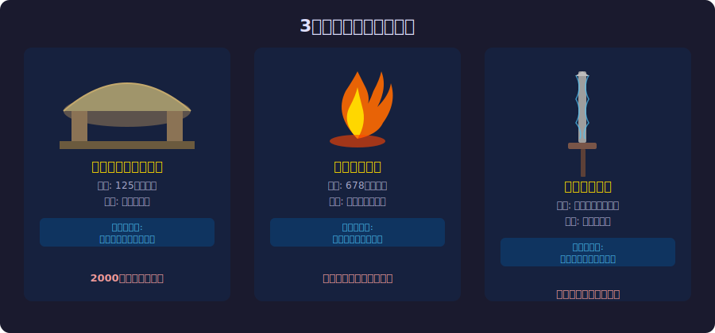

<!-- _class: lead -->
# 失われた技術とレガシーシステム

- ロストテクノロジーが教えるドキュメントの価値
- 
- なぜ優れた技術は消えるのか？

---

# 目次

- - 1. ロストテクノロジーとは何か
- - 2. 歴史的な失われた技術
- - 3. なぜ技術は失われるのか
- - 4. レガシーシステムとの類似性
- - 5. ドキュメントの生存戦略
- - 6. 技術を守るための教訓

---

<!-- _class: lead -->
# ロストテクノロジーとは

---

# 3大ロストテクノロジー

---

# ローマコンクリートの衝撃

- <svg viewBox="0 0 800 290" style="max-height:70vh;max-width:100%;display:block;margin:0 auto;"><rect width="800" height="290" fill="#1a1a2e"/><text x="400" y="30" text-anchor="middle" fill="#f9a825" font-size="14" font-weight="bold">ローマコンクリート vs 現代コンクリート</text><rect x="30" y="50" width="340" height="200" rx="8" fill="#16213e" stroke="#f9a825" stroke-width="2"/><text x="200" y="78" text-anchor="middle" fill="#f9a825" font-size="13" font-weight="bold">ローマコンクリート（125年）</text><text x="200" y="105" text-anchor="middle" fill="#cccccc" font-size="11">パンテオン ドーム: 直径43m</text><text x="200" y="125" text-anchor="middle" fill="#4caf50" font-size="12" font-weight="bold">1900年経った今も健在</text><text x="200" y="148" text-anchor="middle" fill="#cccccc" font-size="11">火山灰の自己修復機能</text><text x="200" y="168" text-anchor="middle" fill="#cccccc" font-size="11">2023年MITが製法を解明</text><text x="200" y="220" text-anchor="middle" fill="#e91e63" font-size="11">製法は1800年間失われていた</text><rect x="430" y="50" width="340" height="200" rx="8" fill="#16213e" stroke="#e91e63" stroke-width="2"/><text x="600" y="78" text-anchor="middle" fill="#e91e63" font-size="13" font-weight="bold">現代コンクリート</text><text x="600" y="105" text-anchor="middle" fill="#cccccc" font-size="11">強度は高い</text><text x="600" y="125" text-anchor="middle" fill="#aaaaaa" font-size="12">50-100年で劣化</text><text x="600" y="148" text-anchor="middle" fill="#cccccc" font-size="11">鉄筋で補強が必要</text><text x="600" y="168" text-anchor="middle" fill="#cccccc" font-size="11">塩害・中性化で弱体化</text><text x="600" y="220" text-anchor="middle" fill="#aaaaaa" font-size="11">製法の記録は充分にある</text><rect x="200" y="265" width="400" height="18" rx="4" fill="#16213e" stroke="#f9a825" stroke-width="1"/><text x="400" y="278" text-anchor="middle" fill="#f9a825" font-size="10">理由: 製法を記録した文書が残っていなかった</text></svg>
- - パンテオンの無筋コンクリートドーム: 直径43m
- - 紀元125年に建設、**1900年経った今も健在**
- - 現代のコンクリートは50-100年で劣化する
- - 2023年にMITが製法を解明: 火山灰の自己修復機能
- - **1800年間、誰も再現できなかった**

---

# 技術喪失の3パターン（1/2）

- <svg viewBox="0 0 800 260" style="max-height:70vh;max-width:100%;display:block;margin:0 auto;"><rect width="800" height="260" fill="#1a1a2e"/><text x="400" y="28" text-anchor="middle" fill="#f9a825" font-size="14" font-weight="bold">技術喪失の3パターン ↔ 現代ソフトウェアの対応</text><rect x="30" y="50" width="340" height="90" rx="6" fill="#16213e" stroke="#e91e63" stroke-width="2"/><text x="200" y="76" text-anchor="middle" fill="#e91e63" font-size="12" font-weight="bold">秘密主義型（ギリシャ火薬）</text><text x="200" y="98" text-anchor="middle" fill="#cccccc" font-size="11">意図的に知識を共有しなかった</text><text x="200" y="128" text-anchor="middle" fill="#aaaaaa" font-size="10">担当者1人しか知らないコード（Bus Factor=1）</text><rect x="430" y="50" width="340" height="90" rx="6" fill="#16213e" stroke="#e91e63" stroke-width="2"/><text x="600" y="76" text-anchor="middle" fill="#e91e63" font-size="12" font-weight="bold">文書喪失型（ローマコンクリート）</text><text x="600" y="98" text-anchor="middle" fill="#cccccc" font-size="11">記録が残っていなかった</text><text x="600" y="128" text-anchor="middle" fill="#aaaaaa" font-size="10">コメントなし・ドキュメントなしのシステム</text><line x1="370" y1="95" x2="430" y2="95" stroke="#888" stroke-width="1" stroke-dasharray="4,2"/><rect x="200" y="175" width="400" height="60" rx="6" fill="#16213e" stroke="#4caf50" stroke-width="2"/><text x="400" y="200" text-anchor="middle" fill="#4caf50" font-size="12" font-weight="bold">共通の解決策</text><text x="400" y="222" text-anchor="middle" fill="#cccccc" font-size="11">知識の共有と文書化 — Bus Factor を1以上に保つ</text></svg>
- - **秘密主義型(ギリシャ火薬)**: 意図的に共有しなかった
-   - → 属人化したコード、Bus Factor = 1
- - **文書喪失型(ローマコンクリート)**: 記録が残っていなかった
-   - → コメントなし、ドキュメントなしのシステム

---

# 技術喪失の3パターン（2/2）

- <svg viewBox="0 0 800 240" style="max-height:70vh;max-width:100%;display:block;margin:0 auto;"><rect width="800" height="240" fill="#1a1a2e"/><text x="400" y="28" text-anchor="middle" fill="#f9a825" font-size="14" font-weight="bold">資源枯渇型：ダマスカス鋼の現代版</text><rect x="30" y="50" width="340" height="90" rx="8" fill="#16213e" stroke="#f9a825" stroke-width="2"/><text x="200" y="76" text-anchor="middle" fill="#f9a825" font-size="13" font-weight="bold">ダマスカス鋼（〜18世紀）</text><text x="200" y="98" text-anchor="middle" fill="#cccccc" font-size="11">特定の鉱床（インド・ウーツ鋼）が必要</text><text x="200" y="118" text-anchor="middle" fill="#cccccc" font-size="11">鉱床が枯渇 → 製法消滅</text><text x="200" y="132" text-anchor="middle" fill="#e91e63" font-size="9">前提条件（材料）が消えた</text><rect x="430" y="50" width="340" height="90" rx="8" fill="#16213e" stroke="#e91e63" stroke-width="2"/><text x="600" y="76" text-anchor="middle" fill="#e91e63" font-size="13" font-weight="bold">現代のソフトウェア版</text><text x="600" y="98" text-anchor="middle" fill="#cccccc" font-size="11">廃止されたライブラリへの依存</text><text x="600" y="118" text-anchor="middle" fill="#cccccc" font-size="11">EOLになったOSが前提のシステム</text><text x="600" y="132" text-anchor="middle" fill="#e91e63" font-size="9">前提条件（環境）が消えた</text><rect x="100" y="168" width="600" height="48" rx="6" fill="#16213e" stroke="#4caf50" stroke-width="2"/><text x="400" y="192" text-anchor="middle" fill="#4caf50" font-size="12" font-weight="bold">3パターン全て現代ソフトウェアで日常的に起きている</text><text x="400" y="208" text-anchor="middle" fill="#aaaaaa" font-size="9">秘密主義型 / 文書喪失型 / 資源枯渇型 — 毎日どこかで発生</text></svg>
- - **資源枯渇型(ダマスカス鋼)**: 前提条件が変わった
-   - → 廃止されたライブラリ、EOLのOS依存
- 
- 3つとも現代のソフトウェアで日常的に起きている

---

<!-- _class: lead -->
# レガシーシステムとの類似性

---

# レガシーの本質

- <svg viewBox="0 0 800 270" style="max-height:70vh;max-width:100%;display:block;margin:0 auto;"><rect width="800" height="270" fill="#1a1a2e"/><text x="400" y="28" text-anchor="middle" fill="#f9a825" font-size="14" font-weight="bold">現代のロストテクノロジー：レガシーコード</text><rect x="30" y="45" width="340" height="100" rx="8" fill="#16213e" stroke="#f9a825" stroke-width="2"/><text x="200" y="72" text-anchor="middle" fill="#f9a825" font-size="12" font-weight="bold">COBOL（1959年〜）</text><text x="200" y="95" text-anchor="middle" fill="#cccccc" font-size="11">世界の金融取引の95%を処理（2024年）</text><text x="200" y="115" text-anchor="middle" fill="#e91e63" font-size="11">開発者の平均年齢: 60歳以上</text><text x="200" y="133" text-anchor="middle" fill="#aaaaaa" font-size="9">知識継承の危機 ← 現代のロストテクノロジー</text><rect x="430" y="45" width="340" height="100" rx="8" fill="#16213e" stroke="#e91e63" stroke-width="2"/><text x="600" y="72" text-anchor="middle" fill="#e91e63" font-size="12" font-weight="bold">Y2K危機の本質</text><text x="600" y="95" text-anchor="middle" fill="#cccccc" font-size="11">技術そのものの問題ではなかった</text><text x="600" y="115" text-anchor="middle" fill="#cccccc" font-size="11">「2桁年号」という設計の</text><text x="600" y="133" text-anchor="middle" fill="#cccccc" font-size="11">知識が失われていた</text><rect x="100" y="170" width="600" height="75" rx="8" fill="#16213e" stroke="#4caf50" stroke-width="2"/><text x="400" y="197" text-anchor="middle" fill="#4caf50" font-size="13" font-weight="bold">「このコード何してるの？」</text><text x="400" y="219" text-anchor="middle" fill="#cccccc" font-size="11">「知ってた人は退職した」</text><text x="400" y="237" text-anchor="middle" fill="#f9a825" font-size="11">動いているが理解されていないシステム = 現代のロストテクノロジー</text></svg>
- - **レガシーコード = 失われた技術の現代版**
- - 「このコード何してるの？」→ 「知ってた人は退職した」
- - COBOL: 2024年時点で世界の金融取引の95%を処理
- - しかしCOBOL開発者の平均年齢は60歳以上

---

# 「動いているから触るな」の危険性

- <svg viewBox="0 0 800 260" style="max-height:70vh;max-width:100%;display:block;margin:0 auto;"><rect width="800" height="260" fill="#1a1a2e"/><text x="400" y="28" text-anchor="middle" fill="#e91e63" font-size="14" font-weight="bold">知識断絶と修復コストの指数的増加</text><line x1="60" y1="220" x2="740" y2="220" stroke="#444" stroke-width="2"/><line x1="60" y1="220" x2="60" y2="40" stroke="#444" stroke-width="2"/><text x="400" y="244" text-anchor="middle" fill="#888" font-size="10">時間（知識が失われる期間）</text><text x="30" y="135" text-anchor="middle" fill="#888" font-size="9" transform="rotate(-90,30,135)">修復コスト</text><polyline points="60,210 150,205 240,195 330,170 420,130 510,75 600,45" fill="none" stroke="#e91e63" stroke-width="3"/><circle cx="60" cy="210" r="5" fill="#4caf50"/><text x="60" y="200" text-anchor="middle" fill="#4caf50" font-size="9">今なら安い</text><circle cx="330" cy="170" r="5" fill="#f9a825"/><text x="330" y="158" text-anchor="middle" fill="#f9a825" font-size="9">中程度</text><circle cx="600" cy="45" r="5" fill="#e91e63"/><text x="600" y="35" text-anchor="middle" fill="#e91e63" font-size="9">手がつけられない</text><rect x="450" y="130" width="260" height="55" rx="6" fill="#16213e" stroke="#f9a825" stroke-width="1"/><text x="580" y="155" text-anchor="middle" fill="#f9a825" font-size="11" font-weight="bold">「触らなければ安全」は幻想</text><text x="580" y="175" text-anchor="middle" fill="#cccccc" font-size="9">脆弱性・依存ライブラリは待ってくれない</text></svg>
- - ローマ帝国崩壊後、水道橋は「動いていた」
-   - しかし修理方法を知る者がいなくなった
-   - 1つの故障が全体の崩壊につながった
- - レガシーシステムも同じ:
-   - 「触らなければ安全」は幻想
-   - 依存ライブラリの脆弱性は待ってくれない
-   - 知識の断絶が進むほど修復コストは指数的に増大

---

<!-- _class: lead -->
# ドキュメントの生存戦略

---

# なぜドキュメントは書かれないのか

- <svg viewBox="0 0 800 260" style="max-height:70vh;max-width:100%;display:block;margin:0 auto;"><rect width="800" height="260" fill="#1a1a2e"/><text x="400" y="28" text-anchor="middle" fill="#e91e63" font-size="14" font-weight="bold">ドキュメントが書かれない4つの理由</text><rect x="30" y="50" width="340" height="70" rx="6" fill="#16213e" stroke="#e91e63" stroke-width="2"/><text x="200" y="75" text-anchor="middle" fill="#e91e63" font-size="12" font-weight="bold">時間がない</text><text x="200" y="95" text-anchor="middle" fill="#cccccc" font-size="10">実装が優先、ドキュメントは後回し</text><rect x="430" y="50" width="340" height="70" rx="6" fill="#16213e" stroke="#e91e63" stroke-width="2"/><text x="600" y="75" text-anchor="middle" fill="#e91e63" font-size="12" font-weight="bold">すぐ陳腐化する</text><text x="600" y="95" text-anchor="middle" fill="#cccccc" font-size="10">コードが変わると嘘になる</text><rect x="30" y="150" width="340" height="70" rx="6" fill="#16213e" stroke="#f9a825" stroke-width="2"/><text x="200" y="175" text-anchor="middle" fill="#f9a825" font-size="12" font-weight="bold">読まれない</text><text x="200" y="195" text-anchor="middle" fill="#cccccc" font-size="10">書いても誰も読まないという体験</text><rect x="430" y="150" width="340" height="70" rx="6" fill="#16213e" stroke="#f9a825" stroke-width="2"/><text x="600" y="175" text-anchor="middle" fill="#f9a825" font-size="12" font-weight="bold">評価されない</text><text x="600" y="195" text-anchor="middle" fill="#cccccc" font-size="10">ドキュメントを書いても昇進しない</text><rect x="150" y="235" width="500" height="18" rx="4" fill="#16213e" stroke="#888" stroke-width="1"/><text x="400" y="248" text-anchor="middle" fill="#aaaaaa" font-size="9">ローマ帝国でも同じ: 「職人は作り方を知っていた。でも書き残さなかった。」</text></svg>
- - **時間がない**: 実装が優先、ドキュメントは後回し
- - **すぐ陳腐化する**: コードが変わるとドキュメントは嘘になる
- - **読まれない**: 書いても誰も読まないという体験
- - **評価されない**: ドキュメントを書いても昇進しない

---

# 生き残るドキュメントの条件

- <svg viewBox="0 0 800 255" style="max-height:70vh;max-width:100%;display:block;margin:0 auto;"><rect width="800" height="255" fill="#1a1a2e"/><text x="400" y="28" text-anchor="middle" fill="#4caf50" font-size="14" font-weight="bold">生き残るドキュメントの5条件</text><rect x="30" y="50" width="220" height="60" rx="6" fill="#16213e" stroke="#4caf50" stroke-width="2"/><text x="140" y="76" text-anchor="middle" fill="#4caf50" font-size="11" font-weight="bold">コードに近い場所</text><text x="140" y="95" text-anchor="middle" fill="#aaaaaa" font-size="9">ADR, コメント, 型定義</text><rect x="290" y="50" width="220" height="60" rx="6" fill="#16213e" stroke="#f9a825" stroke-width="2"/><text x="400" y="76" text-anchor="middle" fill="#f9a825" font-size="11" font-weight="bold">自動的に更新</text><text x="400" y="95" text-anchor="middle" fill="#aaaaaa" font-size="9">OpenAPI spec, 型生成</text><rect x="550" y="50" width="220" height="60" rx="6" fill="#16213e" stroke="#2196f3" stroke-width="2"/><text x="660" y="76" text-anchor="middle" fill="#2196f3" font-size="11" font-weight="bold">Why を記録する</text><text x="660" y="95" text-anchor="middle" fill="#aaaaaa" font-size="9">What はコードが語る</text><rect x="160" y="135" width="220" height="60" rx="6" fill="#16213e" stroke="#e91e63" stroke-width="2"/><text x="270" y="161" text-anchor="middle" fill="#e91e63" font-size="11" font-weight="bold">冗長性がある</text><text x="270" y="180" text-anchor="middle" fill="#aaaaaa" font-size="9">複数箇所に知識が存在</text><rect x="420" y="135" width="220" height="60" rx="6" fill="#16213e" stroke="#ff9800" stroke-width="2"/><text x="530" y="161" text-anchor="middle" fill="#ff9800" font-size="11" font-weight="bold">実用的である</text><text x="530" y="180" text-anchor="middle" fill="#aaaaaa" font-size="9">今すぐ使える情報</text><rect x="100" y="218" width="600" height="28" rx="4" fill="#16213e" stroke="#888" stroke-width="1"/><text x="400" y="237" text-anchor="middle" fill="#aaaaaa" font-size="9">死海文書が2000年生き残った理由: 乾燥した洞窟（= 変更されない場所）に保管</text></svg>
- - **コードに近い場所にある**: ADR, コメント, 型定義
- - **自動的に更新される**: OpenAPI spec, 型生成ドキュメント
- - **なぜ(Why)を記録する**: 何(What)はコードが語る
- - **冗長性がある**: 複数箇所に同じ知識が存在する
- - **実用的である**: 読者が今すぐ使える情報

---

<!-- _class: lead -->
# 技術を守るための教訓

---

# 歴史が教える5つの教訓

- <svg viewBox="0 0 800 260" style="max-height:70vh;max-width:100%;display:block;margin:0 auto;"><rect width="800" height="260" fill="#1a1a2e"/><text x="400" y="28" text-anchor="middle" fill="#4caf50" font-size="14" font-weight="bold">歴史が教える5つの教訓</text><rect x="30" y="48" width="220" height="60" rx="6" fill="#16213e" stroke="#4caf50" stroke-width="2"/><text x="140" y="72" text-anchor="middle" fill="#4caf50" font-size="11" font-weight="bold">1. Bus Factor &gt; 1</text><text x="140" y="92" text-anchor="middle" fill="#cccccc" font-size="10">知識を1人に依存させない</text><rect x="290" y="48" width="220" height="60" rx="6" fill="#16213e" stroke="#f9a825" stroke-width="2"/><text x="400" y="72" text-anchor="middle" fill="#f9a825" font-size="11" font-weight="bold">2. Write it down</text><text x="400" y="92" text-anchor="middle" fill="#cccccc" font-size="10">暗黙知を形式知に変換する</text><rect x="550" y="48" width="220" height="60" rx="6" fill="#16213e" stroke="#2196f3" stroke-width="2"/><text x="660" y="72" text-anchor="middle" fill="#2196f3" font-size="11" font-weight="bold">3. Living docs</text><text x="660" y="92" text-anchor="middle" fill="#cccccc" font-size="10">コードと共に進化させる</text><rect x="160" y="138" width="220" height="60" rx="6" fill="#16213e" stroke="#e91e63" stroke-width="2"/><text x="270" y="162" text-anchor="middle" fill="#e91e63" font-size="11" font-weight="bold">4. Redundancy</text><text x="270" y="182" text-anchor="middle" fill="#cccccc" font-size="10">知識の冗長性を確保する</text><rect x="420" y="138" width="220" height="60" rx="6" fill="#16213e" stroke="#ff9800" stroke-width="2"/><text x="530" y="162" text-anchor="middle" fill="#ff9800" font-size="11" font-weight="bold">5. Succession plan</text><text x="530" y="182" text-anchor="middle" fill="#cccccc" font-size="10">技術継承を計画的に行う</text><rect x="100" y="218" width="600" height="30" rx="6" fill="#16213e" stroke="#f9a825" stroke-width="1"/><text x="400" y="238" text-anchor="middle" fill="#f9a825" font-size="11">ドキュメントは贅沢品ではなく生存戦略</text></svg>
- - **1. Bus Factor > 1**: 知識を1人に依存させない
- - **2. Write it down**: 暗黙知を形式知に変換する
- - **3. Living documentation**: コードと共に進化するドキュメント
- - **4. Redundancy**: 知識の冗長性を確保する
- - **5. Succession planning**: 技術継承を計画的に行う

---

# まとめ

- - 歴史上最も優れた技術ですら、記録がなければ消える
- - レガシーシステムは現代のロストテクノロジー
- - 「動いているから触るな」は技術喪失への最短経路
- - ドキュメントは贅沢品ではなく生存戦略
- 
- **「我々は、次の世代が読めるように書かなければならない。」**

---

# 参考文献

- - **History & Science:**
- - [MIT Research on Roman Concrete (2023)](https://news.mit.edu/2023/roman-concrete-durability-secret-ingredient-0106)
- - [Lost Technologies - Wikipedia](https://en.wikipedia.org/wiki/Lost_technology)
- - **Software Engineering:**
- - [Working Effectively with Legacy Code - Michael Feathers (2004)](https://www.oreilly.com/library/view/working-effectively-with/0131177052/)
- - [Architecture Decision Records](https://adr.github.io/)

