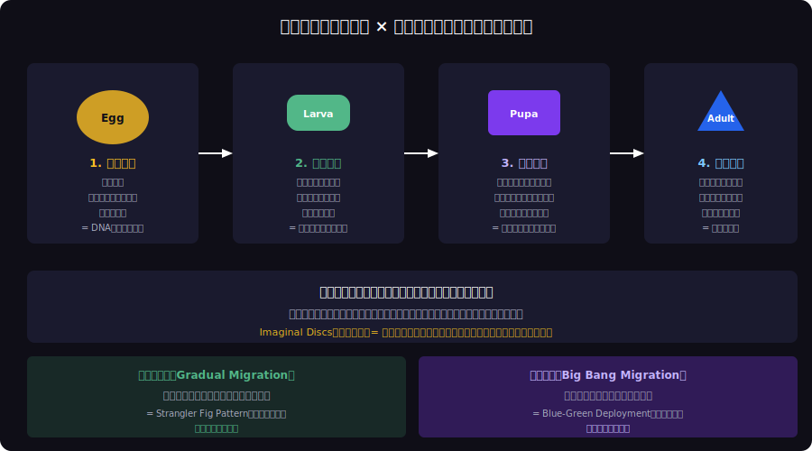
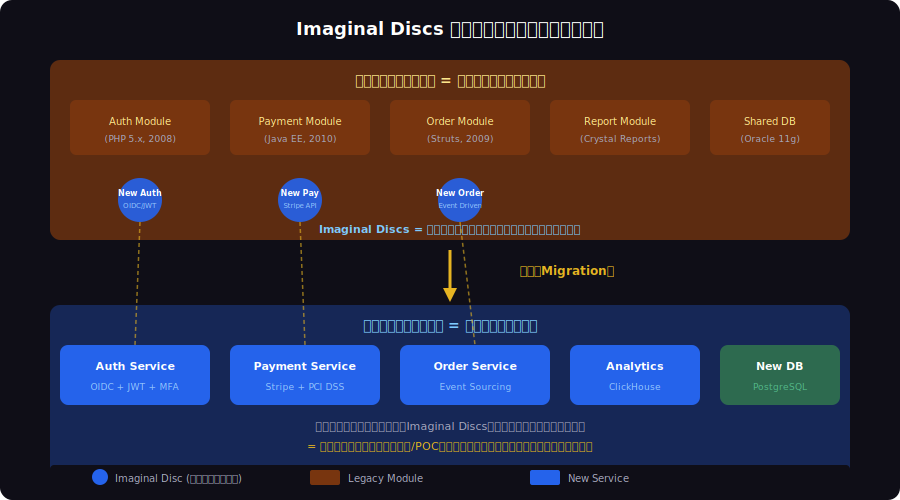
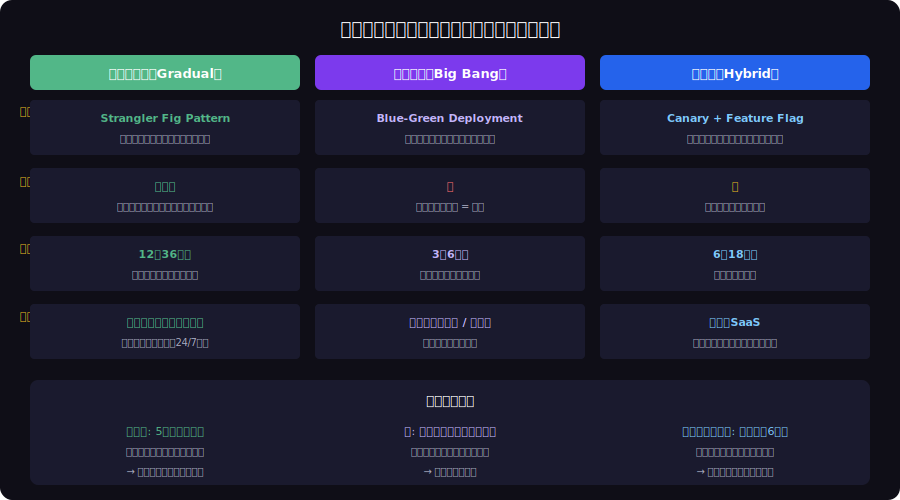

<!-- _class: lead -->
# 完全変態：昆虫のメタモルフォーゼに学ぶソフトウェアマイグレーション

- Metamorphosis × Software Migration
- 
- 蛹の中で全てが溶解し再構築される — それはリプレースと同じ


---

# Agenda

> *変態の6ステージでレガシーマイグレーション戦略を体系化*

- - 1. 完全変態とは何か
- - 2. 4ステージモデル：卵→幼虫→蛹→成虫
- - 3. Imaginal Discs パターン
- - 4. 不完全変態 vs 完全変態 vs 過変態
- - 5. マイグレーション戦略の選択基準
- - 6. 実践：変態を成功させるための教訓


---

<!-- _class: lead -->
# 完全変態とは何か

![w:800 center](data:image/svg+xml;base64,PHN2ZyB2aWV3Qm94PSIwIDAgODAwIDQwMCIgc3R5bGU9Im1heC1oZWlnaHQ6NzB2aDt3aWR0aDphdXRvO2Rpc3BsYXk6YmxvY2s7bWFyZ2luOjAgYXV0bztsZXR0ZXItc3BhY2luZzowIiB4bWxucz0iaHR0cDovL3d3dy53My5vcmcvMjAwMC9zdmciPgogIDxyZWN0IHdpZHRoPSI4MDAiIGhlaWdodD0iNDAwIiBmaWxsPSIjMWExYTJlIi8+CiAgPHRleHQgeD0iNDAwIiB5PSIyOCIgdGV4dC1hbmNob3I9Im1pZGRsZSIgZmlsbD0iI2ZmZmZmZiIgZm9udC1zaXplPSIxNiIgZm9udC13ZWlnaHQ9ImJvbGQiIGZvbnQtZmFtaWx5PSJzYW5zLXNlcmlmIj7lrozlhajlpInmhYvjga4044K544OG44O844K4IHZzIOOCveODleODiOOCpuOCp+OCouODnuOCpOOCsOODrOODvOOCt+ODp+ODszwvdGV4dD4KICA8IS0tIEJpb2xvZ2ljYWwgc3RhZ2VzIHRvcCAtLT4KICA8dGV4dCB4PSI0MDAiIHk9IjU4IiB0ZXh0LWFuY2hvcj0ibWlkZGxlIiBmaWxsPSIjZjlhODI1IiBmb250LXNpemU9IjEyIiBmb250LXdlaWdodD0iYm9sZCIgZm9udC1mYW1pbHk9InNhbnMtc2VyaWYiPueUn+eJqeWtpueahOWkieaFizwvdGV4dD4KICA8cmVjdCB4PSI2MCIgeT0iNzAiIHdpZHRoPSIxNDUiIGhlaWdodD0iODUiIHJ4PSI4IiBmaWxsPSIjMTYyMTNlIiBzdHJva2U9IiNmOWE4MjUiIHN0cm9rZS13aWR0aD0iMiIvPgogICAgPHRleHQgeD0iMTMyIiB5PSI5MiIgdGV4dC1hbmNob3I9Im1pZGRsZSIgZmlsbD0iI2Y5YTgyNSIgZm9udC1zaXplPSIxMyIgZm9udC13ZWlnaHQ9ImJvbGQiIGZvbnQtZmFtaWx5PSJzYW5zLXNlcmlmIj7ljbU8L3RleHQ+PHRleHQgeD0iMTMyIiB5PSIxMTAiIHRleHQtYW5jaG9yPSJtaWRkbGUiIGZpbGw9IiNmOWE4MjUiIGZvbnQtc2l6ZT0iMTAiIGZvbnQtd2VpZ2h0PSJub3JtYWwiIGZvbnQtZmFtaWx5PSJzYW5zLXNlcmlmIj5FZ2c8L3RleHQ+CiAgICA8dGV4dCB4PSIxMzIiIHk9IjEyOCIgdGV4dC1hbmNob3I9Im1pZGRsZSIgZmlsbD0iI2FhYWFhYSIgZm9udC1zaXplPSI5IiBmb250LWZhbWlseT0ic2Fucy1zZXJpZiI+5r2c5Zyo6IO95Yqb44KSPC90ZXh0Pjx0ZXh0IHg9IjEzMiIgeT0iMTQyIiB0ZXh0LWFuY2hvcj0ibWlkZGxlIiBmaWxsPSIjYWFhYWFhIiBmb250LXNpemU9IjkiIGZvbnQtZmFtaWx5PSJzYW5zLXNlcmlmIj7np5jjgoHjgZ/ljp/lp4vnirbmhYs8L3RleHQ+CiAgICA8cG9seWdvbiBwb2ludHM9IjIwNSwxMTIgMjE4LDEwNiAyMTgsMTE4IiBmaWxsPSIjZjlhODI1Ii8+PHJlY3QgeD0iMjM1IiB5PSI3MCIgd2lkdGg9IjE0NSIgaGVpZ2h0PSI4NSIgcng9IjgiIGZpbGw9IiMxNjIxM2UiIHN0cm9rZT0iI2Y5YTgyNSIgc3Ryb2tlLXdpZHRoPSIyIi8+CiAgICA8dGV4dCB4PSIzMDciIHk9IjkyIiB0ZXh0LWFuY2hvcj0ibWlkZGxlIiBmaWxsPSIjZjlhODI1IiBmb250LXNpemU9IjEzIiBmb250LXdlaWdodD0iYm9sZCIgZm9udC1mYW1pbHk9InNhbnMtc2VyaWYiPuW5vOiZqzwvdGV4dD48dGV4dCB4PSIzMDciIHk9IjExMCIgdGV4dC1hbmNob3I9Im1pZGRsZSIgZmlsbD0iI2Y5YTgyNSIgZm9udC1zaXplPSIxMCIgZm9udC13ZWlnaHQ9Im5vcm1hbCIgZm9udC1mYW1pbHk9InNhbnMtc2VyaWYiPkxhcnZhPC90ZXh0PgogICAgPHRleHQgeD0iMzA3IiB5PSIxMjgiIHRleHQtYW5jaG9yPSJtaWRkbGUiIGZpbGw9IiNhYWFhYWEiIGZvbnQtc2l6ZT0iOSIgZm9udC1mYW1pbHk9InNhbnMtc2VyaWYiPuePvuihjOOCt+OCueODhuODoDwvdGV4dD48dGV4dCB4PSIzMDciIHk9IjE0MiIgdGV4dC1hbmNob3I9Im1pZGRsZSIgZmlsbD0iI2FhYWFhYSIgZm9udC1zaXplPSI5IiBmb250LWZhbWlseT0ic2Fucy1zZXJpZiI+5qmf6IO944Gv44GZ44KL44GM6YeN44GEPC90ZXh0PgogICAgPHBvbHlnb24gcG9pbnRzPSIzODAsMTEyIDM5MywxMDYgMzkzLDExOCIgZmlsbD0iI2Y5YTgyNSIvPjxyZWN0IHg9IjQxMCIgeT0iNzAiIHdpZHRoPSIxNDUiIGhlaWdodD0iODUiIHJ4PSI4IiBmaWxsPSIjMTYyMTNlIiBzdHJva2U9IiNmOWE4MjUiIHN0cm9rZS13aWR0aD0iMiIvPgogICAgPHRleHQgeD0iNDgyIiB5PSI5MiIgdGV4dC1hbmNob3I9Im1pZGRsZSIgZmlsbD0iI2Y5YTgyNSIgZm9udC1zaXplPSIxMyIgZm9udC13ZWlnaHQ9ImJvbGQiIGZvbnQtZmFtaWx5PSJzYW5zLXNlcmlmIj7om7k8L3RleHQ+PHRleHQgeD0iNDgyIiB5PSIxMTAiIHRleHQtYW5jaG9yPSJtaWRkbGUiIGZpbGw9IiNmOWE4MjUiIGZvbnQtc2l6ZT0iMTAiIGZvbnQtd2VpZ2h0PSJub3JtYWwiIGZvbnQtZmFtaWx5PSJzYW5zLXNlcmlmIj5QdXBhPC90ZXh0PgogICAgPHRleHQgeD0iNDgyIiB5PSIxMjgiIHRleHQtYW5jaG9yPSJtaWRkbGUiIGZpbGw9IiNhYWFhYWEiIGZvbnQtc2l6ZT0iOSIgZm9udC1mYW1pbHk9InNhbnMtc2VyaWYiPuenu+ihjOacnzwvdGV4dD48dGV4dCB4PSI0ODIiIHk9IjE0MiIgdGV4dC1hbmNob3I9Im1pZGRsZSIgZmlsbD0iI2FhYWFhYSIgZm9udC1zaXplPSI5IiBmb250LWZhbWlseT0ic2Fucy1zZXJpZiI+5aSW44GL44KJ44Gv5LiN5rS755m644Gr6KaL44GI44KLPC90ZXh0PgogICAgPHBvbHlnb24gcG9pbnRzPSI1NTUsMTEyIDU2OCwxMDYgNTY4LDExOCIgZmlsbD0iI2Y5YTgyNSIvPjxyZWN0IHg9IjU4NSIgeT0iNzAiIHdpZHRoPSIxNDUiIGhlaWdodD0iODUiIHJ4PSI4IiBmaWxsPSIjMTYyMTNlIiBzdHJva2U9IiNmOWE4MjUiIHN0cm9rZS13aWR0aD0iMiIvPgogICAgPHRleHQgeD0iNjU3IiB5PSI5MiIgdGV4dC1hbmNob3I9Im1pZGRsZSIgZmlsbD0iI2Y5YTgyNSIgZm9udC1zaXplPSIxMyIgZm9udC13ZWlnaHQ9ImJvbGQiIGZvbnQtZmFtaWx5PSJzYW5zLXNlcmlmIj7miJDomas8L3RleHQ+PHRleHQgeD0iNjU3IiB5PSIxMTAiIHRleHQtYW5jaG9yPSJtaWRkbGUiIGZpbGw9IiNmOWE4MjUiIGZvbnQtc2l6ZT0iMTAiIGZvbnQtd2VpZ2h0PSJub3JtYWwiIGZvbnQtZmFtaWx5PSJzYW5zLXNlcmlmIj5BZHVsdDwvdGV4dD4KICAgIDx0ZXh0IHg9IjY1NyIgeT0iMTI4IiB0ZXh0LWFuY2hvcj0ibWlkZGxlIiBmaWxsPSIjYWFhYWFhIiBmb250LXNpemU9IjkiIGZvbnQtZmFtaWx5PSJzYW5zLXNlcmlmIj7mlrDjgrfjgrnjg4bjg6A8L3RleHQ+PHRleHQgeD0iNjU3IiB5PSIxNDIiIHRleHQtYW5jaG9yPSJtaWRkbGUiIGZpbGw9IiNhYWFhYWEiIGZvbnQtc2l6ZT0iOSIgZm9udC1mYW1pbHk9InNhbnMtc2VyaWYiPuWujOWFqOOBquiDveWKm+OCkueZuuaPrjwvdGV4dD4KICAgIAogIDwhLS0gU29mdHdhcmUgc3RhZ2VzIGJvdHRvbSAtLT4KICA8dGV4dCB4PSI0MDAiIHk9IjE5NSIgdGV4dC1hbmNob3I9Im1pZGRsZSIgZmlsbD0iI2U5MWU2MyIgZm9udC1zaXplPSIxMiIgZm9udC13ZWlnaHQ9ImJvbGQiIGZvbnQtZmFtaWx5PSJzYW5zLXNlcmlmIj7jgr3jg5Xjg4jjgqbjgqfjgqLlr77lv5w8L3RleHQ+CiAgPHJlY3QgeD0iNjAiIHk9IjIxMCIgd2lkdGg9IjE0NSIgaGVpZ2h0PSI4NSIgcng9IjgiIGZpbGw9IiMxNjIxM2UiIHN0cm9rZT0iI2U5MWU2MyIgc3Ryb2tlLXdpZHRoPSIyIi8+CiAgICA8dGV4dCB4PSIxMzIiIHk9IjIzMiIgdGV4dC1hbmNob3I9Im1pZGRsZSIgZmlsbD0iI2U5MWU2MyIgZm9udC1zaXplPSIxMiIgZm9udC13ZWlnaHQ9ImJvbGQiIGZvbnQtZmFtaWx5PSJzYW5zLXNlcmlmIj7nj77nirbliIbmnpA8L3RleHQ+PHRleHQgeD0iMTMyIiB5PSIyNTAiIHRleHQtYW5jaG9yPSJtaWRkbGUiIGZpbGw9IiNlOTFlNjMiIGZvbnQtc2l6ZT0iMTAiIGZvbnQtd2VpZ2h0PSJub3JtYWwiIGZvbnQtZmFtaWx5PSJzYW5zLXNlcmlmIj5Bc3Nlc3NtZW50PC90ZXh0PgogICAgPHRleHQgeD0iMTMyIiB5PSIyNjgiIHRleHQtYW5jaG9yPSJtaWRkbGUiIGZpbGw9IiNhYWFhYWEiIGZvbnQtc2l6ZT0iOSIgZm9udC1mYW1pbHk9InNhbnMtc2VyaWYiPuS+neWtmOmWouS/guODnuODg+ODlzwvdGV4dD48dGV4dCB4PSIxMzIiIHk9IjI4MiIgdGV4dC1hbmNob3I9Im1pZGRsZSIgZmlsbD0iI2FhYWFhYSIgZm9udC1zaXplPSI5IiBmb250LWZhbWlseT0ic2Fucy1zZXJpZiI+44OI44Op44OV44Kj44OD44Kv6KiI5risPC90ZXh0PgogICAgPHBvbHlnb24gcG9pbnRzPSIyMDUsMjUyIDIxOCwyNDYgMjE4LDI1OCIgZmlsbD0iI2U5MWU2MyIvPjxyZWN0IHg9IjIzNSIgeT0iMjEwIiB3aWR0aD0iMTQ1IiBoZWlnaHQ9Ijg1IiByeD0iOCIgZmlsbD0iIzE2MjEzZSIgc3Ryb2tlPSIjZTkxZTYzIiBzdHJva2Utd2lkdGg9IjIiLz4KICAgIDx0ZXh0IHg9IjMwNyIgeT0iMjMyIiB0ZXh0LWFuY2hvcj0ibWlkZGxlIiBmaWxsPSIjZTkxZTYzIiBmb250LXNpemU9IjEyIiBmb250LXdlaWdodD0iYm9sZCIgZm9udC1mYW1pbHk9InNhbnMtc2VyaWYiPuS4puihjOeovOWDjTwvdGV4dD48dGV4dCB4PSIzMDciIHk9IjI1MCIgdGV4dC1hbmNob3I9Im1pZGRsZSIgZmlsbD0iI2U5MWU2MyIgZm9udC1zaXplPSIxMCIgZm9udC13ZWlnaHQ9Im5vcm1hbCIgZm9udC1mYW1pbHk9InNhbnMtc2VyaWYiPlN0cmFuZ2xlcjwvdGV4dD4KICAgIDx0ZXh0IHg9IjMwNyIgeT0iMjY4IiB0ZXh0LWFuY2hvcj0ibWlkZGxlIiBmaWxsPSIjYWFhYWFhIiBmb250LXNpemU9IjkiIGZvbnQtZmFtaWx5PSJzYW5zLXNlcmlmIj7ml6fmlrDjgrfjgrnjg4bjg6DjgYw8L3RleHQ+PHRleHQgeD0iMzA3IiB5PSIyODIiIHRleHQtYW5jaG9yPSJtaWRkbGUiIGZpbGw9IiNhYWFhYWEiIGZvbnQtc2l6ZT0iOSIgZm9udC1mYW1pbHk9InNhbnMtc2VyaWYiPuWFseWtmOOBmeOCi+mBjua4oeacnzwvdGV4dD4KICAgIDxwb2x5Z29uIHBvaW50cz0iMzgwLDI1MiAzOTMsMjQ2IDM5MywyNTgiIGZpbGw9IiNlOTFlNjMiLz48cmVjdCB4PSI0MTAiIHk9IjIxMCIgd2lkdGg9IjE0NSIgaGVpZ2h0PSI4NSIgcng9IjgiIGZpbGw9IiMxNjIxM2UiIHN0cm9rZT0iI2U5MWU2MyIgc3Ryb2tlLXdpZHRoPSIyIi8+CiAgICA8dGV4dCB4PSI0ODIiIHk9IjIzMiIgdGV4dC1hbmNob3I9Im1pZGRsZSIgZmlsbD0iI2U5MWU2MyIgZm9udC1zaXplPSIxMiIgZm9udC13ZWlnaHQ9ImJvbGQiIGZvbnQtZmFtaWx5PSJzYW5zLXNlcmlmIj7jgqvjg4Pjg4jjgqrjg7zjg5Djg7w8L3RleHQ+PHRleHQgeD0iNDgyIiB5PSIyNTAiIHRleHQtYW5jaG9yPSJtaWRkbGUiIGZpbGw9IiNlOTFlNjMiIGZvbnQtc2l6ZT0iMTAiIGZvbnQtd2VpZ2h0PSJub3JtYWwiIGZvbnQtZmFtaWx5PSJzYW5zLXNlcmlmIj5DdXRvdmVyPC90ZXh0PgogICAgPHRleHQgeD0iNDgyIiB5PSIyNjgiIHRleHQtYW5jaG9yPSJtaWRkbGUiIGZpbGw9IiNhYWFhYWEiIGZvbnQtc2l6ZT0iOSIgZm9udC1mYW1pbHk9InNhbnMtc2VyaWYiPkltYWdpbmFsIERpc2Nz44GnPC90ZXh0Pjx0ZXh0IHg9IjQ4MiIgeT0iMjgyIiB0ZXh0LWFuY2hvcj0ibWlkZGxlIiBmaWxsPSIjYWFhYWFhIiBmb250LXNpemU9IjkiIGZvbnQtZmFtaWx5PSJzYW5zLXNlcmlmIj7mrrXpmo7nmoTnp7vooYw8L3RleHQ+CiAgICA8cG9seWdvbiBwb2ludHM9IjU1NSwyNTIgNTY4LDI0NiA1NjgsMjU4IiBmaWxsPSIjZTkxZTYzIi8+PHJlY3QgeD0iNTg1IiB5PSIyMTAiIHdpZHRoPSIxNDUiIGhlaWdodD0iODUiIHJ4PSI4IiBmaWxsPSIjMTYyMTNlIiBzdHJva2U9IiNlOTFlNjMiIHN0cm9rZS13aWR0aD0iMiIvPgogICAgPHRleHQgeD0iNjU3IiB5PSIyMzIiIHRleHQtYW5jaG9yPSJtaWRkbGUiIGZpbGw9IiNlOTFlNjMiIGZvbnQtc2l6ZT0iMTIiIGZvbnQtd2VpZ2h0PSJib2xkIiBmb250LWZhbWlseT0ic2Fucy1zZXJpZiI+5paw44K344K544OG44OgPC90ZXh0Pjx0ZXh0IHg9IjY1NyIgeT0iMjUwIiB0ZXh0LWFuY2hvcj0ibWlkZGxlIiBmaWxsPSIjZTkxZTYzIiBmb250LXNpemU9IjEwIiBmb250LXdlaWdodD0ibm9ybWFsIiBmb250LWZhbWlseT0ic2Fucy1zZXJpZiI+TW9kZXJuPC90ZXh0PgogICAgPHRleHQgeD0iNjU3IiB5PSIyNjgiIHRleHQtYW5jaG9yPSJtaWRkbGUiIGZpbGw9IiNhYWFhYWEiIGZvbnQtc2l6ZT0iOSIgZm9udC1mYW1pbHk9InNhbnMtc2VyaWYiPuOCueOCseODvOODqeODluODq+OBpzwvdGV4dD48dGV4dCB4PSI2NTciIHk9IjI4MiIgdGV4dC1hbmNob3I9Im1pZGRsZSIgZmlsbD0iI2FhYWFhYSIgZm9udC1zaXplPSI5IiBmb250LWZhbWlseT0ic2Fucy1zZXJpZiI+5L+d5a6I5oCn44GM6auY44GEPC90ZXh0PgogICAgCiAgPCEtLSBNYXBwaW5nIGxpbmVzIC0tPgogIDxsaW5lIHgxPSIxMzIiIHkxPSIxNTUiIHgyPSIxMzIiIHkyPSIyMTAiIHN0cm9rZT0iIzU1NTU3NyIgc3Ryb2tlLXdpZHRoPSIxIiBzdHJva2UtZGFzaGFycmF5PSI0LDMiLz48bGluZSB4MT0iMzA3IiB5MT0iMTU1IiB4Mj0iMzA3IiB5Mj0iMjEwIiBzdHJva2U9IiM1NTU1NzciIHN0cm9rZS13aWR0aD0iMSIgc3Ryb2tlLWRhc2hhcnJheT0iNCwzIi8+PGxpbmUgeDE9IjQ4MiIgeTE9IjE1NSIgeDI9IjQ4MiIgeTI9IjIxMCIgc3Ryb2tlPSIjNTU1NTc3IiBzdHJva2Utd2lkdGg9IjEiIHN0cm9rZS1kYXNoYXJyYXk9IjQsMyIvPjxsaW5lIHgxPSI2NTciIHkxPSIxNTUiIHgyPSI2NTciIHkyPSIyMTAiIHN0cm9rZT0iIzU1NTU3NyIgc3Ryb2tlLXdpZHRoPSIxIiBzdHJva2UtZGFzaGFycmF5PSI0LDMiLz4KICA8dGV4dCB4PSI0MDAiIHk9IjMzNSIgdGV4dC1hbmNob3I9Im1pZGRsZSIgZmlsbD0iI2Y5YTgyNSIgZm9udC1zaXplPSIxMSIgZm9udC1mYW1pbHk9InNhbnMtc2VyaWYiPuiHqueEtueVjOOBrjTlhITlubTjga7oqabooYzpjK/oqqTjgYzjg57jgqTjgrDjg6zjg7zjgrfjg6fjg7PmiKbnlaXjgpLmlZnjgYjjgos8L3RleHQ+Cjwvc3ZnPg==)
- Chapter 1: What is Complete Metamorphosis?


---

# 完全変態（Holometaboly）の驚異

> *蛹の内部は溶解し再構成—破壊なき移行は存在しない*

![w:800 center](data:image/svg+xml;base64,PHN2ZyB2aWV3Qm94PSIwIDAgODAwIDQwMCIgc3R5bGU9Im1heC1oZWlnaHQ6NzB2aDt3aWR0aDphdXRvO2Rpc3BsYXk6YmxvY2s7bWFyZ2luOjAgYXV0bztsZXR0ZXItc3BhY2luZzowIiB4bWxucz0iaHR0cDovL3d3dy53My5vcmcvMjAwMC9zdmciPgogIDxyZWN0IHdpZHRoPSI4MDAiIGhlaWdodD0iNDAwIiBmaWxsPSIjMWExYTJlIi8+CiAgPHRleHQgeD0iNDAwIiB5PSIyOCIgdGV4dC1hbmNob3I9Im1pZGRsZSIgZmlsbD0iI2ZmZmZmZiIgZm9udC1zaXplPSIxNiIgZm9udC13ZWlnaHQ9ImJvbGQiIGZvbnQtZmFtaWx5PSJzYW5zLXNlcmlmIj7lrozlhajlpInmhYvvvIhIb2xvbWV0YWJvbHnvvInvvJoz5YSE5bm044Gu6YCy5YyW55qE5oiQ5YqfPC90ZXh0PgogIDwhLS0gUGllIGNoYXJ0OiA4MCUgY29tcGxldGUgbWV0YW1vcnBob3NpcyAtLT4KICA8Y2lyY2xlIGN4PSIyMDAiIGN5PSIyMjAiIHI9IjEyMCIgZmlsbD0iIzE2MjEzZSIvPgogIDwhLS0gODAlIGFyYzogMC44ICogMipwaSA9IDQuNTIgcmFkLiBTdGFydCBhdCB0b3AgKC1waS8yKSwgZ28gY2xvY2t3aXNlIC0tPgogIDwhLS0gU1ZHIGFyYzogbGFyZ2UtYXJjLWZsYWc9MSBmb3IgPiAxODAgZGVnID0gMC44ID0gMjg4IGRlZ3JlZXMgPiAxODAgc28gZmxhZz0xIC0tPgogIDwhLS0gRW5kIHBvaW50IGF0IDI4OCBkZWcgZnJvbSB0b3A6IHg9MjAwKzEyMCpzaW4oMjg4KnBpLzE4MCksIHk9MjIwLTEyMCpjb3MoMjg4KnBpLzE4MCkgLS0+CiAgPCEtLSAyODggZGVnID0gLTcyIGRlZyBmcm9tIHRvcC4gc2luKC03Mik9LTAuOTUxLCBjb3MoLTcyKT0wLjMwOSAtLT4KICA8cGF0aCBkPSJNMjAwLDEwMCBBMTIwLDEyMCAwIDEsMSAxODUuOSwzMzIuOCBaIiBmaWxsPSIjZjlhODI1IiBvcGFjaXR5PSIwLjg1Ii8+CiAgPHBhdGggZD0iTTIwMCwxMDAgQTEyMCwxMjAgMCAwLDAgMTg1LjksMzMyLjggWiIgZmlsbD0iIzE2MjEzZSIgc3Ryb2tlPSIjZjlhODI1IiBzdHJva2Utd2lkdGg9IjEiLz4KICA8dGV4dCB4PSIyMDAiIHk9IjIwMCIgdGV4dC1hbmNob3I9Im1pZGRsZSIgZmlsbD0iIzFhMWEyZSIgZm9udC1zaXplPSIyOCIgZm9udC13ZWlnaHQ9ImJvbGQiIGZvbnQtZmFtaWx5PSJzYW5zLXNlcmlmIj44MCU8L3RleHQ+CiAgPHRleHQgeD0iMjAwIiB5PSIyMjUiIHRleHQtYW5jaG9yPSJtaWRkbGUiIGZpbGw9IiMxYTFhMmUiIGZvbnQtc2l6ZT0iMTIiIGZvbnQtZmFtaWx5PSJzYW5zLXNlcmlmIj7lrozlhajlpInmhYs8L3RleHQ+CiAgPHRleHQgeD0iMjAwIiB5PSIzNDgiIHRleHQtYW5jaG9yPSJtaWRkbGUiIGZpbGw9IiNhYWFhYWEiIGZvbnQtc2l6ZT0iMTEiIGZvbnQtZmFtaWx5PSJzYW5zLXNlcmlmIj7mmIbomavlhajnqK7jga44MCXjgYzlrozlhajlpInmhYs8L3RleHQ+CiAgPCEtLSBFeGFtcGxlcyBvbiByaWdodCAtLT4KICA8dGV4dCB4PSI1MjAiIHk9IjYwIiB0ZXh0LWFuY2hvcj0ibWlkZGxlIiBmaWxsPSIjZjlhODI1IiBmb250LXNpemU9IjEzIiBmb250LXdlaWdodD0iYm9sZCIgZm9udC1mYW1pbHk9InNhbnMtc2VyaWYiPuWujOWFqOWkieaFi+OBmeOCi+aYhuiZqzwvdGV4dD4KICA8cmVjdCB4PSIzODAiIHk9Ijg1IiB3aWR0aD0iMzgwIiBoZWlnaHQ9IjUwIiByeD0iOCIgZmlsbD0iIzE2MjEzZSIgc3Ryb2tlPSIjZjlhODI1IiBzdHJva2Utd2lkdGg9IjEuNSIvPgogICAgPHRleHQgeD0iNTcwIiB5PSIxMDciIHRleHQtYW5jaG9yPSJtaWRkbGUiIGZpbGw9IiNmOWE4MjUiIGZvbnQtc2l6ZT0iMTIiIGZvbnQtZmFtaWx5PSJzYW5zLXNlcmlmIj7nlLLomasgKENvbGVvcHRlcmEpPC90ZXh0PgogICAgPHRleHQgeD0iNTcwIiB5PSIxMjUiIHRleHQtYW5jaG9yPSJtaWRkbGUiIGZpbGw9IiNhYWFhYWEiIGZvbnQtc2l6ZT0iMTAiIGZvbnQtZmFtaWx5PSJzYW5zLXNlcmlmIj7mnIDlpKfjga7nm67vvJo0MOS4h+eoruS7peS4ijwvdGV4dD48cmVjdCB4PSIzODAiIHk9IjE0NyIgd2lkdGg9IjM4MCIgaGVpZ2h0PSI1MCIgcng9IjgiIGZpbGw9IiMxNjIxM2UiIHN0cm9rZT0iI2Y5YTgyNSIgc3Ryb2tlLXdpZHRoPSIxLjUiLz4KICAgIDx0ZXh0IHg9IjU3MCIgeT0iMTY5IiB0ZXh0LWFuY2hvcj0ibWlkZGxlIiBmaWxsPSIjZjlhODI1IiBmb250LXNpemU9IjEyIiBmb250LWZhbWlseT0ic2Fucy1zZXJpZiI+6J2244O76Ju+IChMZXBpZG9wdGVyYSk8L3RleHQ+CiAgICA8dGV4dCB4PSI1NzAiIHk9IjE4NyIgdGV4dC1hbmNob3I9Im1pZGRsZSIgZmlsbD0iI2FhYWFhYSIgZm9udC1zaXplPSIxMCIgZm9udC1mYW1pbHk9InNhbnMtc2VyaWYiPuW5vOiZq+KGkuibueKGkuaIkOiZq+OBruWujOWFqOWkieWuuTwvdGV4dD48cmVjdCB4PSIzODAiIHk9IjIwOSIgd2lkdGg9IjM4MCIgaGVpZ2h0PSI1MCIgcng9IjgiIGZpbGw9IiMxNjIxM2UiIHN0cm9rZT0iI2Y5YTgyNSIgc3Ryb2tlLXdpZHRoPSIxLjUiLz4KICAgIDx0ZXh0IHg9IjU3MCIgeT0iMjMxIiB0ZXh0LWFuY2hvcj0ibWlkZGxlIiBmaWxsPSIjZjlhODI1IiBmb250LXNpemU9IjEyIiBmb250LWZhbWlseT0ic2Fucy1zZXJpZiI+6JyC44O76J+7IChIeW1lbm9wdGVyYSk8L3RleHQ+CiAgICA8dGV4dCB4PSI1NzAiIHk9IjI0OSIgdGV4dC1hbmNob3I9Im1pZGRsZSIgZmlsbD0iI2FhYWFhYSIgZm9udC1zaXplPSIxMCIgZm9udC1mYW1pbHk9InNhbnMtc2VyaWYiPuekvuS8muaAp+aYhuiZq+OBruWkmuOBj+OBjOWQq+OBvuOCjOOCizwvdGV4dD48cmVjdCB4PSIzODAiIHk9IjI3MSIgd2lkdGg9IjM4MCIgaGVpZ2h0PSI1MCIgcng9IjgiIGZpbGw9IiMxNjIxM2UiIHN0cm9rZT0iI2Y5YTgyNSIgc3Ryb2tlLXdpZHRoPSIxLjUiLz4KICAgIDx0ZXh0IHg9IjU3MCIgeT0iMjkzIiB0ZXh0LWFuY2hvcj0ibWlkZGxlIiBmaWxsPSIjZjlhODI1IiBmb250LXNpemU9IjEyIiBmb250LWZhbWlseT0ic2Fucy1zZXJpZiI+6KCFIChEaXB0ZXJhKTwvdGV4dD4KICAgIDx0ZXh0IHg9IjU3MCIgeT0iMzExIiB0ZXh0LWFuY2hvcj0ibWlkZGxlIiBmaWxsPSIjYWFhYWFhIiBmb250LXNpemU9IjEwIiBmb250LWZhbWlseT0ic2Fucy1zZXJpZiI+55eF5Y6f5L2T5aqS5LuL44Cc6L6y5qWt5a6z6Jmr44G+44GnPC90ZXh0PgogIDx0ZXh0IHg9IjU3MCIgeT0iMzUwIiB0ZXh0LWFuY2hvcj0ibWlkZGxlIiBmaWxsPSIjZTkxZTYzIiBmb250LXNpemU9IjExIiBmb250LWZhbWlseT0ic2Fucy1zZXJpZiI+44CM5LiA5bqm5aOK44GX44Gm5YaN5qeL56+J44CN44GvM+WEhOW5tOOBruWun+e4vuOBguOCi+aIpueVpTwvdGV4dD4KPC9zdmc+)
- - 昆虫の約 **80%** が完全変態を行う（甲虫、蝶、蜂、蠅）
- - 幼虫と成虫は **形態も機能も完全に異なる** 生物
- - 蛹の中で幼虫の組織は **一度完全に溶解** する
- - 溶解した細胞から **全く新しい体** が再構築される
- - この過程は約 **3億年前** に進化した
- - 進化的成功：完全変態する昆虫は種数で最大グループ

<!--
完全変態は進化的に極めて成功した戦略。ソフトウェアマイグレーションでも「一度壊して再構築」は時に最善策となる。
-->

---

# 4ステージモデル × マイグレーションフェーズ




---

<!-- _class: lead -->
# 4ステージモデル

![w:800 center](data:image/svg+xml;base64,PHN2ZyB2aWV3Qm94PSIwIDAgODAwIDQwMCIgc3R5bGU9Im1heC1oZWlnaHQ6NzB2aDt3aWR0aDphdXRvO2Rpc3BsYXk6YmxvY2s7bWFyZ2luOjAgYXV0bztsZXR0ZXItc3BhY2luZzowIiB4bWxucz0iaHR0cDovL3d3dy53My5vcmcvMjAwMC9zdmciPgogIDxyZWN0IHdpZHRoPSI4MDAiIGhlaWdodD0iNDAwIiBmaWxsPSIjMWExYTJlIi8+CiAgPHRleHQgeD0iNDAwIiB5PSIyOCIgdGV4dC1hbmNob3I9Im1pZGRsZSIgZmlsbD0iI2ZmZmZmZiIgZm9udC1zaXplPSIxNiIgZm9udC13ZWlnaHQ9ImJvbGQiIGZvbnQtZmFtaWx5PSJzYW5zLXNlcmlmIj4044K544OG44O844K444Gu6Kmz57Sw77ya44Oq44K544Kv44Go5pyf6ZaTPC90ZXh0PgogIDwhLS0gU3RhZ2UgYmxvY2tzIHdpdGggcmlzayBpbmRpY2F0b3JzIC0tPgogIDxyZWN0IHg9IjIwIiB5PSI1NSIgd2lkdGg9IjE3OCIgaGVpZ2h0PSIyMDAiIHJ4PSI4IiBmaWxsPSIjMTYyMTNlIiBzdHJva2U9IiNmOWE4MjUiIHN0cm9rZS13aWR0aD0iMiIvPgogICAgPHRleHQgeD0iMTA5IiB5PSI3NiIgdGV4dC1hbmNob3I9Im1pZGRsZSIgZmlsbD0iI2Y5YTgyNSIgZm9udC1zaXplPSIxMSIgZm9udC13ZWlnaHQ9Im5vcm1hbCIgZm9udC1mYW1pbHk9InNhbnMtc2VyaWYiPlN0YWdlIDE8L3RleHQ+PHRleHQgeD0iMTA5IiB5PSI5MyIgdGV4dC1hbmNob3I9Im1pZGRsZSIgZmlsbD0iI2Y5YTgyNSIgZm9udC1zaXplPSIxMyIgZm9udC13ZWlnaHQ9ImJvbGQiIGZvbnQtZmFtaWx5PSJzYW5zLXNlcmlmIj7ljbUgKEVnZyk8L3RleHQ+CiAgICA8dGV4dCB4PSIzNSIgeT0iMTIwIiBmaWxsPSIjYWFhYWFhIiBmb250LXNpemU9IjkiIGZvbnQtZmFtaWx5PSJzYW5zLXNlcmlmIj7jg7vnj77nirbjgrfjgrnjg4bjg6Djga7oqbPntLDliIbmnpA8L3RleHQ+PHRleHQgeD0iMzUiIHk9IjEzOCIgZmlsbD0iI2FhYWFhYSIgZm9udC1zaXplPSI5IiBmb250LWZhbWlseT0ic2Fucy1zZXJpZiI+44O75L6d5a2Y44Kw44Op44OV5L2c5oiQPC90ZXh0Pjx0ZXh0IHg9IjM1IiB5PSIxNTYiIGZpbGw9IiNhYWFhYWEiIGZvbnQtc2l6ZT0iOSIgZm9udC1mYW1pbHk9InNhbnMtc2VyaWYiPuODu+enu+ihjOWPr+iDveaAp+ipleS+oTwvdGV4dD4KICAgIDx0ZXh0IHg9IjEwOSIgeT0iMjI1IiB0ZXh0LWFuY2hvcj0ibWlkZGxlIiBmaWxsPSIjZjlhODI1IiBmb250LXNpemU9IjEwIiBmb250LWZhbWlseT0ic2Fucy1zZXJpZiI+5pyf6ZaTOiAyLTTpgLE8L3RleHQ+CiAgICA8IS0tIFJpc2sgYmFyIC0tPgogICAgPHJlY3QgeD0iNDAiIHk9IjI3NSIgd2lkdGg9IjEzOCIgaGVpZ2h0PSIxMiIgcng9IjMiIGZpbGw9IiMzMzMzNTUiLz4KICAgIDxyZWN0IHg9IjQwIiB5PSIyNzUiIHdpZHRoPSIxNCIgaGVpZ2h0PSIxMiIgcng9IjMiIGZpbGw9IiNmOWE4MjUiIG9wYWNpdHk9IjAuOCIvPgogICAgPHRleHQgeD0iMTA5IiB5PSIzMDIiIHRleHQtYW5jaG9yPSJtaWRkbGUiIGZpbGw9IiNmOWE4MjUiIGZvbnQtc2l6ZT0iMTAiIGZvbnQtZmFtaWx5PSJzYW5zLXNlcmlmIj7jg6rjgrnjgq86IDEwJTwvdGV4dD48cmVjdCB4PSIyMTIiIHk9IjU1IiB3aWR0aD0iMTc4IiBoZWlnaHQ9IjIwMCIgcng9IjgiIGZpbGw9IiMxNjIxM2UiIHN0cm9rZT0iI2Y5YTgyNSIgc3Ryb2tlLXdpZHRoPSIyIi8+CiAgICA8dGV4dCB4PSIzMDEiIHk9Ijc2IiB0ZXh0LWFuY2hvcj0ibWlkZGxlIiBmaWxsPSIjZjlhODI1IiBmb250LXNpemU9IjExIiBmb250LXdlaWdodD0ibm9ybWFsIiBmb250LWZhbWlseT0ic2Fucy1zZXJpZiI+U3RhZ2UgMjwvdGV4dD48dGV4dCB4PSIzMDEiIHk9IjkzIiB0ZXh0LWFuY2hvcj0ibWlkZGxlIiBmaWxsPSIjZjlhODI1IiBmb250LXNpemU9IjEzIiBmb250LXdlaWdodD0iYm9sZCIgZm9udC1mYW1pbHk9InNhbnMtc2VyaWYiPuW5vOiZqyAoTGFydmEpPC90ZXh0PgogICAgPHRleHQgeD0iMjI3IiB5PSIxMjAiIGZpbGw9IiNhYWFhYWEiIGZvbnQtc2l6ZT0iOSIgZm9udC1mYW1pbHk9InNhbnMtc2VyaWYiPuODu+apn+iDveODleODquODvOOCujwvdGV4dD48dGV4dCB4PSIyMjciIHk9IjEzOCIgZmlsbD0iI2FhYWFhYSIgZm9udC1zaXplPSI5IiBmb250LWZhbWlseT0ic2Fucy1zZXJpZiI+44O744OG44K544OI44Kr44OQ44Os44OD44K45ZCR5LiKPC90ZXh0Pjx0ZXh0IHg9IjIyNyIgeT0iMTU2IiBmaWxsPSIjYWFhYWFhIiBmb250LXNpemU9IjkiIGZvbnQtZmFtaWx5PSJzYW5zLXNlcmlmIj7jg7tTdHJhbmdsZXLotbfli5U8L3RleHQ+CiAgICA8dGV4dCB4PSIzMDEiIHk9IjIyNSIgdGV4dC1hbmNob3I9Im1pZGRsZSIgZmlsbD0iI2Y5YTgyNSIgZm9udC1zaXplPSIxMCIgZm9udC1mYW1pbHk9InNhbnMtc2VyaWYiPuacn+mWkzog5pWw44O25pyIPC90ZXh0PgogICAgPCEtLSBSaXNrIGJhciAtLT4KICAgIDxyZWN0IHg9IjIzMiIgeT0iMjc1IiB3aWR0aD0iMTM4IiBoZWlnaHQ9IjEyIiByeD0iMyIgZmlsbD0iIzMzMzM1NSIvPgogICAgPHJlY3QgeD0iMjMyIiB5PSIyNzUiIHdpZHRoPSI0OCIgaGVpZ2h0PSIxMiIgcng9IjMiIGZpbGw9IiNmOWE4MjUiIG9wYWNpdHk9IjAuOCIvPgogICAgPHRleHQgeD0iMzAxIiB5PSIzMDIiIHRleHQtYW5jaG9yPSJtaWRkbGUiIGZpbGw9IiNmOWE4MjUiIGZvbnQtc2l6ZT0iMTAiIGZvbnQtZmFtaWx5PSJzYW5zLXNlcmlmIj7jg6rjgrnjgq86IDM1JTwvdGV4dD48cmVjdCB4PSI0MDQiIHk9IjU1IiB3aWR0aD0iMTc4IiBoZWlnaHQ9IjIwMCIgcng9IjgiIGZpbGw9IiMxNjIxM2UiIHN0cm9rZT0iI2U5MWU2MyIgc3Ryb2tlLXdpZHRoPSIyIi8+CiAgICA8dGV4dCB4PSI0OTMiIHk9Ijc2IiB0ZXh0LWFuY2hvcj0ibWlkZGxlIiBmaWxsPSIjZTkxZTYzIiBmb250LXNpemU9IjExIiBmb250LXdlaWdodD0ibm9ybWFsIiBmb250LWZhbWlseT0ic2Fucy1zZXJpZiI+U3RhZ2UgMzwvdGV4dD48dGV4dCB4PSI0OTMiIHk9IjkzIiB0ZXh0LWFuY2hvcj0ibWlkZGxlIiBmaWxsPSIjZTkxZTYzIiBmb250LXNpemU9IjEzIiBmb250LXdlaWdodD0iYm9sZCIgZm9udC1mYW1pbHk9InNhbnMtc2VyaWYiPuibuSAoUHVwYSk8L3RleHQ+CiAgICA8dGV4dCB4PSI0MTkiIHk9IjEyMCIgZmlsbD0iI2FhYWFhYSIgZm9udC1zaXplPSI5IiBmb250LWZhbWlseT0ic2Fucy1zZXJpZiI+44O7SW1hZ2luYWwgRGlzY3PnqLzlg408L3RleHQ+PHRleHQgeD0iNDE5IiB5PSIxMzgiIGZpbGw9IiNhYWFhYWEiIGZvbnQtc2l6ZT0iOSIgZm9udC1mYW1pbHk9InNhbnMtc2VyaWYiPuODu+ODiOODqeODleOCo+ODg+OCr+autemajuenu+ihjDwvdGV4dD48dGV4dCB4PSI0MTkiIHk9IjE1NiIgZmlsbD0iI2FhYWFhYSIgZm9udC1zaXplPSI5IiBmb250LWZhbWlseT0ic2Fucy1zZXJpZiI+44O75pen5L6d5a2Y44Gu5YiH5patPC90ZXh0PgogICAgPHRleHQgeD0iNDkzIiB5PSIyMjUiIHRleHQtYW5jaG9yPSJtaWRkbGUiIGZpbGw9IiNlOTFlNjMiIGZvbnQtc2l6ZT0iMTAiIGZvbnQtZmFtaWx5PSJzYW5zLXNlcmlmIj7mnJ/plpM6IDItNuODtuaciDwvdGV4dD4KICAgIDwhLS0gUmlzayBiYXIgLS0+CiAgICA8cmVjdCB4PSI0MjQiIHk9IjI3NSIgd2lkdGg9IjEzOCIgaGVpZ2h0PSIxMiIgcng9IjMiIGZpbGw9IiMzMzMzNTUiLz4KICAgIDxyZWN0IHg9IjQyNCIgeT0iMjc1IiB3aWR0aD0iMTEwIiBoZWlnaHQ9IjEyIiByeD0iMyIgZmlsbD0iI2U5MWU2MyIgb3BhY2l0eT0iMC44Ii8+CiAgICA8dGV4dCB4PSI0OTMiIHk9IjMwMiIgdGV4dC1hbmNob3I9Im1pZGRsZSIgZmlsbD0iI2U5MWU2MyIgZm9udC1zaXplPSIxMCIgZm9udC1mYW1pbHk9InNhbnMtc2VyaWYiPuODquOCueOCrzogODAlPC90ZXh0PjxyZWN0IHg9IjU5NiIgeT0iNTUiIHdpZHRoPSIxNzgiIGhlaWdodD0iMjAwIiByeD0iOCIgZmlsbD0iIzE2MjEzZSIgc3Ryb2tlPSIjZjlhODI1IiBzdHJva2Utd2lkdGg9IjIiLz4KICAgIDx0ZXh0IHg9IjY4NSIgeT0iNzYiIHRleHQtYW5jaG9yPSJtaWRkbGUiIGZpbGw9IiNmOWE4MjUiIGZvbnQtc2l6ZT0iMTEiIGZvbnQtd2VpZ2h0PSJub3JtYWwiIGZvbnQtZmFtaWx5PSJzYW5zLXNlcmlmIj5TdGFnZSA0PC90ZXh0Pjx0ZXh0IHg9IjY4NSIgeT0iOTMiIHRleHQtYW5jaG9yPSJtaWRkbGUiIGZpbGw9IiNmOWE4MjUiIGZvbnQtc2l6ZT0iMTMiIGZvbnQtd2VpZ2h0PSJib2xkIiBmb250LWZhbWlseT0ic2Fucy1zZXJpZiI+5oiQ6JmrIChBZHVsdCk8L3RleHQ+CiAgICA8dGV4dCB4PSI2MTEiIHk9IjEyMCIgZmlsbD0iI2FhYWFhYSIgZm9udC1zaXplPSI5IiBmb250LWZhbWlseT0ic2Fucy1zZXJpZiI+44O75pen44K344K544OG44Og5buD5q2iPC90ZXh0Pjx0ZXh0IHg9IjYxMSIgeT0iMTM4IiBmaWxsPSIjYWFhYWFhIiBmb250LXNpemU9IjkiIGZvbnQtZmFtaWx5PSJzYW5zLXNlcmlmIj7jg7vmlrDmqZ/og73plovnmbrlho3plos8L3RleHQ+PHRleHQgeD0iNjExIiB5PSIxNTYiIGZpbGw9IiNhYWFhYWEiIGZvbnQtc2l6ZT0iOSIgZm9udC1mYW1pbHk9InNhbnMtc2VyaWYiPuODu+WuieWumueovOWDjeeiuuiqjTwvdGV4dD4KICAgIDx0ZXh0IHg9IjY4NSIgeT0iMjI1IiB0ZXh0LWFuY2hvcj0ibWlkZGxlIiBmaWxsPSIjZjlhODI1IiBmb250LXNpemU9IjEwIiBmb250LWZhbWlseT0ic2Fucy1zZXJpZiI+5pyf6ZaTOiAxLTLjg7bmnIg8L3RleHQ+CiAgICA8IS0tIFJpc2sgYmFyIC0tPgogICAgPHJlY3QgeD0iNjE2IiB5PSIyNzUiIHdpZHRoPSIxMzgiIGhlaWdodD0iMTIiIHJ4PSIzIiBmaWxsPSIjMzMzMzU1Ii8+CiAgICA8cmVjdCB4PSI2MTYiIHk9IjI3NSIgd2lkdGg9IjI4IiBoZWlnaHQ9IjEyIiByeD0iMyIgZmlsbD0iI2Y5YTgyNSIgb3BhY2l0eT0iMC44Ii8+CiAgICA8dGV4dCB4PSI2ODUiIHk9IjMwMiIgdGV4dC1hbmNob3I9Im1pZGRsZSIgZmlsbD0iI2Y5YTgyNSIgZm9udC1zaXplPSIxMCIgZm9udC1mYW1pbHk9InNhbnMtc2VyaWYiPuODquOCueOCrzogMjAlPC90ZXh0PgogIDx0ZXh0IHg9IjQwMCIgeT0iMzY1IiB0ZXh0LWFuY2hvcj0ibWlkZGxlIiBmaWxsPSIjZjlhODI1IiBmb250LXNpemU9IjExIiBmb250LWZhbWlseT0ic2Fucy1zZXJpZiI+6Ju55pyf77yIU3RhZ2UgM++8ieOBjOacgOOCgumrmOODquOCueOCryDigJQgSW1hZ2luYWwgRGlzY3Pjg5Hjgr/jg7zjg7Pjgafou73muJs8L3RleHQ+Cjwvc3ZnPg==)
- Chapter 2: The Four Stages


---

# Stage 1 - 卵（Egg）= 計画フェーズ

> *設計書・ADR・リスク評価が変態成功の全ての源*

![w:800 center](data:image/svg+xml;base64,PHN2ZyB2aWV3Qm94PSIwIDAgODAwIDQwMCIgc3R5bGU9Im1heC1oZWlnaHQ6NzB2aDt3aWR0aDphdXRvO2Rpc3BsYXk6YmxvY2s7bWFyZ2luOjAgYXV0bztsZXR0ZXItc3BhY2luZzowIiB4bWxucz0iaHR0cDovL3d3dy53My5vcmcvMjAwMC9zdmciPgogIDxyZWN0IHdpZHRoPSI4MDAiIGhlaWdodD0iNDAwIiBmaWxsPSIjMWExYTJlIi8+CiAgPHRleHQgeD0iNDAwIiB5PSIyOCIgdGV4dC1hbmNob3I9Im1pZGRsZSIgZmlsbD0iI2ZmZmZmZiIgZm9udC1zaXplPSIxNiIgZm9udC13ZWlnaHQ9ImJvbGQiIGZvbnQtZmFtaWx5PSJzYW5zLXNlcmlmIj5TdGFnZSAxOiDljbXvvIhFZ2fvvIk9IOioiOeUu+ODleOCp+ODvOOCujwvdGV4dD4KICA8IS0tIEVnZyB2aXN1YWwgLS0+CiAgPGVsbGlwc2UgY3g9IjIwMCIgY3k9IjIxMCIgcng9IjEwMCIgcnk9IjEzMCIgZmlsbD0iIzE2MjEzZSIgc3Ryb2tlPSIjZjlhODI1IiBzdHJva2Utd2lkdGg9IjMiLz4KICA8dGV4dCB4PSIyMDAiIHk9IjE5NSIgdGV4dC1hbmNob3I9Im1pZGRsZSIgZmlsbD0iI2Y5YTgyNSIgZm9udC1zaXplPSI0MCIgZm9udC1mYW1pbHk9InNhbnMtc2VyaWYiPvCfpZo8L3RleHQ+CiAgPHRleHQgeD0iMjAwIiB5PSIyNDAiIHRleHQtYW5jaG9yPSJtaWRkbGUiIGZpbGw9IiNmOWE4MjUiIGZvbnQtc2l6ZT0iMTMiIGZvbnQtd2VpZ2h0PSJib2xkIiBmb250LWZhbWlseT0ic2Fucy1zZXJpZiI+5YWo5oOF5aCx5qC857SNPC90ZXh0PgogIDx0ZXh0IHg9IjIwMCIgeT0iMjYwIiB0ZXh0LWFuY2hvcj0ibWlkZGxlIiBmaWxsPSIjYWFhYWFhIiBmb250LXNpemU9IjEwIiBmb250LWZhbWlseT0ic2Fucy1zZXJpZiI+RE5BID0g6Kit6KiI5ZuzPC90ZXh0PgogIDwhLS0gSW5zaWdodCBiYXJzIG9uIHJpZ2h0IC0tPgogIDx0ZXh0IHg9IjUzMCIgeT0iNjUiIHRleHQtYW5jaG9yPSJtaWRkbGUiIGZpbGw9IiNmOWE4MjUiIGZvbnQtc2l6ZT0iMTMiIGZvbnQtd2VpZ2h0PSJib2xkIiBmb250LWZhbWlseT0ic2Fucy1zZXJpZiI+6KiI55S744OV44Kn44O844K644Gu5oqV6LOH5a++5Yq55p6cPC90ZXh0PgogIDwhLS0gQmFyOiBQbGFubmluZyAyMC0zMCUgdGltZSAtLT4KICA8cmVjdCB4PSIzNzAiIHk9IjkwIiB3aWR0aD0iMzIwIiBoZWlnaHQ9IjQ1IiByeD0iNiIgZmlsbD0iIzE2MjEzZSIgc3Ryb2tlPSIjZjlhODI1IiBzdHJva2Utd2lkdGg9IjEuNSIvPgogIDxyZWN0IHg9IjM3OCIgeT0iOTciIHdpZHRoPSIyMDAiIGhlaWdodD0iMzEiIHJ4PSI0IiBmaWxsPSIjZjlhODI1IiBvcGFjaXR5PSIwLjYiLz4KICA8dGV4dCB4PSI2OTAiIHk9IjExOCIgdGV4dC1hbmNob3I9ImVuZCIgZmlsbD0iI2ZmZmZmZiIgZm9udC1zaXplPSIxMSIgZm9udC1mYW1pbHk9InNhbnMtc2VyaWYiPjIwLTMwJeOBruW3peaVsDwvdGV4dD4KICA8dGV4dCB4PSIzNzgiIHk9IjExOCIgZmlsbD0iIzFhMWEyZSIgZm9udC1zaXplPSIxMCIgZm9udC1mYW1pbHk9InNhbnMtc2VyaWYiPuioiOeUu+OBq+aKleizhzwvdGV4dD4KICA8IS0tIEJhcjogQnVnIGZpeCBjb3N0IDEwMHggLS0+CiAgPHJlY3QgeD0iMzcwIiB5PSIxNTAiIHdpZHRoPSIzMjAiIGhlaWdodD0iNDUiIHJ4PSI2IiBmaWxsPSIjMTYyMTNlIiBzdHJva2U9IiNlOTFlNjMiIHN0cm9rZS13aWR0aD0iMS41Ii8+CiAgPHJlY3QgeD0iMzc4IiB5PSIxNTciIHdpZHRoPSIyODgiIGhlaWdodD0iMzEiIHJ4PSI0IiBmaWxsPSIjZTkxZTYzIiBvcGFjaXR5PSIwLjUiLz4KICA8dGV4dCB4PSI2OTAiIHk9IjE3OCIgdGV4dC1hbmNob3I9ImVuZCIgZmlsbD0iI2ZmZmZmZiIgZm9udC1zaXplPSIxMSIgZm9udC1mYW1pbHk9InNhbnMtc2VyaWYiPuacrOeVquS/ruato+OBrzEwMOWAjeOCs+OCueODiDwvdGV4dD4KICA8IS0tIFJPSSBwcmluY2lwbGUgLS0+CiAgPHJlY3QgeD0iMzYwIiB5PSIyMjAiIHdpZHRoPSIzODAiIGhlaWdodD0iMTMwIiByeD0iMTAiIGZpbGw9IiMxNjIxM2UiIHN0cm9rZT0iI2Y5YTgyNSIgc3Ryb2tlLXdpZHRoPSIyIi8+CiAgPHRleHQgeD0iNTUwIiB5PSIyNTAiIHRleHQtYW5jaG9yPSJtaWRkbGUiIGZpbGw9IiNmOWE4MjUiIGZvbnQtc2l6ZT0iMTMiIGZvbnQtd2VpZ2h0PSJib2xkIiBmb250LWZhbWlseT0ic2Fucy1zZXJpZiI+5Y2144Gu5ZOB6LOqID0g5YWo5q616ZqO44KS5rG65a6aPC90ZXh0PgogIDx0ZXh0IHg9IjU1MCIgeT0iMjc4IiB0ZXh0LWFuY2hvcj0ibWlkZGxlIiBmaWxsPSIjZmZmZmZmIiBmb250LXNpemU9IjExIiBmb250LWZhbWlseT0ic2Fucy1zZXJpZiI+5LiN5YGl5YWo44Gq5Y21IOKGkiDlubzomavjgYzogrLjgZ/jgarjgYQ8L3RleHQ+CiAgPHRleHQgeD0iNTUwIiB5PSIyOTgiIHRleHQtYW5jaG9yPSJtaWRkbGUiIGZpbGw9IiNhYWFhYWEiIGZvbnQtc2l6ZT0iMTAiIGZvbnQtZmFtaWx5PSJzYW5zLXNlcmlmIj49IOabluaYp+OBquimgeS7tiDihpIg5a6f6KOF44GM6L+36LWwPC90ZXh0PgogIDx0ZXh0IHg9IjU1MCIgeT0iMzI4IiB0ZXh0LWFuY2hvcj0ibWlkZGxlIiBmaWxsPSIjZTkxZTYzIiBmb250LXNpemU9IjExIiBmb250LWZhbWlseT0ic2Fucy1zZXJpZiI+44CM5oqV6LOH5a++5Yq55p6c44GM5pyA44KC6auY44GE44OV44Kn44O844K644CNPC90ZXh0Pgo8L3N2Zz4=)
- - 卵の中に **全ての遺伝情報** が格納されている
- - ソフトウェア: 要件定義、アーキテクチャ設計、技術選定
- - この段階の品質が後の全段階を決定する
- - 卵が不健全 → 幼虫が育たない = 要件が曖昧 → 実装が迷走
- - **投資対効果が最も高い** フェーズ
- - 計画に全体工数の **20-30%** を割くべき


---

# Stage 2 - 幼虫（Larva）= 実装フェーズ

> *旧システム並行稼働で機能を段階的に移植する*

![w:800 center](data:image/svg+xml;base64,PHN2ZyB2aWV3Qm94PSIwIDAgODAwIDQwMCIgc3R5bGU9Im1heC1oZWlnaHQ6NzB2aDt3aWR0aDphdXRvO2Rpc3BsYXk6YmxvY2s7bWFyZ2luOjAgYXV0bztsZXR0ZXItc3BhY2luZzowIiB4bWxucz0iaHR0cDovL3d3dy53My5vcmcvMjAwMC9zdmciPgogIDxyZWN0IHdpZHRoPSI4MDAiIGhlaWdodD0iNDAwIiBmaWxsPSIjMWExYTJlIi8+CiAgPHRleHQgeD0iNDAwIiB5PSIyOCIgdGV4dC1hbmNob3I9Im1pZGRsZSIgZmlsbD0iI2ZmZmZmZiIgZm9udC1zaXplPSIxNiIgZm9udC13ZWlnaHQ9ImJvbGQiIGZvbnQtZmFtaWx5PSJzYW5zLXNlcmlmIj5TdGFnZSAyOiDlubzomavvvIhMYXJ2Ye+8iT0g5a6f6KOF44OV44Kn44O844K6PC90ZXh0PgogIDwhLS0gQ2F0ZXJwaWxsYXIgYm9keSBzZWdtZW50cyAtLT4KICA8dGV4dCB4PSI0MDAiIHk9IjYwIiB0ZXh0LWFuY2hvcj0ibWlkZGxlIiBmaWxsPSIjYWFhYWFhIiBmb250LXNpemU9IjExIiBmb250LWZhbWlseT0ic2Fucy1zZXJpZiI+5bm86Jmr77yI44Kk44Oi44Og44K377yJ44Gv5oiQ6Jmr77yI6J2277yJ44Go5YWo44GP55Ww44Gq44KL5b2i5oWLIOKAlCDliJ3mnJ/jgrPjg7zjg4njgoLmnIDntYLlvaLmhYvjgajpgZXjgaPjgabjgYTjgYQ8L3RleHQ+CiAgPCEtLSBHcm93dGggc3RhZ2VzOiBJbnN0YXIgMSB0byA1IC0tPgogIDxlbGxpcHNlIGN4PSIxMTAiIGN5PSIxODAiIHJ4PSIyMCIgcnk9IjEyIiBmaWxsPSIjMTYyMTNlIiBzdHJva2U9IiNmOWE4MjUiIHN0cm9rZS13aWR0aD0iMiIvPgogICAgPGNpcmNsZSBjeD0iMTI1IiBjeT0iMTc1IiByPSI2IiBmaWxsPSIjZjlhODI1Ii8+CiAgICA8dGV4dCB4PSIxMTAiIHk9IjIyMCIgdGV4dC1hbmNob3I9Im1pZGRsZSIgZmlsbD0iI2Y5YTgyNSIgZm9udC1zaXplPSIxMSIgZm9udC1mYW1pbHk9InNhbnMtc2VyaWYiPkluc3RhciAxPC90ZXh0PgogICAgPHRleHQgeD0iMTEwIiB5PSIyMzciIHRleHQtYW5jaG9yPSJtaWRkbGUiIGZpbGw9IiNhYWFhYWEiIGZvbnQtc2l6ZT0iOSIgZm9udC1mYW1pbHk9InNhbnMtc2VyaWYiPuiEseearjA8L3RleHQ+CiAgICA8bGluZSB4MT0iMTMzIiB5MT0iMTgwIiB4Mj0iMjE4IiB5Mj0iMTgwIiBzdHJva2U9IiM1NTU1NTUiIHN0cm9rZS13aWR0aD0iMS41IiBzdHJva2UtZGFzaGFycmF5PSI0LDMiLz48ZWxsaXBzZSBjeD0iMjUwIiBjeT0iMTgwIiByeD0iMzIiIHJ5PSIxOS4yIiBmaWxsPSIjMTYyMTNlIiBzdHJva2U9IiNmOWE4MjUiIHN0cm9rZS13aWR0aD0iMiIvPgogICAgPGNpcmNsZSBjeD0iMjc3IiBjeT0iMTc1IiByPSI2IiBmaWxsPSIjZjlhODI1Ii8+CiAgICA8dGV4dCB4PSIyNTAiIHk9IjIyMCIgdGV4dC1hbmNob3I9Im1pZGRsZSIgZmlsbD0iI2Y5YTgyNSIgZm9udC1zaXplPSIxMSIgZm9udC1mYW1pbHk9InNhbnMtc2VyaWYiPkluc3RhciAyPC90ZXh0PgogICAgPHRleHQgeD0iMjUwIiB5PSIyMzciIHRleHQtYW5jaG9yPSJtaWRkbGUiIGZpbGw9IiNhYWFhYWEiIGZvbnQtc2l6ZT0iOSIgZm9udC1mYW1pbHk9InNhbnMtc2VyaWYiPuiEseearjE8L3RleHQ+CiAgICA8bGluZSB4MT0iMjg1IiB5MT0iMTgwIiB4Mj0iMzQ2IiB5Mj0iMTgwIiBzdHJva2U9IiM1NTU1NTUiIHN0cm9rZS13aWR0aD0iMS41IiBzdHJva2UtZGFzaGFycmF5PSI0LDMiLz48ZWxsaXBzZSBjeD0iMzkwIiBjeT0iMTgwIiByeD0iNDQiIHJ5PSIyNi40IiBmaWxsPSIjMTYyMTNlIiBzdHJva2U9IiNmOWE4MjUiIHN0cm9rZS13aWR0aD0iMiIvPgogICAgPGNpcmNsZSBjeD0iNDI5IiBjeT0iMTc1IiByPSI2IiBmaWxsPSIjZjlhODI1Ii8+CiAgICA8dGV4dCB4PSIzOTAiIHk9IjIyMCIgdGV4dC1hbmNob3I9Im1pZGRsZSIgZmlsbD0iI2Y5YTgyNSIgZm9udC1zaXplPSIxMSIgZm9udC1mYW1pbHk9InNhbnMtc2VyaWYiPkluc3RhciAzPC90ZXh0PgogICAgPHRleHQgeD0iMzkwIiB5PSIyMzciIHRleHQtYW5jaG9yPSJtaWRkbGUiIGZpbGw9IiNhYWFhYWEiIGZvbnQtc2l6ZT0iOSIgZm9udC1mYW1pbHk9InNhbnMtc2VyaWYiPuiEseearjI8L3RleHQ+CiAgICA8bGluZSB4MT0iNDM3IiB5MT0iMTgwIiB4Mj0iNDc0IiB5Mj0iMTgwIiBzdHJva2U9IiM1NTU1NTUiIHN0cm9rZS13aWR0aD0iMS41IiBzdHJva2UtZGFzaGFycmF5PSI0LDMiLz48ZWxsaXBzZSBjeD0iNTMwIiBjeT0iMTgwIiByeD0iNTYiIHJ5PSIzMy42IiBmaWxsPSIjMTYyMTNlIiBzdHJva2U9IiNmOWE4MjUiIHN0cm9rZS13aWR0aD0iMiIvPgogICAgPGNpcmNsZSBjeD0iNTgxIiBjeT0iMTc1IiByPSI2IiBmaWxsPSIjZjlhODI1Ii8+CiAgICA8dGV4dCB4PSI1MzAiIHk9IjIyMCIgdGV4dC1hbmNob3I9Im1pZGRsZSIgZmlsbD0iI2Y5YTgyNSIgZm9udC1zaXplPSIxMSIgZm9udC1mYW1pbHk9InNhbnMtc2VyaWYiPkluc3RhciA0PC90ZXh0PgogICAgPHRleHQgeD0iNTMwIiB5PSIyMzciIHRleHQtYW5jaG9yPSJtaWRkbGUiIGZpbGw9IiNhYWFhYWEiIGZvbnQtc2l6ZT0iOSIgZm9udC1mYW1pbHk9InNhbnMtc2VyaWYiPuiEseearjM8L3RleHQ+CiAgICA8bGluZSB4MT0iNTg5IiB5MT0iMTgwIiB4Mj0iNjAyIiB5Mj0iMTgwIiBzdHJva2U9IiM1NTU1NTUiIHN0cm9rZS13aWR0aD0iMS41IiBzdHJva2UtZGFzaGFycmF5PSI0LDMiLz48ZWxsaXBzZSBjeD0iNjcwIiBjeT0iMTgwIiByeD0iNjgiIHJ5PSI0MC44IiBmaWxsPSIjMTYyMTNlIiBzdHJva2U9IiNmOWE4MjUiIHN0cm9rZS13aWR0aD0iMiIvPgogICAgPGNpcmNsZSBjeD0iNzMzIiBjeT0iMTc1IiByPSI2IiBmaWxsPSIjZjlhODI1Ii8+CiAgICA8dGV4dCB4PSI2NzAiIHk9IjIyMCIgdGV4dC1hbmNob3I9Im1pZGRsZSIgZmlsbD0iI2Y5YTgyNSIgZm9udC1zaXplPSIxMSIgZm9udC1mYW1pbHk9InNhbnMtc2VyaWYiPkluc3RhciA1PC90ZXh0PgogICAgPHRleHQgeD0iNjcwIiB5PSIyMzciIHRleHQtYW5jaG9yPSJtaWRkbGUiIGZpbGw9IiNhYWFhYWEiIGZvbnQtc2l6ZT0iOSIgZm9udC1mYW1pbHk9InNhbnMtc2VyaWYiPuiEseearjQ8L3RleHQ+CiAgICAKICA8IS0tIFRlY2huaWNhbCBkZWJ0IGFubm90YXRpb24gLS0+CiAgPHJlY3QgeD0iMzAiIHk9IjI2MCIgd2lkdGg9IjM2MCIgaGVpZ2h0PSIxMTAiIHJ4PSIxMCIgZmlsbD0iIzE2MjEzZSIgc3Ryb2tlPSIjZjlhODI1IiBzdHJva2Utd2lkdGg9IjEuNSIvPgogIDx0ZXh0IHg9IjIxMCIgeT0iMjg1IiB0ZXh0LWFuY2hvcj0ibWlkZGxlIiBmaWxsPSIjZjlhODI1IiBmb250LXNpemU9IjEyIiBmb250LXdlaWdodD0iYm9sZCIgZm9udC1mYW1pbHk9InNhbnMtc2VyaWYiPuaKgOihk+eahOiyoOWCtSA9IOWkieaFi+OBruOCqOODjeODq+OCruODvOa6kDwvdGV4dD4KICA8dGV4dCB4PSIyMTAiIHk9IjMwOCIgdGV4dC1hbmNob3I9Im1pZGRsZSIgZmlsbD0iI2ZmZmZmZiIgZm9udC1zaXplPSIxMSIgZm9udC1mYW1pbHk9InNhbnMtc2VyaWYiPuW5vOiZq+OBjOiThOOBiOOBn+iEguiCqiDihpIg6Ju544Gu5aSJ5oWL44Gr5L2/55SoPC90ZXh0PgogIDx0ZXh0IHg9IjIxMCIgeT0iMzI4IiB0ZXh0LWFuY2hvcj0ibWlkZGxlIiBmaWxsPSIjYWFhYWFhIiBmb250LXNpemU9IjEwIiBmb250LWZhbWlseT0ic2Fucy1zZXJpZiI+5oqA6KGT55qE6LKg5YK1IOKGkiDjg6rjg5XjgqHjgq/jgr/jg6rjg7PjgrDjga7jgqjjg43jg6vjgq7jg7w8L3RleHQ+CiAgPHRleHQgeD0iMjEwIiB5PSIzNDgiIHRleHQtYW5jaG9yPSJtaWRkbGUiIGZpbGw9IiNhYWFhYWEiIGZvbnQtc2l6ZT0iMTAiIGZvbnQtZmFtaWx5PSJzYW5zLXNlcmlmIj7jgIzosqDlgrXjga/mgqrjgafjga/jgarjgYQg4oCUIOaIpueVpeeahOOBq+iThOOBiOOCi+OAjTwvdGV4dD4KICA8cmVjdCB4PSI0MTAiIHk9IjI2MCIgd2lkdGg9IjM2MCIgaGVpZ2h0PSIxMTAiIHJ4PSIxMCIgZmlsbD0iIzE2MjEzZSIgc3Ryb2tlPSIjZTkxZTYzIiBzdHJva2Utd2lkdGg9IjEuNSIvPgogIDx0ZXh0IHg9IjU5MCIgeT0iMjg1IiB0ZXh0LWFuY2hvcj0ibWlkZGxlIiBmaWxsPSIjZTkxZTYzIiBmb250LXNpemU9IjEyIiBmb250LXdlaWdodD0iYm9sZCIgZm9udC1mYW1pbHk9InNhbnMtc2VyaWYiPuiEseeariA9IOODquODleOCoeOCr+OCv+ODquODs+OCsDwvdGV4dD4KICA8dGV4dCB4PSI1OTAiIHk9IjMwOCIgdGV4dC1hbmNob3I9Im1pZGRsZSIgZmlsbD0iI2ZmZmZmZiIgZm9udC1zaXplPSIxMSIgZm9udC1mYW1pbHk9InNhbnMtc2VyaWYiPuW5vOiZq+OBr+iEseearu+8iE1vbHRpbmfvvInjgpLnubDjgorov5TjgZk8L3RleHQ+CiAgPHRleHQgeD0iNTkwIiB5PSIzMjgiIHRleHQtYW5jaG9yPSJtaWRkbGUiIGZpbGw9IiNhYWFhYWEiIGZvbnQtc2l6ZT0iMTAiIGZvbnQtZmFtaWx5PSJzYW5zLXNlcmlmIj49IOOCueODl+ODquODs+ODiOOBlOOBqOOBruOCs+ODvOODieaUueWWhDwvdGV4dD4KICA8dGV4dCB4PSI1OTAiIHk9IjM0OCIgdGV4dC1hbmNob3I9Im1pZGRsZSIgZmlsbD0iI2FhYWFhYSIgZm9udC1zaXplPSIxMCIgZm9udC1mYW1pbHk9InNhbnMtc2VyaWYiPuOAjOaIkOmVt+OBl+OBquOBjOOCieW9ouOCkuWkieOBiOOBpuOBhOOBj+OAjTwvdGV4dD4KPC9zdmc+)
- - 幼虫の目的はただひとつ：**食べて成長する**
- - ソフトウェア: 機能を貪欲に構築、MVP → プロダクトへ
- - 幼虫は成虫と全く違う形態（イモムシ ≠ 蝶）
- - 初期コードは最終形態と大きく異なっていてよい
- - 技術的負債 = 幼虫が蓄えた脂肪（変態のエネルギー源）
- - 脱皮（リファクタリング）を繰り返しながら成長


---

# Stage 3 - 蛹（Pupa）= 変態フェーズ

> *Blue-Greenで瞬時に切り替え—蛹の中で新システムが完成する*

![w:800 center](data:image/svg+xml;base64,PHN2ZyB2aWV3Qm94PSIwIDAgODAwIDQwMCIgc3R5bGU9Im1heC1oZWlnaHQ6NzB2aDt3aWR0aDphdXRvO2Rpc3BsYXk6YmxvY2s7bWFyZ2luOjAgYXV0bztsZXR0ZXItc3BhY2luZzowIiB4bWxucz0iaHR0cDovL3d3dy53My5vcmcvMjAwMC9zdmciPgogIDxyZWN0IHdpZHRoPSI4MDAiIGhlaWdodD0iNDAwIiBmaWxsPSIjMWExYTJlIi8+CiAgPHRleHQgeD0iNDAwIiB5PSIyOCIgdGV4dC1hbmNob3I9Im1pZGRsZSIgZmlsbD0iI2ZmZmZmZiIgZm9udC1zaXplPSIxNiIgZm9udC13ZWlnaHQ9ImJvbGQiIGZvbnQtZmFtaWx5PSJzYW5zLXNlcmlmIj5TdGFnZSAzOiDom7nvvIhQdXBh77yJPSDlpInmhYvjg5Xjgqfjg7zjgrrjgJDmnIDlpKfjg6rjgrnjgq/jgJE8L3RleHQ+CiAgPCEtLSBQdXBhIHZpc3VhbCAtLT4KICA8ZWxsaXBzZSBjeD0iMTcwIiBjeT0iMjEwIiByeD0iNzAiIHJ5PSIxMTAiIGZpbGw9IiMxNjIxM2UiIHN0cm9rZT0iI2U5MWU2MyIgc3Ryb2tlLXdpZHRoPSIzIi8+CiAgPCEtLSBJbnRlcm5hbCBkaXNzb2x2aW5nIHZpc3VhbGl6YXRpb24gLS0+CiAgPGNpcmNsZSBjeD0iMjE4LjA5MzIwNTI0MzY4NDYiIGN5PSIyMTAiIHI9IjYiIGZpbGw9IiNlOTFlNjMiIG9wYWNpdHk9IjAuNCIvPjxjaXJjbGUgY3g9IjE5NC4wNjYyNjY4ODQwMTAyIiBjeT0iMjI5LjI1MzAxMzUwNzIwODE1IiByPSI2IiBmaWxsPSIjZTkxZTYzIiBvcGFjaXR5PSIwLjQiLz48Y2lyY2xlIGN4PSIxNzAiIGN5PSIyNDcuNzk0MDE0NTM4MzY2ODciIHI9IjYiIGZpbGw9IiNlOTFlNjMiIG9wYWNpdHk9IjAuNCIvPjxjaXJjbGUgY3g9IjE0MS41MjI4ODE5MTY2NDA5MyIgY3k9IjIzMi43ODE2OTQ0NjY2ODcyNyIgcj0iNiIgZmlsbD0iI2U5MWU2MyIgb3BhY2l0eT0iMC40Ii8+PGNpcmNsZSBjeD0iMTM5LjU5NTkwNDIyOTIyNTM3IiBjeT0iMjEwIiByPSI2IiBmaWxsPSIjZTkxZTYzIiBvcGFjaXR5PSIwLjQiLz48Y2lyY2xlIGN4PSIxMzYuMDAwMzUxOTk0Njc4NyIgY3k9IjE4Mi44MDAyODE1OTU3NDI5NyIgcj0iNiIgZmlsbD0iI2U5MWU2MyIgb3BhY2l0eT0iMC40Ii8+PGNpcmNsZSBjeD0iMTcwIiBjeT0iMTc0LjEyNjY1NTQ4NzY5NDkiIHI9IjYiIGZpbGw9IiNlOTFlNjMiIG9wYWNpdHk9IjAuNCIvPjxjaXJjbGUgY3g9IjIwNC4wNjcyODczNDIxMDY1IiBjeT0iMTgyLjc0NjE3MDEyNjMxNDc4IiByPSI2IiBmaWxsPSIjZTkxZTYzIiBvcGFjaXR5PSIwLjQiLz4KICA8dGV4dCB4PSIxNzAiIHk9IjIwNSIgdGV4dC1hbmNob3I9Im1pZGRsZSIgZmlsbD0iI2U5MWU2MyIgZm9udC1zaXplPSIxMSIgZm9udC1mYW1pbHk9InNhbnMtc2VyaWYiPuWGhemDqOOBpzwvdGV4dD4KICA8dGV4dCB4PSIxNzAiIHk9IjIyMiIgdGV4dC1hbmNob3I9Im1pZGRsZSIgZmlsbD0iI2U5MWU2MyIgZm9udC1zaXplPSIxMSIgZm9udC1mYW1pbHk9InNhbnMtc2VyaWYiPuWFqOa6tuino+S4rTwvdGV4dD4KICA8IS0tIE91dHNpZGU6IGFwcGVhcnMgc3RhdGljIC0tPgogIDxyZWN0IHg9IjgwIiB5PSIzMzAiIHdpZHRoPSIxODAiIGhlaWdodD0iMzUiIHJ4PSI2IiBmaWxsPSIjMWExYTJlIiBzdHJva2U9IiM1NTU1NTUiIHN0cm9rZS13aWR0aD0iMSIvPgogIDx0ZXh0IHg9IjE3MCIgeT0iMzUyIiB0ZXh0LWFuY2hvcj0ibWlkZGxlIiBmaWxsPSIjNTU1NTU1IiBmb250LXNpemU9IjExIiBmb250LWZhbWlseT0ic2Fucy1zZXJpZiI+5aSW44GL44KJ44Gv6Z2Z5q2i44GX44Gm6KaL44GI44KLPC90ZXh0PgogIDwhLS0gUmlnaHQ6IHJpc2sgYW5hbHlzaXMgLS0+CiAgPHJlY3QgeD0iMjkwIiB5PSI1NSIgd2lkdGg9IjQ3MCIgaGVpZ2h0PSI5NSIgcng9IjEwIiBmaWxsPSIjMTYyMTNlIiBzdHJva2U9IiNlOTFlNjMiIHN0cm9rZS13aWR0aD0iMiIvPgogIDx0ZXh0IHg9IjUyNSIgeT0iODAiIHRleHQtYW5jaG9yPSJtaWRkbGUiIGZpbGw9IiNlOTFlNjMiIGZvbnQtc2l6ZT0iMTMiIGZvbnQtd2VpZ2h0PSJib2xkIiBmb250LWZhbWlseT0ic2Fucy1zZXJpZiI+5pyA44KC44Oq44K544Kv44GM6auY44GE44OV44Kn44O844K6PC90ZXh0PgogIDx0ZXh0IHg9IjUyNSIgeT0iMTAzIiB0ZXh0LWFuY2hvcj0ibWlkZGxlIiBmaWxsPSIjZmZmZmZmIiBmb250LXNpemU9IjExIiBmb250LWZhbWlseT0ic2Fucy1zZXJpZiI+5Lit5pat44GZ44KL44Go5q2744GsIOKAlCDjgrPjg5/jg4Pjg4jjgZfjgZ/ku6XkuIrjga/lrozpgYLjgYzlv4XpoIg8L3RleHQ+CiAgPHRleHQgeD0iNTI1IiB5PSIxMjMiIHRleHQtYW5jaG9yPSJtaWRkbGUiIGZpbGw9IiNhYWFhYWEiIGZvbnQtc2l6ZT0iMTAiIGZvbnQtZmFtaWx5PSJzYW5zLXNlcmlmIj7lpJbpg6jlubLmuInvvIjntYTnuZTlpInmm7Tjg7vkuojnrpfliYrmuJvvvInjgpLmnIDlsI/ljJbjgZnjgovlv4XopoE8L3RleHQ+CiAgPCEtLSBTdGFrZWhvbGRlciB2aWV3IHZzIHJlYWxpdHkgLS0+CiAgPHJlY3QgeD0iMjkwIiB5PSIxNzAiIHdpZHRoPSIyMTAiIGhlaWdodD0iMTAwIiByeD0iOCIgZmlsbD0iIzE2MjEzZSIgc3Ryb2tlPSIjNTU1NTU1IiBzdHJva2Utd2lkdGg9IjEuNSIvPgogIDx0ZXh0IHg9IjM5NSIgeT0iMTk1IiB0ZXh0LWFuY2hvcj0ibWlkZGxlIiBmaWxsPSIjYWFhYWFhIiBmb250LXNpemU9IjEyIiBmb250LWZhbWlseT0ic2Fucy1zZXJpZiI+44K544OG44O844Kv44Ob44Or44OA44O86KaW54K5PC90ZXh0PgogIDx0ZXh0IHg9IjM5NSIgeT0iMjIwIiB0ZXh0LWFuY2hvcj0ibWlkZGxlIiBmaWxsPSIjNTU1NTU1IiBmb250LXNpemU9IjE4IiBmb250LWZhbWlseT0ic2Fucy1zZXJpZiI+44CM5YGc5q2i5Lit77yf44CNPC90ZXh0PgogIDx0ZXh0IHg9IjM5NSIgeT0iMjU1IiB0ZXh0LWFuY2hvcj0ibWlkZGxlIiBmaWxsPSIjYWFhYWFhIiBmb250LXNpemU9IjEwIiBmb250LWZhbWlseT0ic2Fucy1zZXJpZiI+44CM5L2V44KC5YuV44GE44Gm44GE44Gq44GELi4u44CNPC90ZXh0PgogIDx0ZXh0IHg9IjUxMCIgeT0iMjIwIiB0ZXh0LWFuY2hvcj0ibWlkZGxlIiBmaWxsPSIjZmZmZmZmIiBmb250LXNpemU9IjIwIiBmb250LWZhbWlseT0ic2Fucy1zZXJpZiI+4omgPC90ZXh0PgogIDxyZWN0IHg9IjUzMCIgeT0iMTcwIiB3aWR0aD0iMjMwIiBoZWlnaHQ9IjEwMCIgcng9IjgiIGZpbGw9IiMxNjIxM2UiIHN0cm9rZT0iI2U5MWU2MyIgc3Ryb2tlLXdpZHRoPSIxLjUiLz4KICA8dGV4dCB4PSI2NDUiIHk9IjE5NSIgdGV4dC1hbmNob3I9Im1pZGRsZSIgZmlsbD0iI2U5MWU2MyIgZm9udC1zaXplPSIxMiIgZm9udC1mYW1pbHk9InNhbnMtc2VyaWYiPuWun+mam+OBruWGhemDqOeKtuaFizwvdGV4dD4KICA8dGV4dCB4PSI2NDUiIHk9IjIyMCIgdGV4dC1hbmNob3I9Im1pZGRsZSIgZmlsbD0iI2Y5YTgyNSIgZm9udC1zaXplPSIxOCIgZm9udC1mYW1pbHk9InNhbnMtc2VyaWYiPuOAjOa/gOWkieS4rSHjgI08L3RleHQ+CiAgPHRleHQgeD0iNjQ1IiB5PSIyNTUiIHRleHQtYW5jaG9yPSJtaWRkbGUiIGZpbGw9IiNhYWFhYWEiIGZvbnQtc2l6ZT0iMTAiIGZvbnQtZmFtaWx5PSJzYW5zLXNlcmlmIj7lhajjgrPjg7Pjg53jg7zjg43jg7Pjg4jjgpLlho3mp4vnr4nkuK08L3RleHQ+CiAgPCEtLSBBcnJvdyBiZXR3ZWVuIC0tPgogIDxyZWN0IHg9IjI5MCIgeT0iMjk1IiB3aWR0aD0iNDcwIiBoZWlnaHQ9IjgwIiByeD0iMTAiIGZpbGw9IiMxNjIxM2UiIHN0cm9rZT0iI2Y5YTgyNSIgc3Ryb2tlLXdpZHRoPSIxLjUiLz4KICA8dGV4dCB4PSI1MjUiIHk9IjMyNSIgdGV4dC1hbmNob3I9Im1pZGRsZSIgZmlsbD0iI2Y5YTgyNSIgZm9udC1zaXplPSIxMiIgZm9udC1mYW1pbHk9InNhbnMtc2VyaWYiPuOCs+ODn+ODpeODi+OCseODvOOCt+ODp+ODs+aIpueVpeOBjOmHjeimgTwvdGV4dD4KICA8dGV4dCB4PSI1MjUiIHk9IjM0OCIgdGV4dC1hbmNob3I9Im1pZGRsZSIgZmlsbD0iI2FhYWFhYSIgZm9udC1zaXplPSIxMCIgZm9udC1mYW1pbHk9InNhbnMtc2VyaWYiPumAsuaNl+OBruWPr+imluWMliArIOOCueODhuODvOOCr+ODm+ODq+ODgOODvOOBruacn+W+heeuoeeQhjwvdGV4dD4KICA8dGV4dCB4PSI1MjUiIHk9IjM2NSIgdGV4dC1hbmNob3I9Im1pZGRsZSIgZmlsbD0iI2FhYWFhYSIgZm9udC1zaXplPSIxMCIgZm9udC1mYW1pbHk9InNhbnMtc2VyaWYiPuOAjOmdmeatouOAjeOBqOOAjOWBnOatouOAjeOCkuWMuuWIpeOBl+OBpuS8neOBiOOCizwvdGV4dD4KPC9zdmc+)
- - 蛹の中で **全ての組織が溶解** し、再構築される
- - **外からは静止して見える** が、内部は激変の最中
- - ソフトウェア: 大規模リファクタリング / マイグレーション期間
- - ステークホルダーには「何も動いていない」ように見える
- - **最もリスクが高い** フェーズ — 中断すると死ぬ
- - 完了まで外部干渉を最小化する必要がある

<!--
蛹の段階を途中でやめることはできない。マイグレーションも同様。コミットした以上は完遂が必須。
-->

---

# Stage 4 - 成虫（Adult）= 新システム稼働

> *旧システム廃止はカットオーバーではなく段階的退役*

![w:800 center](data:image/svg+xml;base64,PHN2ZyB2aWV3Qm94PSIwIDAgODAwIDQwMCIgc3R5bGU9Im1heC1oZWlnaHQ6NzB2aDt3aWR0aDphdXRvO2Rpc3BsYXk6YmxvY2s7bWFyZ2luOjAgYXV0bztsZXR0ZXItc3BhY2luZzowIiB4bWxucz0iaHR0cDovL3d3dy53My5vcmcvMjAwMC9zdmciPgogIDxyZWN0IHdpZHRoPSI4MDAiIGhlaWdodD0iNDAwIiBmaWxsPSIjMWExYTJlIi8+CiAgPHRleHQgeD0iNDAwIiB5PSIyOCIgdGV4dC1hbmNob3I9Im1pZGRsZSIgZmlsbD0iI2ZmZmZmZiIgZm9udC1zaXplPSIxNiIgZm9udC13ZWlnaHQ9ImJvbGQiIGZvbnQtZmFtaWx5PSJzYW5zLXNlcmlmIj5TdGFnZSA0OiDmiJDomavvvIhBZHVsdO+8iT0g5paw44K344K544OG44Og56i85YONPC90ZXh0PgogIDwhLS0gR28tbGl2ZSB0aW1lbGluZSAtLT4KICA8bGluZSB4MT0iNjAiIHkxPSIyMDAiIHgyPSI3NDAiIHkyPSIyMDAiIHN0cm9rZT0iIzE2MjEzZSIgc3Ryb2tlLXdpZHRoPSI2IiByeD0iMyIvPgogIDwhLS0gUHJlIGdvLWxpdmUgLS0+CiAgPHJlY3QgeD0iNjAiIHk9IjY1IiB3aWR0aD0iMTgwIiBoZWlnaHQ9IjExNSIgcng9IjgiIGZpbGw9IiMxNjIxM2UiIHN0cm9rZT0iIzU1NTU1NSIgc3Ryb2tlLXdpZHRoPSIxLjUiLz4KICA8dGV4dCB4PSIxNTAiIHk9IjkwIiB0ZXh0LWFuY2hvcj0ibWlkZGxlIiBmaWxsPSIjYWFhYWFhIiBmb250LXNpemU9IjEyIiBmb250LWZhbWlseT0ic2Fucy1zZXJpZiI+6Ju55pyf6ZaTPC90ZXh0PgogIDx0ZXh0IHg9IjE1MCIgeT0iMTEyIiB0ZXh0LWFuY2hvcj0ibWlkZGxlIiBmaWxsPSIjYWFhYWFhIiBmb250LXNpemU9IjEwIiBmb250LWZhbWlseT0ic2Fucy1zZXJpZiI+44Oe44Kk44Kw44Os44O844K344On44Oz5LitPC90ZXh0PgogIDx0ZXh0IHg9IjE1MCIgeT0iMTMwIiB0ZXh0LWFuY2hvcj0ibWlkZGxlIiBmaWxsPSIjNTU1NTU1IiBmb250LXNpemU9IjEwIiBmb250LWZhbWlseT0ic2Fucy1zZXJpZiI+5pen44K344K544OG44Og56i85YON57aZ57aaPC90ZXh0PgogIDx0ZXh0IHg9IjE1MCIgeT0iMTUwIiB0ZXh0LWFuY2hvcj0ibWlkZGxlIiBmaWxsPSIjNTU1NTU1IiBmb250LXNpemU9IjEwIiBmb250LWZhbWlseT0ic2Fucy1zZXJpZiI+5paw44K344K544OG44Og5qeL56+J5LitPC90ZXh0PgogIDxsaW5lIHgxPSIxNTAiIHkxPSIxODAiIHgyPSIxNTAiIHkyPSIyMDAiIHN0cm9rZT0iIzU1NTU1NSIgc3Ryb2tlLXdpZHRoPSIyIi8+CiAgPCEtLSBFY2xvc2lvbiBwb2ludCAtLT4KICA8Y2lyY2xlIGN4PSIzMDAiIGN5PSIyMDAiIHI9IjIwIiBmaWxsPSIjZTkxZTYzIiBzdHJva2U9IiNmZmZmZmYiIHN0cm9rZS13aWR0aD0iMiIvPgogIDx0ZXh0IHg9IjMwMCIgeT0iMTgyIiB0ZXh0LWFuY2hvcj0ibWlkZGxlIiBmaWxsPSIjZTkxZTYzIiBmb250LXNpemU9IjExIiBmb250LWZhbWlseT0ic2Fucy1zZXJpZiI+57695YyWPC90ZXh0PgogIDx0ZXh0IHg9IjMwMCIgeT0iMTYyIiB0ZXh0LWFuY2hvcj0ibWlkZGxlIiBmaWxsPSIjZTkxZTYzIiBmb250LXNpemU9IjEwIiBmb250LWZhbWlseT0ic2Fucy1zZXJpZiI+RWNsb3Npb248L3RleHQ+CiAgPHRleHQgeD0iMzAwIiB5PSIyMzUiIHRleHQtYW5jaG9yPSJtaWRkbGUiIGZpbGw9IiNlOTFlNjMiIGZvbnQtc2l6ZT0iMTEiIGZvbnQtd2VpZ2h0PSJib2xkIiBmb250LWZhbWlseT0ic2Fucy1zZXJpZiI+44Kr44OD44OI44Kq44O844OQ44O8ITwvdGV4dD4KICA8IS0tIEh5cGVyLWNhcmUgcGVyaW9kIC0tPgogIDxyZWN0IHg9IjMzMCIgeT0iNjUiIHdpZHRoPSIxNzAiIGhlaWdodD0iMTE1IiByeD0iOCIgZmlsbD0iIzE2MjEzZSIgc3Ryb2tlPSIjZjlhODI1IiBzdHJva2Utd2lkdGg9IjIiLz4KICA8dGV4dCB4PSI0MTUiIHk9IjkwIiB0ZXh0LWFuY2hvcj0ibWlkZGxlIiBmaWxsPSIjZjlhODI1IiBmb250LXNpemU9IjEyIiBmb250LWZhbWlseT0ic2Fucy1zZXJpZiI+57+F44GM5Lm+44GP5pmC6ZaTPC90ZXh0PgogIDx0ZXh0IHg9IjQxNSIgeT0iMTEyIiB0ZXh0LWFuY2hvcj0ibWlkZGxlIiBmaWxsPSIjZjlhODI1IiBmb250LXNpemU9IjEwIiBmb250LWZhbWlseT0ic2Fucy1zZXJpZiI+44OP44Kk44OR44O844Kx44KiPC90ZXh0PgogIDx0ZXh0IHg9IjQxNSIgeT0iMTMwIiB0ZXh0LWFuY2hvcj0ibWlkZGxlIiBmaWxsPSIjYWFhYWFhIiBmb250LXNpemU9IjEwIiBmb250LWZhbWlseT0ic2Fucy1zZXJpZiI+5Yid5pyf6Zqc5a6z44Gu44Oq44K544Kv6auYPC90ZXh0PgogIDx0ZXh0IHg9IjQxNSIgeT0iMTUwIiB0ZXh0LWFuY2hvcj0ibWlkZGxlIiBmaWxsPSIjYWFhYWFhIiBmb250LXNpemU9IjEwIiBmb250LWZhbWlseT0ic2Fucy1zZXJpZiI+5YWo5ZOh5b6F5qmfICsg5Y2z5a++5b+cPC90ZXh0PgogIDxsaW5lIHgxPSI0MTUiIHkxPSIxODAiIHgyPSI0MTUiIHkyPSIyMDAiIHN0cm9rZT0iI2Y5YTgyNSIgc3Ryb2tlLXdpZHRoPSIyIi8+CiAgPCEtLSBTdGFibGUgbmV3IHN5c3RlbSAtLT4KICA8cmVjdCB4PSI1MjAiIHk9IjY1IiB3aWR0aD0iMTkwIiBoZWlnaHQ9IjExNSIgcng9IjgiIGZpbGw9IiMxNjIxM2UiIHN0cm9rZT0iI2Y5YTgyNSIgc3Ryb2tlLXdpZHRoPSIyIi8+CiAgPHRleHQgeD0iNjE1IiB5PSI5MCIgdGV4dC1hbmNob3I9Im1pZGRsZSIgZmlsbD0iI2Y5YTgyNSIgZm9udC1zaXplPSIxMiIgZm9udC1mYW1pbHk9InNhbnMtc2VyaWYiPuaWsOOCt+OCueODhuODoOWuieWumjwvdGV4dD4KICA8dGV4dCB4PSI2MTUiIHk9IjExMiIgdGV4dC1hbmNob3I9Im1pZGRsZSIgZmlsbD0iI2ZmZmZmZiIgZm9udC1zaXplPSIxMSIgZm9udC1mYW1pbHk9InNhbnMtc2VyaWYiPuKckyDjgrnjgrHjg7zjg6njg5Pjg6rjg4bjgqM8L3RleHQ+CiAgPHRleHQgeD0iNjE1IiB5PSIxMzAiIHRleHQtYW5jaG9yPSJtaWRkbGUiIGZpbGw9IiNmZmZmZmYiIGZvbnQtc2l6ZT0iMTEiIGZvbnQtZmFtaWx5PSJzYW5zLXNlcmlmIj7inJMg5paw44GX44GE5qmf6IO9PC90ZXh0PgogIDx0ZXh0IHg9IjYxNSIgeT0iMTUwIiB0ZXh0LWFuY2hvcj0ibWlkZGxlIiBmaWxsPSIjZmZmZmZmIiBmb250LXNpemU9IjExIiBmb250LWZhbWlseT0ic2Fucy1zZXJpZiI+4pyTIOaWsOeUn+aFi+eahOODi+ODg+ODgTwvdGV4dD4KICA8bGluZSB4MT0iNjE1IiB5MT0iMTgwIiB4Mj0iNjE1IiB5Mj0iMjAwIiBzdHJva2U9IiNmOWE4MjUiIHN0cm9rZS13aWR0aD0iMiIvPgogIDwhLS0gQm90dG9tIGF4aXMgbGFiZWxzIC0tPgogIDx0ZXh0IHg9IjE1MCIgeT0iMjcwIiB0ZXh0LWFuY2hvcj0ibWlkZGxlIiBmaWxsPSIjNTU1NTU1IiBmb250LXNpemU9IjEwIiBmb250LWZhbWlseT0ic2Fucy1zZXJpZiI+LeKInjwvdGV4dD4KICA8dGV4dCB4PSIzMDAiIHk9IjI3MCIgdGV4dC1hbmNob3I9Im1pZGRsZSIgZmlsbD0iI2U5MWU2MyIgZm9udC1zaXplPSIxMiIgZm9udC13ZWlnaHQ9ImJvbGQiIGZvbnQtZmFtaWx5PSJzYW5zLXNlcmlmIj5EYXkgMDwvdGV4dD4KICA8dGV4dCB4PSI0MTUiIHk9IjI3MCIgdGV4dC1hbmNob3I9Im1pZGRsZSIgZmlsbD0iI2Y5YTgyNSIgZm9udC1zaXplPSIxMCIgZm9udC1mYW1pbHk9InNhbnMtc2VyaWYiPisxLTTpgLHplpM8L3RleHQ+CiAgPHRleHQgeD0iNjE1IiB5PSIyNzAiIHRleHQtYW5jaG9yPSJtaWRkbGUiIGZpbGw9IiNmOWE4MjUiIGZvbnQtc2l6ZT0iMTAiIGZvbnQtZmFtaWx5PSJzYW5zLXNlcmlmIj7lronlrprnqLzlg408L3RleHQ+CiAgPCEtLSBDYXBhYmlsaXRpZXMgY29tcGFyaXNvbiAtLT4KICA8cmVjdCB4PSI2MCIgeT0iMzAwIiB3aWR0aD0iNjgwIiBoZWlnaHQ9Ijc1IiByeD0iMTAiIGZpbGw9IiMxNjIxM2UiIHN0cm9rZT0iI2U5MWU2MyIgc3Ryb2tlLXdpZHRoPSIxLjUiLz4KICA8dGV4dCB4PSI0MDAiIHk9IjMyNSIgdGV4dC1hbmNob3I9Im1pZGRsZSIgZmlsbD0iI2U5MWU2MyIgZm9udC1zaXplPSIxMyIgZm9udC13ZWlnaHQ9ImJvbGQiIGZvbnQtZmFtaWx5PSJzYW5zLXNlcmlmIj7miJDomavjga/lubzomavjgavjgarjgYTog73lipvjgpLnjbLlvpfjgZnjgos8L3RleHQ+CiAgPHRleHQgeD0iMjAwIiB5PSIzNTIiIHRleHQtYW5jaG9yPSJtaWRkbGUiIGZpbGw9IiNhYWFhYWEiIGZvbnQtc2l6ZT0iMTEiIGZvbnQtZmFtaWx5PSJzYW5zLXNlcmlmIj7lubzomas6IOWcsOOCkumAmeOBhiDihpIg5oiQ6JmrOiDpo5vnv5Q8L3RleHQ+CiAgPHRleHQgeD0iNjAwIiB5PSIzNTIiIHRleHQtYW5jaG9yPSJtaWRkbGUiIGZpbGw9IiNhYWFhYWEiIGZvbnQtc2l6ZT0iMTEiIGZvbnQtZmFtaWx5PSJzYW5zLXNlcmlmIj7ml6fjgrfjgrnjg4bjg6A6IOmZkOeVjOOBguOCiiDihpIg5paw44K344K544OG44OgOiDjgrnjgrHjg7zjg6s8L3RleHQ+CiAgPHRleHQgeD0iNDAwIiB5PSIzNjUiIHRleHQtYW5jaG9yPSJtaWRkbGUiIGZpbGw9IiM1NTU1NTUiIGZvbnQtc2l6ZT0iMTEiIGZvbnQtZmFtaWx5PSJzYW5zLXNlcmlmIj58PC90ZXh0Pgo8L3N2Zz4=)
- - 羽化（Eclosion）= カットオーバー / Go-Live
- - 成虫は幼虫とは **完全に異なる能力** を持つ（飛翔）
- - 新システムは旧システムにない能力を獲得（スケーラビリティ）
- - 羽化直後は翅が乾くまで **脆弱** = 初期障害のリスク
- - ハイパーケア期間（翅を乾かす時間）が必要
- - 成功すれば **全く新しい生態的ニッチ** を獲得


---

<!-- _class: lead -->
# Imaginal Discs パターン

![w:800 center](data:image/svg+xml;base64,PHN2ZyB2aWV3Qm94PSIwIDAgODAwIDQwMCIgc3R5bGU9Im1heC1oZWlnaHQ6NzB2aDt3aWR0aDphdXRvO2Rpc3BsYXk6YmxvY2s7bWFyZ2luOjAgYXV0bztsZXR0ZXItc3BhY2luZzowIiB4bWxucz0iaHR0cDovL3d3dy53My5vcmcvMjAwMC9zdmciPgogIDxyZWN0IHdpZHRoPSI4MDAiIGhlaWdodD0iNDAwIiBmaWxsPSIjMWExYTJlIi8+CiAgPHRleHQgeD0iNDAwIiB5PSIyOCIgdGV4dC1hbmNob3I9Im1pZGRsZSIgZmlsbD0iI2ZmZmZmZiIgZm9udC1zaXplPSIxNiIgZm9udC13ZWlnaHQ9ImJvbGQiIGZvbnQtZmFtaWx5PSJzYW5zLXNlcmlmIj5JbWFnaW5hbCBEaXNjc+ODkeOCv+ODvOODs++8muWGhemDqOOBp+iCsuOBpuOCi+aWsOapn+iDvTwvdGV4dD4KICA8IS0tIENhdGVycGlsbGFyIGJvZHkgKG9sZCBzeXN0ZW0pIC0tPgogIDxlbGxpcHNlIGN4PSIyNTAiIGN5PSIxODAiIHJ4PSIxODAiIHJ5PSIxMDAiIGZpbGw9IiMxNjIxM2UiIHN0cm9rZT0iI2Y5YTgyNSIgc3Ryb2tlLXdpZHRoPSIyIi8+CiAgPHRleHQgeD0iMjUwIiB5PSIxNjUiIHRleHQtYW5jaG9yPSJtaWRkbGUiIGZpbGw9IiNmOWE4MjUiIGZvbnQtc2l6ZT0iMTMiIGZvbnQtd2VpZ2h0PSJib2xkIiBmb250LWZhbWlseT0ic2Fucy1zZXJpZiI+5pen44K344K544OG44Og77yI5bm86Jmr77yJPC90ZXh0PgogIDx0ZXh0IHg9IjI1MCIgeT0iMTg1IiB0ZXh0LWFuY2hvcj0ibWlkZGxlIiBmaWxsPSIjYWFhYWFhIiBmb250LXNpemU9IjEwIiBmb250LWZhbWlseT0ic2Fucy1zZXJpZiI+5qmf6IO944Gv57at5oyB44O75YeN57WQPC90ZXh0PgogIDx0ZXh0IHg9IjI1MCIgeT0iMjAzIiB0ZXh0LWFuY2hvcj0ibWlkZGxlIiBmaWxsPSIjYWFhYWFhIiBmb250LXNpemU9IjEwIiBmb250LWZhbWlseT0ic2Fucy1zZXJpZiI+5pys55Wq44OI44Op44OV44Kj44OD44Kv44KS5Yem55CG5LitPC90ZXh0PgogIDwhLS0gSW1hZ2luYWwgZGlzY3MgaW5zaWRlIC0tPgogIDxlbGxpcHNlIGN4PSIxNjAiIGN5PSIxNTAiIHJ4PSIyOCIgcnk9IjIyIiBmaWxsPSIjMWExYTJlIiBzdHJva2U9IiNlOTFlNjMiIHN0cm9rZS13aWR0aD0iMiIvPgogICAgPHRleHQgeD0iMTYwIiB5PSIxNDUiIHRleHQtYW5jaG9yPSJtaWRkbGUiIGZpbGw9IiNlOTFlNjMiIGZvbnQtc2l6ZT0iOSIgZm9udC13ZWlnaHQ9ImJvbGQiIGZvbnQtZmFtaWx5PSJzYW5zLXNlcmlmIj5BdXRoPC90ZXh0Pjx0ZXh0IHg9IjE2MCIgeT0iMTU5IiB0ZXh0LWFuY2hvcj0ibWlkZGxlIiBmaWxsPSIjZTkxZTYzIiBmb250LXNpemU9IjkiIGZvbnQtd2VpZ2h0PSJib2xkIiBmb250LWZhbWlseT0ic2Fucy1zZXJpZiI+RGlzYzwvdGV4dD48ZWxsaXBzZSBjeD0iMjQwIiBjeT0iMTMwIiByeD0iMjgiIHJ5PSIyMiIgZmlsbD0iIzFhMWEyZSIgc3Ryb2tlPSIjZTkxZTYzIiBzdHJva2Utd2lkdGg9IjIiLz4KICAgIDx0ZXh0IHg9IjI0MCIgeT0iMTI1IiB0ZXh0LWFuY2hvcj0ibWlkZGxlIiBmaWxsPSIjZTkxZTYzIiBmb250LXNpemU9IjkiIGZvbnQtd2VpZ2h0PSJib2xkIiBmb250LWZhbWlseT0ic2Fucy1zZXJpZiI+QVBJPC90ZXh0Pjx0ZXh0IHg9IjI0MCIgeT0iMTM5IiB0ZXh0LWFuY2hvcj0ibWlkZGxlIiBmaWxsPSIjZTkxZTYzIiBmb250LXNpemU9IjkiIGZvbnQtd2VpZ2h0PSJib2xkIiBmb250LWZhbWlseT0ic2Fucy1zZXJpZiI+RGlzYzwvdGV4dD48ZWxsaXBzZSBjeD0iMzIwIiBjeT0iMTUwIiByeD0iMjgiIHJ5PSIyMiIgZmlsbD0iIzFhMWEyZSIgc3Ryb2tlPSIjZTkxZTYzIiBzdHJva2Utd2lkdGg9IjIiLz4KICAgIDx0ZXh0IHg9IjMyMCIgeT0iMTQ1IiB0ZXh0LWFuY2hvcj0ibWlkZGxlIiBmaWxsPSIjZTkxZTYzIiBmb250LXNpemU9IjkiIGZvbnQtd2VpZ2h0PSJib2xkIiBmb250LWZhbWlseT0ic2Fucy1zZXJpZiI+REI8L3RleHQ+PHRleHQgeD0iMzIwIiB5PSIxNTkiIHRleHQtYW5jaG9yPSJtaWRkbGUiIGZpbGw9IiNlOTFlNjMiIGZvbnQtc2l6ZT0iOSIgZm9udC13ZWlnaHQ9ImJvbGQiIGZvbnQtZmFtaWx5PSJzYW5zLXNlcmlmIj5EaXNjPC90ZXh0PjxlbGxpcHNlIGN4PSIyMDAiIGN5PSIyMDAiIHJ4PSIyOCIgcnk9IjIyIiBmaWxsPSIjMWExYTJlIiBzdHJva2U9IiNlOTFlNjMiIHN0cm9rZS13aWR0aD0iMiIvPgogICAgPHRleHQgeD0iMjAwIiB5PSIxOTUiIHRleHQtYW5jaG9yPSJtaWRkbGUiIGZpbGw9IiNlOTFlNjMiIGZvbnQtc2l6ZT0iOSIgZm9udC13ZWlnaHQ9ImJvbGQiIGZvbnQtZmFtaWx5PSJzYW5zLXNlcmlmIj5VSTwvdGV4dD48dGV4dCB4PSIyMDAiIHk9IjIwOSIgdGV4dC1hbmNob3I9Im1pZGRsZSIgZmlsbD0iI2U5MWU2MyIgZm9udC1zaXplPSI5IiBmb250LXdlaWdodD0iYm9sZCIgZm9udC1mYW1pbHk9InNhbnMtc2VyaWYiPkRpc2M8L3RleHQ+PGVsbGlwc2UgY3g9IjI5MCIgY3k9IjIwNSIgcng9IjI4IiByeT0iMjIiIGZpbGw9IiMxYTFhMmUiIHN0cm9rZT0iI2U5MWU2MyIgc3Ryb2tlLXdpZHRoPSIyIi8+CiAgICA8dGV4dCB4PSIyOTAiIHk9IjIwMCIgdGV4dC1hbmNob3I9Im1pZGRsZSIgZmlsbD0iI2U5MWU2MyIgZm9udC1zaXplPSI5IiBmb250LXdlaWdodD0iYm9sZCIgZm9udC1mYW1pbHk9InNhbnMtc2VyaWYiPkJJWjwvdGV4dD48dGV4dCB4PSIyOTAiIHk9IjIxNCIgdGV4dC1hbmNob3I9Im1pZGRsZSIgZmlsbD0iI2U5MWU2MyIgZm9udC1zaXplPSI5IiBmb250LXdlaWdodD0iYm9sZCIgZm9udC1mYW1pbHk9InNhbnMtc2VyaWYiPkRpc2M8L3RleHQ+CiAgPCEtLSBBcnJvdyB0byBuZXcgc3lzdGVtIC0tPgogIDxsaW5lIHgxPSI0MzUiIHkxPSIxODAiIHgyPSI1MTAiIHkyPSIxODAiIHN0cm9rZT0iI2ZmZmZmZiIgc3Ryb2tlLXdpZHRoPSIyIi8+CiAgPHBvbHlnb24gcG9pbnRzPSI1MTAsMTgwIDQ5OCwxNzQgNDk4LDE4NiIgZmlsbD0iI2ZmZmZmZiIvPgogIDx0ZXh0IHg9IjQ3MiIgeT0iMTY1IiB0ZXh0LWFuY2hvcj0ibWlkZGxlIiBmaWxsPSIjYWFhYWFhIiBmb250LXNpemU9IjEwIiBmb250LWZhbWlseT0ic2Fucy1zZXJpZiI+5aSJ5oWLPC90ZXh0PgogIDwhLS0gTmV3IHN5c3RlbSAoYnV0dGVyZmx5KSAtLT4KICA8ZWxsaXBzZSBjeD0iNjMwIiBjeT0iMTgwIiByeD0iMTQwIiByeT0iOTAiIGZpbGw9IiMxNjIxM2UiIHN0cm9rZT0iI2U5MWU2MyIgc3Ryb2tlLXdpZHRoPSIzIi8+CiAgPHRleHQgeD0iNjMwIiB5PSIxNjUiIHRleHQtYW5jaG9yPSJtaWRkbGUiIGZpbGw9IiNlOTFlNjMiIGZvbnQtc2l6ZT0iMTMiIGZvbnQtd2VpZ2h0PSJib2xkIiBmb250LWZhbWlseT0ic2Fucy1zZXJpZiI+5paw44K344K544OG44Og77yI5oiQ6Jmr77yJPC90ZXh0PgogIDx0ZXh0IHg9IjYzMCIgeT0iMTg1IiB0ZXh0LWFuY2hvcj0ibWlkZGxlIiBmaWxsPSIjYWFhYWFhIiBmb250LXNpemU9IjEwIiBmb250LWZhbWlseT0ic2Fucy1zZXJpZiI+RGlzY+OBjOaIkOmVt+ODu+e1kOWQiDwvdGV4dD4KICA8dGV4dCB4PSI2MzAiIHk9IjIwMyIgdGV4dC1hbmNob3I9Im1pZGRsZSIgZmlsbD0iI2Y5YTgyNSIgZm9udC1zaXplPSIxMCIgZm9udC1mYW1pbHk9InNhbnMtc2VyaWYiPuODnuOCpOOCr+ODreOCteODvOODk+OCueWMluWujOS6hjwvdGV4dD4KICA8IS0tIEtleSBpbnNpZ2h0IC0tPgogIDxyZWN0IHg9IjUwIiB5PSIzMDAiIHdpZHRoPSI3MDAiIGhlaWdodD0iNTUiIHJ4PSI4IiBmaWxsPSIjMTYyMTNlIiBzdHJva2U9IiNmOWE4MjUiIHN0cm9rZS13aWR0aD0iMiIvPgogIDx0ZXh0IHg9IjQwMCIgeT0iMzIzIiB0ZXh0LWFuY2hvcj0ibWlkZGxlIiBmaWxsPSIjZjlhODI1IiBmb250LXNpemU9IjEyIiBmb250LXdlaWdodD0iYm9sZCIgZm9udC1mYW1pbHk9InNhbnMtc2VyaWYiPkltYWdpbmFsIERpc2NzID0g5paw44K144O844OT44K544KS5pen44Oi44OO44Oq44K55YaF44Gn6IKy44Gm44KL5bCP44GV44Gq44CM6Iq944CNPC90ZXh0PgogIDx0ZXh0IHg9IjQwMCIgeT0iMzQzIiB0ZXh0LWFuY2hvcj0ibWlkZGxlIiBmaWxsPSIjYWFhYWFhIiBmb250LXNpemU9IjEwIiBmb250LWZhbWlseT0ic2Fucy1zZXJpZiI+5ZCERGlzY+OBjOeLrOeri+OBl+OBpuODhuOCueODiOWPr+iDvSDihpIg6Ju55pyf44Gu5pyA5aSn44Oq44K544Kv77yI5aSW6YOo5LiN5Y+v6KaW77yJ44KS5bGA5omA5YyWPC90ZXh0Pgo8L3N2Zz4=)
- Chapter 3: Imaginal Discs Pattern


---

# Imaginal Discs：新旧システムの共存




---

# Imaginal Discsの教訓

> *新機能を旧システム内に埋め込み—共存が変態を可能にする*

- - 成虫原基（Imaginal Discs）は **幼虫の段階から** 体内に存在
- - 変態時に溶解せず、新しい器官の **核** となる
- - ソフトウェア: 新サービスのPOC/プロトタイプを旧システム内で育てる
- - マイグレーション前に **実証済みのコンポーネント** を用意
- - Feature Flagで新機能を旧システム内で段階的にテスト
- - 全面切替時に「成虫原基」が新システムのコアとなる


---

<!-- _class: lead -->
# 変態タイプ別マイグレーション戦略

![w:800 center](data:image/svg+xml;base64,PHN2ZyB2aWV3Qm94PSIwIDAgODAwIDQwMCIgc3R5bGU9Im1heC1oZWlnaHQ6NzB2aDt3aWR0aDphdXRvO2Rpc3BsYXk6YmxvY2s7bWFyZ2luOjAgYXV0bztsZXR0ZXItc3BhY2luZzowIiB4bWxucz0iaHR0cDovL3d3dy53My5vcmcvMjAwMC9zdmciPgogIDxyZWN0IHdpZHRoPSI4MDAiIGhlaWdodD0iNDAwIiBmaWxsPSIjMWExYTJlIi8+CiAgPHRleHQgeD0iNDAwIiB5PSIyOCIgdGV4dC1hbmNob3I9Im1pZGRsZSIgZmlsbD0iI2ZmZmZmZiIgZm9udC1zaXplPSIxNiIgZm9udC13ZWlnaHQ9ImJvbGQiIGZvbnQtZmFtaWx5PSJzYW5zLXNlcmlmIj7lpInmhYvjgr/jgqTjg5cgw5cg44Oe44Kk44Kw44Os44O844K344On44Oz5oim55Wl44Oe44OI44Oq44OD44Kv44K5PC90ZXh0PgogIDwhLS0gTWF0cml4IGhlYWRlcnMgLS0+CiAgPHRleHQgeD0iMjEwIiB5PSI2MCIgdGV4dC1hbmNob3I9Im1pZGRsZSIgZmlsbD0iI2Y5YTgyNSIgZm9udC1zaXplPSIxMiIgZm9udC13ZWlnaHQ9ImJvbGQiIGZvbnQtZmFtaWx5PSJzYW5zLXNlcmlmIj7mrrXpmo7nmoTnp7vooYw8L3RleHQ+CiAgPHRleHQgeD0iNDAwIiB5PSI2MCIgdGV4dC1hbmNob3I9Im1pZGRsZSIgZmlsbD0iI2Y5YTgyNSIgZm9udC1zaXplPSIxMiIgZm9udC13ZWlnaHQ9ImJvbGQiIGZvbnQtZmFtaWx5PSJzYW5zLXNlcmlmIj7kuKbooYznqLzlg408L3RleHQ+CiAgPHRleHQgeD0iNTkwIiB5PSI2MCIgdGV4dC1hbmNob3I9Im1pZGRsZSIgZmlsbD0iI2Y5YTgyNSIgZm9udC1zaXplPSIxMiIgZm9udC13ZWlnaHQ9ImJvbGQiIGZvbnQtZmFtaWx5PSJzYW5zLXNlcmlmIj7jg5Pjg4PjgrDjg5Djg7M8L3RleHQ+CiAgPCEtLSBSb3cgaGVhZGVycyAtLT4KICA8dGV4dCB4PSI2MCIgeT0iMTE1IiB0ZXh0LWFuY2hvcj0ibWlkZGxlIiBmaWxsPSIjZTkxZTYzIiBmb250LXNpemU9IjExIiBmb250LXdlaWdodD0iYm9sZCIgZm9udC1mYW1pbHk9InNhbnMtc2VyaWYiPuS9juODquOCueOCrzwvdGV4dD4KICA8dGV4dCB4PSI2MCIgeT0iMjAwIiB0ZXh0LWFuY2hvcj0ibWlkZGxlIiBmaWxsPSIjZTkxZTYzIiBmb250LXNpemU9IjExIiBmb250LXdlaWdodD0iYm9sZCIgZm9udC1mYW1pbHk9InNhbnMtc2VyaWYiPuS4reODquOCueOCrzwvdGV4dD4KICA8dGV4dCB4PSI2MCIgeT0iMjg1IiB0ZXh0LWFuY2hvcj0ibWlkZGxlIiBmaWxsPSIjZTkxZTYzIiBmb250LXNpemU9IjExIiBmb250LXdlaWdodD0iYm9sZCIgZm9udC1mYW1pbHk9InNhbnMtc2VyaWYiPumrmOODquOCueOCrzwvdGV4dD4KICA8IS0tIE1hdHJpeCBjZWxscyAtLT4KICA8cmVjdCB4PSIxMDAiIHk9Ijc1IiB3aWR0aD0iMTkwIiBoZWlnaHQ9IjcwIiByeD0iNiIgZmlsbD0iIzE2MjEzZSIgc3Ryb2tlPSIjZjlhODI1IiBzdHJva2Utd2lkdGg9IjEiLz4KICAgIDx0ZXh0IHg9IjE5NSIgeT0iOTciIHRleHQtYW5jaG9yPSJtaWRkbGUiIGZpbGw9IiNmOWE4MjUiIGZvbnQtc2l6ZT0iMTEiIGZvbnQtd2VpZ2h0PSJib2xkIiBmb250LWZhbWlseT0ic2Fucy1zZXJpZiI+U3RyYW5nbGVyIEZpZzwvdGV4dD48dGV4dCB4PSIxOTUiIHk9IjExNCIgdGV4dC1hbmNob3I9Im1pZGRsZSIgZmlsbD0iI2Y5YTgyNSIgZm9udC1zaXplPSI5IiBmb250LXdlaWdodD0ibm9ybWFsIiBmb250LWZhbWlseT0ic2Fucy1zZXJpZiI+5o6o5aWoPC90ZXh0PgogICAgPHRleHQgeD0iMTk1IiB5PSIxMzUiIHRleHQtYW5jaG9yPSJtaWRkbGUiIGZpbGw9IiNmOWE4MjUiIGZvbnQtc2l6ZT0iMTIiIGZvbnQtZmFtaWx5PSJzYW5zLXNlcmlmIj7imIXimIXimIXimIXimIU8L3RleHQ+PHJlY3QgeD0iMzAwIiB5PSI3NSIgd2lkdGg9IjE5MCIgaGVpZ2h0PSI3MCIgcng9IjYiIGZpbGw9IiMxNjIxM2UiIHN0cm9rZT0iI2Y5YTgyNSIgc3Ryb2tlLXdpZHRoPSIxIi8+CiAgICA8dGV4dCB4PSIzOTUiIHk9Ijk3IiB0ZXh0LWFuY2hvcj0ibWlkZGxlIiBmaWxsPSIjZjlhODI1IiBmb250LXNpemU9IjExIiBmb250LXdlaWdodD0iYm9sZCIgZm9udC1mYW1pbHk9InNhbnMtc2VyaWYiPkJsdWUtR3JlZW48L3RleHQ+PHRleHQgeD0iMzk1IiB5PSIxMTQiIHRleHQtYW5jaG9yPSJtaWRkbGUiIGZpbGw9IiNmOWE4MjUiIGZvbnQtc2l6ZT0iOSIgZm9udC13ZWlnaHQ9Im5vcm1hbCIgZm9udC1mYW1pbHk9InNhbnMtc2VyaWYiPuaOqOWlqDwvdGV4dD4KICAgIDx0ZXh0IHg9IjM5NSIgeT0iMTM1IiB0ZXh0LWFuY2hvcj0ibWlkZGxlIiBmaWxsPSIjZjlhODI1IiBmb250LXNpemU9IjEyIiBmb250LWZhbWlseT0ic2Fucy1zZXJpZiI+4piF4piF4piF4piF4piFPC90ZXh0PjxyZWN0IHg9IjUwMCIgeT0iNzUiIHdpZHRoPSIxOTAiIGhlaWdodD0iNzAiIHJ4PSI2IiBmaWxsPSIjMTYyMTNlIiBzdHJva2U9IiNlOTFlNjMiIHN0cm9rZS13aWR0aD0iMSIvPgogICAgPHRleHQgeD0iNTk1IiB5PSI5NyIgdGV4dC1hbmNob3I9Im1pZGRsZSIgZmlsbD0iI2U5MWU2MyIgZm9udC1zaXplPSIxMSIgZm9udC13ZWlnaHQ9ImJvbGQiIGZvbnQtZmFtaWx5PSJzYW5zLXNlcmlmIj7pnZ7mjqjlpag8L3RleHQ+PHRleHQgeD0iNTk1IiB5PSIxMTQiIHRleHQtYW5jaG9yPSJtaWRkbGUiIGZpbGw9IiNlOTFlNjMiIGZvbnQtc2l6ZT0iOSIgZm9udC13ZWlnaHQ9Im5vcm1hbCIgZm9udC1mYW1pbHk9InNhbnMtc2VyaWYiPijmpJzoqLzlm7Dpm6MpPC90ZXh0PgogICAgPHRleHQgeD0iNTk1IiB5PSIxMzUiIHRleHQtYW5jaG9yPSJtaWRkbGUiIGZpbGw9IiNlOTFlNjMiIGZvbnQtc2l6ZT0iMTIiIGZvbnQtZmFtaWx5PSJzYW5zLXNlcmlmIj7imIXimIbimIbimIbimIY8L3RleHQ+PHJlY3QgeD0iMTAwIiB5PSIxNjAiIHdpZHRoPSIxOTAiIGhlaWdodD0iNzAiIHJ4PSI2IiBmaWxsPSIjMTYyMTNlIiBzdHJva2U9IiNmOWE4MjUiIHN0cm9rZS13aWR0aD0iMSIvPgogICAgPHRleHQgeD0iMTk1IiB5PSIxODIiIHRleHQtYW5jaG9yPSJtaWRkbGUiIGZpbGw9IiNmOWE4MjUiIGZvbnQtc2l6ZT0iMTEiIGZvbnQtd2VpZ2h0PSJib2xkIiBmb250LWZhbWlseT0ic2Fucy1zZXJpZiI+SW1hZ2luYWwgRGlzY3M8L3RleHQ+PHRleHQgeD0iMTk1IiB5PSIxOTkiIHRleHQtYW5jaG9yPSJtaWRkbGUiIGZpbGw9IiNmOWE4MjUiIGZvbnQtc2l6ZT0iOSIgZm9udC13ZWlnaHQ9Im5vcm1hbCIgZm9udC1mYW1pbHk9InNhbnMtc2VyaWYiPuS4reeoi+W6pjwvdGV4dD4KICAgIDx0ZXh0IHg9IjE5NSIgeT0iMjIwIiB0ZXh0LWFuY2hvcj0ibWlkZGxlIiBmaWxsPSIjZjlhODI1IiBmb250LXNpemU9IjEyIiBmb250LWZhbWlseT0ic2Fucy1zZXJpZiI+4piF4piF4piF4piF4piGPC90ZXh0PjxyZWN0IHg9IjMwMCIgeT0iMTYwIiB3aWR0aD0iMTkwIiBoZWlnaHQ9IjcwIiByeD0iNiIgZmlsbD0iIzE2MjEzZSIgc3Ryb2tlPSIjZjlhODI1IiBzdHJva2Utd2lkdGg9IjEiLz4KICAgIDx0ZXh0IHg9IjM5NSIgeT0iMTgyIiB0ZXh0LWFuY2hvcj0ibWlkZGxlIiBmaWxsPSIjZjlhODI1IiBmb250LXNpemU9IjExIiBmb250LXdlaWdodD0iYm9sZCIgZm9udC1mYW1pbHk9InNhbnMtc2VyaWYiPkZlYXR1cmUgRmxhZzwvdGV4dD48dGV4dCB4PSIzOTUiIHk9IjE5OSIgdGV4dC1hbmNob3I9Im1pZGRsZSIgZmlsbD0iI2Y5YTgyNSIgZm9udC1zaXplPSI5IiBmb250LXdlaWdodD0ibm9ybWFsIiBmb250LWZhbWlseT0ic2Fucy1zZXJpZiI+5Lit56iL5bqmPC90ZXh0PgogICAgPHRleHQgeD0iMzk1IiB5PSIyMjAiIHRleHQtYW5jaG9yPSJtaWRkbGUiIGZpbGw9IiNmOWE4MjUiIGZvbnQtc2l6ZT0iMTIiIGZvbnQtZmFtaWx5PSJzYW5zLXNlcmlmIj7imIXimIXimIXimIbimIY8L3RleHQ+PHJlY3QgeD0iNTAwIiB5PSIxNjAiIHdpZHRoPSIxOTAiIGhlaWdodD0iNzAiIHJ4PSI2IiBmaWxsPSIjMTYyMTNlIiBzdHJva2U9IiNlOTFlNjMiIHN0cm9rZS13aWR0aD0iMSIvPgogICAgPHRleHQgeD0iNTk1IiB5PSIxODIiIHRleHQtYW5jaG9yPSJtaWRkbGUiIGZpbGw9IiNlOTFlNjMiIGZvbnQtc2l6ZT0iMTEiIGZvbnQtd2VpZ2h0PSJib2xkIiBmb250LWZhbWlseT0ic2Fucy1zZXJpZiI+5rOo5oSP44GM5b+F6KaBPC90ZXh0Pjx0ZXh0IHg9IjU5NSIgeT0iMTk5IiB0ZXh0LWFuY2hvcj0ibWlkZGxlIiBmaWxsPSIjZTkxZTYzIiBmb250LXNpemU9IjkiIGZvbnQtd2VpZ2h0PSJub3JtYWwiIGZvbnQtZmFtaWx5PSJzYW5zLXNlcmlmIj4o6KiI55S75b+F6aCIKTwvdGV4dD4KICAgIDx0ZXh0IHg9IjU5NSIgeT0iMjIwIiB0ZXh0LWFuY2hvcj0ibWlkZGxlIiBmaWxsPSIjZTkxZTYzIiBmb250LXNpemU9IjEyIiBmb250LWZhbWlseT0ic2Fucy1zZXJpZiI+4piF4piF4piG4piG4piGPC90ZXh0PjxyZWN0IHg9IjEwMCIgeT0iMjQ1IiB3aWR0aD0iMTkwIiBoZWlnaHQ9IjcwIiByeD0iNiIgZmlsbD0iIzE2MjEzZSIgc3Ryb2tlPSIjZjlhODI1IiBzdHJva2Utd2lkdGg9IjEiLz4KICAgIDx0ZXh0IHg9IjE5NSIgeT0iMjY3IiB0ZXh0LWFuY2hvcj0ibWlkZGxlIiBmaWxsPSIjZjlhODI1IiBmb250LXNpemU9IjExIiBmb250LXdlaWdodD0iYm9sZCIgZm9udC1mYW1pbHk9InNhbnMtc2VyaWYiPkFudGktQ29ycnVwdGlvbjwvdGV4dD48dGV4dCB4PSIxOTUiIHk9IjI4NCIgdGV4dC1hbmNob3I9Im1pZGRsZSIgZmlsbD0iI2Y5YTgyNSIgZm9udC1zaXplPSI5IiBmb250LXdlaWdodD0ibm9ybWFsIiBmb250LWZhbWlseT0ic2Fucy1zZXJpZiI+5Zuw6Zuj44Gg44GM5Y+v6IO9PC90ZXh0PgogICAgPHRleHQgeD0iMTk1IiB5PSIzMDUiIHRleHQtYW5jaG9yPSJtaWRkbGUiIGZpbGw9IiNmOWE4MjUiIGZvbnQtc2l6ZT0iMTIiIGZvbnQtZmFtaWx5PSJzYW5zLXNlcmlmIj7imIXimIXimIXimIbimIY8L3RleHQ+PHJlY3QgeD0iMzAwIiB5PSIyNDUiIHdpZHRoPSIxOTAiIGhlaWdodD0iNzAiIHJ4PSI2IiBmaWxsPSIjMTYyMTNlIiBzdHJva2U9IiNlOTFlNjMiIHN0cm9rZS13aWR0aD0iMSIvPgogICAgPHRleHQgeD0iMzk1IiB5PSIyNjciIHRleHQtYW5jaG9yPSJtaWRkbGUiIGZpbGw9IiNlOTFlNjMiIGZvbnQtc2l6ZT0iMTEiIGZvbnQtd2VpZ2h0PSJib2xkIiBmb250LWZhbWlseT0ic2Fucy1zZXJpZiI+U2hhZG93IE1vZGU8L3RleHQ+PHRleHQgeD0iMzk1IiB5PSIyODQiIHRleHQtYW5jaG9yPSJtaWRkbGUiIGZpbGw9IiNlOTFlNjMiIGZvbnQtc2l6ZT0iOSIgZm9udC13ZWlnaHQ9Im5vcm1hbCIgZm9udC1mYW1pbHk9InNhbnMtc2VyaWYiPuW/hemgiDwvdGV4dD4KICAgIDx0ZXh0IHg9IjM5NSIgeT0iMzA1IiB0ZXh0LWFuY2hvcj0ibWlkZGxlIiBmaWxsPSIjZTkxZTYzIiBmb250LXNpemU9IjEyIiBmb250LWZhbWlseT0ic2Fucy1zZXJpZiI+4piF4piF4piF4piF4piGPC90ZXh0PjxyZWN0IHg9IjUwMCIgeT0iMjQ1IiB3aWR0aD0iMTkwIiBoZWlnaHQ9IjcwIiByeD0iNiIgZmlsbD0iIzE2MjEzZSIgc3Ryb2tlPSIjZTkxZTYzIiBzdHJva2Utd2lkdGg9IjEiLz4KICAgIDx0ZXh0IHg9IjU5NSIgeT0iMjY3IiB0ZXh0LWFuY2hvcj0ibWlkZGxlIiBmaWxsPSIjZTkxZTYzIiBmb250LXNpemU9IjExIiBmb250LXdlaWdodD0iYm9sZCIgZm9udC1mYW1pbHk9InNhbnMtc2VyaWYiPumBv+OBkeOCi+OBueOBjTwvdGV4dD48dGV4dCB4PSI1OTUiIHk9IjI4NCIgdGV4dC1hbmNob3I9Im1pZGRsZSIgZmlsbD0iI2U5MWU2MyIgZm9udC1zaXplPSI5IiBmb250LXdlaWdodD0ibm9ybWFsIiBmb250LWZhbWlseT0ic2Fucy1zZXJpZiI+5pyA57WC5omL5q6144Gu44G/PC90ZXh0PgogICAgPHRleHQgeD0iNTk1IiB5PSIzMDUiIHRleHQtYW5jaG9yPSJtaWRkbGUiIGZpbGw9IiNlOTFlNjMiIGZvbnQtc2l6ZT0iMTIiIGZvbnQtZmFtaWx5PSJzYW5zLXNlcmlmIj7imIXimIbimIbimIbimIY8L3RleHQ+CiAgPHRleHQgeD0iNDAwIiB5PSIzNzIiIHRleHQtYW5jaG9yPSJtaWRkbGUiIGZpbGw9IiNmOWE4MjUiIGZvbnQtc2l6ZT0iMTEiIGZvbnQtZmFtaWx5PSJzYW5zLXNlcmlmIj7jg6rjgrnjgq/jgYzpq5jjgYTjgbvjgankuKbooYznqLzlg40rU2hhZG93IE1vZGXjga7ntYTjgb/lkIjjgo/jgZvjgYzmnInlirk8L3RleHQ+Cjwvc3ZnPg==)
- Chapter 4: Migration Strategy Types


---

# マイグレーション戦略の比較




---

# 実装パターン：Blue-Green Deployment

- - 完全変態型の代表的実装パターン


---

# 実装パターン：Blue-Green Deployment（コード例）

```typescript
// Blue-Green Deployment (Complete Metamorphosis)
const deployment = {
  blue: { status: 'active', version: 'v1.0-larva' },
  green: { status: 'standby', version: 'v2.0-adult' },
};

async function metamorphose() {
  await green.deploy();      // 蛹の中で新システム構築
  await green.healthCheck();  // 羽化前の最終確認
  await switchTraffic('green'); // 羽化 = トラフィック切替
  blue.status = 'deprecated';   // 幼虫の殻を脱ぎ捨てる
}
```


---

<!-- _class: lead -->
# 実践：変態を成功させるための教訓

![w:800 center](data:image/svg+xml;base64,PHN2ZyB2aWV3Qm94PSIwIDAgODAwIDQwMCIgc3R5bGU9Im1heC1oZWlnaHQ6NzB2aDt3aWR0aDphdXRvO2Rpc3BsYXk6YmxvY2s7bWFyZ2luOjAgYXV0bztsZXR0ZXItc3BhY2luZzowIiB4bWxucz0iaHR0cDovL3d3dy53My5vcmcvMjAwMC9zdmciPgogIDxyZWN0IHdpZHRoPSI4MDAiIGhlaWdodD0iNDAwIiBmaWxsPSIjMWExYTJlIi8+CiAgPHRleHQgeD0iNDAwIiB5PSIyOCIgdGV4dC1hbmNob3I9Im1pZGRsZSIgZmlsbD0iI2ZmZmZmZiIgZm9udC1zaXplPSIxNiIgZm9udC13ZWlnaHQ9ImJvbGQiIGZvbnQtZmFtaWx5PSJzYW5zLXNlcmlmIj7lpInmhYvjgpLmiJDlip/jgZXjgZvjgosz44Gk44Gu5pWZ6KiTPC90ZXh0PgogIDwhLS0gTGVzc29uIDE6IERvbid0IHJ1c2ggdGhlIHB1cGEgLS0+CiAgPHJlY3QgeD0iMjAiIHk9IjU1IiB3aWR0aD0iMjQwIiBoZWlnaHQ9IjI5NSIgcng9IjEwIiBmaWxsPSIjMTYyMTNlIiBzdHJva2U9IiNmOWE4MjUiIHN0cm9rZS13aWR0aD0iMiIvPgogIDx0ZXh0IHg9IjE0MCIgeT0iODUiIHRleHQtYW5jaG9yPSJtaWRkbGUiIGZpbGw9IiNmOWE4MjUiIGZvbnQtc2l6ZT0iMTMiIGZvbnQtd2VpZ2h0PSJib2xkIiBmb250LWZhbWlseT0ic2Fucy1zZXJpZiI+5pWZ6KiTMTog6Ju544KS5oCl44GM44Gq44GEPC90ZXh0PgogIDxsaW5lIHgxPSI0MCIgeTE9Ijk1IiB4Mj0iMjQwIiB5Mj0iOTUiIHN0cm9rZT0iIzMzMzM1NSIgc3Ryb2tlLXdpZHRoPSIxIi8+CiAgPHRleHQgeD0iMTQwIiB5PSIxMjAiIHRleHQtYW5jaG9yPSJtaWRkbGUiIGZpbGw9IiNmZmZmZmYiIGZvbnQtc2l6ZT0iMTEiIGZvbnQtZmFtaWx5PSJzYW5zLXNlcmlmIj7om7njgpLpgJTkuK3jgafplovjgY/jgajonbbjga/mrbvjgaw8L3RleHQ+CiAgPHRleHQgeD0iMTQwIiB5PSIxNDUiIHRleHQtYW5jaG9yPSJtaWRkbGUiIGZpbGw9IiNhYWFhYWEiIGZvbnQtc2l6ZT0iMTAiIGZvbnQtZmFtaWx5PSJzYW5zLXNlcmlmIj7np7vooYzpgJTkuK3jga7jg63jg7zjg6vjg5Djg4Pjgq/jga88L3RleHQ+CiAgPHRleHQgeD0iMTQwIiB5PSIxNjMiIHRleHQtYW5jaG9yPSJtaWRkbGUiIGZpbGw9IiNhYWFhYWEiIGZvbnQtc2l6ZT0iMTAiIGZvbnQtZmFtaWx5PSJzYW5zLXNlcmlmIj7mnIDjgoLjgrPjgrnjg4jjgYzpq5jjgYQ8L3RleHQ+CiAgPHRleHQgeD0iMTQwIiB5PSIxOTUiIHRleHQtYW5jaG9yPSJtaWRkbGUiIGZpbGw9IiNmOWE4MjUiIGZvbnQtc2l6ZT0iMTAiIGZvbnQtZmFtaWx5PSJzYW5zLXNlcmlmIj7ihpIgR28vTm8tR2/jgrLjg7zjg4jjgpLoqK3lrpo8L3RleHQ+CiAgPHRleHQgeD0iMTQwIiB5PSIyMTUiIHRleHQtYW5jaG9yPSJtaWRkbGUiIGZpbGw9IiNhYWFhYWEiIGZvbnQtc2l6ZT0iOSIgZm9udC1mYW1pbHk9InNhbnMtc2VyaWYiPuWQhOODleOCp+ODvOOCuuWujOS6huWfuua6luOCkjwvdGV4dD4KICA8dGV4dCB4PSIxNDAiIHk9IjIzMSIgdGV4dC1hbmNob3I9Im1pZGRsZSIgZmlsbD0iI2FhYWFhYSIgZm9udC1zaXplPSI5IiBmb250LWZhbWlseT0ic2Fucy1zZXJpZiI+5LqL5YmN44Gr5ZCI5oSP44GX44Gm44GK44GPPC90ZXh0PgogIDx0ZXh0IHg9IjE0MCIgeT0iMjY1IiB0ZXh0LWFuY2hvcj0ibWlkZGxlIiBmaWxsPSIjZTkxZTYzIiBmb250LXNpemU9IjEwIiBmb250LWZhbWlseT0ic2Fucy1zZXJpZiI+5aSx5pWX44OR44K/44O844OzOjwvdGV4dD4KICA8dGV4dCB4PSIxNDAiIHk9IjI4MyIgdGV4dC1hbmNob3I9Im1pZGRsZSIgZmlsbD0iI2FhYWFhYSIgZm9udC1zaXplPSI5IiBmb250LWZhbWlseT0ic2Fucy1zZXJpZiI+44CM5bCR44GX6YGF44KM44Gm44GE44KL44GL44KJPC90ZXh0PgogIDx0ZXh0IHg9IjE0MCIgeT0iMjk5IiB0ZXh0LWFuY2hvcj0ibWlkZGxlIiBmaWxsPSIjYWFhYWFhIiBmb250LXNpemU9IjkiIGZvbnQtZmFtaWx5PSJzYW5zLXNlcmlmIj7kuIDpg6jjgaDjgZHml6njgY/np7vooYzjgI08L3RleHQ+CiAgPHRleHQgeD0iMTQwIiB5PSIzMzEiIHRleHQtYW5jaG9yPSJtaWRkbGUiIGZpbGw9IiNlOTFlNjMiIGZvbnQtc2l6ZT0iOSIgZm9udC1mYW1pbHk9InNhbnMtc2VyaWYiPuKGkiDkuK3pgJTljYrnq6/jgarnirbmhYvjgafoqbDjgoA8L3RleHQ+CiAgPCEtLSBMZXNzb24gMjogSW1hZ2luYWwgZGlzY3MgZmlyc3QgLS0+CiAgPHJlY3QgeD0iMjgwIiB5PSI1NSIgd2lkdGg9IjI0MCIgaGVpZ2h0PSIyOTUiIHJ4PSIxMCIgZmlsbD0iIzE2MjEzZSIgc3Ryb2tlPSIjZTkxZTYzIiBzdHJva2Utd2lkdGg9IjIiLz4KICA8dGV4dCB4PSI0MDAiIHk9Ijg1IiB0ZXh0LWFuY2hvcj0ibWlkZGxlIiBmaWxsPSIjZTkxZTYzIiBmb250LXNpemU9IjEzIiBmb250LXdlaWdodD0iYm9sZCIgZm9udC1mYW1pbHk9InNhbnMtc2VyaWYiPuaVmeiokzI6IERpc2PjgpLlhYjjgavogrLjgabjgos8L3RleHQ+CiAgPGxpbmUgeDE9IjMwMCIgeTE9Ijk1IiB4Mj0iNTAwIiB5Mj0iOTUiIHN0cm9rZT0iIzMzMzM1NSIgc3Ryb2tlLXdpZHRoPSIxIi8+CiAgPHRleHQgeD0iNDAwIiB5PSIxMjAiIHRleHQtYW5jaG9yPSJtaWRkbGUiIGZpbGw9IiNmZmZmZmYiIGZvbnQtc2l6ZT0iMTEiIGZvbnQtZmFtaWx5PSJzYW5zLXNlcmlmIj7nv4Xjga/om7njgavjgarjgovliY3jgYvjgonlrZjlnKjjgZnjgos8L3RleHQ+CiAgPHRleHQgeD0iNDAwIiB5PSIxNDUiIHRleHQtYW5jaG9yPSJtaWRkbGUiIGZpbGw9IiNhYWFhYWEiIGZvbnQtc2l6ZT0iMTAiIGZvbnQtZmFtaWx5PSJzYW5zLXNlcmlmIj7mlrDjgrXjg7zjg5Pjgrnjga/np7vooYzliY3jgYvjgok8L3RleHQ+CiAgPHRleHQgeD0iNDAwIiB5PSIxNjMiIHRleHQtYW5jaG9yPSJtaWRkbGUiIGZpbGw9IiNhYWFhYWEiIGZvbnQtc2l6ZT0iMTAiIGZvbnQtZmFtaWx5PSJzYW5zLXNlcmlmIj7mnKznlarnm7jlvZPnkrDlooPjgafogrLjgabjgos8L3RleHQ+CiAgPHRleHQgeD0iNDAwIiB5PSIxOTUiIHRleHQtYW5jaG9yPSJtaWRkbGUiIGZpbGw9IiNlOTFlNjMiIGZvbnQtc2l6ZT0iMTAiIGZvbnQtZmFtaWx5PSJzYW5zLXNlcmlmIj7ihpIgU2hhZG93IE1vZGXlv4XpoIg8L3RleHQ+CiAgPHRleHQgeD0iNDAwIiB5PSIyMTUiIHRleHQtYW5jaG9yPSJtaWRkbGUiIGZpbGw9IiNhYWFhYWEiIGZvbnQtc2l6ZT0iOSIgZm9udC1mYW1pbHk9InNhbnMtc2VyaWYiPuacrOeVquODiOODqeODleOCo+ODg+OCr+OCkuikh+ijveOBl+OBpjwvdGV4dD4KICA8dGV4dCB4PSI0MDAiIHk9IjIzMSIgdGV4dC1hbmNob3I9Im1pZGRsZSIgZmlsbD0iI2FhYWFhYSIgZm9udC1zaXplPSI5IiBmb250LWZhbWlseT0ic2Fucy1zZXJpZiI+5paw44K144O844OT44K544Gn5qSc6Ki844GZ44KLPC90ZXh0PgogIDx0ZXh0IHg9IjQwMCIgeT0iMjY1IiB0ZXh0LWFuY2hvcj0ibWlkZGxlIiBmaWxsPSIjZTkxZTYzIiBmb250LXNpemU9IjEwIiBmb250LWZhbWlseT0ic2Fucy1zZXJpZiI+5aSx5pWX44OR44K/44O844OzOjwvdGV4dD4KICA8dGV4dCB4PSI0MDAiIHk9IjI4MyIgdGV4dC1hbmNob3I9Im1pZGRsZSIgZmlsbD0iI2FhYWFhYSIgZm9udC1zaXplPSI5IiBmb250LWZhbWlseT0ic2Fucy1zZXJpZiI+44CM6ZaL55m655Kw5aKD44GnT0vjgaDjgaPjgZ/jgYvjgok8L3RleHQ+CiAgPHRleHQgeD0iNDAwIiB5PSIyOTkiIHRleHQtYW5jaG9yPSJtaWRkbGUiIGZpbGw9IiNhYWFhYWEiIGZvbnQtc2l6ZT0iOSIgZm9udC1mYW1pbHk9InNhbnMtc2VyaWYiPuOBneOBruOBvuOBvuacrOeVquOBq+OAjTwvdGV4dD4KICA8dGV4dCB4PSI0MDAiIHk9IjMzMSIgdGV4dC1hbmNob3I9Im1pZGRsZSIgZmlsbD0iI2U5MWU2MyIgZm9udC1zaXplPSI5IiBmb250LWZhbWlseT0ic2Fucy1zZXJpZiI+4oaSIOacrOeVqueJueacieOBruiyoOiNt+OBp+manOWuszwvdGV4dD4KICA8IS0tIExlc3NvbiAzOiBETkEgY29udGludWl0eSAtLT4KICA8cmVjdCB4PSI1NDAiIHk9IjU1IiB3aWR0aD0iMjQwIiBoZWlnaHQ9IjI5NSIgcng9IjEwIiBmaWxsPSIjMTYyMTNlIiBzdHJva2U9IiNmOWE4MjUiIHN0cm9rZS13aWR0aD0iMiIvPgogIDx0ZXh0IHg9IjY2MCIgeT0iODUiIHRleHQtYW5jaG9yPSJtaWRkbGUiIGZpbGw9IiNmOWE4MjUiIGZvbnQtc2l6ZT0iMTMiIGZvbnQtd2VpZ2h0PSJib2xkIiBmb250LWZhbWlseT0ic2Fucy1zZXJpZiI+5pWZ6KiTMzogRE5B44KS5a6I44KLPC90ZXh0PgogIDxsaW5lIHgxPSI1NjAiIHkxPSI5NSIgeDI9Ijc2MCIgeTI9Ijk1IiBzdHJva2U9IiMzMzMzNTUiIHN0cm9rZS13aWR0aD0iMSIvPgogIDx0ZXh0IHg9IjY2MCIgeT0iMTIwIiB0ZXh0LWFuY2hvcj0ibWlkZGxlIiBmaWxsPSIjZmZmZmZmIiBmb250LXNpemU9IjExIiBmb250LWZhbWlseT0ic2Fucy1zZXJpZiI+5aSJ5oWL5YmN5b6M44GnRE5B44Gv5ZCM44GYPC90ZXh0PgogIDx0ZXh0IHg9IjY2MCIgeT0iMTQ1IiB0ZXh0LWFuY2hvcj0ibWlkZGxlIiBmaWxsPSIjYWFhYWFhIiBmb250LXNpemU9IjEwIiBmb250LWZhbWlseT0ic2Fucy1zZXJpZiI+44OT44K444ON44K544Ot44K444OD44Kv44GuPC90ZXh0PgogIDx0ZXh0IHg9IjY2MCIgeT0iMTYzIiB0ZXh0LWFuY2hvcj0ibWlkZGxlIiBmaWxsPSIjYWFhYWFhIiBmb250LXNpemU9IjEwIiBmb250LWZhbWlseT0ic2Fucy1zZXJpZiI+57aZ57aa5oCn44KS5L+d6Ki844GZ44KLPC90ZXh0PgogIDx0ZXh0IHg9IjY2MCIgeT0iMTk1IiB0ZXh0LWFuY2hvcj0ibWlkZGxlIiBmaWxsPSIjZjlhODI1IiBmb250LXNpemU9IjEwIiBmb250LWZhbWlseT0ic2Fucy1zZXJpZiI+4oaSIOWlkee0hOODhuOCueODiChQYWN0KeOBp+aLheS/nTwvdGV4dD4KICA8dGV4dCB4PSI2NjAiIHk9IjIxNSIgdGV4dC1hbmNob3I9Im1pZGRsZSIgZmlsbD0iI2FhYWFhYSIgZm9udC1zaXplPSI5IiBmb250LWZhbWlseT0ic2Fucy1zZXJpZiI+QVBJ44Gu5oyv44KL6Iie44GE44GMPC90ZXh0PgogIDx0ZXh0IHg9IjY2MCIgeT0iMjMxIiB0ZXh0LWFuY2hvcj0ibWlkZGxlIiBmaWxsPSIjYWFhYWFhIiBmb250LXNpemU9IjkiIGZvbnQtZmFtaWx5PSJzYW5zLXNlcmlmIj7np7vooYzliY3lvozjgafkuIDoh7TjgZnjgovjgZPjgajjgpLnorroqo08L3RleHQ+CiAgPHRleHQgeD0iNjYwIiB5PSIyNjUiIHRleHQtYW5jaG9yPSJtaWRkbGUiIGZpbGw9IiNlOTFlNjMiIGZvbnQtc2l6ZT0iMTAiIGZvbnQtZmFtaWx5PSJzYW5zLXNlcmlmIj7lpLHmlZfjg5Hjgr/jg7zjg7M6PC90ZXh0PgogIDx0ZXh0IHg9IjY2MCIgeT0iMjgzIiB0ZXh0LWFuY2hvcj0ibWlkZGxlIiBmaWxsPSIjYWFhYWFhIiBmb250LXNpemU9IjkiIGZvbnQtZmFtaWx5PSJzYW5zLXNlcmlmIj7jgIzmqZ/og73jga/lkIzjgZjjgarjga7jgas8L3RleHQ+CiAgPHRleHQgeD0iNjYwIiB5PSIyOTkiIHRleHQtYW5jaG9yPSJtaWRkbGUiIGZpbGw9IiNhYWFhYWEiIGZvbnQtc2l6ZT0iOSIgZm9udC1mYW1pbHk9InNhbnMtc2VyaWYiPuaMmeWLleOBjOW+ruWmmeOBq+mBleOBhuOAjTwvdGV4dD4KICA8dGV4dCB4PSI2NjAiIHk9IjMzMSIgdGV4dC1hbmNob3I9Im1pZGRsZSIgZmlsbD0iI2U5MWU2MyIgZm9udC1zaXplPSI5IiBmb250LWZhbWlseT0ic2Fucy1zZXJpZiI+4oaSIOawl+OBpeOBi+OBquOBhOODh+OCsOODrOODvOODiTwvdGV4dD4KPC9zdmc+)
- Chapter 5: Lessons Learned


---

# 変態失敗のアンチパターン

> *ビッグバン移行・早期切り替え・テスト不足が失敗の三大要因*

![w:800 center](data:image/svg+xml;base64,PHN2ZyB2aWV3Qm94PSIwIDAgODAwIDQwMCIgc3R5bGU9Im1heC1oZWlnaHQ6NzB2aDt3aWR0aDphdXRvO2Rpc3BsYXk6YmxvY2s7bWFyZ2luOjAgYXV0bztsZXR0ZXItc3BhY2luZzowIiB4bWxucz0iaHR0cDovL3d3dy53My5vcmcvMjAwMC9zdmciPgogIDxyZWN0IHdpZHRoPSI4MDAiIGhlaWdodD0iNDAwIiBmaWxsPSIjMWExYTJlIi8+CiAgPHRleHQgeD0iNDAwIiB5PSIyOCIgdGV4dC1hbmNob3I9Im1pZGRsZSIgZmlsbD0iI2ZmZmZmZiIgZm9udC1zaXplPSIxNiIgZm9udC13ZWlnaHQ9ImJvbGQiIGZvbnQtZmFtaWx5PSJzYW5zLXNlcmlmIj7lpInmhYvlpLHmlZfjgqLjg7Pjg4Hjg5Hjgr/jg7zjg7PvvJrom7njgpLlrojjgozjgarjgYvjgaPjgZ/kuovkvos8L3RleHQ+CiAgPCEtLSA2IGFudGktcGF0dGVybnMgZ3JpZCAtLT4KICA8cmVjdCB4PSIzMCIgeT0iNTUiIHdpZHRoPSIyMzUiIGhlaWdodD0iMTMwIiByeD0iMTAiIGZpbGw9IiMxNjIxM2UiIHN0cm9rZT0iI2U5MWU2MyIgc3Ryb2tlLXdpZHRoPSIyIi8+CiAgICA8dGV4dCB4PSIxNDciIHk9Ijg1IiB0ZXh0LWFuY2hvcj0ibWlkZGxlIiBmaWxsPSIjZTkxZTYzIiBmb250LXNpemU9IjEyIiBmb250LXdlaWdodD0iYm9sZCIgZm9udC1mYW1pbHk9InNhbnMtc2VyaWYiPuKclyDom7njga7kuK3mlq08L3RleHQ+CiAgICA8bGluZSB4MT0iNTAiIHkxPSI5NyIgeDI9IjI0NSIgeTI9Ijk3IiBzdHJva2U9IiMzMzMzNTUiIHN0cm9rZS13aWR0aD0iMSIvPgogICAgPHRleHQgeD0iMTQ3IiB5PSIxMjAiIHRleHQtYW5jaG9yPSJtaWRkbGUiIGZpbGw9IiNhYWFhYWEiIGZvbnQtc2l6ZT0iMTAiIGZvbnQtZmFtaWx5PSJzYW5zLXNlcmlmIj7mlrnph53lpInmm7TjgafkuK3pgJTljYrnq6/jgarnirbmhYs8L3RleHQ+CiAgICA8dGV4dCB4PSIxNDciIHk9IjE1NSIgdGV4dC1hbmNob3I9Im1pZGRsZSIgZmlsbD0iIzU1NTU1NSIgZm9udC1zaXplPSI5IiBmb250LWZhbWlseT0ic2Fucy1zZXJpZiI+6Ju544Gu5Y2x5qmfPC90ZXh0PjxyZWN0IHg9IjI4NSIgeT0iNTUiIHdpZHRoPSIyMzUiIGhlaWdodD0iMTMwIiByeD0iMTAiIGZpbGw9IiMxNjIxM2UiIHN0cm9rZT0iI2U5MWU2MyIgc3Ryb2tlLXdpZHRoPSIyIi8+CiAgICA8dGV4dCB4PSI0MDIiIHk9Ijg1IiB0ZXh0LWFuY2hvcj0ibWlkZGxlIiBmaWxsPSIjZTkxZTYzIiBmb250LXNpemU9IjEyIiBmb250LXdlaWdodD0iYm9sZCIgZm9udC1mYW1pbHk9InNhbnMtc2VyaWYiPuKclyDmoITppIrkuI3otrM8L3RleHQ+CiAgICA8bGluZSB4MT0iMzA1IiB5MT0iOTciIHgyPSI1MDAiIHkyPSI5NyIgc3Ryb2tlPSIjMzMzMzU1IiBzdHJva2Utd2lkdGg9IjEiLz4KICAgIDx0ZXh0IHg9IjQwMiIgeT0iMTIwIiB0ZXh0LWFuY2hvcj0ibWlkZGxlIiBmaWxsPSIjYWFhYWFhIiBmb250LXNpemU9IjEwIiBmb250LWZhbWlseT0ic2Fucy1zZXJpZiI+5oqA6KGT55qE6LKg5YK144KS6L+U5riI44Gb44Ga5aSJ5oWL6ZaL5aeLPC90ZXh0PgogICAgPHRleHQgeD0iNDAyIiB5PSIxNTUiIHRleHQtYW5jaG9yPSJtaWRkbGUiIGZpbGw9IiM1NTU1NTUiIGZvbnQtc2l6ZT0iOSIgZm9udC1mYW1pbHk9InNhbnMtc2VyaWYiPuibueOBruWNseapnzwvdGV4dD48cmVjdCB4PSI1NDAiIHk9IjU1IiB3aWR0aD0iMjM1IiBoZWlnaHQ9IjEzMCIgcng9IjEwIiBmaWxsPSIjMTYyMTNlIiBzdHJva2U9IiNlOTFlNjMiIHN0cm9rZS13aWR0aD0iMiIvPgogICAgPHRleHQgeD0iNjU3IiB5PSI4NSIgdGV4dC1hbmNob3I9Im1pZGRsZSIgZmlsbD0iI2U5MWU2MyIgZm9udC1zaXplPSIxMiIgZm9udC13ZWlnaHQ9ImJvbGQiIGZvbnQtZmFtaWx5PSJzYW5zLXNlcmlmIj7inJcg5a+E55SfPC90ZXh0PgogICAgPGxpbmUgeDE9IjU2MCIgeTE9Ijk3IiB4Mj0iNzU1IiB5Mj0iOTciIHN0cm9rZT0iIzMzMzM1NSIgc3Ryb2tlLXdpZHRoPSIxIi8+CiAgICA8dGV4dCB4PSI2NTciIHk9IjEyMCIgdGV4dC1hbmNob3I9Im1pZGRsZSIgZmlsbD0iI2FhYWFhYSIgZm9udC1zaXplPSIxMCIgZm9udC1mYW1pbHk9InNhbnMtc2VyaWYiPue1hOe5lOWkieabtOODu+S6iOeul+WJiua4m+OBjOibueOCkumjn+OBhjwvdGV4dD4KICAgIDx0ZXh0IHg9IjY1NyIgeT0iMTU1IiB0ZXh0LWFuY2hvcj0ibWlkZGxlIiBmaWxsPSIjNTU1NTU1IiBmb250LXNpemU9IjkiIGZvbnQtZmFtaWx5PSJzYW5zLXNlcmlmIj7om7njga7ljbHmqZ88L3RleHQ+PHJlY3QgeD0iMzAiIHk9IjIxMCIgd2lkdGg9IjIzNSIgaGVpZ2h0PSIxMzAiIHJ4PSIxMCIgZmlsbD0iIzE2MjEzZSIgc3Ryb2tlPSIjZjlhODI1IiBzdHJva2Utd2lkdGg9IjIiLz4KICAgIDx0ZXh0IHg9IjE0NyIgeT0iMjQwIiB0ZXh0LWFuY2hvcj0ibWlkZGxlIiBmaWxsPSIjZjlhODI1IiBmb250LXNpemU9IjEyIiBmb250LXdlaWdodD0iYm9sZCIgZm9udC1mYW1pbHk9InNhbnMtc2VyaWYiPuKclyDmuKnluqbnlbDluLg8L3RleHQ+CiAgICA8bGluZSB4MT0iNTAiIHkxPSIyNTIiIHgyPSIyNDUiIHkyPSIyNTIiIHN0cm9rZT0iIzMzMzM1NSIgc3Ryb2tlLXdpZHRoPSIxIi8+CiAgICA8dGV4dCB4PSIxNDciIHk9IjI3NSIgdGV4dC1hbmNob3I9Im1pZGRsZSIgZmlsbD0iI2FhYWFhYSIgZm9udC1zaXplPSIxMCIgZm9udC1mYW1pbHk9InNhbnMtc2VyaWYiPuOCueOCseOCuOODpeODvOODq+Wcp+WKm+OBp+WkieaFi+OCkuaApeOBkDwvdGV4dD4KICAgIDx0ZXh0IHg9IjE0NyIgeT0iMzEwIiB0ZXh0LWFuY2hvcj0ibWlkZGxlIiBmaWxsPSIjNTU1NTU1IiBmb250LXNpemU9IjkiIGZvbnQtZmFtaWx5PSJzYW5zLXNlcmlmIj7om7njga7ljbHmqZ88L3RleHQ+PHJlY3QgeD0iMjg1IiB5PSIyMTAiIHdpZHRoPSIyMzUiIGhlaWdodD0iMTMwIiByeD0iMTAiIGZpbGw9IiMxNjIxM2UiIHN0cm9rZT0iI2Y5YTgyNSIgc3Ryb2tlLXdpZHRoPSIyIi8+CiAgICA8dGV4dCB4PSI0MDIiIHk9IjI0MCIgdGV4dC1hbmNob3I9Im1pZGRsZSIgZmlsbD0iI2Y5YTgyNSIgZm9udC1zaXplPSIxMiIgZm9udC13ZWlnaHQ9ImJvbGQiIGZvbnQtZmFtaWx5PSJzYW5zLXNlcmlmIj7inJcg5oiQ6Jmr5Y6f5Z+644Gq44GXPC90ZXh0PgogICAgPGxpbmUgeDE9IjMwNSIgeTE9IjI1MiIgeDI9IjUwMCIgeTI9IjI1MiIgc3Ryb2tlPSIjMzMzMzU1IiBzdHJva2Utd2lkdGg9IjEiLz4KICAgIDx0ZXh0IHg9IjQwMiIgeT0iMjc1IiB0ZXh0LWFuY2hvcj0ibWlkZGxlIiBmaWxsPSIjYWFhYWFhIiBmb250LXNpemU9IjEwIiBmb250LWZhbWlseT0ic2Fucy1zZXJpZiI+UE9D44Gq44GX44Gn44GE44GN44Gq44KK5YWo6Z2i44Oq44OX44Os44O844K5PC90ZXh0PgogICAgPHRleHQgeD0iNDAyIiB5PSIzMTAiIHRleHQtYW5jaG9yPSJtaWRkbGUiIGZpbGw9IiM1NTU1NTUiIGZvbnQtc2l6ZT0iOSIgZm9udC1mYW1pbHk9InNhbnMtc2VyaWYiPuibueOBruWNseapnzwvdGV4dD48cmVjdCB4PSI1NDAiIHk9IjIxMCIgd2lkdGg9IjIzNSIgaGVpZ2h0PSIxMzAiIHJ4PSIxMCIgZmlsbD0iIzE2MjEzZSIgc3Ryb2tlPSIjZjlhODI1IiBzdHJva2Utd2lkdGg9IjIiLz4KICAgIDx0ZXh0IHg9IjY1NyIgeT0iMjQwIiB0ZXh0LWFuY2hvcj0ibWlkZGxlIiBmaWxsPSIjZjlhODI1IiBmb250LXNpemU9IjEyIiBmb250LXdlaWdodD0iYm9sZCIgZm9udC1mYW1pbHk9InNhbnMtc2VyaWYiPuKclyDlubzomavlm57luLA8L3RleHQ+CiAgICA8bGluZSB4MT0iNTYwIiB5MT0iMjUyIiB4Mj0iNzU1IiB5Mj0iMjUyIiBzdHJva2U9IiMzMzMzNTUiIHN0cm9rZS13aWR0aD0iMSIvPgogICAgPHRleHQgeD0iNjU3IiB5PSIyNzUiIHRleHQtYW5jaG9yPSJtaWRkbGUiIGZpbGw9IiNhYWFhYWEiIGZvbnQtc2l6ZT0iMTAiIGZvbnQtZmFtaWx5PSJzYW5zLXNlcmlmIj7llY/poYznmbrnlJ/ihpLml6fjgrfjgrnjg4bjg6DjgavmiLvjgos8L3RleHQ+CiAgICA8dGV4dCB4PSI2NTciIHk9IjMxMCIgdGV4dC1hbmNob3I9Im1pZGRsZSIgZmlsbD0iIzU1NTU1NSIgZm9udC1zaXplPSI5IiBmb250LWZhbWlseT0ic2Fucy1zZXJpZiI+6Ju544Gu5Y2x5qmfPC90ZXh0PgogIDx0ZXh0IHg9IjQwMCIgeT0iMzgwIiB0ZXh0LWFuY2hvcj0ibWlkZGxlIiBmaWxsPSIjZTkxZTYzIiBmb250LXNpemU9IjEyIiBmb250LWZhbWlseT0ic2Fucy1zZXJpZiI+44CM6Ju544Gu5q616ZqO44KS6YCU5Lit44Gn44KE44KB44KL44GT44Go44Gv44Gn44GN44Gq44GE44CN4oCUIOiHqueEtuOBrumJhOWJhzwvdGV4dD4KPC9zdmc+)
- - **蛹の中断**: マイグレーション途中で方針変更 → 中途半端な状態
- - **栄養不足**: 技術的負債を返済せず変態開始 → エネルギー切れ
- - **寄生**: 外部要因（組織変更、予算削減）が蛹を食い荒らす
- - **温度異常**: スケジュール圧力で変態を急ぎすぎる
- - **成虫原基なし**: POCなしでいきなり全面リプレース
- - **幼虫回帰**: 新システムに問題発生→旧システムに戻って再構築断念


---

# 成功する変態の5原則

> *段階的・並行・検証・退路確保・観測—5原則で変態を完遂*

- - 1. **Imaginal Discs First**: POCを旧システム内で事前に育てる
- - 2. **十分な脂肪を蓄える**: リファクタリング予算を確保してから変態開始
- - 3. **蛹の保護**: マイグレーション期間中は外部干渉を最小化
- - 4. **羽化の準備**: ハイパーケア計画とロールバック手順を事前策定
- - 5. **変態タイプの選択**: 組織の体力と制約に応じた戦略を選ぶ


---

<!-- _class: lead -->
# まとめ：メタモルフォーゼの知恵

- 蛹の中の溶解は破壊ではなく再創造である
- 
- 3億年の進化が証明した「壊して再構築」の戦略を
- ソフトウェアマイグレーションに活かす
- 
- **成虫原基を育て、適切な時に変態する勇気を**

