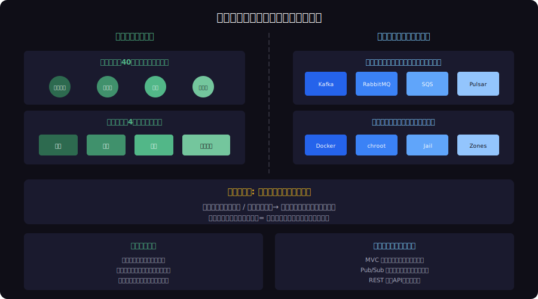
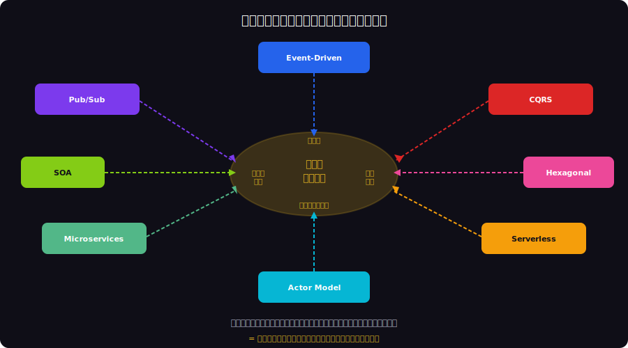
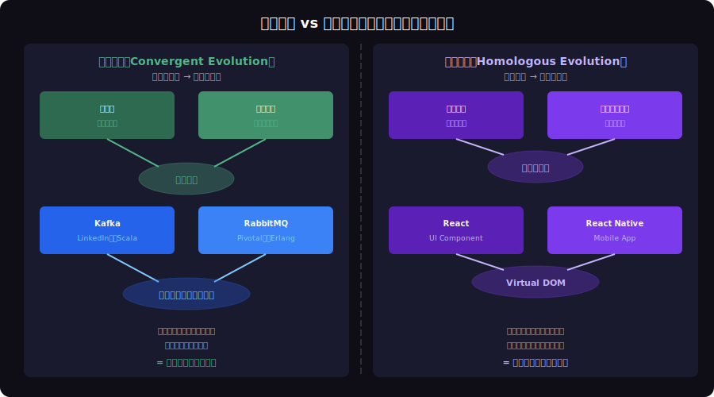

<!-- _class: lead -->
# 収束進化：なぜ異なる技術が同じアーキテクチャに収束するのか

- Convergent Evolution × Architecture Patterns
- 
- 翼は4回独立に進化した — MVCも同じように収束した

---

# Agenda

- - 1. 収束進化とは何か
- - 2. ソフトウェアにおける収束進化の実例
- - 3. アーキテクチャパターンの収束マップ
- - 4. 収束進化 vs 相同進化
- - 5. なぜ収束するのか：制約と最適解
- - 6. 次に収束するパターンを予測する

---

<!-- _class: lead -->
# 収束進化とは何か

- Chapter 1: What is Convergent Evolution?

---

# 収束進化（Convergent Evolution）

> *異なる系統が同一形態に収束—正解の数は有限*

![w:800 center]()
- - 異なる祖先を持つ生物が **同じ形態・機能** を独立に進化させる現象
- - 眼は動物界で **40回以上** 独立に進化した
- - 翼は昆虫・翼竜・鳥・コウモリで **4回** 独立に進化
- - 原因: **同じ環境制約** が同じ最適解を生む
- - 「飛ぶ必要がある」→ 翼という解に収束
- - ソフトウェアでも同じ制約が同じパターンを生み出す

---

# 異なる起源、同じ解決策

---

<!-- _class: lead -->
# ソフトウェアの収束進化

- Chapter 2: Convergence in Software

---

# MVC：最も成功した収束進化

> *Smalltalk・Rails・React: 独立に同じMVC構造へ収束した*

![w:800 center]()
- - **1979**: Smalltalk-80 で MVC が最初に登場
- - **1996**: Java Struts が独自にMVC的構造を採用
- - **2004**: Rails が「Convention over Configuration」でMVCを再発明
- - **2010**: Angular/Backbone が フロントエンドでMVCを再実装
- - **2013**: React が MVC の V だけを取り出し（View収束）
- - 30年間で **異なる言語・異なるチーム** が同じパターンに到達

<!--
MVCは最初のフレームワーク「以外」のチームも独立にMVC的構造に到達している。これは収束進化の証拠。
-->

---

# メッセージキューの収束

> *RabbitMQ・Kafka・SQSが非同期処理の共通解に収束*

![w:800 center]()
- - **IBM MQ** (1993): エンタープライズ起源、COBOL/Java
- - **RabbitMQ** (2007): Erlang起源、AMQP標準
- - **Kafka** (2011): LinkedIn起源、ログベース、Scala/Java
- - **Amazon SQS** (2006): AWS起源、マネージドサービス
- - **Apache Pulsar** (2016): Yahoo起源、マルチテナント
- - 全て独立に開発、全て **Pub/Sub + 永続化 + 順序保証** に収束

---

# コンテナ化の収束

> *chroot→jail→cgroups→Docker: 隔離の解は1つしかなかった*

![w:800 center]()
- - **chroot** (1979): Unix V7、ファイルシステム分離
- - **FreeBSD Jail** (2000): プロセス分離
- - **Solaris Zones** (2004): OS仮想化
- - **LXC** (2008): Linux cgroups + namespaces
- - **Docker** (2013): アプリケーションコンテナ
- - 34年間で5回独立に「プロセス隔離」に収束した

---

<!-- _class: lead -->
# アーキテクチャパターンの収束マップ

- Chapter 3: Architecture Convergence Map

---

# アーキテクチャパターンの収束マップ

---

# 普遍的パターンへの収束

> *制約が同じなら解も同じ—パターンは発明でなく発見*

![w:800 center]()
- - **疎結合** (Loose Coupling): 全アーキテクチャの基本原則
- - **関心の分離** (Separation of Concerns): MVC, Clean Architecture, Hexagonal
- - **メッセージ駆動** (Message-Driven): Event Sourcing, Pub/Sub, Actor Model
- - **単一責任** (Single Responsibility): Microservices, Serverless, UNIX哲学
- - これらは「ソフトウェアの物理法則」に相当する
- - 制約が同じなら、どの言語・フレームワークでも同じ解に至る

---

<!-- _class: lead -->
# 収束進化 vs 相同進化

- Chapter 4: Convergent vs Homologous

---

# 収束進化 vs 相同進化

---

<!-- _class: lead -->
# なぜ収束するのか

- Chapter 5: Why Convergence Happens

---

# 制約が解を決定する

> *CAP定理・レイテンシ制約が独立に同じアーキテクチャを導く*

![w:800 center]()
- - **物理的制約**: 空気抵抗 → 流線型、重力 → 構造強度
- - **技術的制約**: ネットワーク遅延 → キャッシュ、並行性 → ロック
- - **CAP定理**: 分散システムでは C/A/P のうち2つしか選べない
- - **アムダールの法則**: 並列化の限界が設計を制約
- - 制約空間が同じ → **解空間も同じ** → 収束
- - 「車輪の再発明」は実は「収束進化の証拠」かもしれない

<!--
車輪の再発明を批判する前に、それが収束進化かどうかを考えるべき。同じ解に到達しているなら、その解は本質的に正しい。
-->

---

# 適応放散：収束の逆パターン

> *異なる環境制約がガラパゴス化を生む—収束の逆条件*

![w:800 center]()
- - **適応放散** (Adaptive Radiation): 1つの祖先から多様な形態に分岐
- - ダーウィンフィンチ: 1種から13種に分岐（くちばしの形態多様化）
- - JavaScript: 1つの言語から TypeScript, CoffeeScript, Elm, Dart に分岐
- - Linux: 1つのカーネルから Ubuntu, Alpine, Arch, RHEL に分岐
- - 収束と放散は同時に起きる: **マクロでは収束、ミクロでは放散**
- - アーキテクチャは収束し、実装は放散する

---

<!-- _class: lead -->
# 次に収束するパターンの予測

- Chapter 6: Predicting Future Convergence

---

# 2026年に収束しつつあるパターン

> *AIエージェント・Event-Driven・Edge: 次の収束点が見える*

![w:800 center]()
- - **AI Gateway**: OpenAI, Anthropic, Google が全て同じ API パターンに
- - **Edge Computing**: CDN各社が同じ「エッジ関数」モデルに収束
- - **Infrastructure as Code**: Terraform, Pulumi, CDK が宣言的構成に収束
- - **Observability**: ログ・メトリクス・トレースの3本柱が標準に収束
- - **Zero Trust**: 全セキュリティモデルが「常に検証」に収束
- - 収束を予測できれば **技術選定の失敗を防げる**

---

<!-- _class: lead -->
# まとめ：進化の法則に学ぶ

![w:800 center]()
- 異なる起源の技術が同じパターンに収束するのは偶然ではない
- 
- 同じ制約が同じ最適解を必然的に生み出す
- 
- **収束したパターンは「正解」の強力な証拠である**
- **逆に、収束していない技術は慎重に評価すべき**

