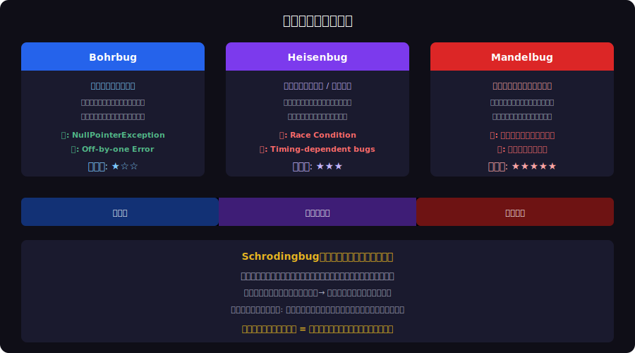
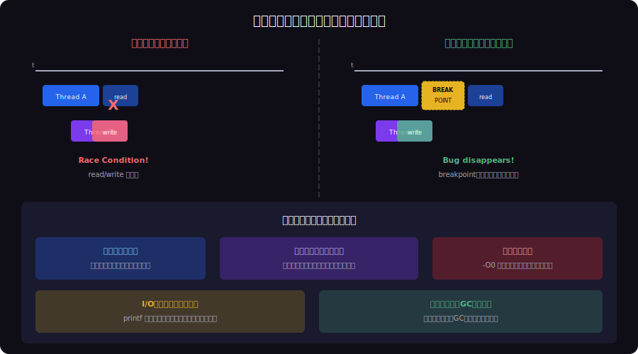

<!-- _class: lead -->
# 観察者効果とHeisenbug：見ると消えるバグの量子力学

- Observer Effect × Heisenbug
- 
- デバッガを繋ぐとバグが消える — それは偶然ではない


---

# Agenda

- - 1. 量子力学の観察者効果
- - 2. バグの量子力学分類
- - 3. Heisenbugのメカニズム
- - 4. 観察がシステムを変える具体例
- - 5. Heisenbugの捕まえ方
- - 6. 観察者効果を逆手に取るテスト設計


---

<!-- _class: lead -->
# 量子力学の観察者効果

- Chapter 1: The Observer Effect in Physics


---

# 観察者効果（Observer Effect）

![w:800 center]()
- - 量子力学: 粒子を **観測する行為** が粒子の状態を変える
- - 電子の位置を測定 → 光子をぶつける → 運動量が変化
- - **ハイゼンベルクの不確定性原理**: 位置と運動量を同時に正確に測定できない
- - 二重スリット実験: 観測すると干渉パターンが消失
- - ソフトウェアでも全く同じ現象が起きる
- - デバッグツールがシステムの振る舞いを変えてしまう

<!--
量子力学の観察者効果は哲学的議論を呼んだが、ソフトウェアでは非常に具体的・実践的な問題。
-->

---

<!-- _class: lead -->
# バグの量子力学分類

- Chapter 2: Quantum Bug Taxonomy


---

# バグの量子力学分類




---

<!-- _class: lead -->
# Heisenbugのメカニズム

- Chapter 3: How Heisenbugs Work


---

# 観察がシステムを変えるメカニズム




---

# 典型的なHeisenbug：Race Condition

![w:800 center]()
- - デバッガなしでは競合が発生するが、デバッガありでは消える


---

# 典型的なHeisenbug：Race Condition（コード例）

```typescript
// Heisenbug: Race condition in shared counter
let counter = 0;

async function increment() {
  const current = counter;  // Read
  // --- breakpoint here changes timing ---
  counter = current + 1;    // Write
}

// 1000 concurrent calls: expected 1000, actual ~970
await Promise.all(Array(1000).fill(0).map(() => increment()));
console.log(counter); // Without debugger: ~970 (bug)
                      // With debugger: 1000 (no bug!)
```


---

<!-- _class: lead -->
# 観察がシステムを変える具体例

- Chapter 4: Real-World Observer Effects


---

# printfデバッグの罠

- - `console.log` / `printf` を入れるとバグが消える古典的ケース


---

# printfデバッグの罠（コード例）

![w:800 center]()

```typescript
// Printf debugging creates observer effect
function processData(buffer: Buffer) {
  const data = parseHeader(buffer);
  console.log('Header:', data); // This flush changes timing!
  // Without console.log: corrupted data (race condition)
  // With console.log: works perfectly (I/O flush serializes)
  return transform(data);
}
```


---

# プロダクション限定バグ

![w:800 center]()
- - **コンパイラ最適化**: `-O2` で変数がレジスタに最適化 → デバッグビルドでは発生しない
- - **メモリアロケータ**: デバッグモードはメモリを0埋め → Use-After-Free が隠蔽
- - **GCタイミング**: プロファイラがGCを頻発させ弱参照の挙動が変化
- - **ネットワーク遅延**: tcpdump がパケット処理を微妙に遅延
- - **Docker volume**: 開発環境のファイルシステムが本番と異なるinode挙動
- - 全て「観察道具が系を擾乱する」パターン


---

<!-- _class: lead -->
# Heisenbugの捕まえ方

- Chapter 5: Catching Heisenbugs


---

# 非侵襲的観測手法

- - **構造化ログ** (Structured Logging): リングバッファで最小オーバーヘッド
- - **eBPF**: カーネルレベルで非侵襲的にトレーシング
- - **Flight Recorder** (JFR): JVMの常時記録、オーバーヘッド1%未満
- - **Core Dump 事後解析**: クラッシュ後にメモリダンプを分析
- - **Chaos Engineering**: ランダム障害注入でHeisenbugを炙り出す
- - 原則: **系を変えずに観測する** 手法を選ぶ


---

# 再現テスト戦略

![w:800 center]()
- - 1. **Thread Sanitizer (TSan)**: コンパイル時にRace Conditionを検出
- - 2. **Address Sanitizer (ASan)**: Use-After-Freeを検出
- - 3. **Deterministic Replay**: rr (Mozilla) でスレッド実行を完全記録・再生
- - 4. **Fuzzing**: ランダム入力で非決定的バグを発見
- - 5. **Property-Based Testing**: 不変条件でHeisenbugの症状を検出
- - 6. **Canary Release**: 本番環境の一部で長時間観測

<!--
rrはMozillaが開発したdeterministic replay debugger。Heisenbugの再現に非常に有効。
-->

---

<!-- _class: lead -->
# 観察者効果を逆手に取る

![w:800 center]()
- Chapter 6: Leveraging the Observer Effect


---

# Observability as Design Principle

- - 観察者効果を **設計段階から組み込む** という逆転の発想
- - **OpenTelemetry**: 統一的な計装で観測コストを最小化
- - **Distributed Tracing**: 非侵襲的にリクエストフローを追跡
- - **Metrics Pipeline**: Prometheus + Grafana で常時監視
- - 「観測できないシステムは制御できない」
- - 量子力学の教訓: 観測は不可避、なら最小コストで最大情報を得よ


---

<!-- _class: lead -->
# まとめ：不確定性と共存する（1/2）

![w:800 center]()
- Heisenbugは「バグが悪い」のではなく
- 「観察方法が系を変えている」
- 
- 非侵襲的な観測手法を選び、


---

<!-- _class: lead -->
# まとめ：不確定性と共存する（2/2）

- 再現可能な環境を構築し、
- 不確定性を設計に組み込む
- 
- **バグもまた、観測されるまでは存在しない**

