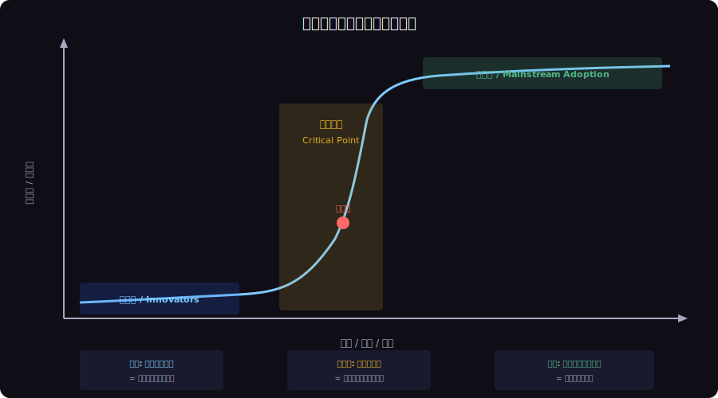
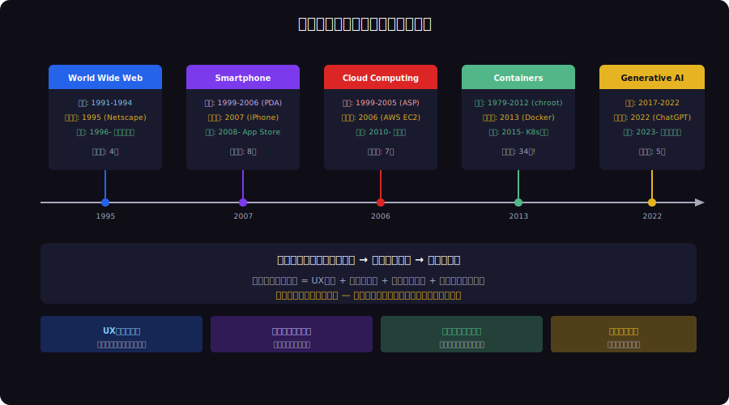

<!-- _class: lead -->
# 相変化と技術採用の臨界点：なぜ技術は突然普及するのか

- Phase Transition × Technology Adoption
- 
- 水が0度で突然凍るように、技術も臨界点で突然普及する

---

# Agenda

- - 1. 相変化（Phase Transition）の物理学
- - 2. 技術採用曲線と相変化の対応
- - 3. 歴史的事例：臨界点を超えた技術
- - 4. 臨界点のトリガー条件
- - 5. キャズム = 過冷却状態
- - 6. 次の相転移を予測する

---

<!-- _class: lead -->
# 相変化の物理学

- Chapter 1: Physics of Phase Transitions

---

# 相変化（Phase Transition）とは

- - 物質が **固体・液体・気体** の間で状態を変える現象
- - 温度がゆっくり上昇 → ある瞬間に **急激に** 状態が変わる
- - 相転移点（臨界点）: 水なら0度（固→液）、100度（液→気）
- - 転移は **連続的ではなく離散的** — 中間状態がない
- - **潜熱**: 相変化には余分なエネルギーが必要
- - 技術採用でも同じ: 閾値を超えると突然広がる

<!--
一次相転移では潜熱が必要。技術採用でも「キャズムを超える」ためのエネルギー（投資・マーケティング）が必要。
-->

---

# 技術採用曲線と相変化の対応

---

<!-- _class: lead -->
# 歴史的事例

- Chapter 2: Historical Phase Transitions

---

# 技術の相変化マップ

---

# Docker：34年の潜伏期を経た相転移

- - **1979**: chroot（ファイルシステム隔離の原型）
- - **2000**: FreeBSD Jail（プロセス隔離）
- - **2006**: Linux cgroups（リソース制限）
- - **2008**: LXC（Linuxコンテナの標準化）
- - **2013**: Docker 登場 → **臨界点を超える**
- - トリガー: **DX（開発者体験）の革新** — Dockerfile 1枚で環境再現

<!--
技術的基盤は30年以上前から存在していた。Dockerが臨界点になったのは技術革新ではなくUX革新。
-->

---

<!-- _class: lead -->
# 臨界点のトリガー条件

- Chapter 3: Trigger Conditions

---

# 相転移のトリガー4要素

- - **UXの臨界質量**: 非技術者でも使える閾値を超える
- - **コストの臨界質量**: 導入コストが心理的障壁を下回る
- - **ネットワーク効果**: 利用者増加が価値を加速度的に増幅
- - **キラーアプリ**: 具体的な成功事例が「理論→実践」を証明
- - 4要素のうち **3つ以上** が同時に揃うと相転移が発生
- - 1つでも欠けると「過冷却状態」（キャズム）に留まる

---

<!-- _class: lead -->
# キャズム = 過冷却状態

- Chapter 4: The Chasm as Supercooling

---

# 過冷却（Supercooling）とキャズム

- - **過冷却**: 水が0度以下でも凍らない状態（不安定だが持続）
- - **キャズム**: 技術が普及すべき条件を満たしているのに普及しない状態
- - 共通点: **核生成** (Nucleation) が起きるまで転移しない
- - 過冷却水: 小さな氷の結晶（種結晶）が触媒
- - キャズム: キラーユースケース / インフルエンサーが触媒
- - Google Glass (2013): 技術はあったがキャズムで過冷却のまま消滅

<!--
Googleglassは過冷却状態のまま核生成が起きなかった例。社会的受容性という触媒が欠けていた。
-->

---

# 潜熱：キャズムを超えるためのエネルギー

- - 相変化には **潜熱**（余分なエネルギー）が必要
- - 0度の氷 → 0度の水: 温度は同じだが大量のエネルギーが必要
- - 技術採用: キャズムを超えるための **追加投資** が潜熱に相当
- - マーケティング費用、導入支援、教育コスト = 潜熱
- - 潜熱を過小評価 → 「技術は良いのに普及しない」症候群
- - AWS の無料枠、Docker の Tutorial = 潜熱の供給手段

---

<!-- _class: lead -->
# 次の相転移を予測する

- Chapter 5: Predicting the Next Transition

---

# 2026年: 過冷却状態の技術

- - **WebAssembly**: 技術基盤は整ったが、キラーアプリが不在
- - **Web3/DeFi**: 投機バブル後の「過冷却」期間中
- - **VR/AR**: Apple Vision Proが核生成になるか?
- - **自律型AIエージェント**: 2025-2026で臨界点に接近中
- - **Passkey認証**: パスワードレスの技術基盤は完備
- - 予測: **AIエージェント** が2026-2027に相転移する可能性が最も高い

---

# 相転移を見極めるチェックリスト

- - 1. 技術の **潜伏期** は十分か（最低3-5年の開発期間）
- - 2. **UXの改善** が閾値を超えたか（非専門家が使える）
- - 3. **コスト** が心理的障壁を下回ったか
- - 4. **ネットワーク効果** の兆候があるか
- - 5. **キラーアプリ** が出現したか
- - 6. **潜熱** の供給源（投資・教育）が十分か

---

<!-- _class: lead -->
# まとめ：相変化の法則に学ぶ

- 技術は徐々にではなく突然普及する
- 
- 臨界点の前は「まだ早い」
- 臨界点の後は「もう遅い」
- 
- **相転移のシグナルを読む者が、次の波に乗れる**

