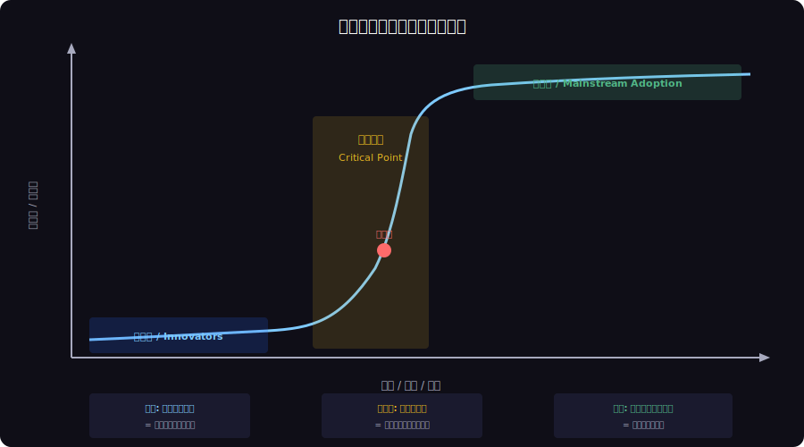
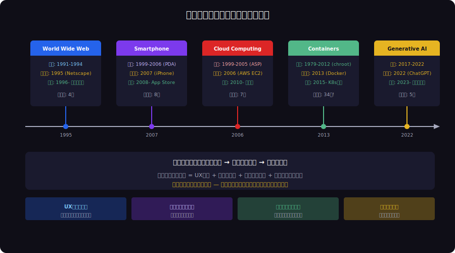

<!-- _class: lead -->
# 相変化と技術採用の臨界点：なぜ技術は突然普及するのか

- Phase Transition × Technology Adoption
- 
- 水が0度で突然凍るように、技術も臨界点で突然普及する

---

# Agenda

- - 1. 相変化（Phase Transition）の物理学
- - 2. 技術採用曲線と相変化の対応
- - 3. 歴史的事例：臨界点を超えた技術
- - 4. 臨界点のトリガー条件
- - 5. キャズム = 過冷却状態
- - 6. 次の相転移を予測する

---

<!-- _class: lead -->
# 相変化の物理学

- Chapter 1: Physics of Phase Transitions

---

# 相変化（Phase Transition）とは

- <svg viewBox="0 0 800 270" style="max-height:70vh;max-width:100%;display:block;margin:0 auto;"><rect width="800" height="270" fill="#1a1a2e"/><text x="400" y="28" text-anchor="middle" fill="#f9a825" font-size="14" font-weight="bold">相変化：連続的加熱 → 離散的状態変化</text><line x1="60" y1="220" x2="740" y2="220" stroke="#444" stroke-width="2"/><line x1="60" y1="220" x2="60" y2="40" stroke="#444" stroke-width="2"/><text x="400" y="248" text-anchor="middle" fill="#888" font-size="10">時間（加熱）</text><text x="30" y="135" text-anchor="middle" fill="#888" font-size="10" transform="rotate(-90,30,135)">温度</text><polyline points="60,200 160,180 200,180 200,180 280,160 360,100 400,100 400,100 480,80 560,50 620,50" fill="none" stroke="#f9a825" stroke-width="3"/><line x1="200" y1="50" x2="200" y2="220" stroke="#e91e63" stroke-width="1" stroke-dasharray="5,3"/><line x1="400" y1="50" x2="400" y2="220" stroke="#4caf50" stroke-width="1" stroke-dasharray="5,3"/><text x="200" y="235" text-anchor="middle" fill="#e91e63" font-size="10">0°C 固→液</text><text x="400" y="235" text-anchor="middle" fill="#4caf50" font-size="10">100°C 液→気</text><rect x="80" y="155" width="80" height="24" rx="4" fill="#16213e" stroke="#2196f3" stroke-width="1"/><text x="120" y="171" text-anchor="middle" fill="#2196f3" font-size="9">固体</text><rect x="230" y="135" width="80" height="24" rx="4" fill="#16213e" stroke="#f9a825" stroke-width="1"/><text x="270" y="151" text-anchor="middle" fill="#f9a825" font-size="9">液体</text><rect x="450" y="75" width="80" height="24" rx="4" fill="#16213e" stroke="#4caf50" stroke-width="1"/><text x="490" y="91" text-anchor="middle" fill="#4caf50" font-size="9">気体</text><rect x="480" y="145" width="280" height="55" rx="6" fill="#16213e" stroke="#f9a825" stroke-width="1"/><text x="620" y="168" text-anchor="middle" fill="#f9a825" font-size="11" font-weight="bold">技術採用も同じ</text><text x="620" y="188" text-anchor="middle" fill="#cccccc" font-size="10">臨界点を超えると突然広がる</text></svg>
- - 物質が **固体・液体・気体** の間で状態を変える現象
- - 温度がゆっくり上昇 → ある瞬間に **急激に** 状態が変わる
- - 相転移点（臨界点）: 水なら0度（固→液）、100度（液→気）
- - 転移は **連続的ではなく離散的** — 中間状態がない
- - 技術採用でも同じ: 閾値を超えると突然広がる

<!--
一次相転移では潜熱が必要。技術採用でも「キャズムを超える」ためのエネルギー（投資・マーケティング）が必要。
-->

---

# 技術採用曲線と相変化の対応

---

<!-- _class: lead -->
# 歴史的事例

- Chapter 2: Historical Phase Transitions

---

# 技術の相変化マップ

---

# Docker：34年の潜伏期を経た相転移

- <svg viewBox="0 0 800 270" style="max-height:70vh;max-width:100%;display:block;margin:0 auto;"><rect width="800" height="270" fill="#1a1a2e"/><text x="400" y="28" text-anchor="middle" fill="#f9a825" font-size="14" font-weight="bold">Docker：34年の技術蓄積 → 相転移</text><line x1="60" y1="200" x2="740" y2="200" stroke="#444" stroke-width="2"/><circle cx="120" cy="190" r="7" fill="#888"/><text x="120" y="220" text-anchor="middle" fill="#888" font-size="9">1979</text><text x="120" y="178" text-anchor="middle" fill="#aaaaaa" font-size="8">chroot</text><circle cx="240" cy="185" r="7" fill="#888"/><text x="240" y="220" text-anchor="middle" fill="#888" font-size="9">2000</text><text x="240" y="173" text-anchor="middle" fill="#aaaaaa" font-size="8">FreeBSD Jail</text><circle cx="360" cy="175" r="7" fill="#f9a825"/><text x="360" y="220" text-anchor="middle" fill="#f9a825" font-size="9">2006</text><text x="360" y="163" text-anchor="middle" fill="#f9a825" font-size="8">Linux cgroups</text><circle cx="480" cy="165" r="7" fill="#f9a825"/><text x="480" y="220" text-anchor="middle" fill="#f9a825" font-size="9">2008</text><text x="480" y="153" text-anchor="middle" fill="#f9a825" font-size="8">LXC</text><circle cx="640" cy="60" r="12" fill="#e91e63"/><text x="640" y="220" text-anchor="middle" fill="#e91e63" font-size="9">2013</text><text x="640" y="48" text-anchor="middle" fill="#e91e63" font-size="10" font-weight="bold">Docker</text><text x="640" y="35" text-anchor="middle" fill="#e91e63" font-size="9">臨界点突破</text><polyline points="120,190 240,185 360,175 480,165 640,60" fill="none" stroke="#f9a825" stroke-width="2"/><line x1="570" y1="30" x2="570" y2="200" stroke="#e91e63" stroke-width="1" stroke-dasharray="5,3"/><rect x="380" y="235" width="300" height="30" rx="4" fill="#16213e" stroke="#4caf50" stroke-width="1"/><text x="530" y="255" text-anchor="middle" fill="#4caf50" font-size="10">トリガー: DX革新 — Dockerfile 1枚で環境再現</text></svg>
- - **1979**: chroot（ファイルシステム隔離の原型）
- - **2000**: FreeBSD Jail（プロセス隔離）
- - **2006**: Linux cgroups（リソース制限）
- - **2008**: LXC（Linuxコンテナの標準化）
- - **2013**: Docker 登場 → **臨界点を超える**
- - トリガー: **DX（開発者体験）の革新** — Dockerfile 1枚で環境再現

<!--
技術的基盤は30年以上前から存在していた。Dockerが臨界点になったのは技術革新ではなくUX革新。
-->

---

<!-- _class: lead -->
# 臨界点のトリガー条件

- Chapter 3: Trigger Conditions

---

# 相転移のトリガー4要素

- <svg viewBox="0 0 800 260" style="max-height:70vh;max-width:100%;display:block;margin:0 auto;"><rect width="800" height="260" fill="#1a1a2e"/><text x="400" y="28" text-anchor="middle" fill="#f9a825" font-size="14" font-weight="bold">相転移のトリガー4要素（3つ以上で転移発生）</text><rect x="30" y="50" width="170" height="80" rx="8" fill="#16213e" stroke="#4caf50" stroke-width="2"/><text x="115" y="78" text-anchor="middle" fill="#4caf50" font-size="11" font-weight="bold">UXの臨界質量</text><text x="115" y="98" text-anchor="middle" fill="#cccccc" font-size="10">非技術者でも</text><text x="115" y="113" text-anchor="middle" fill="#cccccc" font-size="10">使える閾値を超える</text><rect x="220" y="50" width="170" height="80" rx="8" fill="#16213e" stroke="#f9a825" stroke-width="2"/><text x="305" y="78" text-anchor="middle" fill="#f9a825" font-size="11" font-weight="bold">コストの臨界質量</text><text x="305" y="98" text-anchor="middle" fill="#cccccc" font-size="10">導入コストが</text><text x="305" y="113" text-anchor="middle" fill="#cccccc" font-size="10">心理的障壁を下回る</text><rect x="410" y="50" width="170" height="80" rx="8" fill="#16213e" stroke="#e91e63" stroke-width="2"/><text x="495" y="78" text-anchor="middle" fill="#e91e63" font-size="11" font-weight="bold">ネットワーク効果</text><text x="495" y="98" text-anchor="middle" fill="#cccccc" font-size="10">利用者増加が</text><text x="495" y="113" text-anchor="middle" fill="#cccccc" font-size="10">価値を加速度的増幅</text><rect x="600" y="50" width="170" height="80" rx="8" fill="#16213e" stroke="#2196f3" stroke-width="2"/><text x="685" y="78" text-anchor="middle" fill="#2196f3" font-size="11" font-weight="bold">キラーアプリ</text><text x="685" y="98" text-anchor="middle" fill="#cccccc" font-size="10">具体的成功事例が</text><text x="685" y="113" text-anchor="middle" fill="#cccccc" font-size="10">理論→実践を証明</text><rect x="80" y="165" width="280" height="70" rx="6" fill="#16213e" stroke="#4caf50" stroke-width="2"/><text x="220" y="190" text-anchor="middle" fill="#4caf50" font-size="12" font-weight="bold">3つ以上揃う → 相転移</text><text x="220" y="215" text-anchor="middle" fill="#cccccc" font-size="10">急激な普及が始まる</text><rect x="440" y="165" width="280" height="70" rx="6" fill="#16213e" stroke="#e91e63" stroke-width="2"/><text x="580" y="190" text-anchor="middle" fill="#e91e63" font-size="12" font-weight="bold">1つでも欠ける → キャズム</text><text x="580" y="215" text-anchor="middle" fill="#cccccc" font-size="10">過冷却状態に留まる</text></svg>
- - **UXの臨界質量**: 非技術者でも使える閾値を超える
- - **コストの臨界質量**: 導入コストが心理的障壁を下回る
- - **ネットワーク効果**: 利用者増加が価値を加速度的に増幅
- - **キラーアプリ**: 具体的な成功事例が「理論→実践」を証明
- - 4要素のうち **3つ以上** が同時に揃うと相転移が発生

---

<!-- _class: lead -->
# キャズム = 過冷却状態

- Chapter 4: The Chasm as Supercooling

---

# 過冷却（Supercooling）とキャズム

- <svg viewBox="0 0 800 260" style="max-height:70vh;max-width:100%;display:block;margin:0 auto;"><rect width="800" height="260" fill="#1a1a2e"/><text x="400" y="28" text-anchor="middle" fill="#f9a825" font-size="14" font-weight="bold">過冷却 ↔ キャズムの対応関係</text><rect x="30" y="50" width="340" height="180" rx="8" fill="#16213e" stroke="#2196f3" stroke-width="2"/><text x="200" y="78" text-anchor="middle" fill="#2196f3" font-size="13" font-weight="bold">物理: 過冷却</text><text x="200" y="103" text-anchor="middle" fill="#cccccc" font-size="11">水が0度以下でも凍らない状態</text><text x="200" y="123" text-anchor="middle" fill="#cccccc" font-size="11">不安定だが転移しない</text><text x="200" y="150" text-anchor="middle" fill="#f9a825" font-size="11">触媒: 種結晶（小さな氷）</text><text x="200" y="170" text-anchor="middle" fill="#cccccc" font-size="10">種結晶が核生成を起こす</text><text x="200" y="210" text-anchor="middle" fill="#aaaaaa" font-size="9">例: 不純物のない水は-40度まで凍らない</text><rect x="430" y="50" width="340" height="180" rx="8" fill="#16213e" stroke="#e91e63" stroke-width="2"/><text x="600" y="78" text-anchor="middle" fill="#e91e63" font-size="13" font-weight="bold">技術: キャズム</text><text x="600" y="103" text-anchor="middle" fill="#cccccc" font-size="11">普及すべき条件を満たすのに普及しない</text><text x="600" y="123" text-anchor="middle" fill="#cccccc" font-size="11">不安定だが転移しない</text><text x="600" y="150" text-anchor="middle" fill="#f9a825" font-size="11">触媒: キラーユースケース</text><text x="600" y="170" text-anchor="middle" fill="#cccccc" font-size="10">インフルエンサーが核生成を起こす</text><text x="600" y="210" text-anchor="middle" fill="#aaaaaa" font-size="9">例: Google Glass — 社会的受容性が欠けて消滅</text></svg>
- - **過冷却**: 水が0度以下でも凍らない状態（不安定だが持続）
- - **キャズム**: 技術が普及すべき条件を満たしているのに普及しない状態
- - 共通点: **核生成** (Nucleation) が起きるまで転移しない
- - キャズム: キラーユースケース / インフルエンサーが触媒
- - Google Glass (2013): 技術はあったがキャズムで過冷却のまま消滅

<!--
Googleglassは過冷却状態のまま核生成が起きなかった例。社会的受容性という触媒が欠けていた。
-->

---

# 潜熱：キャズムを超えるためのエネルギー

- <svg viewBox="0 0 800 260" style="max-height:70vh;max-width:100%;display:block;margin:0 auto;"><rect width="800" height="260" fill="#1a1a2e"/><text x="400" y="28" text-anchor="middle" fill="#f9a825" font-size="14" font-weight="bold">潜熱 = キャズムを超えるための追加エネルギー</text><line x1="60" y1="200" x2="740" y2="200" stroke="#444" stroke-width="2"/><line x1="60" y1="200" x2="60" y2="40" stroke="#444" stroke-width="2"/><text x="400" y="225" text-anchor="middle" fill="#888" font-size="9">エネルギー（投資・マーケティング・教育）</text><polyline points="60,180 180,165 300,165 300,165 300,100 420,100 540,60 660,45" fill="none" stroke="#f9a825" stroke-width="3"/><line x1="300" y1="50" x2="300" y2="200" stroke="#e91e63" stroke-width="1" stroke-dasharray="5,3"/><text x="300" y="215" text-anchor="middle" fill="#e91e63" font-size="9">キャズム</text><rect x="210" y="100" width="180" height="65" rx="4" fill="#16213e" stroke="#e91e63" stroke-width="1"/><text x="300" y="125" text-anchor="middle" fill="#e91e63" font-size="10" font-weight="bold">潜熱が必要な区間</text><text x="300" y="145" text-anchor="middle" fill="#cccccc" font-size="9">温度が上がらないのに</text><text x="300" y="158" text-anchor="middle" fill="#cccccc" font-size="9">エネルギーが必要</text><rect x="480" y="60" width="240" height="55" rx="6" fill="#16213e" stroke="#4caf50" stroke-width="1"/><text x="600" y="82" text-anchor="middle" fill="#4caf50" font-size="10" font-weight="bold">潜熱の供給手段</text><text x="600" y="100" text-anchor="middle" fill="#cccccc" font-size="9">AWS無料枠 / Docker Tutorial</text><text x="600" y="112" text-anchor="middle" fill="#cccccc" font-size="9">マーケティング / 導入支援</text></svg>
- - 相変化には **潜熱**（余分なエネルギー）が必要
- - 0度の氷 → 0度の水: 温度は同じだが大量のエネルギーが必要
- - 技術採用: キャズムを超えるための **追加投資** が潜熱に相当
- - マーケティング費用、導入支援、教育コスト = 潜熱
- - 潜熱を過小評価 → 「技術は良いのに普及しない」症候群
- - AWS の無料枠、Docker の Tutorial = 潜熱の供給手段

---

<!-- _class: lead -->
# 次の相転移を予測する

- Chapter 5: Predicting the Next Transition

---

# 2026年: 過冷却状態の技術

- <svg viewBox="0 0 800 260" style="max-height:70vh;max-width:100%;display:block;margin:0 auto;"><rect width="800" height="260" fill="#1a1a2e"/><text x="400" y="28" text-anchor="middle" fill="#f9a825" font-size="14" font-weight="bold">2026年：過冷却 vs 相転移間近の技術</text><rect x="30" y="50" width="220" height="60" rx="6" fill="#16213e" stroke="#888" stroke-width="2" stroke-dasharray="5,3"/><text x="140" y="76" text-anchor="middle" fill="#888" font-size="11">WebAssembly</text><text x="140" y="93" text-anchor="middle" fill="#666" font-size="9">キラーアプリ不在</text><rect x="270" y="50" width="220" height="60" rx="6" fill="#16213e" stroke="#888" stroke-width="2" stroke-dasharray="5,3"/><text x="380" y="76" text-anchor="middle" fill="#888" font-size="11">Web3 / DeFi</text><text x="380" y="93" text-anchor="middle" fill="#666" font-size="9">投機バブル後の過冷却</text><rect x="510" y="50" width="220" height="60" rx="6" fill="#16213e" stroke="#f9a825" stroke-width="2"/><text x="620" y="76" text-anchor="middle" fill="#f9a825" font-size="11">VR / AR</text><text x="620" y="93" text-anchor="middle" fill="#aaaaaa" font-size="9">Vision Proが核生成か?</text><rect x="30" y="135" width="220" height="60" rx="6" fill="#16213e" stroke="#e91e63" stroke-width="2"/><text x="140" y="161" text-anchor="middle" fill="#e91e63" font-size="11" font-weight="bold">自律型AIエージェント</text><text x="140" y="178" text-anchor="middle" fill="#e91e63" font-size="9">2025-2026で臨界点接近中</text><rect x="270" y="135" width="220" height="60" rx="6" fill="#16213e" stroke="#888" stroke-width="2" stroke-dasharray="5,3"/><text x="380" y="161" text-anchor="middle" fill="#888" font-size="11">Passkey認証</text><text x="380" y="178" text-anchor="middle" fill="#666" font-size="9">技術基盤は完備</text><rect x="400" y="210" width="360" height="40" rx="6" fill="#16213e" stroke="#e91e63" stroke-width="2"/><text x="580" y="232" text-anchor="middle" fill="#e91e63" font-size="11" font-weight="bold">予測: AIエージェントが2026-2027に相転移</text></svg>
- - **WebAssembly**: 技術基盤は整ったが、キラーアプリが不在
- - **Web3/DeFi**: 投機バブル後の「過冷却」期間中
- - **VR/AR**: Apple Vision Proが核生成になるか?
- - **自律型AIエージェント**: 2025-2026で臨界点に接近中
- - 予測: **AIエージェント** が2026-2027に相転移する可能性が最も高い

---

# 相転移を見極めるチェックリスト

- <svg viewBox="0 0 800 260" style="max-height:70vh;max-width:100%;display:block;margin:0 auto;"><rect width="800" height="260" fill="#1a1a2e"/><text x="400" y="28" text-anchor="middle" fill="#f9a825" font-size="14" font-weight="bold">相転移チェックリスト：6つの確認項目</text><rect x="30" y="50" width="340" height="55" rx="6" fill="#16213e" stroke="#4caf50" stroke-width="2"/><text x="200" y="74" text-anchor="middle" fill="#4caf50" font-size="11" font-weight="bold">1. 潜伏期 ≥ 3-5年</text><text x="200" y="93" text-anchor="middle" fill="#aaaaaa" font-size="9">技術基盤の成熟を確認</text><rect x="430" y="50" width="340" height="55" rx="6" fill="#16213e" stroke="#f9a825" stroke-width="2"/><text x="600" y="74" text-anchor="middle" fill="#f9a825" font-size="11" font-weight="bold">2. UX改善が閾値超え</text><text x="600" y="93" text-anchor="middle" fill="#aaaaaa" font-size="9">非専門家が使えるか</text><rect x="30" y="125" width="340" height="55" rx="6" fill="#16213e" stroke="#2196f3" stroke-width="2"/><text x="200" y="149" text-anchor="middle" fill="#2196f3" font-size="11" font-weight="bold">3. コストが障壁を下回った</text><text x="200" y="168" text-anchor="middle" fill="#aaaaaa" font-size="9">心理的コストも含む</text><rect x="430" y="125" width="340" height="55" rx="6" fill="#16213e" stroke="#e91e63" stroke-width="2"/><text x="600" y="149" text-anchor="middle" fill="#e91e63" font-size="11" font-weight="bold">4. ネットワーク効果の兆候</text><text x="600" y="168" text-anchor="middle" fill="#aaaaaa" font-size="9">利用者増加が加速中</text><rect x="30" y="200" width="340" height="50" rx="6" fill="#16213e" stroke="#ff9800" stroke-width="2"/><text x="200" y="223" text-anchor="middle" fill="#ff9800" font-size="11" font-weight="bold">5. キラーアプリが出現</text><text x="200" y="242" text-anchor="middle" fill="#aaaaaa" font-size="9">理論→実践を証明する事例</text><rect x="430" y="200" width="340" height="50" rx="6" fill="#16213e" stroke="#9c27b0" stroke-width="2"/><text x="600" y="223" text-anchor="middle" fill="#9c27b0" font-size="11" font-weight="bold">6. 潜熱の供給源が十分</text><text x="600" y="242" text-anchor="middle" fill="#aaaaaa" font-size="9">投資・教育・無料枠</text></svg>
- - 1. 技術の **潜伏期** は十分か（最低3-5年の開発期間）
- - 2. **UXの改善** が閾値を超えたか（非専門家が使える）
- - 3. **コスト** が心理的障壁を下回ったか
- - 4. **ネットワーク効果** の兆候があるか
- - 5. **キラーアプリ** が出現したか
- - 6. **潜熱** の供給源（投資・教育）が十分か

---

<!-- _class: lead -->
# まとめ：相変化の法則に学ぶ

- 技術は徐々にではなく突然普及する
- 
- 臨界点の前は「まだ早い」
- 臨界点の後は「もう遅い」
- 
- **相転移のシグナルを読む者が、次の波に乗れる**

