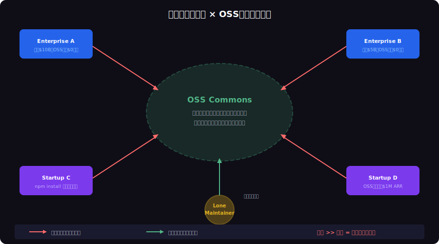

<!-- _class: lead -->
# コモンズの悲劇：OSS持続可能性の経済学

- Tragedy of the Commons × Open Source Sustainability
- 
- 全員が使うのに誰も手入れしない共有地は、やがて荒廃する

---

# Agenda

- - 1. コモンズの悲劇とは
- - 2. OSSエコシステムの構造的問題
- - 3. 事件簿：共有地の崩壊
- - 4. 解決策：エリノア・オストロムの8原則
- - 5. 持続可能なOSSモデル
- - 6. 開発者として何ができるか

---

<!-- _class: lead -->
# コモンズの悲劇とは

- Chapter 1: Tragedy of the Commons

---

# コモンズの悲劇（Garrett Hardin, 1968）

- - 共有の牧草地（Commons）に複数の牧畜民がいる
- - 各人の合理的行動: **自分の羊を1頭増やす** （利益は自分、コストは全員）
- - 全員が同じ行動 → 牧草地が **過剰利用** で荒廃
- - **個人の合理性** が **集団の破滅** を招く構造的ジレンマ
- - OSSは現代の最大の「コモンズ」
- - npm, PyPI, crates.io は全て共有牧草地

<!--
ハーディンの1968年のScience論文は環境問題の文脈だったが、OSSにも完全に当てはまる。
-->

---

<!-- _class: lead -->
# OSSエコシステムの構造的問題

- Chapter 2: Structural Problems

---

# OSSコモンズの悲劇

---

# 数字で見るOSSの現実

- - Fortune 500企業の **96%** がOSSを使用
- - OSSの経済的価値: 年間 **$8.8 trillion** 相当
- - 重要OSSプロジェクトの **60%** がメンテナー1-2人
- - OSSメンテナーの **46%** が無報酬
- - core-js（週2.5億DL）のメンテナーは月収 **$400**
- - log4j（世界中で使用）の脆弱性修正は **ボランティア2名** が対応

---

<!-- _class: lead -->
# 事件簿：共有地の崩壊

- Chapter 3: When Commons Collapse

---

# left-pad事件（2016）

- - **11行** のnpmパッケージが突然削除される
- - React, Babel, 数千のプロジェクトがビルド不能に
- - 11行のコードに世界中のインフラが依存していた
- - メンテナーの不満 → パッケージ削除 → カスケード障害
- - コモンズの悲劇: 皆が依存するが、誰も維持コストを払わない
- - npm社が前例のない「パッケージ復元」を強制実行

---

# Log4Shell（2021）

- - Apache Log4j に **CVSS 10.0** の致命的脆弱性
- - Java エコシステムの **35%** が影響を受ける
- - 修正対応はボランティアメンテナー2名が行った
- - 数兆ドル規模の産業が、無給のボランティアに依存
- - xkcd #2347: 「全ての現代インフラはネブラスカの一人が趣味で維持」
- - これこそコモンズの悲劇の極致

---

<!-- _class: lead -->
# 解決策：オストロムの8原則

- Chapter 4: Ostrom's Principles

---

# エリノア・オストロム：コモンズは管理できる

- - **2009年ノーベル経済学賞**: 「コモンズの悲劇は不可避ではない」と実証
- - 世界中の共有資源管理の成功事例を研究
- - **8つの設計原則** でコモンズを持続可能にできる
- - 核心: 利用者コミュニティが **自治的にルールを策定** する
- - ハーディンの「国家管理 or 私有化」の二択を否定
- - OSSコミュニティにこそ最も適用可能な理論

<!--
オストロムは「第3の道」を示した。国家でも市場でもない、コミュニティ自治という解決策。
-->

---

# 8原則のOSS適用

- - 1. **境界の明確化**: LICENSE, CONTRIBUTING.md で参加条件を定義
- - 2. **利用・供給ルール**: コントリビュータ契約、行動規範
- - 3. **集合的選択**: RFC/ADR プロセスで意思決定を民主化
- - 4. **監視**: CI/CD, コードレビュー, セキュリティ監査
- - 5. **段階的制裁**: Warn → Ban → Fork で違反者に対応
- - 6. **紛争解決**: Governance Committee, BDFL 制度

---

<!-- _class: lead -->
# 持続可能なOSSモデル

- Chapter 5: Sustainable Models

---

# OSSファンディングモデル比較

- - **Corporate Sponsorship**: React (Meta), Go (Google), Rust (Mozilla→Foundation)
- - **Open Core**: GitLab, Elastic, MongoDB — コアOSS + 有料機能
- - **SaaS Model**: Vercel (Next.js), Hashicorp (Terraform)
- - **Foundation Model**: Linux Foundation, Apache Foundation
- - **GitHub Sponsors / Open Collective**: 個人・小規模向け
- - **Dual License**: AGPL + Commercial (MySQL, Qt)

---

# 成功事例：Rustの持続可能性モデル

- - Mozilla からスピンオフ → **Rust Foundation** 設立 (2021)
- - Google, AWS, Microsoft, Huawei が年間 **$1M+** を拠出
- - 明確なガバナンス: RFC プロセス + チーム制 + ローテーション
- - コントリビューター数は増加傾向（フリーライダー比率低下）
- - オストロムの原則を最も忠実に体現したOSSプロジェクト
- - 「コモンズは自治で持続できる」ことの証明

---

<!-- _class: lead -->
# 開発者として何ができるか

- Chapter 6: What Developers Can Do

---

# フリーライダーから共有地の管理者へ

- - 1. **依存関係の監査**: `npm fund` で依存OSSの資金状況を確認
- - 2. **小さな貢献**: バグ報告、ドキュメント改善、テスト追加
- - 3. **企業としてのスポンサーシップ**: 依存OSSへの資金的支援
- - 4. **コントリビューションポリシー**: 業務時間の5%をOSS貢献に充てる
- - 5. **セキュリティ通報**: 脆弱性を見つけたら責任ある開示
- - 6. **新しいOSSの健全性を評価**: メンテナー数、資金、ガバナンスを確認

---

<!-- _class: lead -->
# まとめ：コモンズを守るために

- OSSは人類最大の共有知的財産
- 
- 「使うだけ」は合理的だが、全員がそうすればコモンズは崩壊する
- 
- オストロムが示した通り、コモンズは自治で守れる
- 
- **あなたの `npm install` の先にいる人を忘れない**

