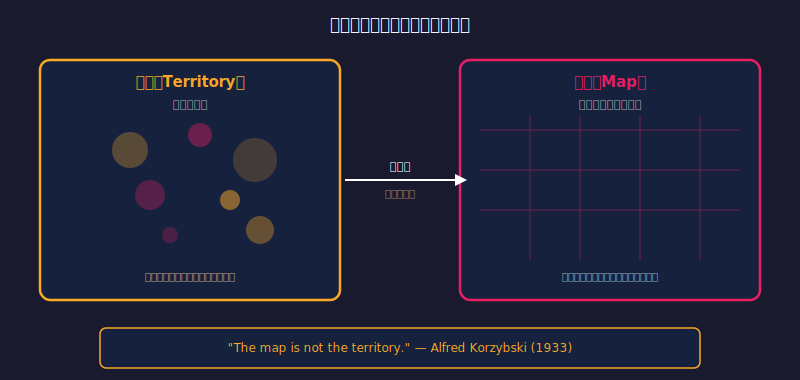
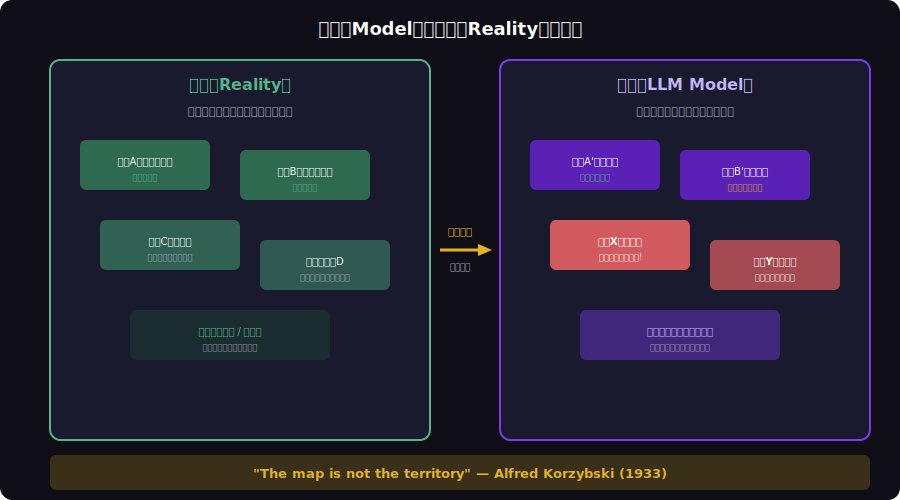
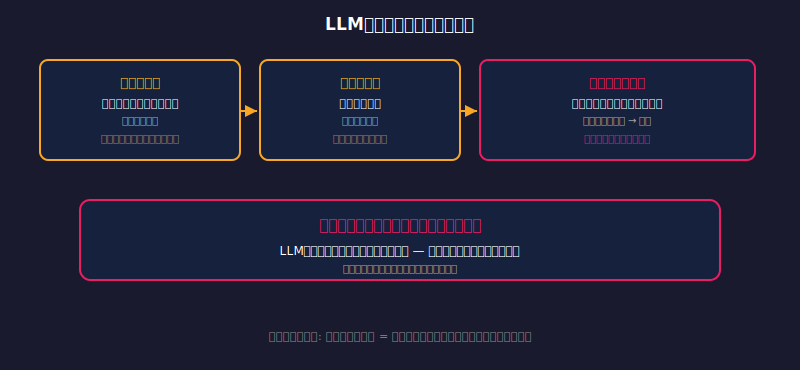
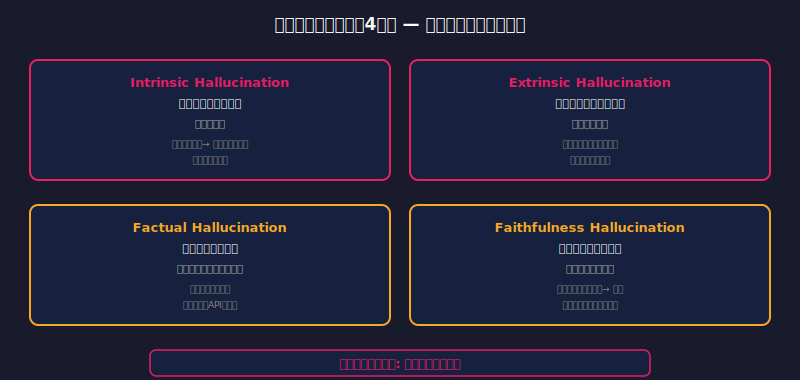
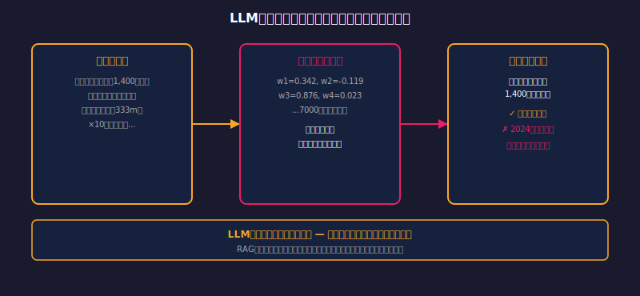
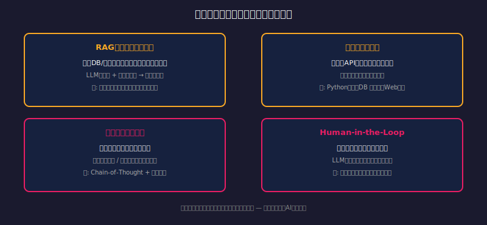
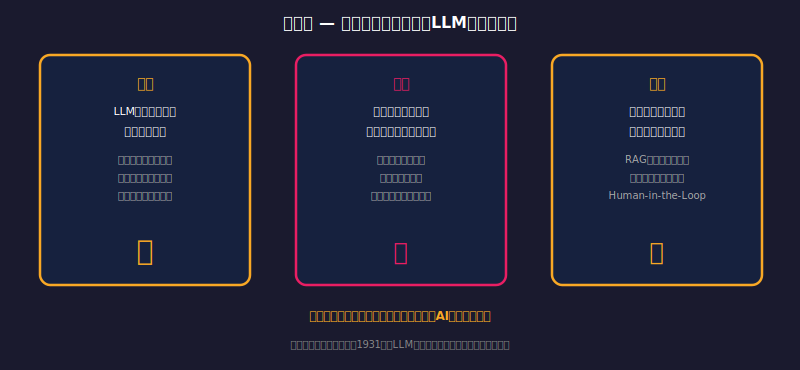

<!-- _class: invert lead -->
# 地図と領土：LLMハルシネーションの認識論

- The Map is Not the Territory × LLM Hallucination
- なぜAIは「もっともらしい嘘」をつくのか — 認識論から理解する


---

# Agenda

> *LLMは地図—幻覚は欠陥でなく地図の本質的限界であり設計で対処できる*

- 1. 「地図は領土ではない」— コジブスキーの命題
- 2. LLMの「地図」としての性質
- 3. ハルシネーションの認識論的分類
- 4. なぜ地図に存在しない道が描かれるのか
- 5. 地図の正しい使い方
- 6. Human-in-the-Loopの設計


---

<!-- _class: invert lead -->
# 「地図は領土ではない」

- Chapter 1: The Map-Territory Relation


---

# コジブスキーの命題（1933）

> *LLMは言語地図を持つが現実の領土を知らない*



- **Alfred Korzybski**: 「地図は領土ではない」（一般意味論）
- 地図（モデル）は領土（現実）の **不完全な表現** に過ぎない
- 全ての地図には **歪み・省略・一般化** がある
- ルネ・マグリット「これはパイプではない」— 表象と実体の区別
- **メニューは食事ではない**、統計は現実ではない
- LLMは言語の「地図」を持っているが、現実の「領土」を知らない

<!--
コジブスキーの一般意味論は1933年。100年前の哲学がAI時代に再び重要になっている。
-->

---

# 地図と領土の関係




---

<!-- _class: invert lead -->
# LLMの「地図」としての性質

- Chapter 2: LLM as a Map


---

# LLMは世界の「統計的地図」

> *最もありそうな経路を選ぶ—地図外では道を創作する*



- LLMの訓練データ = 領土の **スナップショット**（固定時点）
- 次トークン予測 = 地図上の **最もありそうな経路** を選択
- パラメータ = 地図の **解像度**（多いほど詳細だが完全ではない）
- 地図にない領域 → LLMは **もっともらしい道を創作** する
- これがハルシネーション: 地図に描かれた「存在しない道」
- 地図を領土と混同した瞬間に事故が起きる


---

<!-- _class: invert lead -->
# ハルシネーションの分類

- Chapter 3: Taxonomy of Hallucinations


---

# ハルシネーションの4類型

> *地図と領土の混同—LLMは嘘の自覚なく案内する*



- **Intrinsic Hallucination**: 入力と矛盾する出力（地図の歪み）
- **Extrinsic Hallucination**: 検証不能な情報の追加（地図にない道）
- **Factual Hallucination**: 事実と異なる情報（架空の論文引用）
- **Faithfulness Hallucination**: 指示と矛盾する出力（地図の読み間違い）
- 全ての類型に共通: **地図と領土の混同** が原因
- LLM自身は「嘘をついている」自覚がない — 地図通りに案内しているだけ


---

<!-- _class: invert lead -->
# なぜ地図に存在しない道が描かれるのか

- Chapter 4: Why Maps Create Phantom Roads


---

# 統計的パターンマッチングの限界

> *流暢さバイアス—文法正しさが事実正しさと錯覚される*



- LLMは **パターンの補完** をしているに過ぎない
- 「2024年のノーベル物理学賞は...」→ もっともらしい名前を生成
- 訓練データに存在しない組み合わせ → **内挿** で合成
- 相関と因果の区別ができない（統計的地図の限界）
- **流暢さバイアス**: 文法的に正しい = 事実的に正しいと錯覚
- 人間も同じ: 自信たっぷりに話す人を信じやすい


---

# ハルシネーション発生のコード例

- LLMに架空のAPIを質問した場合の典型的な応答


---

# ハルシネーション発生のコード例（コード例）


---

# ハルシネーション発生のコード例（コード例）（コード例）

```typescript
// User: "bun.serve()のwebSocketオプションにあるcompressフィールドの使い方は？"
// LLM Response (Hallucination):
Bun.serve({
  websocket: {
    compress: "gzip",  // <-- このオプションは存在しない!
    message(ws, msg) { ws.send(msg); },
  },
});
// LLMは「ありそうなAPI」を統計的に生成した
// 地図に描かれた「存在しない道」を案内している
```


---

<!-- _class: invert lead -->
# 地図の正しい使い方

- Chapter 5: Using Maps Correctly


---

# LLM出力の検証戦略

> *RAG・CoT・Multi-Agent検証で地図の歪みを補正する*


- 1. **Ground Truth 照合**: 公式ドキュメント・ソースコードとの突合せ
- 2. **RAG（検索拡張生成）**: 領土の最新情報を地図に注入
- 3. **Chain of Thought**: 推論過程を可視化して歪みを検出
- 4. **Multi-Agent Verification**: 複数の地図を照合して共通部分を信頼
- 5. **Confidence Scoring**: 地図の信頼度を定量化
- 6. **Structured Output**: JSONスキーマで出力を制約し幻覚を防止


---

<!-- _class: invert lead -->
# Human-in-the-Loopの設計

- Chapter 6: Human-in-the-Loop Design


---

# 地図と領土を橋渡しする設計

> *Copilotパターン: LLMが提案し人間が領土を直接確認する*



- **地図は道具であり、真実ではない** — この前提で設計する
- LLM出力には常に **検証のステップ** を組み込む
- 重要な判断は **人間が領土を直接確認** する設計
- Copilot パターン: LLMが提案、人間が判断
- Guardrails: 出力を制約して地図の範囲外に出ないようにする
- 「地図を信頼するな、地図を活用せよ」


---

<!-- _class: invert lead -->
# まとめ：地図と共に歩く知恵



- LLMは史上最高の「地図」である
- しかし、地図は領土ではない
- ハルシネーションは欠陥ではなく、
- 地図の本質的な限界である
- **地図の限界を知る者だけが、地図を正しく使える**

