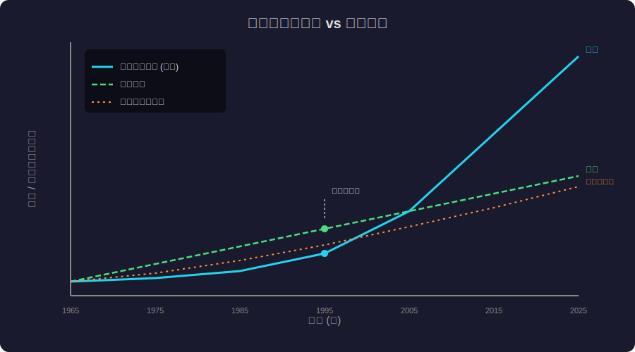
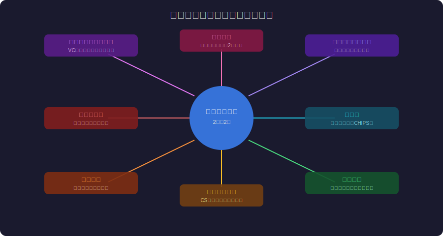
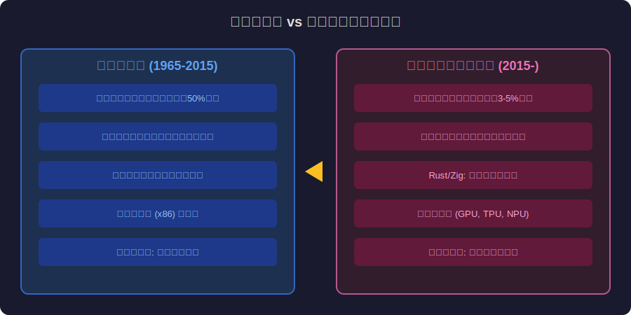

<!-- _class: lead -->
# ムーアの法則の社会学：指数関数的成長が社会を変えるメカニズム

- Moore's Law × Sociology of Exponential Growth
- 
- トランジスタの法則が、社会・経済・文化をどう再形成したか

---

# Agenda

- - 1. ムーアの法則：技術的事実から社会規範へ
- - 2. 指数関数的成長の直感的理解
- - 3. ムーアの法則が生んだ社会的期待
- - 4. 「2年で倍」の呪縛：製品サイクルの加速
- - 5. ムーアの法則の終焉と社会的影響
- - 6. ポスト・ムーア時代の設計思想

---

<!-- _class: lead -->
# ムーアの法則とは

- Chapter 1: Moore's Law as Social Norm

---

# ムーアの法則：技術予測から自己成就予言へ

- - **1965年**: Gordon Moore が「集積回路の素子数は18-24ヶ月で倍増」と予測
- - 元は Electronics 誌の **短い記事** に過ぎなかった
- - しかし半導体業界が **目標** として採用 → 自己成就予言に
- - 60年間、業界全体がこの法則に合わせて投資・研究開発を計画
- - 技術的事実というより **社会的合意** としてのムーアの法則
- - 「法則」ではなく「規範」— 物理法則ではなく社会規範

---

<!-- _class: lead -->
# 指数関数的成長の直感的理解

- Chapter 2: Understanding Exponential Growth

---

# 人間は指数関数を直感的に理解できない

- - **チェス盤の米粒**: 1, 2, 4, 8, ... → 64マス目で **1844京粒**
- - 折り紙を **42回** 折ると月に届く（約38万km）
- - 人間の脳は **線形** に考えるようにできている
- - 「2年で2倍」を10回繰り返すと **1024倍** (20年)
- - 20回で **100万倍** (40年) — これがムーアの法則のスケール
- - iPhone 1台 > 1960年代のNASA全計算力

---

# 指数関数 vs 線形成長

---

<!-- _class: lead -->
# ムーアの法則が生んだ社会的期待

- Chapter 3: Social Expectations

---

# 「計算は無料になる」という社会的信念

- - ムーアの法則 → **「待てば性能が上がり価格が下がる」** という期待
- - ソフトウェア産業の基盤: ハードの非効率をソフトで吸収できる
- - **Wirth の法則**: 「ソフトウェアはハードウェアが速くなるより速く遅くなる」
- - JavaScript が世界を支配できたのはムーアの法則のおかげ
- - Electron (Chromium内蔵) が許容されるのも無限の計算力への信仰
- - この信念が崩れるとき、ソフトウェア産業は根本的に変わる

---

# ムーアの法則の社会的波及効果

---

# 計画的陳腐化：2年サイクルの文化

- - スマートフォンの **2年更新サイクル** = ムーアの法則の社会的投影
- - 「新製品は常に前世代より良い」という消費者期待
- - 製品ライフサイクルが技術サイクルに強制的に同期
- - **ファッション化** するテクノロジー（新型iPhoneの行列）
- - 環境問題: 年間 **5000万トン** の電子廃棄物
- - ムーアの法則が消費文化を根本的に変えた

---

<!-- _class: lead -->
# 「2年で倍」の呪縛

- Chapter 4: The Curse of Doubling

---

# ソフトウェア開発への影響

- - **「最適化は後でいい」症候群**: ハードが速くなるから今は非効率でOK
- - 抽象化レイヤーの無限積層: OS → VM → Container → Serverless
- - **フレームワーク肥大化**: React 18のバンドルサイズ > Windows 95
- - メモリ消費の指数的増加: 1993年 Word (2MB) → 2024年 Slack (1GB)
- - 「ハードが解決する」前提が崩れたとき何が起きるか
- - Rust、Zig の台頭: 効率性への回帰の兆候

---

<!-- _class: lead -->
# ムーアの法則の終焉

- Chapter 5: The End of Moore's Law

---

# 物理的限界への到達

- - **原子スケール**: トランジスタが原子数十個のサイズに到達
- - **量子トンネル効果**: 電子がゲートを通り抜けてリーク電流増大
- - **発熱問題**: クロック周波数は2004年頃から頭打ち（約4GHz）
- - **コスト増大**: 最先端プロセス (2nm) の開発費は **$200億+**
- - シングルスレッド性能の向上は年 **3-5%** に減速
- - 「ムーアの法則は死んだ」— Jensen Huang (NVIDIA CEO, 2022)

---

# ポスト・ムーア時代の社会的影響

- - **格差拡大**: 最先端チップを製造できるのは TSMC, Samsung のみ
- - **地政学的競争**: 半導体が石油に代わる戦略的資源に
- - **ソフトウェアの効率化圧力**: 「ハードが解決する」が通用しない
- - **特化チップ (ASIC) の時代**: GPU, TPU, NPU — 汎用→専用へ
- - **新しいパラダイム**: 量子コンピュータ、ニューロモーフィック
- - ソフトウェアエンジニアに求められるスキルセットの変化

---

<!-- _class: lead -->
# ポスト・ムーア時代の設計思想

- Chapter 6: Post-Moore Design

---

# ムーア時代 vs ポスト・ムーア時代

---

# 効率性ルネサンス

- - **Rust の躍進**: メモリ安全性 + ゼロコスト抽象化
- - **Edge Computing**: データを移動させず処理を近づける
- - **Green Computing**: 電力効率がKPIに（PUE, Carbon-Aware）
- - **アルゴリズムの重要性回帰**: O(n) vs O(n²) が再び重要に
- - **ARM の台頭**: 省電力アーキテクチャの勝利 (Apple Silicon)
- - ムーアの法則に頼らない設計が競争優位に

---

<!-- _class: lead -->
# まとめ：法則の先にあるもの

- ムーアの法則は技術予測ではなく社会規範だった
- 
- 60年間、産業と文化を形成した「2年で倍」の信仰が終わる
- 
- ポスト・ムーア時代のエンジニアに必要なのは
- **効率性への敬意と、指数関数への過信の克服**

