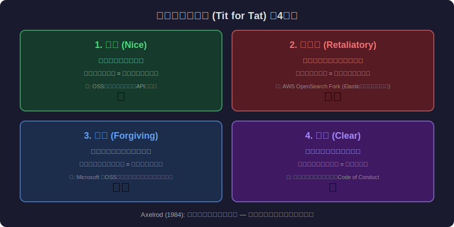
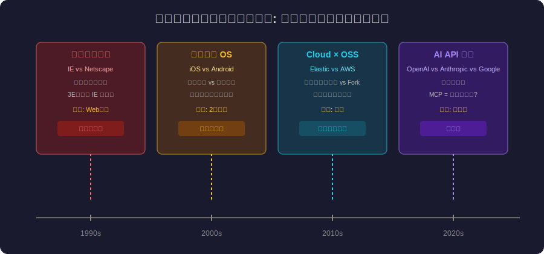

<!-- _class: lead -->
# 囚人のジレンマ × プラットフォーム競争

- Prisoner's Dilemma × Platform Competition
- 
- 協調すれば全員が勝つのに、なぜ裏切りが合理的なのか

---

# Agenda

- - 1. 囚人のジレンマとは
- - 2. プラットフォーム戦争とゲーム理論
- - 3. Embrace, Extend, Extinguish
- - 4. 繰り返しゲーム：しっぺ返し戦略
- - 5. 標準化団体 = 協調の制度化
- - 6. 開発者の戦略的選択

---

<!-- _class: lead -->
# 囚人のジレンマとは

- Chapter 1: Prisoner's Dilemma

---

# 囚人のジレンマの基本構造

- - 2人の容疑者が **別々の部屋** で尋問される
- - **協調**（黙秘）: 両者軽い刑、**裏切り**（自白）: 相手だけ重い刑
- - 両者裏切り → 両者中程度の刑（最悪の集団結果）
- - **ナッシュ均衡**: 両者裏切りが「合理的」だが、両者協調の方が良い
- - 個人の合理性 ≠ 集団の合理性 — 社会的ジレンマの原型
- - 1950年 RAND Corporation で初めて形式化

---

# 囚人のジレンマ: 利得行列

---

<!-- _class: lead -->
# プラットフォーム戦争とゲーム理論

- Chapter 2: Platform Wars

---

# プラットフォーム間の囚人のジレンマ

- - **協調** = 標準規格に準拠、相互運用性を確保
- - **裏切り** = 独自規格でロックイン、囲い込み
- - **ブラウザ戦争** (1990s): IE vs Netscape → 独自拡張の応酬
- - **メッセンジャー** (2010s): 各社が相互接続を拒否 → サイロ化
- - **AI API** (2024-): OpenAI, Anthropic, Google が互換性なし
- - 短期的には裏切りが有利、長期的にはエコシステム全体が縮小

---

# Embrace, Extend, Extinguish

- - Microsoft の有名な3E戦略（1990年代）
- - **Embrace**: オープン標準を表面的に採用（協調の偽装）
- - **Extend**: 独自拡張を追加（差別化 = 静かな裏切り）
- - **Extinguish**: 市場支配で標準を殺す（完全な裏切り）
- - IE の Java 実装、OOXML の ISO 標準化がこのパターン
- - 現代版: Google AMP, React Native の「標準」化圧力

---

<!-- _class: lead -->
# 繰り返しゲーム

- Chapter 3: Iterated Games

---

# しっぺ返し戦略（Tit for Tat）

- - Robert Axelrod (1984): 繰り返し囚人のジレンマのトーナメント
- - **最強の戦略**: しっぺ返し（Tit for Tat）= 最初は協調、以後は相手を模倣
- - **4つの特徴**: 善良、報復的、寛容、明瞭
- - OSSコミュニティでの実践: 最初は貢献、裏切られたらFork
- - ElasticSearch vs AWS: Elasticが裏切り（ライセンス変更）→ AWS がFork（OpenSearch）
- - Redis vs AWS: 同じパターンが繰り返される

<!--
Axelrodのトーナメントは、単純な戦略が複雑な戦略に勝つことを示した。
-->

---

# しっぺ返し戦略の4原則

---

# プラットフォーム戦争の歴史

---

<!-- _class: lead -->
# 標準化団体 = 協調の制度化

- Chapter 4: Standards as Institutions

---

# 協調を強制するメカニズム

- - **W3C / WHATWG**: Web標準の策定 → ブラウザ間の協調を制度化
- - **IETF**: インターネットプロトコル標準 → TCP/IP の成功
- - **OCI**: コンテナ標準 → Docker vs Podman の互換性確保
- - **OpenAPI / GraphQL**: API標準でベンダーロックインを防止
- - 標準化団体 = 囚人のジレンマを **繰り返しゲーム** に変換する装置
- - 裏切りコストを高める（評判低下、エコシステムからの排除）

---

<!-- _class: lead -->
# 開発者の戦略的選択

- Chapter 5: Strategic Choices

---

# プラットフォーム選択のゲーム理論

- - **マルチプラットフォーム**: 協調戦略（Flutter, React Native, Kotlin Multiplatform）
- - **プラットフォーム専用**: 裏切り戦略（SwiftUI, Jetpack Compose）
- - **標準準拠**: 長期協調（Web Components, WASM）
- - **独自拡張依存**: 短期裏切り（ベンダー固有SDK）
- - しっぺ返しの教訓: **最初は標準準拠、裏切られたら移行準備**
- - 「Dependency Inversion」はゲーム理論的にも正しい

---

# 囚人のジレンマを超えて

- - 1. **ゲームのルールを変える**: 標準化 → 協調が合理的になる構造
- - 2. **繰り返しゲーム化**: 長期関係で裏切りコストを高める
- - 3. **評判メカニズム**: GitHub Stars, NPM Downloads が協調のインセンティブ
- - 4. **透明性の確保**: オープンソース = 裏切りが可視化される
- - 5. **抽象化レイヤー**: ベンダー依存を減らし裏切られた時の損失を最小化
- - 6. **協調の文化醸成**: カンファレンス、コミュニティ活動

---

<!-- _class: lead -->
# まとめ：ゲーム理論の知恵

- 短期的には裏切りが合理的に見える
- しかし繰り返しゲームでは協調が勝つ
- 
- プラットフォーム選択は技術選定ではなく戦略選定
- 
- **しっぺ返し: 善良に始め、裏切りには報復し、許すことも忘れない**

