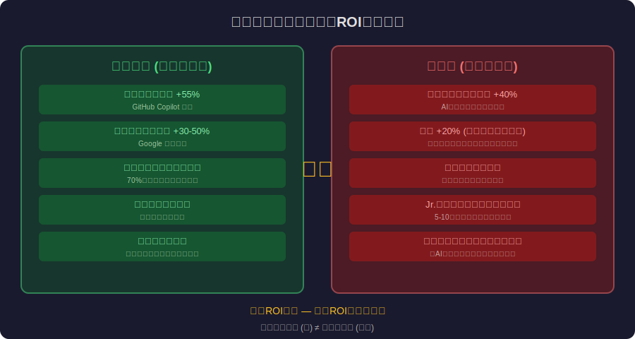
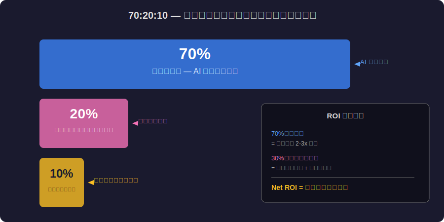

<!-- _class: lead -->
# バイブコーディングの経済学：AIペアプログラミングのROI分析

- Vibe Coding Economics
- 
- 「雰囲気でコードを書く」時代の生産性と品質のトレードオフ

---

# Agenda

- - 1. バイブコーディングとは何か
- - 2. 生産性の数字：本当に速くなったのか
- - 3. 品質コスト：見えない技術的負債
- - 4. スキル格差の経済学
- - 5. 組織への影響：採用と育成
- - 6. 持続可能なバイブコーディング戦略

---

<!-- _class: lead -->
# バイブコーディングとは何か

- Chapter 1: What is Vibe Coding?

---

# バイブコーディング（Andrej Karpathy, 2025）

- - Andrej Karpathy が命名: 「AIに雰囲気で指示してコードを生成」
- - 詳細なロジックを書く代わりに **意図を伝える** だけ
- - 「submitボタンを押したらデータをDBに保存して」→ コード生成
- - 開発者は **レビュアー** の役割に移行
- - GitHub Copilot → Claude Code → Cursor → Devin → 急速に進化
- - 2026年: エンジニアの **70%以上** がAIコーディングツールを使用

---

<!-- _class: lead -->
# 生産性の数字

- Chapter 2: Productivity Numbers

---

# 本当に速くなったのか？

- - GitHub調査: Copilot使用で **タスク完了速度55%向上**
- - Google内部調査: コーディング速度 **30-50%** 改善
- - しかし: **コードレビュー時間は40%増加**
- - バグ修正時間: 生成コードは手書きより **20%多い** バグ
- - 「書く速度」vs「正しく書く速度」の区別が必要
- - **スループット ≠ ベロシティ** — 生産量 ≠ 価値創出

---

# 70:20:10の法則

- - 開発時間の内訳（バイブコーディング時代）:
- - **70%**: コード生成（AI がほぼ自動化）
- - **20%**: レビュー・デバッグ・修正（人間の核心業務）
- - **10%**: 要件理解・設計判断（最も価値の高い知的労働）
- - AI は70%を高速化するが、残り30%は **むしろ複雑化**
- - ROIは70%の効率化 vs 30%の複雑化コストのバランス

---

# バイブコーディングのROIバランス

---

# 70:20:10 開発時間配分

---

<!-- _class: lead -->
# 品質コスト

- Chapter 3: Quality Costs

---

# 見えない技術的負債の蓄積

- - AI生成コードの特徴: **動くが最適ではない**
- - 冗長なコード、不要な依存、非効率なアルゴリズム
- - セキュリティ: AI は **学習データの脆弱パターン** も再現する
- - テスト: AI が書くテストは **ハッピーパスに偏る** 傾向
- - 「とりあえず動く」コードの山 = 将来の **メンテナンスコスト爆発**
- - 短期の生産性向上 vs 長期のメンテナンスコスト — 経済的判断が必要

---

<!-- _class: lead -->
# スキル格差の経済学

- Chapter 4: Skill Gap Economics

---

# 「10x Engineer」格差の拡大

- - AI活用スキルの高いエンジニア → 生産性 **5-10倍** に
- - AI活用スキルの低いエンジニア → 生産性 **ほぼ変わらず**
- - 「コードを書ける人」から「AIに正しく指示できる人」へ
- - **プロンプトエンジニアリング** が新しいスキルセット
- - しかし「AIに正しく指示する」には **深いドメイン知識** が必須
- - 初心者がAIを使う = カーナビに頼りすぎて道を覚えない

---

# Jr.エンジニア問題

- - バイブコーディングで **Jr.エンジニアの学習機会** が減少
- - 「写経」→「AI生成コードのレビュー」に学習プロセスが変化
- - デバッグ能力: 自分で書いていないコードのバグを直す難しさ
- - 「AIが書いたコードを理解できない」エンジニアの出現
- - 5-10年後の **シニアエンジニア不足** リスク
- - 教育投資のROI: 短期コスト vs 長期的な組織能力

---

<!-- _class: lead -->
# 組織への影響

- Chapter 5: Organizational Impact

---

# 採用と育成の変化

- - 「コーディングテスト」の意味が変化（AIを使わせるテスト?）
- - **システム設計力** と **レビュー能力** が評価軸に
- - チーム構成: 少数精鋭 + AI → 大チーム不要?
- - **1人チーム** の台頭（Solopreneur Engineer）
- - マネジメント: AIの出力品質を管理する新しいスキル
- - 組織のAI活用能力が **競争優位** に直結する時代

---

<!-- _class: lead -->
# 持続可能なバイブコーディング戦略

- Chapter 6: Sustainable Strategy

---

# バイブコーディングのベストプラクティス

- - 1. **生成 → レビュー → テスト** のサイクルを必ず回す
- - 2. AIが苦手な領域を理解: セキュリティ、パフォーマンス、エッジケース
- - 3. **コードオーナーシップ**: AI が書いたコードも自分の責任
- - 4. 技術的負債の定量的監視: 複雑度メトリクス、カバレッジ、依存関係
- - 5. Jr.エンジニアの **意図的な学習機会** の設計
- - 6. 「AIに書かせない方が良い」領域を明確にする

---

<!-- _class: lead -->
# まとめ：バイブコーディングの経済的現実

- バイブコーディングは生産性革命であると同時に
- 品質・スキル・組織の構造的課題を生む
- 
- 「AIに書かせる」のは簡単
- 「AIが書いたコードに責任を持つ」のは難しい
- 
- **速度だけでなく、持続可能性を設計せよ**

