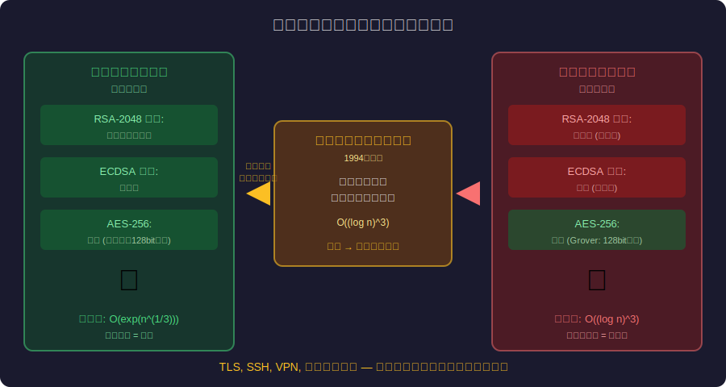
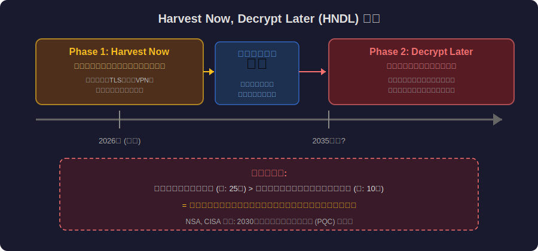
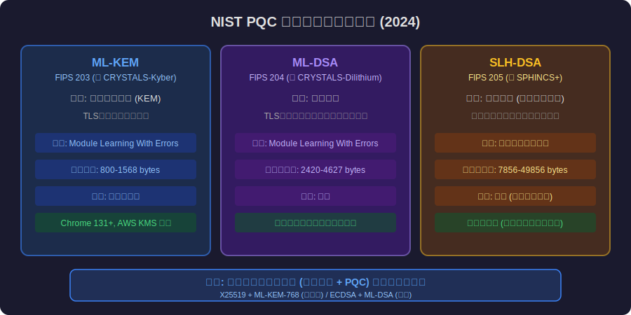

<!-- _class: lead -->
# ポスト量子暗号：量子コンピュータ時代の暗号技術

- Post-Quantum Cryptography
- 
- 量子コンピュータが現在の暗号を破る日に備える


---

# Agenda

- - 1. 量子コンピュータの脅威
- - 2. ショアのアルゴリズムとRSAの終焉
- - 3. 「Harvest Now, Decrypt Later」攻撃
- - 4. NIST PQC標準化（2024年完了）
- - 5. 格子暗号・ハッシュベース暗号の仕組み
- - 6. エンジニアが今すぐやるべきこと


---

<!-- _class: lead -->
# 量子コンピュータの脅威

- Chapter 1: The Quantum Threat


---

# なぜ量子コンピュータが暗号を破るのか

- - 古典コンピュータ: ビットは **0 or 1**
- - 量子コンピュータ: 量子ビット（qubit）は **0と1の重ね合わせ**
- - N個のqubitで **2^N** の状態を同時に処理（量子並列性）
- - RSA-2048を古典PCで解読: **宇宙の年齢以上**
- - 十分な量子PCで解読: **数時間**（理論上）
- - 2024年時点: IBM 1,121 qubit、Google 105 qubit（まだ不十分）


---

# 量子コンピュータの暗号への脅威




---

<!-- _class: lead -->
# ショアのアルゴリズム

- Chapter 2: Shor's Algorithm


---

# ショアのアルゴリズム（1994）

- - Peter Shor が1994年に発見した **素因数分解の量子アルゴリズム**
- - RSA、楕円曲線暗号（ECDSA）、DH鍵交換を全て破る
- - 古典: 素因数分解は O(exp(n^(1/3))) — 指数時間
- - 量子: ショアのアルゴリズムは O((log n)^3) — 多項式時間
- - **TLSの基盤** (RSA, ECDHE) が全て脆弱に
- - HTTPS, SSH, VPN, デジタル署名 — 全てが影響を受ける

<!--
ショアのアルゴリズムは30年前に発見されたが、十分な量子ビットのコンピュータがまだ存在しないため実行されていない。
-->

---

<!-- _class: lead -->
# Harvest Now, Decrypt Later

- Chapter 3: HNDL Attack


---

# 「今収穫し、後で復号する」攻撃

- - 国家レベルの攻撃者は **今の暗号化通信を保存** している
- - 量子コンピュータが実用化されたら **過去の通信を復号**
- - 今日のTLS通信が10年後に読まれる可能性
- - 特に危険: 医療記録、国家機密、知的財産、個人情報
- - 暗号の有効期限 > 量子コンピュータ到達時期 → **今から対策が必要**
- - NSA, CISA: 「2030年までにPQCへ移行」を推奨


---

# HNDL攻撃の仕組み




---

<!-- _class: lead -->
# NIST PQC標準化

- Chapter 4: NIST PQC Standards


---

# NIST PQC標準（2024年8月発表）

- - **ML-KEM** (FIPS 203): 格子ベースの鍵カプセル化（旧 CRYSTALS-Kyber）
- - **ML-DSA** (FIPS 204): 格子ベースの電子署名（旧 CRYSTALS-Dilithium）
- - **SLH-DSA** (FIPS 205): ハッシュベースの電子署名（旧 SPHINCS+）
- - 7年間の国際公募・評価を経て標準化
- - **ハイブリッドモード**: 古典暗号 + PQC を並行使用（移行期）
- - Chrome 131+ / AWS KMS / Cloudflare がすでにML-KEMをサポート


---

# NIST PQC 標準アルゴリズム比較




---

<!-- _class: lead -->
# 格子暗号の仕組み

- Chapter 5: Lattice-Based Cryptography


---

# 格子問題：量子でも解けない数学問題

- - **格子 (Lattice)**: N次元空間の規則的な点の集合
- - **最短ベクトル問題 (SVP)**: 格子上で最も短いベクトルを見つける
- - 古典コンピュータでも量子コンピュータでも **指数時間**
- - ショアのアルゴリズムが効かない（素因数分解とは別の数学構造）
- - ML-KEM: 「ノイズ付き連立一次方程式」を解く困難さに基づく
- - 鍵サイズは RSA より大きい（800-1500 bytes）がまだ実用的


---

# PQC移行のコード例

- - ハイブリッドTLS: 古典 + PQC を同時に使用する移行パターン

```typescript
// Hybrid Key Exchange: ECDH + ML-KEM
const hybridKey = await crypto.subtle.generateKey(
  { name: 'X25519-ML-KEM-768' }, // Hybrid mode
  true, ['deriveKey']
);
// TLS 1.3 with hybrid key exchange
// Classical ECDH protects against classical attacks
// ML-KEM protects against quantum attacks
// Both must be broken to compromise the session
```


---

<!-- _class: lead -->
# エンジニアが今すぐやるべきこと

- Chapter 6: Action Items


---

# PQC移行チェックリスト

- - 1. **暗号資産の棚卸し**: システムで使用している暗号アルゴリズムを列挙
- - 2. **データの有効期限評価**: 保護が必要な期間 > 量子脅威タイムライン?
- - 3. **Crypto Agility**: 暗号アルゴリズムを容易に切り替えられる設計
- - 4. **ハイブリッドモード**: 古典 + PQC の並行使用で安全に移行
- - 5. **ライブラリ更新**: OpenSSL 3.x, liboqs, AWS KMS PQC 対応
- - 6. **TLS設定確認**: サーバーがPQC鍵交換をサポートしているか


---

<!-- _class: lead -->
# まとめ：量子の脅威に備える

- 量子コンピュータはまだ来ていない
- しかし「Harvest Now, Decrypt Later」は今日始まっている
- 
- NIST PQC標準は2024年に確定した
- 移行の技術は既に存在する
- 
- **問題は「いつ移行するか」ではなく「いつ始めるか」**

