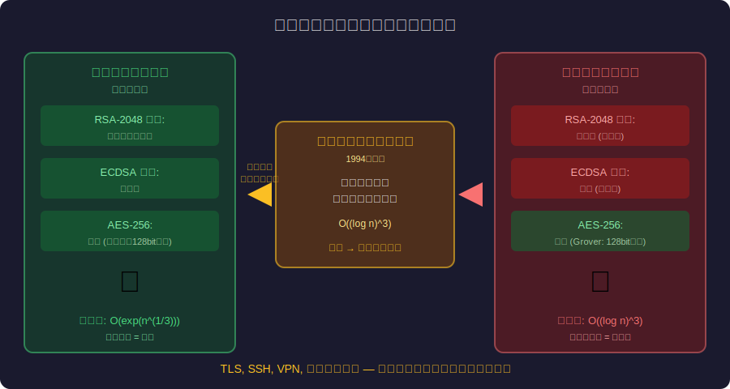
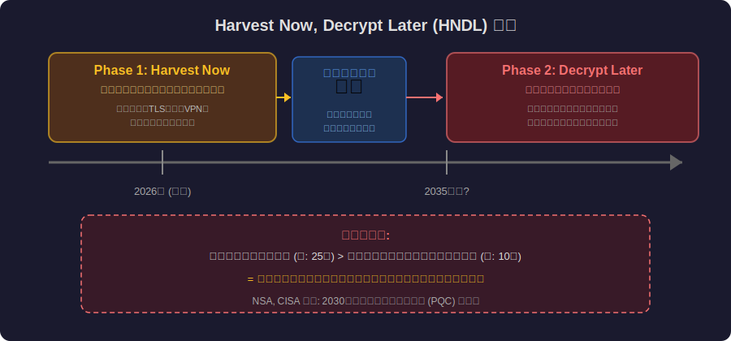
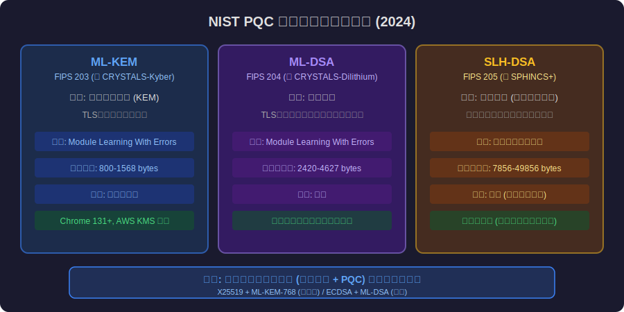

<!-- _class: lead -->
# ポスト量子暗号：量子コンピュータ時代の暗号技術

- Post-Quantum Cryptography
- 
- 量子コンピュータが現在の暗号を破る日に備える


---

# Agenda

> *量子脅威→ショア→HNDL攻撃→NIST標準→格子暗号→対策の6章*

- - 1. 量子コンピュータの脅威
- - 2. ショアのアルゴリズムとRSAの終焉
- - 3. 「Harvest Now, Decrypt Later」攻撃
- - 4. NIST PQC標準化（2024年完了）
- - 5. 格子暗号・ハッシュベース暗号の仕組み
- - 6. エンジニアが今すぐやるべきこと


---

<!-- _class: lead -->
# 量子コンピュータの脅威

- Chapter 1: The Quantum Threat


---

# なぜ量子コンピュータが暗号を破るのか

> *量子並列性でRSA解読が数時間に短縮*

- <svg viewBox="0 0 800 360" style="max-height:70vh;max-width:100%;display:block;margin:0 auto;" xmlns="http://www.w3.org/2000/svg"><rect width="800" height="360" fill="#1a1a2e"/><text x="400" y="35" fill="#f9a825" font-size="18" font-family="sans-serif" text-anchor="middle" font-weight="bold">古典 vs 量子：暗号解読の処理能力比較</text><rect x="40" y="60" width="320" height="260" rx="12" fill="#16213e" stroke="#f9a825" stroke-width="2"/><text x="200" y="92" fill="#f9a825" font-size="16" font-family="sans-serif" text-anchor="middle" font-weight="bold">古典コンピュータ</text><text x="200" y="118" fill="#ffffff" font-size="13" font-family="sans-serif" text-anchor="middle">ビット: 0 または 1（確定値）</text><rect x="80" y="133" width="38" height="38" rx="5" fill="#f9a825"/><text x="99" y="158" fill="#1a1a2e" font-size="18" font-family="sans-serif" text-anchor="middle" font-weight="bold">0</text><rect x="133" y="133" width="38" height="38" rx="5" fill="#f9a825"/><text x="152" y="158" fill="#1a1a2e" font-size="18" font-family="sans-serif" text-anchor="middle" font-weight="bold">1</text><rect x="186" y="133" width="38" height="38" rx="5" fill="#f9a825"/><text x="205" y="158" fill="#1a1a2e" font-size="18" font-family="sans-serif" text-anchor="middle" font-weight="bold">0</text><rect x="239" y="133" width="38" height="38" rx="5" fill="#f9a825"/><text x="258" y="158" fill="#1a1a2e" font-size="18" font-family="sans-serif" text-anchor="middle" font-weight="bold">1</text><text x="200" y="205" fill="#ffffff" font-size="12" font-family="sans-serif" text-anchor="middle">N bitで 1つの状態を表現</text><text x="200" y="228" fill="#ffffff" font-size="13" font-family="sans-serif" text-anchor="middle">RSA-2048解読時間:</text><text x="200" y="252" fill="#e91e63" font-size="16" font-family="sans-serif" text-anchor="middle" font-weight="bold">宇宙の年齢以上</text><text x="200" y="273" fill="#aaaaaa" font-size="12" font-family="sans-serif" text-anchor="middle">指数時間: O(exp(n^1/3))</text><text x="200" y="300" fill="#e91e63" font-size="13" font-family="sans-serif" text-anchor="middle" font-weight="bold">SAFE (現在)</text><rect x="440" y="60" width="320" height="260" rx="12" fill="#16213e" stroke="#e91e63" stroke-width="2"/><text x="600" y="92" fill="#e91e63" font-size="16" font-family="sans-serif" text-anchor="middle" font-weight="bold">量子コンピュータ</text><text x="600" y="118" fill="#ffffff" font-size="13" font-family="sans-serif" text-anchor="middle">Qubit: 0と1の重ね合わせ</text><ellipse cx="558" cy="160" rx="26" ry="26" fill="none" stroke="#e91e63" stroke-width="2.5"/><text x="558" y="167" fill="#e91e63" font-size="20" font-family="sans-serif" text-anchor="middle">|ψ⟩</text><ellipse cx="642" cy="160" rx="26" ry="26" fill="none" stroke="#e91e63" stroke-width="2.5"/><text x="642" y="167" fill="#e91e63" font-size="20" font-family="sans-serif" text-anchor="middle">|ψ⟩</text><text x="600" y="210" fill="#ffffff" font-size="12" font-family="sans-serif" text-anchor="middle">N qubitで 2^N 状態を同時処理</text><text x="600" y="232" fill="#ffffff" font-size="13" font-family="sans-serif" text-anchor="middle">RSA-2048解読時間:</text><text x="600" y="255" fill="#f9a825" font-size="16" font-family="sans-serif" text-anchor="middle" font-weight="bold">数時間（理論上）</text><text x="600" y="276" fill="#aaaaaa" font-size="12" font-family="sans-serif" text-anchor="middle">多項式時間: O((log n)^3)</text><text x="600" y="300" fill="#f9a825" font-size="13" font-family="sans-serif" text-anchor="middle" font-weight="bold">VULNERABLE (将来)</text><polygon points="382,190 422,175 422,205" fill="#f9a825"/><line x1="360" y1="190" x2="422" y2="190" stroke="#f9a825" stroke-width="2.5"/></svg>
- - 古典コンピュータ: ビットは **0 or 1**
- - 量子コンピュータ: 量子ビット（qubit）は **0と1の重ね合わせ**
- - N個のqubitで **2^N** の状態を同時に処理（量子並列性）
- - RSA-2048を古典PCで解読: **宇宙の年齢以上**
- - 十分な量子PCで解読: **数時間**（理論上）
- - 2024年時点: IBM 1,121 qubit、Google 105 qubit（まだ不十分）


---

# 量子コンピュータの暗号への脅威




---

<!-- _class: lead -->
# ショアのアルゴリズム

- Chapter 2: Shor's Algorithm


---

# ショアのアルゴリズム（1994）

> *RSA・ECDSA・DH全滅—TLS基盤が根本から崩壊する*

- - Peter Shor が1994年に発見した **素因数分解の量子アルゴリズム**
- - RSA、楕円曲線暗号（ECDSA）、DH鍵交換を全て破る
- - 古典: 素因数分解は O(exp(n^(1/3))) — 指数時間
- - 量子: ショアのアルゴリズムは O((log n)^3) — 多項式時間
- - **TLSの基盤** (RSA, ECDHE) が全て脆弱に
- - HTTPS, SSH, VPN, デジタル署名 — 全てが影響を受ける

<!--
ショアのアルゴリズムは30年前に発見されたが、十分な量子ビットのコンピュータがまだ存在しないため実行されていない。
-->

---

<!-- _class: lead -->
# Harvest Now, Decrypt Later

- Chapter 3: HNDL Attack


---

# 「今収穫し、後で復号する」攻撃

> *今日のTLS通信が10年後に復号されるリスク*

- - 国家レベルの攻撃者は **今の暗号化通信を保存** している
- - 量子コンピュータが実用化されたら **過去の通信を復号**
- - 今日のTLS通信が10年後に読まれる可能性
- - 特に危険: 医療記録、国家機密、知的財産、個人情報
- - 暗号の有効期限 > 量子コンピュータ到達時期 → **今から対策が必要**
- - NSA, CISA: 「2030年までにPQCへ移行」を推奨


---

# HNDL攻撃の仕組み




---

<!-- _class: lead -->
# NIST PQC標準化

- Chapter 4: NIST PQC Standards


---

# NIST PQC標準（2024年8月発表）

> *2024年確定：ML-KEM等3標準が移行の基盤*

- - **ML-KEM** (FIPS 203): 格子ベースの鍵カプセル化（旧 CRYSTALS-Kyber）
- - **ML-DSA** (FIPS 204): 格子ベースの電子署名（旧 CRYSTALS-Dilithium）
- - **SLH-DSA** (FIPS 205): ハッシュベースの電子署名（旧 SPHINCS+）
- - 7年間の国際公募・評価を経て標準化
- - **ハイブリッドモード**: 古典暗号 + PQC を並行使用（移行期）
- - Chrome 131+ / AWS KMS / Cloudflare がすでにML-KEMをサポート


---

# NIST PQC 標準アルゴリズム比較




---

<!-- _class: lead -->
# 格子暗号の仕組み

- Chapter 5: Lattice-Based Cryptography


---

# 格子問題：量子でも解けない数学問題

> *格子問題は量子でも指数時間—移行の数学的根拠*

- <svg viewBox="0 0 800 340" style="max-height:70vh;max-width:100%;display:block;margin:0 auto;" xmlns="http://www.w3.org/2000/svg"><rect width="800" height="340" fill="#1a1a2e"/><text x="400" y="30" fill="#f9a825" font-size="17" font-family="sans-serif" text-anchor="middle" font-weight="bold">格子暗号の基礎：最短ベクトル問題 (SVP)</text><rect x="30" y="50" width="360" height="270" rx="10" fill="#16213e" stroke="#f9a825" stroke-width="1.5"/><text x="210" y="75" fill="#f9a825" font-size="14" font-family="sans-serif" text-anchor="middle" font-weight="bold">格子 (Lattice) の可視化</text><!-- Grid points --><circle cx="80" cy="110" r="4" fill="#555"/><circle cx="130" cy="110" r="4" fill="#555"/><circle cx="180" cy="110" r="4" fill="#555"/><circle cx="230" cy="110" r="4" fill="#555"/><circle cx="280" cy="110" r="4" fill="#555"/><circle cx="330" cy="110" r="4" fill="#555"/><circle cx="80" cy="160" r="4" fill="#555"/><circle cx="130" cy="160" r="4" fill="#555"/><circle cx="180" cy="160" r="4" fill="#ffffff" stroke="#f9a825" stroke-width="2"/><circle cx="230" cy="160" r="4" fill="#555"/><circle cx="280" cy="160" r="4" fill="#555"/><circle cx="330" cy="160" r="4" fill="#555"/><circle cx="80" cy="210" r="4" fill="#555"/><circle cx="130" cy="210" r="4" fill="#555"/><circle cx="180" cy="210" r="4" fill="#555"/><circle cx="230" cy="210" r="4" fill="#555"/><circle cx="280" cy="210" r="4" fill="#555"/><circle cx="330" cy="210" r="4" fill="#555"/><circle cx="80" cy="260" r="4" fill="#555"/><circle cx="130" cy="260" r="4" fill="#555"/><circle cx="180" cy="260" r="4" fill="#555"/><circle cx="230" cy="260" r="4" fill="#555"/><circle cx="280" cy="260" r="4" fill="#555"/><circle cx="330" cy="260" r="4" fill="#555"/><!-- Origin --><!-- Shortest vector -->><line x1="180" y1="160" x2="230" y2="110" stroke="#e91e63" stroke-width="2.5"/><polygon points="228,112 240,103 232,118" fill="#e91e63"/><text x="225" y="100" fill="#e91e63" font-size="12" font-family="sans-serif">最短ベクトル</text><!-- Another vector --><line x1="180" y1="160" x2="330" y2="110" stroke="#888" stroke-width="1.5" stroke-dasharray="4,3"/><text x="210" y="248" fill="#ffffff" font-size="12" font-family="sans-serif" text-anchor="middle">「最も近い格子点」を見つけるのが困難</text><text x="210" y="268" fill="#aaaaaa" font-size="11" font-family="sans-serif" text-anchor="middle">N次元ではさらに指数的に難しくなる</text><rect x="420" y="50" width="360" height="270" rx="10" fill="#16213e" stroke="#e91e63" stroke-width="1.5"/><text x="600" y="75" fill="#e91e63" font-size="14" font-family="sans-serif" text-anchor="middle" font-weight="bold">なぜ量子でも解けないのか</text><text x="440" y="108" fill="#ffffff" font-size="13" font-family="sans-serif">ショアのアルゴリズム:</text><text x="440" y="128" fill="#aaaaaa" font-size="12" font-family="sans-serif">  素因数分解に特化</text><text x="440" y="148" fill="#f9a825" font-size="12" font-family="sans-serif">  → RSA/ECCを破れる</text><text x="440" y="175" fill="#ffffff" font-size="13" font-family="sans-serif">格子問題 (SVP/CVP):</text><text x="440" y="195" fill="#aaaaaa" font-size="12" font-family="sans-serif">  幾何学的探索問題</text><text x="440" y="215" fill="#f9a825" font-size="12" font-family="sans-serif">  → 量子でも指数時間</text><rect x="440" y="235" width="320" height="70" rx="8" fill="#1a1a2e" stroke="#f9a825" stroke-width="1.5"/><text x="600" y="258" fill="#f9a825" font-size="13" font-family="sans-serif" text-anchor="middle" font-weight="bold">Post-Quantum Security</text><text x="600" y="278" fill="#ffffff" font-size="12" font-family="sans-serif" text-anchor="middle">ML-KEM / ML-DSA / SLH-DSA</text><text x="600" y="296" fill="#aaaaaa" font-size="11" font-family="sans-serif" text-anchor="middle">NIST標準 2024年確定</text></svg>
- - **格子 (Lattice)**: N次元空間の規則的な点の集合
- - **最短ベクトル問題 (SVP)**: 格子上で最も短いベクトルを見つける
- - 古典コンピュータでも量子コンピュータでも **指数時間**
- - ショアのアルゴリズムが効かない（素因数分解とは別の数学構造）
- - ML-KEM: 「ノイズ付き連立一次方程式」を解く困難さに基づく
- - 鍵サイズは RSA より大きい（800-1500 bytes）がまだ実用的


---

# PQC移行のコード例

- - ハイブリッドTLS: 古典 + PQC を同時に使用する移行パターン


---

# PQC移行のコード例（コード例）

```typescript
// Hybrid Key Exchange: ECDH + ML-KEM
const hybridKey = await crypto.subtle.generateKey(
  { name: 'X25519-ML-KEM-768' }, // Hybrid mode
  true, ['deriveKey']
);
// TLS 1.3 with hybrid key exchange
// Classical ECDH protects against classical attacks
// ML-KEM protects against quantum attacks
// Both must be broken to compromise the session
```


---

<!-- _class: lead -->
# エンジニアが今すぐやるべきこと

- Chapter 6: Action Items


---

# PQC移行チェックリスト

> *2030年期限：今から棚卸しを始めなければ間に合わない*

- <svg viewBox="0 0 800 220" style="max-height:70vh;max-width:100%;display:block;margin:0 auto;" xmlns="http://www.w3.org/2000/svg"><rect width="800" height="220" fill="#1a1a2e"/><text x="400" y="28" fill="#f9a825" font-size="16" font-family="sans-serif" text-anchor="middle" font-weight="bold">PQC移行フェーズ概要</text><rect x="30" y="45" width="110" height="155" rx="8" fill="#16213e" stroke="#f9a825" stroke-width="2"/><text x="85" y="68" fill="#f9a825" font-size="12" font-family="sans-serif" text-anchor="middle" font-weight="bold">1. 棚卸し</text><text x="85" y="90" fill="#ffffff" font-size="10" font-family="sans-serif" text-anchor="middle">暗号資産の</text><text x="85" y="107" fill="#ffffff" font-size="10" font-family="sans-serif" text-anchor="middle">特定・分類</text><text x="85" y="130" fill="#aaaaaa" font-size="10" font-family="sans-serif" text-anchor="middle">今すぐ</text><rect x="165" y="45" width="110" height="155" rx="8" fill="#16213e" stroke="#f9a825" stroke-width="1.5"/><text x="220" y="68" fill="#f9a825" font-size="12" font-family="sans-serif" text-anchor="middle" font-weight="bold">2. 評価</text><text x="220" y="90" fill="#ffffff" font-size="10" font-family="sans-serif" text-anchor="middle">データ有効期限</text><text x="220" y="107" fill="#ffffff" font-size="10" font-family="sans-serif" text-anchor="middle">vs 脅威タイムライン</text><text x="220" y="130" fill="#aaaaaa" font-size="10" font-family="sans-serif" text-anchor="middle">6ヶ月以内</text><rect x="300" y="45" width="110" height="155" rx="8" fill="#16213e" stroke="#f9a825" stroke-width="1.5"/><text x="355" y="68" fill="#f9a825" font-size="12" font-family="sans-serif" text-anchor="middle" font-weight="bold">3. 設計</text><text x="355" y="90" fill="#ffffff" font-size="10" font-family="sans-serif" text-anchor="middle">Crypto Agility</text><text x="355" y="107" fill="#ffffff" font-size="10" font-family="sans-serif" text-anchor="middle">アーキテクチャ</text><text x="355" y="130" fill="#aaaaaa" font-size="10" font-family="sans-serif" text-anchor="middle">1年以内</text><rect x="435" y="45" width="110" height="155" rx="8" fill="#16213e" stroke="#e91e63" stroke-width="1.5"/><text x="490" y="68" fill="#e91e63" font-size="12" font-family="sans-serif" text-anchor="middle" font-weight="bold">4. ハイブリッド</text><text x="490" y="90" fill="#ffffff" font-size="10" font-family="sans-serif" text-anchor="middle">古典+PQC</text><text x="490" y="107" fill="#ffffff" font-size="10" font-family="sans-serif" text-anchor="middle">並行移行</text><text x="490" y="130" fill="#aaaaaa" font-size="10" font-family="sans-serif" text-anchor="middle">2025-2027</text><rect x="570" y="45" width="110" height="155" rx="8" fill="#16213e" stroke="#e91e63" stroke-width="1.5"/><text x="625" y="68" fill="#e91e63" font-size="12" font-family="sans-serif" text-anchor="middle" font-weight="bold">5. 完全移行</text><text x="625" y="90" fill="#ffffff" font-size="10" font-family="sans-serif" text-anchor="middle">PQC専用</text><text x="625" y="107" fill="#ffffff" font-size="10" font-family="sans-serif" text-anchor="middle">古典廃止</text><text x="625" y="130" fill="#aaaaaa" font-size="10" font-family="sans-serif" text-anchor="middle">2027-2030</text><rect x="705" y="45" width="80" height="155" rx="8" fill="#16213e" stroke="#e91e63" stroke-width="2"/><text x="745" y="68" fill="#e91e63" font-size="12" font-family="sans-serif" text-anchor="middle" font-weight="bold">6. 監査</text><text x="745" y="90" fill="#ffffff" font-size="10" font-family="sans-serif" text-anchor="middle">継続的</text><text x="745" y="107" fill="#ffffff" font-size="10" font-family="sans-serif" text-anchor="middle">更新体制</text><text x="745" y="130" fill="#aaaaaa" font-size="10" font-family="sans-serif" text-anchor="middle">継続</text><polygon points="145,122 163,115 163,129" fill="#f9a825"/><polygon points="279,122 297,115 297,129" fill="#f9a825"/><polygon points="413,122 432,115 432,129" fill="#f9a825"/><polygon points="548,122 568,115 568,129" fill="#e91e63"/><polygon points="683,122 703,115 703,129" fill="#e91e63"/></svg>
- - 1. **暗号資産の棚卸し**: システムで使用している暗号アルゴリズムを列挙
- - 2. **データの有効期限評価**: 保護が必要な期間 > 量子脅威タイムライン?
- - 3. **Crypto Agility**: 暗号アルゴリズムを容易に切り替えられる設計
- - 4. **ハイブリッドモード**: 古典 + PQC の並行使用で安全に移行
- - 5. **ライブラリ更新**: OpenSSL 3.x, liboqs, AWS KMS PQC 対応
- - 6. **TLS設定確認**: サーバーがPQC鍵交換をサポートしているか


---

<!-- _class: lead -->
# まとめ：量子の脅威に備える

- 量子コンピュータはまだ来ていない
- しかし「Harvest Now, Decrypt Later」は今日始まっている
- 
- NIST PQC標準は2024年に確定した
- 移行の技術は既に存在する
- 
- **問題は「いつ移行するか」ではなく「いつ始めるか」**

