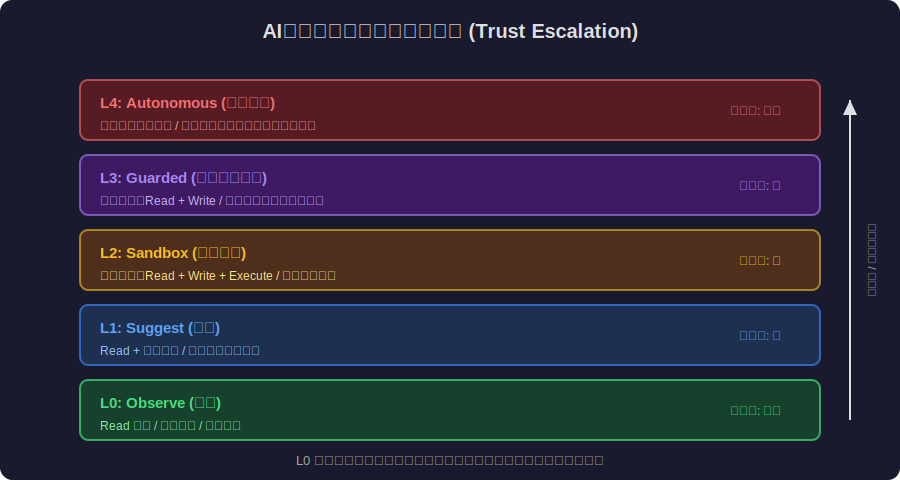
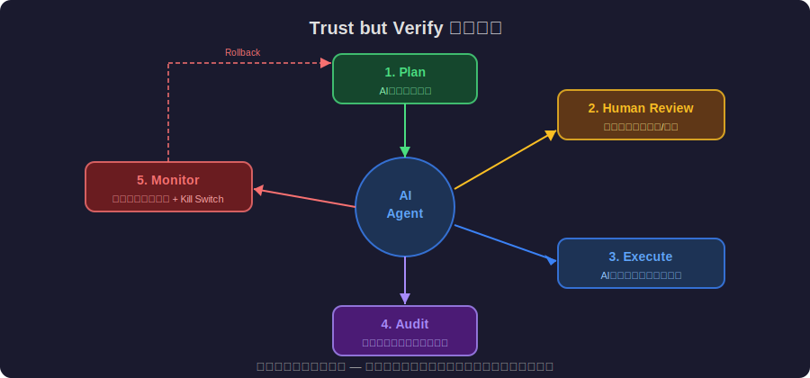
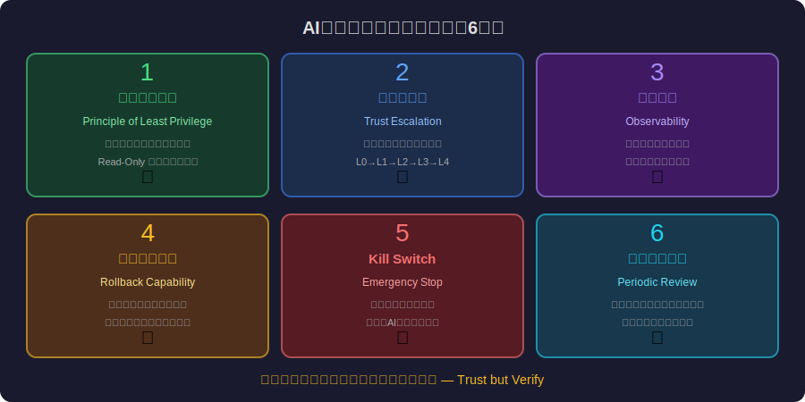

<!-- _class: lead -->
# AIエージェントの信頼問題：自律型AIをどう信頼するか

- AI Agent Trust Problem
- 
- 自律的に行動するAIに、どこまで権限を委譲すべきか


---

# Agenda

- - 1. AIエージェントの台頭
- - 2. 信頼の哲学：人間は何を信頼しているのか
- - 3. AIエージェントの権限設計
- - 4. 「信頼するが検証する」パターン
- - 5. 事故事例と教訓
- - 6. 信頼のエンジニアリング


---

<!-- _class: lead -->
# AIエージェントの台頭

- Chapter 1: Rise of AI Agents


---

# 2026年: AIエージェントの時代

- - **Claude Code**: 自律的にコードを読み書き、テストを実行
- - **Devin**: AIソフトウェアエンジニア（タスクを自律的に完了）
- - **AutoGPT / CrewAI**: 複数エージェントの協調動作
- - **MCP (Model Context Protocol)**: エージェントのツール統合標準
- - 共通点: AIが **自律的に判断し行動** する
- - 問題: 自律的な行動を **どこまで信頼** できるのか


---

<!-- _class: lead -->
# 信頼の哲学

- Chapter 2: Philosophy of Trust


---

# 信頼とは何か

- <svg viewBox="0 0 800 300" style="max-height:70vh;max-width:100%;display:block;margin:0 auto;" xmlns="http://www.w3.org/2000/svg"><rect width="800" height="300" fill="#1a1a2e"/><text x="400" y="30" fill="#f9a825" font-size="17" font-family="sans-serif" text-anchor="middle" font-weight="bold">信頼スペクトラム：過信 ↔ 不信</text><defs><linearGradient id="trustGrad" x1="0" y1="0" x2="1" y2="0"><stop offset="0%" stop-color="#e91e63"/><stop offset="50%" stop-color="#f9a825"/><stop offset="100%" stop-color="#e91e63"/></linearGradient></defs><rect x="60" y="60" width="680" height="50" rx="25" fill="url(#trustGrad)" opacity="0.85"/><text x="100" y="90" fill="#ffffff" font-size="13" font-family="sans-serif" text-anchor="middle" font-weight="bold">過信</text><text x="400" y="90" fill="#ffffff" font-size="13" font-family="sans-serif" text-anchor="middle" font-weight="bold">適切な信頼</text><text x="700" y="90" fill="#ffffff" font-size="13" font-family="sans-serif" text-anchor="middle" font-weight="bold">不信</text><line x1="400" y1="55" x2="400" y2="175" stroke="#f9a825" stroke-width="2.5" stroke-dasharray="5,3"/><circle cx="400" cy="85" r="18" fill="none" stroke="#ffffff" stroke-width="3"/><text x="250" y="140" fill="#e91e63" font-size="13" font-family="sans-serif" text-anchor="middle">Automation Bias</text><text x="250" y="158" fill="#aaaaaa" font-size="11" font-family="sans-serif" text-anchor="middle">自動化された判断を</text><text x="250" y="173" fill="#aaaaaa" font-size="11" font-family="sans-serif" text-anchor="middle">無批判に受け入れる</text><text x="550" y="140" fill="#e91e63" font-size="13" font-family="sans-serif" text-anchor="middle">Under-trust</text><text x="550" y="158" fill="#aaaaaa" font-size="11" font-family="sans-serif" text-anchor="middle">AIの価値を活かせず</text><text x="550" y="173" fill="#aaaaaa" font-size="11" font-family="sans-serif" text-anchor="middle">競争劣位になる</text><text x="400" y="140" fill="#f9a825" font-size="13" font-family="sans-serif" text-anchor="middle" font-weight="bold">Appropriate Trust</text><text x="400" y="158" fill="#ffffff" font-size="11" font-family="sans-serif" text-anchor="middle">能力範囲と限界を</text><text x="400" y="173" fill="#ffffff" font-size="11" font-family="sans-serif" text-anchor="middle">正確に理解する</text><rect x="60" y="195" width="200" height="80" rx="8" fill="#16213e" stroke="#e91e63" stroke-width="1.5"/><text x="160" y="220" fill="#e91e63" font-size="13" font-family="sans-serif" text-anchor="middle" font-weight="bold">過信の危険</text><text x="160" y="242" fill="#ffffff" font-size="11" font-family="sans-serif" text-anchor="middle">テスラ Autopilot事故</text><text x="160" y="260" fill="#ffffff" font-size="11" font-family="sans-serif" text-anchor="middle">AI医療誤診の見落とし</text><rect x="300" y="195" width="200" height="80" rx="8" fill="#16213e" stroke="#f9a825" stroke-width="2"/><text x="400" y="220" fill="#f9a825" font-size="13" font-family="sans-serif" text-anchor="middle" font-weight="bold">目標状態</text><text x="400" y="242" fill="#ffffff" font-size="11" font-family="sans-serif" text-anchor="middle">能力 × 誠実さ × 予測可能性</text><text x="400" y="260" fill="#ffffff" font-size="11" font-family="sans-serif" text-anchor="middle">を定量化して信頼を設計</text><rect x="540" y="195" width="200" height="80" rx="8" fill="#16213e" stroke="#e91e63" stroke-width="1.5"/><text x="640" y="220" fill="#e91e63" font-size="13" font-family="sans-serif" text-anchor="middle" font-weight="bold">不信の危険</text><text x="640" y="242" fill="#ffffff" font-size="11" font-family="sans-serif" text-anchor="middle">競争力の喪失</text><text x="640" y="260" fill="#ffffff" font-size="11" font-family="sans-serif" text-anchor="middle">AIの恩恵を受けられない</text></svg>
- - **信頼 = 脆弱性の受容**: 相手が裏切る可能性を受け入れること
- - 人間の信頼は **能力 × 誠実さ × 予測可能性** で構成
- - AI に「誠実さ」はあるか? → ない。しかし「予測可能性」はある
- - **適切な信頼** (Appropriate Trust): 過信でも不信でもない適度な信頼
- - 「AIを信頼する」= 「AIの能力範囲と限界を正確に理解する」
- - Over-trust (過信) と Under-trust (不信) の両方が危険


---

# 人間がAIを過信するメカニズム

- <svg viewBox="0 0 800 300" style="max-height:70vh;max-width:100%;display:block;margin:0 auto;" xmlns="http://www.w3.org/2000/svg"><rect width="800" height="300" fill="#1a1a2e"/><text x="400" y="30" fill="#f9a825" font-size="17" font-family="sans-serif" text-anchor="middle" font-weight="bold">人間がAIを過信するバイアスチェーン</text><rect x="30" y="55" width="130" height="90" rx="10" fill="#16213e" stroke="#e91e63" stroke-width="2"/><text x="95" y="85" fill="#e91e63" font-size="12" font-family="sans-serif" text-anchor="middle" font-weight="bold">Automation</text><text x="95" y="101" fill="#e91e63" font-size="12" font-family="sans-serif" text-anchor="middle" font-weight="bold">Bias</text><text x="95" y="122" fill="#ffffff" font-size="11" font-family="sans-serif" text-anchor="middle">自動化判断を</text><text x="95" y="138" fill="#ffffff" font-size="11" font-family="sans-serif" text-anchor="middle">無批判に信頼</text><polygon points="162,100 182,92 182,108" fill="#e91e63"/><rect x="185" y="55" width="130" height="90" rx="10" fill="#16213e" stroke="#e91e63" stroke-width="1.5"/><text x="250" y="85" fill="#e91e63" font-size="12" font-family="sans-serif" text-anchor="middle" font-weight="bold">流暢さ</text><text x="250" y="101" fill="#e91e63" font-size="12" font-family="sans-serif" text-anchor="middle" font-weight="bold">バイアス</text><text x="250" y="122" fill="#ffffff" font-size="11" font-family="sans-serif" text-anchor="middle">自然な文章</text><text x="250" y="138" fill="#ffffff" font-size="11" font-family="sans-serif" text-anchor="middle">= 正しい内容</text><polygon points="317,100 337,92 337,108" fill="#e91e63"/><rect x="340" y="55" width="130" height="90" rx="10" fill="#16213e" stroke="#e91e63" stroke-width="1.5"/><text x="405" y="85" fill="#e91e63" font-size="12" font-family="sans-serif" text-anchor="middle" font-weight="bold">Anchoring</text><text x="405" y="101" fill="#e91e63" font-size="12" font-family="sans-serif" text-anchor="middle" font-weight="bold">Effect</text><text x="405" y="122" fill="#ffffff" font-size="11" font-family="sans-serif" text-anchor="middle">最初の提案に</text><text x="405" y="138" fill="#ffffff" font-size="11" font-family="sans-serif" text-anchor="middle">固執する</text><polygon points="472,100 492,92 492,108" fill="#e91e63"/><rect x="495" y="55" width="130" height="90" rx="10" fill="#16213e" stroke="#e91e63" stroke-width="1.5"/><text x="560" y="85" fill="#e91e63" font-size="12" font-family="sans-serif" text-anchor="middle" font-weight="bold">Complacency</text><text x="560" y="101" fill="#e91e63" font-size="12" font-family="sans-serif" text-anchor="middle">油断</text><text x="560" y="122" fill="#ffffff" font-size="11" font-family="sans-serif" text-anchor="middle">普段正しいから</text><text x="560" y="138" fill="#ffffff" font-size="11" font-family="sans-serif" text-anchor="middle">異常時も信頼</text><polygon points="627,100 647,92 647,108" fill="#e91e63"/><rect x="650" y="55" width="120" height="90" rx="10" fill="#e91e63" opacity="0.85"/><text x="710" y="88" fill="#ffffff" font-size="12" font-family="sans-serif" text-anchor="middle" font-weight="bold">事故・</text><text x="710" y="106" fill="#ffffff" font-size="12" font-family="sans-serif" text-anchor="middle" font-weight="bold">障害発生</text><text x="710" y="130" fill="#ffffff" font-size="11" font-family="sans-serif" text-anchor="middle">Over-trust</text><line x1="400" y1="155" x2="400" y2="180" stroke="#f9a825" stroke-width="2"/><polygon points="395,180 400,195 405,180" fill="#f9a825"/><rect x="200" y="195" width="400" height="80" rx="10" fill="#16213e" stroke="#f9a825" stroke-width="2"/><text x="400" y="223" fill="#f9a825" font-size="14" font-family="sans-serif" text-anchor="middle" font-weight="bold">対策: 適切な信頼設計</text><text x="400" y="246" fill="#ffffff" font-size="12" font-family="sans-serif" text-anchor="middle">信頼 = 能力 × 誠実さ × 予測可能性 の定量化</text><text x="400" y="265" fill="#aaaaaa" font-size="11" font-family="sans-serif" text-anchor="middle">50年の航空自動化の知見を活用する</text></svg>
- - **Automation Bias**: 自動化された判断を無批判に信頼する傾向
- - **流暢さバイアス**: 自然な文章 = 正しい内容と錯覚
- - **Anchoring**: AIの最初の提案に固執する
- - **Complacency**: AIが普段正しい → 異常時にも信頼してしまう
- - テスラ Autopilot事故: **Lv2自動運転なのにLv5として信頼**
- - 航空機の自動操縦: 信頼管理に **50年の知見** がある


---

<!-- _class: lead -->
# AIエージェントの権限設計

- Chapter 3: Permission Design


---

# 最小権限の原則（PoLP for AI）

- - **最小権限 (Principle of Least Privilege)**: IAMの基本原則
- - AIエージェントにも同じ原則を適用すべき
- - **Read-Only Mode**: 情報取得のみ、変更不可（最低レベル）
- - **Sandboxed Execution**: 隔離環境で実行（テスト・開発）
- - **Human-in-the-Loop**: 重要操作には人間の承認が必要
- - **Full Autonomy**: 完全自律（高度に検証された限定タスクのみ）


---

# AIエージェント信頼レベル




---

# 信頼レベルのエスカレーション

- - AIエージェントへの信頼は段階的に構築すべき


---

# 信頼レベルのエスカレーション（コード例）

```typescript
// Trust Escalation Pattern
const trustLevels = {
  L0_observe: { read: true, write: false, execute: false },
  L1_suggest: { read: true, write: false, suggest: true },
  L2_sandbox: { read: true, write: 'sandbox', execute: 'sandbox' },
  L3_guarded: { read: true, write: true, execute: 'with-approval' },
  L4_autonomous: { read: true, write: true, execute: true },
};
// Start at L0, escalate only with evidence of reliability
```


---

<!-- _class: lead -->
# 「信頼するが検証する」パターン

- Chapter 4: Trust but Verify


---

# Trust but Verify（信頼するが検証する）

- - ロナルド・レーガンの核軍縮交渉のフレーズ
- - AIエージェントに最も適した信頼モデル
- - **Pre-execution Review**: 実行前にAIの計画を人間がレビュー
- - **Post-execution Audit**: 実行後にAIの行動ログを監査
- - **Continuous Monitoring**: AIの振る舞いをリアルタイム監視
- - **Rollback Capability**: AIの行動を巻き戻せる設計


---

# Trust but Verify パターン図解




---

<!-- _class: lead -->
# 事故事例と教訓

- Chapter 5: Incidents and Lessons


---

# AIエージェント事故事例

- <svg viewBox="0 0 800 320" style="max-height:70vh;max-width:100%;display:block;margin:0 auto;" xmlns="http://www.w3.org/2000/svg"><rect width="800" height="320" fill="#1a1a2e"/><text x="400" y="30" fill="#e91e63" font-size="17" font-family="sans-serif" text-anchor="middle" font-weight="bold">AIエージェント事故の共通パターン</text><!-- Three circles overlapping (Venn-like) --><circle cx="280" cy="160" r="100" fill="#e91e63" opacity="0.3" stroke="#e91e63" stroke-width="2"/><circle cx="400" cy="140" r="100" fill="#f9a825" opacity="0.25" stroke="#f9a825" stroke-width="2"/><circle cx="520" cy="160" r="100" fill="#e91e63" opacity="0.3" stroke="#e91e63" stroke-width="2"/><text x="195" y="165" fill="#ffffff" font-size="13" font-family="sans-serif" text-anchor="middle" font-weight="bold">過剰な</text><text x="195" y="183" fill="#ffffff" font-size="13" font-family="sans-serif" text-anchor="middle" font-weight="bold">権限</text><text x="605" y="165" fill="#ffffff" font-size="13" font-family="sans-serif" text-anchor="middle" font-weight="bold">ロールバック</text><text x="605" y="183" fill="#ffffff" font-size="13" font-family="sans-serif" text-anchor="middle" font-weight="bold">不能</text><text x="400" y="88" fill="#ffffff" font-size="13" font-family="sans-serif" text-anchor="middle" font-weight="bold">不十分な</text><text x="400" y="106" fill="#ffffff" font-size="13" font-family="sans-serif" text-anchor="middle" font-weight="bold">監視</text><text x="400" y="162" fill="#ffffff" font-size="15" font-family="sans-serif" text-anchor="middle" font-weight="bold">事故</text><text x="400" y="180" fill="#e91e63" font-size="13" font-family="sans-serif" text-anchor="middle">発生</text><!-- Incident examples --><rect x="30" y="255" width="160" height="55" rx="8" fill="#16213e" stroke="#e91e63" stroke-width="1.5"/><text x="110" y="278" fill="#e91e63" font-size="11" font-family="sans-serif" text-anchor="middle" font-weight="bold">ファイル削除事故</text><text x="110" y="296" fill="#aaaaaa" font-size="10" font-family="sans-serif" text-anchor="middle">AIが重要ファイルを誤削除</text><rect x="210" y="255" width="160" height="55" rx="8" fill="#16213e" stroke="#e91e63" stroke-width="1.5"/><text x="290" y="278" fill="#e91e63" font-size="11" font-family="sans-serif" text-anchor="middle" font-weight="bold">無限ループ課金</text><text x="290" y="296" fill="#aaaaaa" font-size="10" font-family="sans-serif" text-anchor="middle">API無限ループ → $10K</text><rect x="390" y="255" width="160" height="55" rx="8" fill="#16213e" stroke="#e91e63" stroke-width="1.5"/><text x="470" y="278" fill="#e91e63" font-size="11" font-family="sans-serif" text-anchor="middle" font-weight="bold">機密情報漏洩</text><text x="470" y="296" fill="#aaaaaa" font-size="10" font-family="sans-serif" text-anchor="middle">公開リポジトリへpush</text><rect x="570" y="255" width="160" height="55" rx="8" fill="#16213e" stroke="#e91e63" stroke-width="1.5"/><text x="650" y="278" fill="#e91e63" font-size="11" font-family="sans-serif" text-anchor="middle" font-weight="bold">本番DB変更</text><text x="650" y="296" fill="#aaaaaa" font-size="10" font-family="sans-serif" text-anchor="middle">スキーマを誤「修正」</text></svg>
- - **ファイル削除事故**: AIがクリーンアップ中に重要ファイルを削除
- - **無限ループ課金**: AIエージェントがAPI呼び出しを無限ループ → $10K請求
- - **機密情報漏洩**: AIが内部コードをパブリックリポジトリにpush
- - **カスケード障害**: AIが「修正」のつもりで本番DBスキーマを変更
- - 共通原因: **過剰な権限** × **不十分な監視** × **ロールバック不能**
- - 対策: 権限制限、サンドボックス、承認フロー、監査ログ


---

<!-- _class: lead -->
# 信頼のエンジニアリング

- Chapter 6: Engineering Trust


---

# AIエージェントの信頼設計チェックリスト

- - 1. **権限の最小化**: AIに必要最小限の権限のみ付与
- - 2. **段階的信頼**: 実績に基づいて権限を段階的にエスカレート
- - 3. **可観測性**: 全てのAI行動をログに記録、監査可能に
- - 4. **ロールバック**: AIの全操作を元に戻せる設計
- - 5. **Kill Switch**: 緊急時にAIを即座に停止できるメカニズム
- - 6. **定期レビュー**: AIの権限レベルを定期的に見直す


---

# AIエージェント信頼設計の6原則




---

<!-- _class: lead -->
# まとめ：信頼は設計するもの

- AIエージェントへの信頼は「感情」ではなく「設計」の問題
- 
- 過信は事故を招き、不信は価値を失う
- 
- 最小権限 × 段階的信頼 × 検証可能性
- 
- **Trust but Verify — 信頼するが、常に検証せよ**

