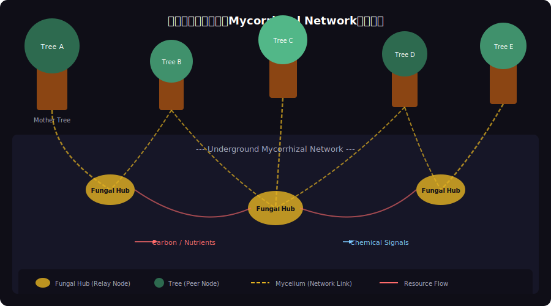

<!-- _class: lead -->
# 森のインターネット：菌糸ネットワークが先取りしていた分散システム設計

- Wood Wide Web × Gossip Protocol × P2P
- 
- 自然界が4億年前に実装していた分散アーキテクチャ


---

# Agenda

- - 1. 菌糸ネットワーク（Wood Wide Web）とは
- - 2. P2P分散システムの基礎
- - 3. 情報伝達：化学シグナル vs Gossip Protocol
- - 4. リソース共有：栄養素再分配 vs Load Balancing
- - 5. 耐障害性：自己修復 vs Replication
- - 6. 設計パターン対応表と未来への示唆


---

<!-- _class: lead -->
# 菌糸ネットワークとは

- Chapter 1: Wood Wide Web


---

# Wood Wide Web：地下に広がる森のインターネット

- - 菌根菌（Mycorrhizal Fungi）が木の根を地下で接続
- - 1本の木は平均 **数十〜数百の他の木** と接続
- - ネットワーク全長は **1gの土壌に数km** の菌糸
- - 約 **4億年前** から存在する地球最古の分散ネットワーク
- - 1997年 Suzanne Simard博士が「Wood Wide Web」を提唱
- - 栄養素・水・化学シグナルの双方向転送を実現


---

# 菌糸ネットワークの構造




---

# Mother Tree：ネットワークのハブノード

- - **Mother Tree**（母樹）= 最も多くの接続を持つハブ
- - 森林内の **最大40種以上** の他の木と菌糸接続
- - 日陰の若木（Sapling）に炭素を優先的に供給
- - 死の間際に蓄積リソースを周囲に大量放出
- - P2Pでの **Super Node** に相当する役割
- - 除去されるとネットワーク全体の連結性が劇的に低下


---

<!-- _class: lead -->
# P2P分散システムの基礎

- Chapter 2: Peer-to-Peer Architecture


---

# P2Pネットワークの設計原則

- - **非中央集権**: 単一の管理サーバーが存在しない
- - **対等なノード**: 各参加者がクライアント兼サーバー
- - **自律分散**: ノードが独立して意思決定
- - **スケーラビリティ**: ノード追加で性能が向上
- - **耐障害性**: 一部の故障がシステム全体に波及しない

<!--
BitTorrent, Bitcoin, IPFS など実例多数。いずれも菌糸ネットワークと共通の設計哲学を持つ。
-->

---

# 代表的なP2Pプロトコル

- - **Gossip Protocol**: 噂話のように情報を伝播（Cassandra, Redis Cluster）
- - **DHT（分散ハッシュテーブル）**: キーでデータ位置を特定（BitTorrent, IPFS）
- - **Chord Ring**: ノードをリング状に配置し O(log N) でルーティング
- - **Raft / Paxos**: 合意形成アルゴリズム（etcd, ZooKeeper）
- - **CRDTs**: 結果整合性を保証する競合フリーデータ型

<!--
菌糸ネットワークの情報伝播はGossip Protocolに最も近い。
-->

---

<!-- _class: lead -->
# 情報伝達メカニズムの比較

- Chapter 3: Signal Propagation


---

# Gossip Protocol vs 菌糸シグナル伝達


---

# 化学シグナルの仕組み

- - 虫害を受けた木が **ジャスモン酸** を菌糸経由で送信
- - 受信した木は事前に **防御酵素** を生成開始
- - シグナル到達速度: 数時間〜数日（物理的拡散）
- - Gossipの `O(log N)` ラウンドに対応する伝播段階
- - 両者とも **Eventual Delivery** を特徴とする
- - 中央コーディネーターなしで全体に情報が行き渡る

<!--
菌糸ネットワークの化学シグナルはGossip Protocolと驚くほど似た伝播パターンを示す。
-->

---

<!-- _class: lead -->
# リソース共有と負荷分散

- Chapter 4: Resource Redistribution


---

# 森の Load Balancer：栄養素の再分配

- - 日当たりの良い木 → 余剰炭素を菌糸ネットワークへ供給
- - 日陰の若木 ← 菌糸経由で炭素・リンを受領
- - **ソース-シンクモデル**: 余剰ノードから不足ノードへ自動転送
- - P2Pの **Work Stealing** パターンに類似
- - 菌根菌は仲介手数料として炭素の **10〜30%** を取得
- - Token Economicsの原型：参加者全員がインセンティブを持つ


---

# リソース再分配のコード比較

- - 菌糸ネットワークの栄養素転送 ≒ P2Pの負荷分散アルゴリズム

```typescript
// P2P Load Balancing (Work Stealing)
async function redistributeLoad(nodes: PeerNode[]) {
  const avg = nodes.reduce((s, n) => s + n.load, 0) / nodes.length;
  const donors = nodes.filter(n => n.load > avg * 1.2); // surplus
  const receivers = nodes.filter(n => n.load < avg * 0.8); // deficit

  for (const donor of donors) {
    const target = receivers.shift();
    if (target) await donor.transferWork(target, donor.load - avg);
  }
}
```


---

<!-- _class: lead -->
# 耐障害性

- Chapter 5: Fault Tolerance


---

# 菌糸ネットワークの耐障害性




---

# 自己修復メカニズム：菌糸 vs P2P

- - **菌糸**: 損傷を検知 → 新しい菌糸が迂回経路を形成
- - **P2P**: ノード離脱を検知 → DHT/Gossipで経路再構築
- - 両者とも **冗長接続** が前提（Replication Factor）
- - 菌糸: 平均5〜8の冗長経路 ≒ P2P: Replication Factor 3〜5
- - **Graceful Degradation**: 部分障害でもサービス継続
- - Mother Treeの喪失 ≒ Super Node障害 → 再選出が必要

<!--
菌糸ネットワークは数百万年の進化で耐障害性を獲得。P2Pは同じ原理を数十年で実装した。
-->

---

<!-- _class: lead -->
# 設計パターン対応表

- Chapter 6: Design Pattern Mapping


---

# 自然 × テクノロジー：設計パターン対応表


---

# 菌糸ネットワークから学ぶ設計指針

- - **Hub-and-Spoke は自然界でも有効**: Mother Treeが証明
- - **完全分散 vs ハブ型のハイブリッド** が最も頑健
- - **インセンティブ設計** が持続可能性の鍵（相利共生）
- - **冗長経路のコスト** は保険として正当化される
- - **Graceful Degradation** は生存のための必須要件
- - 数億年の自然淘汰 = 究極のカオスエンジニアリング


---

<!-- _class: lead -->
# まとめ：森が教えてくれる分散システムの未来

- 菌糸ネットワークは4億年前に分散システムを「発明」した
- 
- Gossip Protocol、Load Balancing、Fault Tolerance
- すべて自然界に先例がある
- 
- **最良のアーキテクチャは、自然の設計に学ぶ**


---

# References

- - **Research & Data:**
- - [Simard, S. (1997) Net transfer of carbon between ectomycorrhizal tree species in the field. Nature 388](https://www.nature.com/articles/40557)
- - [Beiler, K.J. et al. (2010) Architecture of the wood-wide web. New Phytologist](https://nph.onlinelibrary.wiley.com/journal/14698137)
- - **Books:**
- - [Simard, S. (2021) Finding the Mother Tree. Penguin](https://suzannesimard.com/finding-the-mother-tree-book/)
- - [Sheldrake, M. (2020) Entangled Life. Random House](https://www.merlinsheldrake.com/entangled-life)

