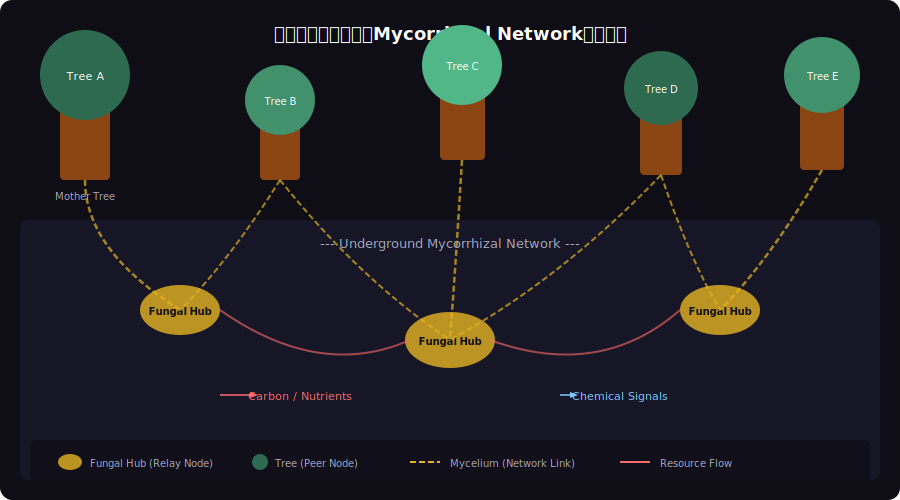
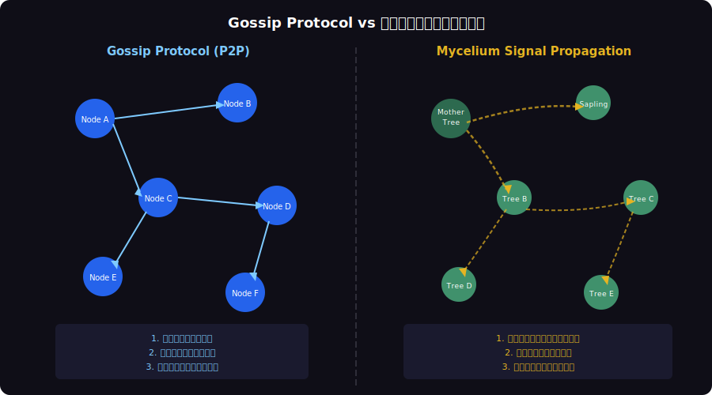
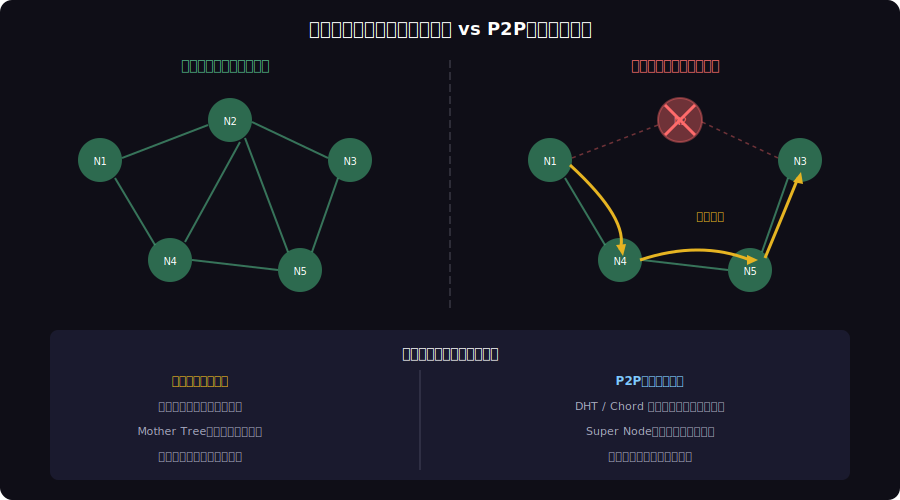
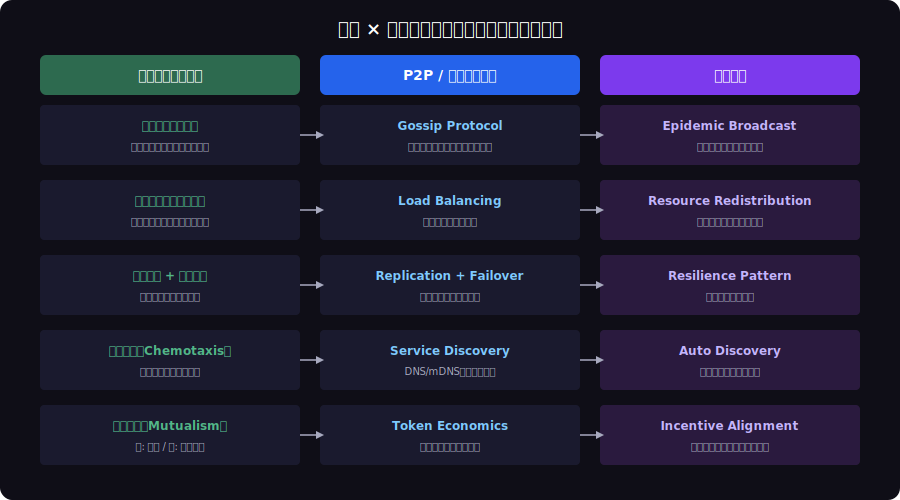

<!-- _class: lead -->
# 森のインターネット：菌糸ネットワークが先取りしていた分散システム設計

- Wood Wide Web × Gossip Protocol × P2P
- 
- 自然界が4億年前に実装していた分散アーキテクチャ


---

# Agenda

> *6章構成で菌糸×P2Pの設計哲学を体系的に学ぶ*

- - 1. 菌糸ネットワーク（Wood Wide Web）とは
- - 2. P2P分散システムの基礎
- - 3. 情報伝達：化学シグナル vs Gossip Protocol
- - 4. リソース共有：栄養素再分配 vs Load Balancing
- - 5. 耐障害性：自己修復 vs Replication
- - 6. 設計パターン対応表と未来への示唆


---

<!-- _class: lead -->
# 菌糸ネットワークとは

- Chapter 1: Wood Wide Web


---

# Wood Wide Web：地下に広がる森のインターネット

> *4億年前から存在する地球最古の分散ネットワーク*

- - 菌根菌（Mycorrhizal Fungi）が木の根を地下で接続
- - 1本の木は平均 **数十〜数百の他の木** と接続
- - ネットワーク全長は **1gの土壌に数km** の菌糸
- - 約 **4億年前** から存在する地球最古の分散ネットワーク
- - 1997年 Suzanne Simard博士が「Wood Wide Web」を提唱
- - 栄養素・水・化学シグナルの双方向転送を実現


---

# 菌糸ネットワークの構造




---

# Mother Tree：ネットワークのハブノード

> *Mother Tree除去でネットワーク連結性が劇的低下*

- - **Mother Tree**（母樹）= 最も多くの接続を持つハブ
- - 森林内の **最大40種以上** の他の木と菌糸接続
- - 日陰の若木（Sapling）に炭素を優先的に供給
- - 死の間際に蓄積リソースを周囲に大量放出
- - P2Pでの **Super Node** に相当する役割
- - 除去されるとネットワーク全体の連結性が劇的に低下


---

<!-- _class: lead -->
# P2P分散システムの基礎

- Chapter 2: Peer-to-Peer Architecture


---

# P2Pネットワークの設計原則

> *完全分散vsハイブリッドで耐障害性が大きく変わる*

- <svg viewBox="0 0 800 320" style="max-height:70vh;max-width:100%;display:block;margin:0 auto;" xmlns="http://www.w3.org/2000/svg"><rect width="800" height="320" fill="#1a1a2e"/><text x="400" y="28" fill="#f9a825" font-size="17" font-family="sans-serif" text-anchor="middle" font-weight="bold">P2Pネットワーク構造：中央集権 vs 分散 vs ハイブリッド</text><rect x="20" y="45" width="230" height="255" rx="12" fill="#16213e" stroke="#e91e63" stroke-width="1.5"/><text x="135" y="70" fill="#e91e63" font-size="13" font-family="sans-serif" text-anchor="middle" font-weight="bold">中央集権 (Centralized)</text><circle cx="135" cy="155" r="20" fill="#e91e63" opacity="0.9"/><text x="135" y="160" fill="#ffffff" font-size="10" font-family="sans-serif" text-anchor="middle">中央</text><circle cx="80" cy="220" r="10" fill="#555"/><circle cx="120" cy="225" r="10" fill="#555"/><circle cx="160" cy="225" r="10" fill="#555"/><circle cx="200" cy="220" r="10" fill="#555"/><circle cx="70" cy="195" r="10" fill="#555"/><circle cx="195" cy="195" r="10" fill="#555"/><line x1="135" y1="175" x2="80" y2="213" stroke="#e91e63" stroke-width="1.5"/><line x1="135" y1="175" x2="120" y2="218" stroke="#e91e63" stroke-width="1.5"/><line x1="135" y1="175" x2="160" y2="218" stroke="#e91e63" stroke-width="1.5"/><line x1="135" y1="175" x2="200" y2="213" stroke="#e91e63" stroke-width="1.5"/><line x1="135" y1="175" x2="70" y2="188" stroke="#e91e63" stroke-width="1.5"/><line x1="135" y1="175" x2="195" y2="188" stroke="#e91e63" stroke-width="1.5"/><text x="135" y="263" fill="#aaaaaa" font-size="11" font-family="sans-serif" text-anchor="middle">単一障害点あり</text><text x="135" y="282" fill="#e91e63" font-size="11" font-family="sans-serif" text-anchor="middle">耐障害性: 低</text><rect x="285" y="45" width="230" height="255" rx="12" fill="#16213e" stroke="#f9a825" stroke-width="2"/><text x="400" y="70" fill="#f9a825" font-size="13" font-family="sans-serif" text-anchor="middle" font-weight="bold">完全分散 (Decentralized)</text><circle cx="340" cy="120" r="10" fill="#f9a825" opacity="0.8"/><circle cx="400" cy="105" r="10" fill="#f9a825" opacity="0.8"/><circle cx="460" cy="120" r="10" fill="#f9a825" opacity="0.8"/><circle cx="320" cy="175" r="10" fill="#f9a825" opacity="0.8"/><circle cx="380" cy="165" r="10" fill="#f9a825" opacity="0.8"/><circle cx="435" cy="170" r="10" fill="#f9a825" opacity="0.8"/><circle cx="350" cy="225" r="10" fill="#f9a825" opacity="0.8"/><circle cx="415" cy="230" r="10" fill="#f9a825" opacity="0.8"/><line x1="340" y1="130" x2="400" y2="115" stroke="#f9a825" stroke-width="1.2"/><line x1="400" y1="115" x2="460" y2="130" stroke="#f9a825" stroke-width="1.2"/><line x1="340" y1="130" x2="320" y2="168" stroke="#f9a825" stroke-width="1.2"/><line x1="400" y1="115" x2="380" y2="158" stroke="#f9a825" stroke-width="1.2"/><line x1="460" y1="130" x2="435" y2="163" stroke="#f9a825" stroke-width="1.2"/><line x1="320" y1="182" x2="380" y2="172" stroke="#f9a825" stroke-width="1.2"/><line x1="380" y1="172" x2="435" y2="177" stroke="#f9a825" stroke-width="1.2"/><line x1="320" y1="182" x2="350" y2="218" stroke="#f9a825" stroke-width="1.2"/><line x1="435" y1="177" x2="415" y2="223" stroke="#f9a825" stroke-width="1.2"/><text x="400" y="263" fill="#aaaaaa" font-size="11" font-family="sans-serif" text-anchor="middle">全ノードが対等</text><text x="400" y="282" fill="#f9a825" font-size="11" font-family="sans-serif" text-anchor="middle">耐障害性: 高</text><rect x="550" y="45" width="230" height="255" rx="12" fill="#16213e" stroke="#f9a825" stroke-width="1.5"/><text x="665" y="70" fill="#f9a825" font-size="13" font-family="sans-serif" text-anchor="middle" font-weight="bold">ハイブリッド (Mother Tree)</text><circle cx="665" cy="148" r="22" fill="#f9a825" opacity="0.9"/><text x="665" y="144" fill="#1a1a2e" font-size="9" font-family="sans-serif" text-anchor="middle" font-weight="bold">Mother</text><text x="665" y="158" fill="#1a1a2e" font-size="9" font-family="sans-serif" text-anchor="middle" font-weight="bold">Tree</text><circle cx="600" cy="210" r="12" fill="#f9a825" opacity="0.6"/><circle cx="640" cy="222" r="12" fill="#f9a825" opacity="0.6"/><circle cx="685" cy="218" r="12" fill="#f9a825" opacity="0.6"/><circle cx="725" cy="210" r="12" fill="#f9a825" opacity="0.6"/><circle cx="590" cy="175" r="10" fill="#555"/><circle cx="735" cy="175" r="10" fill="#555"/><line x1="665" y1="170" x2="600" y2="202" stroke="#f9a825" stroke-width="2"/><line x1="665" y1="170" x2="640" y2="214" stroke="#f9a825" stroke-width="2"/><line x1="665" y1="170" x2="685" y2="210" stroke="#f9a825" stroke-width="2"/><line x1="665" y1="170" x2="725" y2="202" stroke="#f9a825" stroke-width="2"/><line x1="600" y1="208" x2="590" y2="178" stroke="#888" stroke-width="1"/><line x1="725" y1="208" x2="735" y2="178" stroke="#888" stroke-width="1"/><line x1="600" y1="210" x2="640" y2="215" stroke="#888" stroke-width="1"/><text x="665" y="263" fill="#aaaaaa" font-size="11" font-family="sans-serif" text-anchor="middle">Super Nodeが存在</text><text x="665" y="282" fill="#f9a825" font-size="11" font-family="sans-serif" text-anchor="middle">耐障害性: 中〜高</text></svg>
- - **非中央集権**: 単一の管理サーバーが存在しない
- - **対等なノード**: 各参加者がクライアント兼サーバー
- - **自律分散**: ノードが独立して意思決定
- - **スケーラビリティ**: ノード追加で性能が向上
- - **耐障害性**: 一部の故障がシステム全体に波及しない

<!--
BitTorrent, Bitcoin, IPFS など実例多数。いずれも菌糸ネットワークと共通の設計哲学を持つ。
-->

---

# 代表的なP2Pプロトコル

> *Gossip・DHT・Raft—菌糸の情報伝播と同じ原理で動く*

- <svg viewBox="0 0 800 310" style="max-height:70vh;max-width:100%;display:block;margin:0 auto;" xmlns="http://www.w3.org/2000/svg"><rect width="800" height="310" fill="#1a1a2e"/><text x="400" y="28" fill="#f9a825" font-size="16" font-family="sans-serif" text-anchor="middle" font-weight="bold">情報伝播パターン：化学シグナル vs Gossip Protocol</text><rect x="20" y="45" width="370" height="250" rx="12" fill="#16213e" stroke="#f9a825" stroke-width="2"/><text x="205" y="70" fill="#f9a825" font-size="13" font-family="sans-serif" text-anchor="middle" font-weight="bold">菌糸ネットワークの化学シグナル</text><!-- Trees round 1 --><circle cx="70" cy="130" r="18" fill="#2d5a27" stroke="#f9a825" stroke-width="2"/><text x="70" y="135" fill="#f9a825" font-size="9" font-family="sans-serif" text-anchor="middle">虫害!</text><circle cx="70" cy="200" r="14" fill="#2d5a27" stroke="#888" stroke-width="1"/><circle cx="180" cy="150" r="14" fill="#2d5a27" stroke="#888" stroke-width="1"/><circle cx="250" cy="125" r="14" fill="#2d5a27" stroke="#888" stroke-width="1"/><circle cx="310" cy="160" r="14" fill="#2d5a27" stroke="#888" stroke-width="1"/><circle cx="200" cy="220" r="14" fill="#2d5a27" stroke="#888" stroke-width="1"/><circle cx="330" cy="230" r="14" fill="#2d5a27" stroke="#888" stroke-width="1"/><!-- Mycelium connections --><line x1="70" y1="148" x2="70" y2="186" stroke="#f9a825" stroke-width="2" stroke-dasharray="4,2"/><line x1="88" y1="135" x2="167" y2="150" stroke="#f9a825" stroke-width="2" stroke-dasharray="4,2"/><line x1="195" y1="143" x2="238" y2="130" stroke="#888" stroke-width="1.5" stroke-dasharray="3,3"/><line x1="265" y1="130" x2="298" y2="152" stroke="#888" stroke-width="1.5" stroke-dasharray="3,3"/><line x1="190" y1="163" x2="198" y2="208" stroke="#888" stroke-width="1.5" stroke-dasharray="3,3"/><line x1="202" y1="233" x2="318" y2="230" stroke="#888" stroke-width="1.5" stroke-dasharray="3,3"/><!-- Signal labels --><text x="100" y="165" fill="#f9a825" font-size="10" font-family="sans-serif">ジャスモン酸</text><text x="205" y="270" fill="#aaaaaa" font-size="11" font-family="sans-serif" text-anchor="middle">化学シグナルが菌糸経由で伝播</text><text x="205" y="288" fill="#aaaaaa" font-size="11" font-family="sans-serif" text-anchor="middle">数時間〜数日で Eventual Delivery</text><rect x="410" y="45" width="370" height="250" rx="12" fill="#16213e" stroke="#e91e63" stroke-width="2"/><text x="595" y="70" fill="#e91e63" font-size="13" font-family="sans-serif" text-anchor="middle" font-weight="bold">Gossip Protocol</text><!-- Nodes round 1 --><circle cx="460" cy="130" r="18" fill="#16213e" stroke="#e91e63" stroke-width="2.5"/><text x="460" y="126" fill="#e91e63" font-size="9" font-family="sans-serif" text-anchor="middle">Node</text><text x="460" y="138" fill="#e91e63" font-size="9" font-family="sans-serif" text-anchor="middle">Origin</text><circle cx="460" cy="200" r="14" fill="#16213e" stroke="#888" stroke-width="1.5"/><circle cx="570" cy="150" r="14" fill="#16213e" stroke="#888" stroke-width="1.5"/><circle cx="640" cy="125" r="14" fill="#16213e" stroke="#888" stroke-width="1.5"/><circle cx="700" cy="160" r="14" fill="#16213e" stroke="#888" stroke-width="1.5"/><circle cx="590" cy="220" r="14" fill="#16213e" stroke="#888" stroke-width="1.5"/><circle cx="720" cy="230" r="14" fill="#16213e" stroke="#888" stroke-width="1.5"/><!-- Gossip connections --><line x1="460" y1="148" x2="460" y2="186" stroke="#e91e63" stroke-width="2"/><line x1="478" y1="135" x2="557" y2="150" stroke="#e91e63" stroke-width="2"/><line x1="585" y1="145" x2="628" y2="130" stroke="#888" stroke-width="1.5" stroke-dasharray="3,3"/><line x1="655" y1="130" x2="688" y2="152" stroke="#888" stroke-width="1.5" stroke-dasharray="3,3"/><line x1="578" y1="163" x2="587" y2="208" stroke="#888" stroke-width="1.5" stroke-dasharray="3,3"/><line x1="592" y1="233" x2="708" y2="230" stroke="#888" stroke-width="1.5" stroke-dasharray="3,3"/><!-- Labels --><text x="498" y="145" fill="#e91e63" font-size="10" font-family="sans-serif">push(msg)</text><text x="595" y="270" fill="#aaaaaa" font-size="11" font-family="sans-serif" text-anchor="middle">ランダムにピアへ転送</text><text x="595" y="288" fill="#aaaaaa" font-size="11" font-family="sans-serif" text-anchor="middle">O(log N)ラウンドで全体伝播</text></svg>
- - **Gossip Protocol**: 噂話のように情報を伝播（Cassandra, Redis Cluster）
- - **DHT（分散ハッシュテーブル）**: キーでデータ位置を特定（BitTorrent, IPFS）
- - **Chord Ring**: ノードをリング状に配置し O(log N) でルーティング
- - **Raft / Paxos**: 合意形成アルゴリズム（etcd, ZooKeeper）
- - **CRDTs**: 結果整合性を保証する競合フリーデータ型

<!--
菌糸ネットワークの情報伝播はGossip Protocolに最も近い。
-->

---

<!-- _class: lead -->
# 情報伝達メカニズムの比較

- Chapter 3: Signal Propagation


---

# Gossip Protocol vs 菌糸シグナル伝達




---

# 化学シグナルの仕組み

> *Gossip Protocol同様：中央なしで全体に情報が伝播*

- - 虫害を受けた木が **ジャスモン酸** を菌糸経由で送信
- - 受信した木は事前に **防御酵素** を生成開始
- - シグナル到達速度: 数時間〜数日（物理的拡散）
- - Gossipの `O(log N)` ラウンドに対応する伝播段階
- - 両者とも **Eventual Delivery** を特徴とする
- - 中央コーディネーターなしで全体に情報が行き渡る

<!--
菌糸ネットワークの化学シグナルはGossip Protocolと驚くほど似た伝播パターンを示す。
-->

---

<!-- _class: lead -->
# リソース共有と負荷分散

- Chapter 4: Resource Redistribution


---

# 森の Load Balancer：栄養素の再分配

> *相利共生モデルがToken Economicsの原型になる*

- <svg viewBox="0 0 800 300" style="max-height:70vh;max-width:100%;display:block;margin:0 auto;" xmlns="http://www.w3.org/2000/svg"><rect width="800" height="300" fill="#1a1a2e"/><text x="400" y="28" fill="#f9a825" font-size="17" font-family="sans-serif" text-anchor="middle" font-weight="bold">リソース再分配：ソース-シンクモデル</text><rect x="20" y="50" width="230" height="220" rx="12" fill="#2d5a27" stroke="#f9a825" stroke-width="2.5"/><text x="135" y="78" fill="#f9a825" font-size="14" font-family="sans-serif" text-anchor="middle" font-weight="bold">ソース (Source)</text><text x="135" y="100" fill="#ffffff" font-size="12" font-family="sans-serif" text-anchor="middle">日当たり良好な大木</text><text x="135" y="130" fill="#f9a825" font-size="32" font-family="sans-serif" text-anchor="middle">☀</text><text x="135" y="165" fill="#ffffff" font-size="12" font-family="sans-serif" text-anchor="middle">光合成 → 余剰炭素</text><text x="135" y="190" fill="#aaaaaa" font-size="11" font-family="sans-serif" text-anchor="middle">高負荷ノード比喩:</text><text x="135" y="208" fill="#f9a825" font-size="11" font-family="sans-serif" text-anchor="middle">work donor</text><text x="135" y="253" fill="#f9a825" font-size="13" font-family="sans-serif" text-anchor="middle">余剰: +30%</text><rect x="550" y="50" width="230" height="220" rx="12" fill="#1a3a5a" stroke="#e91e63" stroke-width="2"/><text x="665" y="78" fill="#e91e63" font-size="14" font-family="sans-serif" text-anchor="middle" font-weight="bold">シンク (Sink)</text><text x="665" y="100" fill="#ffffff" font-size="12" font-family="sans-serif" text-anchor="middle">日陰の若木</text><text x="665" y="130" fill="#888" font-size="28" font-family="sans-serif" text-anchor="middle">🌱</text><text x="665" y="168" fill="#ffffff" font-size="12" font-family="sans-serif" text-anchor="middle">炭素不足 → 成長阻害</text><text x="665" y="193" fill="#aaaaaa" font-size="11" font-family="sans-serif" text-anchor="middle">低負荷ノード比喩:</text><text x="665" y="211" fill="#e91e63" font-size="11" font-family="sans-serif" text-anchor="middle">work receiver</text><text x="665" y="253" fill="#e91e63" font-size="13" font-family="sans-serif" text-anchor="middle">不足: -40%</text><!-- Mycelium transport channel --><rect x="275" y="100" width="250" height="100" rx="20" fill="#16213e" stroke="#f9a825" stroke-width="2"/><text x="400" y="128" fill="#f9a825" font-size="13" font-family="sans-serif" text-anchor="middle" font-weight="bold">菌糸ネットワーク</text><text x="400" y="150" fill="#ffffff" font-size="11" font-family="sans-serif" text-anchor="middle">/ P2P Work Stealing</text><text x="400" y="172" fill="#aaaaaa" font-size="11" font-family="sans-serif" text-anchor="middle">仲介手数料: 10-30%</text><text x="400" y="190" fill="#aaaaaa" font-size="10" font-family="sans-serif" text-anchor="middle">(菌根菌の取り分)</text><!-- Arrows --><polygon points="252,148 273,140 273,156" fill="#f9a825"/><line x1="250" y1="148" x2="273" y2="148" stroke="#f9a825" stroke-width="2.5"/><polygon points="548,148 526,140 526,156" fill="#e91e63"/><line x1="528" y1="148" x2="548" y2="148" stroke="#e91e63" stroke-width="2.5"/></svg>
- - 日当たりの良い木 → 余剰炭素を菌糸ネットワークへ供給
- - 日陰の若木 ← 菌糸経由で炭素・リンを受領
- - **ソース-シンクモデル**: 余剰ノードから不足ノードへ自動転送
- - P2Pの **Work Stealing** パターンに類似
- - 菌根菌は仲介手数料として炭素の **10〜30%** を取得
- - Token Economicsの原型：参加者全員がインセンティブを持つ


---

# リソース再分配のコード比較

- - 菌糸ネットワークの栄養素転送 ≒ P2Pの負荷分散アルゴリズム


---

# リソース再分配のコード比較（コード例）

```typescript
// P2P Load Balancing (Work Stealing)
async function redistributeLoad(nodes: PeerNode[]) {
  const avg = nodes.reduce((s, n) => s + n.load, 0) / nodes.length;
  const donors = nodes.filter(n => n.load > avg * 1.2); // surplus
  const receivers = nodes.filter(n => n.load < avg * 0.8); // deficit

  for (const donor of donors) {
    const target = receivers.shift();
    if (target) await donor.transferWork(target, donor.load - avg);
  }
}
```


---

<!-- _class: lead -->
# 耐障害性

- Chapter 5: Fault Tolerance


---

# 菌糸ネットワークの耐障害性




---

# 自己修復メカニズム：菌糸 vs P2P

> *冗長5〜8経路がGraceful Degradationを可能にする*

- <svg viewBox="0 0 800 300" style="max-height:70vh;max-width:100%;display:block;margin:0 auto;" xmlns="http://www.w3.org/2000/svg"><rect width="800" height="300" fill="#1a1a2e"/><text x="400" y="28" fill="#f9a825" font-size="17" font-family="sans-serif" text-anchor="middle" font-weight="bold">自己修復メカニズム：菌糸 vs P2P</text><rect x="20" y="45" width="370" height="240" rx="12" fill="#16213e" stroke="#f9a825" stroke-width="2"/><text x="205" y="70" fill="#f9a825" font-size="13" font-family="sans-serif" text-anchor="middle" font-weight="bold">菌糸ネットワーク</text><!-- Nodes before fault --><circle cx="80" cy="130" r="12" fill="#2d5a27" stroke="#f9a825" stroke-width="1.5"/><circle cx="140" cy="115" r="12" fill="#2d5a27" stroke="#f9a825" stroke-width="1.5"/><circle cx="210" cy="125" r="12" fill="#e91e63" opacity="0.5" stroke="#e91e63" stroke-width="2"/><text x="210" y="118" fill="#e91e63" font-size="9" font-family="sans-serif" text-anchor="middle">障害</text><circle cx="270" cy="130" r="12" fill="#2d5a27" stroke="#f9a825" stroke-width="1.5"/><circle cx="340" cy="120" r="12" fill="#2d5a27" stroke="#f9a825" stroke-width="1.5"/><!-- Original path (broken) --><line x1="92" y1="130" x2="198" y2="127" stroke="#e91e63" stroke-width="1.5" stroke-dasharray="4,3"/><line x1="222" y1="127" x2="258" y2="130" stroke="#e91e63" stroke-width="1.5" stroke-dasharray="4,3"/><!-- Bypass path --><path d="M92 122 Q170 80 258 122" fill="none" stroke="#f9a825" stroke-width="2.5"/><polygon points="255,116 268,122 255,128" fill="#f9a825"/><!-- Labels --><text x="170" y="78" fill="#f9a825" font-size="11" font-family="sans-serif" text-anchor="middle">新しい迂回経路</text><text x="205" y="175" fill="#aaaaaa" font-size="11" font-family="sans-serif" text-anchor="middle">損傷を検知 → 新菌糸が迂回形成</text><text x="205" y="195" fill="#aaaaaa" font-size="11" font-family="sans-serif" text-anchor="middle">平均5〜8の冗長経路</text><text x="205" y="220" fill="#f9a825" font-size="12" font-family="sans-serif" text-anchor="middle">Graceful Degradation</text><text x="205" y="240" fill="#ffffff" font-size="11" font-family="sans-serif" text-anchor="middle">部分障害でもサービス継続</text><rect x="410" y="45" width="370" height="240" rx="12" fill="#16213e" stroke="#e91e63" stroke-width="2"/><text x="595" y="70" fill="#e91e63" font-size="13" font-family="sans-serif" text-anchor="middle" font-weight="bold">P2P Network (DHT)</text><!-- P2P nodes --><circle cx="470" cy="130" r="12" fill="#16213e" stroke="#f9a825" stroke-width="1.5"/><circle cx="530" cy="115" r="12" fill="#16213e" stroke="#f9a825" stroke-width="1.5"/><circle cx="600" cy="125" r="12" fill="#e91e63" opacity="0.5" stroke="#e91e63" stroke-width="2"/><text x="600" y="118" fill="#e91e63" font-size="9" font-family="sans-serif" text-anchor="middle">離脱</text><circle cx="660" cy="130" r="12" fill="#16213e" stroke="#f9a825" stroke-width="1.5"/><circle cx="730" cy="120" r="12" fill="#16213e" stroke="#f9a825" stroke-width="1.5"/><!-- Original path (broken) --><line x1="482" y1="130" x2="588" y2="127" stroke="#e91e63" stroke-width="1.5" stroke-dasharray="4,3"/><line x1="612" y1="127" x2="648" y2="130" stroke="#e91e63" stroke-width="1.5" stroke-dasharray="4,3"/><!-- Bypass path --><path d="M482 122 Q560 80 648 122" fill="none" stroke="#e91e63" stroke-width="2.5"/><polygon points="645,116 658,122 645,128" fill="#e91e63"/><!-- Labels --><text x="562" y="78" fill="#e91e63" font-size="11" font-family="sans-serif" text-anchor="middle">DHT再構築</text><text x="595" y="175" fill="#aaaaaa" font-size="11" font-family="sans-serif" text-anchor="middle">ノード離脱を検知 → 経路再構築</text><text x="595" y="195" fill="#aaaaaa" font-size="11" font-family="sans-serif" text-anchor="middle">Replication Factor 3〜5</text><text x="595" y="220" fill="#e91e63" font-size="12" font-family="sans-serif" text-anchor="middle">Gossip / DHT Update</text><text x="595" y="240" fill="#ffffff" font-size="11" font-family="sans-serif" text-anchor="middle">自動フェイルオーバー</text></svg>
- - **菌糸**: 損傷を検知 → 新しい菌糸が迂回経路を形成
- - **P2P**: ノード離脱を検知 → DHT/Gossipで経路再構築
- - 両者とも **冗長接続** が前提（Replication Factor）
- - 菌糸: 平均5〜8の冗長経路 ≒ P2P: Replication Factor 3〜5
- - **Graceful Degradation**: 部分障害でもサービス継続
- - Mother Treeの喪失 ≒ Super Node障害 → 再選出が必要

<!--
菌糸ネットワークは数百万年の進化で耐障害性を獲得。P2Pは同じ原理を数十年で実装した。
-->

---

<!-- _class: lead -->
# 設計パターン対応表

- Chapter 6: Design Pattern Mapping


---

# 自然 × テクノロジー：設計パターン対応表




---

# 菌糸ネットワークから学ぶ設計指針

> *インセンティブ設計と冗長経路が持続可能性の鍵*

- <svg viewBox="0 0 800 310" style="max-height:70vh;max-width:100%;display:block;margin:0 auto;" xmlns="http://www.w3.org/2000/svg"><rect width="800" height="310" fill="#1a1a2e"/><text x="400" y="28" fill="#f9a825" font-size="17" font-family="sans-serif" text-anchor="middle" font-weight="bold">自然 × テクノロジー：設計パターン対応表</text><!-- Header row --><rect x="20" y="42" width="360" height="32" rx="6" fill="#f9a825" opacity="0.9"/><text x="200" y="63" fill="#1a1a2e" font-size="13" font-family="sans-serif" text-anchor="middle" font-weight="bold">菌糸ネットワーク</text><rect x="390" y="42" width="390" height="32" rx="6" fill="#e91e63" opacity="0.85"/><text x="585" y="63" fill="#ffffff" font-size="13" font-family="sans-serif" text-anchor="middle" font-weight="bold">P2P / 分散システム</text><!-- Row 1 --><rect x="20" y="82" width="360" height="36" rx="4" fill="#16213e" stroke="#555" stroke-width="1"/><text x="200" y="105" fill="#f9a825" font-size="12" font-family="sans-serif" text-anchor="middle">化学シグナル伝播 (ジャスモン酸)</text><rect x="390" y="82" width="390" height="36" rx="4" fill="#16213e" stroke="#555" stroke-width="1"/><text x="585" y="105" fill="#e91e63" font-size="12" font-family="sans-serif" text-anchor="middle">Gossip Protocol / Epidemic算法</text><!-- Row 2 --><rect x="20" y="124" width="360" height="36" rx="4" fill="#1e1e3e" stroke="#555" stroke-width="1"/><text x="200" y="147" fill="#f9a825" font-size="12" font-family="sans-serif" text-anchor="middle">Mother Tree (ハブノード)</text><rect x="390" y="124" width="390" height="36" rx="4" fill="#1e1e3e" stroke="#555" stroke-width="1"/><text x="585" y="147" fill="#e91e63" font-size="12" font-family="sans-serif" text-anchor="middle">Super Node / Seed Node</text><!-- Row 3 --><rect x="20" y="166" width="360" height="36" rx="4" fill="#16213e" stroke="#555" stroke-width="1"/><text x="200" y="189" fill="#f9a825" font-size="12" font-family="sans-serif" text-anchor="middle">ソース-シンク栄養素転送</text><rect x="390" y="166" width="390" height="36" rx="4" fill="#16213e" stroke="#555" stroke-width="1"/><text x="585" y="189" fill="#e91e63" font-size="12" font-family="sans-serif" text-anchor="middle">Work Stealing / Load Balancing</text><!-- Row 4 --><rect x="20" y="208" width="360" height="36" rx="4" fill="#1e1e3e" stroke="#555" stroke-width="1"/><text x="200" y="231" fill="#f9a825" font-size="12" font-family="sans-serif" text-anchor="middle">菌糸迂回再生（自己修復）</text><rect x="390" y="208" width="390" height="36" rx="4" fill="#1e1e3e" stroke="#555" stroke-width="1"/><text x="585" y="231" fill="#e91e63" font-size="12" font-family="sans-serif" text-anchor="middle">DHT再構築 / Automatic Failover</text><!-- Row 5 --><rect x="20" y="250" width="360" height="36" rx="4" fill="#16213e" stroke="#555" stroke-width="1"/><text x="200" y="273" fill="#f9a825" font-size="12" font-family="sans-serif" text-anchor="middle">相利共生（菌根菌の手数料）</text><rect x="390" y="250" width="390" height="36" rx="4" fill="#16213e" stroke="#555" stroke-width="1"/><text x="585" y="273" fill="#e91e63" font-size="12" font-family="sans-serif" text-anchor="middle">Token Economics / Incentive Design</text><polygon points="378,155 388,148 388,162" fill="#f9a825"/><polygon points="378,197 388,190 388,204" fill="#f9a825"/></svg>
- - **Hub-and-Spoke は自然界でも有効**: Mother Treeが証明
- - **完全分散 vs ハブ型のハイブリッド** が最も頑健
- - **インセンティブ設計** が持続可能性の鍵（相利共生）
- - **冗長経路のコスト** は保険として正当化される
- - **Graceful Degradation** は生存のための必須要件
- - 数億年の自然淘汰 = 究極のカオスエンジニアリング


---

<!-- _class: lead -->
# まとめ：森が教えてくれる分散システムの未来

- 菌糸ネットワークは4億年前に分散システムを「発明」した
- 
- Gossip Protocol、Load Balancing、Fault Tolerance
- すべて自然界に先例がある
- 
- **最良のアーキテクチャは、自然の設計に学ぶ**


---

# References

> *Simard 1997が菌糸P2P研究の原点——論文4本を厳選*

- - **Research & Data:**
- - [Simard, S. (1997) Net transfer of carbon between ectomycorrhizal tree species in the field. Nature 388](https://www.nature.com/articles/40557)
- - [Beiler, K.J. et al. (2010) Architecture of the wood-wide web. New Phytologist](https://nph.onlinelibrary.wiley.com/journal/14698137)
- - **Books:**
- - [Simard, S. (2021) Finding the Mother Tree. Penguin](https://suzannesimard.com/finding-the-mother-tree-book/)
- - [Sheldrake, M. (2020) Entangled Life. Random House](https://www.merlinsheldrake.com/entangled-life)

