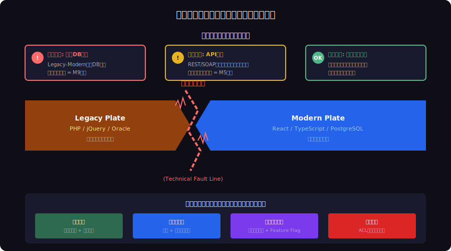
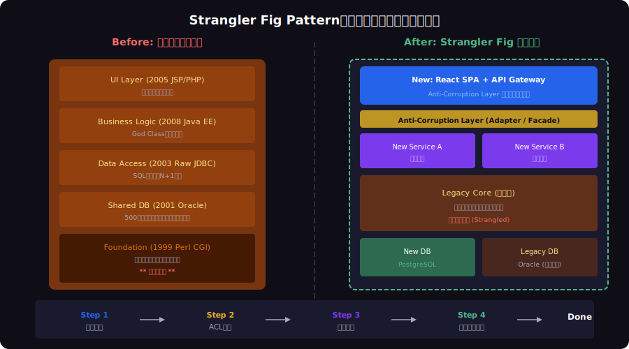

<!-- _class: lead -->
# コードの地層：地質学が教えるレガシーシステム考古学

- Geological Strata × Legacy Code Archaeology
- 
- 25年分のコードベースを科学的に発掘・分析・改修する


---

# Agenda

- - 1. コードベースの地層構造
- - 2. コード考古学の手法
- - 3. 化石コードの分類学
- - 4. 技術的断層とコード地震
- - 5. Strangler Fig Pattern：地質学的リファクタリング
- - 6. レガシーマイグレーション戦略


---

<!-- _class: lead -->
# コードベースの地層構造

- Chapter 1: Code Stratigraphy


---

# コードベースの地層構造


---

# 地層累重の法則（Law of Superposition）

- - 地質学: **上の地層が新しく、下の地層が古い**
- - コード: 新しいコードが古いコードの上に堆積する
- - `git log` は地層の年代測定に相当する
- - 各層は **その時代の技術的制約** を反映している
- - 古い層を理解せずに新しい層を積むのは危険
- - 地層を無視した建設 = 技術的負債の蓄積

<!--
ニコラス・ステノが1669年に提唱した地層累重の法則。コードベースでも全く同じ原理が働く。
-->

---

# 時代ごとのコーディングスタイル「示準化石」

- - **Perl CGI 時代** (1999-): `print "Content-type: text/html\n\n";`
- - **jQuery 時代** (2006-): `$(document).ready(function() {...})`
- - **Angular 1.x 時代** (2012-): `$scope.data = ...`
- - **React Class 時代** (2015-): `componentDidMount() {...}`
- - **React Hooks 時代** (2019-): `useEffect(() => {...}, [])`
- - **Server Components 時代** (2024-): `async function Page() {...}`

<!--
示準化石（Index Fossil）は特定の地質時代を示す化石。コードにも同様のパターンがある。
-->

---

<!-- _class: lead -->
# コード考古学の手法

- Chapter 2: Code Archaeology Methods


---

# コード化石の発掘プロセス


---

# git blame：放射性炭素年代測定

- - `git blame` は各コード行の **作成時期と著者** を特定する
- - 地質学の放射性炭素年代測定（C-14法）に相当
- - コード行の「半減期」= 変更されずに残る平均期間

```bash
# Code Carbon Dating
$ git blame --date=short src/auth/login.ts
# 2003-04-12  (alice)  function validateUser(u, p) {
# 2003-04-12  (alice)    var query = "SELECT * FROM users ...
# 2019-08-21  (bob)    // TODO: fix SQL injection
# 2024-01-15  (carol)  const result = await db.query(prepared);
```

<!--
2003年のコードが2024年まで生き残っている。TODOコメントは2019年に追加されたが、修正は5年後。
-->

---

<!-- _class: lead -->
# 化石コードの分類学

- Chapter 3: Fossil Code Taxonomy


---

# コード化石の5分類

- - **生きた化石** (Living Fossil): 古いが現役で動作するコード
- - **痕跡器官** (Vestigial Organ): かつて重要だったが今は不要な機能
- - **化石記録** (Fossil Record): コメントやTODOに残る過去の意図
- - **示準化石** (Index Fossil): 時代特定できるコーディングパターン
- - **琥珀** (Amber): 完全に凍結された依存関係（pinned versions）


---

# 痕跡器官コードの実例

- - かつてのIE対応コードが典型例

```javascript
// Vestigial Code: IE6-8 compatibility (2008)
function addEvent(el, type, fn) {
  if (el.addEventListener) {
    el.addEventListener(type, fn, false);
  } else if (el.attachEvent) { // IE path
    el.attachEvent('on' + type, fn);
  } else {
    el['on' + type] = fn; // fallback
  }
}
```

<!--
2008年のIE対応コード。attachEventはIE11でも廃止済み。しかし「動いているから触らない」で残り続ける。
-->

---

# TODO考古学：コメント化石の発掘

- - TODO/FIXME/HACK は過去の開発者が残した **化石記録**

```bash
# Fossil Excavation
$ grep -rn 'TODO\|FIXME\|HACK\|XXX' src/ | \
  git blame -L | sort -t: -k3

# Results (sorted by date):
# 2004: HACK: temporary workaround for Oracle bug
# 2009: TODO: refactor this when we drop IE6
# 2015: FIXME: race condition under high load
# 2021: XXX: this entire module needs rewriting
```


---

<!-- _class: lead -->
# 技術的断層とコード地震

- Chapter 4: Technical Fault Lines


---

# 技術的断層とコード地震のリスクマップ




---

# コード地震の震度スケール

- - **M1-2（微震）**: ライブラリのマイナーバージョン更新
- - **M3-4（軽震）**: フレームワークのメジャーバージョン更新
- - **M5-6（中震）**: API仕様の破壊的変更
- - **M7-8（大震）**: 共有DBスキーマのマイグレーション
- - **M9（巨大地震）**: ランタイム/言語の移行（Python 2→3）
- - **M10（文明崩壊）**: 全面リプレースの決断

<!--
Python 2→3の移行は10年かかった。コード地震の規模を過小評価すると致命的。
-->

---

# 断層境界のパターン

- - **収束境界**: Legacy → Modern に徐々に統合（理想的）
- - **発散境界**: Legacy と Modern が乖離し続ける（危険）
- - **横ずれ断層**: 同じ機能の新旧実装が並行稼動（混乱）
- - 収束境界を維持するには **Anti-Corruption Layer** が必須
- - 発散を放置すると「技術的大陸移動」が発生
- - 最終的に2つのシステムが完全に分離して保守不能に


---

<!-- _class: lead -->
# Strangler Fig Pattern

- Chapter 5: Geological Refactoring


---

# Strangler Fig Pattern：地質学的リファクタリング




---

# 地質学的リファクタリングの原則

- - **層序学的分析** を先に行い、構造を理解する
- - **断層線** を特定し、リスクの高い境界を把握する
- - **堆積順序** を尊重し、下層から無闇に掘り返さない
- - **Anti-Corruption Layer** = 地質学の「不整合面」
- - **段階的移行** = 地層の自然な風化プロセスを模倣
- - 一気に壊すのではなく、自然に朽ちさせる

<!--
Martin Fowlerが提唱したStrangler Fig Patternは、絞め殺しのイチジクが宿主を徐々に置き換える自然現象から着想。
-->

---

<!-- _class: lead -->
# レガシーマイグレーション戦略

- Chapter 6: Migration Strategy


---

# 実践：レガシーコード考古学チェックリスト

- - 1. `git log --format='%ai' | sort | head` で **起源年代** を特定
- - 2. `cloc --by-file` で **各層の堆積量**（行数）を計測
- - 3. `git blame` で **年代別コード比率** を算出
- - 4. `grep -rn 'TODO\|FIXME'` で **化石記録** を発掘
- - 5. 依存関係グラフで **断層線** をマッピング
- - 6. リスクスコアリングで **改修優先度** を決定


---

<!-- _class: lead -->
# まとめ：地質学が教えるレガシー対策

- レガシーコードは「技術的負債」ではなく「地層」である
- 
- 地層を理解し、断層を特定し、自然な風化を促す
- 
- **考古学者の忍耐と、地質学者の長期視点で**
- **コードベースと向き合おう**


---

# References

- - **Books & Articles:**
- - [Feathers, M. (2004) Working Effectively with Legacy Code. Prentice Hall](https://www.oreilly.com/library/view/working-effectively-with/0131177052/)
- - [Fowler, M. (2004) StranglerFigApplication. martinfowler.com](https://martinfowler.com/bliki/StranglerFigApplication.html)
- - **Techniques:**
- - [Tornhill, A. (2015) Your Code as a Crime Scene. Pragmatic Bookshelf](https://pragprog.com/titles/atcrime/your-code-as-a-crime-scene/)
- - [Tornhill, A. (2018) Software Design X-Rays. Pragmatic Bookshelf](https://pragprog.com/titles/atevol/software-design-x-rays/)

