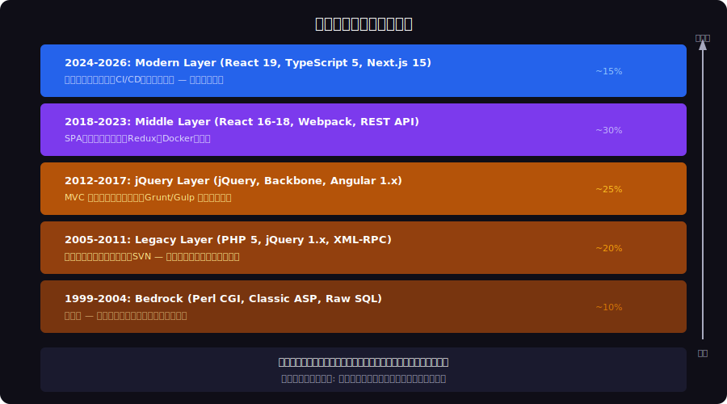
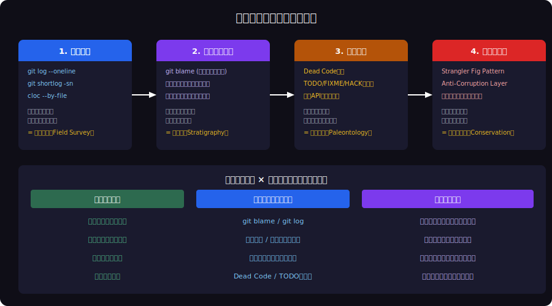
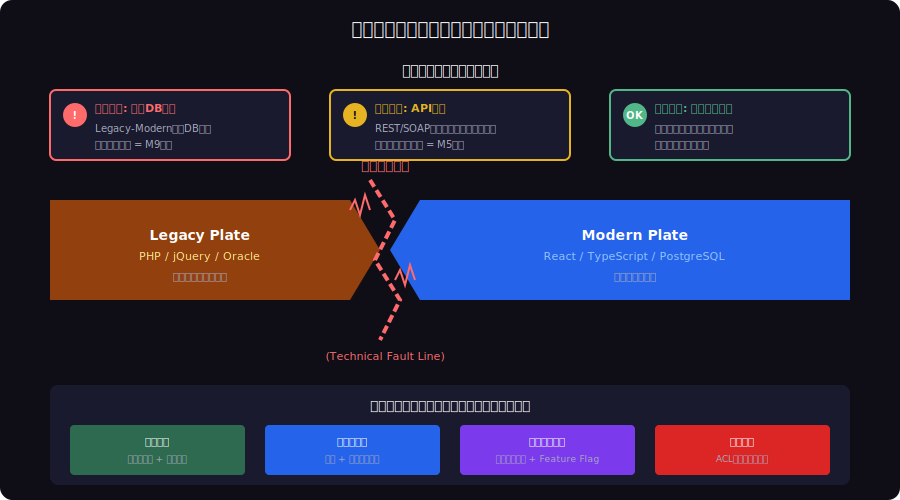
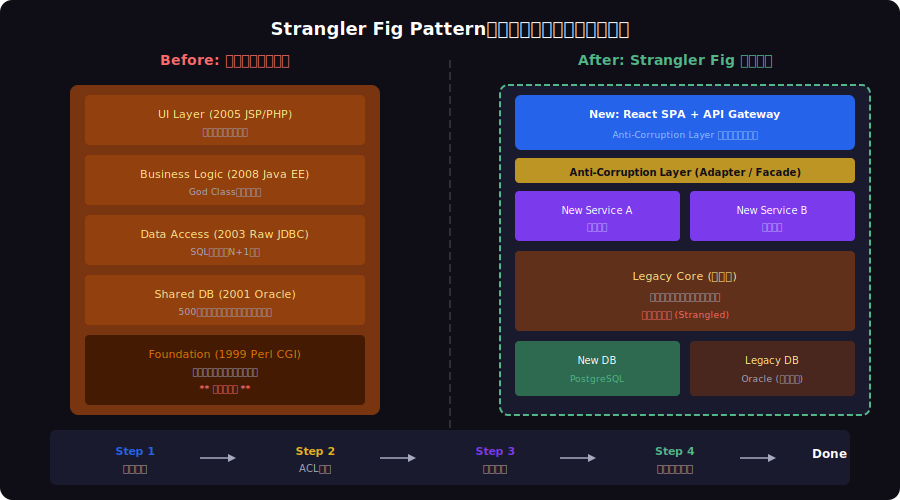

<!-- _class: lead -->
# コードの地層：地質学が教えるレガシーシステム考古学

- Geological Strata × Legacy Code Archaeology
- 
- 25年分のコードベースを科学的に発掘・分析・改修する


---

# Agenda

> *地層→考古学→断層→移行の6章で体系的に習得する*

- - 1. コードベースの地層構造
- - 2. コード考古学の手法
- - 3. 化石コードの分類学
- - 4. 技術的断層とコード地震
- - 5. Strangler Fig Pattern：地質学的リファクタリング
- - 6. レガシーマイグレーション戦略


---

<!-- _class: lead -->
# コードベースの地層構造

- Chapter 1: Code Stratigraphy


---

# コードベースの地層構造




---

# 地層累重の法則（Law of Superposition）

> *古い層を理解せず積み上げると技術的負債が爆発する*

- <svg viewBox="0 0 800 310" style="max-height:70vh;max-width:100%;display:block;margin:0 auto;" xmlns="http://www.w3.org/2000/svg"><rect width="800" height="310" fill="#1a1a2e"/><text x="400" y="28" fill="#f9a825" font-size="17" font-family="sans-serif" text-anchor="middle" font-weight="bold">地層累重の法則：コードベースの堆積構造</text><rect x="180" y="42" width="440" height="38" rx="6" fill="#4a90d9" stroke="#6ab0f9" stroke-width="2"/><text x="400" y="67" fill="#ffffff" font-size="13" font-family="sans-serif" text-anchor="middle" font-weight="bold">2024: Server Components (React 19) — 最新層</text><rect x="140" y="87" width="520" height="36" rx="6" fill="#3d7ab5" stroke="#6ab0f9" stroke-width="1.5"/><text x="400" y="110" fill="#ffffff" font-size="12" font-family="sans-serif" text-anchor="middle">2019: React Hooks (useEffect, useState)</text><rect x="100" y="130" width="600" height="36" rx="6" fill="#2d5a8c" stroke="#5a90c8" stroke-width="1.5"/><text x="400" y="153" fill="#ffffff" font-size="12" font-family="sans-serif" text-anchor="middle">2015: React Class Components (componentDidMount)</text><rect x="60" y="173" width="680" height="36" rx="6" fill="#1e3d60" stroke="#4070a0" stroke-width="1.5"/><text x="400" y="196" fill="#aaaaaa" font-size="12" font-family="sans-serif" text-anchor="middle">2012: AngularJS ($scope, $watch, ng-model)</text><rect x="20" y="216" width="760" height="36" rx="6" fill="#12253a" stroke="#304060" stroke-width="1.5"/><text x="400" y="239" fill="#888888" font-size="12" font-family="sans-serif" text-anchor="middle">2006: jQuery ($.ajax, $(document).ready)</text><rect x="20" y="257" width="760" height="38" rx="0" fill="#0a1520" stroke="#202030" stroke-width="1"/><text x="400" y="280" fill="#666666" font-size="12" font-family="sans-serif" text-anchor="middle">1999: Perl CGI / PHP (print "Content-type: text/html")</text><text x="35" y="62" fill="#f9a825" font-size="11" font-family="sans-serif">新</text><text x="35" y="272" fill="#888" font-size="11" font-family="sans-serif">古</text><line x1="55" y1="42" x2="55" y2="295" stroke="#555" stroke-width="1.5" stroke-dasharray="4,3"/><polygon points="50,42 55,30 60,42" fill="#f9a825"/><polygon points="50,295 55,308 60,295" fill="#888"/></svg>
- - 地質学: **上の地層が新しく、下の地層が古い**
- - コード: 新しいコードが古いコードの上に堆積する
- - `git log` は地層の年代測定に相当する
- - 各層は **その時代の技術的制約** を反映している
- - 古い層を理解せずに新しい層を積むのは危険
- - 地層を無視した建設 = 技術的負債の蓄積

<!--
ニコラス・ステノが1669年に提唱した地層累重の法則。コードベースでも全く同じ原理が働く。
-->

---

# 時代ごとのコーディングスタイル「示準化石」

> *各時代の示準化石でコードの年代を即座に判定できる*

- - **Perl CGI 時代** (1999-): `print "Content-type: text/html\n\n";`
- - **jQuery 時代** (2006-): `$(document).ready(function() {...})`
- - **Angular 1.x 時代** (2012-): `$scope.data = ...`
- - **React Class 時代** (2015-): `componentDidMount() {...}`
- - **React Hooks 時代** (2019-): `useEffect(() => {...}, [])`
- - **Server Components 時代** (2024-): `async function Page() {...}`

<!--
示準化石（Index Fossil）は特定の地質時代を示す化石。コードにも同様のパターンがある。
-->

---

<!-- _class: lead -->
# コード考古学の手法

- Chapter 2: Code Archaeology Methods


---

# コード化石の発掘プロセス




---

# git blame：放射性炭素年代測定

- - `git blame` は各コード行の **作成時期と著者** を特定する
- - 地質学の放射性炭素年代測定（C-14法）に相当
- - コード行の「半減期」= 変更されずに残る平均期間


---

# git blame：放射性炭素年代測定（コード例）

```bash
# Code Carbon Dating
$ git blame --date=short src/auth/login.ts
# 2003-04-12  (alice)  function validateUser(u, p) {
# 2003-04-12  (alice)    var query = "SELECT * FROM users ...
# 2019-08-21  (bob)    // TODO: fix SQL injection
# 2024-01-15  (carol)  const result = await db.query(prepared);
```


---

<!-- _class: lead -->
# 化石コードの分類学

- Chapter 3: Fossil Code Taxonomy


---

# コード化石の5分類

> *5分類で改修優先度が決まる——琥珀は緊急対処必須*

- <svg viewBox="0 0 800 320" style="max-height:70vh;max-width:100%;display:block;margin:0 auto;" xmlns="http://www.w3.org/2000/svg"><rect width="800" height="320" fill="#1a1a2e"/><text x="400" y="28" fill="#f9a825" font-size="17" font-family="sans-serif" text-anchor="middle" font-weight="bold">コード化石の5分類</text><rect x="20" y="50" width="144" height="240" rx="10" fill="#16213e" stroke="#f9a825" stroke-width="2"/><text x="92" y="78" fill="#f9a825" font-size="12" font-family="sans-serif" text-anchor="middle" font-weight="bold">生きた化石</text><text x="92" y="97" fill="#aaaaaa" font-size="10" font-family="sans-serif" text-anchor="middle">Living Fossil</text><text x="92" y="125" fill="#ffffff" font-size="11" font-family="sans-serif" text-anchor="middle">古いが現役</text><text x="92" y="143" fill="#ffffff" font-size="11" font-family="sans-serif" text-anchor="middle">で動作する</text><text x="92" y="175" fill="#f9a825" font-size="10" font-family="sans-serif" text-anchor="middle">例: COBOL</text><text x="92" y="193" fill="#f9a825" font-size="10" font-family="sans-serif" text-anchor="middle">銀行基幹系</text><text x="92" y="220" fill="#aaaaaa" font-size="10" font-family="sans-serif" text-anchor="middle">リスク: 低</text><text x="92" y="238" fill="#aaaaaa" font-size="10" font-family="sans-serif" text-anchor="middle">対処: 保全</text><rect x="176" y="50" width="144" height="240" rx="10" fill="#16213e" stroke="#f9a825" stroke-width="1.5"/><text x="248" y="78" fill="#f9a825" font-size="12" font-family="sans-serif" text-anchor="middle" font-weight="bold">痕跡器官</text><text x="248" y="97" fill="#aaaaaa" font-size="10" font-family="sans-serif" text-anchor="middle">Vestigial Organ</text><text x="248" y="125" fill="#ffffff" font-size="11" font-family="sans-serif" text-anchor="middle">かつて必要</text><text x="248" y="143" fill="#ffffff" font-size="11" font-family="sans-serif" text-anchor="middle">今は不要</text><text x="248" y="175" fill="#f9a825" font-size="10" font-family="sans-serif" text-anchor="middle">例: IE6対応</text><text x="248" y="193" fill="#f9a825" font-size="10" font-family="sans-serif" text-anchor="middle">互換コード</text><text x="248" y="220" fill="#aaaaaa" font-size="10" font-family="sans-serif" text-anchor="middle">リスク: 混乱</text><text x="248" y="238" fill="#aaaaaa" font-size="10" font-family="sans-serif" text-anchor="middle">対処: 削除</text><rect x="332" y="50" width="144" height="240" rx="10" fill="#16213e" stroke="#e91e63" stroke-width="1.5"/><text x="404" y="78" fill="#e91e63" font-size="12" font-family="sans-serif" text-anchor="middle" font-weight="bold">化石記録</text><text x="404" y="97" fill="#aaaaaa" font-size="10" font-family="sans-serif" text-anchor="middle">Fossil Record</text><text x="404" y="125" fill="#ffffff" font-size="11" font-family="sans-serif" text-anchor="middle">過去の意図が</text><text x="404" y="143" fill="#ffffff" font-size="11" font-family="sans-serif" text-anchor="middle">コメントに残る</text><text x="404" y="175" fill="#e91e63" font-size="10" font-family="sans-serif" text-anchor="middle">例: TODO</text><text x="404" y="193" fill="#e91e63" font-size="10" font-family="sans-serif" text-anchor="middle">// FIXME 2008</text><text x="404" y="220" fill="#aaaaaa" font-size="10" font-family="sans-serif" text-anchor="middle">リスク: 中</text><text x="404" y="238" fill="#aaaaaa" font-size="10" font-family="sans-serif" text-anchor="middle">対処: 発掘調査</text><rect x="488" y="50" width="144" height="240" rx="10" fill="#16213e" stroke="#f9a825" stroke-width="1.5"/><text x="560" y="78" fill="#f9a825" font-size="12" font-family="sans-serif" text-anchor="middle" font-weight="bold">示準化石</text><text x="560" y="97" fill="#aaaaaa" font-size="10" font-family="sans-serif" text-anchor="middle">Index Fossil</text><text x="560" y="125" fill="#ffffff" font-size="11" font-family="sans-serif" text-anchor="middle">時代を特定</text><text x="560" y="143" fill="#ffffff" font-size="11" font-family="sans-serif" text-anchor="middle">できるパターン</text><text x="560" y="175" fill="#f9a825" font-size="10" font-family="sans-serif" text-anchor="middle">例: var_dump</text><text x="560" y="193" fill="#f9a825" font-size="10" font-family="sans-serif" text-anchor="middle">jQuery時代</text><text x="560" y="220" fill="#aaaaaa" font-size="10" font-family="sans-serif" text-anchor="middle">リスク: 診断</text><text x="560" y="238" fill="#aaaaaa" font-size="10" font-family="sans-serif" text-anchor="middle">対処: 年代測定</text><rect x="644" y="50" width="136" height="240" rx="10" fill="#16213e" stroke="#e91e63" stroke-width="1.5"/><text x="712" y="78" fill="#e91e63" font-size="12" font-family="sans-serif" text-anchor="middle" font-weight="bold">琥珀</text><text x="712" y="97" fill="#aaaaaa" font-size="10" font-family="sans-serif" text-anchor="middle">Amber</text><text x="712" y="125" fill="#ffffff" font-size="11" font-family="sans-serif" text-anchor="middle">完全凍結した</text><text x="712" y="143" fill="#ffffff" font-size="11" font-family="sans-serif" text-anchor="middle">依存関係</text><text x="712" y="175" fill="#e91e63" font-size="10" font-family="sans-serif" text-anchor="middle">例: pinned</text><text x="712" y="193" fill="#e91e63" font-size="10" font-family="sans-serif" text-anchor="middle">left-pad@0.0.3</text><text x="712" y="220" fill="#e91e63" font-size="10" font-family="sans-serif" text-anchor="middle">リスク: 高!</text><text x="712" y="238" fill="#aaaaaa" font-size="10" font-family="sans-serif" text-anchor="middle">対処: 緊急更新</text></svg>
- - **生きた化石** (Living Fossil): 古いが現役で動作するコード
- - **痕跡器官** (Vestigial Organ): かつて重要だったが今は不要な機能
- - **化石記録** (Fossil Record): コメントやTODOに残る過去の意図
- - **示準化石** (Index Fossil): 時代特定できるコーディングパターン
- - **琥珀** (Amber): 完全に凍結された依存関係（pinned versions）


---

# 痕跡器官コードの実例

- - かつてのIE対応コードが典型例


---

# 痕跡器官コードの実例（コード例）

```javascript
// Vestigial Code: IE6-8 compatibility (2008)
function addEvent(el, type, fn) {
  if (el.addEventListener) {
    el.addEventListener(type, fn, false);
  } else if (el.attachEvent) { // IE path
    el.attachEvent('on' + type, fn);
  } else {
    el['on' + type] = fn; // fallback
  }
}
```


---

# TODO考古学：コメント化石の発掘

- - TODO/FIXME/HACK は過去の開発者が残した **化石記録**


---

# TODO考古学：コメント化石の発掘（コード例）

```bash
# Fossil Excavation
$ grep -rn 'TODO\|FIXME\|HACK\|XXX' src/ | \
  git blame -L | sort -t: -k3

# Results (sorted by date):
# 2004: HACK: temporary workaround for Oracle bug
# 2009: TODO: refactor this when we drop IE6
# 2015: FIXME: race condition under high load
# 2021: XXX: this entire module needs rewriting
```


---

<!-- _class: lead -->
# 技術的断層とコード地震

- Chapter 4: Technical Fault Lines


---

# 技術的断層とコード地震のリスクマップ




---

# コード地震の震度スケール

> *M9=Python 2→3移行は10年かかった——規模を見誤るな*

- - **M1-2（微震）**: ライブラリのマイナーバージョン更新
- - **M3-4（軽震）**: フレームワークのメジャーバージョン更新
- - **M5-6（中震）**: API仕様の破壊的変更
- - **M7-8（大震）**: 共有DBスキーマのマイグレーション
- - **M9（巨大地震）**: ランタイム/言語の移行（Python 2→3）
- - **M10（文明崩壊）**: 全面リプレースの決断

<!--
Python 2→3の移行は10年かかった。コード地震の規模を過小評価すると致命的。
-->

---

# 断層境界のパターン

> *発散境界を放置すると技術的大陸移動で保守不能になる*

- <svg viewBox="0 0 800 310" style="max-height:70vh;max-width:100%;display:block;margin:0 auto;" xmlns="http://www.w3.org/2000/svg"><rect width="800" height="310" fill="#1a1a2e"/><text x="400" y="28" fill="#f9a825" font-size="17" font-family="sans-serif" text-anchor="middle" font-weight="bold">技術的断層パターン：3種類の境界</text><rect x="15" y="50" width="240" height="240" rx="12" fill="#16213e" stroke="#f9a825" stroke-width="2"/><text x="135" y="75" fill="#f9a825" font-size="13" font-family="sans-serif" text-anchor="middle" font-weight="bold">収束境界</text><text x="135" y="95" fill="#aaaaaa" font-size="11" font-family="sans-serif" text-anchor="middle">Convergent Boundary</text><rect x="35" y="108" width="90" height="30" rx="5" fill="#2d5a8c"/><text x="80" y="128" fill="#ffffff" font-size="11" font-family="sans-serif" text-anchor="middle">Legacy</text><rect x="145" y="130" width="90" height="30" rx="5" fill="#4a90d9"/><text x="190" y="150" fill="#ffffff" font-size="11" font-family="sans-serif" text-anchor="middle">Modern</text><polygon points="125,120 142,128 125,136" fill="#f9a825"/><line x1="125" y1="128" x2="143" y2="128" stroke="#f9a825" stroke-width="2"/><text x="135" y="185" fill="#ffffff" font-size="11" font-family="sans-serif" text-anchor="middle">Legacy → Modern</text><text x="135" y="203" fill="#ffffff" font-size="11" font-family="sans-serif" text-anchor="middle">に徐々に統合</text><text x="135" y="230" fill="#f9a825" font-size="12" font-family="sans-serif" text-anchor="middle">理想的な移行</text><text x="135" y="252" fill="#aaaaaa" font-size="11" font-family="sans-serif" text-anchor="middle">Strangler Fig Pattern</text><rect x="285" y="50" width="230" height="240" rx="12" fill="#16213e" stroke="#e91e63" stroke-width="2"/><text x="400" y="75" fill="#e91e63" font-size="13" font-family="sans-serif" text-anchor="middle" font-weight="bold">発散境界</text><text x="400" y="95" fill="#aaaaaa" font-size="11" font-family="sans-serif" text-anchor="middle">Divergent Boundary</text><rect x="300" y="108" width="80" height="30" rx="5" fill="#2d5a8c"/><text x="340" y="128" fill="#ffffff" font-size="11" font-family="sans-serif" text-anchor="middle">Legacy</text><rect x="405" y="108" width="80" height="30" rx="5" fill="#4a90d9"/><text x="445" y="128" fill="#ffffff" font-size="11" font-family="sans-serif" text-anchor="middle">Modern</text><line x1="380" y1="123" x2="300" y2="155" stroke="#e91e63" stroke-width="1.5" stroke-dasharray="4,3"/><line x1="405" y1="123" x2="485" y2="155" stroke="#e91e63" stroke-width="1.5" stroke-dasharray="4,3"/><text x="400" y="185" fill="#ffffff" font-size="11" font-family="sans-serif" text-anchor="middle">Legacy と Modern が</text><text x="400" y="203" fill="#ffffff" font-size="11" font-family="sans-serif" text-anchor="middle">乖離し続ける</text><text x="400" y="230" fill="#e91e63" font-size="12" font-family="sans-serif" text-anchor="middle">危険な状態</text><text x="400" y="252" fill="#aaaaaa" font-size="11" font-family="sans-serif" text-anchor="middle">技術的大陸移動</text><rect x="545" y="50" width="240" height="240" rx="12" fill="#16213e" stroke="#e91e63" stroke-width="1.5"/><text x="665" y="75" fill="#e91e63" font-size="13" font-family="sans-serif" text-anchor="middle" font-weight="bold">横ずれ断層</text><text x="665" y="95" fill="#aaaaaa" font-size="11" font-family="sans-serif" text-anchor="middle">Strike-Slip Fault</text><rect x="560" y="100" width="80" height="30" rx="5" fill="#2d5a8c"/><text x="600" y="120" fill="#ffffff" font-size="11" font-family="sans-serif" text-anchor="middle">旧実装</text><rect x="660" y="140" width="80" height="30" rx="5" fill="#4a90d9"/><text x="700" y="160" fill="#ffffff" font-size="11" font-family="sans-serif" text-anchor="middle">新実装</text><line x1="640" y1="115" x2="660" y2="155" stroke="#e91e63" stroke-width="2" stroke-dasharray="3,2"/><text x="665" y="195" fill="#ffffff" font-size="11" font-family="sans-serif" text-anchor="middle">同じ機能の新旧が</text><text x="665" y="213" fill="#ffffff" font-size="11" font-family="sans-serif" text-anchor="middle">並行稼動する</text><text x="665" y="238" fill="#e91e63" font-size="12" font-family="sans-serif" text-anchor="middle">混乱・バグの温床</text><text x="665" y="258" fill="#aaaaaa" font-size="11" font-family="sans-serif" text-anchor="middle">Feature Flag で管理</text></svg>
- - **収束境界**: Legacy → Modern に徐々に統合（理想的）
- - **発散境界**: Legacy と Modern が乖離し続ける（危険）
- - **横ずれ断層**: 同じ機能の新旧実装が並行稼動（混乱）
- - 収束境界を維持するには **Anti-Corruption Layer** が必須
- - 発散を放置すると「技術的大陸移動」が発生
- - 最終的に2つのシステムが完全に分離して保守不能に


---

<!-- _class: lead -->
# Strangler Fig Pattern

- Chapter 5: Geological Refactoring


---

# Strangler Fig Pattern：地質学的リファクタリング




---

# 地質学的リファクタリングの原則

> *層序分析→断層特定→段階移行の順で破壊リスクをゼロにする*

- - **層序学的分析** を先に行い、構造を理解する
- - **断層線** を特定し、リスクの高い境界を把握する
- - **堆積順序** を尊重し、下層から無闇に掘り返さない
- - **Anti-Corruption Layer** = 地質学の「不整合面」
- - **段階的移行** = 地層の自然な風化プロセスを模倣
- - 一気に壊すのではなく、自然に朽ちさせる

<!--
Martin Fowlerが提唱したStrangler Fig Patternは、絞め殺しのイチジクが宿主を徐々に置き換える自然現象から着想。
-->

---

<!-- _class: lead -->
# レガシーマイグレーション戦略

- Chapter 6: Migration Strategy


---

# 実践：レガシーコード考古学チェックリスト

> *6ステップで断層線を特定し改修優先度を数値化する*

- <svg viewBox="0 0 800 310" style="max-height:70vh;max-width:100%;display:block;margin:0 auto;" xmlns="http://www.w3.org/2000/svg"><rect width="800" height="310" fill="#1a1a2e"/><text x="400" y="28" fill="#f9a825" font-size="17" font-family="sans-serif" text-anchor="middle" font-weight="bold">レガシー考古学チェックリスト：発掘手順</text><rect x="20" y="48" width="760" height="42" rx="8" fill="#16213e" stroke="#f9a825" stroke-width="2"/><text x="60" y="70" fill="#f9a825" font-size="13" font-family="sans-serif" font-weight="bold">Step 1</text><text x="130" y="70" fill="#ffffff" font-size="13" font-family="sans-serif">git log --format='%ai' | sort | head</text><text x="700" y="70" fill="#aaaaaa" font-size="12" font-family="sans-serif" text-anchor="middle">起源年代を特定</text><rect x="20" y="96" width="760" height="42" rx="8" fill="#1e1e3e" stroke="#555" stroke-width="1"/><text x="60" y="118" fill="#f9a825" font-size="13" font-family="sans-serif" font-weight="bold">Step 2</text><text x="130" y="118" fill="#ffffff" font-size="13" font-family="sans-serif">cloc --by-file src/</text><text x="700" y="118" fill="#aaaaaa" font-size="12" font-family="sans-serif" text-anchor="middle">各層の堆積量測定</text><rect x="20" y="144" width="760" height="42" rx="8" fill="#16213e" stroke="#555" stroke-width="1"/><text x="60" y="166" fill="#f9a825" font-size="13" font-family="sans-serif" font-weight="bold">Step 3</text><text x="130" y="166" fill="#ffffff" font-size="13" font-family="sans-serif">git blame --date=short | awk '{print $3}' | sort</text><text x="700" y="166" fill="#aaaaaa" font-size="12" font-family="sans-serif" text-anchor="middle">年代別比率を算出</text><rect x="20" y="192" width="760" height="42" rx="8" fill="#1e1e3e" stroke="#555" stroke-width="1"/><text x="60" y="214" fill="#e91e63" font-size="13" font-family="sans-serif" font-weight="bold">Step 4</text><text x="130" y="214" fill="#ffffff" font-size="13" font-family="sans-serif">grep -rn 'TODO|FIXME|HACK' src/</text><text x="700" y="214" fill="#aaaaaa" font-size="12" font-family="sans-serif" text-anchor="middle">化石記録を発掘</text><rect x="20" y="240" width="760" height="42" rx="8" fill="#16213e" stroke="#e91e63" stroke-width="1.5"/><text x="60" y="262" fill="#e91e63" font-size="13" font-family="sans-serif" font-weight="bold">Step 5</text><text x="130" y="262" fill="#ffffff" font-size="13" font-family="sans-serif">依存グラフ解析 → 断層線のマッピング → リスクスコア</text><text x="700" y="262" fill="#f9a825" font-size="12" font-family="sans-serif" text-anchor="middle">改修優先度決定</text></svg>
- - 1. `git log --format='%ai' | sort | head` で **起源年代** を特定
- - 2. `cloc --by-file` で **各層の堆積量**（行数）を計測
- - 3. `git blame` で **年代別コード比率** を算出
- - 4. `grep -rn 'TODO\|FIXME'` で **化石記録** を発掘
- - 5. 依存関係グラフで **断層線** をマッピング
- - 6. リスクスコアリングで **改修優先度** を決定


---

<!-- _class: lead -->
# まとめ：地質学が教えるレガシー対策

- レガシーコードは「技術的負債」ではなく「地層」である
- 
- 地層を理解し、断層を特定し、自然な風化を促す
- 
- **考古学者の忍耐と、地質学者の長期視点で**
- **コードベースと向き合おう**


---

# References

> *Feathers・Fowler・Tornhillの4冊が実践の最短距離*

- - **Books & Articles:**
- - [Feathers, M. (2004) Working Effectively with Legacy Code. Prentice Hall](https://www.oreilly.com/library/view/working-effectively-with/0131177052/)
- - [Fowler, M. (2004) StranglerFigApplication. martinfowler.com](https://martinfowler.com/bliki/StranglerFigApplication.html)
- - **Techniques:**
- - [Tornhill, A. (2015) Your Code as a Crime Scene. Pragmatic Bookshelf](https://pragprog.com/titles/atcrime/your-code-as-a-crime-scene/)
- - [Tornhill, A. (2018) Software Design X-Rays. Pragmatic Bookshelf](https://pragprog.com/titles/atevol/software-design-x-rays/)

