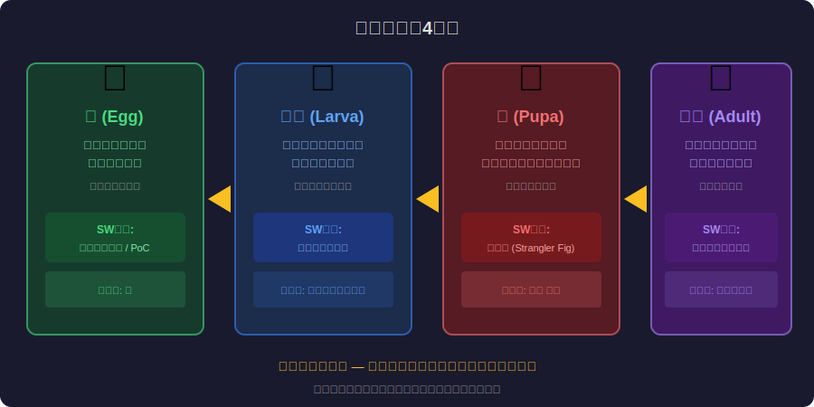
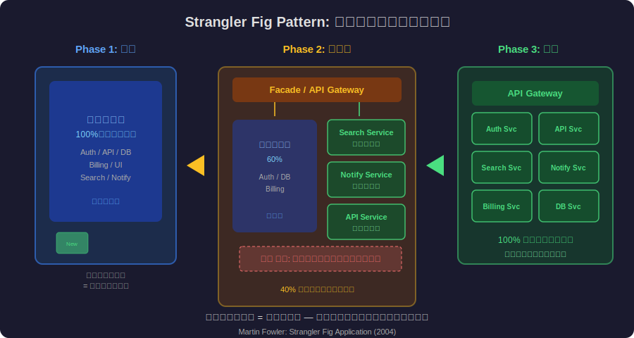
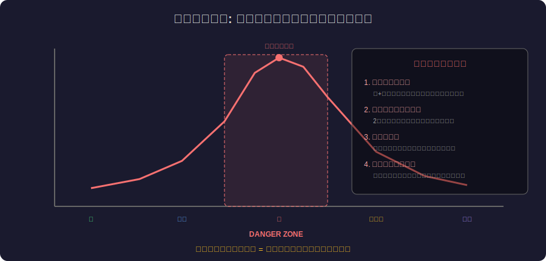
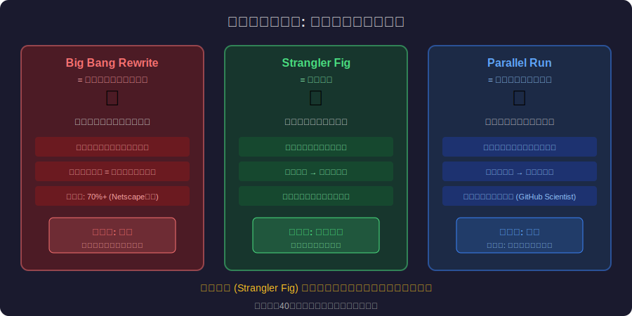

<!-- _class: lead -->
# 完全変態：モノリスがマイクロサービスに変わるとき

- Metamorphosis × Software Migration
- 
- 卵→幼虫→蛹→成虫 = プロトタイプ→モノリス→移行期→マイクロサービス


---

# Agenda

- - 1. 完全変態のメカニズム
- - 2. ソフトウェア移行への対応付け
- - 3. 蛹期の科学：イマジナル細胞
- - 4. Strangler Fig Pattern
- - 5. 蛹期の危険性と失敗例
- - 6. 成功する変態のための戦略


---

<!-- _class: lead -->
# 完全変態のメカニズム

- Chapter 1: Complete Metamorphosis


---

# 完全変態（ホロメタボラ）とは

- - **完全変態**: 卵→幼虫→蛹→成虫の4段階を経る劇的な変化
- - 昆虫の約80%が完全変態を行う（蝶、甲虫、ハエ、蜂）
- - 幼虫と成虫は **完全に異なる形態** で、食性も生態も違う
- - 蛹の中では幼虫の組織が **一度溶解** する
- - 「イマジナル細胞」が溶解物から新しい体を再構築
- - 自然界で最も劇的な「アーキテクチャ移行」


---

# 完全変態の4段階




---

<!-- _class: lead -->
# ソフトウェア移行への対応付け

- Chapter 2: Mapping to Software Migration


---

# 4段階のソフトウェア対応

- - **卵 (Egg) = プロトタイプ/PoC**: 最小限のコード、遺伝情報（設計意図）のみ
- - **幼虫 (Larva) = 成長期モノリス**: ひたすら機能を追加、肥大化するが動く
- - **蛹 (Pupa) = 移行期**: 内部を再構築中、新旧が同時に存在する最も脆弱な状態
- - **成虫 (Adult) = マイクロサービス**: 完全に異なるアーキテクチャ、スケーラブル
- - ほとんどのスタートアップは「幼虫期」で急成長する
- - 問題は「蛹」への遷移: いつ、どうやって変態するか


---

# 幼虫期の肥大化パターン

- - 幼虫は「食べて成長する」ことだけに特化 = **機能追加の高速化**
- - モノリスの幼虫期: 1つのリポジトリ、1つのデプロイ、1つのDB
- - メリット: 開発速度が速い、チーム間の調整が不要
- - デメリット: 技術的負債が蓄積、デプロイが巨大化
- - 「幼虫は飛べない」= モノリスはスケーリングの限界がある
- - 変態のトリガー: チームの拡大、性能限界、デプロイ頻度の低下


---

<!-- _class: lead -->
# 蛹期の科学

- Chapter 3: Science of the Pupal Stage


---

# イマジナル細胞の驚異

- - **イマジナル細胞**: 幼虫の体内に最初から存在する「成虫の設計図」
- - 幼虫の免疫系はイマジナル細胞を **異物として攻撃** する
- - 蛹期: 幼虫の組織が消化酵素で **溶解** → 栄養源になる
- - イマジナル細胞が増殖し、溶解物を材料に新しい体を構築
- - 旧組織が新組織の「栄養」になる = **既存コードの知見が新設計の糧になる**
- - 新旧が同時に存在する移行期間が必ず存在する


---

<!-- _class: lead -->
# Strangler Fig Pattern

- Chapter 4: Strangler Fig Pattern


---

# 絞め殺しの木 = 蛹の中のイマジナル細胞

- - Martin Fowler (2004): 熱帯の絞め殺しの木からの着想
- - 宿主の木に巻きつき、徐々に覆い尽くし、最後に宿主は枯れる
- - ソフトウェア: **Facade/Proxy** が新旧サービス間のルーティングを制御
- - 機能ごとに段階的に新サービスへ移行
- - 旧システムのトラフィックが徐々に減少 → 最後に廃止
- - イマジナル細胞が幼虫を内側から置き換えるのと同じプロセス


---

# Strangler Fig: 段階的移行の可視化




---

# 移行の実装パターン

- - 蛹期の移行を安全に進めるための技術パターン

```typescript
// Strangler Fig via API Gateway
const routeRequest = (req: Request) => {
  const feature = extractFeature(req);
  // Feature flag controls gradual migration
  if (migratedFeatures.has(feature)) {
    return newMicroservice.handle(req); // Imaginal cell
  }
  return oldMonolith.handle(req); // Larval tissue
};
// Traffic gradually shifts: 0% → 25% → 50% → 100%
```


---

<!-- _class: lead -->
# 蛹期の危険性

- Chapter 5: Dangers of the Pupal Stage


---

# なぜ移行中が最もリスクが高いか




---

# 蛹期の失敗例

- - **Netscape 6.0 (2000)**: Big Bang Rewrite で3年間開発停止 → シェア喪失
- - **Twitter (2012)**: Ruby → JVM 移行中にクジラページ（Fail Whale）頻発
- - **Digg v4 (2010)**: 全面リライトでユーザー体験が劣化 → ユーザー流出
- - **Healthcare.gov (2013)**: 新旧システムの統合失敗 → 初日からクラッシュ
- - 共通点: **蛹期の期間が長すぎた** or **新旧の共存を管理できなかった**
- - Joel Spolsky: 「スクラッチから書き直す」は最悪の戦略的ミス


---

<!-- _class: lead -->
# 成功する変態のための戦略

- Chapter 6: Strategies for Successful Metamorphosis


---

# 移行戦略の比較




---

# 蛹期を生き延びるためのチェックリスト

- - 1. **蛹期の最小化**: 移行期間を短くする（小さい機能から段階的に）
- - 2. **Facade/Proxy**: 新旧の切替を制御するルーティング層を最初に構築
- - 3. **ロールバック計画**: 各段階で旧システムに戻せる設計
- - 4. **並列テスト**: 新旧の出力を比較検証（GitHub Scientist パターン）
- - 5. **データ同期**: 新旧システム間のデータ整合性を保証する仕組み
- - 6. **チーム教育**: 新旧両方を理解するチーム体制の構築


---

<!-- _class: lead -->
# まとめ：変態は計画できる

- モノリスからマイクロサービスへの移行は「完全変態」
- 
- 蛹期が最も危険 — 新旧が同居する脆弱な時間を最小化せよ
- 
- イマジナル細胞のように、新サービスは内側から徐々に置き換える
- 
- **Big Bang Rewrite は脱皮型 — 完全変態（Strangler Fig）を選べ**

