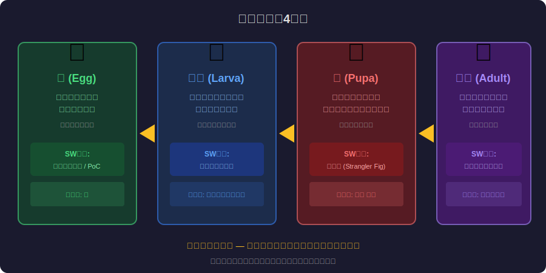
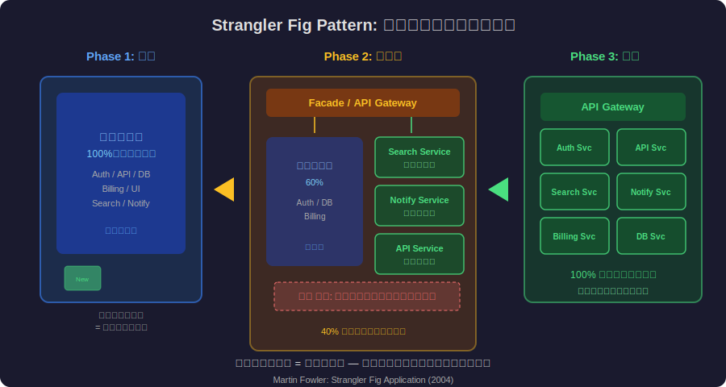
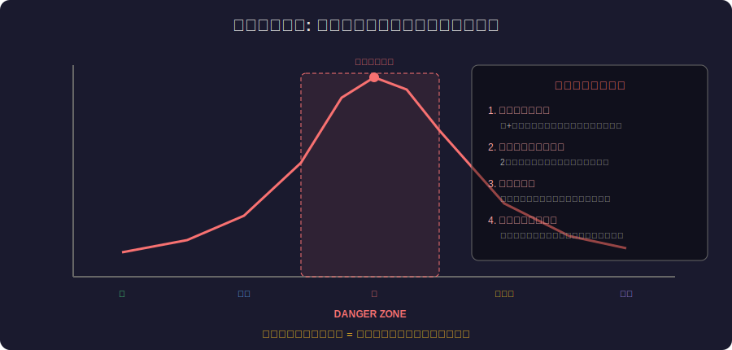
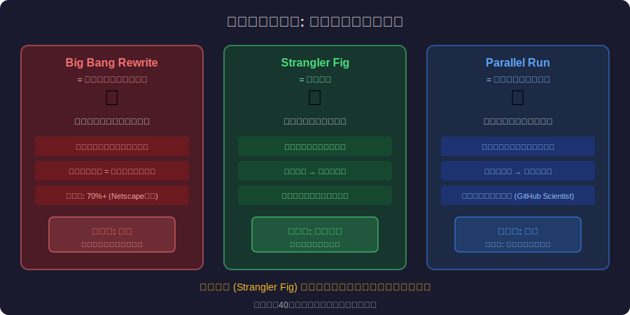

<!-- _class: lead -->
# 完全変態：モノリスがマイクロサービスに変わるとき

- Metamorphosis × Software Migration
- 
- 卵→幼虫→蛹→成虫 = プロトタイプ→モノリス→移行期→マイクロサービス


---

# Agenda

- - 1. 完全変態のメカニズム
- - 2. ソフトウェア移行への対応付け
- - 3. 蛹期の科学：イマジナル細胞
- - 4. Strangler Fig Pattern
- - 5. 蛹期の危険性と失敗例
- - 6. 成功する変態のための戦略


---

<!-- _class: lead -->
# 完全変態のメカニズム

- Chapter 1: Complete Metamorphosis


---

# 完全変態（ホロメタボラ）とは

- - **完全変態**: 卵→幼虫→蛹→成虫の4段階を経る劇的な変化
- - 昆虫の約80%が完全変態を行う（蝶、甲虫、ハエ、蜂）
- - 幼虫と成虫は **完全に異なる形態** で、食性も生態も違う
- - 蛹の中では幼虫の組織が **一度溶解** する
- - 「イマジナル細胞」が溶解物から新しい体を再構築
- - 自然界で最も劇的な「アーキテクチャ移行」


---

# 完全変態の4段階




---

<!-- _class: lead -->
# ソフトウェア移行への対応付け

- Chapter 2: Mapping to Software Migration


---

# 4段階のソフトウェア対応

- - **卵 (Egg) = プロトタイプ/PoC**: 最小限のコード、遺伝情報（設計意図）のみ
- - **幼虫 (Larva) = 成長期モノリス**: ひたすら機能を追加、肥大化するが動く
- - **蛹 (Pupa) = 移行期**: 内部を再構築中、新旧が同時に存在する最も脆弱な状態
- - **成虫 (Adult) = マイクロサービス**: 完全に異なるアーキテクチャ、スケーラブル
- - ほとんどのスタートアップは「幼虫期」で急成長する
- - 問題は「蛹」への遷移: いつ、どうやって変態するか


---

# 幼虫期の肥大化パターン

- <svg viewBox="0 0 800 300" style="max-height:70vh;max-width:100%;display:block;margin:0 auto;" xmlns="http://www.w3.org/2000/svg"><rect width="800" height="300" fill="#1a1a2e"/><text x="400" y="28" fill="#f9a825" font-size="17" font-family="sans-serif" text-anchor="middle" font-weight="bold">幼虫期の肥大化：モノリスの成長パターン</text><rect x="20" y="50" width="150" height="220" rx="10" fill="#16213e" stroke="#f9a825" stroke-width="2"/><text x="95" y="75" fill="#f9a825" font-size="12" font-family="sans-serif" text-anchor="middle" font-weight="bold">Year 1: 卵</text><circle cx="95" cy="130" r="18" fill="#f9a825" opacity="0.7"/><text x="95" y="136" fill="#1a1a2e" font-size="10" font-family="sans-serif" text-anchor="middle">PoC</text><text x="95" y="170" fill="#ffffff" font-size="11" font-family="sans-serif" text-anchor="middle">500 LOC</text><text x="95" y="190" fill="#aaaaaa" font-size="10" font-family="sans-serif" text-anchor="middle">1人チーム</text><text x="95" y="240" fill="#f9a825" font-size="11" font-family="sans-serif" text-anchor="middle">Deploy: 1min</text><rect x="190" y="50" width="150" height="220" rx="10" fill="#16213e" stroke="#f9a825" stroke-width="1.5"/><text x="265" y="75" fill="#f9a825" font-size="12" font-family="sans-serif" text-anchor="middle" font-weight="bold">Year 3: 幼虫</text><ellipse cx="265" cy="130" rx="30" ry="22" fill="#f9a825" opacity="0.7"/><text x="265" y="136" fill="#1a1a2e" font-size="10" font-family="sans-serif" text-anchor="middle">Monolith</text><text x="265" y="170" fill="#ffffff" font-size="11" font-family="sans-serif" text-anchor="middle">50K LOC</text><text x="265" y="190" fill="#aaaaaa" font-size="10" font-family="sans-serif" text-anchor="middle">10人チーム</text><text x="265" y="240" fill="#f9a825" font-size="11" font-family="sans-serif" text-anchor="middle">Deploy: 30min</text><rect x="360" y="50" width="150" height="220" rx="10" fill="#16213e" stroke="#e91e63" stroke-width="1.5"/><text x="435" y="75" fill="#e91e63" font-size="12" font-family="sans-serif" text-anchor="middle" font-weight="bold">Year 7: 巨大幼虫</text><ellipse cx="435" cy="130" rx="50" ry="35" fill="#e91e63" opacity="0.5"/><text x="435" y="136" fill="#ffffff" font-size="10" font-family="sans-serif" text-anchor="middle">Big Ball</text><text x="435" y="148" fill="#ffffff" font-size="10" font-family="sans-serif" text-anchor="middle">of Mud</text><text x="435" y="185" fill="#e91e63" font-size="11" font-family="sans-serif" text-anchor="middle">500K LOC</text><text x="435" y="205" fill="#aaaaaa" font-size="10" font-family="sans-serif" text-anchor="middle">100人チーム</text><text x="435" y="240" fill="#e91e63" font-size="11" font-family="sans-serif" text-anchor="middle">Deploy: 4時間!</text><rect x="530" y="50" width="250" height="220" rx="10" fill="#16213e" stroke="#e91e63" stroke-width="2"/><text x="655" y="75" fill="#e91e63" font-size="12" font-family="sans-serif" text-anchor="middle" font-weight="bold">変態のトリガー</text><text x="655" y="102" fill="#ffffff" font-size="12" font-family="sans-serif" text-anchor="middle">チームの拡大</text><text x="655" y="128" fill="#ffffff" font-size="12" font-family="sans-serif" text-anchor="middle">性能の限界</text><text x="655" y="154" fill="#ffffff" font-size="12" font-family="sans-serif" text-anchor="middle">デプロイ頻度の低下</text><text x="655" y="180" fill="#ffffff" font-size="12" font-family="sans-serif" text-anchor="middle">開発速度の激減</text><text x="655" y="215" fill="#f9a825" font-size="13" font-family="sans-serif" text-anchor="middle" font-weight="bold">蛹期への遷移</text><text x="655" y="237" fill="#aaaaaa" font-size="11" font-family="sans-serif" text-anchor="middle">Strangler Fig を選べ</text><polygon points="171,160 188,152 188,168" fill="#f9a825"/><polygon points="341,160 358,152 358,168" fill="#e91e63"/></svg>
- - 幼虫は「食べて成長する」ことだけに特化 = **機能追加の高速化**
- - モノリスの幼虫期: 1つのリポジトリ、1つのデプロイ、1つのDB
- - メリット: 開発速度が速い、チーム間の調整が不要
- - デメリット: 技術的負債が蓄積、デプロイが巨大化
- - 「幼虫は飛べない」= モノリスはスケーリングの限界がある
- - 変態のトリガー: チームの拡大、性能限界、デプロイ頻度の低下


---

<!-- _class: lead -->
# 蛹期の科学

- Chapter 3: Science of the Pupal Stage


---

# イマジナル細胞の驚異

- <svg viewBox="0 0 800 310" style="max-height:70vh;max-width:100%;display:block;margin:0 auto;" xmlns="http://www.w3.org/2000/svg"><rect width="800" height="310" fill="#1a1a2e"/><text x="400" y="28" fill="#f9a825" font-size="17" font-family="sans-serif" text-anchor="middle" font-weight="bold">イマジナル細胞の驚異：内側から新アーキテクチャが生まれる</text><rect x="20" y="50" width="360" height="240" rx="15" fill="#1e3a1e" stroke="#f9a825" stroke-width="2"/><text x="200" y="75" fill="#f9a825" font-size="13" font-family="sans-serif" text-anchor="middle" font-weight="bold">蛹の内部（移行期のシステム）</text><!-- Dissolving larval tissue --><ellipse cx="180" cy="165" rx="140" ry="90" fill="#2d5a27" opacity="0.4" stroke="#888" stroke-width="1.5" stroke-dasharray="6,4"/><text x="120" y="125" fill="#888" font-size="11" font-family="sans-serif">溶解する幼虫組織</text><text x="120" y="143" fill="#888" font-size="11" font-family="sans-serif">（旧モノリスコード）</text><!-- Imaginal cells growing --><circle cx="150" cy="175" r="15" fill="#f9a825" opacity="0.85"/><text x="150" y="180" fill="#1a1a2e" font-size="9" font-family="sans-serif" text-anchor="middle">Auth</text><circle cx="190" cy="195" r="15" fill="#f9a825" opacity="0.85"/><text x="190" y="200" fill="#1a1a2e" font-size="9" font-family="sans-serif" text-anchor="middle">API</text><circle cx="230" cy="175" r="15" fill="#f9a825" opacity="0.85"/><text x="230" y="180" fill="#1a1a2e" font-size="9" font-family="sans-serif" text-anchor="middle">DB</text><circle cx="170" cy="145" r="12" fill="#f9a825" opacity="0.65"/><circle cx="215" cy="142" r="12" fill="#f9a825" opacity="0.65"/><!-- Labels --><text x="195" y="245" fill="#f9a825" font-size="12" font-family="sans-serif" text-anchor="middle">イマジナル細胞</text><text x="195" y="263" fill="#aaaaaa" font-size="11" font-family="sans-serif" text-anchor="middle">（新マイクロサービス）</text><rect x="420" y="50" width="360" height="240" rx="15" fill="#16213e" stroke="#e91e63" stroke-width="2"/><text x="600" y="75" fill="#e91e63" font-size="13" font-family="sans-serif" text-anchor="middle" font-weight="bold">ソフトウェアでの対応</text><text x="450" y="108" fill="#ffffff" font-size="13" font-family="sans-serif">旧コード:</text><text x="450" y="128" fill="#aaaaaa" font-size="12" font-family="sans-serif">  モノリスが「溶解」</text><text x="450" y="148" fill="#aaaaaa" font-size="12" font-family="sans-serif">  → 知見が新設計の糧に</text><text x="450" y="175" fill="#ffffff" font-size="13" font-family="sans-serif">イマジナル細胞:</text><text x="450" y="195" fill="#f9a825" font-size="12" font-family="sans-serif">  新マイクロサービスが</text><text x="450" y="215" fill="#f9a825" font-size="12" font-family="sans-serif">  内側から徐々に置換</text><text x="450" y="245" fill="#e91e63" font-size="12" font-family="sans-serif">  Strangler Fig Pattern</text><text x="450" y="265" fill="#aaaaaa" font-size="11" font-family="sans-serif">  API Gateway でルーティング制御</text></svg>
- - **イマジナル細胞**: 幼虫の体内に最初から存在する「成虫の設計図」
- - 幼虫の免疫系はイマジナル細胞を **異物として攻撃** する
- - 蛹期: 幼虫の組織が消化酵素で **溶解** → 栄養源になる
- - イマジナル細胞が増殖し、溶解物を材料に新しい体を構築
- - 旧組織が新組織の「栄養」になる = **既存コードの知見が新設計の糧になる**
- - 新旧が同時に存在する移行期間が必ず存在する


---

<!-- _class: lead -->
# Strangler Fig Pattern

- Chapter 4: Strangler Fig Pattern


---

# 絞め殺しの木 = 蛹の中のイマジナル細胞

- - Martin Fowler (2004): 熱帯の絞め殺しの木からの着想
- - 宿主の木に巻きつき、徐々に覆い尽くし、最後に宿主は枯れる
- - ソフトウェア: **Facade/Proxy** が新旧サービス間のルーティングを制御
- - 機能ごとに段階的に新サービスへ移行
- - 旧システムのトラフィックが徐々に減少 → 最後に廃止
- - イマジナル細胞が幼虫を内側から置き換えるのと同じプロセス


---

# Strangler Fig: 段階的移行の可視化




---

# 移行の実装パターン

- - 蛹期の移行を安全に進めるための技術パターン


---

# 移行の実装パターン（コード例）

```typescript
// Strangler Fig via API Gateway
const routeRequest = (req: Request) => {
  const feature = extractFeature(req);
  // Feature flag controls gradual migration
  if (migratedFeatures.has(feature)) {
    return newMicroservice.handle(req); // Imaginal cell
  }
  return oldMonolith.handle(req); // Larval tissue
};
// Traffic gradually shifts: 0% → 25% → 50% → 100%
```


---

<!-- _class: lead -->
# 蛹期の危険性

- Chapter 5: Dangers of the Pupal Stage


---

# なぜ移行中が最もリスクが高いか




---

# 蛹期の失敗例

- <svg viewBox="0 0 800 280" style="max-height:70vh;max-width:100%;display:block;margin:0 auto;" xmlns="http://www.w3.org/2000/svg"><rect width="800" height="280" fill="#1a1a2e"/><text x="400" y="28" fill="#e91e63" font-size="17" font-family="sans-serif" text-anchor="middle" font-weight="bold">Big Bang Rewrite の失敗パターン</text><!-- Timeline --><line x1="50" y1="100" x2="750" y2="100" stroke="#555" stroke-width="2"/><polygon points="748,95 762,100 748,105" fill="#555"/><!-- Netscape case --><line x1="150" y1="90" x2="150" y2="70" stroke="#e91e63" stroke-width="2"/><circle cx="150" cy="100" r="8" fill="#e91e63"/><text x="150" y="55" fill="#e91e63" font-size="11" font-family="sans-serif" text-anchor="middle">Netscape 6</text><text x="150" y="140" fill="#aaaaaa" font-size="10" font-family="sans-serif" text-anchor="middle">2000</text><text x="150" y="158" fill="#aaaaaa" font-size="10" font-family="sans-serif" text-anchor="middle">3年開発停止</text><!-- Digg case --><line x1="320" y1="90" x2="320" y2="70" stroke="#e91e63" stroke-width="2"/><circle cx="320" cy="100" r="8" fill="#e91e63"/><text x="320" y="55" fill="#e91e63" font-size="11" font-family="sans-serif" text-anchor="middle">Digg v4</text><text x="320" y="140" fill="#aaaaaa" font-size="10" font-family="sans-serif" text-anchor="middle">2010</text><text x="320" y="158" fill="#aaaaaa" font-size="10" font-family="sans-serif" text-anchor="middle">体験劣化→流出</text><!-- Healthcare.gov --><line x1="490" y1="90" x2="490" y2="70" stroke="#e91e63" stroke-width="2"/><circle cx="490" cy="100" r="8" fill="#e91e63"/><text x="490" y="55" fill="#e91e63" font-size="11" font-family="sans-serif" text-anchor="middle">Healthcare.gov</text><text x="490" y="140" fill="#aaaaaa" font-size="10" font-family="sans-serif" text-anchor="middle">2013</text><text x="490" y="158" fill="#aaaaaa" font-size="10" font-family="sans-serif" text-anchor="middle">初日クラッシュ</text><!-- Correct approach box --><rect x="100" y="185" width="600" height="75" rx="10" fill="#16213e" stroke="#f9a825" stroke-width="2"/><text x="400" y="210" fill="#f9a825" font-size="14" font-family="sans-serif" text-anchor="middle" font-weight="bold">正解：完全変態（Strangler Fig）を選べ</text><text x="400" y="233" fill="#ffffff" font-size="12" font-family="sans-serif" text-anchor="middle">蛹期を最小化 → Facade/Proxy → 段階移行 → ロールバック計画 → 並列テスト</text><text x="400" y="253" fill="#aaaaaa" font-size="11" font-family="sans-serif" text-anchor="middle">Big Bang Rewrite = 脱皮型（失敗例多数）/ Strangler Fig = 完全変態型（推奨）</text></svg>
- - **Netscape 6.0 (2000)**: Big Bang Rewrite で3年間開発停止 → シェア喪失
- - **Twitter (2012)**: Ruby → JVM 移行中にクジラページ（Fail Whale）頻発
- - **Digg v4 (2010)**: 全面リライトでユーザー体験が劣化 → ユーザー流出
- - **Healthcare.gov (2013)**: 新旧システムの統合失敗 → 初日からクラッシュ
- - 共通点: **蛹期の期間が長すぎた** or **新旧の共存を管理できなかった**
- - Joel Spolsky: 「スクラッチから書き直す」は最悪の戦略的ミス


---

<!-- _class: lead -->
# 成功する変態のための戦略

- Chapter 6: Strategies for Successful Metamorphosis


---

# 移行戦略の比較




---

# 蛹期を生き延びるためのチェックリスト

- <svg viewBox="0 0 800 310" style="max-height:70vh;max-width:100%;display:block;margin:0 auto;" xmlns="http://www.w3.org/2000/svg"><rect width="800" height="310" fill="#1a1a2e"/><text x="400" y="28" fill="#f9a825" font-size="17" font-family="sans-serif" text-anchor="middle" font-weight="bold">移行戦略比較：蛹期の長さと安全性</text><rect x="20" y="50" width="230" height="240" rx="12" fill="#16213e" stroke="#e91e63" stroke-width="2.5"/><text x="135" y="78" fill="#e91e63" font-size="14" font-family="sans-serif" text-anchor="middle" font-weight="bold">Big Bang Rewrite</text><text x="135" y="100" fill="#ffffff" font-size="12" font-family="sans-serif" text-anchor="middle">全面書き直し</text><text x="135" y="120" fill="#aaaaaa" font-size="11" font-family="sans-serif" text-anchor="middle">脱皮型（Ecdysis）</text><text x="135" y="150" fill="#e91e63" font-size="12" font-family="sans-serif" text-anchor="middle">蛹期: 長い（1-5年）</text><text x="135" y="172" fill="#e91e63" font-size="12" font-family="sans-serif" text-anchor="middle">リスク: 極高</text><text x="135" y="200" fill="#ffffff" font-size="11" font-family="sans-serif" text-anchor="middle">開発停止期間あり</text><text x="135" y="220" fill="#ffffff" font-size="11" font-family="sans-serif" text-anchor="middle">ロールバック不能</text><text x="135" y="260" fill="#e91e63" font-size="13" font-family="sans-serif" text-anchor="middle" font-weight="bold">非推奨</text><rect x="285" y="50" width="230" height="240" rx="12" fill="#16213e" stroke="#f9a825" stroke-width="2"/><text x="400" y="78" fill="#f9a825" font-size="14" font-family="sans-serif" text-anchor="middle" font-weight="bold">Strangler Fig</text><text x="400" y="100" fill="#ffffff" font-size="12" font-family="sans-serif" text-anchor="middle">段階的置換</text><text x="400" y="120" fill="#aaaaaa" font-size="11" font-family="sans-serif" text-anchor="middle">完全変態型</text><text x="400" y="150" fill="#f9a825" font-size="12" font-family="sans-serif" text-anchor="middle">蛹期: 短い（機能単位）</text><text x="400" y="172" fill="#f9a825" font-size="12" font-family="sans-serif" text-anchor="middle">リスク: 低〜中</text><text x="400" y="200" fill="#ffffff" font-size="11" font-family="sans-serif" text-anchor="middle">常に稼動継続</text><text x="400" y="220" fill="#ffffff" font-size="11" font-family="sans-serif" text-anchor="middle">ロールバック可能</text><text x="400" y="260" fill="#f9a825" font-size="13" font-family="sans-serif" text-anchor="middle" font-weight="bold">推奨</text><rect x="550" y="50" width="230" height="240" rx="12" fill="#16213e" stroke="#f9a825" stroke-width="1.5"/><text x="665" y="78" fill="#f9a825" font-size="14" font-family="sans-serif" text-anchor="middle" font-weight="bold">Parallel Run</text><text x="665" y="100" fill="#ffffff" font-size="12" font-family="sans-serif" text-anchor="middle">並列実行</text><text x="665" y="120" fill="#aaaaaa" font-size="11" font-family="sans-serif" text-anchor="middle">ハイブリッド型</text><text x="665" y="150" fill="#f9a825" font-size="12" font-family="sans-serif" text-anchor="middle">蛹期: 中程度</text><text x="665" y="172" fill="#f9a825" font-size="12" font-family="sans-serif" text-anchor="middle">リスク: 中</text><text x="665" y="200" fill="#ffffff" font-size="11" font-family="sans-serif" text-anchor="middle">新旧を並列比較</text><text x="665" y="220" fill="#ffffff" font-size="11" font-family="sans-serif" text-anchor="middle">GitHub Scientist</text><text x="665" y="260" fill="#f9a825" font-size="13" font-family="sans-serif" text-anchor="middle" font-weight="bold">状況次第</text></svg>
- - 1. **蛹期の最小化**: 移行期間を短くする（小さい機能から段階的に）
- - 2. **Facade/Proxy**: 新旧の切替を制御するルーティング層を最初に構築
- - 3. **ロールバック計画**: 各段階で旧システムに戻せる設計
- - 4. **並列テスト**: 新旧の出力を比較検証（GitHub Scientist パターン）
- - 5. **データ同期**: 新旧システム間のデータ整合性を保証する仕組み
- - 6. **チーム教育**: 新旧両方を理解するチーム体制の構築


---

<!-- _class: lead -->
# まとめ：変態は計画できる

- モノリスからマイクロサービスへの移行は「完全変態」
- 
- 蛹期が最も危険 — 新旧が同居する脆弱な時間を最小化せよ
- 
- イマジナル細胞のように、新サービスは内側から徐々に置き換える
- 
- **Big Bang Rewrite は脱皮型 — 完全変態（Strangler Fig）を選べ**

