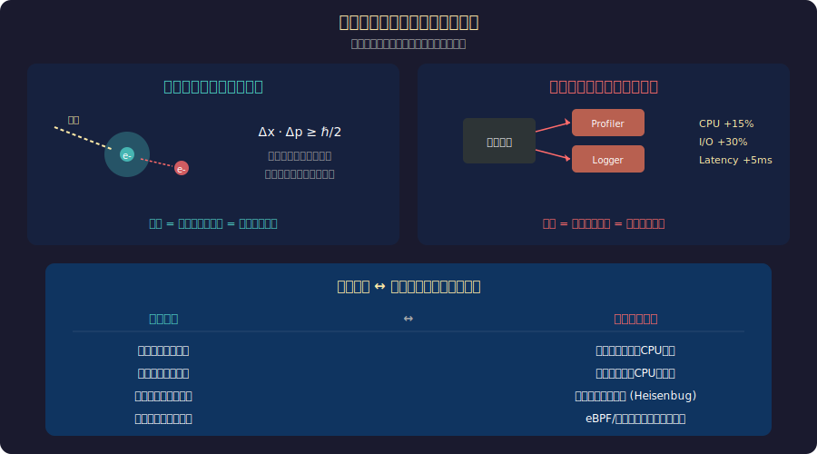

<!-- _class: lead -->
# 観察者効果とHeisenbug
— プロファイラを起動した途端に消えるバグ

- 量子力学の「観察者効果」がソフトウェアデバッグにも現れる
- Heisenbug：デバッグツールで観察すると消えるバグ
- なぜ測定行為が測定対象を変えるのか

---

# アジェンダ

> *定義→量子類比→メカニズム→対策の5章で根絶策を習得する*

- 1. Heisenbugsとは何か
- 2. 量子力学の観察者効果との類比
- 3. Heisenbugsが発生するメカニズム
- 4. 不確定性原理とデバッグの限界
- 5. 実践的な対策

---

<!-- _class: lead -->
# Heisenbugsとは

---

# 観察すると消えるバグ（1/2）

> *デバッガ接続でタイミングが変わりバグが再現しなくなる*

- **Heisenbug（ハイゼンバグ）の定義：**
- デバッガやプロファイラで調査しようとすると再現しなくなるバグ
- 名前の由来：Werner Heisenbergの不確定性原理
- ---
- **典型的なシナリオ：**
- 本番環境でクラッシュ → デバッグビルドで再現しない

---

# 観察すると消えるバグ（2/2）（1/2）

> *Race/Timing/Cache効果が観察ツールで消える4類型*

- <svg viewBox="0 0 800 310" style="max-height:70vh;max-width:100%;display:block;margin:0 auto;" xmlns="http://www.w3.org/2000/svg"><rect width="800" height="310" fill="#1a1a2e"/><text x="400" y="28" fill="#f9a825" font-size="17" font-family="sans-serif" text-anchor="middle" font-weight="bold">バグ分類学：物理学から命名された4種</text><rect x="30" y="50" width="170" height="230" rx="12" fill="#16213e" stroke="#e91e63" stroke-width="2.5"/><text x="115" y="80" fill="#e91e63" font-size="15" font-family="sans-serif" text-anchor="middle" font-weight="bold">Heisenbug</text><text x="115" y="103" fill="#ffffff" font-size="12" font-family="sans-serif" text-anchor="middle">観察すると消える</text><text x="115" y="125" fill="#ffffff" font-size="12" font-family="sans-serif" text-anchor="middle">デバッガで再現しない</text><text x="115" y="155" fill="#aaaaaa" font-size="11" font-family="sans-serif" text-anchor="middle">由来: W. Heisenberg</text><text x="115" y="173" fill="#aaaaaa" font-size="11" font-family="sans-serif" text-anchor="middle">不確定性原理</text><text x="115" y="200" fill="#f9a825" font-size="11" font-family="sans-serif" text-anchor="middle">Race Condition</text><text x="115" y="218" fill="#f9a825" font-size="11" font-family="sans-serif" text-anchor="middle">Timing Bug</text><text x="115" y="236" fill="#f9a825" font-size="11" font-family="sans-serif" text-anchor="middle">Cache Effect</text><rect x="220" y="50" width="170" height="230" rx="12" fill="#16213e" stroke="#f9a825" stroke-width="1.5"/><text x="305" y="80" fill="#f9a825" font-size="15" font-family="sans-serif" text-anchor="middle" font-weight="bold">Bohrbug</text><text x="305" y="103" fill="#ffffff" font-size="12" font-family="sans-serif" text-anchor="middle">決定論的に再現する</text><text x="305" y="125" fill="#ffffff" font-size="12" font-family="sans-serif" text-anchor="middle">Bohr原子モデルのように</text><text x="305" y="147" fill="#ffffff" font-size="12" font-family="sans-serif" text-anchor="middle">予測可能</text><text x="305" y="175" fill="#aaaaaa" font-size="11" font-family="sans-serif" text-anchor="middle">由来: Niels Bohr</text><text x="305" y="193" fill="#aaaaaa" font-size="11" font-family="sans-serif" text-anchor="middle">量子論の確率 vs 古典論</text><text x="305" y="225" fill="#f9a825" font-size="11" font-family="sans-serif" text-anchor="middle">通常のバグ</text><text x="305" y="243" fill="#f9a825" font-size="11" font-family="sans-serif" text-anchor="middle">デバッグ容易</text><rect x="410" y="50" width="170" height="230" rx="12" fill="#16213e" stroke="#f9a825" stroke-width="1.5"/><text x="495" y="80" fill="#f9a825" font-size="15" font-family="sans-serif" text-anchor="middle" font-weight="bold">Mandelbug</text><text x="495" y="103" fill="#ffffff" font-size="12" font-family="sans-serif" text-anchor="middle">原因が複雑で</text><text x="495" y="123" fill="#ffffff" font-size="12" font-family="sans-serif" text-anchor="middle">カオス的に振る舞う</text><text x="495" y="145" fill="#ffffff" font-size="12" font-family="sans-serif" text-anchor="middle">予測不可能</text><text x="495" y="175" fill="#aaaaaa" font-size="11" font-family="sans-serif" text-anchor="middle">由来: B. Mandelbrot</text><text x="495" y="193" fill="#aaaaaa" font-size="11" font-family="sans-serif" text-anchor="middle">フラクタル・カオス理論</text><text x="495" y="225" fill="#f9a825" font-size="11" font-family="sans-serif" text-anchor="middle">複雑なシステム間相互作用</text><rect x="600" y="50" width="170" height="230" rx="12" fill="#16213e" stroke="#f9a825" stroke-width="1.5"/><text x="685" y="80" fill="#f9a825" font-size="15" font-family="sans-serif" text-anchor="middle" font-weight="bold">Schrodingerbug</text><text x="685" y="103" fill="#ffffff" font-size="12" font-family="sans-serif" text-anchor="middle">コードレビュー中に</text><text x="685" y="123" fill="#ffffff" font-size="12" font-family="sans-serif" text-anchor="middle">存在が確定する</text><text x="685" y="145" fill="#ffffff" font-size="12" font-family="sans-serif" text-anchor="middle">観察前は不定</text><text x="685" y="175" fill="#aaaaaa" font-size="11" font-family="sans-serif" text-anchor="middle">由来: E. Schrodinger</text><text x="685" y="193" fill="#aaaaaa" font-size="11" font-family="sans-serif" text-anchor="middle">量子重ね合わせ</text><text x="685" y="225" fill="#f9a825" font-size="11" font-family="sans-serif" text-anchor="middle">潜在的な設計ミス</text></svg>
- プロファイラ起動中は正常動作 → 停止すると再発
- printfデバッグ追加 → バグが消える
- ---

---

# 観察すると消えるバグ（2/2）（2/2）

> *Bohrbug/Mandelbug/Schrödingerbugで分類し対処戦略を変える*

- **他の「バグ分類学」：**
- - **Bohrbug**：確実に再現する（Bohr原子モデルのように決定論的）
- - **Mandelbug**：原因が複雑で予測不可能
- - **Schrödingerbug**：コードレビューで存在が確定する

---

# 量子力学との類比（1/2）

> *測定行為が対象を変える——物理とSWに共通する本質*

- <svg viewBox="0 0 800 320" style="max-height:70vh;max-width:100%;display:block;margin:0 auto;" xmlns="http://www.w3.org/2000/svg"><rect width="800" height="320" fill="#1a1a2e"/><text x="400" y="28" fill="#f9a825" font-size="17" font-family="sans-serif" text-anchor="middle" font-weight="bold">観察者効果：測定行為が対象を変える</text><rect x="20" y="50" width="365" height="250" rx="12" fill="#16213e" stroke="#f9a825" stroke-width="2"/><text x="202" y="78" fill="#f9a825" font-size="14" font-family="sans-serif" text-anchor="middle" font-weight="bold">量子力学</text><text x="202" y="100" fill="#ffffff" font-size="12" font-family="sans-serif" text-anchor="middle">光子で電子の位置を測定</text><ellipse cx="140" cy="160" rx="40" ry="40" fill="none" stroke="#e91e63" stroke-width="2" stroke-dasharray="6,3"/><text x="140" y="155" fill="#e91e63" font-size="11" font-family="sans-serif" text-anchor="middle">電子</text><text x="140" y="172" fill="#e91e63" font-size="11" font-family="sans-serif" text-anchor="middle">|ψ⟩</text><line x1="200" y1="145" x2="275" y2="120" stroke="#f9a825" stroke-width="2"/><polygon points="271,118 283,113 278,126" fill="#f9a825"/><text x="265" y="108" fill="#f9a825" font-size="11" font-family="sans-serif" text-anchor="middle">光子</text><rect x="275" y="135" width="80" height="50" rx="8" fill="#16213e" stroke="#f9a825" stroke-width="1.5"/><text x="315" y="158" fill="#f9a825" font-size="11" font-family="sans-serif" text-anchor="middle">検出器</text><text x="315" y="175" fill="#aaaaaa" font-size="10" font-family="sans-serif" text-anchor="middle">(測定)</text><line x1="185" y1="170" x2="140" y2="200" stroke="#e91e63" stroke-width="1.5" stroke-dasharray="4,3"/><text x="175" y="215" fill="#e91e63" font-size="11" font-family="sans-serif" text-anchor="middle">状態が変化</text><text x="202" y="250" fill="#aaaaaa" font-size="12" font-family="sans-serif" text-anchor="middle">測定により量子状態が「崩壊」</text><text x="202" y="270" fill="#ffffff" font-size="11" font-family="sans-serif" text-anchor="middle">位置確定 → 運動量が不確定に</text><rect x="415" y="50" width="365" height="250" rx="12" fill="#16213e" stroke="#e91e63" stroke-width="2"/><text x="597" y="78" fill="#e91e63" font-size="14" font-family="sans-serif" text-anchor="middle" font-weight="bold">ソフトウェアデバッグ</text><text x="597" y="100" fill="#ffffff" font-size="12" font-family="sans-serif" text-anchor="middle">デバッガがプログラム状態を変える</text><rect x="440" y="115" width="130" height="40" rx="8" fill="#16213e" stroke="#aaaaaa" stroke-width="1.5"/><text x="505" y="140" fill="#aaaaaa" font-size="12" font-family="sans-serif" text-anchor="middle">本番環境</text><line x1="580" y1="135" x2="640" y2="135" stroke="#e91e63" stroke-width="2"/><polygon points="636,130 650,135 636,140" fill="#e91e63"/><text x="655" y="125" fill="#e91e63" font-size="11" font-family="sans-serif" text-anchor="middle">デバッガ</text><text x="655" y="142" fill="#e91e63" font-size="11" font-family="sans-serif" text-anchor="middle">接続</text><rect x="440" y="180" width="130" height="40" rx="8" fill="#f9a825" opacity="0.8"/><text x="505" y="205" fill="#1a1a2e" font-size="12" font-family="sans-serif" text-anchor="middle" font-weight="bold">環境が変化</text><polygon points="500,162 505,178 510,162" fill="#e91e63"/><line x1="505" y1="155" x2="505" y2="178" stroke="#e91e63" stroke-width="2"/><text x="597" y="250" fill="#aaaaaa" font-size="12" font-family="sans-serif" text-anchor="middle">スレッドタイミングが変化</text><text x="597" y="270" fill="#ffffff" font-size="11" font-family="sans-serif" text-anchor="middle">バグが消える → Heisenbug!</text></svg>
- **ハイゼンベルクの不確定性原理（1927年）：**
- 位置と運動量を同時に正確に測定することは不可能
- 測定行為が粒子の状態を変化させる
- ---
- **ソフトウェアの「観察者効果」：**
- デバッガ：プログラムの実行タイミングを変える

---

# 量子力学との類比（2/2）

> *プロファイラ・ロギング全て介入——測定ゼロの観察が必要*

- プロファイラ：CPUキャッシュとメモリアクセスパターンを変える
- ロギング：I/Oレイテンシを追加しスレッドスケジューリングを変える
- ---
- **共通の本質：**
- 「観察ツールが観察対象と相互作用する」
- 測定は常にシステムに介入している

---

# Heisenbugsのメカニズム（1/2）（1/2）

> *ブレークポイントがスレッドタイミングを変えバグを消す*

- <svg viewBox="0 0 800 310" style="max-height:70vh;max-width:100%;display:block;margin:0 auto;" xmlns="http://www.w3.org/2000/svg"><rect width="800" height="310" fill="#1a1a2e"/><text x="400" y="28" fill="#f9a825" font-size="17" font-family="sans-serif" text-anchor="middle" font-weight="bold">Heisenbugsのメカニズム：レースコンディション</text><text x="100" y="60" fill="#f9a825" font-size="13" font-family="sans-serif" text-anchor="middle">Thread A</text><text x="500" y="60" fill="#e91e63" font-size="13" font-family="sans-serif" text-anchor="middle">Thread B</text><text x="700" y="60" fill="#ffffff" font-size="13" font-family="sans-serif" text-anchor="middle">共有変数 x</text><line x1="100" y1="70" x2="100" y2="270" stroke="#f9a825" stroke-width="2"/><line x1="500" y1="70" x2="500" y2="270" stroke="#e91e63" stroke-width="2"/><rect x="660" y="70" width="120" height="40" rx="8" fill="#16213e" stroke="#ffffff" stroke-width="1.5"/><text x="720" y="95" fill="#ffffff" font-size="13" font-family="sans-serif" text-anchor="middle">x = 0</text><rect x="30" y="100" width="140" height="35" rx="6" fill="#f9a825" opacity="0.85"/><text x="100" y="122" fill="#1a1a2e" font-size="12" font-family="sans-serif" text-anchor="middle" font-weight="bold">read x (= 0)</text><line x1="170" y1="115" x2="660" y2="115" stroke="#f9a825" stroke-width="1.5" stroke-dasharray="5,3"/><rect x="430" y="145" width="140" height="35" rx="6" fill="#e91e63" opacity="0.85"/><text x="500" y="167" fill="#ffffff" font-size="12" font-family="sans-serif" text-anchor="middle" font-weight="bold">read x (= 0)</text><line x1="430" y1="162" x2="660" y2="162" stroke="#e91e63" stroke-width="1.5" stroke-dasharray="5,3"/><rect x="30" y="185" width="140" height="35" rx="6" fill="#f9a825" opacity="0.85"/><text x="100" y="207" fill="#1a1a2e" font-size="12" font-family="sans-serif" text-anchor="middle" font-weight="bold">write x = 1</text><line x1="170" y1="202" x2="660" y2="202" stroke="#f9a825" stroke-width="1.5"/><rect x="660" y="190" width="120" height="40" rx="8" fill="#f9a825" opacity="0.85"/><text x="720" y="215" fill="#1a1a2e" font-size="13" font-family="sans-serif" text-anchor="middle" font-weight="bold">x = 1</text><rect x="430" y="222" width="140" height="35" rx="6" fill="#e91e63" opacity="0.85"/><text x="500" y="244" fill="#ffffff" font-size="12" font-family="sans-serif" text-anchor="middle" font-weight="bold">write x = 1</text><line x1="430" y1="239" x2="660" y2="239" stroke="#e91e63" stroke-width="1.5"/><rect x="660" y="228" width="120" height="40" rx="8" fill="#e91e63" opacity="0.85"/><text x="720" y="253" fill="#ffffff" font-size="13" font-family="sans-serif" text-anchor="middle" font-weight="bold">x = 1 !</text><text x="400" y="290" fill="#aaaaaa" font-size="12" font-family="sans-serif" text-anchor="middle">デバッガのブレークポイント → スレッド停止 → タイミング変化 → バグが消える</text></svg>
- **レースコンディション型：**
- スレッドA とスレッドB の実行順が問題
- デバッガのブレークポイント → スレッドが停止 → タイミングが変わる

---

# Heisenbugsのメカニズム（1/2）（2/2）

> *デバッグビルドの速度低下がタイミングずれを解消してバグを消す*

- → バグが発生しない条件に変化
- ---
- **タイミング依存型：**
- リアルタイム処理でマイクロ秒オーダーの問題
- デバッグビルド（最適化なし）→ 実行速度が低下 → タイミングずれ解消

---

# Heisenbugsのメカニズム（2/2）（1/2）

> *デバッグモードのメモリ配置変化がアライメント違反をマスクする*

- ---
- **メモリアライメント型：**
- デバッグモードでは変数の配置が変わる
- → アライメント違反が偶然マスクされる

---

# Heisenbugsのメカニズム（2/2）（2/2）

> *プロファイラのキャッシュ汚染が本番と異なるアクセスパターンを生む*

- ---
- **キャッシュ効果型：**
- プロファイラがCPUキャッシュを汚染
- → 本番とは異なるメモリアクセスパターンになる

---

# 不確定性とデバッグの限界

- ****

---

# 実践的な対策（1/2）（1/2）

> *Core Dump+非侵襲ログで本番条件を維持して観察する*

- <svg viewBox="0 0 800 300" style="max-height:70vh;max-width:100%;display:block;margin:0 auto;" xmlns="http://www.w3.org/2000/svg"><rect width="800" height="300" fill="#1a1a2e"/><text x="400" y="28" fill="#f9a825" font-size="17" font-family="sans-serif" text-anchor="middle" font-weight="bold">非侵襲的デバッグ戦略</text><rect x="20" y="50" width="175" height="220" rx="12" fill="#16213e" stroke="#f9a825" stroke-width="2"/><text x="107" y="78" fill="#f9a825" font-size="13" font-family="sans-serif" text-anchor="middle" font-weight="bold">Core Dump</text><text x="107" y="100" fill="#ffffff" font-size="11" font-family="sans-serif" text-anchor="middle">クラッシュ後解析</text><text x="107" y="118" fill="#ffffff" font-size="11" font-family="sans-serif" text-anchor="middle">実行中介入なし</text><text x="107" y="148" fill="#aaaaaa" font-size="10" font-family="sans-serif" text-anchor="middle">侵襲度: 最小</text><text x="107" y="170" fill="#f9a825" font-size="11" font-family="sans-serif" text-anchor="middle">gcore / coredumpctl</text><text x="107" y="195" fill="#ffffff" font-size="10" font-family="sans-serif" text-anchor="middle">クラッシュ再現性</text><text x="107" y="213" fill="#ffffff" font-size="10" font-family="sans-serif" text-anchor="middle">なしでも解析可能</text><rect x="210" y="50" width="175" height="220" rx="12" fill="#16213e" stroke="#f9a825" stroke-width="1.5"/><text x="297" y="78" fill="#f9a825" font-size="13" font-family="sans-serif" text-anchor="middle" font-weight="bold">Ring Buffer Log</text><text x="297" y="100" fill="#ffffff" font-size="11" font-family="sans-serif" text-anchor="middle">非同期ロギング</text><text x="297" y="118" fill="#ffffff" font-size="11" font-family="sans-serif" text-anchor="middle">I/Oなし</text><text x="297" y="148" fill="#aaaaaa" font-size="10" font-family="sans-serif" text-anchor="middle">侵襲度: 低</text><text x="297" y="170" fill="#f9a825" font-size="11" font-family="sans-serif" text-anchor="middle">eBPF / perf_event</text><text x="297" y="195" fill="#ffffff" font-size="10" font-family="sans-serif" text-anchor="middle">タイミング影響</text><text x="297" y="213" fill="#ffffff" font-size="10" font-family="sans-serif" text-anchor="middle">最小のロギング</text><rect x="400" y="50" width="175" height="220" rx="12" fill="#16213e" stroke="#e91e63" stroke-width="1.5"/><text x="487" y="78" fill="#e91e63" font-size="13" font-family="sans-serif" text-anchor="middle" font-weight="bold">Sanitizers</text><text x="487" y="100" fill="#ffffff" font-size="11" font-family="sans-serif" text-anchor="middle">コンパイラ支援</text><text x="487" y="118" fill="#ffffff" font-size="11" font-family="sans-serif" text-anchor="middle">静的+動的解析</text><text x="487" y="148" fill="#aaaaaa" font-size="10" font-family="sans-serif" text-anchor="middle">侵襲度: 中（解析用）</text><text x="487" y="170" fill="#e91e63" font-size="11" font-family="sans-serif" text-anchor="middle">ThreadSanitizer</text><text x="487" y="188" fill="#e91e63" font-size="11" font-family="sans-serif" text-anchor="middle">AddressSanitizer</text><text x="487" y="213" fill="#ffffff" font-size="10" font-family="sans-serif" text-anchor="middle">本番ではなく</text><text x="487" y="231" fill="#ffffff" font-size="10" font-family="sans-serif" text-anchor="middle">CI/CDで実行</text><rect x="590" y="50" width="190" height="220" rx="12" fill="#16213e" stroke="#e91e63" stroke-width="2"/><text x="685" y="78" fill="#e91e63" font-size="13" font-family="sans-serif" text-anchor="middle" font-weight="bold">設計で防ぐ</text><text x="685" y="100" fill="#ffffff" font-size="11" font-family="sans-serif" text-anchor="middle">イミュータブル</text><text x="685" y="118" fill="#ffffff" font-size="11" font-family="sans-serif" text-anchor="middle">データ構造</text><text x="685" y="148" fill="#aaaaaa" font-size="10" font-family="sans-serif" text-anchor="middle">侵襲度: 0（予防）</text><text x="685" y="170" fill="#e91e63" font-size="11" font-family="sans-serif" text-anchor="middle">Rust / Haskell</text><text x="685" y="188" fill="#e91e63" font-size="11" font-family="sans-serif" text-anchor="middle">Observability</text><text x="685" y="213" fill="#ffffff" font-size="10" font-family="sans-serif" text-anchor="middle">レースコンディション</text><text x="685" y="231" fill="#ffffff" font-size="10" font-family="sans-serif" text-anchor="middle">を根本から排除</text></svg>
- **1. 観察を最小限にする：**
- 本番と同じ条件でのテスト（リリースビルド）
- 非侵襲的なデバッグ：core dumpやクラッシュレポート分析

---

# 実践的な対策（1/2）（2/2）

> *非同期リングバッファで本番タイミングを保ちつつログを記録する*

- ---
- **2. ロギングの工夫：**
- リングバッファへの非同期ロギング（I/Oレイテンシを排除）
- クラッシュ後にダンプする「ブラックボックス」方式

---

# 実践的な対策（2/2）（1/2）

> *TSan+確率的テストでレースを再現しCI段階で検出する*

- ---
- **3. 静的解析と動的解析の活用：**
- ThreadSanitizer / AddressSanitizer（コンパイラ支援）
- 確率的テスト（ランダムな遅延挿入でレースを再現）

---

# 実践的な対策（2/2）（2/2）

> *イミュータブル設計でレースを根絶しObservabilityで代替観察する*

- ---
- **4. 設計で防ぐ：**
- イミュータブルなデータ構造でレースコンディションを排除
- 「観察可能性（Observability）」をシステムに組み込む

---

# まとめ：測定は介入である

> *非侵襲観察+設計で防ぐ——量子の教訓をSWに活かす*

- ✅ **Heisenbug：デバッグツールが問題のタイミング・状態を変化させる**
- ✅ **量子力学の観察者効果と同じ本質：測定は常に介入**
- ✅ **レースコンディション・タイミング・キャッシュ効果が主要原因**
- ✅ **対策：非侵襲的観察・コンパイラ支援・設計で防ぐ**
- 
- 「バグを見ると消える。見ないと再現する。それが量子コンピュータの夢だ」

