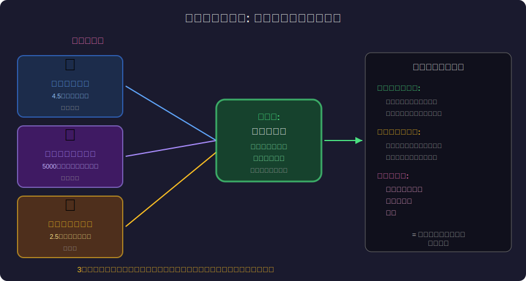
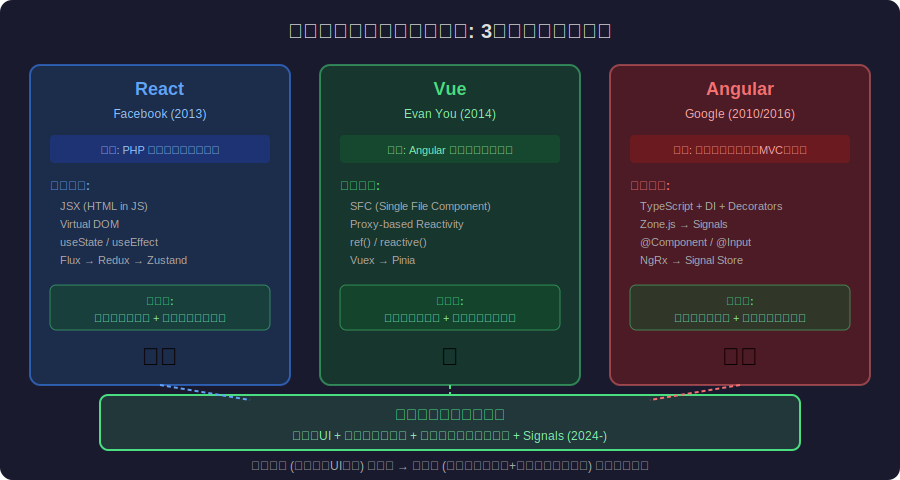
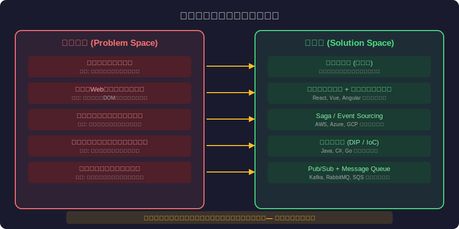
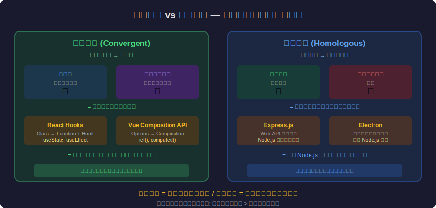

<!-- _class: lead -->
# 収束進化：なぜ異なるチームが同じアーキテクチャに辿り着くのか

- Convergent Evolution × Architecture Patterns
- 
- 問題空間が同じなら、解空間も同じに収束する

---

# Agenda

- - 1. 収束進化とは何か
- - 2. 生物界の収束進化の例
- - 3. ソフトウェアにおける収束進化
- - 4. デザインパターンは「発見」である
- - 5. 収束進化 vs 相同構造
- - 6. アーキテクチャ選定への示唆

---

<!-- _class: lead -->
# 収束進化とは何か

- Chapter 1: What is Convergent Evolution?

---

# 収束進化の定義

- - **収束進化**: 異なる系統の生物が、類似した環境圧に応じて類似した特徴を独立に進化させること
- - 共通の祖先を持たない生物が **同じ形態** に到達する
- - サメ（魚類）とイルカ（哺乳類）: 4億年以上の系統的距離
- - しかし外見は驚くほど似ている: 流線型、背びれ、紡錘形の胴体
- - 理由: **問題空間が同じ** (水中高速移動) → **解も同じ** に収束
- - 物理法則が設計を決定する（流体力学のレイノルズ数）

---

<!-- _class: lead -->
# 生物界の収束進化の例

- Chapter 2: Biological Examples

---

# 独立した起源、同じ解

---

# さらなる収束の例

- <svg viewBox="0 0 800 300" style="max-height:70vh;max-width:100%;display:block;margin:0 auto;" xmlns="http://www.w3.org/2000/svg"><rect width="800" height="300" fill="#1a1a2e"/><text x="400" y="28" fill="#f9a825" font-size="17" font-family="sans-serif" text-anchor="middle" font-weight="bold">収束進化の例：飛翔は4回独立に進化した</text><rect x="20" y="48" width="170" height="220" rx="12" fill="#16213e" stroke="#f9a825" stroke-width="2"/><text x="105" y="75" fill="#f9a825" font-size="13" font-family="sans-serif" text-anchor="middle" font-weight="bold">鳥類</text><text x="105" y="98" fill="#aaaaaa" font-size="11" font-family="sans-serif" text-anchor="middle">Bird Wings</text><text x="105" y="120" fill="#ffffff" font-size="11" font-family="sans-serif" text-anchor="middle">羽毛 + 前肢変形</text><text x="105" y="140" fill="#ffffff" font-size="11" font-family="sans-serif" text-anchor="middle">1億5千万年前</text><text x="105" y="175" fill="#f9a825" font-size="11" font-family="sans-serif" text-anchor="middle">骨格: 中空</text><text x="105" y="193" fill="#f9a825" font-size="11" font-family="sans-serif" text-anchor="middle">空力: 翼型断面</text><text x="105" y="235" fill="#aaaaaa" font-size="10" font-family="sans-serif" text-anchor="middle">系統: 恐竜→鳥類</text><rect x="210" y="48" width="170" height="220" rx="12" fill="#16213e" stroke="#f9a825" stroke-width="1.5"/><text x="295" y="75" fill="#f9a825" font-size="13" font-family="sans-serif" text-anchor="middle" font-weight="bold">コウモリ</text><text x="295" y="98" fill="#aaaaaa" font-size="11" font-family="sans-serif" text-anchor="middle">Bat Wings</text><text x="295" y="120" fill="#ffffff" font-size="11" font-family="sans-serif" text-anchor="middle">皮膜 + 指の延長</text><text x="295" y="140" fill="#ffffff" font-size="11" font-family="sans-serif" text-anchor="middle">5千万年前</text><text x="295" y="175" fill="#f9a825" font-size="11" font-family="sans-serif" text-anchor="middle">骨格: 指が翼骨</text><text x="295" y="193" fill="#f9a825" font-size="11" font-family="sans-serif" text-anchor="middle">空力: 翼型断面</text><text x="295" y="235" fill="#aaaaaa" font-size="10" font-family="sans-serif" text-anchor="middle">系統: 哺乳類</text><rect x="400" y="48" width="170" height="220" rx="12" fill="#16213e" stroke="#e91e63" stroke-width="1.5"/><text x="485" y="75" fill="#e91e63" font-size="13" font-family="sans-serif" text-anchor="middle" font-weight="bold">翼竜</text><text x="485" y="98" fill="#aaaaaa" font-size="11" font-family="sans-serif" text-anchor="middle">Pterosaur (絶滅)</text><text x="485" y="120" fill="#ffffff" font-size="11" font-family="sans-serif" text-anchor="middle">皮膜 + 第4指</text><text x="485" y="140" fill="#ffffff" font-size="11" font-family="sans-serif" text-anchor="middle">2億年前（最古）</text><text x="485" y="175" fill="#e91e63" font-size="11" font-family="sans-serif" text-anchor="middle">骨格: 一本の指</text><text x="485" y="193" fill="#e91e63" font-size="11" font-family="sans-serif" text-anchor="middle">空力: 翼型断面</text><text x="485" y="235" fill="#aaaaaa" font-size="10" font-family="sans-serif" text-anchor="middle">系統: 爬虫類</text><rect x="590" y="48" width="190" height="220" rx="12" fill="#16213e" stroke="#e91e63" stroke-width="1.5"/><text x="685" y="75" fill="#e91e63" font-size="13" font-family="sans-serif" text-anchor="middle" font-weight="bold">昆虫</text><text x="685" y="98" fill="#aaaaaa" font-size="11" font-family="sans-serif" text-anchor="middle">Insect Wings</text><text x="685" y="120" fill="#ffffff" font-size="11" font-family="sans-serif" text-anchor="middle">外骨格の変形</text><text x="685" y="140" fill="#ffffff" font-size="11" font-family="sans-serif" text-anchor="middle">3億5千万年前（最古）</text><text x="685" y="175" fill="#e91e63" font-size="11" font-family="sans-serif" text-anchor="middle">骨格: なし</text><text x="685" y="193" fill="#e91e63" font-size="11" font-family="sans-serif" text-anchor="middle">空力: 翼型断面</text><text x="685" y="235" fill="#aaaaaa" font-size="10" font-family="sans-serif" text-anchor="middle">系統: 節足動物</text><text x="400" y="280" fill="#f9a825" font-size="12" font-family="sans-serif" text-anchor="middle">4系統が独立に → 同じ問題（空中移動）→ 同じ解（翼型断面）に収束</text></svg>
- - **眼の進化**: 独立して **40回以上** 進化した（軟体動物、脊椎動物、節足動物）
- - **翼の進化**: 鳥類、コウモリ、翼竜、昆虫が独立に飛行を獲得
- - **サボテン vs トウダイグサ**: 異なる大陸で同じ多肉植物の形態に
- - **有袋類 vs 有胎盤類**: オオカミ vs タスマニアタイガー（絶滅）
- - 共通点: 環境の **制約条件** が設計の **最適解** を決定する
- - 「自然は同じ問題に同じ答えを何度も見つける」

---

<!-- _class: lead -->
# ソフトウェアにおける収束進化

- Chapter 3: Convergence in Software

---

# フレームワークの収束

---

# アーキテクチャパターンの収束

- - **MVC**: Smalltalk (1979) → Ruby on Rails → Django → Spring → 全フレームワークが採用
- - **Pub/Sub**: IBM MQ (1993) → Kafka → RabbitMQ → SQS → 全メッセージングが採用
- - **Container Orchestration**: Mesos → Docker Swarm → Kubernetes → 全てK8s的に収束
- - **Serverless**: AWS Lambda → Azure Functions → Cloud Functions → 同じモデルに収束
- - **Edge Computing**: CDN → Cloudflare Workers → Vercel Edge → Deno Deploy
- - 異なる企業、異なる時代、異なる技術基盤 → **同じパターン** に到達

---

<!-- _class: lead -->
# デザインパターンは「発見」である

- Chapter 4: Patterns are Discoveries

---

# GoFパターンは「発明」ではなく「収束の記録」

- - Gang of Four (1994): 23のデザインパターンを **記録** した
- - パターンは著者が **発明** したのではなく、各地で **独立に発生** していた
- - Observer Pattern: GUI (Smalltalk) と電話交換機で独立に発生
- - Strategy Pattern: 税計算 (金融) とルート探索 (地図) で独立に発生
- - 「パターンは繰り返し現れる問題への繰り返し現れる解」— Christopher Alexander
- - 収束進化の観点: パターンは **問題空間の物理法則** である

---

# 問題空間が解空間を決定する

---

# なぜ同じ解に辿り着くのか

- <svg viewBox="0 0 800 310" style="max-height:70vh;max-width:100%;display:block;margin:0 auto;" xmlns="http://www.w3.org/2000/svg"><rect width="800" height="310" fill="#1a1a2e"/><text x="400" y="28" fill="#f9a825" font-size="17" font-family="sans-serif" text-anchor="middle" font-weight="bold">なぜ同じ解に辿り着くのか：制約が解空間を絞る</text><rect x="20" y="48" width="360" height="240" rx="12" fill="#16213e" stroke="#f9a825" stroke-width="2"/><text x="200" y="73" fill="#f9a825" font-size="13" font-family="sans-serif" text-anchor="middle" font-weight="bold">問題空間の制約（物理法則）</text><rect x="40" y="88" width="310" height="36" rx="8" fill="#1a1a2e" stroke="#f9a825" stroke-width="1.5"/><text x="195" y="111" fill="#ffffff" font-size="12" font-family="sans-serif" text-anchor="middle">DOM + HTTPの無状態性 + ネットワーク遅延</text><rect x="40" y="132" width="310" height="36" rx="8" fill="#1a1a2e" stroke="#f9a825" stroke-width="1.5"/><text x="195" y="155" fill="#ffffff" font-size="12" font-family="sans-serif" text-anchor="middle">メンテナンス性 + スケーラビリティ要求</text><rect x="40" y="176" width="310" height="36" rx="8" fill="#1a1a2e" stroke="#f9a825" stroke-width="1.5"/><text x="195" y="199" fill="#ffffff" font-size="12" font-family="sans-serif" text-anchor="middle">チームサイズ + 人間の認知限界</text><rect x="40" y="220" width="310" height="36" rx="8" fill="#1a1a2e" stroke="#f9a825" stroke-width="1.5"/><text x="195" y="243" fill="#ffffff" font-size="12" font-family="sans-serif" text-anchor="middle">Conway's Law + 組織構造</text><!-- Arrow pointing to solution --><polygon points="392,168 412,158 412,178" fill="#f9a825"/><line x1="380" y1="168" x2="412" y2="168" stroke="#f9a825" stroke-width="3"/><!-- Solution space --><rect x="420" y="48" width="360" height="240" rx="12" fill="#16213e" stroke="#e91e63" stroke-width="2"/><text x="600" y="73" fill="#e91e63" font-size="13" font-family="sans-serif" text-anchor="middle" font-weight="bold">収束する解（デザインパターン）</text><rect x="440" y="88" width="310" height="36" rx="8" fill="#1a1a2e" stroke="#e91e63" stroke-width="1.5"/><text x="595" y="111" fill="#ffffff" font-size="12" font-family="sans-serif" text-anchor="middle">MVC: データ/表示/ロジックの分離</text><rect x="440" y="132" width="310" height="36" rx="8" fill="#1a1a2e" stroke="#e91e63" stroke-width="1.5"/><text x="595" y="155" fill="#ffffff" font-size="12" font-family="sans-serif" text-anchor="middle">Observer: 状態変化の通知パターン</text><rect x="440" y="176" width="310" height="36" rx="8" fill="#1a1a2e" stroke="#e91e63" stroke-width="1.5"/><text x="595" y="199" fill="#ffffff" font-size="12" font-family="sans-serif" text-anchor="middle">Component: 再利用可能な UI 単位</text><rect x="440" y="220" width="310" height="36" rx="8" fill="#1a1a2e" stroke="#e91e63" stroke-width="1.5"/><text x="595" y="243" fill="#ffffff" font-size="12" font-family="sans-serif" text-anchor="middle">Microservice: Conway's Law 対応</text></svg>
- - **制約条件**: ブラウザのDOM、HTTPの無状態性、ネットワーク遅延
- - **最適化圧力**: パフォーマンス、メンテナンス性、スケーラビリティ
- - **人間の認知限界**: チームサイズ、コードの理解可能性
- - これらの「物理法則」が **解空間を狭める**
- - 十分な時間と反復があれば、どのチームも同じ解に到達する
- - Conway's Law: 組織構造も同様の制約を課す

---

<!-- _class: lead -->
# 収束進化 vs 相同構造

- Chapter 5: Convergent vs Homologous

---

# 2種類の類似性

---

# ソフトウェアでの判別法

- <svg viewBox="0 0 800 310" style="max-height:70vh;max-width:100%;display:block;margin:0 auto;" xmlns="http://www.w3.org/2000/svg"><rect width="800" height="310" fill="#1a1a2e"/><text x="400" y="28" fill="#f9a825" font-size="17" font-family="sans-serif" text-anchor="middle" font-weight="bold">ソフトウェアの2種類の類似性</text><rect x="20" y="48" width="365" height="240" rx="12" fill="#16213e" stroke="#f9a825" stroke-width="2"/><text x="202" y="75" fill="#f9a825" font-size="13" font-family="sans-serif" text-anchor="middle" font-weight="bold">収束進化 (Analogous Structures)</text><text x="202" y="97" fill="#aaaaaa" font-size="11" font-family="sans-serif" text-anchor="middle">異なる起源 → 同じ解</text><!-- React branch --><rect x="40" y="115" width="100" height="40" rx="8" fill="#16213e" stroke="#e91e63" stroke-width="1.5"/><text x="90" y="140" fill="#e91e63" font-size="12" font-family="sans-serif" text-anchor="middle" font-weight="bold">React</text><text x="90" y="172" fill="#aaaaaa" font-size="10" font-family="sans-serif" text-anchor="middle">Facebook</text><!-- Vue branch --><rect x="160" y="115" width="100" height="40" rx="8" fill="#16213e" stroke="#e91e63" stroke-width="1.5"/><text x="210" y="140" fill="#e91e63" font-size="12" font-family="sans-serif" text-anchor="middle" font-weight="bold">Vue</text><text x="210" y="172" fill="#aaaaaa" font-size="10" font-family="sans-serif" text-anchor="middle">個人→Alibaba</text><!-- Angular branch --><rect x="280" y="115" width="100" height="40" rx="8" fill="#16213e" stroke="#e91e63" stroke-width="1.5"/><text x="330" y="140" fill="#e91e63" font-size="12" font-family="sans-serif" text-anchor="middle" font-weight="bold">Angular</text><text x="330" y="172" fill="#aaaaaa" font-size="10" font-family="sans-serif" text-anchor="middle">Google</text><!-- Convergence arrow pointing down --><polygon points="195,196 202,212 209,196" fill="#f9a825"/><line x1="90" y1="155" x2="90" y2="205" stroke="#888" stroke-width="1.5"/><line x1="90" y1="205" x2="202" y2="205" stroke="#f9a825" stroke-width="2"/><line x1="210" y1="155" x2="210" y2="205" stroke="#888" stroke-width="1.5"/><line x1="330" y1="155" x2="330" y2="205" stroke="#888" stroke-width="1.5"/><line x1="330" y1="205" x2="210" y2="205" stroke="#f9a825" stroke-width="2"/><!-- Convergence destination --><rect x="140" y="215" width="130" height="40" rx="8" fill="#f9a825" opacity="0.9"/><text x="205" y="240" fill="#1a1a2e" font-size="12" font-family="sans-serif" text-anchor="middle" font-weight="bold">Component-based UI</text><text x="202" y="268" fill="#f9a825" font-size="11" font-family="sans-serif" text-anchor="middle">内部実装: 全く異なる</text><rect x="415" y="48" width="365" height="240" rx="12" fill="#16213e" stroke="#e91e63" stroke-width="2"/><text x="597" y="75" fill="#e91e63" font-size="13" font-family="sans-serif" text-anchor="middle" font-weight="bold">相同構造 (Homologous Structures)</text><text x="597" y="97" fill="#aaaaaa" font-size="11" font-family="sans-serif" text-anchor="middle">同じ起源 → 派生・分岐</text><!-- Node.js as origin --><rect x="545" y="115" width="110" height="40" rx="8" fill="#f9a825" opacity="0.9"/><text x="600" y="140" fill="#1a1a2e" font-size="12" font-family="sans-serif" text-anchor="middle" font-weight="bold">Node.js</text><!-- Branch to Express, Koa, Fastify --><line x1="600" y1="155" x2="600" y2="185" stroke="#f9a825" stroke-width="2.5"/><line x1="470" y1="185" x2="730" y2="185" stroke="#f9a825" stroke-width="1.5"/><!-- Express --><line x1="470" y1="185" x2="470" y2="205" stroke="#f9a825" stroke-width="1.5"/><rect x="430" y="205" width="90" height="35" rx="8" fill="#16213e" stroke="#e91e63" stroke-width="1.5"/><text x="475" y="227" fill="#e91e63" font-size="11" font-family="sans-serif" text-anchor="middle">Express</text><!-- Koa --><line x1="600" y1="185" x2="600" y2="205" stroke="#f9a825" stroke-width="1.5"/><rect x="555" y="205" width="90" height="35" rx="8" fill="#16213e" stroke="#e91e63" stroke-width="1.5"/><text x="600" y="227" fill="#e91e63" font-size="11" font-family="sans-serif" text-anchor="middle">Koa</text><!-- Fastify --><line x1="730" y1="185" x2="730" y2="205" stroke="#f9a825" stroke-width="1.5"/><rect x="685" y="205" width="90" height="35" rx="8" fill="#16213e" stroke="#e91e63" stroke-width="1.5"/><text x="730" y="227" fill="#e91e63" font-size="11" font-family="sans-serif" text-anchor="middle">Fastify</text><text x="597" y="265" fill="#e91e63" font-size="11" font-family="sans-serif" text-anchor="middle">内部実装: 同じランタイム (V8/Node.js)</text></svg>
- - **収束進化** (Analogous): 異なるコードベースが同じパターンに到達
- - 例: React Hooks と Vue Composition API — 異なる実装、同じ概念
- - **相同構造** (Homologous): 同じコードベースから分岐
- - 例: Node.js → Express, Koa, Fastify — 同じランタイムの派生
- - 判別法: 「内部構造は同じか?」→ No なら収束進化
- - 収束進化で到達したパターンは **より本質的** である（問題が解を決めた証拠）

---

<!-- _class: lead -->
# アーキテクチャ選定への示唆

- Chapter 6: Implications for Architecture

---

# 収束進化から学ぶアーキテクチャ選定

- <svg viewBox="0 0 800 300" style="max-height:70vh;max-width:100%;display:block;margin:0 auto;" xmlns="http://www.w3.org/2000/svg"><rect width="800" height="300" fill="#1a1a2e"/><text x="400" y="28" fill="#f9a825" font-size="17" font-family="sans-serif" text-anchor="middle" font-weight="bold">収束進化から学ぶアーキテクチャ選定フロー</text><!-- Decision tree --><rect x="300" y="45" width="200" height="45" rx="10" fill="#16213e" stroke="#f9a825" stroke-width="2"/><text x="400" y="73" fill="#f9a825" font-size="13" font-family="sans-serif" text-anchor="middle" font-weight="bold">問題空間を分析</text><line x1="400" y1="90" x2="400" y2="115" stroke="#f9a825" stroke-width="2"/><polygon points="395,112 400,127 405,112" fill="#f9a825"/><!-- Two branches --><rect x="100" y="127" width="200" height="45" rx="10" fill="#16213e" stroke="#f9a825" stroke-width="1.5"/><text x="200" y="155" fill="#ffffff" font-size="12" font-family="sans-serif" text-anchor="middle">多数チームが</text><text x="200" y="168" fill="#ffffff" font-size="12" font-family="sans-serif" text-anchor="middle">同じ解に到達</text><rect x="500" y="127" width="200" height="45" rx="10" fill="#16213e" stroke="#e91e63" stroke-width="1.5"/><text x="600" y="155" fill="#ffffff" font-size="12" font-family="sans-serif" text-anchor="middle">誰もやっていない</text><text x="600" y="168" fill="#ffffff" font-size="12" font-family="sans-serif" text-anchor="middle">独自の解</text><line x1="350" y1="127" x2="200" y2="127" stroke="#f9a825" stroke-width="1.5"/><line x1="450" y1="127" x2="600" y2="127" stroke="#e91e63" stroke-width="1.5"/><!-- Results --><line x1="200" y1="172" x2="200" y2="195" stroke="#f9a825" stroke-width="1.5"/><polygon points="195,192 200,207 205,192" fill="#f9a825"/><rect x="80" y="207" width="240" height="60" rx="10" fill="#16213e" stroke="#f9a825" stroke-width="2"/><text x="200" y="232" fill="#f9a825" font-size="13" font-family="sans-serif" text-anchor="middle" font-weight="bold">収束進化の証拠</text><text x="200" y="252" fill="#aaaaaa" font-size="12" font-family="sans-serif" text-anchor="middle">採用を強く推奨</text><line x1="600" y1="172" x2="600" y2="195" stroke="#e91e63" stroke-width="1.5"/><polygon points="595,192 600,207 605,192" fill="#e91e63"/><rect x="480" y="207" width="240" height="60" rx="10" fill="#16213e" stroke="#e91e63" stroke-width="2"/><text x="600" y="232" fill="#e91e63" font-size="13" font-family="sans-serif" text-anchor="middle" font-weight="bold">問題理解が不足?</text><text x="600" y="252" fill="#aaaaaa" font-size="12" font-family="sans-serif" text-anchor="middle">制約条件を再分析</text><text x="400" y="290" fill="#aaaaaa" font-size="11" font-family="sans-serif" text-anchor="middle">「問題空間の制約条件が変われば最適解も変わる」— AI, Edge, Quantum 新制約の出現</text></svg>
- - 1. **問題空間を徹底分析**: 解を探す前に制約条件を理解せよ
- - 2. **多数のチームが辿り着いた解を信頼**: 収束進化の証拠
- - 3. **独自の解に警戒**: 誰もやっていない = 問題の理解が不足?
- - 4. **パターンの「なぜ」を理解**: 制約条件が変われば最適解も変わる
- - 5. **技術選定 ≠ 最新 / 流行**: 問題空間に適したパターンを選ぶ
- - 6. **新しいパターンの出現 = 新しい制約の出現**: AI, Edge, Quantum

---

<!-- _class: lead -->
# まとめ：デザインパターンは自然法則である

- サメとイルカが独立して流線型に進化したように
- React, Vue, Angular は独立してコンポーネントに収束した
- 
- デザインパターンは「発明」ではなく「発見」
- 問題空間の制約が解空間を決定する
- 
- **問題を正しく理解すれば、解は自ずと収束する**

