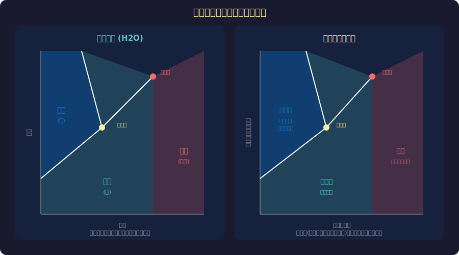
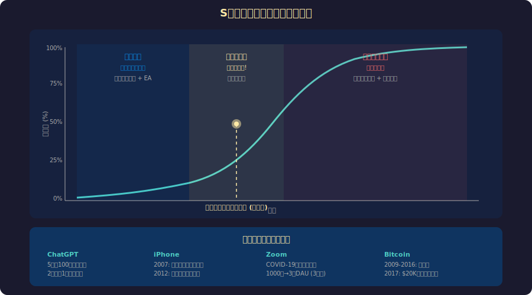
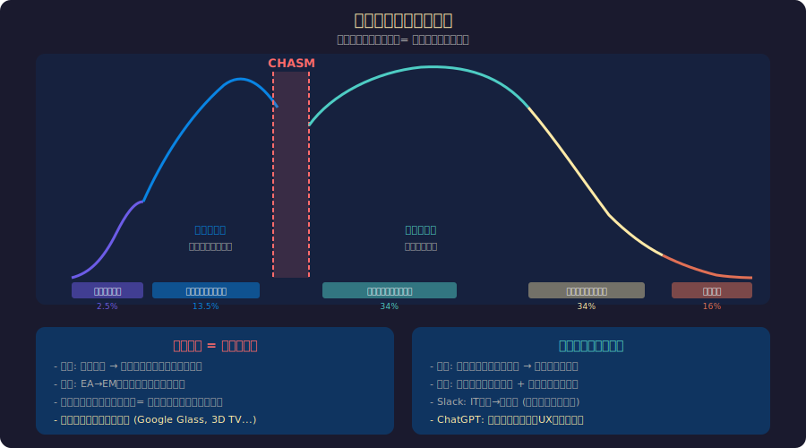

<!-- _class: lead -->
# 相変化：技術普及はなぜ突然起きるのか

- 水が氷になる瞬間 ― そこには「臨界点」がある
- 技術の普及にも同じ物理法則が当てはまる
- なぜiPhoneは突然世界を変え、Google Glassは消えたのか

---

# アジェンダ

- 1. 物理学の相変化（相転移）とは
- 2. S字カーブと臨界点
- 3. 技術普及のキャズム理論
- 4. 相変化の条件：何がトリガーになるか
- 5. 失敗した相変化：なぜ普及しなかったか
- 6. 次の相変化を予測する

---

<!-- _class: lead -->
# 物理学の相変化とは

---

# 水の相変化に学ぶ

- **水は99℃まで「熱い水」だが、100℃で突然「蒸気」になる**
- 温度の変化は連続的だが、状態の変化は不連続（突然起きる）
- 「臨界点」を超えると系全体が一気に変化する
- ---
- 技術の普及も同じパターンを示す：
- ゆっくり、ゆっくり...そして**突然、爆発的に**
- → ヘミングウェイ：「破産は二つの段階で起きる。徐々に、そして突然」

---

# 相変化と臨界現象

---

<!-- _class: lead -->
# S字カーブと臨界点

---

# S字カーブ：技術普及の普遍パターン

---

# なぜS字になるのか ― ネットワーク効果

- **初期（液体の加熱）：** 少数の先駆者が採用。メリットは限定的
- **臨界点（沸点到達）：** 採用者がネットワーク効果の閾値を超える
- 電話：接続先が少なければ無価値 → 一定数を超えると必須に
- **爆発的成長（蒸発）：** 「使わない方がコスト」になる → 全員が採用
- **飽和（蒸気の安定）：** 市場の大部分に浸透、成長率が鈍化
- → **臨界点を超えるまでは「ゆっくり」、超えた後は「一瞬」**

---

<!-- _class: lead -->
# 技術普及のキャズム理論

---

# キャズム = 相変化の不安定領域

---

# キャズムを超えた技術、超えなかった技術

- **キャズムを超えた：**
- iPhone（2007）→ タッチスクリーンが「当たり前」に相変化
- Zoom（2020）→ パンデミックが臨界点のトリガーに
- ChatGPT（2022）→ 2ヶ月で1億ユーザーの史上最速の相変化
- **キャズムで止まった：**
- Google Glass（2013）→ 社会的受容の臨界点に達しなかった
- 3Dテレビ（2010）→ コンテンツ不足で相変化条件を満たせず

---

<!-- _class: lead -->
# 相変化の条件

---

# 技術の相変化を引き起こす4つの条件

- **1. 価格の閾値** ― ムーアの法則でハードウェアコストが臨界点を下回る
- 例：スマートフォンが3万円以下になった瞬間、途上国で爆発的普及
- **2. ネットワーク密度** ― 接続先が十分に増える
- 例：Fax、メール、SNSは「知り合いも使っている」で相変化
- **3. インフラの整備** ― 技術を支える基盤が完成する
- 例：4G回線の普及がモバイル動画（TikTok等）の相変化条件
- **4. 社会的受容** ― 文化的・心理的な抵抗が臨界点以下になる

---

# 外部ショックが相変化を加速する

- **パンデミック（2020）が加速した相変化：**
- リモートワーク：10年かかる普及が2週間で完了
- EC比率：3年分の成長を3ヶ月で達成
- 遠隔医療：規制緩和+需要爆発で一気に普及
- ---
- 物理学でいう**「圧力変化」**に相当
- 温度（技術の成熟度）が同じでも、圧力（外部環境）が変わると沸点が下がる
- → **「準備ができていた技術」が外部ショックで一気に相変化した**

---

<!-- _class: lead -->
# 失敗した相変化

---

# なぜVRはまだ相変化しないのか

- **VR/MRの現状（2025年）：**
- 技術は十分に成熟（Meta Quest 3、Apple Vision Pro）
- しかし普及率は数% ― 相変化は起きていない
- **不足している条件：**
- 価格：Vision Proは$3,499 → 大衆の閾値を超えていない
- コンテンツ：「キラーアプリ」がまだない
- 社会的受容：ゴーグルを着けて生活する文化がない
- → **3つの条件が同時に揃わない限り、相変化は起きない**

---

<!-- _class: lead -->
# 次の相変化を予測する

---

# 2025-2030年に相変化が予測される技術

- **1. 自動運転（レベル4）** ― 技術+規制+保険の三重条件が揃いつつある
- **2. AI エージェント** ― LLMの性能向上+API統合で臨界点が近い
- **3. 量子コンピューティング** ― 商用応用がエラー訂正で実用段階に
- **4. 核融合発電** ― 商用化の時間軸が初めて10年以内に
- ---
- **予測のコツ：** 「技術の成熟度」ではなく「残りの条件は何か」を見る
- → 全条件が揃った瞬間が相変化のタイミング

---

<!-- _class: lead -->
# まとめ

- 技術の普及は**連続的ではなく、相変化のように突然起きる**
- 物理学の臨界現象と同じ構造 ― 条件が揃った瞬間に系全体が変化
- キャズムは相変化の不安定領域 ― 超えるか戻るかの分岐点
- 価格・ネットワーク・インフラ・社会的受容の4条件が鍵
- **問い：** あなたの業界で次の「沸点」はどこにあるか？

---

# 参考文献

- - **書籍:**
- - [Crossing the Chasm - Geoffrey Moore](https://www.amazon.com/dp/0062292986)
- - [The Tipping Point - Malcolm Gladwell](https://www.amazon.com/dp/0316346624)
- - **学術:**
- - [Diffusion of Innovations - Everett Rogers](https://www.amazon.com/dp/0743222091)
- - [Phase Transitions in Social Networks (Science)](https://www.science.org/)

