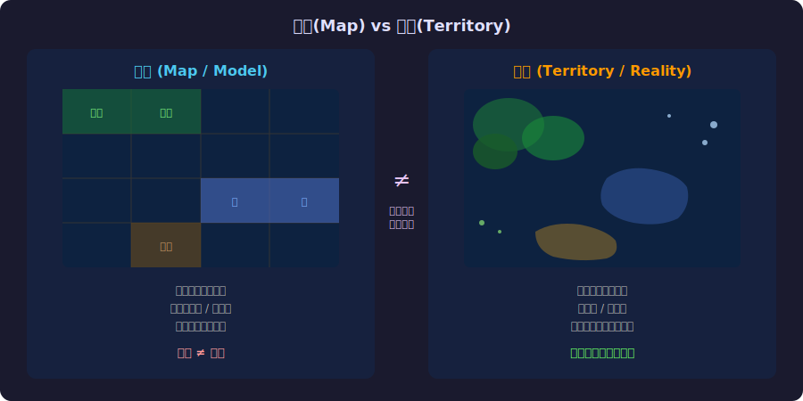
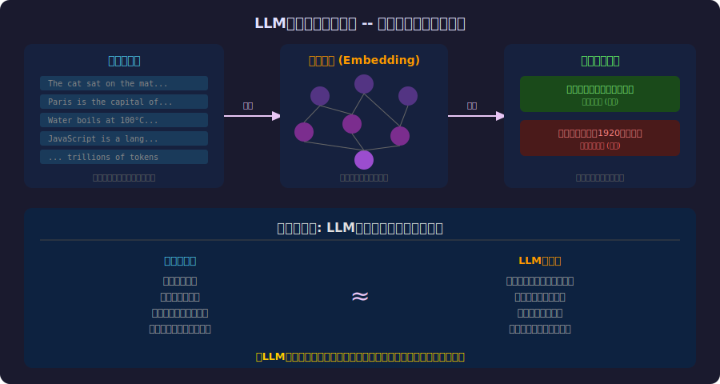
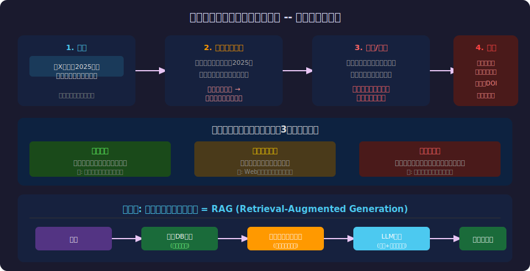

<!-- _class: lead -->
# 地図は領土ではない

- LLMの世界モデルという幻想
- 
- Korzybskiの一般意味論からAIの限界を読み解く

---

# 目次

- - 1. 「地図は領土ではない」-- Korzybskiの洞察
- - 2. 地図 vs 領土の視覚的理解
- - 3. LLMの「世界モデル」とは何か
- - 4. ハルシネーションのメカニズム
- - 5. RAG -- 地図を領土と照合する技術
- - 6. AI時代の認識論的教訓

---

<!-- _class: lead -->
# Korzybskiの洞察

---

# Alfred Korzybski (1879-1950)

- - ポーランド生まれの哲学者・数学者
- - **一般意味論(General Semantics)** の創始者
- - 1931年の論文で有名な命題を提示:
- 
- > **「地図は領土ではない」(The map is not the territory)**
- 
- - 我々の言語・概念・モデルは現実そのものではない
- - あらゆる表現は現実の**抽象化**であり、情報の損失を伴う

---

# 地図 vs 領土

---

# 抽象化の3つの原則

- - **1. 地図は領土のすべてを含まない**
-   - どんなモデルも現実の一部しか表現できない
-   - 必ず情報の取捨選択がある
- - **2. 地図は地図の地図を生む(自己言及)**
-   - モデルについてのモデル → メタ認知の必要性
- - **3. 地図は自己領土的になりうる**
-   - 地図が現実を変えることがある(自己成就予言)

---

<!-- _class: lead -->
# LLMの「世界モデル」

---

# LLMは世界の「地図」を持っている

---

# LLMの「知識」の正体

- - LLMは**テキストの統計的パターン**を学習する
- - 「パリはフランスの首都」を知っているのではなく
- - 「パリ」の後に「フランスの首都」が来る確率が高いことを学習
- - これは**地図**であり**領土(事実)**ではない
- 
- **Stochastic Parrot仮説(Bender et al., 2021)**:
- LLMは意味を理解せず、統計的パターンを再生産する

---

# しかし地図には価値がある

- - 東京の地図は東京そのものではないが、**ナビに使える**
- - LLMの「地図」も同様に有用:
-   - コード補完: パターンの予測が正確
-   - 要約: テキストの構造を捉えている
-   - 翻訳: 言語間のパターン対応を学習
- - 問題は**地図を領土と混同すること**
- 
- 「LLMの出力を事実として扱う」= 地図を領土だと信じる

---

<!-- _class: lead -->
# ハルシネーション

---

# 地図の空白地帯 -- ハルシネーションの構造

---

# 中世の地図との類似

- - 中世の地図製作者は未知の領域に怪物を描いた
- - **"Hic sunt dracones"** (ここにドラゴンがいる)
- - LLMも同じことをしている:
-   - 訓練データにない領域を「パターンで埋める」
-   - 架空の論文、存在しないAPI、偽の統計
-   - 問題: LLMは「ここは空白」とは言わない
- 
- **地図製作者はドラゴンと書いた。LLMは実在する街を描く。**

---

<!-- _class: lead -->
# RAGと検証

---

# RAG -- 地図を領土と照合する

- - **RAG (Retrieval-Augmented Generation)**
- - LLMに回答させる前に外部データベースを検索
- - 最新の「領土」情報をコンテキストとして提供
- - 地図(LLM)+ 領土(外部DB)= より正確な回答
- 
- **地図のメタファーで言えば:**
- GPS(LLM) + 実際の道路状況(リアルタイムデータ) = 正確なナビ

---

# RAGでも解決しない問題

- - **検索結果自体が不正確な場合**
-   - 地図も領土も間違っている
- - **質問が曖昧な場合**
-   - どの地図を使うべきか分からない
- - **推論が必要な場合**
-   - 地図の組み合わせで新しい結論を導く
- - **Korzybskiの教え: どんな地図も完全ではない**

---

<!-- _class: lead -->
# AI時代の認識論

---

# AI時代に必要な3つのリテラシー

- - **1. メタ認知**: 「これは地図であり領土ではない」
-   - LLMの出力を常に「仮説」として扱う
- - **2. 検証能力**: 「この地図は正確か？」
-   - ソースの確認、ファクトチェック、クロスバリデーション
- - **3. 不確実性の受容**: 「地図には空白がある」
-   - 「分からない」ことを認める知的誠実さ

---

# まとめ

- - Korzybskiの「地図は領土ではない」はAI時代の必須教養
- - LLMは世界の「地図」-- 有用だが不完全
- - ハルシネーションは地図の空白地帯を埋める行為
- - RAGは地図を領土と照合する技術
- - 完全な地図は存在しない: 常に検証が必要
- 
- **「地図を信じるな。しかし地図なしに旅はできない。」**

---

# 参考文献

- - **Philosophy:**
- - [Science and Sanity - Alfred Korzybski (1933)](https://en.wikipedia.org/wiki/Science_and_Sanity)
- - [The Map and the Territory - Michel Houellebecq (2010)](https://en.wikipedia.org/wiki/The_Map_and_the_Territory)
- - **AI Research:**
- - [On the Dangers of Stochastic Parrots - Bender et al. (2021)](https://dl.acm.org/doi/10.1145/3442188.3445922)
- - [Retrieval-Augmented Generation - Lewis et al. (2020)](https://arxiv.org/abs/2005.11401)

