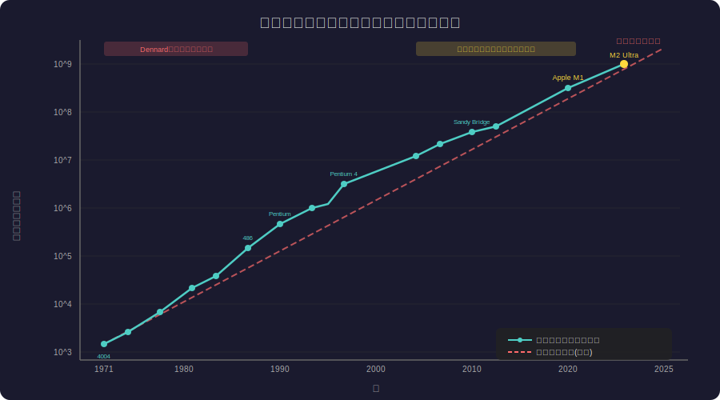
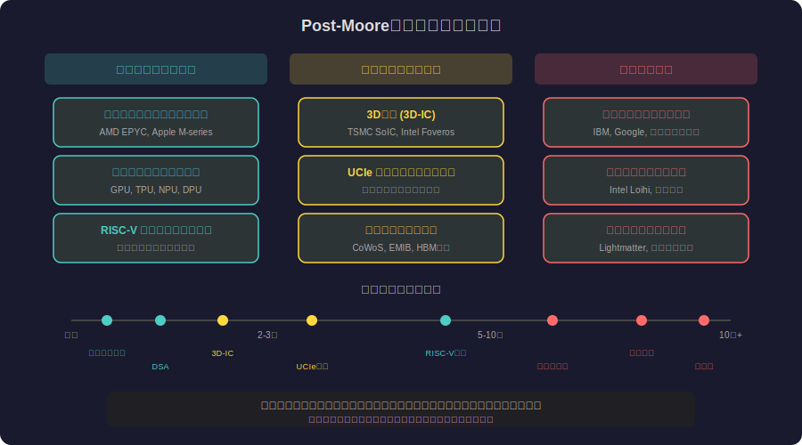

<!-- _class: lead -->
# ムーアの法則の社会学：予言が法則になった日

- 観察が目標に、目標が予言に、予言が神話になった60年の物語
- 
- 半導体産業の「自己実現的予言」を社会学の視点から読み解く

---

# 目次

- 1. ムーアの法則とは何か
- 2. 1965年：経験的観察の誕生
- 3. 社会学的フレームワーク
- 4. Phase 1：観察から目標へ
- 5. Phase 2：産業ロードマップ化
- 6. Phase 3：自己実現的予言

---

# 目次 (2/2)

- 7. Phase 4：神話化と文化的影響
- 8. トランジスタ数の推移
- 9. 変容プロセスの全体像
- 10. 「法則」と呼ばれる理由
- 11. Post-Moore時代の展望
- 12. まとめ：予言の社会学

---

# ムーアの法則とは何か

- **ゴードン・ムーア（1965年）の予測：**
- 「集積回路上のトランジスタ数は約2年で倍増する」
- 
- - 物理法則ではなく**経験的観察**に基づく予測
- - 元の論文：Electronics誌「Cramming more components onto integrated circuits」
- - 当初は1年で2倍 → 1975年に2年で2倍に修正
- - 60年間にわたり半導体産業の「憲法」として機能

---

# 1965年：Electronics誌に掲載された4ページ

- **背景：Fairchild Semiconductor の研究開発部長**
- 
- - データポイント：わずか**4つ**の集積回路の観察
- - 1959年(1素子)→1962年(8素子)→1964年(32素子)→1965年(64素子)
- - 「10年後には65,000素子のチップが実現する」と予測
- - 学会論文ではなく業界誌の招待記事だった
- 
- **社会学的ポイント：科学論文ではなく「業界の合意形成」から始まった**

---

# 社会学的フレームワーク：マートンの自己実現的予言

- **ロバート・K・マートン（1948年）の概念：**
- 
- 「最初の誤った状況定義が、新しい行動を呼び起こし、
- 当初の誤った考えを真実にしてしまう」
- 
- - **銀行取り付け騒ぎ**：「破綻する」という噂 → 預金者が殺到 → 本当に破綻
- - **株式市場バブル**：「上がる」という期待 → 投資集中 → 実際に上昇
- - **ムーアの法則**：「2倍になる」という予測 → 投資集中 → 実際に2倍に

---

# Phase 1：経験的観察（1965-1975）

- **「パターンの発見」段階**
- 
- - ムーアは既存データから**トレンドライン**を引いただけ
- - Fairchild/Intelの社内知見に基づく観察
- - 当時は「面白い仮説」程度の扱い
- - 半導体業界内でのみ認知される
- 
- **重要：この時点では「予測」であり「法則」ではない**

---

# Phase 2：産業目標化（1975-1995）

- **観察から「達成すべきターゲット」への変容**
- 
- - 1977年：カルバー・ミードが「ムーアの法則」と命名
- - 1980年代：半導体産業の**投資計画の基準**に採用
- - 1992年：SIA（米国半導体工業会）がITRSロードマップ策定
- - 各社のR&D予算は「ムーアの法則を維持する」ために配分
- 
- **転換点：記述的観察が規範的目標になった瞬間**

---

# ITRSロードマップ：予言の制度化

- **International Technology Roadmap for Semiconductors**
- 
- - 15年先までの技術目標を「ムーアの法則に沿って」設定
- - 各企業は逆算してR&D計画を策定
- - 「ロードマップに載っていない技術は投資されない」
- 
- **投資規模の変化：**
- - 1970年代：新工場 $1M
- - 1990年代：$1B
- - 2020年代：$20B（TSMCアリゾナ工場）

---

# Phase 3：自己実現的予言（1995-2015）

- **予測が現実を作り出すメカニズム**
- 
- - ムーアの法則を「維持しなければ脱落する」という競争圧力
- - 投資家は「ムーア則に従う企業」に資金を集中
- - 政府も半導体産業支援の根拠として引用
- - **年間$500億以上**のR&D投資が「予測通り」を実現
- 
- **パラドックス：法則が正しいから投資するのではなく、投資するから法則が正しくなる**

---

# トランジスタ数の推移（対数スケール）

---

# なぜ「法則」と呼ばれるのか

- **物理法則との決定的な違い**
- 
| 観点 | 物理法則 | ムーアの法則 |
| --- | --- | --- |
| 根拠 | 自然の性質 | 人間の努力 |
| 普遍性 | 時空に依存しない | 経済・技術条件に依存 |
| 破れる条件 | 新理論が必要 | 投資が止まれば終了 |
| 命名 | 発見者の名前 | 発見者の名前 |
- 
- **名前の力：「法則」という名称が権威と永続性を付与した**

---

# 変容プロセスの全体像

---

# Phase 4：神話化と文化的影響（2015年〜）

- **物理的限界に到達しても「法則」は死なない**
- 
- - Dennardスケーリングは2006年に終了
- - クロック周波数は3-5GHzで頭打ち
- - 微細化は原子レベル（2nm = 原子10個分）に到達
- - しかし「ムーアの法則」はメディアで引用され続ける
- 
- **文化的機能：「技術進歩は指数関数的」という信念体系の基盤**

---

# 神話の社会的機能

- **レヴィ＝ストロースの神話分析の視点から**
- 
- - **秩序付け機能**：混沌とした技術変化に「法則」という秩序を与える
- - **正当化機能**：巨額投資を「法則に従う合理的行動」として正当化
- - **予測機能**：不確実な未来に「指数関数的成長」という物語を提供
- - **動員機能**：産業全体を同じ方向に向かわせる旗印
- 
- **ムーアの法則は半導体産業の「創世神話」として機能している**

---

# ムーアの法則が生んだ副産物

- **「指数関数思考」の一般化**
- 
- - **レイ・カーツワイルの収穫加速の法則**：すべての技術は指数関数的に進歩する
- - **スタートアップ文化**：「10x成長」「指数関数型組織」の正当化根拠
- - **AI楽観論**：計算能力の指数的増大 → AGIは必然、という論理
- - **VC投資モデル**：Power Law分布を前提とした投資戦略
- 
- **危険性：指数関数的成長が「自然法則」として内面化されている**

---

# 反例：ムーアの法則が当てはまらない領域

- **指数関数神話への反証**
- 
- - **バッテリー技術**：50年で密度は5-8倍（ムーア則なら100万倍）
- - **太陽電池効率**：理論限界（Shockley-Queisser限界 ~33%）に漸近
- - **通信帯域幅**：光ファイバーの物理限界（シャノン限界）
- - **ソフトウェア性能**：ハードウェアの指数的向上を相殺（ヴィルトの法則）
- 
- **ムーアの法則の成功は「例外的」であり「普遍的」ではない**

---

# Post-Moore時代の性能向上手法

---

# 社会学から見た教訓

- **予言と現実の相互構成**
- 
- - 技術予測は「中立的な観察」ではなく**社会を動かす力**を持つ
- - 「法則」という命名が予測に**制度的権威**を付与した
- - 自己実現的予言は**成功しすぎると神話化**する
- - 神話化した予測は**反証されても存続**する
- 
- **科学社会学の重要性：技術の「社会的構成」を理解する必要がある**

---

# 次の「ムーアの法則」は何か

- **同様のパターンを示す現代の予測**
- 
- - **スケーリング則（AI）**：「モデルを大きくすれば性能は上がる」
-   - Chinchillaスケーリング → 投資の正当化根拠に
- - **ライトの法則（製造）**：累積生産量が2倍で20%コスト減
-   - テスラのバッテリー戦略の根拠
- - **ギルダーの法則（通信）**：帯域幅は計算能力の3倍速で拡大
- 
- **問い：これらも「自己実現的予言」になるのか？**

---

# まとめ：予言が世界を作る

- **ムーアの法則が教えてくれること**
- 
- - 技術予測は「発見」ではなく**「社会的合意の形成」**である
- - 十分な投資と信念があれば、予測は**自己実現**する
- - 「法則」という名前が持つ**パフォーマティブな力**
- - Post-Moore時代でも「指数関数的成長」の神話は形を変えて存続する
- 
- **「未来を予測する最良の方法は、それを発明することだ」**
- 　　　　　　　　　　　　　　　　　　　— アラン・ケイ

